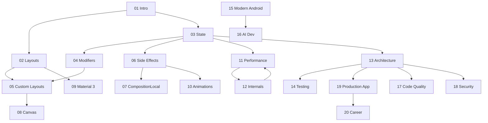

# Learning Path — beginner → advanced

There's one course but three ways through it. Pick your on-ramp, follow the dependency graph, and use the off-ramps to skip what you already own.

---

## Prerequisite check

Before Module 1, you should be able to (in Kotlin) write a data class, a lambda, an extension function, and a basic `suspend` function, and explain what a coroutine is. If two or more are shaky, spend ~1 week on a Kotlin primer first. You do **not** need prior Compose experience.

---

## Module dependency graph

**The critical spine** (do these in order, no skipping): **01 → 03 → 04 → 06 → 11 → 12**. State and the rendering pipeline are load-bearing for everything else.

---

## Track A — Beginner (new to Compose)

Goal: ship a real screen confidently.

1. **Foundations:** 01 → 02 → 03 → 04 (don't rush 03 — it's the heart).
2. **Make it real:** 06 (side effects) → 09 (theming) → 10 (basic animations).
3. **First app:** a small project combining the above.
4. **Then** loop back for 05, 07, 08 as needed.

⛳ **Milestone:** build the Module 02 social feed with hoisted state and a Material 3 theme.

---

## Track B — Intermediate (shipped some Compose)

Goal: stop fighting recomposition; write production-grade screens.

- **Audit your gaps:** 03 (state correctness) → 06 (effects) → 11 (performance).
- **Level up structure:** 13 (architecture) → 14 (testing).
- **Then internals:** 12 to make performance intuition click.
- **Skip-if-known off-ramps:** skim 01, 02 unless rusty.

⛳ **Milestone:** profile a screen in Module 11 and cut recompositions with measured proof.

---

## Track C — Senior / Staff

Goal: design systems, mentor, and pass senior interviews.

- **Internals & perf first:** 12 → 11 (read the 🔴 tiers closely).
- **Architecture at scale:** 13 → 17 (quality) → 18 (security).
- **Multiplatform & future:** 15 → 16 (agentic AI).
- **Capstone + interview:** 19 → 20 (system design).

⛳ **Milestone:** complete the Module 20 system-design playbook and defend an architecture decision with trade-offs.

---

## Off-ramps (safe to skip if…)

| Skip | If you can already… |
|---|---|
| 01 Intro | Explain declarative vs imperative UI cold. |
| 02 Layouts | Build adaptive layouts with Window Size Classes. |
| 04 Modifiers | Predict modifier-order effects without running the app. |
| 09 Material 3 | Set up dynamic color + a full theme from memory. |

**Never skip:** 03 (State), 06 (Side Effects), 11 (Performance), 12 (Internals). These are where most "experienced" devs have silent gaps.

---

## How to know you've actually learned it

After each module, you should pass its **interview questions out loud** and **complete its project without copying**. If you can't, re-read the 🟡/🔴 tiers — don't move on. The course is cumulative; debt compounds.
