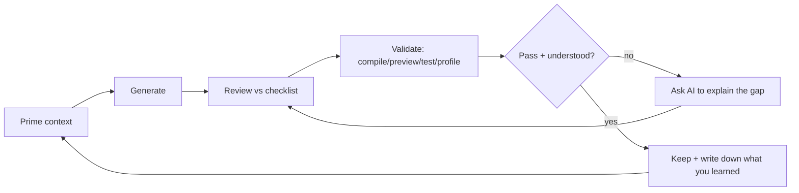
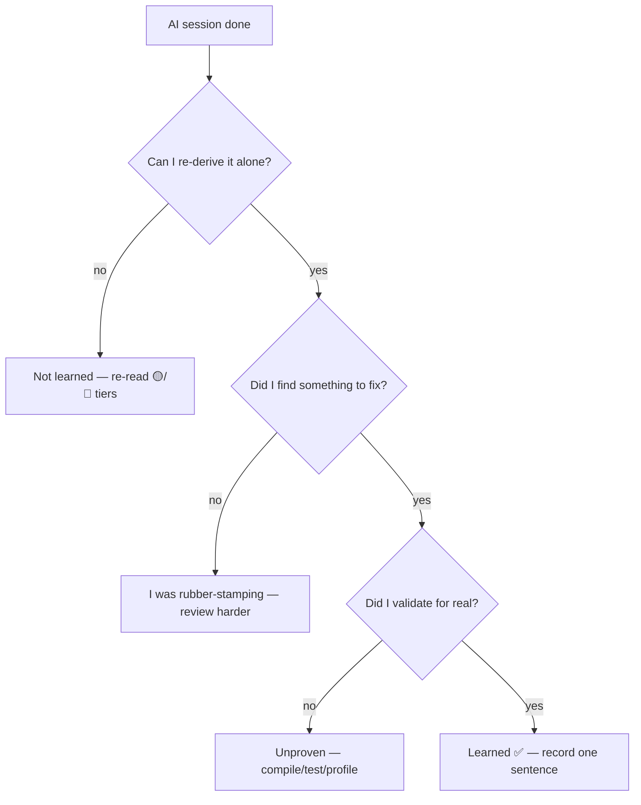

# AI-Assisted Learning Workflows — use AI to *learn*, not to skip learning

> Concrete prompts, a generate → review → validate loop, and the anti-patterns that quietly rot your skills. The whole-course rule in one line: **AI drafts, you decide.** If you can't explain the output, you haven't learned it — and the interview will find out.

**What this is.** A learning companion for every part of the course. For each part you get: the *learning* prompts (not just "write me code" — prompts that make AI *teach*), how to route the output back through the module's best-practices checklist, and the specific traps for that topic. It mirrors the **Section 5 — AI Assistant** discipline every lesson already follows ([Authoring Guide](../AUTHORING-GUIDE.md#section-5--ai-assistant)), and it is the study-time partner to **[Module 16 — AI-Powered Dev](../modules/module-16-ai-powered-dev/README.md)** (which is about *building*).

**Tools this covers.** ChatGPT · Claude / Claude Code · Gemini · Cursor · Windsurf · GitHub Copilot. The prompt *patterns* transfer across all of them; pick whichever you have. Chat tools (ChatGPT/Claude/Gemini) are best for *explaining and quizzing*; IDE agents (Cursor/Windsurf/Copilot/Claude Code) are best for *scaffolding and refactoring against your real code*.

---

## The golden rule: AI is a tutor, not a ghostwriter

```text
        ┌──────────────────────────────────────────────┐
        │  Good:  "Explain X, quiz me, review my code"  │
        │  Bad:   "Do my assignment and hand it back"   │
        └──────────────────────────────────────────────┘
```

The difference between a learner who levels up with AI and one who plateaus is **which verb** they give the model. *Explain. Compare. Critique. Quiz. Trace.* — these build you. *Write. Finish. Do.* — these build the model's reputation, not yours.

> **Mental model:** treat the AI like a brilliant, slightly unreliable senior who will confidently say wrong things. You'd never merge a senior's PR without reading it. Same here.

---

## The universal loop: Generate → Review → Validate

Use this for *every* AI interaction in the course. It's the same loop the lessons teach, applied to learning.



1. **Prime context** — tell the model the target API level, the state model, the constraint, and the 2026 baseline (Kotlin 2.x, Material 3, Strong Skipping, `collectAsStateWithLifecycle`, immutable collections, type-safe Nav, Hilt). A primed prompt gets idiomatic code; a bare prompt gets 2021 code.
2. **Generate** — ask for the draft *and an explanation* of the key decisions.
3. **Review** — run the output against the lesson's **Common Mistakes** and **Best Practices**. This is where learning happens.
4. **Validate** — prove it: it compiles, the `@Preview` renders, the test passes, the profiler agrees. **Never trust un-validated AI output.**
5. **Keep + record** — write one sentence on what you learned. If you can't, loop back.

### A reusable priming preamble (paste at the top of any session)

```text
You are helping me LEARN Jetpack Compose, 2026 edition. Constraints:
- Kotlin 2.x / K2, Compose BOM + Material 3, Strong Skipping on.
- State via StateFlow + collectAsStateWithLifecycle; hoist by default; UDF.
- Immutable collections (kotlinx.collections.immutable) for list state.
- Type-safe Navigation; Hilt for DI. No deprecated APIs without a "// ❌ legacy" note.
Teach, don't just answer: explain the key decision, show the common mistake,
and end by asking me one question to check I understood.
If you are unsure about a current API name/signature, say so — don't guess.
```

---

## Part I — Foundations (Modules 01–04)

> Learning goal: think in `UI = f(state)`, place adaptive layouts, own state correctly, predict modifier order.

### Learning prompts

**Explain (M01 — declarative mindset):**
```text
I know imperative Android Views. Re-explain recomposition by CONTRASTING it with
findViewById/mutate-the-view, using a 4-line side-by-side. Then give me one bug
the imperative style makes easy that declarative makes impossible. Quiz me after.
```

**Compare (M03 — where state lives):**
```text
Give me a decision table: remember vs rememberSaveable vs ViewModel+StateFlow vs
Repository. Columns: survives recomposition? rotation? process death? shared across
screens? For each row, one concrete example. Then ask me to place 3 new scenarios.
```

**Trace (M04 — modifier order):**
```text
Walk me through what Modifier.padding(16.dp).background(Blue) produces vs
.background(Blue).padding(16.dp), step by step as the chain is applied. Draw the
boxes in ASCII. Don't show me the final answer until you've traced each step.
```

**Scaffold against your code (M02 — IDE agent):**
```text
[in Cursor/Windsurf, with the file open] Here's my phone-only feed screen. Add a
Window Size Class branch so Expanded shows list-detail. Keep my keys/contentType.
Explain each change as a comment. Don't touch my ViewModel.
```

### Generate → Review → Validate for Part I

| Step | What to do |
|---|---|
| **Generate** | Ask for the smallest correct example + an explanation of the state model. |
| **Review** | Check the M03 pitfalls: `mutableStateOf` *without* `remember`? derived data stored as separate state? mutable state leaking from a VM? Missing `key`/`contentType` (M02)? Wrong modifier order (M04)? |
| **Validate** | It compiles · the `@Preview` renders · rotate the emulator (values survive) · toggle "Don't keep activities" (survives process death). |

### Anti-patterns (Part I)

- ❌ **Letting AI invent your state model.** Where state lives is *the* skill of Part I; outsource it and you learn nothing. Decide ownership yourself, then ask AI to implement it.
- ❌ **Accepting `var x = mutableStateOf(...)` without `remember`.** Models do this constantly. It resets every recomposition. Catch it.
- ❌ **Hardcoded colors/sizes** the model loves to emit. Route through `MaterialTheme` and `dp`.

---

## Part II — The Rendering Engine (Modules 05–08)

> Learning goal: place children yourself, run effects safely, draw custom pixels — the parts where AI is *least* reliable and review matters *most*.

### Learning prompts

**Explain (M06 — effect choice):**
```text
Give me a flowchart in text: "I need to run X when Y" → which effect API?
Cover LaunchedEffect (and keys), rememberCoroutineScope, DisposableEffect,
SideEffect, produceState, derivedStateOf, snapshotFlow, rememberUpdatedState.
For each, one wrong use and one right use. Then give me 4 scenarios to classify.
```

**Critique my keys (M06 — the #1 effect bug):**
```text
Here's my LaunchedEffect. List EVERY value it captures, and tell me which belong
in the key list and which would cause a stale-closure or a missed re-launch if
omitted. Don't fix it yet — make me find the bug from your analysis.
```

**Trace the layout phase (M05):**
```text
Explain the single-measure rule: why can't a custom Layout measure a child twice?
Then explain what SubcomposeLayout costs to get around it, and give me ONE case
where it's justified and ONE where it's overkill.
```

**Draw math help, reviewed (M08):**
```text
Help me derive the data→pixel mapping for a line chart in DrawScope: given a value
range and a canvas size, the y formula. Then flag any place I'd allocate inside the
draw lambda, and rewrite to cache with drawWithCache. Explain why allocation there hurts.
```

### Generate → Review → Validate for Part II

| Step | What to do |
|---|---|
| **Generate** | Ask for the effect/layout/draw code *plus* the keying or measurement reasoning. |
| **Review** | M06: wrong/missing keys? missing `DisposableEffect.onDispose`? `derivedStateOf` where a plain `remember(key)` was meant? `flatMapMerge` where `flatMapLatest` was meant? M05: double-measure? constraint violation? M08: per-frame allocations? unscaled densities? |
| **Validate** | Compile · log to prove `onDispose`/cancellation runs · Layout Inspector shows no double-measure or constraint violation · profile the draw for allocations. |

### Anti-patterns (Part II)

- ❌ **Trusting effect keys from AI.** This is the single most error-prone area; models frequently emit `LaunchedEffect(Unit)` when the effect should re-run on a key change, or capture a stale value. *Always* re-derive the key list yourself.
- ❌ **Accepting allocations in `draw`.** AI happily news up `Paint`/`Path` per frame. That's jank. Demand `drawWithCache`/`remember`.
- ❌ **Letting AI reach for `SubcomposeLayout`** because it's powerful. It's expensive; make the model justify it over a plain `Layout`.

---

## Part III — Polish & Performance (Modules 09–12)

> Learning goal: theme with roles, animate with the right API, and — critically — **fix performance with data, not the model's guesses.**

### Learning prompts

**Generate a scheme, reviewed (M09):**
```text
From brand color #2E5AAC, propose a Material 3 light+dark colorScheme using ROLES
(primary/secondary/tertiary/surface/container...). Then check each text-on-container
pair against WCAG AA (4.5:1) and flag failures. Don't hardcode colors in components —
show me reading MaterialTheme.colorScheme.* instead.
```

**Compare animation APIs (M10):**
```text
Decision table: animate*AsState vs AnimatedVisibility vs AnimatedContent vs
updateTransition vs Animatable. Columns: interruptible? gesture-driven? coordinates
multiple values? fire-and-forget? Give one canonical use each, then ask me to pick
the API for 4 scenarios.
```

**Explain a compiler report (M12) — verify, don't believe:**
```text
Here's my Compose compiler metrics output (composables.txt). Explain why THIS
composable is marked restartable-but-not-skippable, citing the exact line. Then tell
me the minimal change to make it skippable. I will verify against the metrics — if
you're inferring beyond what the report says, label it as a guess.
```

**Performance triage (M11) — the model proposes, the profiler decides:**
```text
Here's a janky list screen. List the SUSPECTED causes (unstable params, unkeyed
items, reads too high, image decode) as hypotheses ranked by likelihood. For each,
tell me the profiler signal that would CONFIRM it. Do NOT claim a fix works — I'll
measure recomposition counts and Macrobenchmark before/after.
```

### Generate → Review → Validate for Part III

| Step | What to do |
|---|---|
| **Generate** | Ask for hypotheses and reasoning, not verdicts — especially for performance. |
| **Review** | M09: hardcoded colors? missing dark variant? contrast unchecked? M10: non-interruptible animation? main-thread work? M11/M12: a "fix" asserted without a measurement; a stability claim not backed by the metrics file. |
| **Validate** | M09: render light+dark previews, measure contrast. M10: grab the animation mid-flight (interruptible?). **M11: measure recomposition counts + Macrobenchmark P50/P90/P99 before *and* after — the profiler is the source of truth, not the model.** M12: diff the actual metrics. |

### Anti-patterns (Part III)

- ❌ **Letting AI "optimize" by feel.** Performance claims are worthless without numbers. The model cannot run your app. Use it for *hypotheses*; use the **profiler** for *truth*. (This is the cardinal sin of Part III.)
- ❌ **Believing stability explanations un-checked.** A model will confidently explain why something skips. Verify against the *actual* compiler report — it's often subtly wrong about your specific types.
- ❌ **Shipping a generated `colorScheme` without a contrast check.** Pretty palettes fail AA all the time.

---

## Part IV — Production Engineering (Modules 13–16)

> Learning goal: structure clean boundaries, test the right layer, place Compose in 2026, and run agentic workflows *with human gates*.

### Learning prompts

**Scaffold architecture, owned by you (M13):**
```text
I'll define the boundaries; you scaffold. Modules: :app, :core:data, :core:domain,
:core:designsystem, :feature:x. Generate the repository interface (domain) + impl
(data) + one use case + an MVI ViewModel with one immutable UiState and a one-shot
effects channel. Map DTO→domain→UI at boundaries. Explain where each mapping lives.
Flag any place a data model would leak into UI.
```

**Generate tests that aren't brittle (M14):**
```text
Write Compose UI tests for this screen against the SEMANTICS tree (by role/text/
contentDescription/testTag) — never by index or coordinates. And a ViewModel test
with Turbine asserting the STATE SEQUENCE, not just the final value. Point out any
assertion that would be flaky and why.
```

**Scope a migration (M15):**
```text
I'm considering Compose Multiplatform for these 3 screens. Give me a shared-vs-
platform breakdown, the top 3 risks, and what K2/Kotlin 2.x changes for the build.
Be honest about where CMP costs more than it saves.
```

**Run the agent loop (M16) — keep the gates:**
```text
Act as the PLANNER only. Break "favorites with offline sync" into a task list with
acceptance criteria per task. Stop. I'll review before you architect. (Then run
architect → coder → reviewer as separate turns, with me approving each handoff.)
```

### Generate → Review → Validate for Part IV

| Step | What to do |
|---|---|
| **Generate** | Define boundaries/tasks yourself; let AI fill in scaffolding within them. |
| **Review** | M13: dependency rule violated? DTO leaking into UI? more than one `UiState`? one-shot effect stored in state? M14: selectors by index/position? non-deterministic screenshot inputs? assertions on the final value only? M16: did you actually gate each handoff, or did the agent run end-to-end unchecked? |
| **Validate** | M13: compile across modules; confirm domain has no Android imports. M14: run the suite green in CI; intentionally break the UI to confirm a test fails. M16: every accepted diff is read and explained. |

### Anti-patterns (Part IV)

- ❌ **Letting the agent design the architecture.** *You* set boundaries; AI fills them. An agent that invents your module graph teaches you nothing and usually leaks models across layers.
- ❌ **Brittle generated tests.** Models love `onNodeWithText` selectors that break on copy changes and screenshot tests with `System.currentTimeMillis()` in them. Demand semantics + determinism.
- ❌ **Vibe-merging agent output.** The entire point of M16 is *gates*. If you merged code you can't explain, you skipped the lesson.

---

## Part V — Craft & Capstone (Modules 17–20)

> Learning goal: keep the code healthy, secure it (never trust AI on crypto), ship the capstone, and prep interviews honestly.

### Learning prompts

**AI review against your rules (M17):**
```text
Review this composable for Compose smells: god composable, business logic in UI,
state in the wrong place, modifier soup, magic numbers. Map each finding to a
principle (SOLID/KISS/DRY/YAGNI). Then tell me which smells static analysis (Detekt/
Ktlint/Lint) would MISS and why — so I know what only human review catches.
```

**Threat-model, then verify (M18) — high stakes:**
```text
Threat-model this login+token feature against the OWASP Mobile Top 10. For each
relevant risk, propose an Android-specific mitigation. IMPORTANT: I will verify every
crypto/storage claim against current official platform guidance — flag anything you're
not certain is current, and never invent an API name for Keystore/encryption.
```

**Mock interviewer (M20):**
```text
Be a senior Android interviewer. Ask me to design an offline-first image feed.
Probe my answer like a skeptic: source of truth? error/empty states? cache eviction?
scaling? Don't give me the answer — grade me against a rubric at the end and name
two things to improve.
```

**Capstone phase gate (M19):**
```text
Review my data layer for the capstone: is the local DB truly the single source of
truth (UI never reads network directly)? Does sync handle conflicts? List what's
missing before I move to the domain layer. Don't write the next phase — gate this one.
```

### Generate → Review → Validate for Part V

| Step | What to do |
|---|---|
| **Generate** | Ask AI to *review* and *interrogate*, not to author security or final answers. |
| **Review** | M17: did AI "approve" a real smell? M18: any invented API, any hardcoded secret, any claim not backed by official docs? M19: any UI reading the network directly; any unhandled state. M20: did you accept the model's flattery, or did it actually pressure-test you? |
| **Validate** | M17: Detekt/Ktlint/Lint clean in CI. **M18: verify every crypto/storage detail against current platform docs — AI is least trustworthy here.** M19: offline run, process-death, all states, CI green, baseline profile shipped. M20: re-answer out loud without the AI. |

### Anti-patterns (Part V)

- ❌ **Trusting AI on cryptography or secure storage.** This is the most dangerous outsourcing in the course. Models hallucinate Keystore/encryption APIs and "secure" patterns that aren't. *Always* verify against official, current platform guidance. (M18 says this explicitly: never trust it blindly on crypto.)
- ❌ **Letting AI "approve" your code.** An AI review that rubber-stamps a god composable is worse than no review. Cross-check its findings against the module's smell list.
- ❌ **Outsourcing the interview prep itself.** If AI generates *and* answers your practice questions, you've rehearsed nothing. Make it ask; *you* answer; then grade.

---

## The "did I actually learn it?" checkpoint

After any AI-assisted session, you pass only if **all** are true. This is the firewall against skill rot:

- [ ] I can **re-derive** the key decision without the AI in the room.
- [ ] I **found at least one thing to fix or reject** in the output (if everything was perfect, I wasn't reviewing).
- [ ] I **validated** it for real — compiled / previewed / tested / profiled — not just read it.
- [ ] I can **pass the module's interview questions out loud**.
- [ ] I wrote **one sentence** on what I learned (retrieval beats recognition).



---

## Tool cheat-sheet for *learning* (not just coding)

| Tool | Best learning use | Watch out for |
|---|---|---|
| **ChatGPT / Claude / Gemini** (chat) | Explaining concepts, decision tables, quizzing, mock interviews, reviewing pasted code | Confident wrong API names; stale (pre-2026) idioms — prime with the preamble |
| **Claude Code** (terminal agent) | Multi-file scaffolds, refactors against your repo, running the test gate as validation | Will happily run end-to-end — *you* set the gates |
| **Cursor / Windsurf** (IDE agents) | In-context edits, "explain this selection", test generation against real files | Brittle test selectors; edits beyond the scope you asked for |
| **GitHub Copilot** (inline) | Boilerplate completion, learning idioms by accepting/rejecting suggestions | Accepting suggestions you don't understand — read before Tab |

> Whatever the tool: **prime the context, ask it to teach, review against the checklist, validate for real, and keep only what you can explain.** That loop turns AI from a crutch into a tutor.

---

## Cross-links

- The *building* counterpart: **[Module 16 — AI-Powered Dev](../modules/module-16-ai-powered-dev/README.md)** (the agentic build loop).
- Per-module AI sections (every lesson has one) — start with the exemplar, **[Module 03](../modules/module-03-state-management/README.md)**.
- Apply the loop on real work: **[practice projects](practice-projects.md)** · **[assignments](assignments.md)** (see A16 especially).
- The team-scale version of these guardrails: **[enterprise best practices](enterprise-best-practices.md)**.
- See how the concepts connect before you quiz yourself: **[mind maps](mind-maps.md)**.
