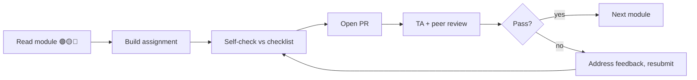

# Assignments — one per module, built for a cohort

> A graded assignment for every module. Each is scoped to one or two sittings, maps to that module's outcomes, and ships with an explicit acceptance checklist a TA can grade fast.

**Who this is for.** Cohort instructors and self-learners who want a tighter, gradeable unit than the full [practice projects](practice-projects.md). Assignments are smaller and more *diagnostic*: each targets the one thing the module exists to teach. Do the assignment, and you've proven the module's core skill.

**How grading works.** Each assignment is scored on a **0–4 rubric** per criterion (0 missing · 1 attempted · 2 works · 3 idiomatic · 4 production-grade). Pass = average ≥ 2.5 with nothing at 0. Submit as a PR to your cohort repo; a TA reviews against the checklist.

**Cohort logistics (suggested cadence).**

| Item | Convention |
|---|---|
| Cadence | One assignment per module-week (see the [weekly study plan](../course/weekly-study-plan.md)). |
| Submission | PR per assignment, branch `assignment/MNN-yourname`. |
| Review | TA review against the checklist; peer review on one classmate's PR. |
| Late policy | Spine modules (03, 06, 11, 12) are non-droppable; the rest allow one drop. |
| Honor rule | AI may draft; **you must be able to explain every line.** Unexplained code = incomplete. |

**Baseline for all submissions.** Kotlin 2.x/K2 · Compose BOM + Material 3 · Strong Skipping · `collectAsStateWithLifecycle` · immutable collections · type-safe Navigation · Hilt · `StateFlow`/UDF. No unlabeled deprecated APIs. ([Authoring Guide](../AUTHORING-GUIDE.md#tech-baseline-keep-code-honest).)

---

## Part I — Foundations

### A01 — "Translate the screen" (Module 01)
*Module:* [01 — Introduction](../modules/module-01-introduction/README.md) · *Outcome tested:* imperative → declarative mindset · *Est:* 1–2 hrs

**Tasks**
1. You're given an imperative XML screen (a settings row list with a header, a toggle, and a save button) plus its `Activity` that mutates views via `findViewById`.
2. Re-express it as a single `@Composable` whose appearance is a pure function of a `SettingsState` data class.
3. Write a short "what changed" note: pick three imperative lines from the original and explain what each *was* doing vs how the declarative version expresses the same thing.

**Acceptance checklist**
- [ ] No imperative view mutation remains; toggling updates *state*, UI re-derives.
- [ ] All UI values flow from one `SettingsState`.
- [ ] Colors/typography come from `MaterialTheme`, not literals.
- [ ] The "what changed" note correctly contrasts three lines.

**Rubric:** Declarative correctness `/4` · State modeling `/4` · Written explanation `/4`.
**Cohort discussion prompt:** "Name one bug the imperative version made *easy* that the declarative version makes *impossible*."

---

### A02 — "One screen, three form factors" (Module 02)
*Module:* [02 — Layouts](../modules/module-02-layouts/README.md) · *Outcome tested:* adaptive layout + correct lazy lists · *Est:* 4–6 hrs

**Tasks**
1. Build a content feed screen (image + title + subtitle cards) from the provided mockup.
2. Make it adaptive: single column on Compact, list-detail on Expanded, using `WindowSizeClass`.
3. Use a `LazyColumn`/`LazyVerticalGrid` with **stable keys** and **`contentType`**.
4. Wire a `Scaffold` (top bar + FAB) and handle insets.

**Acceptance checklist**
- [ ] Every lazy item has a `key` and a `contentType`.
- [ ] Layout reflows at the WSC breakpoints (verified on a resizable emulator), no hardcoded widths.
- [ ] Expanded shows list-detail; Compact shows a single pane.
- [ ] Content respects system bar insets.

**Rubric:** Adaptivity `/4` · Lazy-list correctness `/4` · Scaffold/insets `/4`.
**Cohort discussion prompt:** "Why does a missing `key` cause wrong animations and lost scroll position — what is Compose doing under the hood?"

---

### A03 — "Where does this state live?" (Module 03 · the spine)
*Module:* [03 — State Management](../modules/module-03-state-management/README.md) · *Outcome tested:* hoisting, UDF, single source of truth · *Est:* 5–7 hrs

**Tasks**
1. Build a profile form (name/email/bio + validation) that survives **rotation and process death** via `rememberSaveable` (with a custom `Saver`).
2. Build a cart screen through a `ViewModel` exposing exactly one immutable `CartUiState`; the total is **derived**.
3. Refactor every leaf composable to be stateless (`value` + `onValueChange`).
4. Add an "undo" one-shot effect through a `Channel` (not stored in state).

**Acceptance checklist**
- [ ] No value resets on rotation or "Don't keep activities".
- [ ] Cart total is derived, never duplicated as state.
- [ ] Exactly one `StateFlow<UiState>`; no mutable state leaks from the VM.
- [ ] One-shot "undo" fires once, never re-fires on recomposition/rotation.

**Rubric:** State ownership `/4` · Saveable correctness `/4` · UDF/single-source `/4` · One-shot effect `/4`.
**Cohort discussion prompt:** "A teammate stores the cart total in its own `mutableStateOf`. Show the exact sequence of events that makes it drift."
**Peer-review focus:** hunt for any state that could be derived but is stored.

---

### A04 — "Order matters" (Module 04)
*Module:* [04 — Modifiers](../modules/module-04-modifiers/README.md) · *Outcome tested:* modifier order + custom pointer input · *Est:* 4–6 hrs

**Tasks**
1. Produce a 6-case "modifier order gallery": for three pairs (`padding`↔`background`, `clip`↔`border`, `size`↔`requiredSize`), render both orders side by side and annotate the difference.
2. Build a swipe-to-reveal action row on **raw `pointerInput`** (drag to reveal delete/archive under a card), with an interruptible spring-back.
3. Ensure pointer events are consumed so a parent scroll can't steal the gesture.

**Acceptance checklist**
- [ ] All six order cases render and each difference is correctly annotated.
- [ ] Swipe tracks the finger 1:1; release snaps to reveal or back; the animation is interruptible.
- [ ] Handled pointer events call `consume()`.
- [ ] Modifier order in the card is deliberate and commented.

**Rubric:** Order understanding `/4` · Gesture correctness `/4` · Consume/interruptibility `/4`.
**Cohort discussion prompt:** "Why does `Modifier.padding().background()` paint a smaller box than `Modifier.background().padding()`?"

---

## Part II — The Rendering Engine

### A05 — "Place it yourself" (Module 05)
*Module:* [05 — Custom Layouts](../modules/module-05-custom-layouts/README.md) · *Outcome tested:* measure/place API + single-measure rule · *Est:* 6–8 hrs

**Tasks**
1. Write a custom `Layout` `StaggeredGrid` that places each child in the currently-shortest column.
2. Write a second layout that uses `SubcomposeLayout` because one child's size depends on another (e.g. a caption sized to a measured image).
3. Author one custom `Modifier.Node` factory for a reusable measurement tweak.

**Acceptance checklist**
- [ ] Each child measured exactly once (single-measure rule holds; no double-measure warning).
- [ ] No constraint violations in Layout Inspector; nothing placed out of bounds.
- [ ] The staggered grid balances columns with uneven heights.
- [ ] The `SubcomposeLayout` use is justified (a plain `Layout` couldn't do it).

**Rubric:** Measure/place correctness `/4` · Staggered balancing `/4` · Subcompose justification `/4`.
**Cohort discussion prompt:** "Why does Compose forbid measuring a child twice, and what does `SubcomposeLayout` cost to get around it?"

---

### A06 — "Effects without leaks" (Module 06 · the spine)
*Module:* [06 — Side Effects](../modules/module-06-side-effects/README.md) · *Outcome tested:* right effect, right key, no leaks · *Est:* 4–6 hrs

**Tasks**
1. Build a debounced search screen: query → ~300 ms debounce → cancellable query → results, all states rendered.
2. Use `flatMapLatest` so a new query cancels the in-flight one.
3. Register a listener with `DisposableEffect` and prove `onDispose` runs.
4. Capture a callback in a long-lived effect with `rememberUpdatedState` so it doesn't restart on every change.

**Acceptance checklist**
- [ ] Fast typing fires one query after you stop, not one per keystroke.
- [ ] Query change cancels the previous request (`flatMapLatest`, not `Merge`).
- [ ] The `DisposableEffect` cleanup runs (logged on leave).
- [ ] Collected lifecycle-aware; loading/empty/error/results all handled.

**Rubric:** Debounce/cancellation `/4` · Effect keying `/4` · Cleanup correctness `/4` · State completeness `/4`.
**Cohort discussion prompt:** "When does an unkeyed `LaunchedEffect` leak or do stale work — give a concrete failure."
**Peer-review focus:** check every effect's key list and every `DisposableEffect`'s `onDispose`.

---

### A07 — "Provide, don't drill" (Module 07)
*Module:* [07 — CompositionLocal](../modules/module-07-compositionlocal/README.md) · *Outcome tested:* implicit deps + static vs dynamic choice · *Est:* 3–4 hrs

**Tasks**
1. Define `LocalAppLocale` (toggles at runtime) and `LocalExtendedColors` (brand tokens). Choose `compositionLocalOf` vs `staticCompositionLocalOf` for each and justify.
2. Provide both at the app root; consume them in a deeply nested composable with **no** intermediate forwarding.
3. Add a settings toggle that flips the locale; verify only the readers recompose.
4. Write a 4–5 sentence note on the testability cost and when DI would be better.

**Acceptance checklist**
- [ ] `static` vs dynamic choice is correct and justified (dynamic for the toggling locale).
- [ ] No prop-drilling; intermediates don't mention the values.
- [ ] Toggling recomposes only readers (not the whole tree).
- [ ] The trade-off note is concrete (names the hidden-dependency cost).

**Rubric:** Static/dynamic reasoning `/4` · No-drilling implementation `/4` · Trade-off note `/4`.
**Cohort discussion prompt:** "Why is a `staticCompositionLocalOf` that *does* change a performance footgun?"

---

### A08 — "Draw it from data" (Module 08)
*Module:* [08 — Canvas](../modules/module-08-canvas-graphics/README.md) · *Outcome tested:* draw phase + density-correct, allocation-free drawing · *Est:* 5–7 hrs

**Tasks**
1. Build a custom line/bar chart from a data list: map data → pixels, draw axes + gridlines, label them with a `TextMeasurer`.
2. Add a draggable crosshair (`pointerInput`) that reads the value under it.
3. Cache paths/measurers with `drawWithCache`/`remember`; transform with `graphicsLayer`.

**Acceptance checklist**
- [ ] Zero per-frame allocations in the draw lambda (paths/measurers cached).
- [ ] All sizes density-correct (`dp`/`sp` → px; no raw pixel literals).
- [ ] Labels measured, never clipped.
- [ ] Crosshair reads the correct value; reads deferred to the draw phase.

**Rubric:** Draw correctness `/4` · Allocation hygiene `/4` · Density correctness `/4`.
**Cohort discussion prompt:** "Why is reading state inside the `drawBehind` lambda cheaper than reading it in composition?"

---

## Part III — Polish & Performance

### A09 — "A real design system" (Module 09)
*Module:* [09 — Material 3 Theming](../modules/module-09-material3-theming/README.md) · *Outcome tested:* color roles + dynamic color + dark mode · *Est:* 3–4 hrs

**Tasks**
1. Build a `MaterialTheme` wrapper with full color scheme, type scale, and shape scale.
2. Render a component gallery (buttons, cards, chips, text fields, top bar, FAB) — every component reads color **roles**, never literals.
3. Wire dynamic color on 12+ with a static brand fallback below.
4. Verify body-on-container contrast meets WCAG AA (4.5:1).

**Acceptance checklist**
- [ ] No hardcoded `Color(0xFF…)` in components; all `MaterialTheme.colorScheme.*`.
- [ ] Light and dark both correct (two `@Preview`s).
- [ ] Dynamic color on 12+, graceful fallback below (no crash).
- [ ] Measured AA contrast on body text.

**Rubric:** Role usage `/4` · Dynamic color/fallback `/4` · Dark mode + contrast `/4`.
**Cohort discussion prompt:** "Why do color *roles* survive a theme swap that hardcoded colors don't?"

---

### A10 — "The right animation" (Module 10)
*Module:* [10 — Animations](../modules/module-10-animations/README.md) · *Outcome tested:* API selection + interruptible, shared-element motion · *Est:* 6–8 hrs

**Tasks**
1. Build a list → detail flow with a **shared-element** image/title transition (`SharedTransitionLayout`).
2. Add an onboarding pager using `AnimatedContent` with a sensible `transitionSpec`.
3. Add a shimmer loader (`rememberInfiniteTransition`) and one gesture-driven, interruptible motion (`Animatable`).
4. For each of the four, state in a comment *why* that API (value/visibility/content/gesture).

**Acceptance checklist**
- [ ] Shared-element bounds match across destinations (no flash/jump).
- [ ] Every animation is interruptible; no per-frame allocations on the hot path.
- [ ] The API choice is justified for each of the four cases.
- [ ] Animations run off the main thread (no blocking work).

**Rubric:** Shared element `/4` · API selection reasoning `/4` · Interruptibility/perf `/4`.
**Cohort discussion prompt:** "When does `Animatable` beat `animate*AsState`, and why can't you interrupt the latter cleanly?"

---

### A11 — "Prove the fix" (Module 11 · the spine)
*Module:* [11 — Performance](../modules/module-11-performance/README.md) · *Outcome tested:* profiling + stability + measured wins · *Est:* 6–8 hrs

**Tasks**
1. You're given a janky list screen (unkeyed, unstable items, reads state too high, decodes images badly).
2. Profile it: capture recomposition counts (Layout Inspector / composition tracing).
3. Fix it: stability (`@Immutable` + `ImmutableList`), keys + `contentType`, deferred reads, Coil sizing.
4. Generate and ship a baseline profile; re-measure with Macrobenchmark.
5. Write a **before/after report** attributing each win to a cause.

**Acceptance checklist**
- [ ] Report shows measured before/after recomposition counts for the same interaction.
- [ ] Macrobenchmark frame timing (P50/P90/P99) improves — not "feels faster".
- [ ] Each fix attributed to a named cause.
- [ ] Baseline profile generated and shipped; startup measured.

**Rubric:** Profiling rigor `/4` · Stability fixes `/4` · Measured improvement `/4` · Baseline profile `/4`.
**Cohort discussion prompt:** "Show one composable that recomposes too often and explain the exact unstable parameter causing it."
**Peer-review focus:** every claim in the report must point to a number.

---

### A12 — "Explain the skip" (Module 12 · the spine)
*Module:* [12 — Internals](../modules/module-12-internals/README.md) · *Outcome tested:* compiler/runtime mental model from real metrics · *Est:* 4–6 hrs

**Tasks**
1. Enable Compose compiler metrics on a small module.
2. Pick three composables: stable/skippable, unstable/restartable, and one with an unstable lambda. For each, write a short explainer grounded in the **actual** report line.
3. In your own words, explain the slot table and the snapshot system using one course mental model (city / database / OS).
4. Diff the metrics before/after adding `@Immutable` to one model and explain the delta.

**Acceptance checklist**
- [ ] Every "this restarts because X" claim cites a real metrics line.
- [ ] You correctly explain why `List` is unstable but `ImmutableList` is stable.
- [ ] You state what Strong Skipping changed.
- [ ] One mental model used coherently for the runtime.

**Rubric:** Metrics-grounded reasoning `/4` · Stability explanation `/4` · Runtime mental model `/4`.
**Cohort discussion prompt:** "Walk the group through what the compiler rewrites a `@Composable` into, using your metrics output as the script."

---

## Part IV — Production Engineering

### A13 — "Boundaries that hold" (Module 13)
*Module:* [13 — Architecture](../modules/module-13-architecture/README.md) · *Outcome tested:* Clean Architecture + MVI + module boundaries · *Est:* 8–10 hrs

**Tasks**
1. Lay out `:app`, `:core:*`, and two `:feature:*` modules.
2. Implement one feature end-to-end: repository (SSOT) → use case → MVI screen (one immutable `UiState`, events in, effects out).
3. Map data models at each boundary; keep domain Android-free.
4. Navigate between features with type-safe Navigation.

**Acceptance checklist**
- [ ] Dependency rule holds: domain depends on nothing Android; UI/data depend on domain.
- [ ] No DTO/entity leaks into UI; mapping at boundaries.
- [ ] One immutable `UiState` per screen; one-shot effects via channel/`SharedFlow`.
- [ ] Feature modules depend only on `:core:*`, not each other.

**Rubric:** Boundary correctness `/4` · MVI/state model `/4` · Mapping discipline `/4` · Navigation `/4`.
**Cohort discussion prompt:** "Why must dependencies point inward — what breaks the day a DTO leaks into a composable?"

---

### A14 — "Test the right layer" (Module 14)
*Module:* [14 — Testing](../modules/module-14-testing/README.md) · *Outcome tested:* test pyramid + semantics-based UI tests · *Est:* 6–8 hrs

**Tasks**
1. Take your A13 feature (or A06 search). Unit-test the ViewModel/state flow with Turbine + MockK + `runTest`.
2. Write Compose UI tests against the **semantics tree** (finders by role/text/contentDescription/testTag).
3. Add one screenshot test (deterministic: fixed time/locale, animations off).
4. Add one macrobenchmark (startup or scroll).

**Acceptance checklist**
- [ ] ViewModel tests assert the **state sequence** (Turbine), not just final value.
- [ ] UI tests select by semantics, never by index/coordinates.
- [ ] Screenshot test renders deterministically.
- [ ] Macrobenchmark runs; the suite is green in CI.

**Rubric:** State tests `/4` · Semantics UI tests `/4` · Screenshot determinism `/4` · Macrobenchmark `/4`.
**Cohort discussion prompt:** "Name two assertions that look reasonable but make a Compose test flaky."
**Peer-review focus:** flag any selector tied to position or any non-deterministic screenshot input.

---

### A15 — "Place Compose in 2026" (Module 15)
*Module:* [15 — Modern Android 2026](../modules/module-15-modern-android-2026/README.md) · *Outcome tested:* multiplatform / new-surface judgment · *Est:* 5–7 hrs

**Tasks**
1. Pick one: extract a screen into a **Compose Multiplatform** shared module (Android + desktop), *or* port a feature to **Wear OS** / **desktop**.
2. Get it running on the second target.
3. Write a trade-off memo: what's shared vs platform-specific, what K2 changed for your build, and one thing that did **not** port cleanly.

**Acceptance checklist**
- [ ] The shared/ported code runs on the second target.
- [ ] No Android-only API leaks into `commonMain` (if CMP).
- [ ] The memo names exactly what's shared vs platform-specific and one non-portable thing.
- [ ] The K2/Kotlin 2.x build change is correctly described.

**Rubric:** Runs on second target `/4` · Shared/platform separation `/4` · Trade-off memo `/4`.
**Cohort discussion prompt:** "When does shared UI *cost* more than it saves — give a concrete example from your spike."

---

### A16 — "Drive the agents" (Module 16)
*Module:* [16 — AI-Powered Dev](../modules/module-16-ai-powered-dev/README.md) · *Outcome tested:* agentic workflow with human gates · *Est:* 5–7 hrs

**Tasks**
1. Pick a self-contained feature (e.g. "favorites with offline sync").
2. Drive an AI agent through planner → architect → coder → reviewer → human, with you as the gate at each handoff.
3. Keep a log: each role's prompt, the diff produced, your accept/reject decision + reason. **Reject at least one thing** and say why.
4. The final feature must pass the relevant module's best-practices checklist **and** tests before merge.

**Acceptance checklist**
- [ ] A complete role-by-role log (prompt → output → decision).
- [ ] At least one substantive rejection with a stated reason.
- [ ] Final code passes tests and the architecture/state checklist.
- [ ] You can explain every accepted line (no vibe-merging).

**Rubric:** Workflow discipline `/4` · Critical review `/4` · Final quality `/4`.
**Cohort discussion prompt:** "Where did the agent's output look right but fail a best-practice — and how did you catch it?"

> This assignment pairs with the whole [AI-assisted learning workflows](ai-assisted-learning-workflows.md) deliverable.

---

## Part V — Craft & Capstone

### A17 — "Gate the quality" (Module 17)
*Module:* [17 — Code Quality](../modules/module-17-code-quality/README.md) · *Outcome tested:* static analysis + smell removal · *Est:* 4–6 hrs

**Tasks**
1. Add Detekt (+ `detekt-compose`), Ktlint, and Android Lint to one feature module.
2. Fix at least three real smells (god composable, business logic in a composable, modifier soup, magic numbers).
3. Wire the gates into CI so error-level findings fail the build.
4. Run one AI-assisted review pass with a guardrail prompt; log what you accepted/rejected.

**Acceptance checklist**
- [ ] Detekt/Ktlint/Lint run in CI and fail on errors; none remain.
- [ ] Three named smells fixed (in the PR description).
- [ ] No business logic in composables; functions are small/single-responsibility.
- [ ] AI review pass logged with prompt + decisions.

**Rubric:** Gate setup `/4` · Smell removal `/4` · AI-review discipline `/4`.
**Cohort discussion prompt:** "Which Compose smell does static analysis *miss*, and how would you catch it in review?"

---

### A18 — "Lock it down" (Module 18)
*Module:* [18 — Security](../modules/module-18-security/README.md) · *Outcome tested:* secure storage + transport + OWASP audit · *Est:* 5–7 hrs

**Tasks**
1. Harden a login + token flow: store the refresh token in Keystore-backed encrypted storage (use the current non-deprecated path; label it).
2. Add certificate pinning to the API client (document a backup pin + rotation).
3. Gate a sensitive screen behind `BiometricPrompt`.
4. Complete an OWASP Mobile Top 10 checklist: each risk → your mitigation (or justified N/A).

**Acceptance checklist**
- [ ] No secret/token in source, `BuildConfig`, logs, or plaintext prefs.
- [ ] Refresh token encrypted at rest (Keystore-backed key).
- [ ] Certificate pinning configured with documented backup + rotation.
- [ ] OWASP Top 10 checklist complete and specific.

**Rubric:** Secure storage `/4` · Transport security `/4` · OWASP audit `/4`.
**Cohort discussion prompt:** "Where would you store a refresh token, and what attack does each option expose you to?"
**Note:** never trust AI blindly on crypto — verify against current platform guidance.

---

### A19 — "Ship the capstone" (Module 19)
*Module:* [19 — Production App](../modules/module-19-production-app/README.md) · *Outcome tested:* end-to-end production app · *Est:* 20–30 hrs (multi-week)

**Tasks**
1. Build the capstone across its eight phases: setup → data → domain → UI (MVI) → DI → background sync → testing → CI/CD + monitoring. See the [capstone deliverable](capstone-project/).
2. Make it offline-first (Room SSOT), handle all UI states, and survive process death.
3. Ship a baseline profile; wire crash/perf monitoring.

**Acceptance checklist (course pass bar)**
- [ ] Works offline; local DB is the source of truth.
- [ ] Survives process death (state + scroll restored).
- [ ] All UI states handled on every screen.
- [ ] Tests green in CI: unit + UI + ≥1 screenshot.
- [ ] Baseline profile shipped; startup measured.
- [ ] No Detekt errors; static-analysis gate passes.

**Rubric:** Offline-first `/4` · State/process-death `/4` · UI-state completeness `/4` · CI/tests `/4` · Performance/profile `/4`.
**Cohort milestone:** demo day — present the app + one measured performance win.

> The capstone maps directly to graded build **[GB-05](practice-projects.md#gb-05--secure-money-tracker--the-flagship-capstone)** and the **[final assessment](final-assessment.md)** rubric.

---

### A20 — "Interview-ready" (Module 20)
*Module:* [20 — Career & Interview](../modules/module-20-career-interview/README.md) · *Outcome tested:* system design + defended trade-offs · *Est:* ongoing

**Tasks**
1. Write a system-design doc for one of: image feed, offline sync, chat — using the framework (requirements → entities → API → data flow → caching/offline → scaling → trade-offs).
2. Record one mock interview (AI as interviewer) and self-grade against the rubric.
3. Write a one-page architecture-decision record defending one real trade-off from your capstone.

**Acceptance checklist**
- [ ] The design covers offline source-of-truth, error/empty states, and one scaling trade-off.
- [ ] You can defend the architecture decision out loud (trade-off + alternative + why).
- [ ] The mock-interview self-grade names two concrete improvements.

**Rubric:** Design completeness `/4` · Trade-off defense `/4` · Self-assessment `/4`.
**Cohort activity:** pair up for live mock interviews; swap rubric feedback.

> Pairs with the consolidated [interview-prep guide](interview-prep/).

---

## Grading summary (TA quick-reference)

| # | Assignment | Module | Spine? | Core skill graded |
|---|---|---|---|---|
| A01 | Translate the screen | 01 | | Declarative mindset |
| A02 | One screen, three form factors | 02 | | Adaptive + lazy lists |
| A03 | Where does this state live? | 03 | ✅ | State ownership / UDF |
| A04 | Order matters | 04 | | Modifier order + pointer input |
| A05 | Place it yourself | 05 | | measure/place API |
| A06 | Effects without leaks | 06 | ✅ | Side-effect correctness |
| A07 | Provide, don't drill | 07 | | CompositionLocal judgment |
| A08 | Draw it from data | 08 | | Canvas / draw phase |
| A09 | A real design system | 09 | | Material 3 / color roles |
| A10 | The right animation | 10 | | Animation API selection |
| A11 | Prove the fix | 11 | ✅ | Profiling / measured perf |
| A12 | Explain the skip | 12 | ✅ | Internals / stability |
| A13 | Boundaries that hold | 13 | | Architecture / MVI |
| A14 | Test the right layer | 14 | | Test pyramid / semantics |
| A15 | Place Compose in 2026 | 15 | | Multiplatform judgment |
| A16 | Drive the agents | 16 | | Agentic workflow + gates |
| A17 | Gate the quality | 17 | | Static analysis / smells |
| A18 | Lock it down | 18 | | Security / OWASP |
| A19 | Ship the capstone | 19 | | End-to-end production |
| A20 | Interview-ready | 20 | | System design / trade-offs |

> **Spine assignments (A03, A06, A11, A12) are non-droppable.** They gate everything downstream — a cohort that skips them ships bugs in every later module.

**Cross-links:** the bigger **[practice projects](practice-projects.md)** · **[mind maps](mind-maps.md)** for how the modules connect · **[AI-assisted learning workflows](ai-assisted-learning-workflows.md)** · **[enterprise best practices](enterprise-best-practices.md)**.
