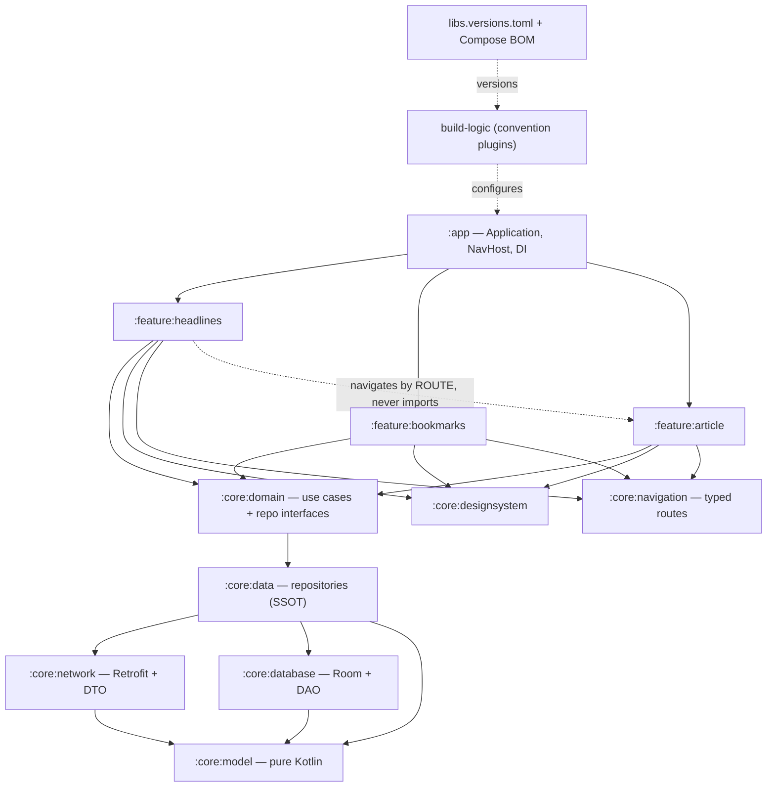
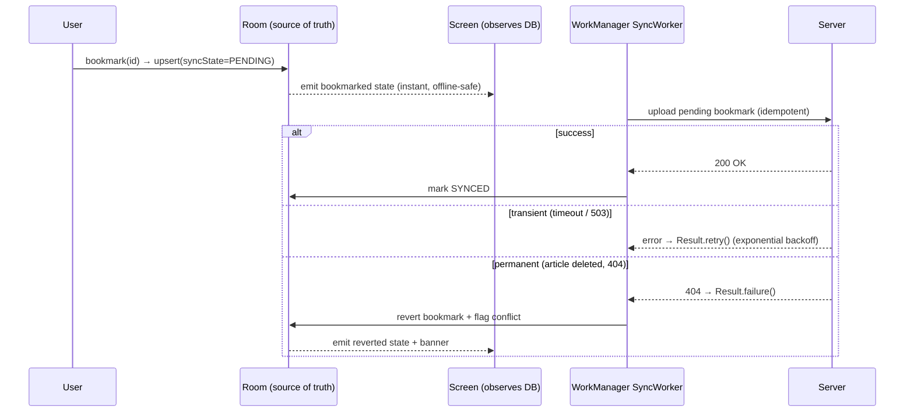
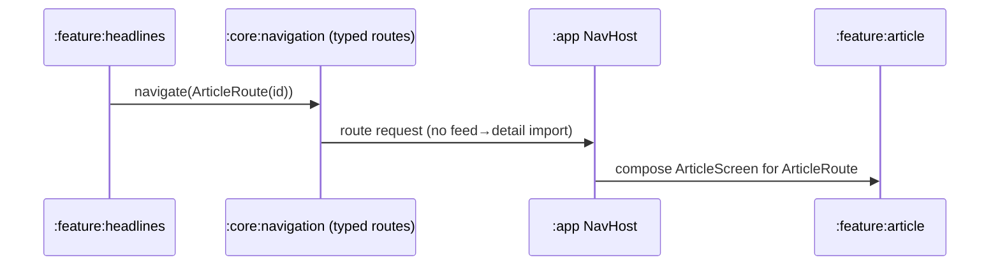

# Capstone — Architecture

> The shape of `Pulse`, the offline-first news client from [`spec.md`](spec.md). This document is the map a new engineer reads before touching code: the **module graph**, the **dependency rule**, the **layering** (data / domain / UI), the **key interfaces**, and the **offline-first data flow**. Build order is in [`milestones.md`](milestones.md).

> **This is a design doc, not a Gradle scaffold.** Snippets are representative — enough to be unambiguous and reviewable, not a full project. The canonical, lesson-by-lesson code lives in [Module 19](../../modules/module-19-production-app/README.md) and [Module 13](../../modules/module-13-architecture/README.md).

---

## 1. The one rule

Everything below is a consequence of a single invariant, from [Module 13 · L01 — Clean Architecture Layers](../../modules/module-13-architecture/01-clean-architecture-layers.md):

> **Source-code dependencies point inward. The domain depends on nothing — no `androidx`, no Retrofit, no Room, no Compose.**

The UI and data layers are replaceable plugins around a framework-free core that encodes what the app *means*. We enforce it **mechanically** (a pure-JVM domain module + an architecture test in CI), not by reviewer vigilance — *architecture you don't enforce is architecture you don't have* ([Module 19 · L01](../../modules/module-19-production-app/01-project-module-setup.md)).

---

## 2. Module graph

`Pulse` is multi-module: a thin `:app`, shared `:core:*`, and self-contained `:feature:*`. Features never depend on each other; they meet only in the `:app` shell and the navigation corridor.

```text
                              ┌─────────────┐
                              │    :app     │  Application · NavHost · DI graph
                              └──────┬──────┘
              ┌──────────────────────┼──────────────────────┐
              ▼                      ▼                      ▼
   ┌──────────────────┐  ┌──────────────────┐  ┌──────────────────┐
   │:feature:headlines│  │:feature:bookmarks│  │ :feature:article │   ✗ NO arrows
   └────────┬─────────┘  └────────┬─────────┘  └────────┬─────────┘     between features
            └──────────────────────┼──────────────────────┘
                                   ▼
                         ┌───────────────────┐
                         │   :core:domain    │   use cases + repository INTERFACES
                         └─────────┬─────────┘
                                   ▼
                         ┌───────────────────┐
                         │    :core:data     │   repositories = single source of truth
                         └────┬─────────┬────┘
                              ▼         ▼
                  ┌───────────────┐ ┌───────────────┐
                  │ :core:network │ │ :core:database│   Retrofit/DTO   ·   Room/Entity/DAO
                  └───────┬───────┘ └───────┬───────┘
                          └────────┬─────────┘
                                   ▼
                          ┌────────────────┐
                          │  :core:model   │   pure Kotlin (no Android) — Article, …
                          └────────────────┘

   Cross-cutting, depended on by every feature:  :core:designsystem · :core:navigation · :core:common
```



**The dependency rule, module by module:**

| Module | Type | Depends on | Must NOT |
|---|---|---|---|
| `:app` | `com.android.application` | every `:feature:*`, `:core:designsystem`, `:core:navigation`, DI | contain feature logic (it's a shell) |
| `:feature:*` | `com.android.library` (Compose) | `:core:domain`, `:core:designsystem`, `:core:navigation` | depend on another `:feature:*`; import `NewsApi`/Room |
| `:core:domain` | `com.android.library` *(or jvm)* | `:core:model` (and `:core:data` interfaces) | import `androidx`/Retrofit/Room/Compose |
| `:core:data` | `com.android.library` | `api(:core:model)`, `implementation(:core:network)`, `implementation(:core:database)` | expose Retrofit/Room via `api` |
| `:core:network` | `com.android.library` | `:core:model` | know about Room or the UI |
| `:core:database` | `com.android.library` | `:core:model` | know about Retrofit or the UI |
| `:core:model` | **`kotlin("jvm")`** | nothing | have any `android {}` block — purity is compiler-enforced |
| `:core:designsystem` | `com.android.library` (Compose) | Material 3, theme tokens | depend on any feature or data module |
| `:core:navigation` | `com.android.library` | kotlinx.serialization (routes) | depend on any feature |

The two load-bearing levers, both from [Module 13 · L06](../../modules/module-13-architecture/06-feature-modularization.md) / [Module 19 · L01](../../modules/module-19-production-app/01-project-module-setup.md):

- **`:core:model` is a pure `kotlin("jvm")` module.** Android types literally aren't on its classpath, so `import android.content.Context` *won't compile*. The cheapest, strongest boundary you can buy.
- **`api` vs `implementation` is architectural.** `:core:data` re-exports `Article` via `api` (features need that type), but keeps Room and Retrofit behind `implementation` — so a feature *physically cannot* `import androidx.room.Entity`. Leaking data tech via `api` is how "the UI talks to the database" creeps back in.

---

## 3. Layering: data / domain / UI

The horizontal cut, with one model per layer and a mapper at every boundary — the **firewall** that stops a format change from rippling.

```text
   ┌──────────────────────────── UI (Compose, androidx) ────────────────────────────┐
   │  HeadlinesScreen ─ HeadlinesViewModel ─ HeadlinesUiState ─ typed Nav routes      │
   │  reads StateFlow<UiState> via collectAsStateWithLifecycle()                      │
   └───────────────────────────────────┬─────────────────────────────────────────────┘
                                        │ calls use cases / repo interface
                                        ▼
   ┌──────────────────────────── DOMAIN (pure Kotlin/JVM) ──────────────────────────┐
   │  Article (model) ─ GetHeadlinesUseCase ─ ToggleBookmarkUseCase                   │
   │  ArticleRepository / BookmarkRepository  (INTERFACES only)                       │
   │  NO androidx · NO Retrofit · NO Room · NO Compose                                │
   └───────────────────────────────────▲─────────────────────────────────────────────┘
                                        │ implements the interfaces above (dependency inversion)
   ┌───────────────────────────────────┴──────── DATA (Retrofit, Room) ─────────────┐
   │  OfflineFirstArticleRepository ─ ArticleDao ─ NewsApi                            │
   │  ArticleDto (wire) ─ ArticleEntity (DB) ─ mappers Dto/Entity ⇄ Article          │
   └───────────────────────────────────────────────────────────────────────────────┘
```

| Layer | Model | Concern |
|---|---|---|
| **Data** | `ArticleDto` (Retrofit), `ArticleEntity` (Room) | serialization, columns, nullability from the wire, `syncState` |
| **Domain** | `Article` | the clean, app-correct shape — framework-free |
| **UI** | `HeadlinesUiState` | exactly what the screen renders (formatted time, flags, the 4 states) |

Mapping is the boilerplate everyone groans about — and it's the firewall. When the API renames `published_at` to `created_at`, you fix **one mapper** in `:core:data`; the domain and every screen never know.

---

## 4. Key interfaces & types

### 4.1 Domain model (`:core:model`, pure Kotlin)

```kotlin
// :core:model — no Android, no annotations. Instantly JVM-testable, KMP-ready.
data class Article(
    val id: String,
    val title: String,
    val source: String,
    val publishedAt: Instant,
    val thumbnailUrl: String?,
    val isBookmarked: Boolean = false,
    val isRead: Boolean = false,
)

enum class SyncState { SYNCED, PENDING, FAILED }
```

### 4.2 Repository interfaces (domain owns them; data implements them)

```kotlin
// Domain declares the contract. Reads are a Flow (UI reacts to cache writes);
// commands are suspend. Errors on refresh surface to the caller.
interface ArticleRepository {
    fun observeHeadlines(category: Category): Flow<List<Article>>   // always from Room
    fun searchCached(query: String): Flow<List<Article>>           // offline search over cache
    suspend fun refresh(category: Category): Result<Unit>          // network → Room
    suspend fun sync(): SyncOutcome                                // delta pull + outbox push
}

interface BookmarkRepository {
    fun observeBookmarks(): Flow<List<Article>>
    suspend fun setBookmarked(id: String, bookmarked: Boolean)     // optimistic, queued for sync
}
```

> **Dependency inversion in one line:** the source-code dependency goes `:core:data → :core:domain` (data *imports the interface*), even though at runtime the domain calls into the implementation via Hilt. That's how the data layer "depends inward."

### 4.3 Use cases (`:core:domain`)

```kotlin
// Thin, framework-free, JVM-testable. Business rules live here, not in the ViewModel.
class GetHeadlinesUseCase @Inject constructor(
    private val articles: ArticleRepository,
) {
    operator fun invoke(category: Category): Flow<List<Article>> =
        articles.observeHeadlines(category)
}

class ToggleBookmarkUseCase @Inject constructor(
    private val bookmarks: BookmarkRepository,
) {
    suspend operator fun invoke(article: Article) =
        bookmarks.setBookmarked(article.id, bookmarked = !article.isBookmarked)
}
```

### 4.4 UI state — every state modeled (`:feature:headlines`)

```kotlin
// One immutable UiState; first-launch-empty is DISTINCT from offline-but-cached (AC-5.1).
internal data class HeadlinesUiState(
    val articles: ImmutableList<Article> = persistentListOf(),
    val content: ContentState = ContentState.Loading,
    val sync: SyncStatus = SyncStatus.Idle,        // idle / syncing / offline(lastUpdated) / error
    val query: String = "",
    val category: Category = Category.TopStories,
)

internal sealed interface ContentState {
    data object Loading : ContentState
    data object Content : ContentState            // articles present
    data object EmptyFirstLaunch : ContentState   // no cache, no network — distinct UI
    data class Error(val retryable: Boolean) : ContentState
}

internal sealed interface SyncStatus {
    data object Idle : SyncStatus
    data object Syncing : SyncStatus
    data class Offline(val lastUpdated: Instant?) : SyncStatus   // "Offline · last updated 5m ago"
    data object Error : SyncStatus
}
```

The ViewModel reduces a Room-backed `Flow` into that state and exposes it lifecycle-safely:

```kotlin
@HiltViewModel
internal class HeadlinesViewModel @Inject constructor(
    private val getHeadlines: GetHeadlinesUseCase,
    private val toggleBookmark: ToggleBookmarkUseCase,
    private val savedState: SavedStateHandle,          // survives process death (AC-4.1)
) : ViewModel() {

    private val category = savedState.getStateFlow("category", Category.TopStories)

    val uiState: StateFlow<HeadlinesUiState> =
        category.flatMapLatest { getHeadlines(it) }
            .map { articles -> reduce(articles) }      // pure reducer → unit-testable
            .stateIn(
                scope = viewModelScope,
                started = SharingStarted.WhileSubscribed(5_000),
                initialValue = HeadlinesUiState(),     // Loading
            )

    // One-off effects (navigate, snackbar) go through a Channel, NOT through state.
    private val _effects = Channel<HeadlinesEffect>(Channel.BUFFERED)
    val effects = _effects.receiveAsFlow()

    fun onBookmark(article: Article) = viewModelScope.launch { toggleBookmark(article) }
}
```

Consumed in the composable with `collectAsStateWithLifecycle()` (the 2026 default), all four `ContentState`s branched explicitly so no state is ever unhandled.

---

## 5. The offline-first data flow

The spine of the app. **The database is the truth the UI trusts; the network is a background courier that reconciles it** ([Module 13 · L07](../../modules/module-13-architecture/07-offline-first.md)).

```text
        ┌──────────────────────────── Repository (SSOT) ─────────────────────────────┐
   READ │  UI ──collect──▶ dao.observeHeadlines(): Flow   ◀── ALWAYS the local DB     │
        │                          ▲                                                  │
  WRITE │  bookmark tap ─▶ dao.upsert(syncState=PENDING)   (instant, optimistic)      │
        │                          │                                                  │
        │            ┌─────────────┴───────────────── SYNC ───────────────────┐       │
        │   PULL     │  api.changesSince(cursor) ─▶ dao.applyWithConflictPolicy │       │
        │   PUSH     │  pending rows ─▶ api.upload() ─▶ mark SYNCED / revert     │       │
        │            └──────────────▲─────────────────────────────────────────┘       │
        └───────────────────────────┼──────────────────────────────────────────────────┘
                                     │ runs in
                          ┌──────────┴───────────┐
                          │  WorkManager worker  │  constraint: CONNECTED, idempotent,
                          │  retry/backoff/unique│  delta cursor, survives process death
                          └──────────────────────┘
```

### 5.1 Reads always come from Room

```kotlin
// :core:data — observeHeadlines reads Room → instant, works offline; refresh only feeds Room.
class OfflineFirstArticleRepository @Inject constructor(
    private val api: NewsApi,
    private val dao: ArticleDao,
    private val syncMeta: SyncMetadataStore,
    @IoDispatcher private val io: CoroutineDispatcher,
) : ArticleRepository {

    override fun observeHeadlines(category: Category): Flow<List<Article>> =
        dao.observeByCategory(category.id)
            .map { entities -> entities.map(ArticleEntity::toDomain) }  // map at the boundary
            .flowOn(io)

    override suspend fun refresh(category: Category): Result<Unit> = withContext(io) {
        runCatching {
            val fresh = api.headlines(category.id).map(ArticleDto::toEntity)
            dao.upsertAll(fresh)                 // the observing Flow re-emits automatically
        }
    }
}
```

### 5.2 Writes are optimistic, then synced

```kotlin
// Optimistic: update Room now (UI reflects instantly), mark PENDING, attempt upload.
override suspend fun setBookmarked(id: String, bookmarked: Boolean) = withContext(io) {
    dao.setBookmark(id, bookmarked, SyncState.PENDING)          // 1) local write, shown immediately
    runCatching { api.setBookmark(id, bookmarked) }            // 2) attempt upload (idempotent)
        .onSuccess { dao.setSyncState(id, SyncState.SYNCED) }
        .onFailure { dao.setSyncState(id, SyncState.FAILED) }   // 3) left for the worker to retry
}
```

### 5.3 Background sync: idempotent, delta, conflict-aware

```kotlin
@HiltWorker
class SyncWorker @AssistedInject constructor(
    @Assisted appContext: Context,
    @Assisted params: WorkerParameters,
    private val dao: ArticleDao,
    private val api: NewsApi,
    private val syncMeta: SyncMetadataStore,
) : CoroutineWorker(appContext, params) {

    override suspend fun doWork(): Result = try {
        // PUSH pending writes in dependency order; safe to retry (server idempotency key).
        dao.getPending().forEach { row ->
            api.setBookmark(row.id, row.isBookmarked)
            dao.setSyncState(row.id, SyncState.SYNCED)
        }
        // PULL only changes since the persisted cursor (delta sync, not a full re-download).
        val delta = api.changesSince(syncMeta.lastCursor())
        delta.changes.forEach { remote -> dao.applyWithConflictPolicy(remote) }  // LWW by updatedAt
        syncMeta.setLastCursor(delta.nextCursor)
        Result.success()
    } catch (e: IOException) {
        Result.retry()                                         // transient → backoff & retry
    } catch (e: HttpException) {
        if (e.code() in 500..599) Result.retry() else Result.failure()  // 5xx retry; 4xx permanent
    }
}

// Conflict policy chosen ON PURPOSE: last-write-wins by updatedAt (news is single-user, independent).
suspend fun ArticleDao.applyWithConflictPolicy(remote: ArticleDto) {
    val local = findById(remote.id)
    when {
        local == null -> upsert(remote.toEntity())                        // new remote row
        remote.updatedAt > local.updatedAt -> upsert(remote.toEntity())   // remote newer → overwrite
        else -> Unit                                                      // local newer/equal → keep
    }
}
```

Scheduled as **unique periodic work** with a connectivity constraint and exponential backoff, plus an expedited one-off on app open when the cache is stale:

```kotlin
WorkManager.getInstance(context).enqueueUniquePeriodicWork(
    "news-sync",
    ExistingPeriodicWorkPolicy.KEEP,                  // don't stack duplicate sync chains
    PeriodicWorkRequestBuilder<SyncWorker>(15, TimeUnit.MINUTES)
        .setConstraints(Constraints.Builder().setRequiredNetworkType(NetworkType.CONNECTED).build())
        .setBackoffCriteria(BackoffPolicy.EXPONENTIAL, 30, TimeUnit.SECONDS)
        .build(),
)
```

### 5.4 Optimistic write + sync + conflict, end to end



---

## 6. DI wiring (Hilt)

Callers depend on **abstractions**; implementations are constructed only in the graph ([Module 19 · L05](../../modules/module-19-production-app/05-dependency-injection.md)).

```kotlin
@Module
@InstallIn(SingletonComponent::class)
abstract class DataModule {
    @Binds
    abstract fun bindArticleRepository(
        impl: OfflineFirstArticleRepository,
    ): ArticleRepository                          // callers see only the interface

    @Binds
    abstract fun bindBookmarkRepository(
        impl: OfflineFirstBookmarkRepository,
    ): BookmarkRepository
}

@Module
@InstallIn(SingletonComponent::class)
object DispatchersModule {
    @Provides @IoDispatcher
    fun io(): CoroutineDispatcher = Dispatchers.IO
}
```

`@HiltWorker` + `HiltWorkerFactory` let WorkManager inject the `SyncWorker`. The `@HiltViewModel` ViewModels receive use cases by constructor — never constructing a repository themselves, so swapping a fake in a test changes data with **no UI change**.

---

## 7. Cross-feature navigation (no feature→feature coupling)

The killer problem of modularization: `:feature:headlines` must open `:feature:article` without importing it. Solution — **typed routes in `:core:navigation`**; `:app` wires routes to screens ([Module 13 · L06](../../modules/module-13-architecture/06-feature-modularization.md)).

```kotlin
// :core:navigation — both features depend on this; neither imports the other.
@Serializable data class ArticleRoute(val articleId: String)
@Serializable data object HeadlinesRoute

// :feature:headlines exposes a lambda, not a dependency on :feature:article.
internal fun NavGraphBuilder.headlinesScreen(onOpenArticle: (String) -> Unit) {
    composable<HeadlinesRoute> { HeadlinesRoute(onOpenArticle = onOpenArticle) }
}

// :app — the ONLY module that knows both features.
@Composable
fun PulseNavHost(navController: NavHostController) {
    NavHost(navController, startDestination = HeadlinesRoute) {
        headlinesScreen(onOpenArticle = { id -> navController.navigate(ArticleRoute(id)) })
        articleScreen(onBack = navController::popBackStack)
    }
}
```



---

## 8. Testing seams the architecture creates

The layering exists partly *so* the app is cheap to test ([Module 14 · L01 — Testing Pyramid](../../modules/module-14-testing/01-testing-pyramid.md)). The seams:

- **Domain & ViewModels are JVM-testable** — pure reducer + use cases over a **fake** `ArticleRepository`; Turbine on the `StateFlow`, MockK for fakes, `runTest`. The bulk of the suite, in `src/test/`, runs in seconds.
- **Repository is testable with a fake `NewsApi` + in-memory Room** — prove offline read, optimistic write + `syncState`, idempotent sync, and the LWW conflict outcome without a network.
- **Screens are screenshot-testable on the JVM** (Roborazzi) for all four `ContentState`s in light/dark.
- **Boundaries are testable** — an architecture test (Konsist/ArchUnit) asserts `:core:domain` has no `androidx`/Retrofit/Room import, and no `:feature:*` depends on another `:feature:*`. The build fails the first time someone violates the rule.

```text
                ▲ fewer · slower
               ╱ E ╲        Macrobenchmark: startup + feed scroll (1 device)  → ships Baseline Profile
              ╱─────╲       Integration (androidTest): feed→detail nav + process-death restore
             ╱  UI   ╲      Compose UI (androidTest): bookmark toggle, offline banner, Retry
            ╱─────────╲     Screenshot (JVM): 4 states × light/dark
           ╱   Unit    ╲    Unit (JVM): reducers, use cases, repo, StateFlow via Turbine  ← the most
          ▼ more · faster
```

---

## 9. Architecture decisions (the "why", recorded)

| Decision | Choice | Rationale |
|---|---|---|
| Source of truth | **Room** | Offline-first; instant reads, network only feeds it ([M13·L07](../../modules/module-13-architecture/07-offline-first.md)). |
| Domain module type | **`kotlin("jvm")`** | Compiler-enforced purity; no `Context` leak possible ([M19·L01](../../modules/module-19-production-app/01-project-module-setup.md)). |
| Data tech visibility | Room/Retrofit behind **`implementation`** | Features can't import them — boundary enforced by classpath, not review. |
| UI state | **single immutable `UiState`** + effects `Channel` | MVI/UDF; survives process death; testable reducer ([M13·L03](../../modules/module-13-architecture/03-mvi-unidirectional-state.md)). |
| State collection | **`collectAsStateWithLifecycle()`** | 2026 default; no wasted work when stopped. |
| Conflict policy | **last-write-wins by `updatedAt`** | News is single-user/independent; CRDTs are a non-goal — chosen on purpose, stored `updatedAt` makes it detectable. |
| Sync engine | **WorkManager**, idempotent, delta cursor | Guaranteed across process death; transient→retry, permanent→failure. |
| Cross-feature nav | **typed routes in `:core:navigation`** | No feature→feature coupling; `:app` wires the graph ([M13·L06](../../modules/module-13-architecture/06-feature-modularization.md)). |
| Lists & recomposition | **immutable collections + Strong Skipping** | Stable types keep the feed scroll jank-free ([M11](../../modules/module-11-performance/README.md)). |

---

➡️ Back to the **[product brief](spec.md)** · the **[build milestones](milestones.md)** · or the capstone **[README](README.md)**.
