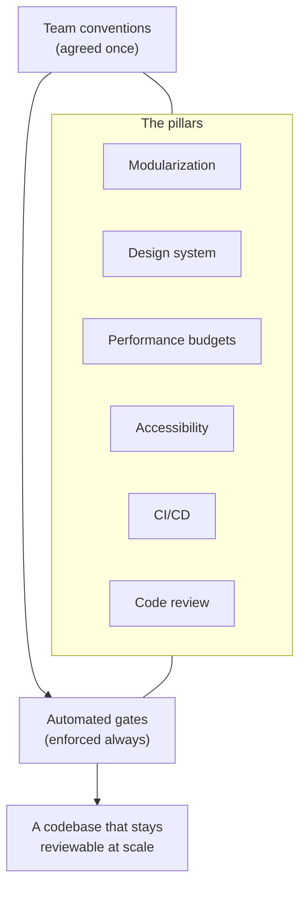
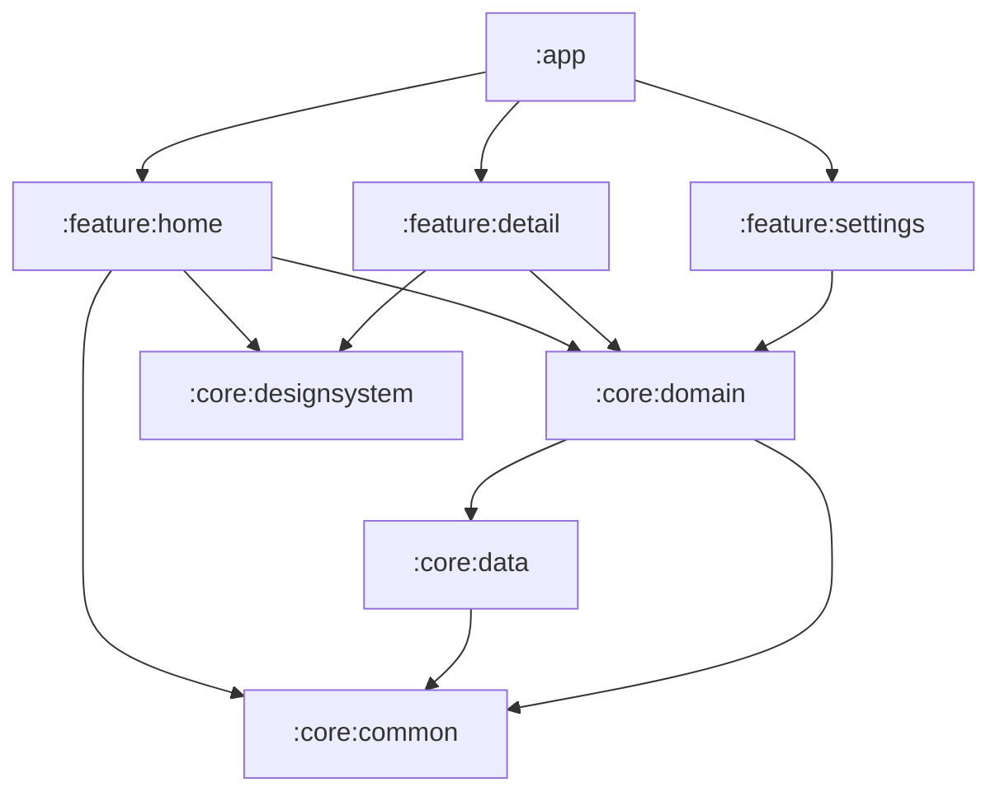
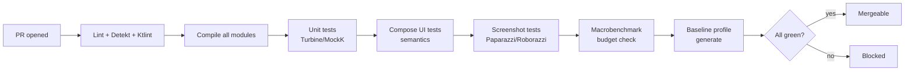

# Enterprise Best Practices — Compose in a real team, at scale

> The production practices distilled across the whole course, in one place: modularization, design systems, performance budgets, accessibility, CI/CD, code review, and the team conventions that keep a Compose codebase healthy as it grows from one engineer to fifty.

**Who this is for.** Tech leads, staff engineers, and anyone setting up — or cleaning up — a Compose codebase that more than one person ships. The module lessons teach the *concepts*; this distills them into the *rules and gates* a team agrees on once and enforces automatically. Everything here is 2026-idiomatic (Kotlin 2.x/K2, Material 3, Strong Skipping, type-safe Navigation, Hilt) and traces back to a module for the *why*.

**The through-line.** A solo project survives on discipline; a team codebase survives on **conventions enforced by tooling**. Every section below ends with something a CI pipeline or a lint rule can check — because "we agreed to do X" decays, and "the build fails if you don't do X" doesn't.



---

## 1. Modularization — boundaries that scale the team, not just the build

*Grounded in:* [Module 13 — Architecture](../modules/module-13-architecture/README.md), [Module 19 — Capstone](../modules/module-19-production-app/README.md).

A flat `:app` module is fine for a demo and fatal for a team: every change touches everything, builds slow to a crawl, and nobody owns anything. Modularize by **feature** and **layer**, with dependencies pointing inward.

### The standard module graph



### The rules (and the gate that enforces each)

| Rule | Why (module) | Enforce with |
|---|---|---|
| Dependencies point **inward**: `:feature` → `:core:domain`; data depends on domain, never the reverse. | M13 dependency rule | A module-graph assertion test (e.g. a Konsist/ArchUnit-style check) in CI. |
| `:core:domain` has **no Android dependencies** (pure Kotlin/JVM). | M13 — testable, portable business rules | Make it a `kotlin("jvm")` module; the compiler enforces it. |
| Feature modules **never depend on each other** — only on `:core:*`. | M13 — independent ownership & build parallelism | Dependency rule check in CI; fail on `:feature:*` → `:feature:*` edges. |
| **No data model leaks** across layers — map DTO → domain → UI at each boundary. | M13 — boundary integrity | Code review + a lint/Konsist rule banning DTOs in `:feature` UI packages. |
| Build config lives in **convention plugins**, not copy-pasted Gradle. | Scale — one place to bump the BOM | A `build-logic` module with shared convention plugins. |

### Team conventions

- **Naming:** `:feature:<name>`, `:core:<concern>`. One feature = one team-ownable unit (one `CODEOWNERS` entry).
- **Public surface:** keep module APIs small; mark internals `internal`. A feature exposes a navigation entry point and nothing else.
- **Build hygiene:** track module build times; a feature that everything depends on (a "god core") is an anti-pattern — split it.

> **Litmus test:** a new engineer can build and run *one* feature module's tests without building the whole app. If they can't, your boundaries are fiction.

---

## 2. Design system — one source of truth for look and feel

*Grounded in:* [Module 09 — Material 3 Theming](../modules/module-09-material3-theming/README.md), [Module 07 — CompositionLocal](../modules/module-07-compositionlocal/README.md), [Module 04 — Modifiers](../modules/module-04-modifiers/README.md).

A design system is what stops fifty engineers from inventing fifty shades of blue. It lives in `:core:designsystem` and is the **only** place raw colors, type, shapes, and spacing are defined.

### What `:core:designsystem` owns

- A `MaterialTheme` wrapper exposing the **color scheme** (light/dark/dynamic), **typography**, and **shapes**.
- An **extended tokens** object (spacing scale, brand colors Material doesn't model, elevation) — provided via a custom `staticCompositionLocalOf` (M07).
- A catalog of **branded components** (your `AppButton`, `AppCard`, `AppTextField`) that wrap Material components with house defaults.
- A **Catalog/Gallery** screen rendering every component in light + dark — the living spec and the screenshot-test surface.

### The rules

| Rule | Why (module) | Enforce with |
|---|---|---|
| **No hardcoded colors** in feature code — only `MaterialTheme.colorScheme.*` and color *roles*. | M09 — survives theme swaps & dynamic color | Detekt/lint rule banning `Color(0xFF…)` outside `:core:designsystem`. |
| **No magic dimensions** — spacing/sizes come from the token scale. | M04/M09 — consistency | Lint rule flagging `.dp` literals in feature UI (allow a curated set). |
| **Dynamic color** with a documented pre-S fallback. | M09 — Material You + back-compat | A screenshot test on both paths. |
| Components carry **defaults** (a `Modifier = Modifier` param, sensible content padding). | M04 — composability | Detekt "ComposableParametersOrdering"/`Modifier`-default rules. |
| The **Catalog screen** stays current — every public component appears in it. | living documentation | A test asserting each `:core:designsystem` component is referenced by the Catalog. |

### Team conventions

- **One PR changes tokens; many PRs consume them.** Token changes get extra review (they ripple everywhere).
- **Components are API.** Adding a parameter is fine; changing default behavior is a breaking change — version it and announce it.
- **Designers and engineers share the token names.** If design calls it `surfaceContainerHigh`, so does the code.

> **Litmus test:** a brand refresh (new primary color, new corner radius) is a change in *one file*. If it's a find-and-replace across features, you don't have a design system — you have a style guide nobody enforced.

---

## 3. Performance budgets — make "fast" a number, not a vibe

*Grounded in:* [Module 11 — Performance](../modules/module-11-performance/README.md), [Module 12 — Internals](../modules/module-12-internals/README.md), [Module 08 — Canvas](../modules/module-08-canvas-graphics/README.md).

"It feels smooth" is not a spec. Enterprises set **budgets** and **fail the build** when a change blows past them. Performance is a contract, measured with the profiler (M11), understood via the runtime (M12).

### Suggested budgets (tune to your app and devices)

| Metric | Budget (example) | Measured by (module) |
|---|---|---|
| Cold start (P50) | ≤ 500 ms on a mid-tier device | Macrobenchmark (M11) |
| Frame jank (P99 frame time) | ≤ 16 ms (60 fps) / track 120 fps targets | Macrobenchmark / JankStats (M11) |
| Recompositions per interaction | No unbounded growth; a scroll doesn't recompose off-screen rows | Layout Inspector / composition tracing (M11) |
| Draw-phase allocations | **Zero** per-frame allocations in hot draw paths | Profiler / Allocation tracking (M08, M11) |
| Baseline profile | Present and shipped on every release | `BaselineProfileRule` in CI (M11) |

### The rules

| Rule | Why (module) | Enforce with |
|---|---|---|
| List state uses **immutable, stable** types (`ImmutableList`, `@Immutable` models). | M12 — enables skipping | Compiler stability metrics checked in CI; fail on new unstable public params. |
| Lazy lists always set **`key` + `contentType`**. | M11 — correct reuse, fewer invalidations | Lint/Detekt rule on `items`/`itemsIndexed` missing `key`. |
| **Defer state reads** down the pipeline (lambda modifiers, `graphicsLayer`, read in draw not composition). | M11/M12 — the #1 perf lever | Code review checklist + profiler verification. |
| **Baseline profiles** generated in CI and shipped. | M11 — startup & first-scroll wins | `BaselineProfileRule`; regenerate on release. |
| Performance-sensitive screens have a **Macrobenchmark** that runs in CI. | M11 — regressions caught early | CI job; fail on a budget regression beyond threshold. |

### Team conventions

- **No perf PR without a number.** "Optimized the list" gets sent back; "cut P90 scroll frame time from 22 ms → 11 ms, recompositions/scroll 340 → 60" gets merged. (See [Module 11 deliverable](../modules/module-11-performance/README.md).)
- **Stability is reviewed at the API boundary.** A new `data class` exposed to a composable gets a stability check — is it `@Immutable`? does it hold a `List` (unstable) instead of an `ImmutableList`?
- **Profile on real, mid-tier devices**, not just the flagship in your pocket.

> **Litmus test:** when someone claims a screen got faster, can they show a before/after Macrobenchmark? If performance lives in opinions, it will regress silently.

---

## 4. Accessibility — a requirement, not a nice-to-have

*Grounded in:* [Module 14 — Testing](../modules/module-14-testing/README.md) (semantics), [Module 09 — Material 3](../modules/module-09-material3-theming/README.md) (contrast), [Module 04 — Modifiers](../modules/module-04-modifiers/README.md) (touch targets).

In Compose, accessibility *is* the **semantics tree** — the same tree your UI tests assert against (M14). Good semantics means screen readers work *and* your tests are robust. They reinforce each other.

### The baseline (target WCAG 2.1 AA)

| Requirement | Compose mechanism | Module |
|---|---|---|
| Every meaningful element has a label | `contentDescription` (or `Modifier.semantics { }`); decorative → `null` | M14 |
| Color contrast ≥ 4.5:1 (body), 3:1 (large/UI) | Material 3 color roles, measured | M09 |
| Touch targets ≥ 48×48 dp | `Modifier.minimumInteractiveComponentSize()` / sizing | M04 |
| State announced (selected, checked, disabled) | `Modifier.semantics { stateDescription/role }` | M14 |
| Content scales with font size | `sp` for text, no fixed `dp` heights on text containers | M09 |
| Logical focus & traversal order | focus order modifiers; merged semantics for groups | M04/M14 |
| Works without color alone | pair color with icon/text | M09 |

### The rules

| Rule | Enforce with |
|---|---|
| Interactive elements expose a label and a role. | UI tests select by `contentDescription`/role (M14) — un-labeled elements are unselectable, so the test *forces* the label. |
| Contrast meets AA. | A contrast check in the design-system Catalog screenshot test (M09). |
| Touch targets meet 48 dp. | Lint (`AccessibilityCheck`) + Compose's `minimumInteractiveComponentSize`. |
| No accessibility regressions. | Run Accessibility Scanner / Espresso accessibility checks in instrumented CI. |

### Team conventions

- **Semantics-first testing doubles as a11y enforcement.** If your UI tests must select by text/role/`contentDescription` (M14's rule), engineers *can't* ship an unlabeled control — the test won't compile against it. Make this the house style and accessibility comes mostly for free.
- **a11y is a PR review line**, not a pre-launch scramble. Add it to the [review checklist](#6--code-review--what-every-compose-pr-must-clear).
- **Test with TalkBack** on at least the critical flows before release.

> **Litmus test:** turn on TalkBack and complete your primary user journey blind. If you can't, neither can a meaningful slice of your users.

---

## 5. CI/CD — the pipeline that enforces everything above

*Grounded in:* [Module 19 — Capstone](../modules/module-19-production-app/README.md), [Module 14 — Testing](../modules/module-14-testing/README.md), [Module 17 — Code Quality](../modules/module-17-code-quality/README.md), [Module 11 — Performance](../modules/module-11-performance/README.md).

Conventions you don't enforce are suggestions. CI is where the team's standards become non-negotiable. A Compose-mature pipeline runs on every PR.

### The pipeline (GitHub Actions or equivalent)



### Stage-by-stage (what fails the build)

| Stage | Fails on | Module |
|---|---|---|
| **Static analysis** | Detekt/Ktlint/Android Lint error-level findings; banned-API rules (hardcoded color, missing list `key`). | M17 |
| **Compile** | Any module, including pure-Kotlin `:core:domain`, fails. | M13 |
| **Unit tests** | ViewModel/state tests fail; coverage below a (sane) threshold on changed code. | M14 |
| **UI tests** | Semantics-based Compose tests fail; flaky tests are quarantined, not ignored. | M14 |
| **Screenshot tests** | A pixel diff beyond tolerance (deterministic: fixed time/locale, animations off). | M14 |
| **Macrobenchmark** | A perf budget regression beyond threshold. | M11 |
| **Baseline profile** | Profile missing on a release build. | M11 |
| **Security scan** | Secret detected in diff; dependency with a known CVE. | M18 |

### Team conventions

- **Trunk-based, short-lived branches.** Long-lived branches rot against a fast-moving Compose toolchain.
- **Required green CI + ≥1 approval to merge.** No exceptions, no "I'll fix it after merge".
- **Release builds ship a baseline profile and have monitoring wired** (crash/ANR/perf) — see capstone phase 08 (M19).
- **Reproducible builds:** pin the Compose BOM, Kotlin, and AGP versions; bump them in a dedicated PR so a toolchain change is reviewable in isolation.

> **Litmus test:** can a junior engineer's well-intentioned-but-wrong PR (hardcoded color, unkeyed list, leaked DTO, flaky screenshot) get to `main`? If yes, your gates have holes.

---

## 6. Code review — what every Compose PR must clear

*Grounded in:* [Module 17 — Code Quality](../modules/module-17-code-quality/README.md), [Module 03 — State](../modules/module-03-state-management/README.md), [Module 06 — Side Effects](../modules/module-06-side-effects/README.md), [Module 16 — AI Dev](../modules/module-16-ai-powered-dev/README.md).

Static analysis catches the mechanical stuff; review catches the *judgment* stuff. A Compose-specific review checklist keeps reviews fast and consistent — and catches the smells tools miss (god composables, state in the wrong place).

### The Compose PR checklist

**State & data flow (M03)**
- [ ] State is hoisted to the right level; leaf composables are stateless.
- [ ] Exactly one `StateFlow<UiState>` per screen; nothing mutable leaks from the ViewModel.
- [ ] No derived data stored as separate state (totals, filters are *derived*).
- [ ] One-shot effects (navigate, snackbar) go through a channel — **not** stored in `UiState`.

**Effects (M06)**
- [ ] Every `LaunchedEffect`/`DisposableEffect` has the correct **key list**.
- [ ] `DisposableEffect` has a matching `onDispose`; no leaked listeners.
- [ ] `flatMapLatest` (not `Merge`) where a new input should cancel the old.

**Composition & performance (M11/M12)**
- [ ] Public composable params are **stable**; list params are `ImmutableList`.
- [ ] Lazy lists set `key` + `contentType`.
- [ ] State reads deferred where it matters (lambda modifiers, `graphicsLayer`, draw).

**Design system & a11y (M09/M14)**
- [ ] No hardcoded colors/dimensions; tokens used.
- [ ] Interactive elements labeled; touch targets ≥ 48 dp; contrast OK.

**Architecture & quality (M13/M17)**
- [ ] No data-model leaks across boundaries.
- [ ] No god composable; functions small and single-responsibility; no business logic in UI.
- [ ] Tests added/updated; UI tests select by semantics, not position.

### Team conventions

- **Small PRs.** A 2,000-line Compose PR can't be reviewed for state correctness — it gets rubber-stamped. Cap PR size; split by layer.
- **The author runs the checklist first.** Reviewers verify, they don't discover.
- **AI-assisted review is a *first pass*, not the verdict.** Configure an AI reviewer against this checklist (M17), but a human signs off — AI rubber-stamps real smells (M16). *AI drafts the review, you decide the merge.*
- **Disagreements resolve on principle, not seniority** — cite the module/rule.

> **Litmus test:** pick a merged PR at random. Can you tell *from the diff* that state is owned correctly and effects are keyed right? If reviews don't surface that, the checklist isn't being run.

---

## 7. Team conventions — the agreements that hold it together

*Grounded in:* the whole course; especially [Module 17 — Code Quality](../modules/module-17-code-quality/README.md) and [Module 03 — State](../modules/module-03-state-management/README.md).

The small, boring agreements that prevent a thousand bikeshed arguments.

### Naming & structure

| Thing | Convention |
|---|---|
| Screen composable | `<Feature>Screen(...)` (stateful) wraps `<Feature>Content(...)` (stateless, previewable). |
| State holder | `<Feature>ViewModel` → `<Feature>UiState` (immutable) + `<Feature>Event` (sealed). |
| Composable params | `modifier: Modifier = Modifier` is **first** after required params and defaults to `Modifier`. |
| Previews | Every screen has `@Preview` for light, dark, and one edge state (loading/empty/error). |
| Files | One screen per file; extract reusable pieces to `:core:designsystem`. |

### State & events

- **One immutable `UiState` per screen.** Model illegal states unrepresentable (`sealed interface` over nullable-flag soup) — M03.
- **Events flow up, state flows down.** The ViewModel is the only thing that produces the next state.
- **`collectAsStateWithLifecycle`** is the default collector (stops in background) — M03/M13.

### The "definition of done" for a feature

A feature is done when:
- [ ] All UI states handled (loading / content / empty / error).
- [ ] Survives rotation **and** process death.
- [ ] Tested: ViewModel (Turbine) + UI (semantics) + at least one screenshot.
- [ ] Accessible: labeled, contrast-checked, 48 dp targets.
- [ ] Within performance budget (no new unstable params, lists keyed).
- [ ] Static analysis clean; reviewed against the [PR checklist](#6--code-review--what-every-compose-pr-must-clear).
- [ ] Behind a feature flag if risky; monitoring covers it.

### Onboarding a new engineer

1. Read the [curriculum](../course/curriculum.md) spine modules (03, 06, 11, 12) — that's the shared mental model.
2. Build and test *one* feature module in isolation (proves the boundaries hold).
3. Ship a tiny PR through the full pipeline (learn the gates by passing them).
4. Pair on a code review using the checklist above.

> **Litmus test:** could you hand this document to a new senior hire and have them predict how your team writes Compose — before reading a line of your code? That's what conventions are *for*.

---

## The one-page summary (pin this)

```text
MODULARIZE   feature + layer modules; deps point inward; domain is pure Kotlin.   [M13]
DESIGN SYS   one source of truth for color/type/shape/spacing; no hardcoded values. [M09/M07]
PERF BUDGET  fast is a number; immutable state, keyed lists, deferred reads, profiled. [M11/M12]
A11Y         semantics = screen-reader + robust tests; contrast, 48dp, labels.      [M14/M09/M04]
CI/CD        lint+detekt → compile → unit → UI → screenshot → macrobench → baseline. [M19/M14/M17]
CODE REVIEW  Compose checklist: state owned, effects keyed, stability, no leaks.     [M17/M03/M06]
CONVENTIONS  Screen/Content split, one UiState, modifier-first, definition-of-done.  [course]

THE RULE:    agreements decay; gates don't. Encode every convention into tooling.
             And: AI drafts, you decide — on architecture, perf, security, review.  [M16/M18]
```

---

## Cross-links

- Build it for real: the **[capstone project](capstone-project/)** and graded **[GB-05](practice-projects.md#gb-05--secure-money-tracker--the-flagship-capstone)** apply every pillar here.
- The *why* behind each rule lives in the modules — start with the architecture anchor, **[Module 13](../modules/module-13-architecture/README.md)**, and the quality module, **[Module 17](../modules/module-17-code-quality/README.md)**.
- Keep AI inside the guardrails: **[AI-assisted learning workflows](ai-assisted-learning-workflows.md)** and **[Module 16](../modules/module-16-ai-powered-dev/README.md)**.
- See how the concepts connect: **[mind maps](mind-maps.md)**.
- Practice and prove: **[practice projects](practice-projects.md)** · **[assignments](assignments.md)** · **[final assessment](final-assessment.md)**.
