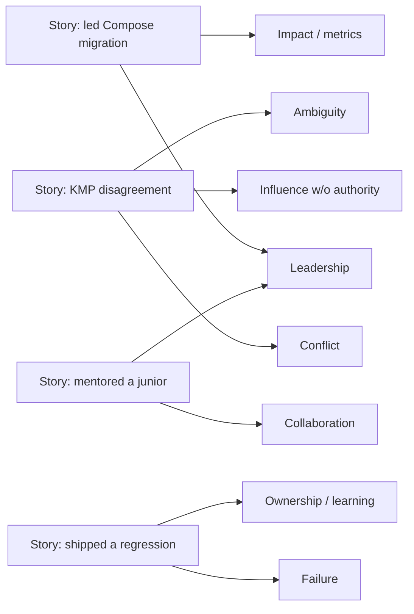
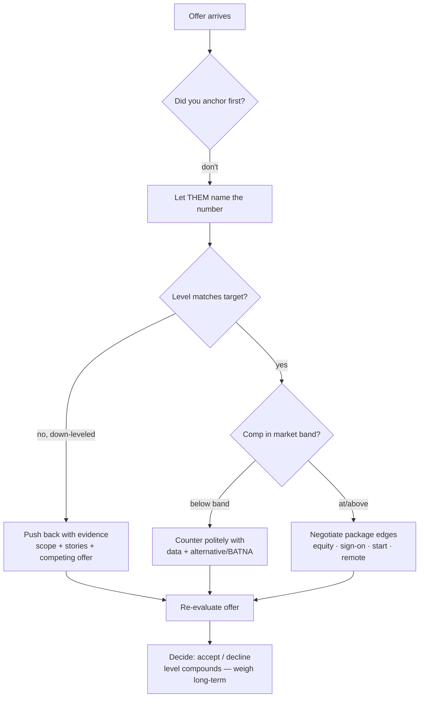

# Behavioral & The Offer — STAR, Leveling & Negotiation

> STAR story templates, leveling guidance from junior to staff, and a negotiation playbook. Strong engineers fail loops on the **behavioral** round and accept **lowball offers** — both are learnable. Behavioral is often a **gate**: a strong "no" here can sink an otherwise-passing loop.

**Part of:** [Interview Prep](README.md) · **Pairs with:** [Module 20 · Lesson 07 — Behavioral & the Offer](../../modules/module-20-career-interview/07-behavioral-and-the-offer.md)

---

## The two things this round decides

1. **Behavioral:** how you work with people, handle conflict, and own outcomes — *and* what **level** your stories signal.
2. **The offer:** comp, level, and package. Most candidates leave money on the table because they're uncomfortable or assume the first offer is fixed. It usually isn't.

> **Mental model:** *Behavioral — tell STAR stories where the Action is yours and the scope matches your target level. Offer — never anchor first, negotiate the whole package (level compounds), and your leverage is your alternative + your information.*

---

## Part 1 — STAR

Behavioral answers have a structure. The interviewer scores the **Action** (your specific contribution) and the **Result** (impact) — not the backstory.

```text
   S ─┐  brief context        (10%)  ──▶ don't dwell here
   T ─┤  the problem you owned (15%)
   A ─┤  WHAT YOU DID          (55%)  ──▶ the bulk; use "I"; specific actions
   R ─┘  outcome + learning    (20%)  ──▶ quantify if you can
   ❌ common failure: 80% Situation, "and it worked out" → no scored Action/Result
```

| Letter | Means | Rule |
|---|---|---|
| **S** — Situation | Brief context | 1–2 sentences. Set the scene, don't dwell. |
| **T** — Task | The problem *you* owned | What you needed to do / were responsible for. |
| **A** — Action | What *you* specifically did | The bulk. First person — **"I"**, not "we". |
| **R** — Result | The outcome | Quantify if possible; end with what you learned. |

### The fill-in template

```text
✅ STAR TEMPLATE (fill with a REAL story, rehearse OUT LOUD):

  S (1–2 sentences): "On my team's [app/system], we had [problem/context]."
  T:                 "I was responsible for [your specific task/goal]."
  A (the bulk, "I"): "I [action 1]. Then I [action 2]. I also [action 3]."
  R (quantify):      "As a result, [outcome + metric]. I learned [takeaway]."
```

**Worked example (proud project):**
```text
  S: "Our checkout screen was still in XML and crashed often."
  T: "I was asked to lead its migration to Compose."
  A: "I designed the MVI state model, migrated the screens incrementally behind a feature
      flag, and added crash monitoring so we could catch regressions early."
  R: "Crash rate on checkout dropped ~30%, and the new screens shipped on time. I learned
      to migrate behind flags rather than big-bang."
```

> **Rules that matter most:** keep **S short**; spend the answer on **A** in the **first person**; **quantify the R**; and **rehearse aloud** — a story that reads fine on paper rambles when spoken under pressure.

---

## Part 2 — The story bank

Prepare **6–8 true stories tagged by theme** so any prompt has a ready answer. One strong story covers several themes.



**Build your bank** (fill the right column with *your* real stories):

| Theme interviewers cover | Story that covers it (yours) |
|---|---|
| Leadership / driving a project | |
| Impact (quantified) | |
| Conflict / disagreement | |
| Influence **without authority** | |
| Ambiguity / undefined problem | |
| Failure / a mistake you owned | |
| Collaboration / mentoring | |
| Learning something hard fast | |

**Coverage example** (one story → many themes):

| Story | Themes it covers |
|---|---|
| Led Compose migration | leadership, impact, technical depth |
| Disagreed on KMP adoption | conflict, influence-without-authority, ambiguity |
| Shipped a bad regression | failure, ownership, learning |
| Mentored a struggling junior | collaboration, leadership, empathy |
| Hit an impossible deadline | prioritization, communication, ambiguity |

### "I" vs "we" — the calibration interviewers listen for

```text
✅ "WE needed to cut crash rate (the goal); I led the checkout migration and set up the
    monitoring (my specific actions)."   ← goal in 'we', actions in 'I'
```

- **All "we"** → your individual impact (what's being graded) disappears; sounds like you rode along.
- **All "I"** on a team win → reads as credit-stealing / poor collaborator.
- **The rule:** *"we" for the shared goal, "I" for your specific actions.*

---

## Part 3 — Leveling: junior → staff

The **same situation** told at different scopes reads as a different level. This is the single biggest lever on your offered level. If every story is "I implemented the ticket," you cap at mid **regardless of technical skill**.

```text
   SAME work, leveled up:
   MID:    "I fixed our flaky tests."
   SENIOR: "I saw flaky tests were eroding trust in CI across the team, drove a
            quarantine-policy agreement, and owned cutting flake rate from 8% to <1%."
            → identifies problem · influences without authority · owns measurable outcome
```

### Leveling rubric — what each band's stories must show

| Level | Scope of story | The verbs | Example phrasing |
|---|---|---|---|
| **Junior (L3)** | A task, with guidance | *implemented, fixed, learned* | "I implemented the screen as specced and fixed the bugs from review." |
| **Mid (L4)** | A feature, independently | *built, owned (a feature), delivered* | "I owned the checkout feature end-to-end and delivered it on time." |
| **Senior (L5)** | A problem across a feature/area; influences a team | *identified, drove, designed, influenced, mentored* | "I identified the state-management pattern causing tearing, drove team adoption of one `UiState`, and mentored two engineers on it." |
| **Staff (L6+)** | An ambiguous problem across teams; sets direction | *defined, aligned (orgs), set the strategy, de-risked, multiplied* | "I defined our offline-sync strategy, aligned three teams via an ADR, and de-risked it with a scoped pilot that became the template." |

**The progression to internalize:** *implement → own a feature → identify & drive a problem → set direction across teams.* Senior+ requires **identifying** the problem, **influencing** without authority, **deciding** under ambiguity, and **owning** an outcome that mattered beyond your own tasks.

### Level-up checklist for each story

- [ ] Did **I identify** the problem (not just receive a ticket)?
- [ ] Did I **influence** people I don't manage (a spike, an ADR, data, a decision meeting)?
- [ ] Did I **decide** under ambiguity (a real trade-off, not a clear-cut task)?
- [ ] Did I **own** a measurable outcome **beyond my own tasks**?
- [ ] Is the **blast radius** at my target level (a feature → a team → multiple teams)?

> If a story misses these, it's a *mid* story — keep it for warmth, but lead with stories that hit them at your target band.

---

## Part 4 — Failure & conflict stories (where seniority shows most)

These prove you're **safe to give scope to**.

**Failure** — show **ownership and learning**, never blame-shifting or a humble-brag ("I work too hard").
```text
✅ "I shipped a state-management change that caused a UI-tearing regression because I used
    separate flows. I owned the rollback, root-caused it, and afterward standardized our
    screens on one immutable UiState." → ownership + a concrete lesson that changed behavior
```

**Conflict** — show you **disagreed respectfully, engaged the other view, and reached a good outcome** — ideally *disagree-and-commit* if overruled.
```text
✅ "A teammate wanted a full KMP rewrite; I thought the cost outweighed the benefit at our
    scale. I ran a spike, wrote up the trade-offs, and we agreed on a scoped pilot instead.
    It validated the approach without a risky rewrite." → evidence-based, collaborative
```

**Avoid:**
- Fake weaknesses ("I just care too much") — interviewers see through them.
- Blaming teammates/management — reads as someone who won't own outcomes.
- A failure with no *change* — the signal is what you did differently after.

---

## Part 5 — Negotiation

You've proven your value; now you agree on the price. The side with the better **alternative** (a competing offer) and the better **information** (the comp band) sets the terms.



### The mechanics that matter

- **Comp = base + bonus + equity + sign-on**, and the **level** sets the band.
- **Don't anchor first** — let them name a number.
- **It's normal to negotiate** — a polite, reasoned counter rarely rescinds an offer.
- **Competing offers are the strongest lever** (a credible BATNA — your best alternative).
- **Negotiate level, not just dollars** — and **level compounds** over a career (a band bump outweighs a sign-on bonus long-term).
- **The recruiter is your advocate to the committee**, not your opponent — give them ammunition.

### Word-for-word scripts (polite, reasoned, collaborative)

```text
Don't anchor first:
  Recruiter: "What are your comp expectations?"
  You: "I'm focused on finding the right fit and trust you'll make a competitive offer for
        the level. What range do you have in mind for this role?"

Counter on comp (with data / alternative):
  "Thank you — I'm excited about the team. Based on my experience and the market for this
   level (and a competing offer at $X), I was hoping we could get the base closer to $Y.
   Is there flexibility there?"

Push back on a down-level:
  "I appreciate the offer. Given that I've [owned X end-to-end / led Y across teams], the
   scope maps to [target level]. Could we revisit the leveling? I'm happy to walk through
   the evidence."

Competing-offer leverage (ONLY if TRUE):
  "I have another offer at [level/comp] with a deadline of [date], but you're my top
   choice. If we can close the gap on [level/base], I'd accept here."

Closing collaboratively:
  "If we can get to [X on base / the higher level], I'm ready to sign. What can you do?"
```

### Negotiation do / don't

| Do | Don't |
|---|---|
| Let them name the number first | Anchor low first (caps the whole negotiation) |
| Counter with **data + a real alternative** | **Bluff** a competing offer you don't have (trust collapses if called) |
| Negotiate **level** (it compounds) | Negotiate **only base** and ignore leveling |
| Push back on a **down-level** with evidence | Accept a down-level "to get in the door" reflexively |
| Stay **collaborative** — arm the recruiter | Go adversarial ("match it or I walk") — they advocate for you |
| Negotiate the **whole package** (equity, sign-on, start, remote) | Treat base as the only lever |

> **Down-leveling is the negotiation most candidates miss.** If the offer is a band below target, it's negotiable with evidence (scope of past work, staff-level stories, a competing offer at the higher level). Push back with data before accepting.

---

## Part 6 — Common behavioral prompts with model answers

**🟢 "Tell me about a project you're proud of."**
> A tight STAR: brief context, the goal you owned, the **specific actions you took**, the **measurable outcome** + what you learned. Keep Situation short; spend the time on **Action**. (See the checkout example above.)

**🟢 "Why are you looking to leave your current role?"**
> Frame **forward and positive** — what you're moving *toward* (more ownership, a product domain, scale), never bashing your employer. *"I've grown a lot here, and I'm looking for a senior role where I can own a product area end-to-end and work on [X] — which this role offers."*

**🟡 "Tell me about a time you failed."**
> A **real** failure, owned, with a change. *"I shipped a state change that caused a UI-tearing regression because I used separate flows; I owned the rollback, root-caused it, and standardized our screens on one immutable `UiState`."* Signal = **ownership + learning**, not blame or a fake weakness.

**🟡 "Tell me about a disagreement with a teammate."**
> **Respectful disagreement reaching a good outcome.** *"A teammate wanted a full KMP rewrite; I thought the cost outweighed the benefit. I ran a spike, wrote up the trade-offs, and we agreed on a scoped pilot."* Signal = engaged the other view, used evidence, collaborated — and **disagree-and-commit** if overruled.

**🔴 "Describe a time you drove a decision without having authority."**
> A staff-signal story: **identified** an issue beyond your remit, **built alignment** through evidence (a spike, an ADR, data), **facilitated** a decision, and **owned** the outcome. *"Flaky tests were eroding CI trust across teams; I had no mandate, so I gathered the flake data, proposed a quarantine policy, socialized it, and drove flake rate under 1%."* Influence-without-authority + ownership = senior+ scope.

**🔴 "You receive an offer one level below your target. What do you do?"**
> Don't accept reflexively — down-leveling is costly and negotiable. Thank them, then **make the case with evidence**: the scope you've owned, stories showing target-level impact, and (if you have one) a competing offer at the higher level. *"The scope of what I've owned maps to [level]; can we revisit the leveling? I'm happy to walk through specifics."* Weigh that **level compounds** before deciding, and keep it **collaborative** — the recruiter can advocate for the re-level if you arm them.

---

## Part 7 — Self-grade & rehearse

**Rubric for each story:**

| Signal | 1 — no-hire | 4 — strong |
|---|---|---|
| STAR shape | 80% Situation, "it worked out" | Short S, long first-person A, quantified R |
| Pronouns | All "we" or credit-stealing "I" | "We" for goal, "I" for actions |
| Scope / level | Task completion | Identify → influence → decide → own, at target band |
| Failure/conflict | Blame or humble-brag | Ownership + a behavior-changing lesson |
| Authenticity | Generic / fabricated | Specific, true, with a real consequence |

**Validation workflow:**
1. **Record yourself** answering 5 prompts; play it back — count seconds of Situation vs Action. Trim the backstory.
2. Have AI (then a **human**) score each story for **level scope**; rewrite any that read mid-level.
3. **Look up the real comp band** (levels data + recruiter + peers) *before* negotiating — don't walk in blind.
4. **Run a live mock negotiation** with a person; AI can't replicate the discomfort that makes people cave or anchor too low.

> **AI drafts, you decide.** AI is a superb story editor and negotiation sparring partner — but the experiences must be **true**, the scope must be **yours to claim**, and the comp data must be **real**. Use it to sharpen and rehearse; never to fabricate. (Mock prompts in [mock-interview-scripts.md · §5](mock-interview-scripts.md#5-behavioral).)

---

## Recap / Key takeaways

- Answer in **STAR** with a **short Situation** and a **long, first-person Action** + a **quantified Result**.
- Build a bank of **6–8 true stories tagged by theme**; one strong story covers several prompts.
- **Scope signals level**: the same work told with **problem-identification + influence + ownership** reads a band higher — task-completion stories cap you at mid.
- Calibrate pronouns: **"we" for the goal, "I" for your actions**; failure/conflict stories show **ownership and learning**, not blame.
- On the offer: **don't anchor first**, negotiate the **whole package and the level** (**level compounds**), and your leverage is your **alternative + information** — **never bluff**.
- The recruiter is your **advocate to the committee** — be collaborative and give them ammunition.

---

## Related

- [Module 20 · Lesson 07 — Behavioral & the Offer](../../modules/module-20-career-interview/07-behavioral-and-the-offer.md) — the teaching version with traps and the AI coach prompt.
- [Module 20 · Lesson 01 — The Interview Roadmap](../../modules/module-20-career-interview/01-the-android-interview-roadmap.md) — leveling as the hidden axis.
- [mock-interview-scripts.md · §5 Behavioral](mock-interview-scripts.md#5-behavioral) — run a STAR + negotiation mock.
