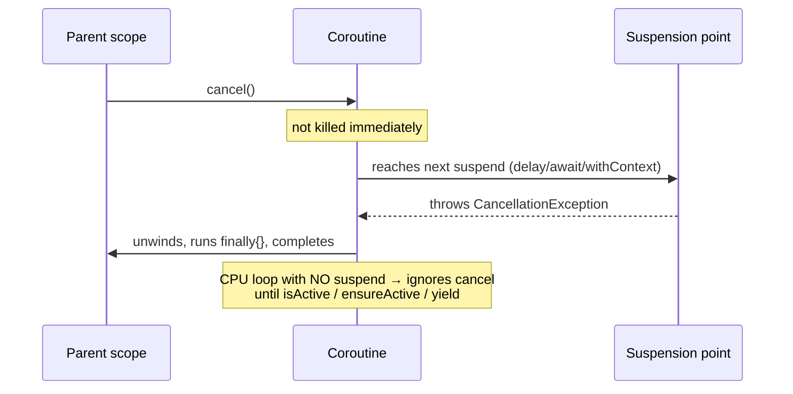
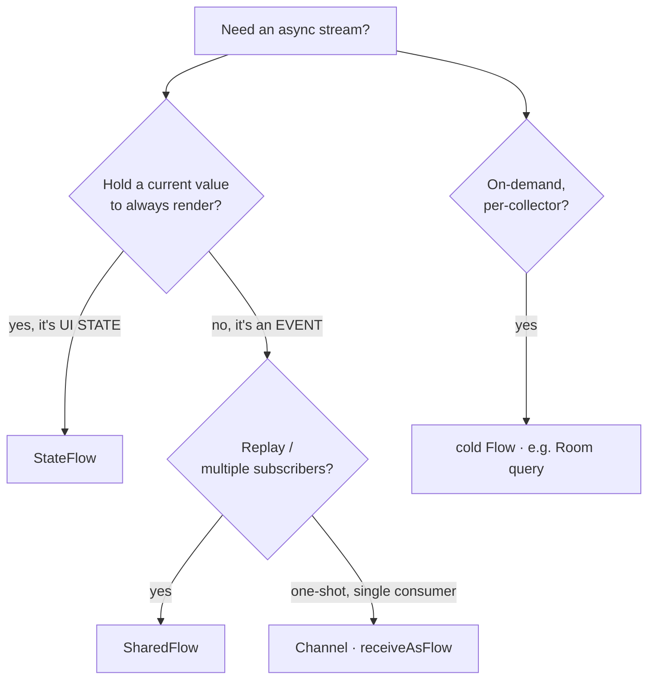

# Kotlin, Coroutines & Flow — Language & Concurrency Q&A

> The language and concurrency questions that gate every Android role — Kotlin fundamentals, structured concurrency, dispatchers, cancellation, and Flow. Compose is *how* you draw the screen; **Kotlin and coroutines are how everything else works** — and where most real bugs (leaks, races, ANRs) live.

**Part of:** [Interview Prep](README.md) · **Pairs with:** [Module 20 · Lesson 03 — Kotlin & Coroutines Questions](../../modules/module-20-career-interview/03-kotlin-coroutines-questions.md)

---

## How interviewers probe this

They climb from "define it" → "use it" → "when does it break." The single most important framing:

> **Coroutines live in a scope tree: cancel the parent, cancel the children. Cancellation is cooperative (it lands at suspension points) — so never swallow `CancellationException`, and make `suspend` functions main-safe.**

```text
        viewModelScope  (Job)          ← cancels when ViewModel cleared
         ├── launch { loadUser() }      (child Job)
         │      └── async { avatar() }  (grandchild)
         └── launch { observe() }       (child Job)
   cancel scope ──▶ CancellationException propagates DOWN to every child
   child throws  ──▶ (default) propagates UP, cancels siblings
                 ──▶ (supervisorScope) isolated, siblings survive
```

### Section index

| # | Section |
|---|---|
| A | [Kotlin language fundamentals](#a-kotlin-language-fundamentals) |
| B | [Coroutine basics & suspension](#b-coroutine-basics--suspension) |
| C | [Structured concurrency](#c-structured-concurrency) |
| D | [Dispatchers & main-safety](#d-dispatchers--main-safety) |
| E | [Cancellation](#e-cancellation) |
| F | [Flow, StateFlow & SharedFlow](#f-flow-stateflow--sharedflow) |
| G | [Exceptions & error handling](#g-exceptions--error-handling) |
| H | [Senior code-reading drills](#h-senior-code-reading-drills) |

---

## A. Kotlin language fundamentals

**🟢 A1 — `val` vs `var`, and what is null safety?**
> `val` is a **read-only reference** (can't be reassigned; the *contents* of a `val` list can still mutate); `var` is reassignable. Null safety means the type system separates nullable (`String?`) from non-null (`String`); you handle null explicitly with `?.` (safe call), `?:` (elvis/default), or `!!` (assert — avoid). This eliminates most `NullPointerException`s at compile time.

**🟢 A2 — What's a `data class` and why is it ideal for state?**
> A class declared `data class` auto-generates `equals`/`hashCode`/`toString`/`copy`/`componentN` from its primary-constructor properties. It's ideal for UI state because `copy()` produces the *next* immutable state cheaply, and value-based `equals` lets `StateFlow`/Compose detect *real* changes (and conflate non-changes).

**🟢 A3 — What does the elvis operator `?:` do?**
> Provides a fallback when the left side is null: `name ?: "Guest"` yields `name` if non-null, else `"Guest"`. It's the idiomatic way to supply defaults and avoid `!!`.

**🟡 A4 — `sealed class`/`sealed interface` — what problem does it solve?**
> It defines a **closed** set of subtypes known at compile time, so a `when` over them is **exhaustive** (no `else` needed) and the compiler flags a missing case when you add one. Perfect for modeling `UiState` (Loading/Success/Error) and events — illegal states become unrepresentable.

**🟡 A5 — Scope functions: `let`, `apply`, `run`, `also`, `with` — how do you pick?**
> By what they return and how they expose the receiver. `let` (it → result) for null-safe transforms (`x?.let { … }`); `apply` (this → receiver) for configuring an object (`builder.apply { … }`); `run` (this → result) for a computed result on a receiver; `also` (it → receiver) for side effects in a chain; `with` for grouping calls on one object. Choose by *return value* (receiver vs result) and *receiver style* (`this` vs `it`).

**🟡 A6 — Extension functions — what are they and what's the catch?**
> Functions added to a type *without* modifying it: `fun String.titlecase() = …`. They're **statically dispatched** (resolved by the declared type, not runtime polymorphism) and can't access private members — they're syntactic sugar over a static helper. Great for readability; don't expect virtual-dispatch behavior.

**🔴 A7 — `inline` functions and reified type parameters — why do they exist?**
> `inline` copies a higher-order function's body (and its lambda) into the call site, eliminating the lambda allocation and call overhead — important for hot, lambda-heavy APIs. It also enables **`reified`** type parameters: because the body is inlined, the type is known at the call site, so `inline fun <reified T> …` can do `T::class`/`is T`, which a normal generic (erased) can't. Cost: code-size growth, so reserve `inline` for small, frequently-called higher-order functions.

**🔴 A8 — Why prefer immutability for state, and how does `copy()` help?**
> Immutable state means every reference is a consistent snapshot — no one can mutate it underneath you, which kills whole classes of concurrency and recomposition bugs. `data class.copy(field = new)` produces the *next* state without mutation, so `StateFlow`/Compose see a new value (correct `equals`) and update exactly once. Mutating in place defeats equality checks and can leave readers stale.

---

## B. Coroutine basics & suspension

**🟢 B1 — What is a `suspend` function?**
> A function that can **pause** its execution and resume later **without blocking** the thread. It can only be called from another `suspend` function or a coroutine. It lets you write async work (network, DB) sequentially instead of with nested callbacks.

**🟢 B2 — Why can't you do blocking work on the main thread?**
> The main thread renders the UI; blocking it freezes the app and triggers an **ANR** ("Application Not Responding"). Blocking/IO work runs on a background dispatcher (`Dispatchers.IO`) so the UI stays responsive.

**🟡 B3 — What's the difference between *suspending* and *blocking*?**
> A **blocked** thread is stuck and can't do other work. A **suspended** coroutine releases its thread at the suspension point — the thread is free to run other coroutines — and the coroutine resumes later (possibly on a different thread). Suspension is cooperative multitasking on a thread pool; blocking wastes a thread.

**🟡 B4 — `launch` vs `async`?**
> `launch` is fire-and-forget; it returns a `Job` and surfaces exceptions to the handler. `async` returns `Deferred<T>`; you call `await()` to get the result, and it **defers** exceptions until awaited. Use `launch` for side effects, `async` for parallel computation you need a result from.

**🟡 B5 — How do you run two calls in parallel and combine the results?**
> Start **both** with `async` *before* awaiting either, then await both:
> ```kotlin
> coroutineScope {
>     val a = async { loadProfile() }   // started now
>     val b = async { loadPosts() }     // started now
>     Screen(a.await(), b.await())      // both already running
> }
> ```
> Because they're started first, they run concurrently. `async { x() }.await()` then `async { y() }.await()` is **sequential**, a common anti-pattern.

**🔴 B6 — What does `suspendCancellableCoroutine` do, and when do you reach for it?**
> It bridges a **callback-based** API into a `suspend` function: you get a continuation to `resume`/`resumeWithException` when the callback fires, and (crucially) an `invokeOnCancellation` hook to **tear down** the callback if the coroutine is cancelled. Use it to wrap legacy listener/callback APIs while preserving cancellation. (The cancellable variant is the right default over `suspendCoroutine`.)

---

## C. Structured concurrency

**🟡 C1 — Explain structured concurrency.**
> Every coroutine runs in a **scope** with a parent `Job`, forming a tree. Three consequences: a scope won't finish until its children finish (**no orphaned work**); cancelling a scope cancels all children (**no leaks**); a child failure propagates to the parent by default. `viewModelScope` cancels on clear, so screen work never outlives the screen.

**🟡 C2 — Why is `viewModelScope` the right place to launch UI-related work?**
> It's **lifecycle-bound** — cancelled automatically when the ViewModel is cleared, so coroutines can't leak past the screen. It also defaults to `Dispatchers.Main.immediate`, correct for updating state, while main-safe `suspend` functions move heavy work off-main internally.

**🔴 C3 — `CoroutineScope` vs `coroutineScope` vs `supervisorScope`?**
> `CoroutineScope(...)` (capital C) **creates** a scope whose lifecycle you own (you must cancel it). `coroutineScope { }` is a suspending builder that inherits context and **fails fast** — one child fails, all are cancelled and it rethrows. `supervisorScope { }` is the same but **isolates** failures — a failing child doesn't cancel its siblings. Use `supervisorScope` when independent tasks shouldn't take each other down.

**🔴 C4 — What is a `SupervisorJob` and where does it belong?**
> A `Job` whose children fail **independently** — one child's failure doesn't cancel the parent or siblings (failure propagates *down* on cancellation, but not *up* on child failure). It belongs at the **root of a long-lived scope** (e.g. a custom application scope, or what `viewModelScope` uses) so one failed task doesn't tear down the whole scope. Within a regular `coroutineScope`, use `supervisorScope` for the same isolation in a suspending block.

**🔴 C5 — Why is `GlobalScope` an anti-pattern?**
> It's **unstructured** — coroutines launched in `GlobalScope` aren't tied to any lifecycle, so they leak (run forever), can't be cancelled as a group, and survive the screen/feature that started them. Always launch in a **lifecycle-bound** scope (`viewModelScope`, a Hilt-provided application scope with a `SupervisorJob`, or a `coroutineScope`).

---

## D. Dispatchers & main-safety

**🟢 D1 — Name the dispatchers and their jobs.**
> `Dispatchers.Main` — UI thread (and `Main.immediate` for state updates). `Dispatchers.IO` — blocking I/O (network, disk, DB). `Dispatchers.Default` — CPU-bound work (parsing, sorting, image math). `Unconfined` — rarely; runs in the caller's thread until first suspension (avoid in app code).

**🟡 D2 — How do you switch dispatchers, and what's the rule?**
> With `withContext(dispatcher) { … }`, which suspends, runs the block on that dispatcher, and returns the result. The rule: switch **at the boundary where the work changes nature** (e.g. wrap a blocking network/disk call in `withContext(IO)`), and keep the switch *inside* the function, not on the caller.

**🔴 D3 — What does "main-safe" mean and how do you design for it?**
> A main-safe `suspend` function is safe to call from the main thread because it moves blocking work off-main **internally** with `withContext(IO/Default)`. Callers never manage threads — a repo's `loadUser()` wraps its own DB/network call; the ViewModel just `launch`es it in `viewModelScope`. Dispatcher discipline lives at the **boundary inside the function**, not smeared across every call site.

**🔴 D4 — Why inject dispatchers instead of hard-coding them?**
> Hard-coding `Dispatchers.IO` makes a function hard to test (you can't substitute a deterministic test dispatcher) and couples it to the real scheduler. Injecting a `DispatcherProvider` (or the individual dispatchers via Hilt) lets tests pass `StandardTestDispatcher`/`UnconfinedTestDispatcher` for fast, deterministic coroutine tests, and lets you tune scheduling centrally.

---

## E. Cancellation

**🟡 E1 — What cancels a coroutine?**
> Cancelling its `Job` or its scope (e.g. `viewModelScope` on clear), a parent's cancellation, or — by default — a sibling/child failure in a non-supervised scope. Cancellation throws `CancellationException` at the next suspension point.

**🔴 E2 — How does cancellation actually work, and how is it commonly broken?**
> Cancellation is **cooperative** — it sets the `Job` inactive and throws `CancellationException` at the next **suspension point** (`delay`, `await`, `withContext`). A tight CPU loop with no suspension **ignores** cancellation until it checks `isActive` / `ensureActive()` / `yield()`. It's broken when code does `try { } catch (e: Exception) { }` and **swallows** `CancellationException` — you must rethrow it (or catch only your own exceptions). Cleanup goes in `finally`; if cleanup must suspend, use `withContext(NonCancellable)`.

```kotlin
// ❌ Breaks cancellation — swallows CancellationException:
try { work() } catch (e: Exception) { log(e) }

// ✅ Rethrow cancellation, handle the rest:
try {
    work()
} catch (e: CancellationException) {
    throw e
} catch (e: Exception) {
    log(e)
} finally {
    withContext(NonCancellable) { cleanup() }  // suspend safely during cleanup
}
```

**🔴 E3 — A CPU-bound loop ignores cancellation. Why, and how do you fix it?**
> Because cancellation only lands at **suspension points**, and a tight arithmetic loop never suspends. Fix by cooperating: call `ensureActive()` (or check `isActive`, or `yield()`) inside the loop so it throws `CancellationException` promptly when cancelled. For heavy CPU work, also run it on `Dispatchers.Default` and chunk it.



**🔴 E4 — Why must you not catch `CancellationException` like a normal error?**
> Because cancellation *is* signalled by throwing it. Swallowing it tells the coroutine "keep going" after it was told to stop — the work keeps running (a leak/zombie), `finally`/cleanup may be skipped, and parent cancellation appears to "not work." It must propagate so the structured-concurrency machinery can complete the cancellation.

---

## F. Flow, StateFlow & SharedFlow

**🟢 F1 — What is a `Flow`?**
> A **cold** asynchronous stream of values, built from suspend functions. "Cold" = the producer runs **per collector**, on demand, starting fresh each `collect`. A Room query exposed as `Flow` re-runs for each collector. It supports operators (`map`, `filter`, `debounce`, `flatMapLatest`).

**🟡 F2 — `Flow` vs `StateFlow` vs `SharedFlow` — when each?**
> | Type | Hot/Cold | Holds a value? | Use for |
> |---|---|---|---|
> | `Flow` | cold (per collector) | no | on-demand streams (a DB query) |
> | `StateFlow` | hot | **yes** (always current) | UI **state** the screen renders |
> | `SharedFlow` | hot | configurable replay | one-shot **events** (navigation) |
>
> State has a value to re-render; events don't (so they don't re-fire on rotation).

**🟡 F3 — Why is UI state a `StateFlow` and a one-shot event a `SharedFlow`/`Channel`?**
> `StateFlow` always has a **current value** to render and **conflates** duplicates — perfect for "the screen's current snapshot." A one-shot event (navigate, show a snackbar) has no "current value"; if you put it in a `StateFlow` it **replays** to new collectors and **re-fires on rotation**. Use `SharedFlow` (replay 0) or a `Channel`-backed `Flow` so each event is consumed once.

**🟡 F4 — How do you create a `StateFlow` from a cold `Flow`?**
> With `.stateIn(scope, started, initialValue)` — e.g. `repository.notes().stateIn(viewModelScope, SharingStarted.WhileSubscribed(5_000), emptyList())`. `WhileSubscribed(5s)` keeps the upstream alive briefly after the last collector leaves (surviving a rotation) then stops it — the idiomatic ViewModel pattern.

**🟡 F5 — What does `collectAsStateWithLifecycle` add over `collectAsState`?**
> It **stops collecting** when the lifecycle drops below `STARTED` (app backgrounded), avoiding wasted work and stale updates; `collectAsState` keeps collecting in the background. The lifecycle-aware version is the Android default.

**🔴 F6 — `flatMapLatest` vs `flatMapMerge` vs `flatMapConcat` — give the search example.**
> `flatMapLatest` **cancels** the previous inner flow when a new value arrives — exactly what search-as-you-type needs (cancel the stale request when the query changes). `flatMapMerge` runs inner flows concurrently (no cancellation, results interleave). `flatMapConcat` runs them sequentially in order. For "latest query wins," `flatMapLatest` (or `collectLatest`).

```kotlin
val results: Flow<List<Hit>> = queryFlow
    .debounce(300)                 // wait for typing to settle
    .distinctUntilChanged()
    .flatMapLatest { q ->          // cancels the in-flight search on a new query
        repository.search(q)       // only the latest survives
    }
```

**🔴 F7 — `StateFlow` conflation & equality — how can it cause "my UI didn't update"?**
> `StateFlow` conflates and uses `equals`: emitting a value `==` the current one **emits nothing** to collectors. If your state type's `equals` is wrong, or you mutate a value **in place** (same reference), collectors never see the change — "UI didn't update." Combined with an unstable type it can also over-update. Fix: immutable `data class` state with correct value-equality; always emit a **new** instance via `copy()`.

**🔴 F8 — `SharedFlow` configuration — `replay`, `extraBufferCapacity`, `onBufferOverflow`?**
> `replay` = how many past values a new collector receives (0 for events, N for caching). `extraBufferCapacity` = buffer beyond replay so a fast emitter doesn't suspend. `onBufferOverflow` = what to do when full (`SUSPEND`, `DROP_OLDEST`, `DROP_LATEST`). For one-shot events: `replay = 0`, a small `extraBufferCapacity`, and `DROP_OLDEST` or `SUSPEND` depending on whether dropping is acceptable.

---

## G. Exceptions & error handling

**🟡 G1 — How do exceptions propagate in coroutines?**
> In a regular scope, an uncaught exception in a child **cancels the parent and siblings** and propagates up to the scope. `launch` surfaces exceptions immediately (to a `CoroutineExceptionHandler` at the root); `async` **holds** the exception until you `await()` the `Deferred`. A `supervisorScope`/`SupervisorJob` stops a child's failure from cancelling its siblings.

**🟡 G2 — Where does a `try/catch` go — around the call or inside?**
> Around the **suspending call** that can fail, inside the coroutine — `launch { try { repo.load() } catch (e: IOException) { … } }`. Wrapping the `launch` itself doesn't catch exceptions thrown inside the coroutine (they propagate through the `Job`, not the calling frame). And catch **specific** exceptions so you don't swallow `CancellationException`.

**🔴 G3 — `CoroutineExceptionHandler` — when does it fire and when is it ignored?**
> It's a last-resort handler installed in a **root** coroutine's context; it fires for **uncaught** exceptions from `launch` (and propagated failures). It's **ignored** for `async` (the exception is deferred to `await`) and for non-root coroutines (the exception propagates to the parent first). So it's for top-level "log/report and move on," not per-call error handling.

**🔴 G4 — How do you handle errors in a `Flow`?**
> With the `.catch { }` operator (which only catches **upstream** exceptions and can emit a fallback), `onCompletion` for cleanup, and `retry`/`retryWhen` for transient failures. Don't wrap a whole `collect` in `try/catch` for upstream errors — use `catch` so it composes; reserve `try/catch` around `collect` for downstream/collector-side failures. Map errors into your `UiState` (e.g. `catch { emit(UiState.Error(it)) }`).

---

## H. Senior code-reading drills

> Interviewers love a "what's wrong with this snippet?" round. Five canonical bugs — read each, name the bug, give the fix.

**H1 — Swallowed cancellation**
```kotlin
viewModelScope.launch {
    try { repo.sync() }
    catch (e: Exception) { Log.e(TAG, "sync failed", e) }  // ❌
}
```
> **Bug:** catches `CancellationException`, breaking cooperative cancellation — `sync()` keeps running after the scope is cancelled. **Fix:** `catch (e: CancellationException) { throw e }` first, or catch the specific exception (`IOException`).

**H2 — Event in a `StateFlow`**
```kotlin
private val _navigate = MutableStateFlow<Route?>(null)  // ❌
val navigate: StateFlow<Route?> = _navigate
```
> **Bug:** a one-shot navigation event modeled as state — it **replays** on every new collector and **re-fires on rotation**. **Fix:** a `SharedFlow<Route>` with `replay = 0` (or a `Channel.receiveAsFlow()`), consumed in a lifecycle-aware effect.

**H3 — Fake parallelism**
```kotlin
val a = async { loadProfile() }.await()  // ❌ awaits before starting b
val b = async { loadPosts() }.await()
```
> **Bug:** sequential, not parallel — `b` doesn't start until `a` finishes. **Fix:** start both, then await both: `val a = async { … }; val b = async { … }; use(a.await(), b.await())`.

**H4 — Missing main-safety**
```kotlin
// Repository
suspend fun loadUser(id: String): User = api.fetchUser(id)  // blocking, no withContext
// ViewModel call site
viewModelScope.launch(Dispatchers.IO) { … }                 // ❌ caller fixes threading
```
> **Bug:** the repo isn't main-safe, so every caller must remember `Dispatchers.IO` — dispatcher logic leaks to call sites. **Fix:** `suspend fun loadUser(id) = withContext(Dispatchers.IO) { api.fetchUser(id) }`; the ViewModel just `launch`es with no dispatcher.

**H5 — `GlobalScope` leak**
```kotlin
fun onSendClicked(text: String) {
    GlobalScope.launch { repo.send(text) }  // ❌
}
```
> **Bug:** unstructured — leaks past the screen, no lifecycle, can't be cancelled. **Fix:** launch in `viewModelScope` (or `rememberCoroutineScope` if it's a Compose event), so it's cancelled with the screen.

---

## Quick-reference tables

**Coroutine builder cheat sheet**

| Builder | Returns | Exceptions | Use |
|---|---|---|---|
| `launch` | `Job` | surfaced to handler immediately | fire-and-forget side effects |
| `async` | `Deferred<T>` | deferred until `await()` | parallel work you need a result from |
| `coroutineScope { }` | result of block | fail-fast (cancels siblings) | grouping concurrent children, all-or-nothing |
| `supervisorScope { }` | result of block | isolated per child | independent children that shouldn't cascade |
| `withContext(d) { }` | result of block | propagates | switch dispatcher for a section |

**Flow type by intent**

| Intent | Type | Why |
|---|---|---|
| On-demand DB/network stream | cold `Flow` | per-collector, lazy |
| Screen's current state | `StateFlow` | always has a value, conflates |
| One-shot event (navigate, toast) | `SharedFlow(replay=0)` / `Channel` | no replay, consumed once |
| Cache last N + stream | `SharedFlow(replay=N)` | replays to new collectors |



---

## Validation — prove the concurrency behaves

1. **Turbine test** asserting the `Flow`/`StateFlow` emits what you claim (loading → success/error).
2. **Cancellation test:** cancel the scope mid-work and assert the coroutine stops and runs `finally` — catches a swallowed-cancellation bug.
3. **Parallelism check:** log timestamps and confirm two `async`s overlap, not run back-to-back.
4. **StrictMode on a real device** to catch accidental main-thread blocking that broke main-safety.

> **AI drafts, you decide.** AI-generated coroutine code is unusually good *drill material* because it reliably contains the canonical bugs (swallowed cancellation, misused `StateFlow`, missing `withContext`). Catch them before an interviewer does.

---

## Related

- [Module 20 · Lesson 03 — Kotlin & Coroutines Questions](../../modules/module-20-career-interview/03-kotlin-coroutines-questions.md) — the teaching version with traps and AI drill prompts.
- [Module 06 — Side Effects](../../modules/module-06-side-effects/README.md) — coroutines from composables, keyed and leak-free.
- [question-bank.md · §10 Coroutines & Flow](question-bank.md#10-coroutines--flow) — the condensed essentials.
- [mock-interview-scripts.md](mock-interview-scripts.md) — run a concurrency code-review drill with an AI interviewer.
