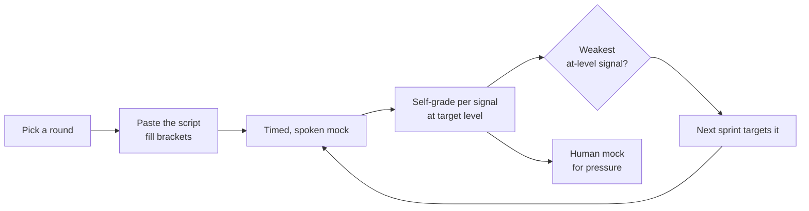

# Mock Interview Scripts — Run an AI Mock + Self-Grade

> Copy-paste prompts to run a realistic AI mock interview for every round (phone screen, Android/Compose deep-dive, coding, system design, behavioral, AI-era pairing), each paired with a self-grading rubric. The single highest-leverage prep activity is the **timed, spoken mock** — it surfaces exactly the gaps a real interviewer will.

**Part of:** [Interview Prep](README.md) · **Pairs with:** [Module 20 · Lesson 01 — The Android Interview Roadmap](../../modules/module-20-career-interview/01-the-android-interview-roadmap.md)

---

## How to run a mock that actually works

1. **Produce, don't consume.** Speak your answers **out loud** (or type them in full); reading a model answer is not practice.
2. **Time it.** Set the clock for the round's real length. Pressure is the training.
3. **Configure the model up front** — paste a script below, fill the `[BRACKETS]` (target level, role, your weak areas), and tell it *not* to reveal answers until you've attempted them.
4. **Grade on the real rubric, at your target level.** A "hire" that's only a hire one band *down* is still a gap. (Leveling is the hidden axis — [Lesson 01](../../modules/module-20-career-interview/01-the-android-interview-roadmap.md).)
5. **Verify API claims.** AI over-praises and occasionally gives outdated answers (`collectAsState`, mis-stated Strong Skipping). Cross-check anything version-sensitive against the current Compose BOM docs.
6. **Finish with a human.** AI can't replicate silence-pressure and skeptical follow-ups. Do a final mock with a peer/mentor.

> **The loop:** run a mock → self-grade per signal → your **weakest at-level signal** is the next sprint → re-mock until consistent. Committees trust a steady 8-across over a 10/3 spike.



### Round index

| Round | Script | Length |
|---|---|---|
| 1 | [Recruiter / phone screen](#1-recruiter--phone-screen) | 20–30 min |
| 2 | [Android / Compose deep-dive](#2-android--compose-deep-dive) | 45–60 min |
| 3 | [Coding (with talk-aloud)](#3-coding-with-talk-aloud) | 45 min |
| 4 | [System design](#4-system-design) | 45–60 min |
| 5 | [Behavioral](#5-behavioral) | 45 min |
| 6 | [AI-era pairing](#6-ai-era-pairing-review-the-ai) | 45 min |
| — | [Full loop simulation](#7-full-loop-simulation) | half-day |

---

## 1. Recruiter / phone screen

> Tests fit, comms, comp alignment, and "no red flags." The opener sets the frame for the whole loop.

**Copy-paste prompt:**
```text
Act as a friendly but professional technical recruiter at [COMPANY TYPE — e.g. a product
company] screening me for a [LEVEL — e.g. Senior / L5] Android role. Run a realistic
20-minute recruiter screen, ONE question at a time, waiting for my answer before the next.
Cover: my 60-second background pitch, why I'm looking, my Android focus and a signature
accomplishment, a couple of light technical sanity checks, and comp expectations (probe
whether I anchor first). Stay in character. At the end, give me feedback on: clarity of my
pitch, whether I summarized my work crisply, any red flags, and whether I handled the comp
question well (I should NOT anchor first). Then score me 1–4 on each.
```

**Self-grade rubric:**

| Signal | 1 — no-hire | 4 — strong |
|---|---|---|
| 60-second pitch | Rambling, no signature win | Tight: who I am, Android focus, one quantified accomplishment, what I want |
| "Why looking" | Bashes current employer | Forward, positive — what I'm moving *toward* |
| Communication | Long, unfocused | Crisp, structured, easy to summarize |
| Comp handling | Anchored low first | Deferred politely; asked their range |
| Red flags | Negativity / vagueness | None — calm, specific, enthusiastic |

> **Pass bar:** a stranger could repeat back what you do and what you want after your pitch.

---

## 2. Android / Compose deep-dive

> Tests **depth** — the round where the [question bank](question-bank.md) pays off. Interviewers climb a theme to find your ceiling.

**Copy-paste prompt:**
```text
You are a senior Android interviewer conducting a 45-minute Compose/Android deep-dive for
a [LEVEL] candidate. Quiz me ONE question at a time, CLIMBING from beginner to senior
within a theme (state → recomposition → effects → performance → internals), then move to
the next theme. After EACH of my answers: rate it 1–4, point out anything outdated for
2026 (e.g. should be collectAsStateWithLifecycle; Strong Skipping nuances; deprecated
effect patterns), then ask the natural follow-up that goes one level deeper. If I'm
confidently wrong, dock the score and tell me. Do NOT give me the model answer until I've
attempted it. Push on stability, the three phases, and cancellation. Keep going until you
find my ceiling per theme.
```

**Targeted variants** (swap the theme): paste the same script but replace the climb with one theme — *"focus entirely on recomposition & stability"* or *"focus on side effects and keys"* — to drill a weak area.

**Self-grade rubric:**

| Signal | 1 — no-hire | 4 — strong |
|---|---|---|
| Recall (🟢) | Confuses `remember`/`rememberSaveable` | Crisp definitions + the distinction in one breath |
| Application (🟡) | "LaunchedEffect runs every recompose" | Correct keys/lifecycle, names the practical rule |
| Internals (🔴) | "UI redraws" | Restartable groups, snapshots, 3 phases, deferred reads |
| Currency | `collectAsState`, `observeAsState` | Names the 2026 idiom and *why* it superseded the old |
| Calibration | Confidently wrong | "Not certain — here's the mechanism and how I'd verify" |

> **Pass bar:** on a 🔴 you didn't know, you showed *where your knowledge ends* instead of bluffing.

---

## 3. Coding (with talk-aloud)

> Tests problem-solving **and** that you can talk while coding. Silent struggling and no test cases are the common kills. For DSA depth, see the `algo-sensei` skill.

**Copy-paste prompt:**
```text
Act as an Android coding interviewer. Give me ONE coding problem at a time appropriate for
a [LEVEL] candidate — mix of (a) a DSA problem and (b) an Android-flavored task (e.g.
"implement a debounced search Flow", "write a ViewModel that exposes paginated UiState",
"parse this JSON into immutable state"). Make me TALK THROUGH my approach before coding,
state test cases and edge cases, then write the solution. Interrupt if I go silent or skip
edge cases. After I finish: review correctness, complexity (time/space), Kotlin idioms,
and whether I tested. Score me 1–4 on problem-solving, code quality, communication, and
testing. Then ask one follow-up that extends the problem (e.g. "now make it cancel stale
requests").
```

**Self-grade rubric:**

| Signal | 1 — no-hire | 4 — strong |
|---|---|---|
| Problem-solving | Stuck silently; brute force only | Clarified, picked an approach, reasoned about complexity |
| Communication | Coded in silence | Narrated approach + trade-offs throughout |
| Code quality | Non-idiomatic, mutable mess | Idiomatic Kotlin, immutable, null-safe, structured |
| Edge cases / testing | None mentioned | Stated test cases up front; handled empty/error/cancel |
| Android fluency | Wrong scope/dispatcher | Correct `viewModelScope`, main-safety, Flow operators |

> **Pass bar:** you stated test cases *before* coding and never went silent for more than ~20 seconds.

---

## 4. System design

> Open-ended; rewards breadth + trade-off reasoning. Often the hardest round and where seniority shows. Use the [framework](system-design.md).

**Copy-paste prompt:**
```text
Act as a senior Android system-design interviewer. Give me ONE prompt (image feed,
offline-first sync app, or offline chat). As I design OUT LOUD, interrupt to poke at weak
spots — push on requirement clarification, source of truth, pagination strategy (cursor vs
offset), sync conflicts and idempotency, Doze/background limits, and image memory. Do NOT
accept hand-waving on conflict resolution ("it just syncs"). Make me name trade-offs and
the cost of my own choices. At the end, score me 1–4 at a [LEVEL] bar on: requirement
clarification, data modeling, mobile-platform awareness, trade-off articulation, and
communication. Tell me the single weakest signal and what a stronger answer would have
covered.
```

**Self-grade rubric:**

| Signal | 1 — no-hire | 4 — strong |
|---|---|---|
| Clarify | Jumped to "I'll use Room" | Asked functional **and** NFRs; restated scope |
| Data modeling | No clear source of truth | Local DB = truth; modeled sync metadata (status/version/deleted) |
| Platform awareness | Backend-flavored | Paging 3/`RemoteMediator`, Coil downsampling, WorkManager + Doze unprompted |
| Trade-offs | Listed benefits only | Named conflict policy + idempotency + the cost of own choice |
| Communication | Rambled, no diagram | Narrated, drew boxes/arrows, went deep where poked |

> **Pass bar:** you survived *"what happens offline? on a retry? on a conflict?"* with a real answer for each.

---

## 5. Behavioral

> Predicts future behavior from past. Strong engineers fail loops here by rambling, blaming, or telling task-completion stories that cap their level. Use [behavioral.md](behavioral.md).

**Copy-paste prompt:**
```text
Act as a behavioral interviewer for a [LEVEL] Android role. Ask me THREE behavioral
questions one at a time (conflict, failure, and influence-without-authority). After each
STAR answer, score it: is the Situation too long (it should be ~10%)? Is the Action
specific and FIRST-PERSON ("I", not "we")? Is the Result quantified? Critically: does the
SCOPE signal [LEVEL] (problem-identification + influence + ownership) or just task
completion? Rewrite my weakest answer to level it UP. Flag any blame-shifting or fake
weakness ("I just care too much"). Keep me honest on "we" vs "I".
```

**Self-grade rubric:**

| Signal | 1 — no-hire | 4 — strong |
|---|---|---|
| STAR shape | 80% Situation, "it worked out" | Short S, long first-person A, quantified R |
| Pronouns | All "we" (invisible) or credit-stealing "I" | "We" for the goal, "I" for my actions |
| Scope / level | "I implemented the ticket" | "I identified, drove alignment, owned the outcome" |
| Failure/conflict | Blame-shift or humble-brag | Ownership + learning; disagreed-and-committed |
| Authenticity | Generic/fabricated | Specific, true, with a real consequence |

> **Pass bar:** every story shows *your* action and a result, and at least two signal your **target level's scope**, not task completion.

---

## 6. AI-era pairing (review the AI)

> Many 2026 loops watch you **prompt and review** AI rather than code from scratch — they grade *judgment*: can you catch the AI's mistakes and justify every line? ([Module 20 · Lesson 06](../../modules/module-20-career-interview/06-ai-era-android-skills.md).)

**Copy-paste prompt:**
```text
Act as an interviewer running an AI-assisted pairing round for a [LEVEL] Android role.
Give me a small Compose/Kotlin task, then PASTE a plausible AI-generated solution that
contains 2–3 subtle 2026 mistakes (e.g. collectAsState instead of
collectAsStateWithLifecycle, a swallowed CancellationException, an unstable List param
defeating skipping, a StateFlow used for a one-shot event, a missing key on a
LaunchedEffect). Ask me to REVIEW it: find the issues, explain WHY each is wrong, and fix
them. Then ask me to justify the architecture. Score me 1–4 on: catching the bugs,
explaining the runtime/reasoning (not just "it's wrong"), correctness of my fixes, and
whether I'd merge it. Don't tell me the bugs — make me find them.
```

**Self-grade rubric:**

| Signal | 1 — no-hire | 4 — strong |
|---|---|---|
| Catching issues | Accepted the AI output as-is | Found the lifecycle/stability/cancellation bugs |
| Explaining why | "It's just wrong" | Named the runtime reason (background collection, swallowed cancel, unstable type) |
| Fixes | Wrong or partial | Correct 2026-idiomatic fixes |
| Judgment | Would merge slop | Routed output back through the best-practices checklist |

> **Pass bar:** you caught every planted bug and could explain the *mechanism*, not just flag it. **AI drafts, you decide.**

---

## 7. Full loop simulation

> Once per week in the final phase, run rounds 2–5 back-to-back in one sitting. The committee distrusts a **spiky** profile more than a uniform one — the loop tests *consistency*.

**Copy-paste prompt:**
```text
You are running a full Android onsite loop for a [LEVEL] candidate, simulating four
back-to-back rounds with NO breaks unless I ask: (1) Compose/Android deep-dive, (2) one
coding problem with talk-aloud, (3) one system-design prompt (offline-capable), (4)
behavioral (conflict + influence). Run each round in character, one question at a time.
After ALL four, act as the hiring committee: give me a per-round score (1–4), a level
recommendation, call out any INCONSISTENCY across rounds (a strong round next to a weak
one reads as luck), and tell me my single binding constraint — the weakest at-level signal
to fix next.
```

**Loop scorecard** (fill after each full loop — this is the committee's instrument):

| Round | Score (1–4) | At target level? | Weakest gap (1 line) |
|---|---|---|---|
| Android deep-dive | | | |
| Coding | | | |
| System design | | | |
| Behavioral | | | |
| **Consistency** | (spread across rounds) | — | (spiky = luck signal) |

> **Rule:** your **weakest at-level signal** is the binding constraint — direct the next sprint entirely at it. Re-mock until the profile is consistent. A confident-wrong answer is an automatic **−1** to that signal.

---

## Master self-calibration rubric

The instrument to use after **any** mock — the same shape the real committee uses (from [Lesson 01](../../modules/module-20-career-interview/01-the-android-interview-roadmap.md)):

```text
Rate 1–4 (1=no-hire, 2=mixed, 3=hire, 4=strong-hire) PER signal,
then ask: "Is a 3 here a 3 at MY TARGET LEVEL?"

  SIGNAL                          SCORE   AT-LEVEL?   EVIDENCE / GAP
  ──────────────────────────────  ─────   ─────────   ──────────────────────────
  Problem solving (coding)         _       _           ____________________
  Compose/Android depth            _       _           ____________________
  System design scope              _       _           ____________________
  Communication / structure        _       _           ____________________
  Behavioral / leveling (scope)    _       _           ____________________
  AI judgment (review the AI)      _       _           ____________________

RULE: your WEAKEST at-level 'no' is your next sprint. Fix that one. Re-mock.
RULE: a confident WRONG answer is an automatic -1 to that signal. Calibrate.
```

| Score | Meaning | Action |
|---|---|---|
| 4 | Strong hire at target level | Maintain; don't over-invest |
| 3 | Hire, but flat or only at a lower band | Sharpen scope/trade-offs |
| 2 | Mixed — right idea, outdated or vague | Targeted re-drill |
| 1 | No-hire, or confidently wrong | Re-learn the concept, then re-mock |

> Always pair a score with **evidence + the specific gap** — that's what turns a vague feeling ("design felt off") into an actionable sprint ("discuss sync conflicts and pagination").

---

## Related

- [Module 20 · Lesson 01 — The Android Interview Roadmap](../../modules/module-20-career-interview/01-the-android-interview-roadmap.md) — the self-calibration loop and leveling.
- [question-bank.md](question-bank.md) — the questions to feed into rounds 2 & 3.
- [system-design.md](system-design.md) — the framework for round 4.
- [behavioral.md](behavioral.md) — STAR stories and leveling for round 5.
- [kotlin-coroutines.md](kotlin-coroutines.md) — the concurrency code-review drills.
