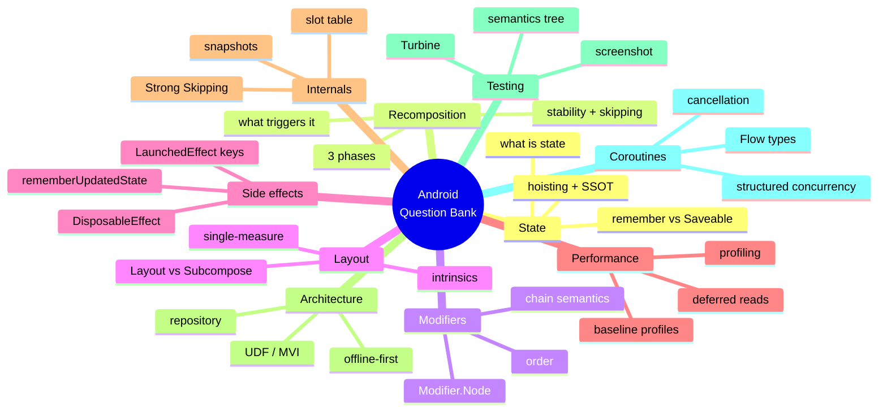
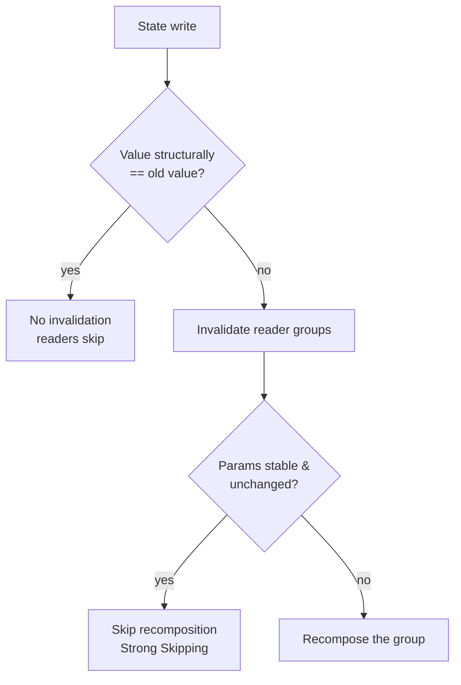

# The Compose & Android Question Bank

> A curated, layered bank of the questions Android interviewers actually ask — organized by topic, tagged 🟢 Beginner / 🟡 Intermediate / 🔴 Senior, each with a concise model answer you can say out loud. 90+ questions.

**Part of:** [Interview Prep](README.md) · **Pairs with:** [Module 20 · Lesson 02 — Compose Question Bank](../../modules/module-20-career-interview/02-compose-question-bank.md)

---

## How to use this bank

1. **Answer out loud first.** Interviews test *retrieval under pressure*, not recognition. Cover the model answer, attempt the question, then compare.
2. **Climb each topic.** Interviewers walk *up* a theme (🟢 → 🟡 → 🔴) to find your ceiling. Train the whole ladder, not just the rung you like.
3. **On a 🔴 you don't know, say how you'd verify** — "the mechanism is X; I'd confirm the exact API against the current Compose BOM." Calibrated uncertainty beats confident-wrong every time.
4. **Tag your misses → flashcards → spaced repetition.** See the [weekly study plan](../../course/weekly-study-plan.md).

> **Mental model:** *Answer the entry question so well it invites the follow-up you're ready for.* You steer the round toward your strengths.

### Topic index

| # | Topic | Anchored in |
|---|---|---|
| 1 | [State](#1-state) | [Module 03](../../modules/module-03-state-management/README.md) |
| 2 | [Recomposition](#2-recomposition) | [Module 03](../../modules/module-03-state-management/README.md) · [Module 11](../../modules/module-11-performance/README.md) |
| 3 | [Modifiers](#3-modifiers) | [Module 04](../../modules/module-04-modifiers/README.md) |
| 4 | [Layout](#4-layout) | [Module 02](../../modules/module-02-layouts/README.md) · [Module 05](../../modules/module-05-custom-layouts/README.md) |
| 5 | [Side effects](#5-side-effects) | [Module 06](../../modules/module-06-side-effects/README.md) |
| 6 | [Performance](#6-performance) | [Module 11](../../modules/module-11-performance/README.md) |
| 7 | [Internals](#7-internals) | [Module 12](../../modules/module-12-internals/README.md) |
| 8 | [Architecture](#8-architecture) | [Module 13](../../modules/module-13-architecture/README.md) |
| 9 | [Testing](#9-testing) | [Module 14](../../modules/module-14-testing/README.md) |
| 10 | [Coroutines & Flow](#10-coroutines--flow) | [Module 06](../../modules/module-06-side-effects/README.md) · [kotlin-coroutines.md](kotlin-coroutines.md) |
| 11 | [Navigation, theming & lifecycle](#11-navigation-theming--lifecycle) | [Module 09](../../modules/module-09-material3-theming/README.md) |

A quick map of how interviewers climb each theme:

```text
   🟢 "What is it?"  ── solid? ──▶  🟡 "How / when / vs?"  ── solid? ──▶  🔴 "When does it break?"
        recall                          application + comparison              trade-offs + internals
   ── shaky at any rung → they stop climbing and note the ceiling (→ level) ──
```



---

## 1. State

> Compose has one job: turn state into UI — `UI = f(state)`. This is the most-probed topic; fluency here gates the Android deep-dive. Full treatment in [Module 03](../../modules/module-03-state-management/README.md).

**🟢 1.1 — What is "state" in Compose?**
> Any value that can change over time *and* that the UI reads to render itself. When a composable **reads** a `State`, that read is a *subscription*: a later write re-runs that composable. `UI = f(state)`.

**🟢 1.2 — What does `remember` do?**
> It caches a value across recompositions so it isn't recreated each time the composable re-runs. `remember { mutableStateOf(0) }` keeps the **same** state object across recompositions. It does **not** survive configuration change or process death — that's `rememberSaveable`.

**🟢 1.3 — `remember` vs `rememberSaveable`?**
> Both survive recomposition. `rememberSaveable` **also** survives configuration changes and process death by saving into a `Bundle` (via a `Saver`), so a rotated screen keeps its value. Reach for `rememberSaveable` for user input you'd hate to lose (form fields, scroll-to position you want restored).

**🟢 1.4 — What's `mutableStateOf` and why must it be wrapped in `remember`?**
> `mutableStateOf(x)` creates an observable `MutableState` Compose can track. Without `remember`, a fresh state object is created on *every* recomposition, so writes are lost and the value resets — the classic "my counter won't increment" bug.

**🟡 1.5 — `remember`, `rememberSaveable`, or a `ViewModel` — how do you decide?**
> Ask *what must survive what*. UI-only ephemeral state (expanded/collapsed, a transient scroll flag) → `remember`. Screen-local state that must survive **rotation/process death** but has no business logic (form input) → `rememberSaveable`. Business/screen state with logic, tied to a scope, surviving config changes → **ViewModel + `StateFlow`**. App-wide/persisted → repository → DataStore/Room. (Decision tree in [Module 03](../../modules/module-03-state-management/README.md).)

**🟡 1.6 — What is state hoisting and what does it buy you?**
> Moving state *out* of a composable to its caller, leaving the composable **stateless** — it takes a `value` and emits an `onValueChange`. Benefits: reusability (the same UI drives different state), testability (no hidden state), and a single source of truth (the owner holds it once). The pattern is the `value` + `onValueChange` pair.

**🟡 1.7 — Why expose immutable `UiState` from a ViewModel instead of mutable fields?**
> A single immutable `data class UiState` means every frame is a **consistent snapshot** — you can't render a half-updated screen. Exposing `MutableState`/mutable fields lets callers mutate your truth and lets independent fields drift into impossible combinations (spinner over stale data). Expose `StateFlow<UiState>`; update via `copy()`.

**🟡 1.8 — What is unidirectional data flow (UDF)?**
> State flows **down** (ViewModel → UI) and events flow **up** (UI → ViewModel). The UI is a pure function of state and never mutates state directly — it sends an event; the ViewModel produces the next state. Predictable, testable, no two-way binding tangles.

**🔴 1.9 — A `TextField` "won't type" — the cursor blinks but characters don't appear. Diagnose.**
> Classic state-loop break. Either the state isn't hoisted correctly (the composable reads a `value` but the `onValueChange` updates a *different* or non-observed variable), or the value is held in a plain `var` not backed by `mutableStateOf`/`remember`, so recomposition discards the edit. Fix: the `value` the field reads and the state the `onValueChange` writes must be the **same** observable source of truth.

**🔴 1.10 — How do you guarantee a single source of truth across two screens that edit the same entity?**
> One owner holds the entity — typically the **repository** backed by the DB — and both screens **observe** it (e.g. a shared `Flow`/`StateFlow`), never keeping private copies. Edits go through the owner; both screens re-render from the same emission. Two screens each holding their own copy will inevitably disagree. (Repository pattern — [Module 13 · Lesson 04](../../modules/module-13-architecture/04-repository-pattern.md).)

**🔴 1.11 — When would you choose `derivedStateOf` over just computing a value in the composition?**
> When you derive state from **frequently-changing** state but only care about a **coarser** result, and want to avoid recomposing on every fine-grained change. Example: `val showButton by remember { derivedStateOf { listState.firstVisibleItemIndex > 0 } }` recomposes readers only when the *boolean* flips, not on every scroll pixel. If the inputs change at the same rate as the output, `derivedStateOf` is needless overhead — just compute it. (Module 06 · Lesson 07.)

**🔴 1.12 — How does equality policy cause over- or under-recomposition?**
> `mutableStateOf` uses `structuralEqualityPolicy` by default: a write that is `==` the current value emits **nothing**. If your type's `equals` is wrong (e.g. an unstable class with identity equality), equal-looking updates still fire (over-recompose); conversely, mutating a value *in place* without changing the reference can mean readers never see the change (under-update). Use immutable `data class`es so value-equality is correct, and pick `referentialEqualityPolicy`/`neverEqualPolicy` deliberately when you need it.

---

## 2. Recomposition

> Recomposition is *surgical re-execution*, not a redraw. Senior answers reason about the **runtime**, not just the API. Anchored in [Module 03](../../modules/module-03-state-management/README.md) and [Module 11](../../modules/module-11-performance/README.md).

**🟢 2.1 — What is recomposition?**
> Compose re-runs the composable functions that **read changed state** to produce a new UI description. It's surgical — only the affected restartable groups re-run, not the whole screen — and it's separate from the actual pixel draw, which is a later phase.

**🟢 2.2 — Recomposition vs a normal View redraw?**
> A View `invalidate()` repaints a whole view. Recomposition re-runs *only* the functions that read the changed state to compute a new description of the UI; the framework then updates just what differs. Granularity is the **restartable group**, not the screen.

**🟡 2.3 — What triggers recomposition, and what scope recomposes?**
> A **write to a snapshot `State`** that some composable **read** during composition. Only the readers (restartable groups) that read the changed state recompose — reading state low and locally keeps the blast radius small. Reading state high in the tree recomposes everything below.



**🟡 2.4 — What makes a composable "skippable"?**
> The compiler marks a composable skippable when all its parameters are **stable** (or, with Strong Skipping, when unstable params are *referentially equal* to last time). On recomposition, if the inputs compare equal, Compose **skips** re-running it. Unstable params (a plain `List`, an unannotated class) defeat this unless their references are unchanged.

**🟡 2.5 — Why does reading state "as low as possible" matter?**
> The reader is what gets invalidated. If a parent reads a value just to pass it to one child, the *parent* (and all its other children) recompose on every change. Pushing the read down to the single child that needs it — or passing a lambda that reads it in a later phase — shrinks the recomposition scope.

**🔴 2.6 — A composable recomposes when nothing visible changed. Why, and how do you fix it?**
> Almost always **unstable parameters** defeating skipping — an unannotated class, a plain `List` instead of `ImmutableList`, or a lambda capturing unstable state. With **Strong Skipping** (2026 default) Compose can skip a composable with unstable params **if its args are referentially equal** and auto-remembers lambdas — but unstable *types* are still unstable. Fix: make the type stable (`data class` of stable fields, `kotlinx.collections.immutable`, honest `@Immutable`/`@Stable`), or stabilize the value with `remember`. Confirm with Layout Inspector recomposition counts and the compiler stability report.

**🔴 2.7 — Walk through the three Compose phases and why they matter for performance.**
> **Composition** (build/update the tree — *what* to show) → **Layout** (measure & place) → **Draw** (paint). A state read in composition invalidates composition; a read **deferred** to layout or draw (e.g. inside `Modifier.offset { }` or `graphicsLayer { }`) only invalidates that later phase. So reading scroll/animation state in a draw lambda skips recomposition entirely — a major perf lever.

```text
   Composition ──▶ Layout ──▶ Draw
   (what to show)  (measure   (paint)
                    & place)
   read here  ──▶ invalidates composition + later phases
   read in layout lambda  ──▶ invalidates layout + draw only
   read in draw lambda     ──▶ invalidates draw only  ← cheapest
```

**🔴 2.8 — What is a restartable group, and how does it relate to recomposition granularity?**
> The compiler wraps each restartable composable in a **group** stored in the slot table with its own invalidation scope. When state a group read changes, Compose can re-execute **just that group** rather than its parent. That's why recomposition is "surgical" — the group is the unit of restart. (Internals — [Module 12 · Lesson 03](../../modules/module-12-internals/03-groups-positional-memoization.md).)

**🔴 2.9 — Does recomposition guarantee order, or that a composable runs exactly once per change?**
> No. Recomposition is **idempotent and may run in any order, skip, or repeat**, and can even be done in parallel. That's precisely why side effects can't live in the composition body — they'd fire an unpredictable number of times. Composition must be side-effect-free; effects go in keyed, lifecycle-aware APIs.

---

## 3. Modifiers

> Modifiers are an ordered chain that decorates and wraps. Order is the single biggest beginner gotcha. Anchored in [Module 04](../../modules/module-04-modifiers/README.md).

**🟢 3.1 — What is a `Modifier` and why is it a chain?**
> A `Modifier` is an ordered, immutable list of decorations applied to a composable — padding, size, background, click handling, etc. It's a chain because each element **wraps** the result of the ones before it; the order in which you call them is the order they apply, outermost-first.

**🟢 3.2 — Why does modifier order matter? Give the canonical example.**
> Because each modifier wraps the next. `Modifier.padding(16.dp).background(Blue)` pads *then* draws background → the background is **inset**. `Modifier.background(Blue).padding(16.dp)` draws background *then* pads → background fills the whole area and content is inset within it. Same modifiers, different visual result.

**🟡 3.3 — `size` vs `requiredSize`?**
> `size` proposes a size but the **parent's constraints win** — a parent can still squeeze it. `requiredSize` *forces* the size, overriding incoming constraints (the child can overflow the parent). Use `requiredSize` only when you genuinely must escape the parent's measurement.

**🟡 3.4 — What is `MutableInteractionSource` and when do you need it?**
> It's the stream of interaction events (press, hover, focus, drag) for a component. You hoist it when you want to **react** to those interactions — e.g. change elevation on press, or share one interaction source between a control and its visual indicator. `clickable` creates one by default; you supply your own to observe or coordinate.

**🟡 3.5 — `clickable` modifier vs a raw `pointerInput`?**
> `clickable` is the high-level, accessible, ripple-included click handler — use it for normal taps. `pointerInput` with gesture detectors (`detectTapGestures`, `detectDragGestures`) is the low-level API for **custom** gestures (swipe-to-dismiss, multi-touch) where you need raw pointer events and to `consume()` them. Prefer the high-level modifier unless you need the control.

**🔴 3.6 — Why are lambda-based modifiers like `offset { }` and `graphicsLayer { }` a performance tool?**
> They **defer the state read** to the layout/draw phase. `Modifier.offset { IntOffset(x, 0) }` reads `x` during *layout*, so changing `x` (e.g. an animation) invalidates layout/draw but **not composition** — no recomposition at all. The value-form `Modifier.offset(x.dp)` reads in composition and recomposes on every change. Deferring reads is how you animate at 60fps without recomposing. (Module 11 · Lesson 05.)

**🔴 3.7 — What is `Modifier.Node` and why did it replace the old `composed { }` factory?**
> `Modifier.Node` is the modern, lower-allocation modifier implementation model: a long-lived node attached to the layout tree that participates directly in measure/draw/pointer/semantics, with stable state across recompositions. It replaced `composed { }` (which allocated and re-ran composition for each use, hurting performance and skippability). Custom modifiers should be `Modifier.Node` factories. (Module 05 · Lesson 07.)

**🔴 3.8 — In a custom gesture, what's the consequence of forgetting to `consume()` a pointer event?**
> The event keeps propagating — parent scrollables or other gesture handlers also react, causing double-handling (your drag *and* the list scrolls). Calling `change.consume()` marks the event handled so ancestors ignore it. Forgetting `consume()` is the classic custom-gesture bug; nested-scroll coordination depends on it.

---

## 4. Layout

> Compose measures **once** — constraints down, sizes up, placement last. Anchored in [Module 02](../../modules/module-02-layouts/README.md) and [Module 05](../../modules/module-05-custom-layouts/README.md).

**🟢 4.1 — What are the three core layouts and how do they differ from `LazyColumn`?**
> `Column`/`Row`/`Box` lay out a **fixed** set of children eagerly (all are composed). `LazyColumn`/`LazyRow` compose and lay out **only visible** items (plus a small buffer) and recycle as you scroll — essential for long/infinite lists to avoid composing thousands of items.

**🟢 4.2 — What is `Modifier.weight` in a `Row`/`Column`?**
> It distributes the **remaining** space among weighted children proportionally, after fixed-size children are measured. `weight(1f)` on two siblings splits leftover space evenly. It's how you build flexible, proportional layouts.

**🟡 4.3 — Explain the single-measure rule and why Compose enforces it.**
> A composable measures each child **exactly once** per layout pass. This keeps layout **linear** (O(n)), avoiding the exponential multi-pass measurement that plagued the View system (e.g. nested `LinearLayout` with weights). The contract: constraints flow **down**, each child reports its size **up** once, then the parent **places** them.

**🟡 4.4 — What are intrinsic measurements and what do they cost?**
> Intrinsics let a parent ask a child "what's your min/max width/height for this height/width?" *before* the real measure pass — e.g. to size a `Row` to its tallest child. They cost an **extra measurement pass** over the subtree, so use them deliberately; they're not free. (Module 05 · Lesson 02.)

**🔴 4.5 — `Layout` vs `SubcomposeLayout` — when each, and what's the cost?**
> `Layout` measures/places children whose **content is already composed** — use it for custom arrangement (a flow layout, a staggered grid) in a single pass. `SubcomposeLayout` **defers composition** of some children until *after* measuring others, so a child can depend on another's measured size (e.g. a tab row sized to the tallest tab content, `BoxWithConstraints`). The cost: subcomposition runs in a separate pass and is heavier — reach for it only when a child genuinely needs another's size.

**🔴 4.6 — How would you build a custom staggered/Pinterest-style grid?**
> A custom `Layout`: measure each child once with the column-width constraint, track the running height of each column, and place each child into the **shortest** column so far, advancing that column's offset. The parent's height is the tallest column. Keys keep items stable across recomposition. (Module 05 project — staggered grid.)

**🔴 4.7 — Why is `onGloballyPositioned` a potential performance and correctness trap?**
> It fires **after** layout with the final coordinates, and can fire frequently (every layout pass). Writing state from it that triggers another layout risks a **layout loop**; using it for logic that should be in measurement is a smell. Prefer `onSizeChanged` for size-only reactions, and avoid feedback loops. (Module 05 · Lesson 04.)

---

## 5. Side effects

> Effects must be quarantined from the composition path, keyed correctly, and cleaned up. Anchored in [Module 06](../../modules/module-06-side-effects/README.md).

**🟢 5.1 — What is a side effect in Compose, and why can't it go in the composition body?**
> Anything that reaches **outside** the function — logging, network, mutating external state, starting a coroutine. It can't live in the composition body because recomposition is idempotent and may run out of order, skip, or repeat, so the effect would fire an unpredictable number of times. Effects belong in keyed, lifecycle-aware APIs.

**🟢 5.2 — What does `LaunchedEffect(Unit)` do versus `LaunchedEffect(key)`?**
> `LaunchedEffect(Unit)` (or `LaunchedEffect(true)`) launches a coroutine **once** when the composable enters composition and cancels it on leave. `LaunchedEffect(key)` cancels and **restarts** the coroutine whenever `key` changes — the key names the inputs that should restart the work.

**🟡 5.3 — Explain `LaunchedEffect` keys with an example.**
> The keys are the inputs that should restart the effect. `LaunchedEffect(userId) { load(userId) }` re-runs `load` whenever `userId` changes and cancels the in-flight load. It launches on enter, **restarts on key change**, and cancels on leave. Wrong keys are the #1 effect bug: too few → stale data; too many → needless restarts.

**🟡 5.4 — `LaunchedEffect` vs `rememberCoroutineScope` — when each?**
> `LaunchedEffect` runs a coroutine tied to **composition** (auto-launch on enter, auto-cancel on leave) — use it for work that should follow the composable's life. `rememberCoroutineScope` gives you a scope to launch from **event callbacks** (`onClick`) — use it when work is triggered by user action, not by entering composition.

**🟡 5.5 — `DisposableEffect` vs `LaunchedEffect`?**
> `LaunchedEffect` is for **suspendable/coroutine** work. `DisposableEffect` is for **non-suspend** setup that needs symmetric **cleanup** — register + unregister a listener, add + remove an observer — via its `onDispose { }` block. If you set something up that must be torn down (not a coroutine), it's `DisposableEffect`.

**🔴 5.6 — What problem does `rememberUpdatedState` solve?**
> A long-lived effect that must always invoke the **latest** captured lambda/value **without restarting**. If `LaunchedEffect(Unit)` captures `onTimeout`, it'd use the *stale* first value; re-keying on `onTimeout` would restart the timer. `rememberUpdatedState(onTimeout)` keeps a stable reference whose `.value` is always current, so the never-restarting effect calls the freshest callback. (Module 06 · Lesson 05.)

**🔴 5.7 — `produceState` vs `LaunchedEffect` + `mutableStateOf`?**
> `produceState` is sugar that combines them: it launches a coroutine, gives you a `value` to push into, and returns a `State`. Use it to turn an async/callback source into observable `State` declaratively. Under the hood it's a `LaunchedEffect` writing a `remember { mutableStateOf }` — `produceState` just makes the common pattern terser and harder to misuse. (Module 06 · Lesson 06.)

**🔴 5.8 — `snapshotFlow` — what is it for, and what's the gotcha?**
> It converts **Compose `State` reads into a cold `Flow`**, emitting when the read state changes — e.g. `snapshotFlow { listState.firstVisibleItemIndex }` to react to scroll with Flow operators (`debounce`, `distinctUntilChanged`). Gotcha: it only emits when a *read* value changes, it conflates, and it must run inside an effect/coroutine; misusing it to bridge non-snapshot state won't work. (Module 06 · Lesson 08.)

**🔴 5.9 — A `DisposableEffect` leaks a listener across config changes. What's the likely cause?**
> Either the **keys are wrong** (the effect doesn't re-key when the thing it listens to changes, so `onDispose` never runs to unregister the old one), or cleanup logic is missing/incorrect in `onDispose`. Every registration must have a matching unregistration in the *same* effect's `onDispose`, keyed so it re-runs when the subscription target changes.

---

## 6. Performance

> Find and fix the *real* problems with profiling data, not guesses. Anchored in [Module 11](../../modules/module-11-performance/README.md).

**🟢 6.1 — Why is Compose generally fast?**
> Because it recomposes **surgically** (only readers of changed state re-run, not the screen), measures layout in a **single pass** (linear, not multi-pass), and skips composables whose inputs didn't change. It rebuilds a *description* of the UI, then updates only what differs.

**🟢 6.2 — Why do you give list items a stable `key`?**
> Without a `key`, Compose identifies items by **position**; inserting/removing/reordering shifts positions and forces needless recomposition (and loses item state like animation/scroll). A stable `key = { it.id }` lets Compose track items by identity, recompose only what changed, and preserve per-item state. (Module 11 · Lesson 04.)

**🟡 6.3 — How do you actually measure over-recomposition?**
> **Layout Inspector** shows live recomposition (and skip) **counts** per composable — find the one recomposing far more than expected. **Composition tracing** / the system trace gives timeline detail. You measure *first*, then fix the offender — never guess. (Module 11 · Lesson 02.)

**🟡 6.4 — What's a baseline profile and why does it matter?**
> A baseline profile is a list of hot code paths (startup, key journeys) shipped with the app so ART can **AOT-compile** them on install instead of JIT-ing at runtime. It measurably improves **cold start** and first-run jank. You generate it with a Macrobenchmark and ship it in the app module. (Module 11 · Lesson 09.)

**🟡 6.5 — `contentType` in a `LazyColumn` — what does it do?**
> It tells the lazy layout which items share a layout "shape" so it can **reuse compositions** across items of the same type. In a heterogeneous list (headers + rows + ads), setting `contentType` lets Compose recycle the right composition instead of recomposing from scratch, cutting scroll jank. (Module 11 · Lesson 04.)

**🔴 6.6 — Walk me through diagnosing a janky screen end to end.**
> **Reproduce**, then **measure** — Layout Inspector recomposition counts to find the offending composable; system trace / Macrobenchmark for frame timing. **Hypothesize** the cause: unstable params, unkeyed lists, reads too high, expensive work in composition, full-res bitmaps. **Fix the root cause** — stabilize types (immutable collections, honest `@Immutable`), add `key`/`contentType`, defer reads to layout/draw, `derivedStateOf` for expensive derivations, downsample images. **Re-measure** to confirm, and lock a hot path with a **Macrobenchmark** so it can't regress.

**🔴 6.7 — How do lambda modifiers and deferred reads cut recomposition?**
> Reading state inside a layout/draw lambda (`offset { }`, `graphicsLayer { }`, `drawBehind { }`) moves the read out of composition, so changing that state invalidates only layout/draw — no recomposition. Animations and scroll-driven effects should read in these lambdas to stay at 60fps. (Module 11 · Lesson 05.)

**🔴 6.8 — What is `movableContentOf` and what problem does it solve?**
> It lets you **move a composable subtree** to a different position in the tree (e.g. between `Row` and `Column` on orientation change, or in/out of a container) **without losing its state** or re-initializing it. Normally moving a composable destroys and recreates it; `movableContentOf` preserves the subtree's identity and slot-table state across the move. (Module 11 · Lesson 08.)

**🔴 6.9 — How do you make image loading not cause OOM or jank in a long list?**
> Use an image loader (Coil) with **downsampling** to the displayed size (never decode full-res bitmaps into a list), **memory + disk caching**, a placeholder, and crossfade off if it's a hot path. Size the request to the layout slot. Decoding full-resolution images on scroll is the classic OOM/jank cause. (Module 11 · Lesson 06.)

---

## 7. Internals

> Explain *why* a composable skips, restarts, or recomposes — compiler → slot table → snapshots. Anchored in [Module 12](../../modules/module-12-internals/README.md).

**🟢 7.1 — What does the Compose compiler do to your `@Composable` functions?**
> It rewrites them: injects a `$composer` parameter, wraps the body in **groups** (so the runtime can track and skip), generates **stability** information for parameters, and enables positional memoization for `remember`. Your declarative function becomes runtime instructions for building/updating the slot table.

**🟢 7.2 — What is the slot table, in one sentence?**
> The slot table is the runtime's **memory of your UI** — a flat, gap-buffer structure storing the groups, remembered values, and state of the current composition, indexed by position so recomposition can find last frame's data. (Module 12 · Lesson 02.)

**🟡 7.3 — What is positional memoization?**
> `remember` keys a value by its **position** in the composition (its slot), not by a name. On recomposition, Compose looks up the same slot and returns the stored value instead of recomputing it. That's why calling the same composable in two places gives each its own `remember`-ed state. (Module 12 · Lesson 03.)

**🟡 7.4 — Why is `List` considered unstable but `ImmutableList` stable?**
> `List` is an interface — the compiler can't prove the underlying implementation won't mutate, so it conservatively treats it as **unstable** (its contents could change without a new reference, defeating equality checks). `kotlinx.collections.immutable`'s `ImmutableList`/`PersistentList` carry a contract (and `@Immutable`) that the instance never changes, so the compiler treats them as **stable** and can skip on them. (Module 12 · Lesson 05.)

**🔴 7.5 — Explain the snapshot system and how state changes propagate.**
> Compose state lives in a **snapshot** system — essentially MVCC for UI state. Each thread reads a consistent snapshot; writes are isolated until **applied**. Reading a `State` inside composition records a **read observer** subscription; when a write is applied and the value actually changed, the runtime **invalidates** exactly the scopes that read it, scheduling them to recompose. This is what makes "a read is a subscription" literally true. (Module 12 · Lesson 04.)

**🔴 7.6 — How does the skip decision actually work?**
> On recomposition of a skippable group, the runtime compares each parameter to its previous value using the parameter's stability-derived equality. If **all** compare equal (stable + equal, or — with Strong Skipping — referentially equal even when unstable), it **skips** executing the group and reuses last frame's nodes. Any unequal/unstable-changed param means it re-executes. (Module 12 · Lesson 06.)

**🔴 7.7 — What did Strong Skipping change, and what did it *not*?**
> It made the compiler **skip composables even with unstable parameters, provided the arguments are referentially equal**, and it **auto-remembers lambdas** — so much manual `remember`-ing of callbacks and defensive `@Stable` annotations became unnecessary. What it did **not** change: an unstable *type* is still unstable — if a value's identity changes each recomposition (a fresh `List`, a recreated object), it won't be skipped. So immutable collections and honest stability contracts still matter on hot paths; you just write fewer ceremonial `remember`s.

**🔴 7.8 — `@Stable` vs `@Immutable` — what's the contract, and what happens if you lie?**
> `@Immutable` promises the type's public properties **never change** after construction. `@Stable` is weaker: properties may change, but changes are **notified** via the snapshot system and `equals` is consistent. Both are **promises to the compiler** that let it skip more aggressively. Lying (annotating a type that actually mutates silently) causes **stale UI** — the compiler skips a composable that *should* have updated. (Module 12 · Lesson 05.)

**🔴 7.9 — Describe the frame lifecycle from a state write to pixels.**
> A state write is applied to the snapshot → invalidated scopes are scheduled → on the next frame the **recomposer** recomposes those scopes (composition) → changed nodes are **measured** and **placed** (layout) → **drawn** (draw) → the snapshot is applied/observers updated. Each phase runs only if its inputs changed, which is why deferring reads to later phases skips earlier ones. (Module 12 · Lesson 07.)

---

## 8. Architecture

> Structure with clear boundaries: UDF/MVI, single source of truth, offline-first. Anchored in [Module 13](../../modules/module-13-architecture/README.md).

**🟢 8.1 — What does "single source of truth" mean and why does it matter?**
> Each piece of data has exactly **one authoritative owner** (e.g. the repository/DB); everything else reads from it rather than holding its own copy. It matters because duplicated state **drifts** — two screens each holding a copy of an entity eventually disagree. One owner = no sync bugs.

**🟢 8.2 — What is the repository pattern?**
> A layer that owns access to a kind of data and presents a clean API to the rest of the app, hiding *where* the data comes from (DB, network, cache). The ViewModel asks the repository; the repository decides how to fetch/cache/sync. It's the single source of truth for that data. (Module 13 · Lesson 04.)

**🟡 8.3 — MVVM vs MVI — what's the difference and when each?**
> Both are UDF. **MVVM** exposes observable state and methods — pragmatic and lighter, but state can sprawl across multiple streams. **MVI** adds discipline: **one** immutable `UiState`, events as a sealed type through a single reducer, one-shot effects on a separate channel — illegal states become hard to represent. MVI's cost is boilerplate; reach for it when screen state is complex enough that consistency matters. (Module 13 · Lesson 03.)

**🟡 8.4 — In Clean Architecture, why do dependencies point inward?**
> So the **domain** (business rules) depends on nothing, and the **data**/UI layers depend on the domain — not vice versa. Inner layers stay pure and testable; you can swap the database or UI without touching business logic. The dependency rule: source-code dependencies point only **inward**, toward stability. (Module 13 · Lesson 01.)

**🟡 8.5 — When would you introduce a domain layer / use cases?**
> When business logic is **complex or reused across features** — then use cases centralize it, keep ViewModels thin, and are unit-testable in isolation. For simple CRUD where a use case just forwards a repository call, it's ceremony — call the repo from the ViewModel and extract use cases later if real logic appears. **Add the layer in response to a need, not by default.** (Module 13 · Lesson 05.)

**🔴 8.6 — How do you decide single-module vs multi-module?**
> By **team size and build time**. Single-module with package-by-feature is faster to start and fine for small teams. Once you pass ~5 engineers contending on one module, or clean builds get slow, split into `:core` (network, db, ui-kit) and `:feature:*` for **parallel builds and ownership boundaries** — accepting the added Gradle config and inter-module API design as the cost. Name the axis, give a threshold, then pick. (Module 13 · Lesson 06.)

**🔴 8.7 — When is Clean Architecture *overkill*?**
> On a small (say 4-screen) app: a separate domain module, a use case per call, and mapper layers translating identical fields add files, indirection, and slower iteration with **zero testability gain** — negative value. The senior move is to skip the domain layer and start `UI → Data`, extracting structure when real logic or reuse appears. Heavy patterns by default is a junior tell. (Module 20 · Lesson 05.)

**🔴 8.8 — Why one immutable `UiState` instead of separate `isLoading`/`data`/`error` flows?**
> Separate flows can combine into **impossible states mid-frame** — a spinner over stale error text, because the flows update independently. One immutable `UiState` guarantees every frame is a consistent snapshot. The cost is `copy()` on a bigger object, which is negligible. If sources are genuinely independent, `combine()` them into one before exposing. (Module 13 · Lesson 03.)

**🔴 8.9 — How do you keep an architecture from rotting as the team grows?**
> Establish **conventions** (one `UiState` pattern, where logic lives, module boundaries) and **enforce** them with lint/Detekt rules, module visibility, and code review. Keep abstractions **minimal and justified** — each layer is a maintenance cost. Revisit boundaries at explicit thresholds (extract modules when contention appears). Document the *why* with ADRs so new engineers don't cargo-cult or fight the structure.

---

## 9. Testing

> Test each layer with the right tool: state, semantics, screenshots, performance. Anchored in [Module 14](../../modules/module-14-testing/README.md).

**🟢 9.1 — What's the testing pyramid for Compose?**
> Lots of fast **unit tests** (ViewModels, state logic, use cases) at the base; fewer **UI/integration tests** against the semantics tree in the middle; a few **end-to-end / screenshot / macrobenchmark** tests at the top. Cost and brittleness rise as you go up; confidence per test rises too — balance accordingly. (Module 14 · Lesson 01.)

**🟢 9.2 — How do you find a composable in a UI test?**
> Through the **semantics tree** — `onNodeWithText`, `onNodeWithContentDescription`, `onNodeWithTag` (via `Modifier.testTag`) — then assert (`assertIsDisplayed`) or act (`performClick`). You query *semantics*, not pixels or internal structure. (Module 14 · Lesson 03.)

**🟡 9.3 — How do you unit-test a `StateFlow`-based ViewModel?**
> Drive it with **fakes/MockK** for dependencies, run on a **test dispatcher** (coroutine test rule / `runTest`), and assert the emitted state sequence with **Turbine** (`awaitItem()`) — e.g. loading → success. You assert the *state machine*, not the UI. (Module 14 · Lesson 02.)

**🟡 9.4 — What is Turbine and why use it for Flow tests?**
> Turbine is a small library that turns a `Flow` into a testable sequence: `flow.test { assertEquals(Loading, awaitItem()); assertEquals(Success(data), awaitItem()); awaitComplete() }`. It makes asserting **ordered emissions** (and completion/errors) clean and deterministic, instead of manually collecting into a list with timing hacks. (Module 14 · Lesson 02.)

**🟡 9.5 — What is screenshot testing and when do you use it?**
> Render a composable to an image and compare against a golden reference (Paparazzi/Roborazzi) to catch **visual regressions** — spacing, theming, dark mode — that semantics tests miss. Keep rendering **deterministic** (fixed fonts, no animations, fixed time). Great for design-system components. (Module 14 · Lesson 05.)

**🔴 9.6 — What should you *not* assert in a Compose UI test?**
> Internal implementation details: exact pixel positions, private composable structure, or brittle selectors tied to layout. Test **observable behavior via semantics** (this text shows, this action navigates), not how it's built. Over-specified tests break on harmless refactors — the classic flaky/brittle test. (Module 14 · Lesson 03.)

**🔴 9.7 — How do you test that a screen *doesn't* over-recompose, or that performance holds?**
> Recomposition behavior is better caught with **Layout Inspector** and the compiler stability report during development; for regression-proofing a hot path you write a **Macrobenchmark** asserting frame timing / startup as a test in CI. Functional UI tests assert *what* renders; Macrobenchmark asserts *how fast*. (Module 14 · Lesson 06.)

**🔴 9.8 — How do you avoid flaky Compose tests?**
> Disable/​control animations and use the **idling** mechanism so assertions wait for Compose to be idle; avoid real time/network (inject fakes and a test clock); avoid asserting on transient states; use stable `testTag`s rather than text that localizes. Flakiness usually comes from racing the recomposition/animation clock or hitting real I/O. (Module 14 · Lesson 03.)

---

## 10. Coroutines & Flow

> Where async bugs (leaks, races, ANRs) live. Full Q&A in [kotlin-coroutines.md](kotlin-coroutines.md); the essentials here.

**🟢 10.1 — What is a `suspend` function?**
> A function that can **pause** and resume later **without blocking** the thread. It can only be called from another `suspend` function or a coroutine. It lets you write async work (network, DB) sequentially instead of with callbacks. `suspend` controls *suspension*, not *threading* — the dispatcher controls the thread.

**🟢 10.2 — Why can't you do network work on the main thread?**
> The main thread renders the UI; blocking it freezes the app and triggers an **ANR** ("Application Not Responding"). Async/IO work runs on a background dispatcher (`Dispatchers.IO`) so the UI stays responsive.

**🟡 10.3 — Explain structured concurrency.**
> Every coroutine runs in a **scope** with a parent `Job`, forming a tree. A scope won't finish until its children finish (no orphaned work); cancelling a scope cancels all children (no leaks); a child failure propagates to the parent by default. `viewModelScope` cancels on clear, so screen work never outlives the screen.

**🟡 10.4 — `StateFlow` vs `SharedFlow` vs cold `Flow` — when each?**
> Cold `Flow` for on-demand per-collector streams (a Room query). **`StateFlow`** (hot, always holds a current value, conflates) for UI **state** the screen renders. **`SharedFlow`** (hot, configurable replay) for one-shot **events** like navigation. State has a value to re-render; events don't (so they don't re-fire on rotation).

**🟡 10.5 — Why is `collectAsStateWithLifecycle` the correct default over `collectAsState`?**
> Both turn a `Flow` into Compose `State`. `collectAsStateWithLifecycle` **stops collecting** when the lifecycle drops below `STARTED` (app backgrounded), avoiding wasted work and stale updates. `collectAsState` keeps collecting in the background — wasted work and potential stale state. The lifecycle-aware version is the Android default.

**🔴 10.6 — How does cancellation work, and how is it commonly broken?**
> Cancellation is **cooperative** — it sets the `Job` inactive and throws `CancellationException` at the next **suspension point**. A tight CPU loop with no suspension ignores it until it checks `isActive`/`ensureActive()`/`yield()`. It's broken when code does `try { } catch (e: Exception) { }` and **swallows** `CancellationException` — you must rethrow it (or catch only your own). Cleanup goes in `finally` (`withContext(NonCancellable)` if it must suspend).

**🔴 10.7 — What does "main-safe" mean and how do you design for it?**
> A main-safe `suspend` function is safe to call from the main thread because it moves blocking work off-main **internally** with `withContext(Dispatchers.IO/Default)`. Callers never manage threads. A repository's `loadUser()` wraps its own DB/network call; the ViewModel just `launch`es in `viewModelScope`. Dispatcher discipline lives at the **boundary inside the function**, not smeared across call sites.

**🔴 10.8 — Fix the stale-result bug: a search fires a request per keystroke and the wrong result wins.**
> Race condition — the **last-finishing** (not last-typed) response wins. Fix at the operator level: `flatMapLatest` (or `collectLatest`) **cancels the in-flight** request when a new query arrives, so only the latest survives. Pair with `debounce` to avoid a request per keystroke. Structured concurrency doing its job. (Module 06 project — debounced search.)

---

## 11. Navigation, theming & lifecycle

> Cross-cutting topics that round out an Android deep-dive.

**🟢 11.1 — What is type-safe Navigation in Compose?**
> Routes defined as **serializable types** (objects/data classes) rather than string paths, so the compiler checks arguments and destinations. You navigate with a typed route and receive typed arguments — no stringly-typed `"profile/{id}"` parsing. It's the 2026 idiom for Navigation Compose.

**🟢 11.2 — What is a `ViewModel`'s lifecycle, and why does it matter?**
> A `ViewModel` survives **configuration changes** (rotation) and lives as long as its scope (e.g. the nav back-stack entry or activity), then is **cleared** (`onCleared()` + `viewModelScope` cancelled). That's why screen state and in-flight work belong there — they survive rotation but don't leak past the screen.

**🟡 11.3 — How does theming work in Material 3, and what is dynamic color?**
> `MaterialTheme` provides **color scheme, typography, and shapes** down the tree via `CompositionLocal`; composables read tokens (`MaterialTheme.colorScheme.primary`) instead of hard-coded values. **Dynamic color** (Android 12+) derives the scheme from the user's wallpaper for a personalized look; you provide fallback light/dark schemes for older devices. (Module 09.)

**🟡 11.4 — Composition lifecycle vs Android lifecycle — how do they relate?**
> A composable **enters** composition when first composed and **leaves** when removed from the tree — that's the *composition* lifecycle (what `LaunchedEffect`/`DisposableEffect` hook). The **Android** lifecycle (`STARTED`/`RESUMED`) is the host's; `collectAsStateWithLifecycle` and `repeatOnLifecycle` bridge them so collection pauses when backgrounded. They're distinct and you must reason about both.

**🔴 11.5 — How do you pass a one-shot event (navigate once) from ViewModel to UI without it re-firing on rotation?**
> Don't model it as `StateFlow` (which re-emits its current value to new collectors → navigates again after rotation). Use a `SharedFlow`/`Channel` consumed as a `Flow`, collected in a lifecycle-aware effect (`LaunchedEffect` + `collectAsStateWithLifecycle`/`repeatOnLifecycle`), so each event is delivered **once**. Events have no "current value" to replay.

**🔴 11.6 — Where should scoped state for a nav graph live, and how do you share a ViewModel across destinations?**
> Scope a `ViewModel` to the **nav graph back-stack entry** (e.g. `hiltViewModel` with the parent graph route) so multiple destinations in a flow share one instance and its state, and it's cleared when the flow leaves the back stack. Scoping to a single destination would lose shared state between steps; scoping to the activity would over-broaden lifetime. Match the scope to the *flow's* lifetime.

---

## Rapid-fire round (one-line answers)

> The warm-up volleys interviewers use to set pace. Aim for a crisp single sentence each.

| # | Q | A |
|---|---|---|
| R1 | `val` vs `var`? | `val` = read-only **reference** (contents may still mutate); `var` = reassignable. |
| R2 | What does `?:` do? | Elvis: supplies a fallback when the left side is null. |
| R3 | What does `!!` do? | Asserts non-null and **crashes** if null — a code smell; prefer `?.`/`?:`. |
| R4 | `data class` — what's auto-generated? | `equals`/`hashCode`/`toString`/`copy`/`componentN`. |
| R5 | What is `sealed` good for? | Exhaustive `when` over a closed set — ideal for `UiState`/events. |
| R6 | `LazyColumn` vs `Column`? | Lazy composes only visible items; `Column` composes all eagerly. |
| R7 | What is `CompositionLocal` for? | Implicitly passing ambient data (theme, density) down the tree. |
| R8 | `collectAsState` default to use? | `collectAsStateWithLifecycle`. |
| R9 | What scope for UI work? | `viewModelScope` (lifecycle-bound, cancels on clear). |
| R10 | `launch` vs `async`? | `launch` → `Job` (fire-and-forget); `async` → `Deferred<T>` you `await`. |
| R11 | What makes a type stable? | Immutable public state, or changes notified via snapshots + consistent `equals`. |
| R12 | First step of any system-design round? | **Clarify** — turn the vague prompt into functional + non-functional requirements. |
| R13 | Source of truth in offline-first? | The **local DB**; the network is a sync mechanism; the UI reads the DB. |
| R14 | Cursor vs offset paging? | Cursor is stable under inserts/deletes; offset duplicates/skips. |
| R15 | DI default? | Hilt (compile-time, lifecycle-aware). |

---

## Self-grading rubric (per answer)

After each spoken answer, score yourself 1–4 *at your target level* (see [Module 20 · Lesson 01](../../modules/module-20-career-interview/01-the-android-interview-roadmap.md)):

| Score | Meaning |
|---|---|
| 4 — strong | Crisp definition **+** the distinction/trade-off **+** the 2026-correct API, and it invited the follow-up you wanted. |
| 3 — hire | Correct and current, but flat — didn't set up the next question or name a trade-off. |
| 2 — mixed | Right idea, outdated API or vague (`collectAsState`, "redraws the screen"). |
| 1 — no-hire | Wrong, or **confidently** wrong (`LaunchedEffect` runs every recomposition) — an automatic −1. |

> **Rule:** a confident-but-wrong answer scores **below** "I'm not certain, here's how I'd verify." Calibration is the senior trait interviewers prize.

---

## Related

- [Module 20 · Lesson 02 — Compose Question Bank](../../modules/module-20-career-interview/02-compose-question-bank.md) — the teaching version with traps and AI drill prompts.
- [kotlin-coroutines.md](kotlin-coroutines.md) — deeper language & concurrency Q&A.
- [system-design.md](system-design.md) — the open-ended design round.
- [mock-interview-scripts.md](mock-interview-scripts.md) — run these questions as a timed AI mock.
- Per-topic depth: each module README's **Interview focus** section.
