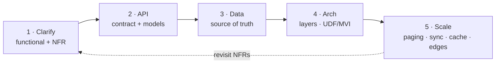
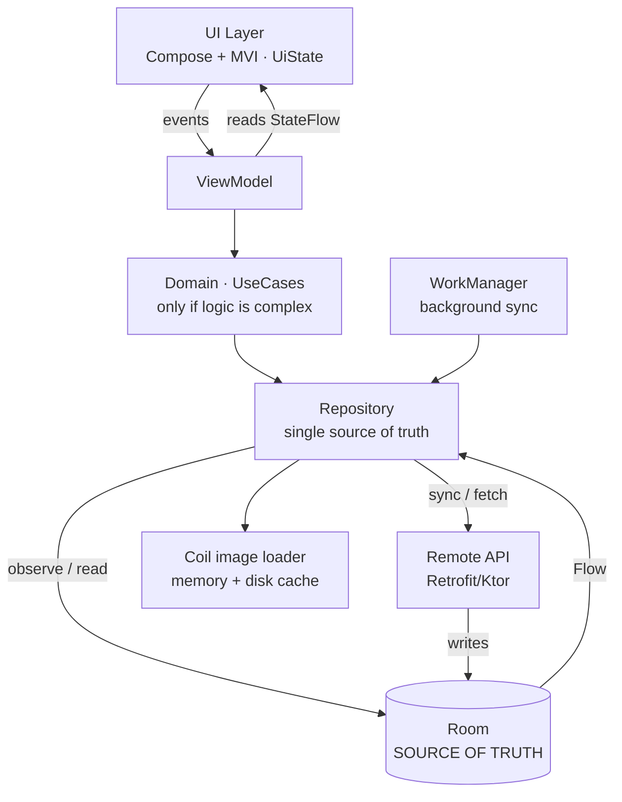
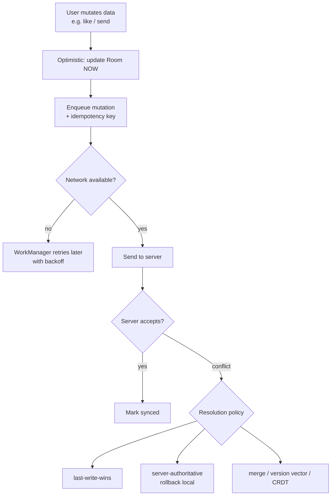
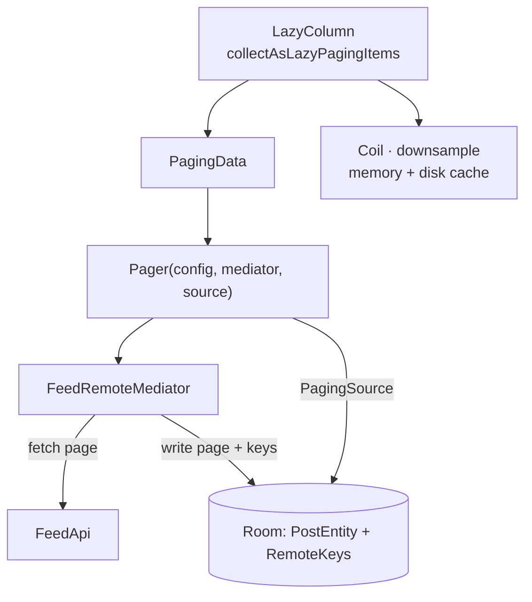
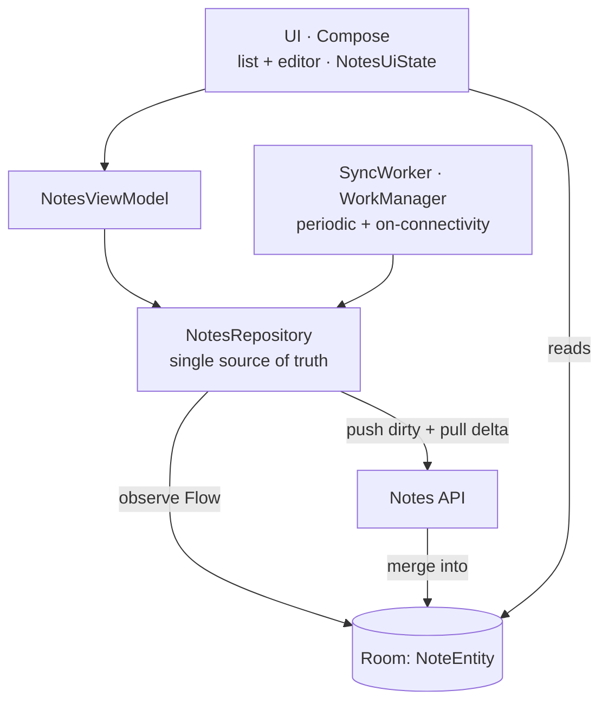
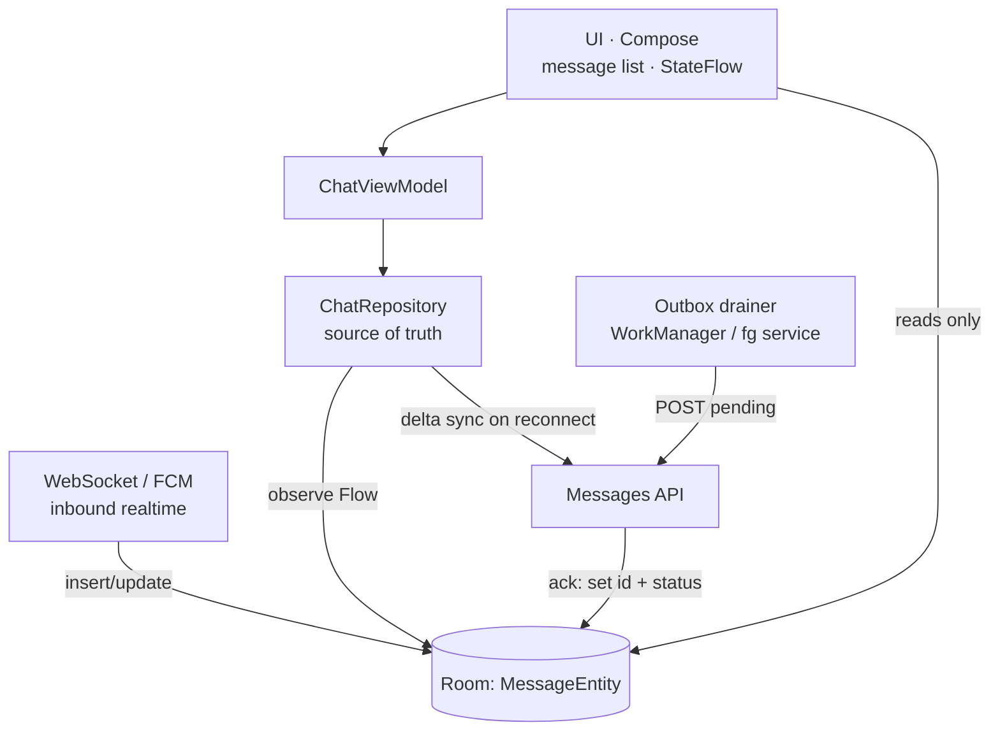
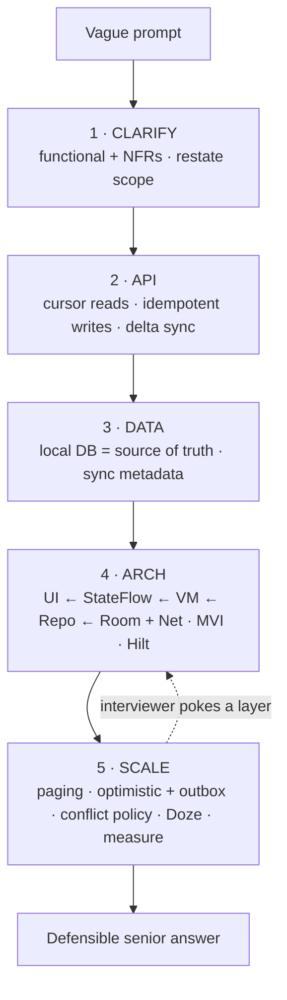

# Android System Design — Framework & Worked Examples

> A repeatable framework for the open-ended mobile design round, plus three fully worked examples (image feed, offline-first sync app, chat app) with Mermaid diagrams. The round tests **how you think under ambiguity**, not a memorized answer — and it's where seniority is most often decided.

**Part of:** [Interview Prep](README.md) · **Pairs with:** [Module 20 · Lesson 04 — System Design for Android](../../modules/module-20-career-interview/04-system-design-for-android.md)

---

## Why a framework

System design hands you a deliberately vague prompt — *"Design Instagram's feed," "Design a chat app"* — and watches you turn ambiguity into a sensible, defensible **mobile** architecture. There's no single right answer; the interviewer grades the **process**. A framework converts "study Android" into a script you can run on any prompt, so you never freeze on the open-endedness.

> **Mental model:** *Clarify before you solve. Make the local DB your source of truth, the network a sync mechanism, and the UI a reader. Then name your paging, sync, and conflict strategies out loud — and design to explicit non-functional requirements.*

**Android system design is not backend system design.** Nobody wants load balancers and Postgres sharding. The mobile-specific axes that matter:

- **Offline-first** — works on a subway with no signal. Where's the source of truth?
- **Sync** — how does local reconcile with server? Conflicts? Optimistic updates?
- **Pagination** — feeds are infinite; load pages, not everything.
- **Caching & freshness** — what's cached, for how long, when invalidated?
- **State management** — how does UI state flow (UDF/MVI)?
- **Constraints** — battery, memory, flaky networks, image loading, Doze/background limits.

---

## The 5-step framework

```text
1. CLARIFY   — scope the problem; functional + non-functional requirements.
2. API       — define the data contract (endpoints / models the client consumes).
3. DATA      — model local + remote; pick the source of truth (offline-first?).
4. ARCH      — layers (UI → domain → data), UDF/MVI, key components, libraries.
5. SCALE     — paging, sync/conflicts, caching, offline, perf, edge cases.
```

You **narrate** as you go and **draw** the architecture. The interviewer steers by poking at a layer; you go deep where they push.

```text
  [1 CLARIFY]──▶[2 API]──▶[3 DATA]──▶[4 ARCH]──▶[5 SCALE]
   ~5 min        ~5min     ~10min     ~10min     ~10min
   requirements  contract  source-of  layers +   paging, sync,
   func + NFR    /models   truth      UDF/MVI    conflicts, cache,
                                                 offline, perf, edges
   └─ ask first ──────────── DRAW the boxes & arrows ───── go deep where poked ─┘
```



### Step 1 — CLARIFY (ask, don't assume)

Turn the vague prompt into concrete requirements. **Restate the scope back** before designing.

- **Functional:** What can the user do? (Scroll? Post? Edit? Search? Multi-device?)
- **Non-functional (NFRs):** Offline duration? Freshness SLA? Latency target? Consistency model (eventual vs strong)? Scale (items, users)? Failure behavior (what shows when sync fails)?
- **Scope control:** Confirm what's in and out so you design the *right* problem.

> Skipping CLARIFY is the most damaging mistake — you can build a flawless design for the wrong problem.

### Step 2 — API (the data contract)

Define the endpoints/models the **client** consumes. You don't design the server's internals; you design what crosses the wire.

- Paginated reads use a **cursor** (`?cursor=…&limit=…`), not offset.
- Mutations carry an **idempotency key** (a stable client-generated UUID).
- Sync reads are **delta** (`?updatedSince={cursor}`), not full refresh.
- Name the transport: REST/GraphQL for request/response; WebSocket/FCM for realtime push.

### Step 3 — DATA (pick the source of truth)

The first *real* decision. **Offline-first means the local DB is the single source of truth**; the network is a sync mechanism that writes into the DB, and the **UI only ever reads the DB**.

- Model the **entities** (Room `@Entity`) and their **sync state** (a `status`/`updatedAt`/`deleted` column when needed).
- The alternative — UI reading the network directly with a cache — is simpler but breaks offline and causes UI tearing. State the choice and *why*.

### Step 4 — ARCH (layers + UDF)

Draw the layers and the data flow.



- UI (Compose + MVI, one immutable `UiState`) ← `StateFlow` ← ViewModel ← Repository ← Room (truth) + Remote.
- DI with **Hilt**; type-safe Navigation. Skip the domain/use-case layer if logic is thin (don't pay the ceremony tax by default).

### Step 5 — SCALE (where seniority shows)

Surface and **defend trade-offs unprompted**, and show **mobile-platform judgment**:

- **Pagination:** cursor/keyset (Paging 3 + `RemoteMediator` into Room). Offset breaks under inserts.
- **Sync:** optimistic updates, delta sync on a cursor, a persistent outbox + WorkManager with backoff.
- **Conflicts:** name the policy — last-write-wins / server-authoritative / merge (version vectors / CRDTs).
- **Idempotency:** stable client id so retries don't double-post.
- **Platform constraints:** WorkManager + **Doze**/background limits; Coil downsampling to avoid OOM; stable list `key`s.
- **What you'd measure:** frame time (Macrobenchmark/JankStats), sync success rate, cache hit rate, cold start.



---

## Trade-off cheat sheet

The decisions you should be ready to name *and defend the cost of*:

| Decision | Option A | Option B | The axis / trade-off |
|---|---|---|---|
| **Source of truth** | Local DB (offline-first) | Network + cache | Resilience/offline vs simplicity |
| **Pagination** | Cursor / keyset | Offset | Correctness under inserts vs ease |
| **Conflict resolution** | Last-write-wins | Server-authoritative / merge | Simplicity vs no-lost-data |
| **Realtime transport** | WebSocket (persistent) | FCM push + fetch | Latency/cost vs battery/background limits |
| **Sync trigger** | WorkManager (deferrable) | Foreground service | Battery-friendly vs immediacy |
| **Delivery semantics** | At-least-once + idempotency | Exactly-once (hard) | Practical vs theoretically clean |
| **Image strategy** | Downsample + disk cache | Full-res | Memory safety vs fidelity |

> **Senior tell:** naming the cost of your *own* choice and the threshold where you'd switch — not just listing the benefit.

---

## Worked example 1 — Image Feed (Instagram-style)

> *"Design an infinite image feed."* The canonical Android design: paging + cache + image loading.

### 1 · Clarify

- Infinite scroll? **Yes.** Offline cache of recent pages? **Yes.** Video too? *(assume image + caption only to scope it).*
- Freshness SLA? Pull-to-refresh + stale-while-revalidate. Auth? Assume authenticated.
- Likes/comments? Likes in-scope (optimistic); comments out of scope.
- **NFRs:** smooth 60fps scroll, works offline with cached pages, OOM-safe on long scroll.

### 2 · API (cursor-based paging)

```text
GET /feed?cursor={c}&limit=20   → { items: [Post], nextCursor }
POST /posts/{id}/like           (idempotent toggle)
Post: { id, imageUrl, caption, authorId, likeCount, likedByMe, createdAt }
```

### 3 · Data (Room is the source of truth)

```text
PostEntity( id PK, imageUrl, caption, authorId, likeCount, likedByMe, createdAt )
RemoteKeys( postId PK, prevKey, nextKey )   ← cursors for RemoteMediator
```

### 4 · Architecture

`LazyColumn` ← `PagingData` ← `Pager(RemoteMediator)`. The `RemoteMediator` writes network pages **into Room**; the UI pages **from Room**, so offline works for free.

```kotlin
// The layering you'd sketch and name (Paging 3 + Room as source of truth):
@OptIn(ExperimentalPagingApi::class)
fun feedPager(db: AppDb, api: FeedApi): Flow<PagingData<PostEntity>> = Pager(
    config = PagingConfig(pageSize = 20, prefetchDistance = 10),
    remoteMediator = FeedRemoteMediator(db, api),       // network → Room
    pagingSourceFactory = { db.postDao().pagingSource() }, // UI reads Room
).flow
```



### 5 · Scale & edges

- **Cursor paging** avoids offset duplicate/skip bugs when posts are inserted between loads.
- **Coil:** downsample to the slot size, memory + disk cache, placeholder — never decode full-res into a list (OOM).
- **`prefetchDistance`** tuned so the next page loads before the user hits the end; `contentType` if the list is heterogeneous.
- **Offline:** Room-backed paging serves cached pages with no network; a blip never empties the feed.
- **Freshness:** invalidate on pull-to-refresh; show stale-while-revalidate.
- **Likes:** optimistic — flip `likedByMe`/`likeCount` in Room immediately; reconcile with the server; the endpoint is idempotent.
- **Measure:** scroll frame time (Macrobenchmark/JankStats), image cache hit rate, page-load latency.

**Common traps to avoid:** offset pagination; UI paging directly from the network (no offline); full-res bitmaps; no `key` on items.

---

## Worked example 2 — Offline-First Sync App (notes/tasks)

> *"Design a notes app that syncs across devices and works offline."* This is the purest test of source-of-truth and conflict handling.

### 1 · Clarify

- Offline edits? **Yes** — create/edit/delete without signal, sync later.
- Multi-device sync? **Yes.** Single user across devices.
- Rich text / search? Plain text + local search to scope it.
- **NFRs:** edits never lost; eventual consistency across devices; conflicts resolved deterministically; deletions propagate.

### 2 · API (delta sync + soft delete)

```text
GET  /notes?updatedSince={cursor}   → { items: [Note], nextCursor }   (delta sync)
POST /notes        { clientId(UUID), title, body, updatedAt }          (create, idempotent)
PUT  /notes/{id}   { title, body, updatedAt, baseVersion }             (update w/ version)
DELETE /notes/{id}                                                     (soft delete server-side)
Note: { id, clientId, title, body, updatedAt, version, deleted: Boolean }
```

### 3 · Data (local DB = source of truth, with sync metadata)

```text
NoteEntity(
  id?,                 // server id, null until first sync
  clientId UUID PK,    // stable idempotency key
  title, body,
  updatedAt,           // for last-write-wins
  version,             // server version for conflict detection
  deleted: Boolean,    // soft delete so deletions sync
  dirty: Boolean       // has unsynced local changes
)
```

### 4 · Architecture



- UI observes Room via `Flow`; **edits write to Room** with `dirty = true`.
- A **`SyncWorker`** (WorkManager, periodic + connectivity-constrained) pushes dirty rows and pulls deltas, merging into Room.

```kotlin
// Optimistic local edit — instant, survives process death, queued for sync:
suspend fun saveNote(clientId: String, title: String, body: String) {
    dao.upsert(
        NoteEntity(
            clientId = clientId, title = title, body = body,
            updatedAt = clock.now(), dirty = true, deleted = false,
        )
    )                                    // UI updates immediately (reads Room)
    syncScheduler.requestSync()          // WorkManager drains when online
}
```

### 5 · Scale, conflicts & edges

- **Conflict policy (state it):** server-authoritative with **version** check — `PUT` sends `baseVersion`; on a version mismatch the server returns the current note and the client resolves by **last-write-wins on `updatedAt`** (or surfaces a merge UI for true collaboration). Name the trade-off: LWW is simple but can lose an edit; a field-level merge or CRDT avoids loss at higher complexity.
- **Idempotency:** `clientId` (UUID) dedupes creates so a retried POST doesn't double-insert.
- **Soft delete:** a `deleted` flag so deletions sync (a hard local delete can't tell the server "this was removed").
- **Delta sync:** pull only `updatedSince` the last cursor, not the whole corpus.
- **Backpressure & retries:** WorkManager exponential backoff; cap a sync batch size.
- **Platform:** connectivity constraint on the worker; respect Doze (periodic sync is deferrable, which is correct here).
- **Measure:** sync success rate, conflict frequency, time-to-converge across devices.

**Common traps to avoid:** "it syncs" with no conflict policy; UI-only edit state that vanishes on process death (persist `dirty` in Room); hard deletes that don't propagate; full-corpus fetch on every sync.

---

## Worked example 3 — Chat App (offline-capable)

> *"Design a chat app that works offline."* The hardest canonical prompt — it forces ordering, delivery semantics, and conflicts at once.

### 1 · Clarify (NFRs drive everything here)

- **Ordering guarantee?** Messages appear in send order.
- **Delivery semantics?** At-least-once → need **idempotency**.
- **Offline send?** Yes — queue locally, send when online.
- Multi-device? Read receipts? Group vs 1:1? *(scope: 1:1 + delivery status; group out of scope).*
- **NFRs:** instant local echo, eventual delivery, correct ordering on reconnect, realtime inbound.

### 2 · API

```text
WebSocket (or FCM high-priority push) for realtime inbound messages.
POST /messages { clientId(UUID), conversationId, body, sentAt }   ← idempotency key
GET  /messages?conversationId&since={cursor}                      ← delta sync on reconnect
```

### 3 · Data (Room = source of truth; UI ONLY reads Room)

```text
MessageEntity(
  id?,                  // server id, assigned on ack
  clientId UUID,        // stable idempotency key
  conversationId,
  body, sentAt,
  status: ENUM(PENDING, SENT, DELIVERED, FAILED)
)
```

- **Optimistic:** insert with `status = PENDING` immediately → UI shows the message instantly.

### 4 · Architecture



```kotlin
// Optimistic send with an idempotency key — the snippet you'd write on the board:
suspend fun sendMessage(text: String, convId: String) {
    val msg = MessageEntity(
        clientId = UUID.randomUUID().toString(),   // stable idempotency key
        conversationId = convId, body = text,
        sentAt = clock.now(), status = Status.PENDING,
    )
    dao.insert(msg)                 // optimistic: UI shows it immediately (reads Room)
    outbox.enqueue(msg.clientId)    // WorkManager drains; server dedupes on clientId
}
```

### 5 · Scale, conflicts & edges

- **Idempotency:** server dedupes on `clientId` → safe retries on a lost ack, no double-send.
- **Ordering:** order by `(sentAt, clientId)` or a server sequence number; reconcile on ack.
- **Delivery status:** persist `status` in Room (not UI-only) so a `PENDING` message survives process death and the outbox can retry.
- **Conflict policy:** messages are **append-only** → conflicts are rare; for *editable* data (profile, edited messages) name a policy (LWW / server-authoritative / merge).
- **Delta sync** on reconnect via the `since` cursor, not full history.
- **Backpressure:** cap the outbox; exponential backoff on retries.
- **Doze / background limits:** realtime needs **FCM high-priority** or a foreground service for an active chat — respect background execution limits deliberately.
- **Measure:** send success rate, median delivery latency, reconnect convergence time.

**Common traps to avoid:** no idempotency key (double-post on retry); send-state as UI-only state (vanishes on process death); full-history fetch on every reconnect; ignoring Doze for realtime; hand-waving "it'll sync."

---

## Putting it together — the design round in one page



### Self-grade after a mock (1–4, at your target level)

| Signal | What "4" looks like |
|---|---|
| Requirement clarification | Asked functional **and** NFRs; restated scope before designing. |
| Data modeling | Named the source of truth; modeled sync metadata (status/version/deleted). |
| Mobile-platform awareness | Paging 3/`RemoteMediator`, Coil downsampling, WorkManager + Doze — unprompted. |
| Trade-off articulation | Named conflict policy + idempotency + the cost of your own choice. |
| Communication | Narrated, drew the boxes, went deep where poked — no hand-waving on "what about offline?". |

> **Validation:** whiteboard each example end-to-end in a timed 35-minute run with no notes; if you can't, you don't know it yet. Then adversarially poke your own design — *"what happens offline? on a retry? on a conflict? on low memory?"* — every gap is a study item.

---

## Related

- [Module 20 · Lesson 04 — System Design for Android](../../modules/module-20-career-interview/04-system-design-for-android.md) — the teaching version with the full framework and AI mock prompt.
- [Module 13 — Architecture for Real Apps](../../modules/module-13-architecture/README.md) — repository, MVI, offline-first in depth.
- [Module 11 — Performance](../../modules/module-11-performance/README.md) — Paging, image loading, what to measure.
- [mock-interview-scripts.md](mock-interview-scripts.md) — run a timed system-design mock with an AI interviewer.
