# Mind Maps — the whole course as pictures

> Every part of the course as a Mermaid diagram you can read at a glance. Start with the whole-course map, drill into a part, then study the "how the concepts connect" graph — that last one is the senior-level view.

**How to use these.** A mind map is for *retrieval*, not first learning. After you finish a module, cover the text and try to redraw its branch from memory; the gaps are what to re-read. The diagrams are Mermaid (text in version control) so they render in GitHub, IDEs, and most Markdown viewers. See the diagram conventions in the [Authoring Guide](../AUTHORING-GUIDE.md#section-2--visual-learning).

> **Rendering note.** These use Mermaid `mindmap` and `graph`/`flowchart` syntax. `mindmap` needs a recent Mermaid (v9.3+). If your viewer is older and a `mindmap` block doesn't render, the same content is mirrored as a `graph` immediately after the whole-course map, and the per-part maps degrade gracefully to indented text.

---

## 1. The whole course — one mind map

The five parts, their modules, and the one thing each module makes you able to do.

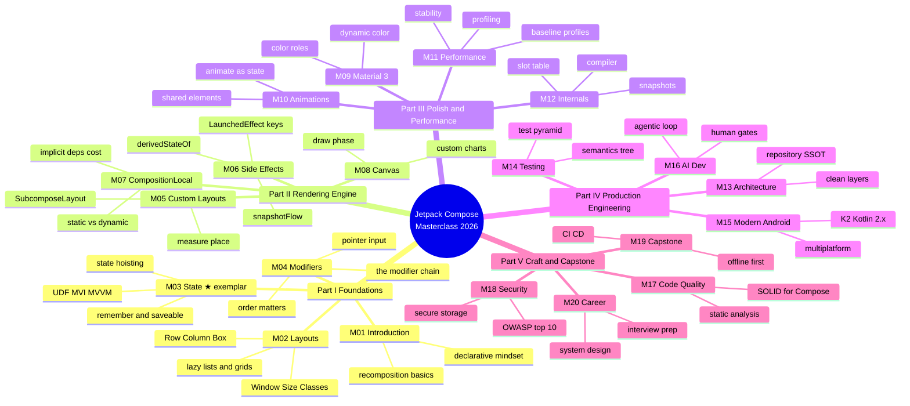

**Same map, as a graph** (fallback for older Mermaid, and easier to follow the part → module → skill nesting):

```mermaid
graph TD
    C(("Compose<br/>Masterclass 2026"))
    C --> P1["Part I<br/>Foundations"]
    C --> P2["Part II<br/>Rendering Engine"]
    C --> P3["Part III<br/>Polish & Performance"]
    C --> P4["Part IV<br/>Production Engineering"]
    C --> P5["Part V<br/>Craft & Capstone"]

    P1 --> M01["01 Intro<br/>declarative mindset"]
    P1 --> M02["02 Layouts<br/>adaptive UI"]
    P1 --> M03["03 State ★<br/>UDF + hoisting"]
    P1 --> M04["04 Modifiers<br/>order + gestures"]

    P2 --> M05["05 Custom Layouts<br/>measure/place"]
    P2 --> M06["06 Side Effects<br/>safe effects"]
    P2 --> M07["07 CompositionLocal<br/>implicit deps"]
    P2 --> M08["08 Canvas<br/>draw phase"]

    P3 --> M09["09 Material 3<br/>theming"]
    P3 --> M10["10 Animations<br/>motion APIs"]
    P3 --> M11["11 Performance<br/>measured wins"]
    P3 --> M12["12 Internals<br/>why it skips"]

    P4 --> M13["13 Architecture<br/>clean + MVI"]
    P4 --> M14["14 Testing<br/>pyramid"]
    P4 --> M15["15 Modern Android<br/>K2 + CMP"]
    P4 --> M16["16 AI Dev<br/>agentic loop"]

    P5 --> M17["17 Code Quality<br/>SOLID + gates"]
    P5 --> M18["18 Security<br/>OWASP"]
    P5 --> M19["19 Capstone<br/>ship it"]
    P5 --> M20["20 Career<br/>interviews"]
```

> **The critical spine** runs through this map: **01 → 03 → 04 → 06 → 11 → 12**. If you only have the diagrams for those six, you have the load-bearing 80%.

---

## 2. Part I — Foundations

> *Goal of the part:* ship a correct, adaptive screen whose UI is a pure function of state.

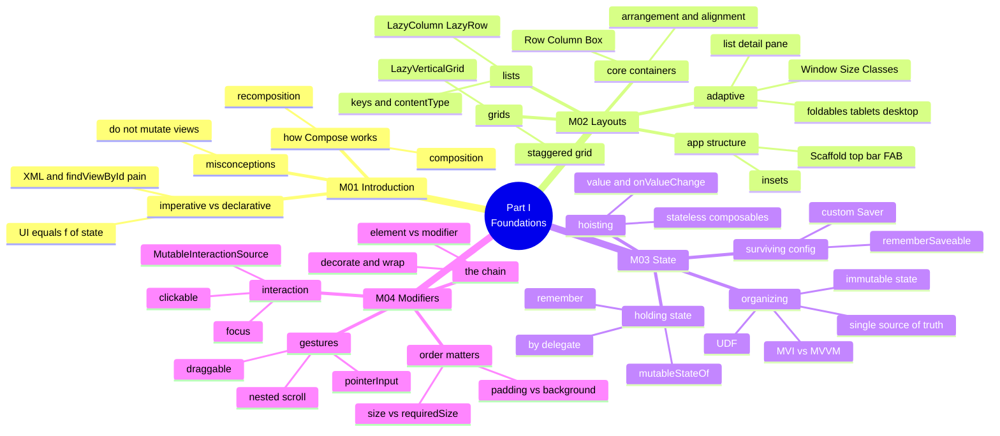

**Reading order inside Part I:** 01 → 02 and 01 → 03 in parallel, then 03 → 04. Don't rush 03 — it's the heart.

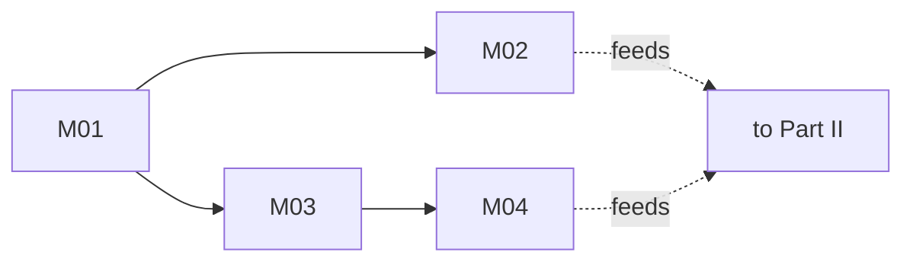

---

## 3. Part II — The Rendering Engine

> *Goal of the part:* drop below the built-ins — place children yourself, run effects safely, draw custom pixels.

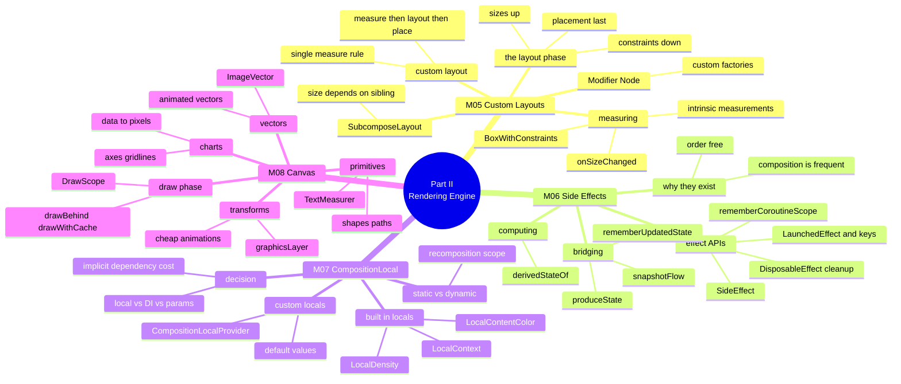

**Dependency reality:** 05 needs 02 + 04; 06 needs 03; 07 needs 03 + 06; 08 needs 05.

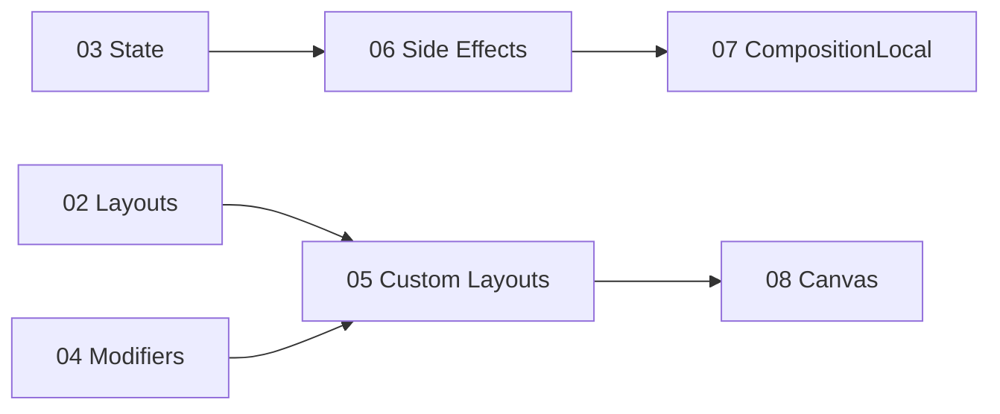

---

## 4. Part III — Polish & Performance

> *Goal of the part:* make it beautiful, make it smooth, and understand *why* it's smooth.

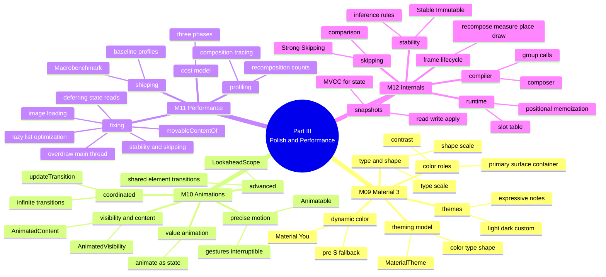

**Why this order:** theming and animation are the polish; performance is where it gets real; internals is the *theory* that makes performance intuition click — so 11 → 12 (apply, then understand deeply).

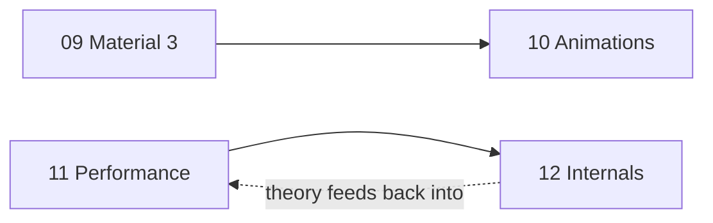

---

## 5. Part IV — Production Engineering

> *Goal of the part:* structure, test, modernize, and accelerate a real multi-feature app.

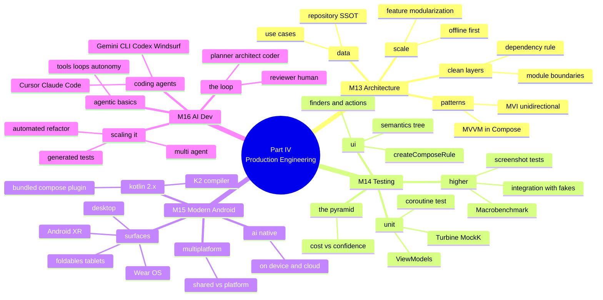

**Dependency reality:** 13 anchors this part (needs 03 + 06); 14 and 19 build on 13; 15 → 16.

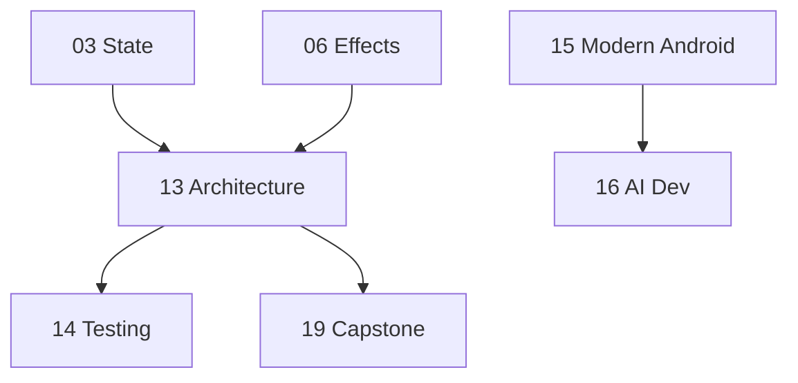

---

## 6. Part V — Craft & Capstone

> *Goal of the part:* keep it healthy, keep it secure, ship it, and get hired.

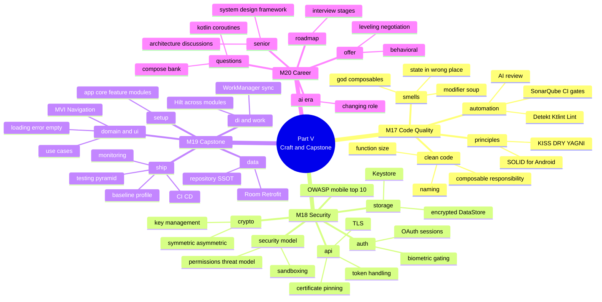

**Dependency reality:** 17 and 18 both build on 13; 19 is the integration of nearly everything; 20 caps it.

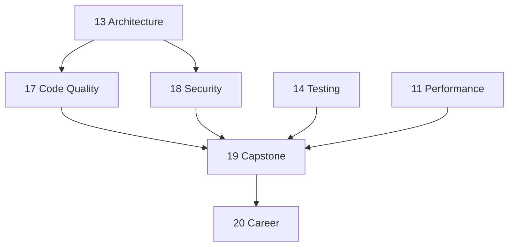

---

## 7. How the concepts connect — the senior map

This is the one to internalize. Modules are *chapters*; the real curriculum is a web of **concepts** that reinforce each other. Compose has one job — **turn state into UI** — and every concept below is in service of doing that *correctly, fast, and at scale*.

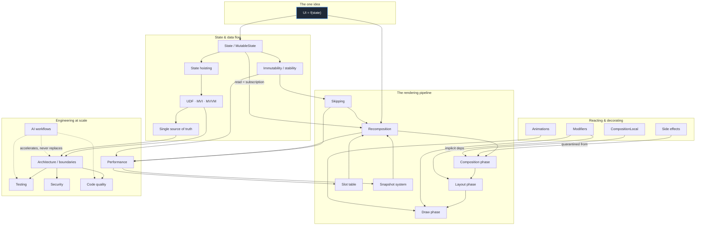

### Reading the senior map — the load-bearing edges

These are the connections that, once they click, make the whole course feel like one idea:

- **`UI = f(state)` is the root.** Everything hangs off it. Modifiers decorate the `UI`; effects react to changes in it; architecture decides where the `state` lives.
- **A state *read* is a subscription.** Reading state in composition tells the runtime "re-run me when this changes" — that single fact links **State (M03)** to **Recomposition** to **Performance (M11)**. Reading the *same* state later (in layout or draw) is how you *defer* and save recompositions.
- **Immutability is a performance feature, not just hygiene.** Stable/immutable types let the runtime **skip** (M12), which is *the* lever in **Performance (M11)**. That's why `ImmutableList` shows up in M03's state and M11's fixes and M12's theory — it's one thread.
- **Effects are quarantined from composition.** **Side Effects (M06)** exist precisely because composition runs often and out of order — the same property of **Recomposition** that makes Compose fast makes naive side effects dangerous.
- **Single source of truth scales into architecture.** The discipline you learn in **State (M03)** — one owner per piece of state — is the same principle that, applied to *data*, becomes the **repository (M13)**, and applied to a *screen* becomes **MVI**.
- **Architecture is the substrate for the production concerns.** **Testing (M14)**, **Security (M18)**, and **Code Quality (M17)** all get easier with clean boundaries — and harder without them. That's why M13 sits upstream of all three.
- **AI accelerates every box but owns none of them.** The dashed edges are deliberate: **AI workflows (M16)** speed up architecture, testing, and quality work, but the decisions stay human. *AI drafts, you decide* — see [AI-assisted learning workflows](ai-assisted-learning-workflows.md).

### The three phases, end to end

If you remember one pipeline, remember this — it connects M01, M05, M06, M08, M11, and M12:

```text
state change
   │
   ▼
COMPOSITION ──▶ LAYOUT ──▶ DRAW ──▶ pixels
 (what to     (measure &   (paint
  show)        place)       it)
   │             │            │
 read here   read here    read here  ← read state as LATE as you can:
 (most         (cheaper)   (cheapest)   deferring a read down this pipe
  expensive)                            is the #1 performance trick
```

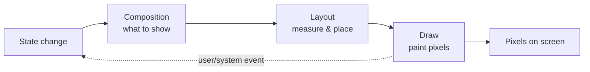

> **The takeaway:** state flows in, pixels come out, and the entire craft of Compose is keeping that path **correct** (state in one place), **minimal** (skip what didn't change), and **safe** (effects out of the hot path). Every module is a slice of that one sentence.

---

## Where to go next

- Build the maps into muscle memory with the **[practice projects](practice-projects.md)** and per-module **[assignments](assignments.md)**.
- Use AI to *quiz* yourself on these maps — prompts in **[AI-assisted learning workflows](ai-assisted-learning-workflows.md)**.
- See how these concepts become team rules in **[enterprise best practices](enterprise-best-practices.md)**.
- Module-level diagrams live in each module's README — start with the exemplar, **[Module 03](../modules/module-03-state-management/README.md)**.
