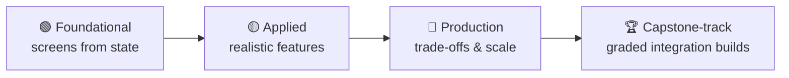
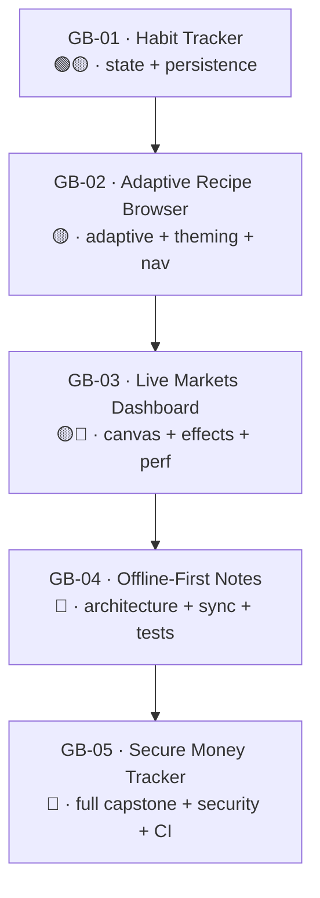

# Practice Projects — the full build catalog

> Every project in the course, in one place, ordered by difficulty — plus five graded "capstone-track" builds that stitch the modules together. Build these and you have a portfolio, not just notes.

**How to use this catalog.** Each entry has the same shape: a one-line **goal**, a **spec** (what to build), the **required APIs** (what you must use — graders check for these), **acceptance criteria** (the pass bar), and a **stretch** (optional, for when you want more). The course philosophy holds throughout: *do the project without copy-pasting the lesson code.* If you can't, re-read the 🟡/🔴 tiers — see the [Learning Path](../course/learning-path.md).

**Tech baseline (non-negotiable for every project).** Kotlin 2.x / K2 · Compose BOM + Material 3 · Strong Skipping on · `collectAsStateWithLifecycle` for state · immutable collections (`kotlinx.collections.immutable`) for list state · type-safe Navigation · Hilt for DI · `StateFlow` + UDF. No deprecated APIs without a `// ❌ legacy` label. See the [Authoring Guide](../AUTHORING-GUIDE.md#tech-baseline-keep-code-honest).

---

## How difficulty is scored

Each project gets a **tier** and a **points** value. Points feed the optional course grade (see the [Final Assessment](final-assessment.md)). The tier maps to the three-tier teaching model:

| Tier | Who it's for | What it proves |
|---|---|---|
| 🟢 **Foundational** | New to Compose | You can build a correct screen from state. |
| 🟡 **Applied** | Shipped some Compose | You can build a realistic, hoisted, tested feature. |
| 🔴 **Production** | Senior track | You can make trade-offs: performance, architecture, security, accessibility. |

---

## Part 1 — Module projects, ordered by difficulty

These are the projects baked into each module. They are the **floor**: complete the module, complete its project. The order below is the recommended build order, which mostly follows the [module dependency graph](../course/learning-path.md#module-dependency-graph) but is re-sorted by raw difficulty.

### MP-01 · "Hello, Declarative" — XML → Compose translation
*Module:* [01 — Introduction](../modules/module-01-introduction/README.md) · *Tier:* 🟢 · *Points:* 5 · *Est:* 1–2 hrs

- **Goal:** Re-express one imperative XML screen as state + composables, and explain the shift.
- **Spec:** Take a small XML profile/settings screen (a header, an avatar, a name `TextView`, a toggle, a button). Rebuild it as a `@Composable` whose entire appearance is derived from a single `ProfileState` data class. No `findViewById` mental model allowed — the UI is a *function of state*.
- **Required APIs:** `@Composable`, `Column`/`Row`, `Text`, `Switch`/`Button`, a `data class` for state, `MaterialTheme` for colors.
- **Acceptance criteria:**
  - [ ] Zero imperative "mutate the view" calls — toggling the switch changes *state*, and the UI re-derives.
  - [ ] A one-paragraph written note contrasting the imperative original with the declarative version (what each line *was* doing vs *is now*).
  - [ ] Colors come from `MaterialTheme`, not hardcoded hex.
- **Stretch:** Add a dark-theme preview and show the same state renders both.

### MP-09 · Theme + component gallery
*Module:* [09 — Material 3 Theming](../modules/module-09-material3-theming/README.md) · *Tier:* 🟢🟡 · *Points:* 8 · *Est:* 3–4 hrs

- **Goal:** A complete, themable design system: light, dark, and dynamic color, exercised by a gallery.
- **Spec:** Build a `MaterialTheme` wrapper exposing a full color scheme, a type scale, and a shape scale. Add a **component gallery** screen that renders buttons, cards, chips, text fields, top bar, and FAB — every component pulling from color *roles*, never raw colors. Wire **dynamic color** (Material You) on Android 12+ with a static brand-color fallback below.
- **Required APIs:** `MaterialTheme`, `lightColorScheme`/`darkColorScheme`, `dynamicLightColorScheme`/`dynamicDarkColorScheme` (gated on `Build.VERSION.SDK_INT >= S`), `Typography`, `Shapes`, `isSystemInDarkTheme()`.
- **Acceptance criteria:**
  - [ ] No hardcoded `Color(0xFF…)` in component code — everything reads `MaterialTheme.colorScheme.*`.
  - [ ] Light and dark both render correctly; verified by two `@Preview`s.
  - [ ] Dynamic color activates on 12+ and falls back gracefully below (no crash, sensible brand palette).
  - [ ] Contrast: body text on its container meets WCAG AA (4.5:1) — checked, not assumed.
- **Stretch:** Add a Material 3 Expressive motion/shape variant behind a feature flag.

### MP-02 · Adaptive storefront (e-commerce listing + dashboard + feed)
*Module:* [02 — Layouts & Responsive Design](../modules/module-02-layouts/README.md) · *Tier:* 🟢🟡 · *Points:* 10 · *Est:* 6–8 hrs

- **Goal:** Three screens that adapt cleanly from phone → foldable → tablet → desktop.
- **Spec:** From provided Figma mockups, build (1) an **e-commerce product listing** (grid of cards), (2) a **banking dashboard** (summary cards + transaction list), and (3) a **social feed** (infinite list of posts). Each must reflow at the Window Size Class breakpoints: single column on Compact, list-detail on Expanded.
- **Required APIs:** `Scaffold`, `LazyColumn`/`LazyVerticalGrid` (with `key` and `contentType`), `WindowSizeClass` (`material3-adaptive`), `ListDetailPaneScaffold` for Expanded, `FlowRow` for chip/filter rows.
- **Acceptance criteria:**
  - [ ] Every lazy list item has a stable `key` and a `contentType` — no exceptions.
  - [ ] No hardcoded pixel widths driving layout; breakpoints come from `WindowSizeClass`.
  - [ ] Compact shows a list; Expanded shows list-detail side-by-side; the transition is correct on a resizable emulator.
  - [ ] Insets handled (content not under the status bar / nav bar).
- **Stretch:** Add foldable posture awareness (table-top mode splits the feed).

### MP-03 · Survives-rotation form + UDF cart
*Module:* [03 — State Management](../modules/module-03-state-management/README.md) (exemplar) · *Tier:* 🟢🟡🔴 · *Points:* 12 · *Est:* 5–7 hrs

- **Goal:** Prove you've internalized *where state lives* — hoisting, UDF, single source of truth.
- **Spec:** Two screens. (1) A **profile form** (name / email / bio) with validation that keeps every value across rotation **and** process death. (2) A **shopping cart** (add/remove items, change quantity, a **derived** total) flowing through a `ViewModel` exposing exactly one immutable `CartUiState`.
- **Required APIs:** `rememberSaveable` (with a custom `Saver` for the form model), state hoisting (`value` + `onValueChange`), `ViewModel` + `StateFlow<CartUiState>`, `derivedStateOf` or a computed property for the total, `collectAsStateWithLifecycle`, `kotlinx.collections.immutable` for the cart items.
- **Acceptance criteria:**
  - [ ] No value resets on rotation or simulated process death (verify with "Don't keep activities").
  - [ ] The cart total is **derived**, never stored as separate state — it cannot drift.
  - [ ] The ViewModel exposes exactly **one** `StateFlow<UiState>`; nothing mutable leaks out.
  - [ ] Composables that don't own state are stateless (take `value` + lambdas).
- **Stretch:** Add an "undo remove" one-shot effect via a `Channel`, consumed once (not stored in state).

### MP-07 · Locale + theme provider via CompositionLocal
*Module:* [07 — CompositionLocal](../modules/module-07-compositionlocal/README.md) · *Tier:* 🟡 · *Points:* 8 · *Est:* 3–4 hrs

- **Goal:** Pass an implicit dependency (current locale + extended theme) down the tree without prop-drilling — and know the cost.
- **Spec:** Define a custom `LocalAppLocale` and a custom `LocalExtendedColors` (brand colors Material doesn't model). Provide them at the app root via `CompositionLocalProvider`. A deep child reads them without any intermediate composable forwarding them. Add a settings toggle that flips locale and watch only the readers recompose.
- **Required APIs:** `compositionLocalOf` vs `staticCompositionLocalOf` (choose correctly and justify), `CompositionLocalProvider`, a sensible default value, `LocalContext`/`LocalConfiguration` for the system locale.
- **Acceptance criteria:**
  - [ ] The `static` vs dynamic choice is justified in a comment (static for rarely-changing, dynamic for the locale that toggles).
  - [ ] No prop-drilling: the intermediate composables don't mention the provided values.
  - [ ] A written note on the testability cost (why this hides a dependency) and when DI would be better.
- **Stretch:** Add a `@Preview` that overrides the local to render a fake locale.

### MP-06 · Debounced search screen
*Module:* [06 — Side Effects](../modules/module-06-side-effects/README.md) · *Tier:* 🟡🔴 · *Points:* 10 · *Est:* 4–6 hrs

- **Goal:** Type → debounce → query → results, fully lifecycle-safe, no leaks, no redundant work.
- **Spec:** A search screen backed by a `ViewModel`. The query text drives a debounced search (≈300 ms). In-flight requests cancel when the query changes. Results, loading, empty, and error states are all rendered. A "recent searches" row registers/unregisters a listener with `DisposableEffect`.
- **Required APIs:** `snapshotFlow` (or a `StateFlow` query) → `debounce` → `flatMapLatest`; `collectAsStateWithLifecycle`; `derivedStateOf` for "is the query blank/too short"; `DisposableEffect` for the listener; `rememberUpdatedState` for a callback captured by a long-lived effect.
- **Acceptance criteria:**
  - [ ] Typing fast fires **one** network call after you stop, not one per keystroke.
  - [ ] Changing the query **cancels** the previous in-flight request (`flatMapLatest`, not `flatMapMerge`).
  - [ ] No leaked listeners (the `DisposableEffect` `onDispose` runs — prove it with a log).
  - [ ] Loading / empty / error / results are all handled; the screen is collected lifecycle-aware.
- **Stretch:** Add `produceState` to bridge a callback-based location API into the results ranking.

### MP-04 · Swipe-to-dismiss card (raw pointer input)
*Module:* [04 — Modifiers Mastery](../modules/module-04-modifiers/README.md) · *Tier:* 🟡🔴 · *Points:* 10 · *Est:* 4–6 hrs

- **Goal:** Build a custom interaction from pointer input up, with correct modifier order.
- **Spec:** A card you can drag horizontally; past a threshold it animates off-screen and is dismissed; released early, it springs back. Build it on **raw `pointerInput`**, not the built-in `SwipeToDismissBox` (you may reference that for behavior). Show a colored "delete" background revealed under the card. Get the modifier order right (clip/background/padding/offset/pointerInput).
- **Required APIs:** `Modifier.pointerInput` + `awaitPointerEventScope` + `detectHorizontalDragGestures`, `Animatable` for the offset and fling-back, `MutableInteractionSource`, correct `Modifier` ordering, `consume()` on handled events.
- **Acceptance criteria:**
  - [ ] Drag tracks the finger 1:1; release past threshold dismisses, before threshold springs back.
  - [ ] Pointer events are `consume()`d so a parent scroll doesn't steal the gesture.
  - [ ] Modifier order is deliberate and explained (e.g. `offset` before `pointerInput`, `clip` before `background`).
  - [ ] The animation is **interruptible** — grabbing it mid-fling re-captures it.
- **Stretch:** Add directional thresholds (different actions for left vs right swipe).

### MP-10 · Shared-element navigation + onboarding + dashboard transitions
*Module:* [10 — Animations Masterclass](../modules/module-10-animations/README.md) · *Tier:* 🟡🔴 · *Points:* 12 · *Est:* 7–9 hrs

- **Goal:** Pick the right animation API per job; ship a shared-element transition that feels native.
- **Spec:** (1) A **list → detail** screen with a **shared-element** image/title transition. (2) An **onboarding** sequence using `AnimatedContent` between pages. (3) A **dashboard** whose cards animate layout changes (expand/collapse) via `LookaheadScope`. Plus a shimmer loader via an infinite transition.
- **Required APIs:** `SharedTransitionLayout` + `Modifier.sharedElement` with matched bounds, `AnimatedContent` with a sensible `transitionSpec`, `LookaheadScope` / `Modifier.animateBounds`, `rememberInfiniteTransition` for shimmer, `Animatable` for any gesture-driven motion.
- **Acceptance criteria:**
  - [ ] The shared element's bounds match across destinations (no jump/flash).
  - [ ] Every animation is interruptible and runs off the main thread (no per-frame allocations in the hot path).
  - [ ] The right API per job: value (`animate*AsState`), visibility (`AnimatedVisibility`), content (`AnimatedContent`), gesture (`Animatable`) — justified.
- **Stretch:** Predictive-back gesture wired to the shared-element transition.

### MP-05 · Pinterest grid · timeline · mind-map (custom layouts)
*Module:* [05 — Custom Layouts](../modules/module-05-custom-layouts/README.md) · *Tier:* 🔴 · *Points:* 14 · *Est:* 7–9 hrs

- **Goal:** Drop below the built-in layouts and place children yourself with the measure/place API.
- **Spec:** Three custom layouts. (1) A **staggered grid** (Pinterest) that places items in the shortest column. (2) A **timeline** layout (alternating left/right of a center line). (3) A **mind-map** radial layout (a center node with children placed around it). At least one must use `SubcomposeLayout` because a child's size depends on another's.
- **Required APIs:** custom `Layout` (`measure` → `layout` → `place`), `Constraints`, `Placeable`, `SubcomposeLayout` for the dependent case, `BoxWithConstraints` where you branch on available space, a custom `Modifier.Node` factory for one reusable measurement modifier.
- **Acceptance criteria:**
  - [ ] Each child is measured **exactly once** (no double-measure; the single-measure rule holds).
  - [ ] Constraints are respected — no child placed outside the parent's bounds; no constraint violations in Layout Inspector.
  - [ ] The staggered grid genuinely balances columns (verify with uneven item heights).
  - [ ] The `SubcomposeLayout` case is justified (why a plain `Layout` couldn't do it).
- **Stretch:** Make the mind-map draggable (pan/zoom) and re-layout on add.

### MP-08 · Analytics dashboard · candlestick chart · interactive graph
*Module:* [08 — Canvas & Graphics](../modules/module-08-canvas-graphics/README.md) · *Tier:* 🔴 · *Points:* 14 · *Est:* 6–8 hrs

- **Goal:** Drop into the draw phase and render custom charts efficiently.
- **Spec:** (1) An **analytics line/bar chart** with axes and gridlines, drawing data → pixels yourself. (2) A **financial candlestick** chart (OHLC bars, color-coded). (3) An **interactive graph** where dragging a crosshair inspects values. All drawn with `DrawScope`; transforms via `graphicsLayer`.
- **Required APIs:** `Canvas` / `Modifier.drawBehind` / `drawWithCache`, `DrawScope` (`drawLine`, `drawPath`, `drawRect`), `Path`, `TextMeasurer` + `drawText`, `Modifier.graphicsLayer` for scale/pan, `pointerInput` for the crosshair, density-aware sizing (`.dp.toPx()`).
- **Acceptance criteria:**
  - [ ] **Zero per-frame allocations** in the draw lambda — paths/measurers cached with `drawWithCache`/`remember`.
  - [ ] All sizes are density-correct (no raw pixel literals; everything via `dp`/`sp`).
  - [ ] The crosshair reads values correctly and drawing defers state reads to the draw phase.
  - [ ] Text is measured, not guessed (labels don't clip).
- **Stretch:** Animate the chart's entry (path draw-on) without dropping frames.

### MP-13 · Production architecture skeleton
*Module:* [13 — Architecture](../modules/module-13-architecture/README.md) · *Tier:* 🔴 · *Points:* 14 · *Est:* 8–10 hrs

- **Goal:** A multi-feature app skeleton with clean boundaries you carry into the capstone.
- **Spec:** Lay out `:app`, `:core:*` (`:core:data`, `:core:domain`, `:core:designsystem`, `:core:common`), and two `:feature:*` modules. Implement one feature end-to-end: data (repository as single source of truth) → domain (a use case) → UI (MVI with one immutable `UiState`, events in, effects out). Dependencies point inward; data models don't leak across boundaries (map at each edge).
- **Required APIs:** Gradle module boundaries, Hilt across modules (`@Module`/`@Provides`/`@Binds`, `@HiltViewModel`), `Repository` interface in domain + impl in data, a `UseCase` (`operator fun invoke`), MVI reducer, type-safe Navigation between features, `collectAsStateWithLifecycle`.
- **Acceptance criteria:**
  - [ ] The dependency rule holds: domain depends on nothing Android; UI/data depend on domain, not each other.
  - [ ] No DTO/entity leaks into the UI layer — mapping happens at the boundary.
  - [ ] Exactly one immutable `UiState` per screen; one-shot effects go out a `Channel`/`SharedFlow`, not state.
  - [ ] Feature modules don't depend on each other (only on `:core:*`).
- **Stretch:** Add a convention plugin to dedupe build config across modules.

### MP-14 · Tested feature (state + semantics + screenshot)
*Module:* [14 — Testing](../modules/module-14-testing/README.md) · *Tier:* 🟡🔴 · *Points:* 12 · *Est:* 6–8 hrs

- **Goal:** Test each layer with the right tool — state, UI semantics, screenshots, one benchmark.
- **Spec:** Take the MP-13 feature (or MP-06 search) and fully test it. Unit-test the ViewModel/state flow. Write Compose UI tests against the **semantics tree** (not pixel positions). Add at least one screenshot test and one macrobenchmark. Make the suite green in CI.
- **Required APIs:** Turbine + MockK + `kotlinx-coroutines-test` (`runTest`, test dispatcher) for state; `createComposeRule`, semantics finders (`onNodeWithText`/`onNodeWithContentDescription`/`onNodeWithTag`), actions and assertions; Paparazzi or Roborazzi for screenshots; Macrobenchmark for startup/frame timing.
- **Acceptance criteria:**
  - [ ] ViewModel tests assert the **state sequence** with Turbine, not just the final value.
  - [ ] UI tests select by semantics (role/text/contentDescription/testTag), never by index or coordinates.
  - [ ] At least one screenshot test renders deterministically (fixed time/locale/animations off).
  - [ ] One macrobenchmark measures startup or scroll jank; the suite passes in CI.
- **Stretch:** Add a flaky-test guard (retry rule + idling resource for async content).

### MP-11 · Performance fix — benchmark report
*Module:* [11 — Performance](../modules/module-11-performance/README.md) · *Tier:* 🔴 · *Points:* 14 · *Est:* 8–10 hrs

- **Goal:** Find and fix the **real** performance problems with data, not vibes.
- **Spec:** Start from a deliberately janky screen (an unkeyed list of unstable items that recomposes too much, decodes images poorly, reads state too high). Profile it, fix it, and write a **before/after report**: recomposition counts (Layout Inspector / composition tracing) and a Macrobenchmark frame-timing comparison. Ship a **baseline profile**.
- **Required APIs:** Layout Inspector recomposition counts / composition tracing, `@Immutable`/`@Stable` + `ImmutableList` for stability, lazy-list `key` + `contentType`, deferred reads (lambda modifiers, `graphicsLayer`), Coil sizing config, `movableContentOf` where a subtree moves, Macrobenchmark + Baseline Profile generation.
- **Acceptance criteria:**
  - [ ] The report shows **measured** before/after recomposition counts for the same interaction.
  - [ ] Frame timing (P50/P90/P99) improves in a Macrobenchmark, not just "feels smoother".
  - [ ] Each fix is attributed to a cause (unstable param / unkeyed list / read too high / image decode).
  - [ ] A baseline profile is generated and shipped; startup improvement is measured.
- **Stretch:** Add a `BaselineProfileRule` to CI so the profile regenerates on release.

### MP-12 · Internals explainer (compiler report → plain English)
*Module:* [12 — Internals](../modules/module-12-internals/README.md) · *Tier:* 🔴 · *Points:* 10 · *Est:* 4–6 hrs

- **Goal:** Explain *why* a composable skips, restarts, or recomposes — from compiler to slot table to snapshots.
- **Spec:** This is a *written + code* deliverable, not a screen. Enable Compose compiler metrics on a small module. Take three composables — one stable/skippable, one unstable/restartable, one with an unstable lambda — and write a short explainer for each, grounded in the **actual** compiler report and stability metrics. Explain the slot table and snapshot system in your own words using one of the three course mental models (city / database / OS).
- **Required APIs:** Compose compiler reports & metrics (`-P plugin:…:reportsDestination`), `@Stable`/`@Immutable`, `ImmutableList` vs `List`, reading the `composables.txt`/`classes.txt` output.
- **Acceptance criteria:**
  - [ ] Each claim ("this restarts because X") is backed by a line from the **real** metrics, not from memory.
  - [ ] You can state why `List` is unstable but `ImmutableList` is stable, and what Strong Skipping changed.
  - [ ] One mental model (city/DB/OS) is used coherently to explain the runtime.
- **Stretch:** Diff the metrics before/after adding `@Immutable` and explain the delta.

### MP-18 · Security hardening + OWASP audit
*Module:* [18 — Security](../modules/module-18-security/README.md) · *Tier:* 🟡🔴 · *Points:* 12 · *Est:* 5–7 hrs

- **Goal:** Protect user data, secrets, and API traffic — mapped to the OWASP Mobile Top 10.
- **Spec:** Harden a login + token flow. Store the refresh token in Keystore-backed encrypted storage. Add certificate pinning to the API client. Gate a sensitive screen behind biometric auth. Then audit the app against the OWASP Mobile Top 10 and write the checklist.
- **Required APIs:** Android Keystore, encrypted DataStore / `EncryptedFile` equivalent (note: pick the current non-deprecated path and label it), OkHttp `CertificatePinner` (or Ktrust equivalent), `BiometricPrompt`, TLS config, secret handling (no secrets in `BuildConfig`/VCS).
- **Acceptance criteria:**
  - [ ] No secret or token in source, `BuildConfig`, logs, or SharedPreferences plaintext.
  - [ ] The refresh token is encrypted at rest with a Keystore-backed key.
  - [ ] Certificate pinning is configured (with a documented backup pin + rotation note).
  - [ ] A completed OWASP Mobile Top 10 checklist: each risk → your app's mitigation (or N/A with reason).
- **Stretch:** Add tamper/root detection and document its limits (defense-in-depth, not a wall).

### MP-17 · Quality-gated module (Detekt/Ktlint/Lint + AI review)
*Module:* [17 — Code Quality](../modules/module-17-code-quality/README.md) · *Tier:* 🟡 · *Points:* 8 · *Est:* 4–6 hrs

- **Goal:** Keep a Compose module healthy, readable, reviewable — with automated gates.
- **Spec:** Take one feature module and add static-analysis gates: Detekt (with Compose rules), Ktlint, Android Lint. Fix the findings (god composables, state in the wrong place, modifier soup, magic numbers). Wire the gates into CI so a violation fails the build. Add one AI-assisted review pass with a guardrail prompt.
- **Required APIs:** Detekt + `detekt-compose` ruleset, Ktlint, Android Lint baseline, a CI step that fails on error-level findings.
- **Acceptance criteria:**
  - [ ] Detekt/Ktlint/Lint run in CI and **fail** the build on error-level issues.
  - [ ] No god composable (functions stay small, single-responsibility); no business logic in composables.
  - [ ] At least three concrete smells fixed, named in the PR description.
  - [ ] The AI review pass is logged with the prompt used and what you accepted/rejected (and why).
- **Stretch:** Add a custom Detekt rule for a team convention (e.g. "no `Modifier` default missing").

### MP-15 · Multiplatform / new-surface spike
*Module:* [15 — Modern Android 2026](../modules/module-15-modern-android-2026/README.md) · *Tier:* 🟡🔴 · *Points:* 8 · *Est:* 5–7 hrs

- **Goal:** Place Compose in the 2026 ecosystem — share UI or target a new surface deliberately.
- **Spec:** Pick one: (a) extract a screen into a **Compose Multiplatform** shared module running on Android + desktop, documenting what's shared vs platform-specific; or (b) port a feature to **Wear OS** or **desktop** Compose, documenting the constraints. Write a short trade-off memo.
- **Required APIs:** for CMP — `commonMain`/`androidMain`/`desktopMain` source sets, `expect`/`actual` for platform bits; for Wear — Wear Compose components; for desktop — `application {}` entry point.
- **Acceptance criteria:**
  - [ ] The shared/ported code compiles and runs on the chosen second target.
  - [ ] A memo names exactly what is shared vs platform-specific, and one thing that did **not** port cleanly.
  - [ ] No Android-only API leaks into `commonMain` (if CMP).
- **Stretch:** Add an `expect`/`actual` for one platform capability (e.g. file picker).

### MP-16 · Agentic build loop on a real feature
*Module:* [16 — AI-Powered Dev](../modules/module-16-ai-powered-dev/README.md) · *Tier:* 🟡🔴 · *Points:* 8 · *Est:* 5–7 hrs

- **Goal:** Run a planner → architect → coder → reviewer → human loop on a real Compose feature.
- **Spec:** Pick a self-contained feature (e.g. "favorites with offline sync"). Drive an AI agent (Claude Code / Cursor / Gemini CLI) through the five roles, with **you** as the human gate at each handoff. Keep a log of every prompt, the diff produced, and your accept/reject decision with a reason. The output must pass the relevant module's best-practices checklist before merge.
- **Required APIs / tools:** an AI coding agent; the project's test suite as the validation gate; git for reviewable diffs.
- **Acceptance criteria:**
  - [ ] A written log: each role's prompt, output summary, and your decision (you must reject at least one thing and say why).
  - [ ] The final feature passes tests **and** the architecture/state checklists — AI drafted, you decided.
  - [ ] No "vibe-merged" code: every accepted diff was read and understood (you can explain any line).
- **Stretch:** Run two agents in parallel on independent slices and document the merge.

### MP-19 · The Capstone — production app
*Module:* [19 — Production App](../modules/module-19-production-app/README.md) · *Tier:* 🔴 · *Points:* 30 · *Est:* 20–30 hrs

- **Goal:** Ship a portfolio-grade, end-to-end app: offline-first, MVI, background sync, tested, CI'd.
- **Spec:** Build a complete app (news / finance / fitness client) across the eight build phases: project/module setup → data layer (Room + Retrofit + repository) → domain (use cases) → UI (Compose + MVI + Navigation, all states) → DI (Hilt across modules) → background work (WorkManager sync) → testing (unit + UI + screenshot + one macrobenchmark) → CI/CD + monitoring. See the [capstone deliverable](capstone-project/).
- **Required APIs:** the full stack — Compose · Material 3 · type-safe Navigation · Room · Retrofit · Coroutines · Flow · Hilt · WorkManager · GitHub Actions · a baseline profile · crash/perf monitoring.
- **Acceptance criteria (the course pass bar):**
  - [ ] **Works offline** — local DB is the source of truth; the UI reads from it.
  - [ ] **Survives process death** — restore state and scroll position.
  - [ ] **All UI states handled** — loading / content / empty / error on every screen.
  - [ ] **Tests green in CI** — unit + UI + at least one screenshot test.
  - [ ] **Baseline profile shipped**; startup measured.
  - [ ] **No Detekt errors**; static-analysis gate passes.
- **Stretch:** Add a feature-flagged experiment and an A/B-measurable metric.

### MP-20 · System-design playbook + mock-interview record
*Module:* [20 — Career & Interview](../modules/module-20-career-interview/README.md) · *Tier:* 🟢🟡🔴 · *Points:* 8 · *Est:* ongoing

- **Goal:** Be interview-ready, including senior system design, in the AI era.
- **Spec:** Produce a written **system-design playbook** for three classic Android prompts (image feed, offline sync, chat) using a repeatable framework (requirements → entities → API → data flow → caching/offline → scaling → trade-offs). Record one mock interview (AI as interviewer) and grade yourself against the rubric. See the [interview-prep guide](interview-prep/).
- **Required artifacts:** three written designs with diagrams; one mock-interview transcript with self-grading; an architecture-decision write-up defending one real trade-off.
- **Acceptance criteria:**
  - [ ] Each design covers offline source-of-truth, error/empty states, and at least one scaling trade-off.
  - [ ] You can defend your architecture decision out loud (the trade-off, the alternative, why you chose).
  - [ ] The mock-interview self-grade names two concrete things to improve.
- **Stretch:** Pressure-test a design with an AI playing a skeptical staff engineer; revise.

---

## Part 2 — Graded capstone-track builds (the 5 extras)

These five **integration builds** sit on top of the module projects. Each deliberately combines several modules so you practice the hard part of real work: **making the pieces fit**. They are graded against an explicit rubric and ordered by difficulty. Treat them as portfolio pieces.

> **Grading.** Each build is scored on five dimensions (correctness/state, architecture, performance, testing, quality) — see each build's rubric. A build **passes** at ≥ 70% with no dimension at zero. The capstone (GB-05) is the course's flagship.

---

### GB-01 · Habit Tracker — state, persistence, and a clean loop
*Tier:* 🟢🟡 · *Points:* 15 · *Est:* 8–12 hrs · *Modules exercised:* 01, 02, 03, 06, 09

- **Goal:** A complete small app that proves the foundations: declarative UI, adaptive layout, correct state ownership, lifecycle-safe effects, and a real theme.
- **Spec:** Build a habit tracker. Users create habits, mark them done per day, and see a streak. State lives in a `ViewModel` as one immutable `HabitsUiState`; daily completion persists across rotation, process death, and app restart (DataStore or Room). A weekly grid adapts from phone to tablet. A theme (light/dark/dynamic) wraps it all. An effect schedules a "did you do your habits?" check.
- **Required APIs:**
  - State: `ViewModel` + `StateFlow<HabitsUiState>`, `collectAsStateWithLifecycle`, `rememberSaveable` for transient UI state, `ImmutableList<Habit>`.
  - Persistence: DataStore (preferences) or Room for completion records.
  - Layout: `Scaffold`, `LazyVerticalGrid` (keys + contentType), `WindowSizeClass` for the weekly grid.
  - Effects: `LaunchedEffect` keyed to the selected week; `derivedStateOf` for the streak.
  - Theme: full Material 3 theme with dynamic color + fallback.
- **Acceptance criteria:**
  - [ ] Completions survive rotation, process death, **and** a cold restart.
  - [ ] The streak is **derived**, never stored separately.
  - [ ] One `StateFlow<UiState>`; stateless leaf composables.
  - [ ] Adapts correctly at Compact vs Expanded; lists keyed.
  - [ ] No hardcoded colors; dark mode verified.
- **Rubric (15 pts):** Correctness/state **6** · Layout/adaptivity **3** · Effects correctness **2** · Theming **2** · Code clarity **2**.
- **Stretch:** Add an `AnimatedContent` week-switcher and a shimmer placeholder while loading.

---

### GB-02 · Adaptive Recipe Browser — adaptivity, theming, type-safe nav
*Tier:* 🟡 · *Points:* 18 · *Est:* 12–16 hrs · *Modules exercised:* 02, 03, 04, 07, 09, 10

- **Goal:** A polished multi-screen browser that nails adaptive list-detail, type-safe navigation, a design system, and tasteful motion.
- **Spec:** A recipe browser with a list, a detail screen, and a favorites screen. On Expanded windows it's list-detail; on Compact it's full-screen navigation. A shared-element transition carries the recipe image from list to detail. A custom swipe gesture favorites a card. A custom `CompositionLocal` provides spacing/brand tokens. Everything themed.
- **Required APIs:**
  - Navigation: **type-safe** Navigation Compose (serializable route types), `ListDetailPaneScaffold` for Expanded.
  - Adaptivity: `WindowSizeClass`, `material3-adaptive`.
  - Motion: `SharedTransitionLayout` + `Modifier.sharedElement`, `AnimatedVisibility` for the favorite badge.
  - Interaction: `pointerInput` swipe-to-favorite with `Animatable`.
  - Tokens: a custom `staticCompositionLocalOf` for spacing/brand colors.
  - State: `ViewModel` per screen, `StateFlow`, `collectAsStateWithLifecycle`, `ImmutableList`.
- **Acceptance criteria:**
  - [ ] Routes are type-safe (no string concatenation; arguments are typed and serializable).
  - [ ] List-detail on Expanded, stack nav on Compact — both correct on a resizable emulator.
  - [ ] Shared-element bounds match across the transition (no flash).
  - [ ] Swipe-to-favorite is interruptible and consumes its gesture.
  - [ ] Design tokens come from the theme/local, not magic numbers.
- **Rubric (18 pts):** Navigation correctness **4** · Adaptivity **4** · Motion quality **3** · State **3** · Theming/tokens **2** · Code clarity **2**.
- **Stretch:** Predictive-back wired to the shared element; a tablet two-pane that keeps detail scroll on rotation.

---

### GB-03 · Live Markets Dashboard — canvas, effects, and measured performance
*Tier:* 🟡🔴 · *Points:* 22 · *Est:* 16–20 hrs · *Modules exercised:* 05, 06, 08, 10, 11, 12

- **Goal:** A real-time, chart-heavy dashboard that stays at 60/120 fps under streaming updates — with a measured performance story.
- **Spec:** A markets dashboard streaming price updates (mock a `Flow` ticking every ~250 ms). Render a custom **candlestick + line chart** (Canvas), a watchlist (lazy list), and a draggable crosshair to inspect values. Updates must not tank the frame rate. You must profile it, fix the hot paths, and produce a **before/after benchmark**. One custom `Layout` arranges the dashboard tiles.
- **Required APIs:**
  - Canvas: `DrawScope`, `drawWithCache`, `Path`, `TextMeasurer`, `graphicsLayer` for pan/zoom.
  - Effects: `produceState`/`snapshotFlow` to bridge the price stream; `collectAsStateWithLifecycle`; `derivedStateOf` for visible-range math.
  - Layout: a custom `Layout` for the tile arrangement; `BoxWithConstraints`.
  - Performance: stability (`@Immutable` price models, `ImmutableList`), deferred reads (read price in the **draw** lambda, not composition), `key`/`contentType` on the watchlist, `movableContentOf` if a tile relocates, Macrobenchmark + recomposition counts.
- **Acceptance criteria:**
  - [ ] Streaming updates drive **only** the chart's draw phase — the watchlist doesn't recompose per tick (proven with recomposition counts).
  - [ ] Zero per-frame allocations in the draw lambda.
  - [ ] A before/after report: recomposition counts + Macrobenchmark frame timing (P90/P99) under load.
  - [ ] The crosshair reads the correct value; pan/zoom via `graphicsLayer` is smooth.
  - [ ] Price models are stable; the watchlist is keyed.
- **Rubric (22 pts):** Performance (measured) **7** · Canvas correctness **5** · Effects/streaming correctness **4** · Custom layout **3** · State stability **2** · Code clarity **1**.
- **Stretch:** Add an animated path draw-on for new candles without dropping frames; a baseline profile for cold start.

---

### GB-04 · Offline-First Notes — architecture, sync, and a real test suite
*Tier:* 🔴 · *Points:* 25 · *Est:* 20–25 hrs · *Modules exercised:* 03, 06, 11, 13, 14, 16, 17

- **Goal:** A modularized, offline-first app with a real sync strategy and a layered test suite — the dress rehearsal for the capstone.
- **Spec:** A notes app, fully offline-first. Local Room DB is the **single source of truth**; the UI never reads the network directly. Edits work offline and sync when connectivity returns (WorkManager), with last-write-wins (or a documented conflict policy). Clean Architecture across `:core:*` / `:feature:notes`. MVI screens. A full test pyramid: ViewModel unit tests (Turbine/MockK), semantics UI tests, one screenshot test, one macrobenchmark. Static analysis gates in CI. Use an AI agent for one scaffold and log the review.
- **Required APIs:**
  - Architecture: module boundaries (`:app`/`:core:data`/`:core:domain`/`:core:designsystem`/`:feature:notes`), Hilt across modules, repository (SSOT), use cases, MVI reducer + one-shot effects channel, type-safe Navigation.
  - Data/sync: Room (Flow-returning DAOs), Retrofit/Ktor, WorkManager (constraints + backoff), `NetworkBoundResource`-style sync.
  - Testing: Turbine, MockK, `runTest`, `createComposeRule` + semantics, Paparazzi/Roborazzi, Macrobenchmark.
  - Quality: Detekt + `detekt-compose`, Ktlint, Lint, CI gates.
- **Acceptance criteria:**
  - [ ] The UI reads **only** from the local DB; network results flow into the DB, then to the UI.
  - [ ] Create/edit works fully offline; sync reconciles on reconnect with a documented conflict policy.
  - [ ] No data models leak across layers (mapped at boundaries); domain has no Android deps.
  - [ ] Test pyramid present and green in CI: unit + UI(semantics) + screenshot + macrobenchmark.
  - [ ] Detekt/Ktlint/Lint gates fail the build on errors; none present.
  - [ ] The AI-assisted scaffold has a logged review (what you rejected and why).
- **Rubric (25 pts):** Architecture/boundaries **6** · Offline-first correctness **6** · Testing **6** · Performance hygiene **3** · Quality gates **2** · AI-review discipline **2**.
- **Stretch:** Add full-text search backed by Room FTS; a conflict-resolution UI instead of silent last-write-wins.

---

### GB-05 · Secure Money Tracker — the flagship capstone
*Tier:* 🔴 · *Points:* 40 · *Est:* 30–40 hrs · *Modules exercised:* 03, 06, 09, 10, 11, 13, 14, 17, 18, 19

- **Goal:** The course's flagship build: a portfolio-grade, secure, offline-first finance app — every production concern handled and **measured**.
- **Spec:** A personal-finance tracker. Users log in (biometric-gated), add accounts and transactions (offline-first, Room SSOT), view spending charts (Canvas), and get a monthly summary. Refresh tokens live in Keystore-backed encrypted storage; the API client pins certificates. Full Clean Architecture + MVI across feature/core modules. Background sync via WorkManager. A complete test pyramid. CI/CD via GitHub Actions with a shipped baseline profile and crash/perf monitoring. Audited against the OWASP Mobile Top 10. This is GB-04 + security + charts + CI maturity — the realization of [Module 19](../modules/module-19-production-app/README.md).
- **Required APIs:** everything in GB-04, plus —
  - Security: Android Keystore, encrypted storage for tokens, OkHttp `CertificatePinner`, `BiometricPrompt`, no secrets in VCS/`BuildConfig`/logs.
  - Charts: `DrawScope` spending charts with `drawWithCache`, density-correct.
  - Motion: tasteful `AnimatedContent`/shared-element on the account → detail flow.
  - Delivery: GitHub Actions (build + test + static analysis + screenshot), Baseline Profile generation in CI, crash/ANR/perf monitoring wired.
- **Acceptance criteria (the capstone bar, raised):**
  - [ ] **Works offline**, **survives process death**, **all UI states handled** on every screen.
  - [ ] Sensitive screens biometric-gated; refresh token encrypted at rest (Keystore-backed).
  - [ ] Certificate pinning configured with a documented backup pin + rotation note.
  - [ ] OWASP Mobile Top 10 checklist completed: each risk → mitigation (or justified N/A).
  - [ ] Test pyramid green in CI: unit + UI(semantics) + screenshot + ≥1 macrobenchmark.
  - [ ] Baseline profile shipped; cold-start improvement measured (before/after numbers).
  - [ ] A measured performance report (recomposition counts + frame timing) for the busiest screen.
  - [ ] Detekt/Ktlint/Lint clean; CI fails on any error.
  - [ ] An architecture write-up (one page) defending layer boundaries and the state model.
- **Rubric (40 pts):** Correctness/state **8** · Architecture/boundaries **7** · Security **7** · Performance (measured) **7** · Testing **6** · Quality gates **3** · Delivery/CI **2**.
- **Stretch:** Add an on-device categorization model (Module 15's AI-native angle) and feature-flag it; export a signed release.

---

## Difficulty ladder (everything, at a glance)

| Build | Tier | Pts | Primary skill it proves |
|---|---|---|---|
| MP-01 Hello Declarative | 🟢 | 5 | UI = f(state) |
| MP-09 Theme + gallery | 🟢🟡 | 8 | Material 3 / color roles |
| MP-02 Adaptive storefront | 🟢🟡 | 10 | Window Size Classes / lazy lists |
| MP-03 Form + UDF cart | 🟢🟡🔴 | 12 | State ownership / hoisting |
| MP-07 CompositionLocal provider | 🟡 | 8 | Implicit deps without drilling |
| **GB-01 Habit Tracker** | 🟢🟡 | **15** | Foundations, integrated |
| MP-06 Debounced search | 🟡🔴 | 10 | Side effects / lifecycle safety |
| MP-04 Swipe-to-dismiss | 🟡🔴 | 10 | Pointer input / modifier order |
| MP-17 Quality-gated module | 🟡 | 8 | Static analysis / smells |
| MP-16 Agentic build loop | 🟡🔴 | 8 | AI workflow with human gates |
| MP-15 Multiplatform spike | 🟡🔴 | 8 | CMP / new surfaces |
| MP-14 Tested feature | 🟡🔴 | 12 | Test pyramid |
| MP-10 Shared-element nav | 🟡🔴 | 12 | Animation APIs |
| **GB-02 Recipe Browser** | 🟡 | **18** | Adaptivity + nav + motion |
| MP-18 Security + OWASP | 🟡🔴 | 12 | Secure storage / pinning |
| MP-12 Internals explainer | 🔴 | 10 | Compiler/slot table/snapshots |
| MP-05 Custom layouts | 🔴 | 14 | measure/place API |
| MP-08 Canvas charts | 🔴 | 14 | Draw phase / charts |
| MP-13 Architecture skeleton | 🔴 | 14 | Clean Arch / boundaries |
| MP-11 Performance fix | 🔴 | 14 | Profiling / stability |
| **GB-03 Markets Dashboard** | 🟡🔴 | **22** | Canvas + effects + perf |
| **GB-04 Offline-First Notes** | 🔴 | **25** | Architecture + sync + tests |
| MP-19 Capstone app | 🔴 | 30 | End-to-end production |
| MP-20 System-design playbook | 🟢🟡🔴 | 8 | Interview / system design |
| **GB-05 Secure Money Tracker** | 🔴 | **40** | The flagship: everything |

---

## Submission checklist (every graded build)

Before you call a build done:

- [ ] It compiles on the latest Compose BOM with no deprecated-API warnings left unlabeled.
- [ ] Every required API in the spec is actually used (graders check).
- [ ] Every acceptance-criteria box is ticked **with evidence** (a screenshot, a log line, a benchmark number) — not on vibes.
- [ ] You built it **without copy-pasting** the lesson code; you can explain any line.
- [ ] You can pass the source module's interview questions out loud.

> Related: per-module **[assignments](assignments.md)** (cohort tasks) · the **[mind maps](mind-maps.md)** (how it all connects) · **[AI-assisted learning workflows](ai-assisted-learning-workflows.md)** · **[enterprise best practices](enterprise-best-practices.md)** · the **[final assessment](final-assessment.md)** rubric.
