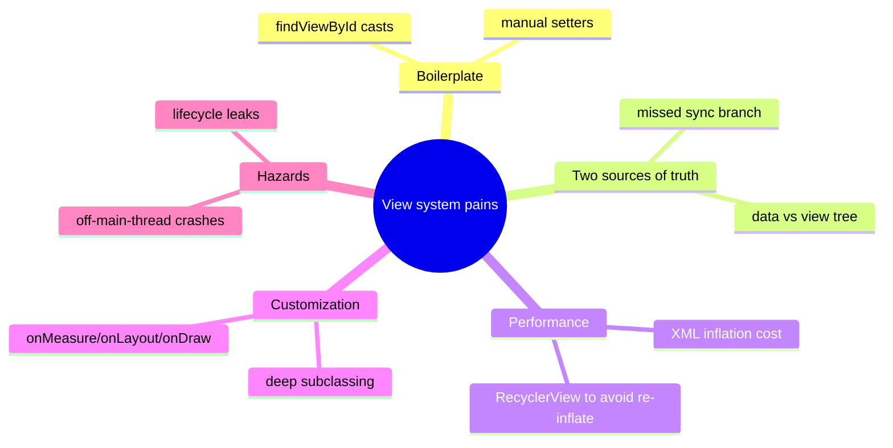

# Lesson 01 — The Evolution of Android UI

> After this lesson you can tell the story of Android UI from `findViewById` to Compose, name the specific pains each era introduced, and explain *why* a brand-new toolkit was worth it.

**Module:** 01 · **Lesson:** 01 · **Level:** 🟢🟡🔴 · **Est. time:** 45–60 min

---

## 1. Concept

### 🟢 For beginners — *what is it and why do I care?*

Every screen you've ever tapped on an Android phone was drawn by some **UI toolkit** — the framework that turns your code into pixels. For the first ~13 years, that toolkit was the **View system**: you described screens in **XML files** and wrote Kotlin/Java to *find* those views and *change* them at runtime.

A tiny example of the old world: you'd write a layout file with a `<TextView android:id="@+id/title"/>`, then in code call `findViewById<TextView>(R.id.title)` to get a handle on it, then `title.text = "Hello"` to set its words. Three steps, three places, every single time.

**Jetpack Compose** (stable since 2021, the default for new apps in 2026) replaces all of that. There's no XML, no `findViewById`, no "get the widget and poke it." You write Kotlin functions that *describe* what the screen should look like for the current data, and the framework draws it. When the data changes, you change the data — and the screen follows.

Why care about the history if Compose is the answer? Because **every pain Compose removed still echoes in the way it's designed.** You'll understand *why* Compose forbids certain things only once you've felt the bug it's preventing.

### 🟡 For intermediate devs — *the mechanism*

The View system is **imperative and retained**: the toolkit keeps a long-lived tree of mutable `View` objects (the "retained mode"), and your code issues commands to mutate that tree (`setText`, `setVisibility`, `addView`). You are personally responsible for keeping that mutable tree consistent with your data at all times.

The journey, era by era:

1. **Views + `findViewById` (2008→):** Manual lookups by integer id. Verbose, easy to typo a wrong-typed cast, and a `NullPointerException` waiting to happen if the view isn't in the current layout.
2. **`ViewHolder` pattern + `RecyclerView` (2014):** Lists were so painful (and `findViewById` in `getView()` so slow) that the community invented the `ViewHolder` to cache lookups, later baked into `RecyclerView`.
3. **Data Binding / View Binding (2015 / 2019):** Generated a binding class so you stopped writing `findViewById` by hand. View Binding fixed the null-safety and type-safety of lookups; Data Binding added expressions in XML — powerful but with a heavy build cost and hard-to-debug generated code.
4. **Architecture Components (2017→):** `ViewModel`, `LiveData`, Lifecycle — these addressed *where state lives and survives*, not *how you draw*. They are still relevant under Compose.
5. **Jetpack Compose (stable 2021):** A **declarative, immediate-mode-style** toolkit. You don't hold view references at all; you describe UI as a function of state and the runtime reconciles the changes.

The throughline: every step tried to reduce the gap between "the data" and "the views," because keeping two mutable things in sync by hand is the root cause of a huge class of UI bugs.

### 🔴 For senior devs — *trade-offs, edges, internals*

The View system's deepest problem wasn't verbosity — it was **two sources of truth**. Your data was one source; the mutable `View` tree was another. Every imperative setter is a manual sync between them, and the compiler can't check that you got it right. Miss one branch (`if (loading) progress.show()` but you forgot the `else`) and the UI silently lies.

A few structural costs that motivated a clean break rather than another wrapper:

- **Inheritance-heavy widget hierarchy.** `View` → `TextView` → `Button`… Customization meant subclassing deep classes and overriding `onMeasure`/`onLayout`/`onDraw`. Composition-over-inheritance was hard.
- **Inflation cost.** XML is parsed and reflectively inflated at runtime. `RecyclerView` exists in large part to *avoid* re-inflating rows.
- **Theming and state were external.** A `Button`'s pressed/disabled look lived in selector XML and styles, disconnected from the code reading the state.
- **Threading and lifecycle hazards.** Touching a view off the main thread, or after its lifecycle ended, was a constant source of crashes; you managed it manually.
- **No clean state subscription.** There was no built-in "this widget depends on this datum, re-derive it when it changes." You wired observers (`LiveData.observe`) and still called setters by hand inside them.

Compose collapses the two trees into one: **there is no retained widget you mutate.** You emit a *description* of UI; the runtime diffs descriptions and updates the underlying nodes. That single design choice is what makes "`UI = f(state)`" literally true, and it's why most View-era bug categories simply don't exist in Compose.

### Analogy

Think of **editing a printed newspaper vs. editing a web page**.

- **The View system is the printed newspaper.** Once printed, to change a headline you physically find that spot on the page and white-out/re-print just that patch (`findViewById` → `setText`). Forget a patch and the paper is inconsistent.
- **Compose is the web page.** You change the *source* (the data + template) and the page re-renders. You never reach into the rendered pixels; you edit the source of truth and the render follows.

### Mental model

> **In the old world you held the widgets and changed them; in Compose you hold the data and describe the widgets.** The bugs of the old world were sync bugs between two truths — Compose deletes one of the truths.

### Real-world example

Open almost any Google app shipped in the last few years — Play Store, Photos, the Gmail compose screen, parts of Maps — and you're looking at Compose. Internally, teams migrating from Views report the biggest win isn't lines of code; it's the **disappearance of "the screen doesn't match the data" bugs** that used to come from a missed `setVisibility` or a stale `RecyclerView` adapter.

---

## 2. Visual Learning

**ASCII — the two eras side by side:**
```text
   VIEW SYSTEM (imperative, retained)        COMPOSE (declarative)
   ───────────────────────────────────       ─────────────────────────
   data changes                              state changes
        │                                          │
        ▼                                          ▼
   findViewById(R.id.x)                       recomposition
        │                                          │
        ▼                                          ▼
   view.setText(...) / setVisibility(...)     UI re-derived from state
        │                                          │
        ▼                                          ▼
   YOU keep data ⇄ views in sync          runtime keeps UI = f(state)
   (miss one spot → silent bug)           (one source of truth)
```

**Mermaid — the timeline that led to Compose:**


**Mermaid — mind map of View-era pains (and who 'fixed' them):**


**Illustration prompt (paste into an image generator):**
```text
Illustration: a split-screen "before and after". LEFT side, sepia-toned, shows a developer
with tangled wires manually connecting boxes labeled "data" to a separate stack of UI boxes
labeled "views", with a magnifying glass labeled "findViewById" and red sync-error sparks.
RIGHT side, bright and clean, shows the same developer relaxed, editing a single glowing
document labeled "state", while UI panels auto-render from it via smooth light-beams labeled
"recomposition". Caption: "Two truths to sync → one source of truth." Modern, vibrant, soft gradients.
```

---

## 3. Code

> These snippets are illustrative of the *shape* of each era. The Compose examples use 2026 idioms (Kotlin 2.x, Compose BOM, Material 3). The View snippets are shown to be recognized, not written anew.

### 🟢 Beginner — the same label, three eras

```kotlin
// ❌ ERA 1 — Views + findViewById (recognize this; don't write new code like it)
// layout.xml: <TextView android:id="@+id/title" .../>
val title = findViewById<TextView>(R.id.title)
title.text = "Hello"          // imperative: fetch the widget, mutate it

// ⚠️ ERA 2 — View Binding (better: type-safe, null-safe lookup, still imperative)
binding.title.text = "Hello"  // no findViewById, but you still poke the widget

// ✅ ERA 3 — Compose (declarative: describe the UI for this data)
@Composable
fun Title(text: String) {
    Text(text)                // no handle, no setter — the text IS the UI
}
```

**Explanation.** In Era 1 you fetch a widget by id and call a setter — two steps, two failure points (wrong id, wrong cast). View Binding removes the fragile lookup but the model is still "get the widget, mutate it." Compose removes the widget entirely: `Title("Hello")` *is* the description; render "Hello".

**Common mistakes.**
```kotlin
// ❌ "XML brain": trying to keep a reference and mutate it in Compose
@Composable
fun BrokenTitle() {
    val textView = remember { /* there's no view to grab! */ }
    // There is nothing to findViewById. The instinct itself is the bug.
}
```
The classic newcomer error is *looking for the widget to change*. There isn't one. You change the input (`text`) and re-emit the description.

**Best practices.**
- Stop thinking "where's the widget?" Start thinking "what's the data, and what UI describes it?"
- When you see `findViewById`/binding setters in old code, read them as "this is manual data⇄view sync" — the thing Compose automates.

---

### 🟡 Intermediate — a "show/hide a message" feature, both worlds

```kotlin
// ⚠️ View world — you must drive BOTH branches by hand
fun render(isError: Boolean) {
    if (isError) {
        binding.error.visibility = View.VISIBLE
        binding.content.visibility = View.GONE
    } else {
        binding.error.visibility = View.GONE       // forget this line → stale error stays on screen
        binding.content.visibility = View.VISIBLE
    }
}
```

```kotlin
// ✅ Compose — describe the UI for each state; no manual toggling
@Composable
fun Message(isError: Boolean) {
    if (isError) {
        Text("Something went wrong", color = MaterialTheme.colorScheme.error)
    } else {
        Text("All good")
    }
}
```

**Explanation.** The View version needs *both* the `VISIBLE` and the `GONE` branch for every widget, every state — and the compiler can't tell you when you miss one. The Compose version is a single expression: for this state, this is the UI. There is no "previous widget" to clean up because nothing is retained.

**Common mistakes.**
- **Partial state handling (View era):** flipping one view's visibility but forgetting its sibling, leaving the screen in an impossible combination.
- **Porting the toggle habit to Compose:** newcomers sometimes try to manually `.visibility` things via clumsy flags instead of just branching in the composable. In Compose, *not emitting* a composable is how you "hide" it.

**Best practices.**
- Let the structure of your composable express the state directly (branch/`when`), so impossible UI combinations can't be reached.
- "Hiding" in Compose = not calling the composable, or wrapping it in `AnimatedVisibility` — never reaching for a retained handle.

---

### 🔴 Production — interop: the eras coexist during migration

```kotlin
// ✅ Real migrations are incremental. Compose hosts Views and vice-versa.

// 1) Put Compose inside an existing View hierarchy (e.g., one screen at a time).
class LegacyActivity : AppCompatActivity() {
    override fun onCreate(savedInstanceState: Bundle?) {
        super.onCreate(savedInstanceState)
        setContent {                       // a ComposeView under the hood
            MaterialTheme { ProfileScreen() }
        }
    }
}

// 2) Embed a hard-to-replace View (e.g., MapView, AdView) inside Compose.
@Composable
fun MapContainer(modifier: Modifier = Modifier) {
    AndroidView(
        factory = { context -> MapView(context) },   // create the legacy View once
        update = { mapView -> /* push new state INTO the view here */ },
        modifier = modifier,
    )
}
```

**Explanation.** You almost never rewrite an app in a weekend. `setContent { }` drops Compose into a View-based `Activity`/`Fragment`; `AndroidView` embeds a stubborn legacy `View` (maps, ads, camera previews, some charts) inside a Compose tree. `factory` builds the view once; `update` is where you re-apply state on recomposition — the one place the imperative "poke the widget" pattern survives, deliberately fenced off.

**Common mistakes.**
```kotlin
// ❌ Recreating the View on every recomposition (in update, or by rebuilding factory state)
AndroidView(
    factory = { ctx -> MapView(ctx).apply { /* one-time setup */ } },
    update = { it.setSomething(/* heavy re-init each frame */) } // janky; do minimal diffed updates
)
```
Treating `update` like a constructor (re-initializing instead of applying just the changed state) causes jank and leaks — the legacy view's lifecycle still needs respect.

**Best practices.**
- Migrate **screen by screen** (or leaf-component by leaf-component); don't block shipping on a full rewrite.
- `factory` = build once; `update` = apply only what changed. Remember the embedded `View` still has its own lifecycle to manage.
- Prefer replacing leaf Views with composables over keeping `AndroidView` long-term; use interop as a bridge, not a destination.

---

## 4. Interview Questions

**🟢 Beginner**

1. *What did `findViewById` do, and why is it considered a pain point?*
   > It looked up a `View` from the inflated XML layout by its integer id so you could mutate it in code. It was verbose, required correct (often unchecked) casts, and could return null or the wrong view, causing crashes — and you had to repeat it for every widget you touched.
2. *In one sentence, how does Compose differ from the View system?*
   > Instead of holding widget references and mutating them imperatively, you write functions that describe the UI for the current state, and the runtime renders and updates it for you.

**🟡 Intermediate**

3. *What problems did View Binding and Data Binding solve, and what did they leave unsolved?*
   > They removed hand-written `findViewById` (View Binding adds type/null safety; Data Binding adds XML expressions). But the model stayed imperative and retained — you still mutated a long-lived view tree and were responsible for keeping it in sync with your data. They reduced boilerplate, not the two-sources-of-truth problem.
4. *Why does `RecyclerView` exist, historically?*
   > Re-inflating list rows from XML and re-running `findViewById` per row was slow and janky. `RecyclerView` (and the earlier `ViewHolder` pattern) recycles row views and caches their child lookups, avoiding repeated inflation — a performance workaround for costs Compose's lazy lists handle differently.

**🔴 Senior**

5. *Articulate the core structural flaw of the View system that Compose was built to remove.*
   > Two sources of truth: your data and a separate mutable `View` tree. Every imperative setter is a manual, compiler-unchecked synchronization between them, so missing a branch leaves the UI silently inconsistent. Compose eliminates the retained tree you mutate — you emit a description and the runtime reconciles — making `UI = f(state)` literally hold and deleting that whole bug class.
6. *Why did Google build a new toolkit instead of evolving the View system further (e.g., more binding)?*
   > The View system's constraints were structural: a deep inheritance-based widget hierarchy, runtime XML inflation, theming/state living outside the code that reads it, manual lifecycle/threading, and no first-class state-subscription model. Bolting reactivity onto a retained, inheritance-heavy tree fights its fundamentals. A declarative runtime with composition-over-inheritance and built-in state observation was cleaner to design fresh than to retrofit.

---

## 5. AI Assistant

**Prompt example (explain unfamiliar legacy code):**
```text
Here's an Android snippet from a legacy module:
[paste findViewById / View Binding / RecyclerView adapter code]
Explain what it does in plain terms, identify which "era" of Android UI it's from,
and show the modern Jetpack Compose equivalent (Kotlin 2.x, Compose BOM, Material 3).
Call out any manual data⇄view sync that Compose would make automatic.
```

**AI workflow — where it helps on *this* topic.**
- ✅ Great for: explaining old `findViewById`/binding/adapter code, mapping a View-era widget to its Compose counterpart, and narrating *why* the old pattern was painful.
- ⚠️ Not yet: deciding your **migration strategy** (which screens to convert first, what to keep behind `AndroidView`) — that's an architectural judgment call; AI will happily propose a risky big-bang rewrite.

**Review workflow — check AI output against this lesson's *Common Mistakes*:**
- Did it drop the "find the widget and mutate it" instinct, or did it sneak a retained handle into Compose?
- For interop, does its `AndroidView` build the view in `factory` (once) and only apply changed state in `update` — not rebuild it every recomposition?
- Did it flag the *missed-branch / stale-view* sync bug as the reason Compose is safer, rather than just "less code"?

**Validation workflow — prove the migrated snippet actually works:**
1. **Compile & preview** the Compose version with `@Preview`; confirm it renders both states (e.g., error and success) without any imperative toggling.
2. For interop, run the screen, rotate, and background/foreground it — confirm the embedded `AndroidView` doesn't leak or re-initialize on each recomposition.
3. Diff behavior against the original screen: same states, same content, fewer manual setters.

> **AI drafts, you decide.** Let AI *translate and explain* the past; you own the *strategy* for moving off it.

---

## Recap / Key takeaways

- Android UI evolved **Views → binding → architecture components → Compose**, each step shrinking the gap between data and what's on screen.
- The View system is **imperative and retained**: you mutate a long-lived widget tree and keep it in sync with your data by hand — the source of a whole class of "screen doesn't match the data" bugs.
- Compose is **declarative**: you describe UI as a function of state, with **one source of truth**, so those sync bugs largely vanish.
- Migration is **incremental**: `setContent { }` hosts Compose in Views; `AndroidView` embeds legacy Views in Compose (`factory` once, `update` for changes).
- Knowing the history explains *why* Compose forbids the old habits — every rule prevents a pain you can now name.

➡️ Next: **[Lesson 02 — Imperative vs Declarative UI](02-imperative-vs-declarative.md)** — the single mental shift behind everything in Compose, and how to think in *state* instead of widgets.
