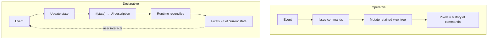
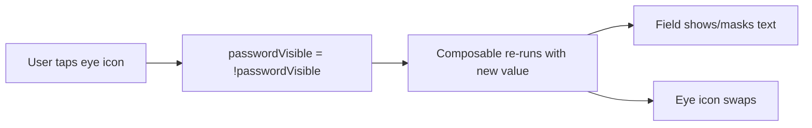

# Lesson 02 — Imperative vs Declarative UI

> After this lesson you can precisely define imperative and declarative UI, explain the "UI as a function of state" shift, and recognize which style a snippet uses on sight.

**Module:** 01 · **Lesson:** 02 · **Level:** 🟢🟡🔴 · **Est. time:** 50–65 min

---

## 1. Concept

### 🟢 For beginners — *what is it and why do I care?*

There are two fundamentally different ways to build a screen.

- **Imperative UI** = you give the UI a sequence of *commands*: "create a text view," "set its text to 'Hello'," "now make it red," "now hide the spinner." You describe **how** to change the screen, step by step. This is the View system.
- **Declarative UI** = you describe **what** the screen should look like *for the current data*, and the framework figures out the steps. "For this data, show 'Hello' in red and no spinner." This is Compose.

The famous one-liner: **UI is a function of state.** Written as code, `UI = f(state)`. You feed in the data (state), and out comes a description of the screen. When the data changes, you call the function again with the new data, and the screen updates to match. You never issue "now change this widget" commands.

Why care? Because the declarative style removes an entire category of bugs: the screen can't drift out of sync with the data, because the screen is *derived from* the data every time.

### 🟡 For intermediate devs — *the mechanism*

In **imperative** UI you mutate a retained tree of objects. The toolkit holds `View` instances; your code sends them messages (`setText`, `setVisibility`, `setEnabled`). The current pixels are the accumulated result of every command you've ever sent. To reason about the screen you must mentally replay that history.

In **declarative** UI you write a pure-ish function that, given state, *returns a description* of the UI (in Compose, by calling composable functions). The runtime takes the new description, **diffs** it against the previous one, and applies the minimal real changes to the underlying nodes. You think about a single moment ("what should it look like *now*?"), not a history of mutations.

```text
imperative:  state  →  YOU issue commands  →  mutated widget tree   (you manage the diff)
declarative: state  →  f(state) returns UI description → runtime diffs & applies  (it manages the diff)
```

Crucially, declarative doesn't mean "no events." User interaction still produces events (a tap, a keystroke). Those events **update the state**, and the state change re-invokes `f`. The flow is a loop: state → UI → event → new state → UI.

### 🔴 For senior devs — *trade-offs, edges, internals*

"Declarative" is often mis-summarized as "the framework re-renders everything." That's wrong on two counts, and the nuance is what makes it performant:

- **It's declarative at the description layer, reconciled at the node layer.** Compose composables don't return a `View` object you inspect; emitting is a side effect into the composition. The runtime keeps a slot table of what was emitted and **recomposes only the scopes whose inputs changed** — not the whole screen. So `f(state)` is conceptually re-run, but in practice only the affected sub-functions actually re-execute (covered in [Lesson 05](05-how-compose-works.md) and Module 12).
- **Purity is a contract, not a suggestion.** Because the runtime may skip, reorder, or repeat composition, your `f` must be free of side effects in the composition path. Imperative UI had no such rule — you could do anything, anywhere — which is exactly why it was hard to reason about.
- **Idempotence enables time-travel-ish features.** Since UI is a deterministic function of state, you get cheap previews, screenshot tests, and trivial state restoration: feed the same state, get the same UI. Imperative trees can't promise this because their pixels depend on mutation order.
- **The cost moves, it doesn't vanish.** Declarative shifts effort from "manually diffing data⇄views" (your bug surface) to "keeping state stable and minimal so the runtime's diff is cheap" (a performance concern). Stability and recomposition scope become the things seniors tune — a *better* problem to have, but a real one.

The deep idea: imperative UI optimizes for *issuing changes*; declarative UI optimizes for *describing results*. Humans are bad at remembering all the changes they've issued, so describing results is where correctness lives.

### Analogy

**Ordering coffee.**

- **Imperative:** you walk behind the counter and operate the machine — grind, tamp, pull the shot, steam the milk, pour. If you skip a step or do them out of order, you get a mess. You're responsible for *every action*.
- **Declarative:** you hand the barista an order ticket: "one oat flat white." You describe the *result*; the barista figures out the steps. Want to change it? Hand over a new ticket — you don't reach into the half-made drink and modify it.

`f(state)` is the order ticket. State changes? New ticket. You never operate the machine.

### Mental model

> **Imperative tells the UI *how to change*; declarative tells the UI *what to be*.** In Compose you never change the screen — you change the state and re-describe the screen.

### Real-world example

A **password field with a "show/hide" toggle**. Imperatively: on toggle, find the `EditText`, switch its `inputType`, find the eye icon, swap its drawable — multiple coordinated mutations. Declaratively: a single `passwordVisible: Boolean` state; the field's `visualTransformation` and the icon are both expressions of that one boolean. Flip the boolean; both follow. One source of truth, zero coordination.

---

## 2. Visual Learning

**ASCII — the two control flows:**
```text
   IMPERATIVE                                  DECLARATIVE  (UI = f(state))
   ──────────────────────────────             ─────────────────────────────
   event ──▶ run commands:                    event ──▶ update state
              setText(...)                              │
              setVisibility(...)                        ▼
              setEnabled(...)                     f(state) re-runs
              ...                                       │
                │                                       ▼
                ▼                                  runtime diffs & draws
   widget tree mutated step-by-step          UI re-derived from state
   (you must get every step right)           (state is the only thing you set)
```

**Mermaid — the declarative loop vs the imperative push:**


**Mermaid — flow: how one toggle propagates declaratively:**


**Illustration prompt (paste into an image generator):**
```text
Illustration: two panels. LEFT panel "IMPERATIVE": a person hunched over a complex control
board flipping many switches in sequence (labeled setText, setVisibility, setEnabled), sweating,
with a tangle of wires — caption "tell it HOW, step by step". RIGHT panel "DECLARATIVE": the
same person calmly handing a single order ticket labeled "f(state)" to a friendly machine that
instantly renders a clean UI — caption "describe WHAT it should be". A looping arrow on the right
labeled "event → new state → re-render". Modern, vibrant, soft gradients, clear labels.
```

---

## 3. Code

> Compose snippets use 2026 idioms (Kotlin 2.x, Compose BOM, Material 3). View snippets are shown to be *recognized*.

### 🟢 Beginner — a toggle, both styles

```kotlin
// ⚠️ IMPERATIVE (View world): on each tap, mutate widgets by hand
fun onToggleClicked() {
    passwordVisible = !passwordVisible
    if (passwordVisible) {
        editText.transformationMethod = null
        eyeIcon.setImageResource(R.drawable.ic_eye_off)
    } else {
        editText.transformationMethod = PasswordTransformationMethod.getInstance()
        eyeIcon.setImageResource(R.drawable.ic_eye)        // forget a branch → icon & field disagree
    }
}
```

```kotlin
// ✅ DECLARATIVE (Compose): one state, UI is a function of it
@Composable
fun PasswordField() {
    var visible by remember { mutableStateOf(false) }
    var text by remember { mutableStateOf("") }

    OutlinedTextField(
        value = text,
        onValueChange = { text = it },
        visualTransformation = if (visible) VisualTransformation.None
                               else PasswordVisualTransformation(),
        trailingIcon = {
            IconButton(onClick = { visible = !visible }) {
                Icon(
                    imageVector = if (visible) Icons.Filled.VisibilityOff else Icons.Filled.Visibility,
                    contentDescription = if (visible) "Hide password" else "Show password",
                )
            }
        },
    )
}
```

**Explanation.** Imperatively, *you* coordinate two widgets on every toggle and must handle both branches. Declaratively, both the field's masking and the icon are **expressions of the single `visible` boolean**. Flip it, re-run, both follow. There's nothing to keep in sync.

**Common mistakes.**
```kotlin
// ❌ Declarative in name, imperative in spirit: trying to "set" the UI instead of the state
IconButton(onClick = {
    // wrong instinct: "find the icon and change it"
    // there is no icon handle to grab — change `visible` and let the UI re-derive
}) { /* ... */ }
```
The trap is bringing the "mutate the widget" habit into Compose. The only thing you mutate is **state**.

**Best practices.**
- Identify the *single piece of state* a feature depends on; make every visual a function of it.
- "Changing the UI" should always read as "changing state," never "finding a widget."

---

### 🟡 Intermediate — three statuses, no manual toggling

```kotlin
enum class SaveStatus { Idle, Saving, Saved, Failed }

@Composable
fun SaveButton(status: SaveStatus, onSave: () -> Unit) {
    Button(onClick = onSave, enabled = status != SaveStatus.Saving) {
        when (status) {
            SaveStatus.Saving -> CircularProgressIndicator(Modifier.size(18.dp), strokeWidth = 2.dp)
            SaveStatus.Saved  -> { Icon(Icons.Filled.Check, contentDescription = null); Text("Saved") }
            SaveStatus.Failed -> { Icon(Icons.Filled.Error, contentDescription = null); Text("Retry") }
            SaveStatus.Idle   -> Text("Save")
        }
    }
}
```

**Explanation.** One `status` value drives the label, the icon, the spinner, *and* the enabled state via a single `when`. Add a state and the compiler forces you to handle it (exhaustive `when`). Imperatively, those four concerns would be four scattered setters you must remember to update together for every transition.

**Common mistakes.**
```kotlin
// ❌ Multiple booleans for one concept → impossible combinations are representable
var isSaving by remember { mutableStateOf(false) }
var isSaved  by remember { mutableStateOf(false) }
var isFailed by remember { mutableStateOf(false) }
// nothing stops isSaving == true AND isSaved == true at once → contradictory UI
```
- Representing one *status* as several booleans reintroduces the very inconsistency declarative UI prevents.
- Doing imperative side work in `onClick` that the UI then has to be manually re-synced to.

**Best practices.**
- Model mutually exclusive UI states as a single `enum`/sealed type, not a bag of booleans — make illegal states unrepresentable.
- Let an exhaustive `when` be your safety net: a new state won't compile until the UI handles it.

---

### 🔴 Production — declarative ≠ "re-render everything": scope the reads

```kotlin
data class ProfileUiState(
    val name: String = "",
    val unreadCount: Int = 0,
    val avatarUrl: String? = null,
)

@Composable
fun ProfileHeader(state: ProfileUiState) {
    Row(verticalAlignment = Alignment.CenterVertically) {
        Avatar(url = state.avatarUrl)              // reads only avatarUrl
        Spacer(Modifier.width(12.dp))
        Text(state.name, style = MaterialTheme.typography.titleMedium)  // reads only name
        Spacer(Modifier.weight(1f))
        // Pushing the volatile read DOWN keeps the badge the only thing recomposing
        UnreadBadge(count = state.unreadCount)
    }
}

@Composable
private fun UnreadBadge(count: Int) {
    if (count > 0) {
        Badge { Text(count.toString()) }           // only this recomposes when count changes
    }
}
```

**Explanation.** Declarative UI is conceptually `f(state)`, but the runtime recomposes **only the scopes that read changed state**. By passing `count` into a small `UnreadBadge` rather than reading it in a giant root composable, a frequent `unreadCount` update re-runs just the badge — not the whole header. The mental model stays "UI = f(state)"; the *performance* lever is *where* each piece of state is read (full detail in Module 11).

**Common mistakes.**
```kotlin
// ❌ Reading a volatile value at the top widens the recomposition blast radius
@Composable
fun ProfileHeader(state: ProfileUiState) {
    val label = "Hi ${state.name} (${state.unreadCount})"   // top-level read of unreadCount
    Text(label)                                             // whole header recomposes on every count tick
}
```
Reading frequently-changing state high in the tree makes large regions recompose needlessly — the declarative version of "doing too much work."

**Best practices.**
- Keep `UI = f(state)` as the *mental* model, but **read volatile state as low as possible** to keep recomposition surgical.
- Don't fear re-running composables — they're cheap when scoped; fear *unstable* inputs and *too-high* reads.
- Model state so each frame is a consistent snapshot (one `UiState`), then let small composables read just what they need.

---

## 4. Interview Questions

**🟢 Beginner**

1. *Define imperative vs declarative UI in one sentence each.*
   > Imperative UI: you issue step-by-step commands describing *how* to change a retained widget tree. Declarative UI: you describe *what* the UI should be for the current state, and the framework produces and updates it.
2. *What does "UI is a function of state" mean?*
   > The screen is derived from the data: `UI = f(state)`. You don't mutate the UI directly; you change the state and the framework re-derives the UI to match.

**🟡 Intermediate**

3. *If declarative UI re-derives from state, do you still handle user events? How?*
   > Yes. Events (taps, keystrokes) don't mutate widgets — they **update state**, and the state change re-invokes the UI function. The cycle is state → UI → event → new state → UI.
4. *Why model a screen's status as one enum/sealed type instead of several booleans?*
   > Separate booleans allow contradictory combinations (e.g., `isSaving` and `isSaved` both true), reintroducing the inconsistency declarative UI is meant to prevent. A single exclusive type makes illegal states unrepresentable and lets an exhaustive `when` force complete handling.

**🔴 Senior**

5. *"Declarative means the whole screen re-renders on every change." Correct the misconception.*
   > It's declarative at the *description* layer but reconciled at the *node* layer. Composables emit a description; the runtime keeps a slot table and recomposes only the scopes whose inputs changed. So `f(state)` is conceptually re-run, but in practice only affected sub-functions actually re-execute — assuming inputs are stable and reads are scoped low.
6. *What new responsibility does declarative UI add, given it removes manual data⇄view sync?*
   > It moves effort from manually diffing data against views (a correctness/bug concern) to keeping state **stable and minimal** and reads **scoped** so the runtime's diff stays cheap (a performance concern). Plus, the composition path must stay side-effect-free because composition can be skipped, reordered, or repeated.

---

## 5. AI Assistant

**Prompt example (translate imperative → declarative):**
```text
Here's an imperative Android click handler that mutates several views to reflect a status:
[paste onClick / setVisibility / setText code]
Refactor it to declarative Jetpack Compose: model the status as a single enum/sealed type,
make the UI a function of that state with an exhaustive `when`, and hoist state out of the
composable. Target Kotlin 2.x, Compose BOM, Material 3. Do not keep any widget references.
```

**AI workflow — where it helps on *this* topic.**
- ✅ Great for: converting imperative toggling into state-driven composables, collapsing scattered booleans into one sealed/enum type, and explaining *why* the declarative version can't drift out of sync.
- ⚠️ Watch: models sometimes produce "fake declarative" code that still thinks in mutations (lots of booleans, or side effects inside the composable). They may also over-split or under-split where state is read.

**Review workflow — check AI output against this lesson's *Common Mistakes*:**
- Is each visual an **expression of state**, with no attempt to grab/mutate a widget?
- Did it collapse multiple booleans for one concept into a **single exclusive type** with an exhaustive `when`?
- Are volatile reads pushed **low** (small child composables), not concentrated at the top?
- Is the composition path **pure** (no logging/network/mutation inside the body)?

**Validation workflow — prove the declarative version behaves:**
1. **Compile & preview** each state with `@Preview` (one preview per enum case) — confirm every state renders correctly with zero manual toggling.
2. Drive the state through all transitions in a running app; verify no "impossible combination" can appear.
3. (Optional) Enable **Layout Inspector → recomposition counts** and confirm a volatile update recomposes only the small child reading it, not the whole screen.

> **AI drafts, you decide.** If the "refactor" still mutates widgets or juggles contradictory booleans, it isn't declarative yet — send it back to the mental model: change state, re-describe UI.

---

## Recap / Key takeaways

- **Imperative** = commands describing *how* to mutate a retained widget tree (View system). **Declarative** = describing *what* the UI is for the current state (Compose).
- **`UI = f(state)`**: change the state, the framework re-derives the screen — you never poke widgets directly.
- Events don't mutate UI; they **update state**, which re-invokes the UI function: state → UI → event → new state.
- Declarative is **not** "re-render everything": it's described declaratively but reconciled to update only the scopes whose inputs changed.
- The new discipline is modeling state well (one exclusive type, not many booleans) and reading volatile state **low** so recomposition stays cheap.

➡️ Next: **[Lesson 03 — Compose vs XML, Head to Head](03-compose-vs-xml.md)** — a concrete, category-by-category comparison, where each wins, and the reality of interop and migration.
