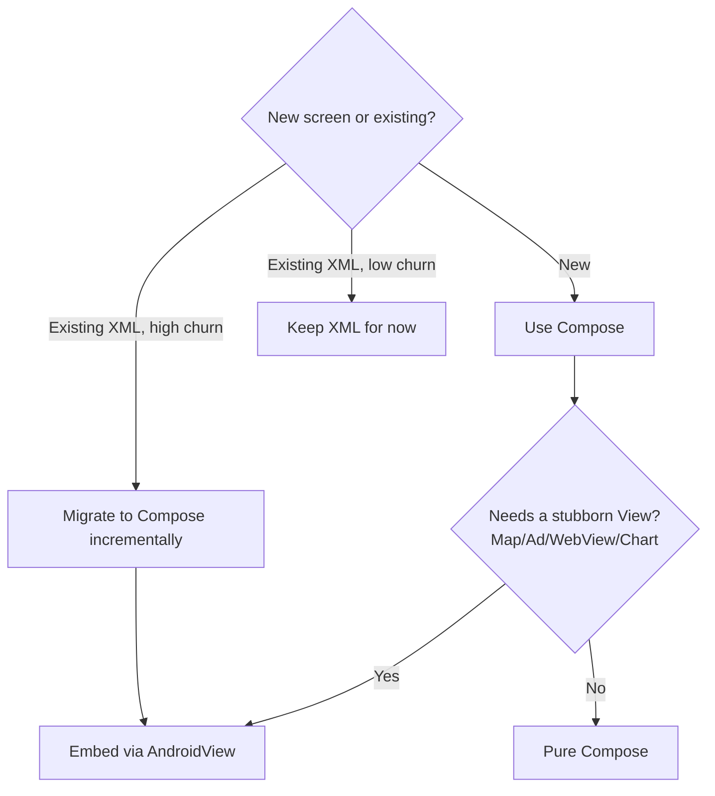

# Lesson 03 — Compose vs XML, Head to Head

> After this lesson you can compare Compose and the XML/View system category by category, say where each genuinely wins, and explain how they interoperate during a real migration.

**Module:** 01 · **Lesson:** 03 · **Level:** 🟢🟡🔴 · **Est. time:** 50–65 min

---

## 1. Concept

### 🟢 For beginners — *what is it and why do I care?*

You've met both worlds: **XML + Views** (the old way) and **Compose** (the new way). This lesson puts them side by side so you stop wondering "which is better?" and start knowing "better at *what*?"

The short version:

- **XML/Views** describe a UI in a separate markup file; Kotlin code then finds and mutates those views.
- **Compose** describes the UI *in Kotlin*, as functions, with no separate layout file and no `findViewById`.

For brand-new screens in 2026, **Compose is the default** Google recommends. But XML doesn't vanish overnight — millions of existing screens are XML, and the two can live in the **same app, even the same screen**. Knowing the comparison helps you read old code, justify new code, and migrate sanely.

### 🟡 For intermediate devs — *the mechanism*

Category by category, here's how they differ in practice:

| Category | XML + Views | Jetpack Compose |
|---|---|---|
| Where UI is defined | `.xml` layout files + Kotlin/Java | Kotlin `@Composable` functions only |
| Wiring to code | `findViewById` / View Binding / Data Binding | Direct — UI *is* code; no lookup |
| Update model | Imperative (mutate retained views) | Declarative (`UI = f(state)`) |
| Reuse | `<include>`, custom Views (subclassing) | Composable functions (composition) |
| Lists | `RecyclerView` + adapter + ViewHolder | `LazyColumn` / `LazyRow` (item DSL) |
| Theming | XML styles/themes + attrs | `MaterialTheme` (Material 3) in code |
| Preview | Layout Editor (XML), limited for code | `@Preview` — full, parameterizable, multi-config |
| Animation | `ObjectAnimator`, transitions, XML | First-class animation APIs in code |
| Tooling state | Mature, stable, huge ecosystem | Modern, fast-moving, BOM-versioned |

The deeper mechanical difference is **retained vs reconciled**: XML inflates a long-lived mutable tree you push changes into; Compose reconciles short-lived descriptions and updates nodes for you (Lessons 01–02). Almost every row above flows from that single distinction.

### 🔴 For senior devs — *trade-offs, edges, internals*

A balanced senior view resists "Compose good, XML bad." Each has real, current trade-offs:

- **Where Compose clearly wins:** less boilerplate (no IDs/binding), `UI = f(state)` correctness, composition-over-inheritance reuse, vastly better previews (`@Preview` with parameters, devices, dark mode, fonts), unified state + theming + animation in one language, and easier dynamic/data-driven UIs. Lists avoid XML re-inflation.
- **Where XML/Views still hold ground (2026):**
  - **Mature, stubborn widgets via interop.** `MapView`, ad SDKs, some camera/video surfaces, certain charting libs, and `WebView` are often still Views, embedded with `AndroidView`.
  - **`RemoteViews` surfaces.** App widgets and custom notifications historically required `RemoteViews` (XML), though **Glance** now brings a Compose-style API to those surfaces.
  - **Huge existing codebases.** A 500-screen app isn't rewritten on a whim; XML remains for years.
  - **Hiring & familiarity.** Some teams have deep XML muscle memory; ramp-up is a real cost.
- **Performance is nuanced, not a slam dunk.** Compose can match or beat Views, but only with discipline: **stable types**, **Baseline Profiles** (to offset first-run JIT/interpretation), scoped reads, and avoiding accidental over-recomposition. A naive Compose screen can be *slower* than a tuned `RecyclerView`; a tuned Compose screen is competitive and often simpler. The runtime is interpreted-then-compiled, so Baseline Profiles materially affect cold-start jank — a senior knows to ship them.
- **The cost shifts, again.** XML's cost was boilerplate + sync bugs; Compose's cost is recomposition tuning + staying current with a BOM-versioned, evolving API. Choose per *project reality*, not ideology — but for greenfield, Compose is the default for good reasons.

The senior framing: **prefer Compose for new work; keep/interop XML where it's load-bearing; migrate incrementally and measure.**

### Analogy

**Building with bricks vs. 3D printing.**

- **XML/Views = bricklaying.** Mature, well-understood, lots of skilled bricklayers, and some structures (a chimney = a `MapView`) are easiest as classic brick. But every wall is laid by hand and adjustments mean chiseling.
- **Compose = 3D printing from a model file.** You edit the model (state) and reprint; iteration is fast, previews are instant, and complex shapes are easy. The printer is newer, so you keep it tuned (Baseline Profiles) and occasionally still bolt on a pre-made brick part (interop).

### Mental model

> **Compose is the default for new UI; XML is the incumbent you interop with and migrate from.** The question is rarely "which is better" but "what's load-bearing here, and what should new code be?"

### Real-world example

A banking app mid-migration: new account screens are **Compose** (fast to iterate, easy theming), the legacy transaction list is still a tuned **`RecyclerView`**, and the in-app **map** for ATM locations is a `MapView` embedded via `AndroidView` *inside* a Compose screen. All three coexist; the app ships. Over quarters, the `RecyclerView` becomes a `LazyColumn`, and the map stays interop until the maps SDK's Compose API is adopted.

---

## 2. Visual Learning

**ASCII — the same screen, two pipelines:**
```text
   XML + VIEWS                                  COMPOSE
   ─────────────────────────────────           ─────────────────────────────
   layout.xml ──inflate──▶ View tree            @Composable fns ──▶ description
        │                     ▲                       │                 │
   findViewById/Binding       │ mutate            recomposition         │ reconcile
        │                     │                       │                 ▼
   code sets text/visibility ─┘                   runtime updates only changed nodes
   (separate file + code, manual sync)           (one language, automatic diff)
```

**Mermaid — decision flow: Compose, XML, or interop?**


**Mermaid — interop both directions:**
```mermaid
graph LR
    subgraph "Compose hosts Views"
      CV[ComposeView / setContent] --> AV[AndroidView: MapView, WebView]
    end
    subgraph "Views host Compose"
      XML[XML layout] --> CVH[<ComposeView/> in XML]
      CVH --> CC[setContent { ComposeScreen() }]
    end
```

**Illustration prompt (paste into an image generator):**
```text
Illustration: a balanced scale / VS poster. LEFT pan labeled "XML + Views" holds classic
brick-and-blueprint icons (a paper blueprint, a magnifying glass "findViewById", a brick wall,
a small map chimney). RIGHT pan labeled "Compose" holds a glowing 3D printer extruding a clean
UI from a model file labeled "f(state)", with instant preview screens floating above. In the
middle, a handshake icon labeled "AndroidView interop" bridging both. Caption: "Default new,
interop old." Modern, vibrant, soft gradients, clear labels.
```

---

## 3. Code

> Compose uses 2026 idioms (Kotlin 2.x, Compose BOM, Material 3). XML/View snippets are for *recognition* and interop.

### 🟢 Beginner — a labeled card, both ways

```xml
<!-- ⚠️ XML: layout in a separate file -->
<LinearLayout
    android:orientation="vertical"
    android:padding="16dp"
    android:layout_width="match_parent"
    android:layout_height="wrap_content">
    <TextView android:id="@+id/title" android:textStyle="bold" .../>
    <TextView android:id="@+id/subtitle" .../>
</LinearLayout>
```
```kotlin
// ⚠️ ...plus code to fill it (View Binding shown)
binding.title.text = "Compose"
binding.subtitle.text = "Declarative UI"
```

```kotlin
// ✅ Compose: layout + data in one place, no IDs, no binding
@Composable
fun LabeledCard(title: String, subtitle: String) {
    Column(Modifier.padding(16.dp)) {
        Text(title, fontWeight = FontWeight.Bold)
        Text(subtitle)
    }
}
// usage: LabeledCard("Compose", "Declarative UI")
```

**Explanation.** XML splits the *shape* (layout file) from the *data* (binding code) and the *ids* that connect them — three artifacts. Compose has one: a function that takes the data and returns the UI. No id to mistype, no binding to regenerate.

**Common mistakes.**
```kotlin
// ❌ Recreating XML thinking in Compose: a "layout" function with no inputs that you then
//    try to fill from outside. Compose layouts take their data as parameters.
@Composable
fun CardLayout() { /* empty shell */ }   // then trying to "set" its text later — there's no handle
```
Newcomers replicate the "empty layout you populate later" pattern. In Compose the data *is* a parameter; there's nothing to populate after the fact.

**Best practices.**
- Pass data **into** the composable as parameters; don't build an empty shell and fill it later.
- Treat the composable function as both the layout *and* its binding — that's the point.

---

### 🟡 Intermediate — a list, `RecyclerView` vs `LazyColumn`

```kotlin
// ⚠️ XML/Views: adapter + ViewHolder + item XML + RecyclerView wiring (sketched)
class UserAdapter : RecyclerView.Adapter<UserVH>() {
    override fun onCreateViewHolder(p: ViewGroup, t: Int): UserVH = /* inflate item.xml */ TODO()
    override fun onBindViewHolder(h: UserVH, i: Int) { h.bind(items[i]) }   // manual bind per row
    override fun getItemCount() = items.size
}
```

```kotlin
// ✅ Compose: the list IS the description — keys + content for stable, efficient updates
@Composable
fun UserList(users: List<User>) {
    LazyColumn {
        items(users, key = { it.id }) { user ->          // stable key → correct, efficient diffing
            ListItem(
                headlineContent = { Text(user.name) },
                supportingContent = { Text(user.email) },
            )
        }
    }
}
```

**Explanation.** The `RecyclerView` path needs an adapter, a ViewHolder, an item layout, and `notify*` calls to stay correct. `LazyColumn` expresses the same list as a function of the `users` data, with a `key` so Compose can diff items efficiently (the analogue of `DiffUtil`, but inline). Far less ceremony, same lazy/recycling benefit.

**Common mistakes.**
```kotlin
// ❌ No keys → Compose can't track item identity across reorders/insertions; state/animation breaks
LazyColumn { items(users) { user -> ListItem(...) } }   // missing key = { it.id }
```
- Omitting `key` on a dynamic list (mirrors forgetting `DiffUtil`/stable ids in `RecyclerView`).
- Trying to call an "adapter" mindset in Compose (manual notify) instead of just changing the `users` state.

**Best practices.**
- Always provide a stable `key` for dynamic lists; add `contentType` for heterogeneous lists (Module 02).
- To "update the list," update the `users` state — there's no adapter to notify.

---

### 🔴 Production — interop and migration, done right

```kotlin
// ✅ Embed a stubborn View (map) inside a Compose screen, lifecycle-aware.
@Composable
fun AtmMapSection(modifier: Modifier = Modifier) {
    // Tie the legacy View's lifecycle to Compose so it pauses/resumes/destroys correctly.
    val lifecycleOwner = LocalLifecycleOwner.current
    AndroidView(
        factory = { ctx -> MapView(ctx).apply { onCreate(null) } },   // build once
        update = { mapView -> /* apply ONLY changed state, e.g. recenter */ },
        onRelease = { mapView -> mapView.onDestroy() },                // clean up
        modifier = modifier.fillMaxWidth().height(220.dp),
    )
    DisposableEffect(lifecycleOwner) {
        // forward start/stop to the MapView; omitted for brevity
        onDispose { /* remove observer */ }
    }
}
```

```xml
<!-- ✅ The other direction: host Compose inside an existing XML screen, one widget at a time -->
<androidx.compose.ui.platform.ComposeView
    android:id="@+id/compose_header"
    android:layout_width="match_parent"
    android:layout_height="wrap_content" />
```
```kotlin
// then in the Fragment/Activity:
binding.composeHeader.setContent { MaterialTheme { ProfileHeader(state) } }
```

**Explanation.** Real migrations are **bidirectional and incremental**. `AndroidView` hosts a `MapView` in Compose: `factory` builds it once, `update` applies only changed state, `onRelease` cleans up, and the View's lifecycle is forwarded so it behaves. The reverse — a `<ComposeView>` in an XML layout filled via `setContent` — lets you Compose-ify one piece of an existing screen without rewriting it. This is how teams ship continuously while migrating.

**Common mistakes.**
```kotlin
// ❌ Ignoring the embedded View's lifecycle → leaks, crashes, or a frozen map
AndroidView(factory = { MapView(it) })   // no onCreate/onResume/onDestroy forwarding, no onRelease
```
- Skipping lifecycle forwarding / `onRelease` for embedded Views (leaks, stale surfaces).
- Re-initializing the View in `update` (treating it like a constructor) → jank.
- Treating interop as permanent instead of a bridge, accruing two-system complexity forever.

**Best practices.**
- Forward the embedded View's lifecycle; provide `onRelease` to release native resources.
- Migrate **leaf-first or screen-first**, keep shipping, and **measure** with Baseline Profiles + Macrobenchmark before/after.
- Use interop as a *temporary bridge*; plan to replace stubborn Views with Compose-native APIs (e.g., Maps Compose, Glance for widgets) when feasible.

---

## 4. Interview Questions

**🟢 Beginner**

1. *Name three concrete differences between XML/Views and Compose.*
   > (1) XML defines UI in a separate file wired via `findViewById`/binding; Compose defines UI in Kotlin functions with no lookup. (2) Views update imperatively (mutate the tree); Compose updates declaratively (`UI = f(state)`). (3) Lists use `RecyclerView`+adapter in Views vs `LazyColumn` in Compose.
2. *In 2026, which should you use for a brand-new screen, and why?*
   > Compose — it's Google's recommended default for new UI: less boilerplate, declarative correctness, better previews and tooling, and unified state/theming/animation in one language.

**🟡 Intermediate**

3. *How do Compose and XML interoperate, and why does that matter?*
   > Both directions work: `AndroidView` embeds a `View` (e.g., `MapView`, `WebView`) inside Compose, and a `<ComposeView>` (or `setContent`) hosts Compose inside an XML/View screen. It matters because real apps migrate **incrementally** — you can adopt Compose screen-by-screen or component-by-component while continuing to ship.
4. *What replaces `RecyclerView` + adapter + `DiffUtil` in Compose, and what's the catch?*
   > `LazyColumn`/`LazyRow` with an item DSL. The catch: you must supply a stable `key` (and often `contentType`) for dynamic lists so Compose can diff and recycle correctly — the analogue of stable ids/`DiffUtil`. Omitting keys breaks item identity across reorders.

**🔴 Senior**

5. *Is Compose always faster than Views? Defend your answer.*
   > No — it's *competitive when tuned*, not automatically faster. Compose is interpreted-then-compiled, so cold start can be janky without **Baseline Profiles**, and naive code can over-recompose with unstable types or high reads. With stable types, scoped reads, and Baseline Profiles, Compose matches or beats a tuned `RecyclerView` while being simpler. The honest answer: equivalent-to-better with discipline; potentially worse without it.
6. *When would you deliberately keep XML/Views in a 2026 app?*
   > For load-bearing interop (Maps/Ads/`WebView`/some camera/chart SDKs still shipping Views), for `RemoteViews` surfaces not yet moved to Glance, for very large stable legacy areas where rewrite risk outweighs benefit, and where team familiarity makes incremental migration safer than a big bang. Keep them behind `AndroidView`, migrate by churn/value, and measure.

---

## 5. AI Assistant

**Prompt example (convert an XML screen to Compose):**
```text
Here is an Android XML layout and its View Binding code:
[paste layout.xml + binding setters]
Convert it to an equivalent Jetpack Compose screen (Kotlin 2.x, Compose BOM, Material 3):
- one @Composable per logical section, data passed as parameters,
- replace the RecyclerView with LazyColumn using a stable key,
- keep any MapView/WebView as AndroidView interop with proper lifecycle + onRelease.
List anything that should remain XML/interop and why.
```

**AI workflow — where it helps on *this* topic.**
- ✅ Great for: mechanical XML→Compose translation, generating `LazyColumn` from a `RecyclerView` adapter, and scaffolding `AndroidView` interop wrappers.
- ⚠️ Not yet: **migration strategy and performance trade-offs** — whether a screen is worth migrating, whether to ship Baseline Profiles, what to keep as interop. AI tends to either "rewrite everything" or forget lifecycle/keys.

**Review workflow — check AI output against this lesson's *Common Mistakes*:**
- Does each composable take its **data as parameters** (not an empty shell filled later)?
- Do dynamic lists have a stable **`key`** (and `contentType` where mixed)?
- For interop, is the embedded View built in `factory` once, updated minimally, given **`onRelease`**, and **lifecycle-forwarded**?
- Did it flag what should *stay* XML/interop, rather than blindly converting `MapView`/`WebView`?

**Validation workflow — prove the comparison/migration holds:**
1. **Compile & preview** the Compose version (`@Preview`, including dark mode) and compare visually to the original screen.
2. Run the screen; scroll the `LazyColumn`, reorder/insert items, confirm identity holds (keys work).
3. For interop, rotate and background/foreground; confirm the embedded View pauses/resumes and doesn't leak.
4. For perf claims, run **Macrobenchmark** with and without a **Baseline Profile**; compare cold-start jank before asserting "faster."

> **AI drafts, you decide.** Let AI translate XML to Compose mechanically; you own the *which-and-when* of migration and the *measure-before-you-claim* on performance.

---

## Recap / Key takeaways

- **Compose vs XML isn't "good vs bad"** — it's "default for new UI" vs "incumbent you interop with and migrate from."
- Compose wins on **boilerplate, declarative correctness, reuse, previews, and unified tooling**; XML/Views still hold ground for **stubborn interop widgets, `RemoteViews` surfaces, huge legacy code, and team familiarity**.
- The root difference is **retained-and-mutated (XML) vs reconciled-from-description (Compose)** — most other differences follow from it.
- **Performance parity needs discipline**: stable types, scoped reads, and **Baseline Profiles** (Compose is interpreted-then-compiled).
- Migration is **bidirectional and incremental**: `AndroidView` hosts Views in Compose; `<ComposeView>`/`setContent` hosts Compose in XML. Measure before/after.

➡️ Next: **[Lesson 04 — Why Google Built Compose](04-why-google-built-compose.md)** — the specific, structural problems with the View system at scale that justified a new toolkit.
