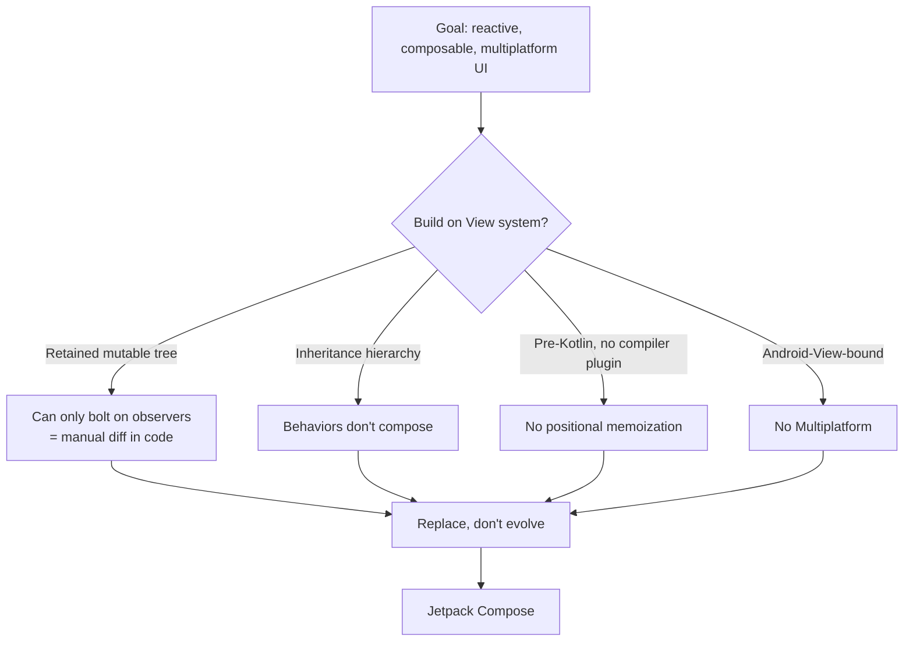
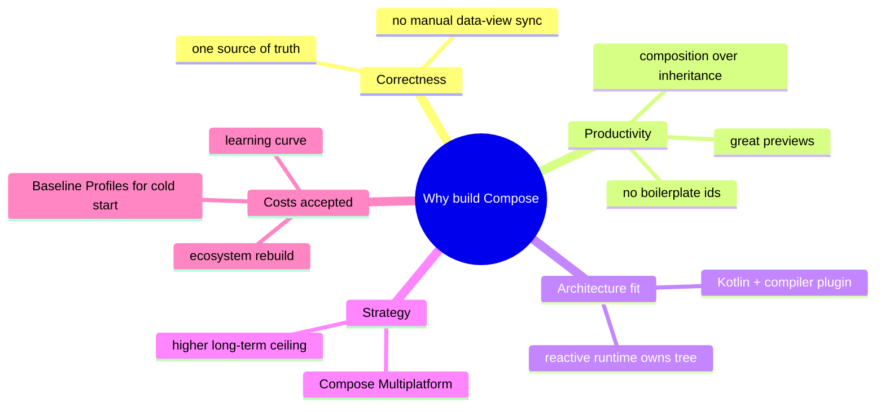

# Lesson 04 — Why Google Built Compose

> After this lesson you can explain the specific, structural problems with the View system that made a brand-new toolkit worth the cost — and why "just improve Views" wasn't enough.

**Module:** 01 · **Lesson:** 04 · **Level:** 🟢🟡🔴 · **Est. time:** 45–60 min

---

## 1. Concept

### 🟢 For beginners — *what is it and why do I care?*

Building a whole new UI toolkit is enormously expensive — years of engineering, a giant ecosystem to recreate, millions of developers to retrain. Google doesn't do that lightly. So the natural question is: **what was so wrong with the View system that a from-scratch replacement was the better bet?**

The honest answer is that the View system, designed in 2008 for a very different phone, accumulated problems that couldn't be fixed by adding more libraries on top. Each "fix" (binding, `RecyclerView`, architecture components) patched a symptom but left the root design in place.

The big root problems, in plain words:
1. **Too much boilerplate** to do simple things (find a widget, set it, repeat).
2. **Two copies of the truth** (your data and the on-screen widgets) that you had to keep in sync by hand.
3. **Hard to customize** without subclassing deep, complicated classes.
4. **Tangled state, theming, and lifecycle** spread across XML, code, and the framework.

Compose was built to delete these at the root, not paper over them. Caring about *why* helps you trust the rules Compose imposes — they exist to stop you from re-creating these exact problems.

### 🟡 For intermediate devs — *the mechanism*

Each pain has a concrete mechanical cause in the View system:

- **Boilerplate:** UI lives in XML, logic in Kotlin, connected by integer ids. Every interaction is "inflate → `findViewById` → cast → mutate," repeated everywhere. Binding reduced typing but not the model.
- **Two sources of truth:** the framework retains a mutable `View` tree; your data is separate. Keeping them consistent is manual and compiler-unchecked. (This is the recurring villain from Lessons 01–02.)
- **Inheritance over composition:** customizing meant subclassing `View`/`TextView`/`Button` and overriding `onMeasure`/`onLayout`/`onDraw`. Combining behaviors (a "card that's also a button that's also draggable") meant fighting single inheritance.
- **State/theming/lifecycle sprawl:** a button's enabled look lived in selector XML, its text in code, its data in a `ViewModel`, its lifecycle managed by you. No single place expressed "this widget, for this state."
- **Performance workarounds:** XML inflation is reflective and not free; `RecyclerView` exists largely to avoid re-inflating rows. Lists, the most common screen, needed a special, ceremonious component.

Compose addresses each: UI *is* Kotlin (no ids), one source of truth (`UI = f(state)`), composition-over-inheritance (combine functions/modifiers), and state/theming/animation unified in code. Lists become `LazyColumn`, no adapter.

### 🔴 For senior devs — *trade-offs, edges, internals*

The strategic case for *replace* over *evolve*:

- **The retained-tree model is the constraint.** Reactivity wants "describe results, let the system diff." The View system is built around "mutate a long-lived tree." You can bolt observers on top (`LiveData.observe { setText(...) }`), but you're still hand-writing the diff inside the observer. To get true reconciliation you need a runtime that owns the tree — which means a new toolkit, not a wrapper.
- **Inheritance hierarchies don't compose.** Decades of UI research point to **composition over inheritance**. The View class tree (deep, stateful, with protected measure/layout/draw) is the opposite. A clean composition model (small functions + chainable `Modifier`s) can't be retrofitted onto `View` without effectively rebuilding it.
- **Kotlin + a compiler plugin unlock the model.** Compose leans on Kotlin language features (trailing lambdas, type-safe builders, default args) and a **compiler plugin** that rewrites `@Composable` functions to participate in the runtime (positional memoization, recomposition scopes). This co-design of language + library + compiler simply wasn't available in 2008 and is hard to graft onto Java-era Views.
- **Cross-platform leverage.** Compose's architecture (a runtime that emits/diffs nodes, decoupled from the rendering backend) enabled **Compose Multiplatform** (desktop, web, iOS via JetBrains) — impossible with the Android-`View`-bound system. Strategic upside beyond Android.
- **The honest costs Google accepted:** a multi-year ecosystem rebuild, a learning curve, early-version churn, and the **interpreted-then-compiled** runtime needing **Baseline Profiles** to match View cold-start. These were judged worth it because the *ceiling* of the new model is far higher than the patched old one.

The senior takeaway: Compose exists because the View system's **foundational choices** (retained tree, inheritance, no state model, pre-Kotlin) capped what it could become. You don't renovate a foundation — you rebuild on a better one.

### Analogy

**Renovating a house vs. rebuilding on a new foundation.** For years, Google **renovated** the View "house": new kitchen (View Binding), better plumbing (`RecyclerView`), an extension (architecture components). But the **foundation** — a retained, inheritance-based, manually-synced design — couldn't support the modern structure (reactive, composable, multiplatform). At some point you stop renovating a cracked foundation and **build new** next door, then move in room by room (incremental migration).

### Mental model

> **Compose wasn't built because Views were "bad" — it was built because Views' *foundations* couldn't become reactive, composable, and multiplatform.** New foundation, higher ceiling, paid for over time.

### Real-world example

Google's own large apps drove this. Teams reported that at scale, the most expensive bugs and slowest feature velocity came from **manual data⇄view sync** and **deep custom-View hierarchies**. Internal and external case studies (e.g., Play Store, parts of Google's apps) cite reduced UI code and fewer state-sync defects after moving to Compose — the very problems this lesson lists, measured in production.

---

## 2. Visual Learning

**ASCII — root problems → Compose's structural answer:**
```text
   VIEW-SYSTEM ROOT PROBLEM            COMPOSE'S STRUCTURAL ANSWER
   ─────────────────────────────      ───────────────────────────────
   boilerplate (ids, binding)    ──▶  UI is Kotlin; no findViewById
   two sources of truth          ──▶  UI = f(state); runtime owns the tree
   inheritance for customization ──▶  composition: functions + Modifiers
   state/theme/lifecycle sprawl  ──▶  unified in code (state, MaterialTheme)
   list inflation cost           ──▶  LazyColumn (no adapter/ViewHolder)
   Android-View-bound            ──▶  runtime decoupled → Multiplatform
```

**Mermaid — why "evolve" hit a wall:**


**Mermaid — mind map: the case for a new toolkit:**


**Illustration prompt (paste into an image generator):**
```text
Illustration: a cracked old house labeled "View system (2008 foundation)" with patches and
scaffolding labeled "View Binding", "RecyclerView", "LiveData" — clearly renovated but the
foundation visibly cracked. Beside it, a sleek modern house under construction labeled "Compose"
on a solid new foundation labeled "reactive · composable · multiplatform", with a moving truck
labeled "incremental migration" carrying furniture from old to new. Caption: "New foundation,
higher ceiling." Modern, vibrant, soft gradients, clear labels.
```

---

## 3. Code

> These contrasts illustrate *why* the old model strained. Compose uses 2026 idioms (Kotlin 2.x, Compose BOM, Material 3); View snippets are for recognition.

### 🟢 Beginner — boilerplate, felt directly

```kotlin
// ⚠️ VIEW SYSTEM: define in XML, find by id, cast, mutate — for one label and one click
val title = findViewById<TextView>(R.id.title)
val button = findViewById<Button>(R.id.button)
title.text = "Welcome"
button.setOnClickListener { title.text = "Clicked" }   // mutate the retained widget
```

```kotlin
// ✅ COMPOSE: one function; state drives the label; no ids, no lookups
@Composable
fun Welcome() {
    var label by remember { mutableStateOf("Welcome") }
    Column {
        Text(label)
        Button(onClick = { label = "Clicked" }) { Text("Tap me") }
    }
}
```

**Explanation.** The View version touches **three artifacts** (XML, ids, code) and mutates a widget on click. The Compose version is one function: the click updates `label`, and the `Text` re-derives. The boilerplate the toolkit *forced* is simply gone — that reduction, multiplied across a whole app, is one reason Compose exists.

**Common mistakes.**
```kotlin
// ❌ Carrying the "find and mutate" reflex into Compose
Button(onClick = {
    // looking for `title` to setText — there's no view handle; update state instead
}) { Text("Tap me") }
```
The boilerplate habit is sticky; the fix is to mutate **state**, not a widget.

**Best practices.**
- Let the absence of ids/lookups be the point — fewer artifacts, fewer failure modes.
- Any "change the UI" thought should map to "change a state value."

---

### 🟡 Intermediate — customization: inheritance vs composition

```kotlin
// ⚠️ VIEW SYSTEM: to make a "badge-able, clickable card" you subclass and override
class BadgeCardView(context: Context) : FrameLayout(context) {
    // override onMeasure / onLayout / onDraw, manage child views, wire click, expose setters…
    // combining this with "draggable" or "selectable" fights single inheritance.
}
```

```kotlin
// ✅ COMPOSE: compose behaviors from small pieces; Modifiers stack, no subclassing
@Composable
fun BadgeCard(
    title: String,
    badgeCount: Int,
    onClick: () -> Unit,
    modifier: Modifier = Modifier,
) {
    Box(modifier = modifier.clickable(onClick = onClick)) {   // behavior via Modifier, not inheritance
        Card { Text(title, Modifier.padding(16.dp)) }
        if (badgeCount > 0) {
            Badge(Modifier.align(Alignment.TopEnd)) { Text("$badgeCount") }
        }
    }
}
```

**Explanation.** In Views, "clickable + badge + draggable" means subclassing and overriding protected methods, then fighting single inheritance to combine traits. In Compose, behaviors are **composed**: `clickable` is a `Modifier`, the badge is just another composable, dragging would be another `Modifier`. Stacking beats subclassing — exactly the composition-over-inheritance win that motivated the toolkit.

**Common mistakes.**
```kotlin
// ❌ Recreating inheritance in Compose: a giant monolithic composable with a dozen boolean flags
@Composable
fun MegaCard(isClickable: Boolean, isDraggable: Boolean, hasBadge: Boolean, /* ...10 more */) { }
```
- Packing every variation into one flag-laden composable instead of composing small pieces/modifiers.
- Reaching for "a custom View" reflex when a `Modifier` or a small composable would do.

**Best practices.**
- Build behavior by **composing** small composables and stacking `Modifier`s — not by inheritance or flag soup.
- Keep components focused; let callers combine them.

---

### 🔴 Production — one source of truth replaces manual sync

```kotlin
// ⚠️ VIEW SYSTEM: observe data, then HAND-WRITE the diff into widgets (the bug surface)
viewModel.uiState.observe(this) { s ->
    binding.progress.visibility = if (s.loading) View.VISIBLE else View.GONE
    binding.list.visibility     = if (s.loading) View.GONE else View.VISIBLE
    binding.error.visibility    = if (s.error != null) View.VISIBLE else View.GONE
    binding.error.text          = s.error ?: ""        // miss one branch → UI lies
    adapter.submitList(s.items)
}
```

```kotlin
// ✅ COMPOSE: the screen IS a function of one immutable state — no manual sync at all
@Composable
fun FeedScreen(state: FeedUiState) {
    when {
        state.loading      -> CircularProgressIndicator()
        state.error != null -> ErrorMessage(state.error)
        else                -> LazyColumn {
            items(state.items, key = { it.id }) { post -> PostRow(post) }
        }
    }
}
```

**Explanation.** The View version *receives* the new state and then **manually pushes it into widgets**, one property at a time — every line a chance to forget a branch and desync. The Compose version expresses the entire screen as `f(state)`: for this state, this UI. The "diff" is the runtime's job, not yours. Eliminating that hand-written sync is the single biggest correctness reason Compose was built.

**Common mistakes.**
```kotlin
// ❌ Re-introducing manual sync in Compose via side effects that poke things imperatively
@Composable
fun FeedScreen(state: FeedUiState) {
    LaunchedEffect(state) { /* manually toggling some external view/flag */ }   // back to two truths
    // ...
}
```
- Smuggling imperative sync back in through misused effects instead of just describing UI from state.
- Multiple independent states that can desync (Module 03's lesson) — keep one `UiState`.

**Best practices.**
- Express the whole screen as a function of **one immutable `UiState`**; let the runtime reconcile.
- Resist any pattern that recreates "receive data, then hand-push into widgets" — that's the problem Compose removed.

---

## 4. Interview Questions

**🟢 Beginner**

1. *Give two reasons Google built Compose instead of sticking with the View system.*
   > (1) To remove boilerplate — no XML ids, no `findViewById`/binding to wire UI to code. (2) To remove the two-sources-of-truth problem — with `UI = f(state)`, you stop manually syncing data into a retained widget tree.
2. *What is "composition over inheritance," and how does Compose use it?*
   > It's building behavior by combining small pieces rather than subclassing big ones. Compose composes small `@Composable` functions and stacks `Modifier`s (e.g., `clickable`, `padding`) instead of subclassing `View`/`Button` and overriding methods.

**🟡 Intermediate**

3. *Why couldn't Google just "evolve" the View system to be reactive?*
   > The View system is built around a retained, mutable tree you mutate imperatively. You can bolt observers on top, but you still hand-write the diff inside them. True reconciliation needs a runtime that *owns* the tree and diffs descriptions — that's a new toolkit, not a wrapper on `View`.
4. *How did Kotlin enable Compose's model?*
   > Compose relies on Kotlin features (trailing lambdas, type-safe builders, default arguments) plus a **compiler plugin** that rewrites `@Composable` functions for positional memoization and recomposition scopes. That language + compiler co-design wasn't available to the original Java-era View system.

**🔴 Senior**

5. *Argue the strategic case for Compose beyond Android-only benefits.*
   > Its architecture decouples the runtime (emit/diff nodes, recomposition) from the rendering backend, which enabled **Compose Multiplatform** (desktop, web, iOS via JetBrains). The View system is bound to Android's `View`. So Compose isn't just cleaner per-screen — it's a strategic bet on shared UI across platforms with one mental model and language.
6. *What costs did Google accept by replacing Views, and how are they mitigated?*
   > A multi-year ecosystem rebuild, developer retraining/learning curve, early API churn (mitigated by the **BOM** and stabilization), and an **interpreted-then-compiled** runtime that can be janky on cold start — mitigated by **Baseline Profiles** (and R8/startup work). The bet: the new foundation's ceiling (reactive, composable, multiplatform) far exceeds the patched old one's.

---

## 5. AI Assistant

**Prompt example (understand the motivation, not just the syntax):**
```text
I'm learning why Jetpack Compose exists. Given this legacy screen that observes a ViewModel
and manually pushes state into views:
[paste the observe { ... } block with setVisibility/setText/submitList]
Explain which specific View-system problems this illustrates (boilerplate, two sources of truth,
manual diff), then show the Compose version as UI = f(state) and point out exactly which manual
steps disappeared. Kotlin 2.x, Compose BOM, Material 3.
```

**AI workflow — where it helps on *this* topic.**
- ✅ Great for: articulating *which* root problem a snippet shows, contrasting inheritance-based custom Views with composition, and turning a manual `observe→setX` block into a `f(state)` composable.
- ⚠️ Not yet: **strategic/architectural judgment** (is migration worth it here? ship Baseline Profiles? keep interop?). AI also tends to oversell Compose as universally faster — apply Lesson 03's nuance.

**Review workflow — check AI output against this lesson's *Common Mistakes*:**
- Did it remove **all** manual data⇄view sync, or smuggle it back via misused effects?
- Did it **compose** behavior (small composables + `Modifier`s) instead of recreating inheritance or flag-soup composables?
- Is there **one immutable `UiState`**, not several states that can desync?
- Did it avoid claiming Compose is automatically faster (Baseline Profiles caveat)?

**Validation workflow — prove the motivation holds in code:**
1. **Compile & preview** the `f(state)` version across states (loading/error/content) — confirm no manual toggling is needed.
2. Count the manual setters removed vs the View version — the delta is the boilerplate/sync cost Compose deletes.
3. Run and exercise every state transition; verify no impossible/contradictory UI can appear (the two-sources-of-truth bug is gone).
4. If asserting perf, run **Macrobenchmark** ± **Baseline Profile** rather than trusting "Compose is faster."

> **AI drafts, you decide.** Use AI to *name and demonstrate* the problems Compose solves; keep the strategic calls (migrate? interop? profile?) yours.

---

## Recap / Key takeaways

- Compose exists because the View system's **foundations** — retained mutable tree, inheritance-based widgets, no state model, pre-Kotlin — capped what it could become; patches (binding, `RecyclerView`, LiveData) treated symptoms, not the root.
- The root problems: **boilerplate**, **two sources of truth**, **inheritance over composition**, and **state/theming/lifecycle sprawl**.
- Compose answers each structurally: **UI is Kotlin** (no ids), **`UI = f(state)`** (runtime owns the tree), **composition + `Modifier`s** (no subclassing), **unified state/theme/animation**, and **`LazyColumn`** lists.
- Kotlin + a **compiler plugin** made the model possible; the decoupled runtime unlocked **Compose Multiplatform**.
- Google accepted real costs (ecosystem rebuild, learning curve, **Baseline Profiles** for cold start) because the new foundation's ceiling is far higher.

➡️ Next: **[Lesson 05 — How Compose Works](05-how-compose-works.md)** — composition, recomposition, and the three phases (composition → layout → drawing) at a glance.
