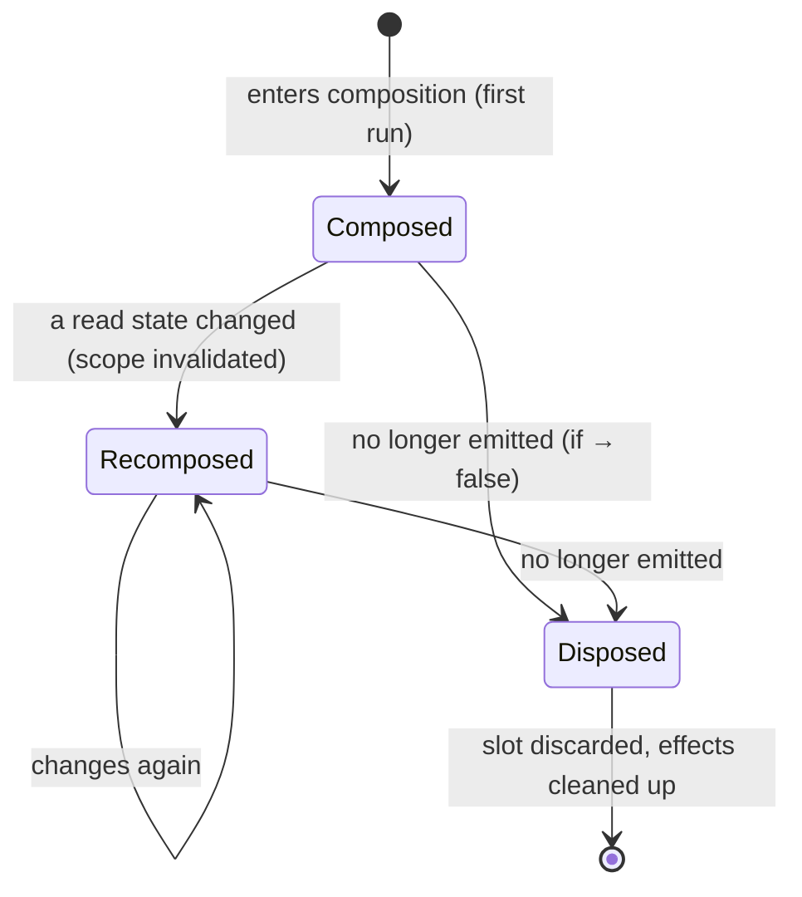
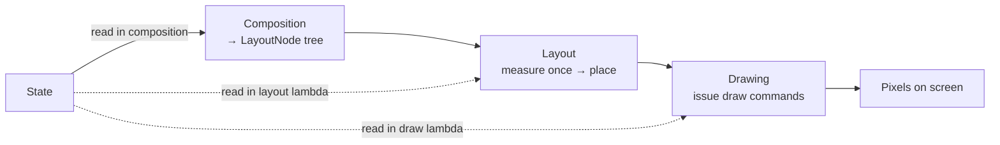

# Lesson 05 — How Compose Works

> After this lesson you can explain composition, recomposition, and the three frame phases (composition → layout → drawing), and predict what Compose re-runs when state changes.

**Module:** 01 · **Lesson:** 05 · **Level:** 🟢🟡🔴 · **Est. time:** 60–75 min

---

## 1. Concept

### 🟢 For beginners — *what is it and why do I care?*

So far you know *what* Compose is (declarative) and *why* it exists. Now: **how does it actually turn your functions into a screen?**

Three words to learn:

- **Composition** — the *first time* Compose runs your `@Composable` functions to build the initial picture of the UI. Think of it as "the first draw."
- **Recomposition** — when state changes, Compose **re-runs the functions that read that state** to update the picture. Not the whole screen — just the affected parts.
- **The three phases** — turning your description into pixels happens in three steps, every frame:
  1. **Composition** — *what* to show (run composables, build the UI tree).
  2. **Layout** — *where* and *how big* (measure and place each element).
  3. **Drawing** — *paint it* (render to the screen).

Why care? Because almost every "why is my UI slow / not updating / flickering" question is answered by knowing which phase is doing what, and what triggers a re-run.

### 🟡 For intermediate devs — *the mechanism*

When you call a composable, it doesn't return a `View`. Instead it **emits** into a structure the runtime keeps, called the **slot table** — a record of what was composed and where, including remembered values and state subscriptions. This is **positional memoization**: Compose remembers results by *where they are in the call tree*, which is how `remember` works and how it knows what to skip.

The lifecycle of a composable:

1. **Enters the composition** (first run) → its output and `remember`ed values are stored in the slot table.
2. **Recomposes** zero or more times → re-runs because a state it *read* changed; the runtime updates only those slots.
3. **Leaves the composition** → when it's no longer emitted (e.g., an `if` becomes false), its slot is discarded and effects are cleaned up.

Then every frame runs the **three phases**:

```text
Composition ──▶ Layout ──▶ Drawing
 (what)         (where/size)  (paint)
```

- **Composition** builds/updates the **LayoutNode** tree from your composables.
- **Layout** is two passes: **measure** (each node measures children with constraints, then decides its own size) then **place** (position children). Compose measures children **once** per layout pass (single-pass measurement — no expensive multi-pass like nested `LinearLayout` weights).
- **Drawing** issues draw commands onto the canvas.

The key efficiency: a state change doesn't always trigger all three phases. A change that only affects *position* can skip composition; a change that only affects *paint* (like color in a draw lambda) can skip composition **and** layout. This **phase skipping** is a major performance lever.

### 🔴 For senior devs — *trade-offs, edges, internals*

The internals worth designing around:

- **Restartable groups & recomposition scopes.** The compiler wraps composables (and certain lambdas) in **restartable groups**. When a state read inside a scope is invalidated, the **`Recomposer`** re-executes *that scope*, not its parent — granularity is the scope. This is why a 1000-row list can recompose a single row.
- **Strong Skipping (default in 2026).** With Strong Skipping enabled, Compose **skips** recomposing a composable whose parameters are **all equal** to last time — and it treats even *unstable* types as skippable by comparing instance equality, while lambdas are auto-remembered. This dramatically reduces the need for manual `@Stable`/`@Immutable` annotations, but **stability still matters**: an unstable parameter that changes identity every recomposition defeats skipping. Favor stable/immutable types (`kotlinx.collections.immutable`, data classes of stable fields) so equality is cheap and meaningful.
- **The three phases map to three trees.** Composition produces the **LayoutNode** tree; layout computes geometry; drawing fills a draw layer. **Deferred reads** are the senior superpower: reading state in a *layout* lambda (e.g., `Modifier.offset { … }`) or a *draw* lambda (`Modifier.drawBehind { … }`) means a change to that state **skips composition** (and possibly layout), only invalidating the later phase. Animations exploit this to avoid recomposing every frame.
- **Single-pass measurement.** Each node is measured once with incoming `Constraints`; a child may not be measured twice in a pass (that throws). Intrinsics exist for the rare case you need "how big would you be?" without committing. This is why Compose layout avoids the O(n²) blowups of deeply nested weighted `LinearLayout`s.
- **Composition is side-effect-free by contract.** Because scopes can re-run, skip, or run out of order, effects belong in keyed effect APIs (`LaunchedEffect`, etc., Module 06). The runtime may also run composition on a different thread than effects.
- **`key()` controls identity.** Identity in the slot table is positional by default; `key(id) { … }` (and list `key =`) tells the runtime "this is the same logical item," preserving `remember`/state across moves and enabling correct diffing.

The mental compression: **Compose = a runtime that (1) runs your functions to emit a node tree, (2) re-runs only invalidated scopes on state change, and (3) turns the tree into pixels in three skippable phases.** Performance work is mostly "shrink what recomposes" and "read state in the latest phase that needs it."

### Analogy

**A theater production.**

- **Composition** = the first full staging: actors take positions, the set is built per the script (your composables) for the current scene (state).
- **Recomposition** = the script changes one line, so **only the affected actors** redo their bit — the rest of the stage stays put.
- **Three phases** = blocking the scene: decide *who's on stage* (composition), *where they stand and how much space each takes* (layout), then *the lights come up and the audience sees it* (drawing). A lighting-only change (color) doesn't require re-blocking or re-casting — it skips to the "lights" phase.

### Mental model

> **Composition builds the tree; recomposition re-runs only the scopes that read changed state; layout sizes/places; drawing paints — and a change only triggers the phases it actually affects.**

### Real-world example

A **progress bar animating from 0→100%**. Naively, each frame could recompose the bar's composable. Done well, the fraction is read inside a **draw** lambda (`drawBehind`/`Canvas`), so each frame **skips composition and layout** and only re-draws — smooth 60–120fps with near-zero recomposition. Same screen, two orders of magnitude difference, decided entirely by *which phase reads the state*.

---

## 2. Visual Learning

**ASCII — the three phases (every frame):**
```text
   STATE  ──read──▶  ┌──────────────┐   build/update    ┌─────────┐   measure+place   ┌─────────┐
                     │ COMPOSITION  │ ────────────────▶ │ LAYOUT  │ ────────────────▶ │ DRAWING │ ──▶ pixels
                     │  (what)      │                   │ (where/ │                   │ (paint) │
                     └──────────────┘                   │  size)  │                   └─────────┘
                            ▲                            └─────────┘
   change affecting only paint  ─────────────────────────────────────────▶ skip to DRAWING
   change affecting only position ──────────────────────▶ skip to LAYOUT
```

**Mermaid — composable lifecycle & recomposition:**


**Mermaid — what each phase consumes/produces:**


**Illustration prompt (paste into an image generator):**
```text
Illustration: a theater stage shown as a three-step assembly line. STEP 1 "Composition":
a script/clipboard decides which actors (UI elements) are on stage. STEP 2 "Layout": a grid
overlay measures and positions each actor with rulers and spacing marks. STEP 3 "Drawing":
stage lights switch on and the audience sees the finished scene. A glowing "STATE" orb feeds
the line; thin bypass arrows show a "color-only" change jumping straight to the lights, and a
"move-only" change jumping to the positioning step. Modern, vibrant, soft gradients, clear labels.
```

---

## 3. Code

> 2026 idioms (Kotlin 2.x, Compose BOM, Material 3, Strong Skipping default). We *observe* the runtime's behavior; we don't fight it.

### 🟢 Beginner — see composition vs recomposition

```kotlin
@Composable
fun Greeting() {
    var count by remember { mutableStateOf(0) }   // remembered across recompositions

    Column {
        Text("Hello")                              // composed once; never reads count → not re-run
        Text("Count: $count")                      // reads count → recomposes when count changes
        Button(onClick = { count++ }) { Text("Add") }
    }
}
```

**Explanation.** The first time `Greeting` runs is **composition**. Tapping the button changes `count`; Compose **recomposes** the parts that *read* `count` — here, the `"Count: $count"` `Text`. The `"Hello"` `Text` doesn't read `count`, so the runtime can skip it. `remember` keeps `count` alive across those re-runs (without it, `count` would reset every recomposition).

**Common mistakes.**
```kotlin
// ❌ No remember → state is recreated every recomposition, so it never appears to change
var count by mutableStateOf(0)     // recreated each run → count looks stuck at 0
```
Forgetting `remember` is the #1 beginner trap — composition can re-run, and without `remember` your state is reborn each time.

**Best practices.**
- Wrap state you want to survive recomposition in `remember { ... }`.
- Know that "composition = first run, recomposition = re-run the readers" — that framing predicts behavior.

---

### 🟡 Intermediate — recomposition is scoped to the reader

```kotlin
@Composable
fun Dashboard() {
    var ticks by remember { mutableStateOf(0) }

    Column {
        Header()                                   // doesn't read ticks → skipped on each tick
        TickCounter(ticks)                         // reads ticks (via param) → recomposes
        Button(onClick = { ticks++ }) { Text("Tick") }
    }
}

@Composable private fun Header() {
    Text("Dashboard", style = MaterialTheme.typography.headlineSmall)
}

@Composable private fun TickCounter(value: Int) {
    Text("Ticks: $value")                          // only this scope re-runs when value changes
}
```

**Explanation.** Because `Header` takes no changing input and (with Strong Skipping) its params are unchanged, the runtime **skips** it on each tick. Only `TickCounter`, whose `value` parameter changed, recomposes. Recomposition granularity is the **scope that reads the changed state**, not the whole `Column`.

**Common mistakes.**
```kotlin
// ❌ Reading volatile state at the TOP widens recomposition to the whole Column
@Composable
fun Dashboard() {
    var ticks by remember { mutableStateOf(0) }
    Column {
        Text("Dashboard — ticks: $ticks")          // top-level read → Column recomposes every tick
        // ...
    }
}
```
- Reading frequently-changing state high in the tree recomposes large regions needlessly.
- Passing an **unstable** parameter that changes identity each time defeats skipping (Strong Skipping compares equality).

**Best practices.**
- Push volatile reads **down** into small composables; pass data as parameters.
- Favor **stable/immutable** parameter types so equality checks are meaningful and skipping kicks in.

---

### 🔴 Production — phase-aware reads (skip composition for animation)

```kotlin
@Composable
fun PulsingProgress(progress: () -> Float, modifier: Modifier = Modifier) {
    // progress is a lambda → the value is read INSIDE the draw phase, not composition.
    Canvas(modifier = modifier.fillMaxWidth().height(8.dp)) {
        // This block runs in the DRAWING phase. Reading progress() here means a progress change
        // skips composition AND layout — only this draw re-executes. Buttery for animations.
        val fraction = progress().coerceIn(0f, 1f)
        drawRect(color = Color.LightGray, size = size)
        drawRect(color = Color(0xFF6750A4), size = size.copy(width = size.width * fraction))
    }
}

// Caller animates a value; passing it as a lambda defers the read to draw:
@Composable
fun ProgressDemo() {
    val anim = remember { Animatable(0f) }
    LaunchedEffect(Unit) { anim.animateTo(1f, tween(2000)) }   // effect, not composition work
    PulsingProgress(progress = { anim.value })                 // lambda → deferred read
}
```

**Explanation.** By passing `progress` as a **lambda** and reading it inside `Canvas`'s draw scope, the animated value is read in the **drawing** phase. Each frame therefore **skips composition and layout** and only redraws — the runtime never re-runs `PulsingProgress`'s composition for the animation. This is the production pattern for smooth animations: choose the *latest phase* that needs the state and read it there.

**Common mistakes.**
```kotlin
// ❌ Reading the animated value in COMPOSITION → recomposes every single frame
@Composable
fun PulsingProgress(progress: Float) {                 // plain Float param, read in composition
    Canvas(Modifier.fillMaxWidth().height(8.dp)) {
        drawRect(Color(0xFF6750A4), size = size.copy(width = size.width * progress))
    }
}
// Caller: PulsingProgress(progress = anim.value)  // value read during composition → recompose storm
```
- Passing an animated value as a **plain parameter** read in composition causes a recomposition every frame.
- Doing animation/IO work *in the composition path* instead of in effects/deferred reads.

**Best practices.**
- Read state in the **latest phase** that needs it: position → layout lambda; paint → draw lambda. Pass values as **lambdas** to defer the read.
- Keep the composition path pure; run animations via `Animatable`/`animate*AsState` and side work via effect APIs (Module 06).
- Use **Layout Inspector → recomposition counts** to confirm composition isn't running per frame.

---

## 4. Interview Questions

**🟢 Beginner**

1. *What's the difference between composition and recomposition?*
   > Composition is the first run of your composables to build the initial UI. Recomposition is Compose re-running the composables that read changed state to update the UI — only the affected parts, not the whole screen.
2. *Name the three phases of a Compose frame, in order.*
   > Composition (what to show), Layout (where/how big — measure then place), and Drawing (paint to the screen).

**🟡 Intermediate**

3. *Why does forgetting `remember` make state appear "stuck"?*
   > Composition can re-run. Without `remember`, the `mutableStateOf(...)` is recreated on every recomposition, resetting to its initial value — so changes never persist. `remember` stores it in the slot table so it survives recompositions.
4. *What determines which composables recompose when state changes?*
   > The **readers**: only the recomposition scopes that *read* the changed state are invalidated and re-run. With Strong Skipping, a composable whose parameters are all equal to last time is skipped entirely.

**🔴 Senior**

5. *How can an animation update the UI without recomposing every frame?*
   > By reading the animated value in a later phase than composition — inside a layout lambda (`Modifier.offset { }`) or a draw lambda (`Canvas`/`drawBehind`). Passing the value as a lambda defers the read, so each frame skips composition (and possibly layout) and only re-lays-out or re-draws. This is phase skipping via deferred reads.
6. *With Strong Skipping on by default, does type stability still matter? Why?*
   > Yes. Strong Skipping lets Compose skip composables whose params are all equal and auto-remembers lambdas, reducing manual annotations — but it still relies on **equality**. An unstable parameter that produces a new, non-equal instance every recomposition (e.g., a freshly built `List` each time) won't compare equal, so skipping fails and the composable recomposes anyway. Favor immutable/stable types so equality is cheap and meaningful.

---

## 5. AI Assistant

**Prompt example (diagnose a recomposition storm):**
```text
This Compose screen janks during an animation. Here's the code:
[paste composable + how the animated value is passed]
Targeting Compose 2026 BOM, Kotlin 2.x, Strong Skipping default. Explain in terms of the three
phases WHY it recomposes every frame, and refactor so the animated value is read in the draw
(or layout) phase via a lambda. Don't add unnecessary @Stable annotations.
```

**AI workflow — where it helps on *this* topic.**
- ✅ Great for: explaining composition vs recomposition, identifying a top-level volatile read, and converting a plain animated parameter into a deferred lambda read.
- ⚠️ Not yet: deciding the *right* phase trade-offs and stability strategy for a hot screen — and AI often sprinkles `@Stable`/`remember` cargo-cult-style or claims "this fixes recomposition" without proof.

**Review workflow — check AI output against this lesson's *Common Mistakes*:**
- Is state you need to persist wrapped in `remember`?
- Are volatile reads pushed **low**, not concentrated at the top of the tree?
- For animation, is the value read in a **draw/layout lambda** (deferred), not as a plain composition-time parameter?
- Are parameters **stable/immutable** so Strong Skipping can actually skip?
- Is the composition path free of side effects / IO / animation work (those go in effects)?

**Validation workflow — prove the phase behavior:**
1. **Compile & run**; for a recomposition claim, enable **Layout Inspector → recomposition counts** and confirm the count is *not* incrementing per animation frame.
2. Temporarily add `SideEffect { Log.d("recompose", "X ran") }` to *see* exactly what recomposes on a state change; remove before committing.
3. Profile the animation with **Macrobenchmark** (frame timing) before/after the deferred-read refactor — confirm fewer dropped frames.
4. Toggle Strong Skipping assumptions: if a composable still recomposes when params "look unchanged," inspect the param's stability/equality.

> **AI drafts, you decide.** If the model says a change "fixes recomposition," make it *show* the recomposition-count delta — phase behavior is measurable, not a matter of opinion.

---

## Recap / Key takeaways

- **Composition** = first run that builds the UI/`LayoutNode` tree (via the slot table + positional memoization); **recomposition** = re-running only the scopes that **read** changed state.
- Every frame runs **three phases**: **Composition** (what) → **Layout** (measure once, then place) → **Drawing** (paint). A change triggers only the phases it affects.
- **`remember`** keeps state alive across recompositions; forgetting it makes state appear stuck.
- **Strong Skipping** (2026 default) skips composables with all-equal params and auto-remembers lambdas — but **stability/equality still matters** for skipping to work.
- **Phase skipping via deferred reads** (read state in a layout/draw lambda) is the key performance lever: animations can re-draw without recomposing.

➡️ Next: **[Lesson 06 — The Declarative Mindset & Misconceptions](06-declarative-mindset-misconceptions.md)** — rewiring "XML brain," thinking in state not widgets, and the myths that trip up every newcomer.
