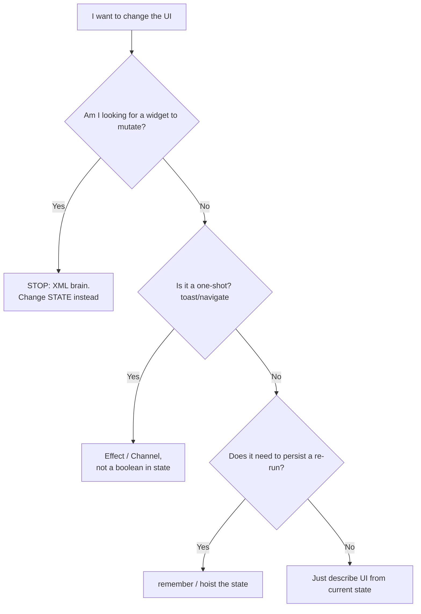
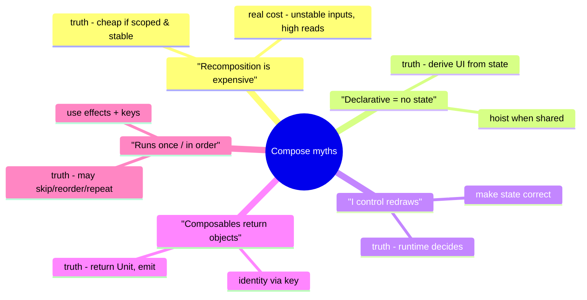

# Lesson 06 — The Declarative Mindset & Misconceptions

> After this lesson you can think in *state, not widgets*, name the "XML brain" habits that cause beginner bugs, and debunk the common Compose myths with confidence.

**Module:** 01 · **Lesson:** 06 · **Level:** 🟢🟡🔴 · **Est. time:** 55–70 min

---

## 1. Concept

### 🟢 For beginners — *what is it and why do I care?*

You now know Compose is declarative and roughly how it works. The last hurdle isn't technical — it's **mental**. Developers coming from XML/Views carry habits ("XML brain") that fight Compose and cause the classic beginner bugs.

The one habit to unlearn: **"find the widget and change it."** In Compose there is **no widget to find and no widget to change.** You change **state**, and the UI re-derives itself. Say it like a mantra:

> **Don't mutate the UI. Mutate the state, and let the UI follow.**

A few "XML brain" reflexes to drop:
- Looking for something like `findViewById` (there isn't one).
- Trying to `setVisibility`, `setText`, `setEnabled` on a widget (you don't hold widgets).
- Thinking of a composable as a *long-lived object* you configure once (it's a *function* that re-runs).
- Expecting code in a composable to run exactly once (it can run many times).

Care about this because **most "my Compose is buggy" moments are mindset bugs, not API bugs** — the fix is to think in state.

### 🟡 For intermediate devs — *the mechanism*

The mindset shift, made concrete:

| XML brain (drop it) | Declarative mindset (adopt it) |
|---|---|
| "Get the widget, then mutate it" | "Change the state; UI re-derives" |
| "Hide it" = `setVisibility(GONE)` | "Hide it" = don't emit it (or `AnimatedVisibility`) |
| "Store the view in a field" | Store **state**; the composable is recreated each run |
| "This line runs once" | Composition may run **many times** — keep it pure |
| "Toggle several widgets by hand" | One state value drives all dependent UI |
| "The composable holds data" | Data flows **in as parameters** (hoisting) |

Two mechanical truths that anchor the shift:
1. **Composables are functions, not objects.** They have no stable identity you configure; they run, emit, and may re-run. Anything you want to persist goes in `remember`/state, not in a field.
2. **The composition path must be pure.** No logging "once," no network calls, no mutating outer variables in the body — because recomposition can skip, reorder, or repeat (Lesson 05). Side effects live in effect APIs (Module 06).

Master these and the bugs (frozen UI, values resetting, things firing N times) stop appearing, because you've stopped asking the wrong question ("where's the widget?").

### 🔴 For senior devs — *trade-offs, edges, internals*

The subtle misconceptions that bite even experienced devs — debunked:

- **Myth: "Recomposition is expensive; minimize re-runs at all costs."** Reality: recomposition of a well-scoped, stable composable is **cheap by design** (it's just a function call that may early-out via skipping). The expensive things are **unstable inputs**, **too-high reads**, and **work in the composition path** — not the act of recomposing. Over-optimizing with premature `derivedStateOf`/`@Stable` everywhere adds complexity for no win. Measure first.
- **Myth: "Declarative means stateless / no local state."** Reality: declarative is about *deriving UI from state*, not avoiding state. Local UI state (`remember { mutableStateOf(...) }`) is normal and correct; the discipline is **where** it lives and that it's **hoisted** when shared, not that it's absent.
- **Myth: "I should manually control redraws."** Reality: you don't drive draws; you make state correct and let the runtime decide what to recompose/relayout/redraw. Fighting the runtime (forcing redraws, caching views) recreates the imperative problems Compose removed.
- **Myth: "`@Composable` functions return UI objects I can hold/inspect."** Reality: they return `Unit` and **emit** into the composition; there's no node handle to stash. Identity is positional / via `key`, not a reference you keep.
- **Myth: "Order of execution / number of runs is guaranteed."** Reality: composition can run **out of order**, be **skipped**, or **repeat**; lambdas may be deferred to later phases. Correctness must never depend on run count or order — that's what keys and effect APIs are for.
- **Subtlety: "stateless" ≠ "no `remember`."** A *stateless* (hoisted) composable can still use `remember` for derived/cached values; "stateless" means it doesn't **own** the source-of-truth state, not that it can't remember anything.

The senior framing: the declarative mindset isn't "avoid state / minimize recomposition." It's **"make state the single source of truth, keep the composition path pure, and let the runtime do the diffing — then measure before optimizing."**

### Analogy

**Driving an automatic vs. a manual transmission.**

- **XML brain = manual transmission:** you control every gear change (every widget mutation) yourself. Powerful, but you *must* do it right, constantly, or you stall (desync bug).
- **Declarative mindset = automatic transmission:** you set the destination (state) and steer; the car picks the gears (recomposition/layout/draw). Trying to "manually shift" an automatic by jamming the lever just fights the system. Trust the gearbox; focus on the road (your state).

### Mental model

> **You are not a UI mechanic poking widgets; you are a state author.** Write correct state, keep the composition path pure, and let the runtime render — don't reach for the widget, don't count the runs.

### Real-world example

A code review on a real team: a junior's screen "flickers and double-fires a toast." The diagnosis is pure XML-brain: they put `showToast()` directly in the composable body (fires every recomposition) and kept a boolean in `UiState` to "remember" it fired (re-fires after rotation). The fix is mindset, not API: move the one-shot to an effect/`Channel` (Module 03/06) and stop treating the composable as a place that "runs once." Same lesson, shipped to production.

---

## 2. Visual Learning

**ASCII — rewire the reflex:**
```text
   XML BRAIN (the bug)                       DECLARATIVE MINDSET (the fix)
   ──────────────────────────────────        ──────────────────────────────────
   event ─▶ find widget ─▶ mutate it          event ─▶ update state
                │                                          │
                ▼                                          ▼
   "setVisibility / setText / setEnabled"     UI re-derives from state
                │                                          │
                ▼                                          ▼
   miss a branch ─▶ UI desyncs (lies)         one source of truth ─▶ UI always matches
```

**Mermaid — myth-busting decision flow:**


**Mermaid — mind map of misconceptions:**


**Illustration prompt (paste into an image generator):**
```text
Illustration: a friendly "brain rewiring" scene. On the left, a tangled brain labeled "XML brain"
with thought bubbles: "findViewById?", "setVisibility!", "store the view". A glowing cable
re-routes to the right into a calm, organized brain labeled "declarative mindset" with bubbles:
"change the state", "UI = f(state)", "let the runtime render". Around the right brain float small
busted-myth cards with red strikethroughs: "recomposition is expensive", "declarative = no state",
"I control redraws". Modern, vibrant, soft gradients, clear labels.
```

---

## 3. Code

> 2026 idioms (Kotlin 2.x, Compose BOM, Material 3). Each tier shows an XML-brain bug and its declarative fix.

### 🟢 Beginner — "hide it" is *don't emit it*, not `setVisibility`

```kotlin
// ✅ Declarative: visibility is a function of state — branch, don't toggle a widget
@Composable
fun TipRow(showTip: Boolean, tip: String) {
    Column {
        Text("Main content")
        if (showTip) {                    // not emitting = "hidden"; emitting = "shown"
            Text(tip, style = MaterialTheme.typography.bodySmall)
        }
        // For animated show/hide, use AnimatedVisibility(visible = showTip) { Text(tip) }
    }
}
```

**Explanation.** There's no `tipView.visibility = GONE`. "Hidden" means the composable simply isn't emitted this composition; "shown" means it is. The boolean `showTip` is the single source of truth, and the UI follows it. For transitions, `AnimatedVisibility` wraps the same idea.

**Common mistakes.**
```kotlin
// ❌ XML brain: hunting for a handle / a visibility property to flip
@Composable
fun TipRow(showTip: Boolean, tip: String) {
    val tipView = /* ??? there is no view to grab */ Unit
    // tipView.visibility = if (showTip) VISIBLE else GONE   // doesn't exist in Compose
}
```
The instinct to find a visibility property *is* the bug. Branch on state instead.

**Best practices.**
- "Hide" = don't emit (or `AnimatedVisibility`); never look for a `.visibility`.
- Drive visibility from one boolean state, not a manual toggle.

---

### 🟡 Intermediate — composables are functions; persist via `remember`, not fields

```kotlin
// ✅ Declarative: state that must survive re-runs lives in remember, not a field
@Composable
fun ExpandableCard(title: String, details: String) {
    var expanded by remember { mutableStateOf(false) }   // survives recomposition
    Card(Modifier.clickable { expanded = !expanded }.padding(16.dp)) {
        Column {
            Text(title, style = MaterialTheme.typography.titleMedium)
            if (expanded) Text(details)                  // UI derives from `expanded`
        }
    }
}
```

**Explanation.** A composable is a **function that re-runs**, not an object you configure once. Anything that must persist across re-runs (here, `expanded`) goes in `remember`. Tapping flips the state; the card re-derives. No field, no view reference — just state.

**Common mistakes.**
```kotlin
// ❌ Treating the composable like an object: a plain var (no remember) resets every recomposition
@Composable
fun ExpandableCard(title: String, details: String) {
    var expanded = false                 // recreated each run → tap appears to do nothing
    Card(Modifier.clickable { expanded = !expanded }) { /* never expands */ }
}
```
- No `remember` → state reborn each composition (the "stuck UI" bug from Lesson 05).
- Storing things in outer fields/singletons to "keep" UI state, recreating hidden mutable state.

**Best practices.**
- Persist UI state with `remember` (or `rememberSaveable` for rotation; Module 03).
- Treat composables as functions: no instance fields, no held references — state is the memory.

---

### 🔴 Production — one-shots and side effects are NOT composition-path work

```kotlin
// ✅ Declarative + correct effects: derive UI from state; run one-shots/IO in effects
@Composable
fun WelcomeBanner(
    state: WelcomeUiState,
    events: Flow<WelcomeEffect>,        // one-shot effects (toast/navigate) from a ViewModel
    onSeen: () -> Unit,
    snackbar: SnackbarHostState,
) {
    // One-shot: consumed once in an effect — never in the composition body.
    LaunchedEffect(Unit) {
        events.collect { effect ->
            when (effect) {
                is WelcomeEffect.Toast -> snackbar.showSnackbar(effect.text)
            }
        }
    }
    // "Fire once when shown" → effect keyed to identity, not a line in the body.
    LaunchedEffect(state.id) { onSeen() }

    // Pure UI: just a function of state.
    Text(state.greeting, style = MaterialTheme.typography.headlineSmall)
}
```

**Explanation.** The composition body stays a **pure function of state** (`Text(state.greeting)`). The "show a toast" and "mark as seen" are **side effects**, so they live in `LaunchedEffect` — keyed so they run when intended, not on every recomposition. One-shot effects arrive via a `Flow`/`Channel` (Module 03), consumed once. This is the production answer to "it double-fires / flickers": move side work out of the composition path.

**Common mistakes.**
```kotlin
// ❌ XML brain: side effects in the composition body → fire on EVERY recomposition
@Composable
fun WelcomeBanner(state: WelcomeUiState) {
    analytics.log("welcome_shown")       // runs 0..N times per state change — wrong
    onSeen()                             // re-fires constantly
    showToast(state.greeting)            // flicker/double-toast after rotation
    Text(state.greeting)
}
```
- Logging/IO/navigation/toasts in the composable body (runs unpredictably with recomposition).
- Storing one-shot intent as a boolean in state (re-fires on recomposition and after rotation).

**Best practices.**
- Keep the composition path **pure**; route side effects through `LaunchedEffect`/`SideEffect`/`DisposableEffect`, keyed correctly (Module 06).
- One-shot events via `Channel`/`SharedFlow`, consumed once in a lifecycle-aware collector (Module 03).
- Don't rely on run count/order; rely on **state + keys + effects**.

---

## 4. Interview Questions

**🟢 Beginner**

1. *In Compose, how do you "hide" a UI element?*
   > You don't set a visibility property — you simply don't emit the composable for the current state (e.g., inside an `if`), or wrap it in `AnimatedVisibility(visible = …)`. Visibility is a function of state, not a widget setter.
2. *Why can't you keep a reference to a composable and mutate it like a View?*
   > Composables are functions that return `Unit` and *emit* UI; they aren't long-lived objects with setters. There's no handle to hold. You change **state**, and the composable re-runs to produce updated UI.

**🟡 Intermediate**

3. *A junior says "my button does nothing when tapped" — the state is a plain `var` in the composable. What's wrong?*
   > Composition can re-run, and a plain `var` (without `remember`) is recreated each recomposition, so it resets to its initial value and the change never persists. Wrap it in `remember { mutableStateOf(...) }` so it survives recompositions.
4. *Does "declarative" mean composables shouldn't have local state?*
   > No. Declarative means UI is **derived from** state, not that state is absent. Local UI state via `remember` is normal and correct; the discipline is hoisting it when shared and keeping the composition path pure — not avoiding state.

**🔴 Senior**

5. *Debunk: "Recomposition is expensive, so I should minimize it everywhere."*
   > Recomposition of a well-scoped, stable composable is cheap — it's a function call that can early-out via skipping. The real costs are **unstable inputs**, **reading volatile state too high**, and **doing work in the composition path**. Blanket micro-optimizations (`@Stable`/`derivedStateOf` everywhere) add complexity without measured benefit. Profile first; fix the actual hot spot.
6. *Why must correctness never depend on how many times (or in what order) a composable runs?*
   > Because composition can be **skipped, reordered, or repeated**, and lambdas may be deferred to later phases. Anything that must happen a precise number of times (analytics, navigation, IO) belongs in keyed **effect APIs** or one-shot channels — not the composition body. Relying on run count/order yields flaky, environment-dependent bugs.

---

## 5. AI Assistant

**Prompt example (fix XML-brain code):**
```text
Review this Compose code for "XML brain" anti-patterns and fix them. Specifically check for:
side effects in the composition body (logging/toast/navigation), state without remember,
attempts to mutate widgets/visibility imperatively, and one-shot events stored as booleans in state.
Rewrite it declaratively: UI as a function of state, persistent state via remember, one-shots via
LaunchedEffect + a Channel/SharedFlow. Target Kotlin 2.x, Compose BOM, Material 3.
[paste code]
```

**AI workflow — where it helps on *this* topic.**
- ✅ Great for: catching side-effects-in-body, missing `remember`, and "find-and-mutate" leftovers; rewriting toggles as state-driven branches; moving one-shots into effects.
- ⚠️ Watch: AI itself often *exhibits* XML brain (toasts in the body, booleans for navigation) and over-corrects with cargo-cult `@Stable`/`derivedStateOf`/excess `remember`. Treat its output as a draft that may carry the very myths this lesson debunks.

**Review workflow — check AI output against this lesson's *Common Mistakes*:**
- No side effects (log/toast/navigate/IO) in the **composition body** — all in keyed effects?
- Persistent state wrapped in **`remember`** (or `rememberSaveable`); no plain `var` for UI state?
- No attempts to **mutate widgets/visibility** imperatively — visibility is a branch / `AnimatedVisibility`?
- One-shot events via **`Channel`/`SharedFlow`**, not booleans in `UiState`?
- No premature `@Stable`/`derivedStateOf` without a measured reason?

**Validation workflow — prove the mindset fix worked:**
1. **Compile & run**; tap through interactions — confirm state-driven UI updates (no stuck/flicker).
2. Add a temporary `SideEffect { Log.d("recompose", "ran") }` to verify side work is **not** happening per recomposition; remove before commit.
3. **Rotate** the screen: one-shot effects (toast/navigation) must **not** re-fire (proves they aren't in state/body).
4. Toggle "Don't keep activities": confirm persistent state behaves (and survives via `rememberSaveable` where intended, Module 03).

> **AI drafts, you decide.** The model is as prone to XML brain as a newcomer — route every suggestion back through "change state, keep composition pure, defer side effects."

---

## Recap / Key takeaways

- The hardest part of Compose is **mental**: stop looking for a widget to mutate — **change state, let the UI follow**.
- "Hide it" = **don't emit it** (or `AnimatedVisibility`); composables are **functions, not objects** — persist with `remember`, never fields.
- The composition path must be **pure**: no logging/IO/toasts/navigation in the body — those go in **effects**, keyed correctly; one-shots via `Channel`/`SharedFlow`.
- Bust the myths: recomposition is **cheap when scoped/stable** (real costs are unstable inputs and high reads), declarative **uses** state (it doesn't avoid it), the **runtime** decides redraws, composables return `Unit` and **emit**, and run **count/order isn't guaranteed**.
- Net: be a **state author**, not a UI mechanic — and **measure before optimizing**.

---

### 🎓 Module 01 complete

You can now tell the story of Android UI (Views → Compose), explain imperative vs declarative, compare Compose and XML honestly, justify why Compose exists, describe how it works (composition, recomposition, three phases), and think in state rather than widgets.

➡️ **Back to the hub:** **[Module 01 — Introduction](README.md)** for the project and objectives.
➡️ **Next module:** **[Module 02 — Basic Layouts & Responsive Design](../module-02-layouts/README.md)** — turn this mindset into real screens with `Row`/`Column`/`Box`, lazy lists, `Scaffold`, and adaptive layouts.
