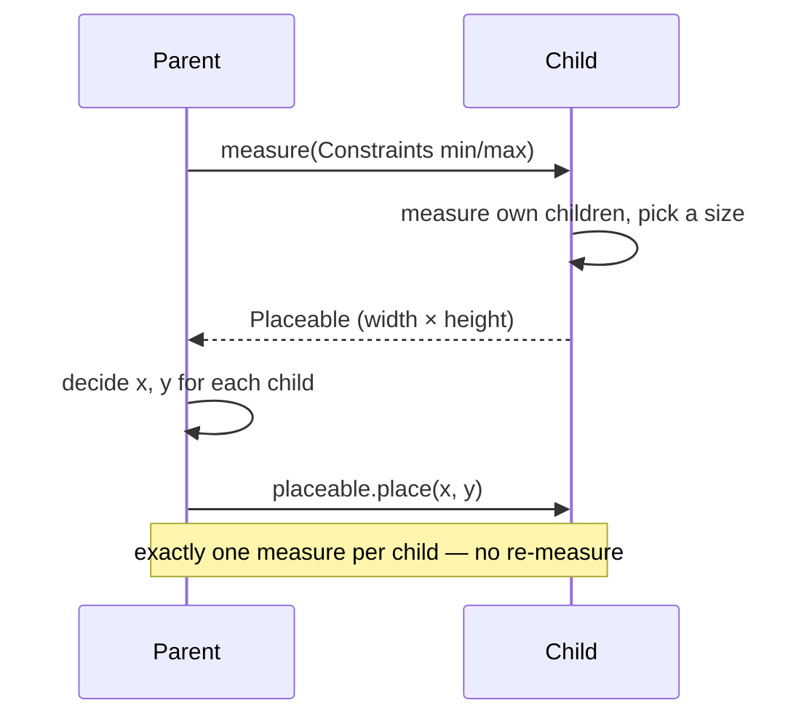
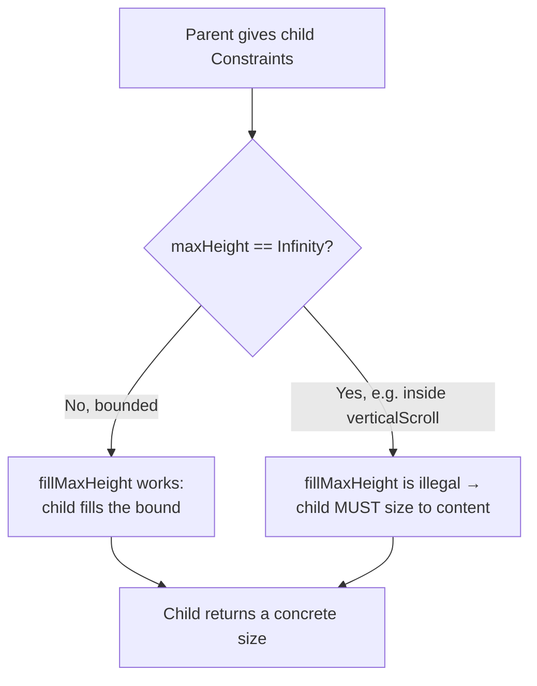

# Lesson 01 — Layout Principles & Constraint Thinking

> After this lesson you can explain how Compose measures and places UI in a single tree pass, and reason about any layout bug in terms of *constraints flowing down* and *sizes flowing up*.

**Module:** 02 · **Lesson:** 01 · **Level:** 🟢🟡🔴 · **Est. time:** 60–75 min

---

## 1. Concept

### 🟢 For beginners — *what is it and why do I care?*

When you write `Column { Text("Hi"); Button(...) }`, something has to decide **how big** the column is, **how big** the text and button are, and **where** each one sits on screen. That decision process is **layout**.

In the old View world you fought this with XML attributes — `match_parent`, `wrap_content`, nested `LinearLayout`s — and the framework did *multiple* measurement passes to settle everything. In Compose the model is simpler and stricter, and once you see it, layout stops being guesswork.

The whole idea boils down to a conversation between a parent and its children:

- The **parent** says to each child: *"You can be anywhere from this minimum to this maximum width and height."* That message is a **`Constraints`** object (min/max width, min/max height).
- Each **child** measures itself within those bounds and replies: *"OK, I'll be exactly this wide and this tall."*
- The parent then **places** each child at an (x, y) position and reports its own size up to *its* parent.

That's it. **Constraints flow down, sizes flow up, parents place children.** Almost every "why is my layout the wrong size?" question is answered by following that flow.

### 🟡 For intermediate devs — *the mechanism*

Compose lays out the UI tree in **a single pass** (no multi-pass measurement like the View system), which is what keeps it fast. Every layout node runs three phases in order, but the part *you* usually touch is **measure → place**:

1. **Composition** — your `@Composable` functions run and emit a tree of *layout nodes*. (Covered in Module 12.)
2. **Layout** — each node is measured **once** and placed:
   - **Measure:** the parent passes `Constraints` down. The child measures its own children (passing constraints further down), decides its size, and returns a `Placeable` (a measured child with a known width/height).
   - **Place:** the parent calls `placeable.place(x, y)` for each child, deciding positions.
3. **Drawing** — nodes draw themselves at their placed positions.

A `Constraints` carries four numbers: `minWidth, maxWidth, minHeight, maxHeight`. Two important shapes:

- **Bounded** — `maxWidth`/`maxHeight` are real numbers (e.g. the screen is 1080px wide). "Be at most this big."
- **Infinity** — `maxWidth == Constraints.Infinity`. "I won't constrain you; size to your content." This is what a scrolling parent passes on its scroll axis — a vertical scroller gives children *unbounded height*.

The **single-pass rule** has a hard consequence: **a composable may measure each child only once.** You cannot measure a child, look at the result, then measure it again with different constraints (that would be the slow multi-pass behavior Compose deliberately avoids). When you genuinely need a measured size *before* deciding constraints, you reach for `SubcomposeLayout` or intrinsics (both in Module 05) — but those are the exception, not the rule.

### 🔴 For senior devs — *trade-offs, edges, internals*

A few properties separate people who *use* layouts from people who can *debug and build* them (the latter is Module 05 — Custom Layouts):

- **Single-pass measurement is the core performance contract.** The View system could measure a subtree O(2ⁿ) times in pathological nested-weight cases; Compose forbids re-measuring a child, giving roughly **O(n)** layout. The price is that some layouts (e.g. "make all children as tall as the tallest") need **intrinsics** — a *separate, cheaper* query (`minIntrinsicHeight` etc.) that asks "how tall *would* you be at this width?" without committing to a full measure.
- **`Constraints.Infinity` is a sharp edge.** Place a `fillMaxHeight()` or a non-lazy `Column`-with-`weight` inside a `verticalScroll`, and you've asked a child to fill an *infinite* height — Compose throws `IllegalStateException` (can't fill unbounded constraints) or you get a runaway. This is the single most common layout crash. Scrollable parents relax the constraint on their scroll axis to infinity *on purpose*; your children must be content-sized there.
- **`Modifier` order changes the constraints.** Modifiers form a chain, and **each modifier can transform the `Constraints` before passing them inward and the resulting size on the way out.** `Modifier.padding(16.dp).size(100.dp)` and `Modifier.size(100.dp).padding(16.dp)` produce *different* results because padding shrinks the constraints the size modifier then sees. (Full treatment in Module 04.)
- **Constraints decide who wins a size fight.** `Modifier.size(500.dp)` inside a parent that hands down `maxWidth = 200.dp` will *not* be 500dp — `size` requests it, but the incoming max clamps it (unless you use `requiredSize`, which *ignores* incoming constraints and can overflow the parent). Knowing which modifier respects vs. overrides constraints is senior-level fluency.
- **Phases can read state independently.** A state read in *layout* (e.g. inside a `Modifier.offset { ... }` lambda) invalidates only layout, not composition — a key performance lever explored in Module 11. Layout is not "just a step before draw"; it's a separately invalidatable phase.

### Analogy

**A nesting-doll moving company.** The boss (root) tells the biggest doll: *"You have a 10×10 ft room — fit in there."* That doll tells the next: *"You get at most 8×8."* Down it goes until the smallest doll measures itself ("I'm 1×1") and reports **up**. Now each doll knows its real size, so each parent **places** its children inside itself and reports its own footprint upward. One trip down with *limits*, one trip up with *actual sizes*, then everyone is positioned. Nobody gets measured twice.

### Mental model

> **Constraints flow down, sizes flow up, parents place children — once.** Every layout bug is a wrong constraint or a wrong placement.

### Real-world example

A **product card** in a shop app: an outer `Card` is handed `maxWidth = screen width`. It passes a *padded* (smaller) constraint to a `Column`, which gives the product image `fillMaxWidth()` (take all available width), measures the title `Text` (wraps to content height), and stacks them. The card's final height = image + title + spacing, reported up to the `LazyColumn`. When you later wonder "why is this image edge-to-edge but the title inset?", the answer is *which constraint each child received* — exactly this flow.

---

## 2. Visual Learning

**ASCII — the down-and-up of a single layout pass:**
```text
                    Constraints DOWN (limits)
   ┌────────────┐  min/max W,H   ┌────────────┐  min/max W,H   ┌────────────┐
   │  Parent    │ ─────────────▶ │   Child    │ ─────────────▶ │ Grandchild │
   │ (Column)   │                │  (Row)     │                │  (Text)    │
   └────────────┘                └────────────┘                └────────────┘
         ▲                              ▲                              │
         │  size UP (w×h)               │  size UP (w×h)               │ measures self
         └──────────────────────────────┴──────────────────────────────┘
   Then each parent PLACES its measured children at (x, y) inside itself.
```

**Mermaid — measure then place, one pass:**


**Constraint-shape decision (when does a child get unbounded space?):**


**Illustration prompt (paste into an image generator):**
```text
Illustration: a set of Russian nesting dolls standing in a row, opened so each holds the next.
A glowing DOWNWARD arrow labeled "Constraints: max 10x10 → 8x8 → 1x1" runs from the largest doll
into the smallest. A separate glowing UPWARD arrow labeled "Actual size reported" runs back out.
Around each doll a faint dashed rectangle shows its allowed bounding box. One small doll tries to
grow past its dashed box and is marked with a red X labeled "size clamped by constraints".
Caption: "Constraints down, sizes up, place once." Clean, modern, vibrant, clearly labeled.
```

---

## 3. Code

> We deliberately avoid building a custom layout here — that's Module 05. The goal of this lesson is to *see* constraints with built-in tools and to fix the crash they cause.

### 🟢 Beginner — watch a constraint do its job

```kotlin
@Composable
fun ConstraintDemo() {
    // The Box hands its child a max width equal to its own (the screen, minus padding).
    Box(Modifier.fillMaxWidth().padding(16.dp)) {
        // fillMaxWidth() means: "be as wide as the max width you were given."
        Text(
            text = "I fill the width I'm offered.",
            modifier = Modifier
                .fillMaxWidth()           // takes the incoming maxWidth
                .background(MaterialTheme.colorScheme.primaryContainer)
                .padding(12.dp),
        )
    }
}
```

**Explanation.** `fillMaxWidth()` doesn't mean "be huge" — it means "adopt the **maxWidth** the parent passed down." The `Box` got `maxWidth = screenWidth`, subtracted padding, and handed the rest to the `Text`. Change the parent's width and the text follows, because it's reading a *constraint*, not a hardcoded number.

**Common mistakes.**
```kotlin
// ❌ Hardcoding a size that ignores the device, then wondering why it clips on small phones.
Text("Hello", modifier = Modifier.width(420.dp))   // wider than a compact phone → overflow
```
A fixed `width(420.dp)` requests 420dp regardless of the screen. On a 360dp-wide phone the parent's `maxWidth` clamps it (best case) or it overflows its container (with `requiredWidth`). Prefer `fillMaxWidth()` / `weight` so the *constraint* sets the size.

**Best practices.**
- Reach for `fillMaxWidth()`/`weight` before a hardcoded `dp` size — let constraints do the sizing.
- Treat a `dp` literal as a *last resort* for sizing along an axis the parent already constrains.

---

### 🟡 Intermediate — the infinite-height crash and its fix

```kotlin
// ❌ THE classic crash: filling height inside a vertical scroller.
@Composable
fun BrokenScrollingColumn(items: List<String>) {
    Column(Modifier.verticalScroll(rememberScrollState())) {
        items.forEach { Text(it) }
        Spacer(Modifier.weight(1f))        // 💥 weight needs a bounded height; scroll gave Infinity
    }
}
```

```kotlin
// ✅ Fix 1: don't fill/weight on the scroll axis — let content size itself.
@Composable
fun FixedScrollingColumn(items: List<String>) {
    Column(Modifier.verticalScroll(rememberScrollState())) {
        items.forEach { Text(it) }        // each child sizes to content; total height is the sum
    }
}

// ✅ Fix 2 (the usual real answer): if it's a long list, it shouldn't be a scrolling Column at all.
@Composable
fun BetterList(items: List<String>) {
    LazyColumn { items(items) { Text(it) } }   // Module 04 — lazy, and bounded per item
}
```

**Explanation.** A `verticalScroll` parent passes **`maxHeight = Infinity`** on its scroll axis so children can be as tall as their content (that's what makes scrolling possible). `weight(1f)` and `fillMaxHeight()` mean "fill the available height" — but there's no finite height to fill, so Compose throws. The fix is to *not* fill on the scroll axis. For long content, a `LazyColumn` is the correct tool (Lesson 04): it constrains and recycles items instead of measuring an infinite stack.

**Common mistakes.**
- `fillMaxHeight()` / `weight` / `fillMaxSize()` anywhere inside a `verticalScroll` (or `fillMaxWidth`/`weight` inside `horizontalScroll`).
- Nesting a scrollable inside a parent scrollable on the **same axis** (e.g. a `LazyColumn` inside a `verticalScroll` `Column`) — same infinite-constraint problem, plus broken fling.

**Best practices.**
- On a scroll axis, size to **content**; never fill or weight.
- Long, homogeneous content → `LazyColumn`/`LazyRow`, not a scrolling `Column`/`Row`.
- If you must mix fixed and scrolling regions, give the scroller a bounded box (e.g. `Modifier.weight(1f)` *outside* the scroll, on a non-scrolling parent) and scroll *inside* it.

---

### 🔴 Production — reading the actual constraints with `BoxWithConstraints`

```kotlin
/**
 * Adapts content to the *measured* space it's given, not the whole screen.
 * Reusable inside a pane, a card, or a split layout — it reasons about LOCAL constraints.
 */
@Composable
fun AdaptiveHeader(
    title: String,
    subtitle: String,
    modifier: Modifier = Modifier,
) {
    BoxWithConstraints(modifier) {
        // maxWidth/maxHeight here are the REAL constraints handed to THIS box (Dp).
        val isWide = maxWidth >= 600.dp

        if (isWide) {
            Row(verticalAlignment = Alignment.CenterVertically) {
                Text(title, style = MaterialTheme.typography.headlineMedium)
                Spacer(Modifier.width(12.dp))
                Text(subtitle, style = MaterialTheme.typography.bodyMedium)
            }
        } else {
            Column {
                Text(title, style = MaterialTheme.typography.headlineSmall)
                Text(subtitle, style = MaterialTheme.typography.bodyMedium)
            }
        }
    }
}
```

**Explanation.** `BoxWithConstraints` exposes the incoming `Constraints` (as `maxWidth`, `minWidth`, etc. in `Dp`) so the content can branch on the **space it was actually given** — not the device size. That distinction is what makes it composable: drop `AdaptiveHeader` into a narrow list-detail pane and it lays out vertically; give it a full tablet width and it goes horizontal. This is *local* adaptivity; Lesson 07 covers *window-level* adaptivity with Window Size Classes (a different, screen-wide signal).

**Common mistakes.**
```kotlin
// ❌ Using BoxWithConstraints when you really wanted the WINDOW size class.
// BoxWithConstraints reflects the local slot; if you branch your whole app navigation on it,
// a child placed in a 300dp pane will wrongly think it's a "phone". Use WindowSizeClass for
// app-level structure (Lesson 07) and BoxWithConstraints for component-level fit.
```
- Overusing `BoxWithConstraints` for *every* small decision — it introduces a subcomposition boundary; don't sprinkle it where a simple `Modifier.weight` would do.

**Best practices.**
- `BoxWithConstraints` answers *"how much room do I have **right here**?"* — perfect for self-fitting components.
- For *app structure* (rail vs. bottom bar, one pane vs. two), use **Window Size Classes** (Lesson 07), not local constraints.
- Branch on **breakpoints** (`>= 600.dp`), not exact device names.

---

## 4. Interview Questions

**🟢 Beginner**

1. *In one sentence, how does Compose lay out the UI?*
   > Constraints (min/max width & height) flow **down** from parent to child; each child measures itself within those bounds and reports its **size up**; then each parent **places** its children. It happens in a single measure-and-place pass.
2. *What does `fillMaxWidth()` actually do?*
   > It makes the composable adopt the **maxWidth** constraint its parent passed down — i.e. "be as wide as I'm allowed," not "be a fixed large width."

**🟡 Intermediate**

3. *Why does putting `Modifier.weight(1f)` or `fillMaxHeight()` inside a `verticalScroll` crash?*
   > A vertical scroller passes `maxHeight = Constraints.Infinity` on its scroll axis so children can size to content. `weight`/`fillMaxHeight` try to fill the available height, but infinity isn't a fillable bound, so Compose throws. Size to content on the scroll axis, or use a `LazyColumn`.
4. *What's the difference between `BoxWithConstraints` and Window Size Classes?*
   > `BoxWithConstraints` reports the **local** constraints given to that specific slot — good for a component fitting its container. Window Size Classes describe the **whole window** — good for app-level structure (rail vs. bottom bar, single vs. dual pane). A component in a small pane has small local constraints but might still be on a large-window device.

**🔴 Senior**

5. *Why is Compose's single-pass layout faster than the View system's measurement, and what does it cost you?*
   > Compose forbids re-measuring a child, giving roughly O(n) layout instead of the View system's potential O(2ⁿ) in nested-weight cases. The cost is that layouts needing a child's size *before* committing constraints can't just measure twice — they must use **intrinsics** (a cheap "how big would you be?" query) or `SubcomposeLayout`, both more advanced and slightly more expensive.
6. *How can two layouts with the same modifiers but different order produce different sizes?*
   > Modifiers form a chain where each link can transform the `Constraints` going in and the size coming out. `padding(16.dp).size(100.dp)` lets `size` see constraints already shrunk by padding; `size(100.dp).padding(16.dp)` sizes first then insets, yielding a different final footprint. Order = which constraints each modifier observes.

---

## 5. AI Assistant

**Prompt example (diagnosing a layout crash):**
```text
This Compose screen throws "Vertically scrollable component was measured with an infinity
maximum height constraints". Here's the code: [paste]. Explain the crash in terms of
constraints (what maxHeight the scroller passes down), then give the minimal fix WITHOUT
converting to LazyColumn, and a second option that uses LazyColumn. Target: Compose 2026 BOM,
Kotlin 2.x.
```

**AI workflow — where it helps on *this* topic.**
- ✅ Great for: explaining a constraints-related crash, translating a fixed-size XML layout into constraint-driven Compose, suggesting where `weight` vs `fillMaxWidth` belongs.
- ⚠️ Not yet: deciding *adaptive structure* (that's Lesson 07) or building a **custom** `Layout`/intrinsics (Module 05) — models often reach for `SubcomposeLayout` when a plain `Row` + `weight` would do.

**Review workflow — check AI output against this lesson's *Common Mistakes*:**
- Did it avoid `fillMaxHeight`/`weight`/`fillMaxSize` **inside** a same-axis scroller?
- Did it prefer constraints (`fillMaxWidth`, `weight`) over hardcoded `dp` for axis sizing?
- If it used `BoxWithConstraints`, is that for *local* fit — or did it confuse it with a window-level signal?

**Validation workflow — prove it actually works:**
1. **Compile & run** on a compact phone *and* resize to a tablet/foldable in the emulator — content shouldn't clip or crash.
2. Enable **Layout Inspector** and inspect a node's reported constraints/size; confirm the child got the bounds you expected.
3. Force the failure mode on purpose (drop a `fillMaxHeight` into a scroller) to confirm you recognize the exception text.

> **AI drafts, you decide.** If a model "fixes" a scroll crash by wrapping things in `SubcomposeLayout`, push back: the constraint model usually has a one-line answer.

---

## Recap / Key takeaways

- Layout is a single pass: **constraints flow down, sizes flow up, parents place children — once.**
- `Constraints` = `min/max` width & height. `fillMaxWidth()` means "take the maxWidth I was given," not "be large."
- A scroll axis passes **`Infinity`** as its max — so `fill`/`weight` on that axis crashes; size to content or go lazy.
- **Modifier order** changes the constraints each modifier sees, so it changes the result (Module 04).
- `BoxWithConstraints` reasons about **local** space; **Window Size Classes** (Lesson 07) reason about the whole window.
- Single-pass is fast (≈O(n)); the escape hatch for "measure first" is **intrinsics / `SubcomposeLayout`** (Module 05).

➡️ Next: **[Lesson 02 — Column, Row, Box](02-column-row-box.md)** — the core layout trio, plus arrangement and alignment.
