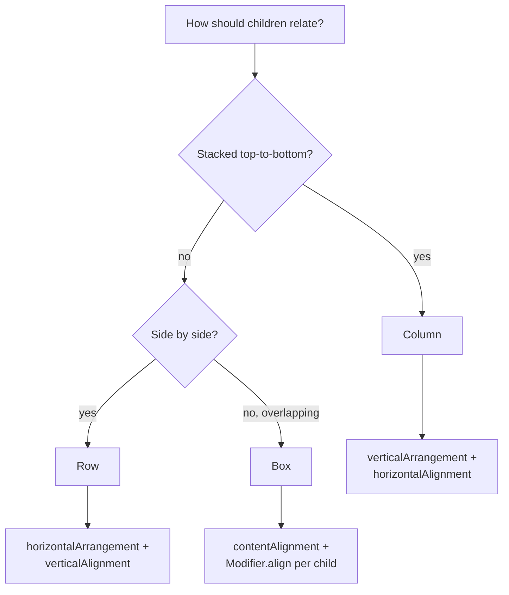
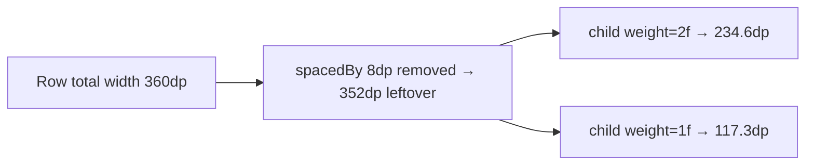

# Lesson 02 — Column, Row, Box

> After this lesson you can build any static screen with the three core containers and place children precisely using arrangement, alignment, and `weight`.

**Module:** 02 · **Lesson:** 02 · **Level:** 🟢🟡🔴 · **Est. time:** 65–80 min

---

## 1. Concept

### 🟢 For beginners — *what is it and why do I care?*

Ninety percent of Compose layouts are built from exactly three containers:

- **`Column`** — stacks children **vertically** (top to bottom).
- **`Row`** — lines children up **horizontally** (start to end).
- **`Box`** — **overlaps** children on top of each other (like layers in Photoshop).

That's the whole toolbox for static screens. A login form is a `Column`. A toolbar with an icon, a title, and an action is a `Row`. A photo with a play button centered on top is a `Box`. You compose them — a `Column` of `Row`s — to build anything.

Two words you'll use constantly:

- **Arrangement** — how children are spread along the container's **main axis** (vertical for `Column`, horizontal for `Row`). "Push them to the top? Space them evenly? Center them?"
- **Alignment** — how children sit along the **cross axis** (horizontal for `Column`, vertical for `Row`). "Left, center, or right within the column?"

### 🟡 For intermediate devs — *the mechanism*

Each container has a **main axis** and a **cross axis**, and you control them with different parameters:

| Container | Main axis | Cross axis | Main-axis param | Cross-axis param |
|---|---|---|---|---|
| `Column` | vertical | horizontal | `verticalArrangement` | `horizontalAlignment` |
| `Row` | horizontal | vertical | `horizontalArrangement` | `verticalAlignment` |
| `Box` | — (overlap) | — (overlap) | `contentAlignment` (both) + per-child `Modifier.align` | |

**Arrangement** options you'll reach for: `Arrangement.Top`/`Start` (default, pack at the beginning), `Center`, `End`/`Bottom`, `SpaceBetween` (first/last at edges, equal gaps between), `SpaceAround`, `SpaceEvenly`, and `spacedBy(8.dp)` (a fixed gap between every child — the cleanest way to add consistent spacing).

**`weight`** is the other half of the story. `Modifier.weight(1f)` on a child inside a `Row`/`Column` means *"after the fixed-size children are measured, split the **leftover** main-axis space by weight."* Two children with `weight(1f)` each take half; `weight(2f)` + `weight(1f)` split 2:1. This is how you build flexible, proportional layouts (a sidebar that's ⅓ and content that's ⅔) without hardcoding pixels.

`Box` is different: children **stack in declaration order** (later = on top), and you position each with `Modifier.align(Alignment.TopEnd)` or set a default for all with the `contentAlignment` parameter.

### 🔴 For senior devs — *trade-offs, edges, internals*

- **`weight(fill = true)` vs `fill = false`.** By default `weight(1f)` also *forces* the child to **fill** its share (the child gets `min == max` on the main axis). Pass `weight(1f, fill = false)` to let the child be *smaller* than its share if its content is smaller — it still can't exceed the share, but won't be stretched. Useful for a button that shouldn't balloon to fill a column.
- **`Arrangement.spacedBy` interacts with `weight`.** Spacing is subtracted from the available space *before* weights divide the remainder, so `spacedBy(8.dp)` + two `weight(1f)` children gives each `(width − 8dp) / 2`. Don't add manual `Spacer`s *and* `spacedBy` — you'll double the gaps.
- **`Box` is your overdraw lever.** Overlapping children means the renderer may draw pixels that are immediately covered (**overdraw**). A full-bleed background `Image` under a scrim under text is three layers on the same pixels. It's usually fine, but on a hot path, collapse layers (e.g. draw the scrim as a `Brush` in the image's `Modifier.drawWithContent` instead of a separate composable) — see Module 11.
- **Alignment lines & baselines.** `Row` can align text by its **baseline** (`Alignment.Bottom` aligns box bottoms; `Modifier.alignByBaseline()` aligns text baselines) so a 24sp title and a 14sp subtitle sit on the same text baseline rather than the same box edge — the difference between "looks designed" and "looks off."
- **Scope-typed modifiers.** `Modifier.weight` and `Modifier.align` only exist *inside* the right scope (`RowScope`, `ColumnScope`, `BoxScope`). That's compile-time safety: you can't call `weight` outside a `Row`/`Column`. Extracting a child into its own `@Composable` *loses* the scope — pass the modifier in, or the `weight` won't be available.
- **`Column`/`Row` are eager.** They measure and place **every** child immediately. A `Column` of 10,000 items measures all 10,000 — that's what `LazyColumn` (Lesson 04) exists to avoid. Use `Column`/`Row` for bounded, known-small child counts.

### Analogy

**Stacking boxes (`Column`), a shelf (`Row`), and a stage with a spotlight (`Box`).** A `Column` is cartons stacked floor-up; arrangement decides whether they're packed at the bottom or spread out, alignment decides if they hug the left wall or center. A `Row` is items on a shelf, left to right. A `Box` is a theater stage: actors stand on the same spot, and whoever steps out last is in front; the spotlight (`contentAlignment`) says where on the stage they default to standing.

### Mental model

> **`Column` = vertical, `Row` = horizontal, `Box` = overlap.** *Arrangement* spreads the main axis; *alignment* positions the cross axis; *`weight`* splits leftover main-axis space.

### Real-world example

A **chat bubble row**: a `Row` with `horizontalArrangement = Arrangement.End` pushes the user's bubble to the right; inside, the bubble is a `Box` overlapping the message `Text` on a colored background, with a tiny "sent" check `Modifier.align(Alignment.BottomEnd)`. The screen itself is a `Column`: messages area `Modifier.weight(1f)` (takes all leftover height) above a fixed input `Row`.

---

## 2. Visual Learning

**ASCII — main vs cross axis for each container:**
```text
   COLUMN (main = ↓)              ROW (main = →)                 BOX (overlap)
   ┌───────────────┐             ┌───────────────────┐          ┌───────────────┐
   │ [A]  ← align → │  main       │ [A][B][C]          │          │ ┌───┐         │
   │ [B]    (horiz) │  axis       │  └ arrangement →   │          │ │ B │ on top  │
   │ [C]           ↓│             │     (horizontal)   │          │ │┌─┐│         │
   └───────────────┘             └───────────────────┘          │ ││A││ behind   │
   arrangement = vertical        align = vertical (cross)        │ │└─┘│         │
                                                                 │ └───┘         │
                                                                 └───────────────┘
```

**Mermaid — choosing the container:**


**Mermaid — how `weight` splits leftover space:**


**Illustration prompt:**
```text
Illustration: a clean infographic with three labeled panels side by side.
Panel 1 "COLUMN": three rounded cards stacked vertically, a downward arrow labeled
"arrangement (main)" on the left and a left-right arrow labeled "alignment (cross)" on top.
Panel 2 "ROW": three cards in a horizontal line, a left-right arrow labeled "arrangement",
an up-down arrow labeled "alignment".
Panel 3 "BOX": three cards overlapping like a fanned deck, the top one glowing, a small
crosshair labeled "contentAlignment".
Modern, vibrant, soft gradients, bold labels. 16:9.
```

---

## 3. Code

### 🟢 Beginner — the three containers, side by side

```kotlin
@Composable
fun CoreTrioDemo() {
    Column(
        verticalArrangement = Arrangement.spacedBy(16.dp),   // consistent 16dp gaps
        horizontalAlignment = Alignment.CenterHorizontally,  // center children across
        modifier = Modifier.fillMaxWidth().padding(16.dp),
    ) {
        // ROW: a label and a value on one line.
        Row(verticalAlignment = Alignment.CenterVertically) {
            Icon(Icons.Default.Star, contentDescription = null)
            Spacer(Modifier.width(8.dp))
            Text("Rating: 4.8")
        }

        // BOX: a badge overlapped on the corner of an avatar.
        Box {
            Image(/* avatar */ painter = painterResource(R.drawable.avatar), contentDescription = "Avatar")
            Badge(Modifier.align(Alignment.TopEnd)) { Text("3") }
        }
    }
}
```

**Explanation.** The screen is a `Column` with `spacedBy(16.dp)` (no manual spacers needed between rows). Inside, a `Row` lines up an icon and text on the vertical center, and a `Box` overlaps a `Badge` onto the top-end corner of an avatar via `Modifier.align`.

**Common mistakes.**
```kotlin
// ❌ Adding manual Spacers AND spacedBy → doubled gaps.
Column(verticalArrangement = Arrangement.spacedBy(16.dp)) {
    Text("A"); Spacer(Modifier.height(16.dp)); Text("B")   // now 32dp between A and B
}
```
Pick *one* spacing mechanism. `spacedBy` is cleaner because it never leaves a trailing/leading gap.

**Best practices.**
- Default to `Arrangement.spacedBy(...)` for inter-child spacing instead of `Spacer`s.
- Set cross-axis alignment on the container (`horizontalAlignment`/`verticalAlignment`) rather than padding each child.

---

### 🟡 Intermediate — `weight` for proportional, flexible layouts

```kotlin
@Composable
fun StatsBar(left: String, right: String) {
    Row(
        horizontalArrangement = Arrangement.spacedBy(8.dp),
        modifier = Modifier.fillMaxWidth(),
    ) {
        StatCard(label = "This week", value = left, modifier = Modifier.weight(2f))  // ⅔ of leftover
        StatCard(label = "Today",     value = right, modifier = Modifier.weight(1f)) // ⅓ of leftover
    }
}

@Composable
fun PinnedFooterScreen(content: @Composable ColumnScope.() -> Unit) {
    Column(Modifier.fillMaxSize()) {
        Column(
            Modifier.weight(1f).verticalScroll(rememberScrollState()),  // takes ALL leftover height
            content = content,
        )
        // Footer is NOT weighted → it stays its natural height, pinned to the bottom.
        Button(onClick = {}, modifier = Modifier.fillMaxWidth().padding(16.dp)) { Text("Continue") }
    }
}
```

**Explanation.** In `StatsBar`, after the 8dp gap is removed, the remaining width splits 2:1 by weight — proportional, not pixel-fixed, so it scales across screen sizes. In `PinnedFooterScreen`, the scrollable region gets `weight(1f)` (all leftover vertical space) while the unweighted footer keeps its intrinsic height and stays pinned — the canonical "scrolling body + fixed button" pattern.

**Common mistakes.**
```kotlin
// ❌ weight child loses RowScope when extracted — weight won't compile / has no effect.
@Composable
fun StatCard(label: String, value: String) {  // no modifier param!
    Card { /* ... */ }
}
// Caller: StatCard("x", "y", Modifier.weight(1f))  // ← won't even compile: no param to receive it
```
- Forgetting the `modifier: Modifier = Modifier` parameter on extracted children, so callers can't pass `weight`/`align`.
- Putting `weight` on something inside a `verticalScroll` (no bounded main axis — see Lesson 01).

**Best practices.**
- Always accept a `modifier: Modifier = Modifier` parameter on reusable composables — it's how scope modifiers like `weight` reach the child.
- Use `weight` for proportions; reserve fixed `dp` for things that must be an exact size (icons, dividers).
- `weight(1f, fill = false)` when a child should *cap* at its share but not stretch to fill it.

---

### 🔴 Production — a list item with baseline alignment and overlap, done right

```kotlin
@Composable
fun NotificationRow(
    title: String,
    timestamp: String,
    unread: Boolean,
    onClick: () -> Unit,
    modifier: Modifier = Modifier,
) {
    Row(
        verticalAlignment = Alignment.CenterVertically,
        horizontalArrangement = Arrangement.spacedBy(12.dp),
        modifier = modifier
            .fillMaxWidth()
            .clickable(onClick = onClick)
            .padding(horizontal = 16.dp, vertical = 12.dp),
    ) {
        // Box: an unread dot overlapped on the avatar's corner.
        Box {
            Avatar(title.take(1))
            if (unread) {
                Box(
                    Modifier
                        .align(Alignment.TopEnd)
                        .size(10.dp)
                        .background(MaterialTheme.colorScheme.primary, CircleShape),
                )
            }
        }

        // weight(1f) lets the title take all leftover width and ellipsize instead of pushing the time off-screen.
        Text(
            text = title,
            maxLines = 1,
            overflow = TextOverflow.Ellipsis,
            style = MaterialTheme.typography.bodyLarge,
            modifier = Modifier.weight(1f),
        )

        Text(
            text = timestamp,
            style = MaterialTheme.typography.labelSmall,
            color = MaterialTheme.colorScheme.onSurfaceVariant,
        )
    }
}
```

**Explanation.** The unread dot overlaps the avatar via a small aligned `Box` (no extra layout passes, no image editing). The title gets `weight(1f)` so it consumes leftover width and **ellipsizes** rather than shoving the timestamp off the edge — a real-world robustness detail. Spacing is one `spacedBy(12.dp)`; the whole row is one tap target. It's stateless (`title`, `unread`, `onClick` in/out), so it previews and tests trivially.

**Common mistakes.**
- **No `weight` on the flexible text** → a long title pushes the timestamp out of bounds or wraps unexpectedly.
- **Overlapping heavy layers in a hot list** (full-bleed image + scrim + content as three composables) → overdraw; collapse where it matters (Module 11).
- Aligning differently-sized text by box edge instead of baseline when they should share a baseline (`Modifier.alignByBaseline()` in a `Row`).

**Best practices.**
- Give the *flexible* child `weight(1f)` and cap it with `maxLines`/`overflow` so siblings stay on screen.
- Keep the whole row a single semantic/click target; don't fragment the tap area.
- Use baseline alignment for mixed text sizes; reach for `Box` overlap (not image editing) for badges/dots.

---

## 4. Interview Questions

**🟢 Beginner**

1. *What are `Column`, `Row`, and `Box` for?*
   > `Column` stacks children vertically, `Row` arranges them horizontally, and `Box` overlaps them on top of each other (declaration order = z-order).
2. *What's the difference between arrangement and alignment?*
   > **Arrangement** positions children along the container's **main axis** (vertical for `Column`, horizontal for `Row`). **Alignment** positions them along the **cross axis**. For a `Box`, `contentAlignment`/`Modifier.align` handles both.

**🟡 Intermediate**

3. *How does `Modifier.weight` work, and what does `fill = false` change?*
   > After fixed-size children are measured, the **leftover** main-axis space is divided among weighted children in proportion to their weights. By default the child is also stretched to fill its share; `fill = false` lets it stay smaller than its share (but not larger).
4. *Why might `Modifier.weight(1f)` fail to compile after you extract a child into its own composable?*
   > `weight` is a `RowScope`/`ColumnScope` extension — it only exists inside those scopes. An extracted composable is outside the scope, so it must accept a `modifier: Modifier` parameter and have the caller pass `Modifier.weight(1f)` in.

**🔴 Senior**

5. *You have a `Row` with a title and a timestamp; long titles push the timestamp off-screen. Fix it and explain.*
   > Give the title `Modifier.weight(1f)` plus `maxLines = 1` and `overflow = TextOverflow.Ellipsis`. Weight makes the title take only the leftover space (reserving room for the timestamp), and the overflow rule ellipsizes instead of overflowing. The timestamp stays unweighted at its intrinsic width.
6. *When is `Box` overlap a performance concern, and how do you mitigate it?*
   > Overlapping layers cause **overdraw** — pixels drawn then immediately covered (background image → scrim → content). On hot paths (list items, animations) collapse layers: draw a scrim via a `Brush`/`drawWithContent` on the image instead of a separate composable, or use a single layer where possible. Verify with the GPU overdraw debug tool. (Module 11.)

---

## 5. AI Assistant

**Prompt example (building a structured screen):**
```text
Build a Compose screen with: a scrollable content area that takes all remaining vertical space,
and a fixed "Continue" button pinned at the bottom. Use Column + weight, not a Box hack. Then
add a top Row with a back icon, a title that ellipsizes, and an overflow menu icon on the end.
Use Arrangement.spacedBy for gaps (no manual Spacers). Target: Compose 2026 BOM, Material 3, Kotlin 2.x.
```

**AI workflow.**
- ✅ Good for: scaffolding `Row`/`Column`/`Box` structures, suggesting arrangement/alignment combos, converting a Figma frame description into a container tree.
- ⚠️ Watch: models love **manual `Spacer`s everywhere** (instead of `spacedBy`), forget `weight` on flexible text (timestamps fall off), and drop the `modifier` parameter on extracted children.

**Review workflow — map to *Common Mistakes*:**
- Spacing via **one** mechanism (`spacedBy` *or* `Spacer`), not both?
- Flexible child has `weight(1f)` + `maxLines`/`overflow` so siblings stay visible?
- Every reusable composable accepts `modifier: Modifier = Modifier` (so `weight`/`align` can be passed)?
- `Box` overlap layers reasonable (not gratuitous overdraw)?

**Validation workflow:**
1. **Preview** the screen at compact and expanded widths — does the weighted split scale, does the title ellipsize?
2. Toggle **"Show layout bounds"** / Layout Inspector to confirm the footer is pinned and the body takes leftover height.
3. Feed a pathologically long title to confirm ellipsis (not overflow).
4. (Optional) GPU **overdraw** debug to sanity-check `Box` layering.

> **AI drafts, you decide.** If a model centers a footer with a `Box` and absolute offsets, replace it with `Column` + `weight` — it's the constraint-honest answer.

---

## Recap / Key takeaways

- **`Column` (vertical), `Row` (horizontal), `Box` (overlap)** cover almost all static layout.
- **Arrangement** spreads the **main** axis; **alignment** positions the **cross** axis; `Box` uses `contentAlignment` + `Modifier.align`.
- **`weight`** divides **leftover** main-axis space proportionally; `fill = false` caps without stretching; spacing is removed before weights divide.
- Scope modifiers (`weight`, `align`) need the right scope — extracted children must accept a `modifier` parameter.
- `Column`/`Row` are **eager** (measure every child) — use them for small, bounded child counts; go lazy for long lists (Lesson 04).

➡️ Next: **[Lesson 03 — Flow layouts](03-flow-layouts.md)** — `FlowRow`/`FlowColumn` for content that wraps onto new lines.
