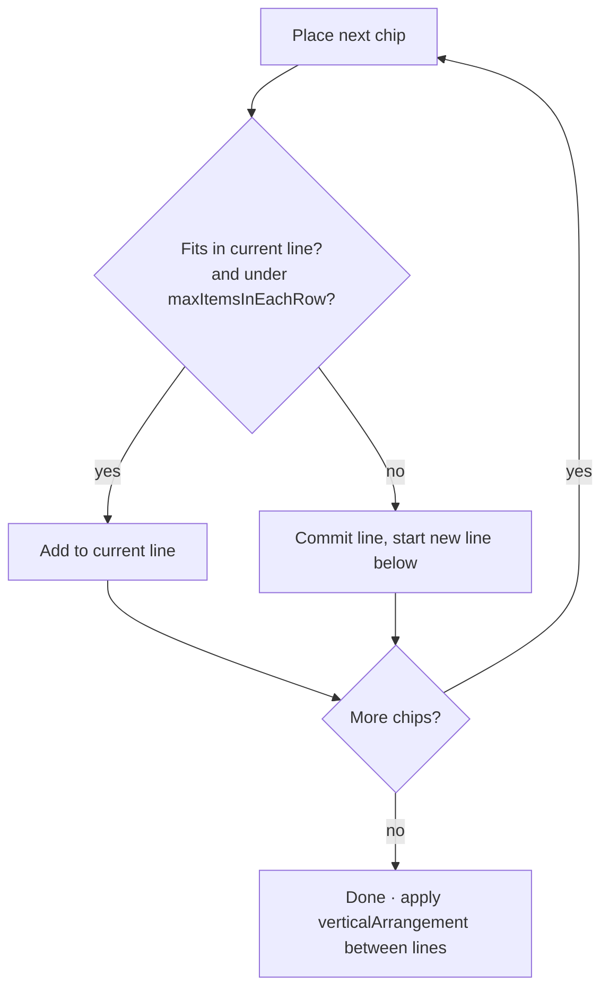
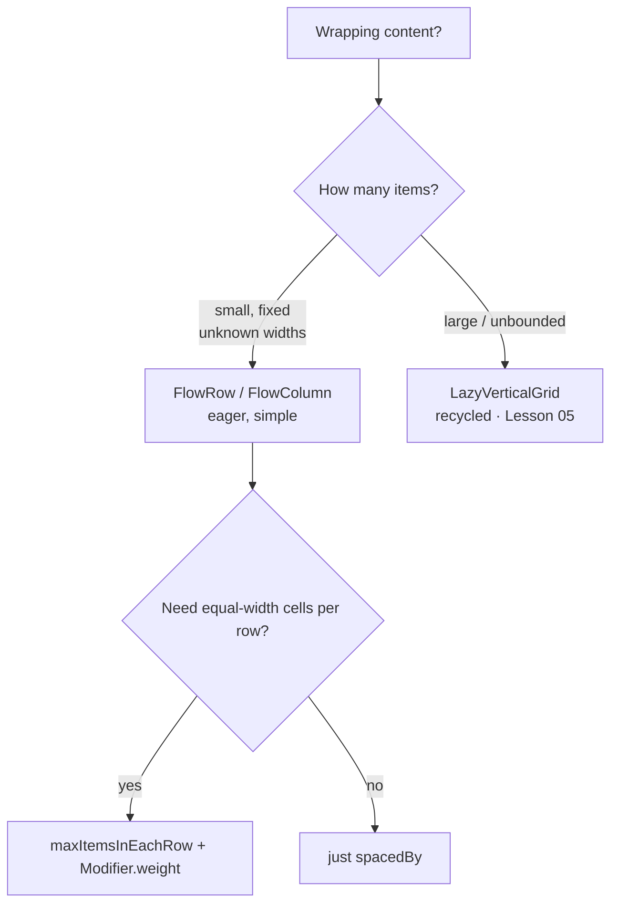

# Lesson 03 — Flow Layouts

> After this lesson you can build wrapping content like chip groups and tag clouds with `FlowRow`/`FlowColumn`, and control wrapping, spacing, and item width with `maxItemsInEachRow` and weighted flow items.

**Module:** 02 · **Lesson:** 03 · **Level:** 🟢🟡🔴 · **Est. time:** 50–65 min

---

## 1. Concept

### 🟢 For beginners — *what is it and why do I care?*

A plain `Row` puts all its children on **one line** — and if they don't fit, they overflow off the edge (or get clipped). But lots of UIs need content that **wraps onto the next line** when it runs out of room: a group of filter chips, a cloud of tags, a set of selectable interests. Type enough chips and they should flow down to a new line, like words wrapping in a paragraph.

That's what **`FlowRow`** does: it lays children left-to-right and, when the next child won't fit, **starts a new line** below. **`FlowColumn`** is the same idea rotated — top-to-bottom, then start a new *column* when full.

If you've used HTML/CSS, `FlowRow` is essentially `flex-wrap: wrap`. It's the tool for "I have N items of varying width and I don't know how many fit per line."

### 🟡 For intermediate devs — *the mechanism*

`FlowRow` and `FlowColumn` are **stable** Compose foundation APIs (they graduated out of the experimental `accompanist-flowlayout` library years ago — don't use Accompanist for this anymore). The key parameters:

- **`horizontalArrangement` / `verticalArrangement`** — `FlowRow` uses `horizontalArrangement` to space items *within* a line and `verticalArrangement` to space the *lines* themselves. (`FlowColumn` swaps them.) `Arrangement.spacedBy(8.dp)` on both is the typical chip-group setup.
- **`maxItemsInEachRow`** (`FlowRow`) / **`maxItemsInEachColumn`** (`FlowColumn`) — a hard cap on items per line, even if more would fit. `maxItemsInEachRow = 3` forces a 3-column grid-like wrap regardless of width.
- **`maxLines`** + **`overflow`** — limit how many lines render and show a `+N` indicator for the rest (e.g. `FlowRowOverflow.expandIndicator { ... }`), great for "show 2 rows of tags then a '+5 more' chip."
- **`Modifier.weight`** *inside the flow scope* — yes, flow items can be weighted. Within a single line, weighted items split that line's leftover space, letting you build responsive grids where each row fills the width.

Mental shape: it measures children one by one, keeps a running width for the current line, and when `currentLineWidth + nextChild > maxWidth` (or `maxItemsInEachRow` is hit), it commits the line and starts a new one.

### 🔴 For senior devs — *trade-offs, edges, internals*

- **`FlowRow` ≠ `LazyVerticalGrid`.** Flow layouts are **eager** — they measure and place **every** child, like `Row`/`Column`. For a fixed, small set (filter chips, a handful of tags) that's perfect. For *hundreds* of wrapping items, you want a lazy grid (Lesson 05) or you'll measure them all up front. Choose flow for *unknown width / known-small count*, lazy grids for *large or unbounded* collections.
- **`maxItemsInEachRow` gives you a "responsive grid" cheaply.** Combined with weighted items, `FlowRow(maxItemsInEachRow = 3) { repeat(n) { Item(Modifier.weight(1f)) } }` yields evenly-sized 3-per-row cells that wrap — without the ceremony of `LazyVerticalGrid`. The trade-off vs. a real grid: no item recycling, and the last partial row's items still expand to their weight share (which may or may not be what you want).
- **Item alignment within a line uses cross-axis arrangement.** Lines of different heights (a tall chip next to short ones) are aligned by the cross-axis setting; you can also align an individual item. Mismatched item heights are the usual "why is this chip floating?" cause — set a consistent item height or cross-axis alignment.
- **Overflow is composed, not clipped.** The `overflow` parameter (`FlowRowOverflow`/`FlowColumnOverflow`) lets you *reserve space* for a "+N" indicator and decide collapse/expand behavior — this is layout-aware truncation, not a `clipToBounds`. Reserving the indicator correctly (so it never itself gets pushed off) is the subtle part.
- **RTL just works.** Like `Row`, flow direction follows the layout direction; `start`/`end` arrangements flip in RTL locales automatically. Don't hardcode `Left`/`Right`.

### Analogy

**Words wrapping in a paragraph.** You type words left to right; when the next word won't fit, the line breaks and you continue below. You don't compute line breaks yourself — the text engine does, based on available width. `FlowRow` is that engine for *widgets*: chips are "words," the container width is the "page width," and wrapping is automatic. `maxItemsInEachRow` is like forcing a maximum number of words per line.

### Mental model

> **`FlowRow` is `flex-wrap` for composables:** lay out across, drop to a new line when full. Use it for wrapping content of *unknown width and small count*.

### Real-world example

A **filter sheet** in a shopping app: dozens of category chips (`Electronics`, `Home & Kitchen`, `Toys`…) of wildly different widths. A `FlowRow` with `spacedBy(8.dp)` wraps them into as many lines as needed, on any screen width, with no manual line-break logic. A "+12 more" expander appears when collapsed to 2 lines.

---

## 2. Visual Learning

**ASCII — Row overflow vs FlowRow wrap:**
```text
   Row (one line, overflows):          FlowRow (wraps):
   ┌────────────────────────┐ ╳        ┌────────────────────────┐
   │ [Electronics][Home][Toy│s][Ga…    │ [Electronics][Home]     │
   └────────────────────────┘          │ [Toys][Garden][Books]   │
        clipped / off-screen ──▶        │ [Sports]                │
                                        └────────────────────────┘
```

**Mermaid — the wrap decision per item:**


**Mermaid — flow vs lazy grid decision:**


**Illustration prompt:**
```text
Illustration: a tag cloud / chip group filling a rounded card. Pill-shaped chips of varying
widths labeled like "Electronics", "Home", "Toys", "Garden", "Books", "Sports", flowing left to
right and wrapping onto three lines, with even gaps. A faint dotted right-edge line shows where
wrapping is triggered, and one chip is mid-air "dropping" to the next line with a small curved
arrow labeled "wrap when it won't fit". A small "+5 more" chip sits at the end. Modern, vibrant,
clean labels, soft studio background. 16:9.
```

---

## 3. Code

### 🟢 Beginner — a wrapping chip group

```kotlin
@Composable
fun TagGroup(tags: List<String>) {
    FlowRow(
        horizontalArrangement = Arrangement.spacedBy(8.dp),  // gap between chips on a line
        verticalArrangement = Arrangement.spacedBy(8.dp),    // gap between wrapped lines
        modifier = Modifier.fillMaxWidth().padding(16.dp),
    ) {
        tags.forEach { tag ->
            AssistChip(onClick = {}, label = { Text(tag) })
        }
    }
}
```

**Explanation.** `FlowRow` lays chips left-to-right and wraps to a new line when the next chip won't fit the width. The two `spacedBy(8.dp)` values handle *both* the within-line gaps and the between-line gaps — no manual spacers, no clipping.

**Common mistakes.**
```kotlin
// ❌ Using a plain Row for content that can overflow → chips run off-screen / get clipped.
Row(horizontalArrangement = Arrangement.spacedBy(8.dp)) {
    tags.forEach { AssistChip(onClick = {}, label = { Text(it) }) }   // no wrapping!
}
// ❌ Reaching for the deprecated Accompanist FlowRow.
// com.google.accompanist.flowlayout.FlowRow  → removed; use androidx.compose.foundation.layout.FlowRow
```

**Best practices.**
- Use `FlowRow`/`FlowColumn` (from `androidx.compose.foundation.layout`) for any content that might not fit one line.
- Set **both** arrangements so within-line and between-line spacing match.

---

### 🟡 Intermediate — capping lines with a "+N more" overflow

```kotlin
@OptIn(ExperimentalLayoutApi::class)   // overflow indicators live behind this opt-in
@Composable
fun CollapsibleTags(tags: List<String>) {
    var expanded by remember { mutableStateOf(false) }

    FlowRow(
        horizontalArrangement = Arrangement.spacedBy(8.dp),
        verticalArrangement = Arrangement.spacedBy(8.dp),
        maxLines = if (expanded) Int.MAX_VALUE else 2,        // collapse to 2 lines
        overflow = FlowRowOverflow.expandIndicator {
            AssistChip(onClick = { expanded = true }, label = { Text("+${totalItemCount - shownItemCount} more") })
        },
        modifier = Modifier.fillMaxWidth().padding(16.dp),
    ) {
        tags.forEach { AssistChip(onClick = {}, label = { Text(it) }) }
    }
}
```

**Explanation.** `maxLines = 2` renders only two lines when collapsed; `FlowRowOverflow.expandIndicator { ... }` *reserves space* for a trailing chip and exposes `totalItemCount`/`shownItemCount` so you can show the exact remainder. Tapping it flips state to `Int.MAX_VALUE` lines (expanded). The indicator is part of layout, so it never gets clipped or pushed off.

**Common mistakes.**
- Truncating with `Modifier.height(...).clipToBounds()` instead of `maxLines` + `overflow` → chips are visually cut in half and there's no "+N" affordance.
- Forgetting the `@OptIn(ExperimentalLayoutApi::class)` for overflow indicators, then being surprised by the compile warning.

**Best practices.**
- Use `maxLines` + an `overflow` indicator for "show a few, expand for the rest" — it's layout-aware truncation.
- Derive the remainder from `totalItemCount - shownItemCount`, not a hand-counted constant.

---

### 🔴 Production — a responsive equal-width grid via `maxItemsInEachRow` + `weight`

```kotlin
/**
 * Evenly sized cells that wrap: N per row, each filling 1/N of the row width.
 * Great for a small, FIXED set (e.g. a quick-action grid). For large/unbounded
 * collections, prefer LazyVerticalGrid (Lesson 05) so items are recycled.
 */
@Composable
fun QuickActionsGrid(
    actions: List<QuickAction>,
    columns: Int = 3,
    modifier: Modifier = Modifier,
) {
    FlowRow(
        horizontalArrangement = Arrangement.spacedBy(12.dp),
        verticalArrangement = Arrangement.spacedBy(12.dp),
        maxItemsInEachRow = columns,             // hard cap → exactly `columns` per row
        modifier = modifier.fillMaxWidth().padding(16.dp),
    ) {
        actions.forEach { action ->
            ActionCell(
                action = action,
                // weight inside FlowRowScope: each item takes an equal share of its line's width.
                modifier = Modifier.weight(1f),
            )
        }
    }
}

@Composable
private fun ActionCell(action: QuickAction, modifier: Modifier = Modifier) {
    Surface(
        onClick = action.onClick,
        shape = MaterialTheme.shapes.large,
        tonalElevation = 2.dp,
        modifier = modifier.aspectRatio(1f),   // square cells regardless of width
    ) {
        Column(
            horizontalAlignment = Alignment.CenterHorizontally,
            verticalArrangement = Arrangement.Center,
            modifier = Modifier.fillMaxSize().padding(12.dp),
        ) {
            Icon(action.icon, contentDescription = null)
            Spacer(Modifier.height(8.dp))
            Text(action.label, style = MaterialTheme.typography.labelMedium, maxLines = 1, overflow = TextOverflow.Ellipsis)
        }
    }
}
```

**Explanation.** `maxItemsInEachRow = columns` forces exactly N per row; `Modifier.weight(1f)` on each cell makes them split that row's width equally, so the grid is **responsive** (cells grow/shrink with the screen) without a fixed `dp` cell width. `aspectRatio(1f)` keeps them square. This is the cheapest way to get an equal-width wrapping grid for a *small fixed* set — and the code openly flags when to graduate to `LazyVerticalGrid`.

**Common mistakes.**
- Using this pattern for **hundreds** of items → everything is measured/placed eagerly; use `LazyVerticalGrid`.
- A long label without `maxLines`/`overflow` → uneven cell heights break the grid alignment.
- Hardcoding cell width (`Modifier.width(120.dp)`) instead of `weight` → leaves ragged trailing gaps and doesn't adapt.

**Best practices.**
- `maxItemsInEachRow` + `weight(1f)` = responsive equal-width grid for **small, fixed** sets.
- Constrain label text (`maxLines`, `overflow`) so rows stay aligned.
- Graduate to `LazyVerticalGrid` (Lesson 05) the moment the collection is large or unbounded.

---

## 4. Interview Questions

**🟢 Beginner**

1. *What problem do `FlowRow`/`FlowColumn` solve that `Row`/`Column` don't?*
   > They **wrap** content onto a new line/column when it doesn't fit, instead of overflowing on a single line. Ideal for chip groups and tags of varying width.
2. *Which library do flow layouts come from in 2026?*
   > They're stable in `androidx.compose.foundation.layout` (`FlowRow`/`FlowColumn`). The old Accompanist flow layout is deprecated/removed — don't use it.

**🟡 Intermediate**

3. *How do you space items within a line vs. between wrapped lines in a `FlowRow`?*
   > `horizontalArrangement` spaces items *within* a line; `verticalArrangement` spaces the *lines*. For a chip group, set both to `Arrangement.spacedBy(8.dp)`.
4. *How would you show only two rows of tags with a "+N more" affordance?*
   > Set `maxLines = 2` and an `overflow = FlowRowOverflow.expandIndicator { ... }`, deriving the count from `totalItemCount - shownItemCount`. Tapping expands to `Int.MAX_VALUE` lines.

**🔴 Senior**

5. *When should you use `FlowRow` vs `LazyVerticalGrid`?*
   > `FlowRow` is **eager** — it measures every child — so it's right for a small, fixed set of wrapping items of unknown width. `LazyVerticalGrid` recycles items and is right for large or unbounded collections. Using `FlowRow` for hundreds of items measures them all up front and hurts performance.
6. *How do you build an equal-width responsive grid with flow layouts, and what's the catch?*
   > `FlowRow(maxItemsInEachRow = N) { items { Item(Modifier.weight(1f)) } }` — the cap fixes N per row and `weight(1f)` splits each row's width equally, so it adapts to screen size. The catch: no recycling, and items in a partially filled last row still expand to their weight share (which may look uneven). For large sets, use a lazy grid.

---

## 5. AI Assistant

**Prompt example (chip group with overflow):**
```text
Build a Compose chip group that wraps using FlowRow with 8dp spacing between chips and between
lines. Collapse to 2 lines by default with a "+N more" expander chip that reveals the rest on tap.
Use the stable androidx FlowRow (NOT Accompanist) and FlowRowOverflow.expandIndicator. Target:
Compose 2026 BOM, Material 3, Kotlin 2.x.
```

**AI workflow.**
- ✅ Good for: generating chip/tag groups, the `maxItemsInEachRow` + `weight` responsive-grid pattern, the collapse/expand overflow wiring.
- ⚠️ Watch: older models still emit **Accompanist `FlowRow`** (deprecated), forget the `verticalArrangement` (so wrapped lines touch), and reach for `FlowRow` where a **`LazyVerticalGrid`** is the right call.

**Review workflow — map to *Common Mistakes*:**
- Is it the **androidx** `FlowRow`, not `com.google.accompanist.flowlayout`?
- Both `horizontalArrangement` *and* `verticalArrangement` set (no touching lines)?
- For large collections, did it (wrongly) use `FlowRow` instead of `LazyVerticalGrid`?
- Truncation via `maxLines` + `overflow`, not `clipToBounds`?

**Validation workflow:**
1. **Preview** with few and many chips, at compact and expanded widths — confirm wrapping and that the "+N" count is correct.
2. Resize the window/foldable — the same chips should re-flow into more/fewer lines.
3. If you used the grid pattern, check the last (partial) row isn't awkwardly stretched; if it is, reconsider a lazy grid.

> **AI drafts, you decide.** If the model imports Accompanist flow layout or uses `FlowRow` for an infinite feed, swap to the androidx API or a lazy grid before merging.

---

## Recap / Key takeaways

- **`FlowRow`/`FlowColumn`** wrap children onto new lines/columns — `flex-wrap` for composables — and are **stable** in `androidx.compose.foundation.layout` (not Accompanist).
- Set **both** arrangements: one for within-line spacing, one for between-line spacing.
- `maxLines` + `overflow` (`expandIndicator`) gives layout-aware "+N more" truncation.
- `maxItemsInEachRow` + `Modifier.weight(1f)` builds a **responsive equal-width grid** for small fixed sets.
- Flow layouts are **eager** — use them for small/unknown-width sets; reach for `LazyVerticalGrid` (Lesson 05) for large collections.

➡️ Next: **[Lesson 04 — Lazy lists](04-lazy-lists.md)** — `LazyColumn`/`LazyRow`, keys, `contentType`, and the item DSL for large collections.
