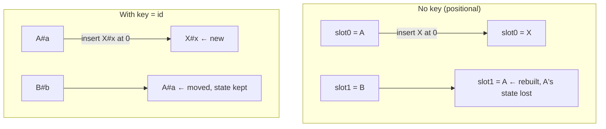
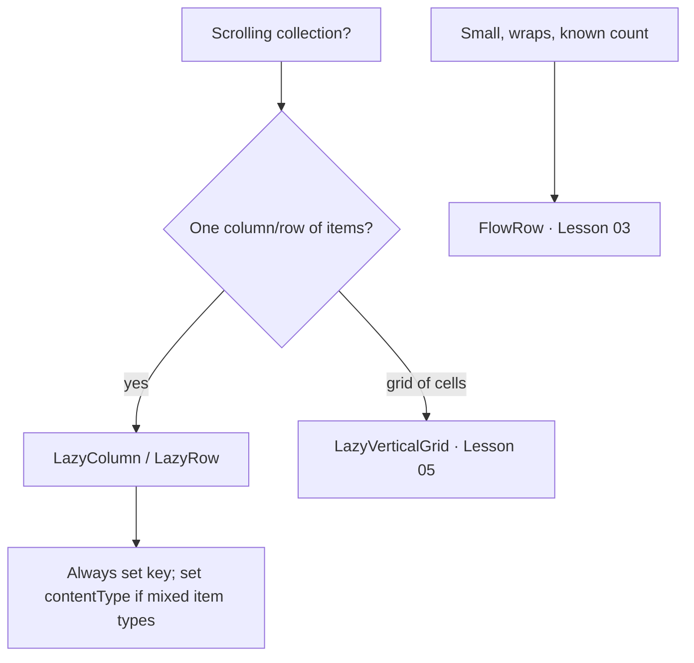

# Lesson 04 — Lazy Lists

> After this lesson you can build performant scrolling lists with `LazyColumn`/`LazyRow`, use the item DSL, and apply **keys** and **`contentType`** so recomposition and recycling stay cheap.

**Module:** 02 · **Lesson:** 04 · **Level:** 🟢🟡🔴 · **Est. time:** 75–90 min

---

## 1. Concept

### 🟢 For beginners — *what is it and why do I care?*

A `Column` with `verticalScroll` measures and lays out **every** child up front. Ten items? Fine. Ten *thousand* items (a chat history, a product feed)? You just built and held ten thousand composables in memory — slow to open, heavy to scroll. That's the problem **lazy lists** solve.

**`LazyColumn`** (vertical) and **`LazyRow`** (horizontal) only build the items that are **currently on screen** (plus a small buffer). Scroll down, and items that leave the top are **recycled** to render the ones entering the bottom. A 10,000-item feed costs about the same as a 10-item one, because only ~10 are alive at any moment.

It's the Compose equivalent of `RecyclerView` from the View world — but you don't write an adapter or a `ViewHolder`. You describe items with a small DSL:

```kotlin
LazyColumn {
    items(products) { product -> ProductRow(product) }
}
```

### 🟡 For intermediate devs — *the mechanism*

Inside a `LazyColumn`/`LazyRow` you're in a **`LazyListScope`**, which is a *DSL*, **not** regular composition. You don't write composables directly in the block — you call slot functions that *describe* items:

- **`item { … }`** — a single item (a header, a footer).
- **`items(list) { item -> … }`** — one composable per element.
- **`itemsIndexed(list) { index, item -> … }`** — same, with the index.
- **`stickyHeader { … }`** — a header that pins to the top while its section scrolls.

Two parameters on `items(...)` are the difference between a smooth list and a janky one:

- **`key = { it.id }`** — a **stable, unique identity** per item. With keys, Compose can track an item across data changes: if you insert at the top, it *moves* existing items instead of rebuilding them; scroll position and item state (a half-typed text field, an animation) stay attached to the right item. Without keys, Compose falls back to **positional** identity — insert at index 0 and *every* item below shifts identity, causing wrong-state bugs and lost scroll position.
- **`contentType = { it.type }`** — tells Compose which items are **structurally the same shape** so it can recycle a scrolled-off item's composition for a new item *of the same type*. In a mixed feed (text posts, image posts, ads), giving each a `contentType` lets Compose reuse the right kind of slot instead of rebuilding from scratch.

You also get a hoistable **`rememberLazyListState()`** to observe/scroll programmatically (`scrollToItem`, `animateScrollToItem`, read `firstVisibleItemIndex`), and a `contentPadding` parameter to pad the *content* (so the first/last item isn't jammed against the edge) without clipping the scroll.

### 🔴 For senior devs — *trade-offs, edges, internals*

- **Keys are correctness, not just performance.** The classic bug: an item owns local UI state (an expanded toggle, a `rememberSaveable` text field). Without a `key`, that state is bound to the *slot index*. Delete item 2 and item 3 slides up into slot 2 — inheriting item 2's old expanded state. With a stable `key`, state follows the *item*. Keys must be **stable** (don't use the list index as the key — that defeats the entire point) and **unique** (duplicate keys throw at runtime).
- **`contentType` drives composition reuse.** When an item scrolls off, its node can be reused for an incoming item — but only meaningfully if they're the same *type* of layout. Default (`null`) content type means "every item is the same kind," which is wrong for heterogeneous feeds and forces full re-creation. Setting `contentType` is a real, measurable win on mixed lists (it improves the pool hit rate).
- **Don't put a `LazyColumn` inside a vertically-scrolling parent.** Same-axis nesting hands the lazy list **infinite height** (Lesson 01), which defeats laziness — it tries to compose *all* items. Either make the whole screen one `LazyColumn` (use `item {}` for the non-list header content) or give the inner list a **bounded** height. This is the #1 lazy-list anti-pattern.
- **`Modifier.fillParentMaxSize()` exists for a reason.** Inside `LazyItemScope`, `fillMaxSize` refers to the *item's* constraints, not the viewport. To make an empty-state item fill the **viewport**, use `Modifier.fillParentMaxSize()`.
- **Stability of the item lambda matters.** With **Strong Skipping** (2026 default) most lambdas are auto-remembered, but passing **unstable** data (a plain `List` field flagged unstable, a non-`@Immutable` model) into item content can still force needless recomposition. Prefer `kotlinx.collections.immutable` (`ImmutableList`) for list params and `@Immutable`/`data class` models (Module 11/12).
- **`key` block runs in the DSL, not composition.** The `key`/`contentType` lambdas are evaluated while building the layout info — keep them **cheap and pure** (read an existing id; don't compute hashes of large objects or allocate).
- **Animation & scroll APIs are first-class.** `Modifier.animateItem()` (the current API; the older `animateItemPlacement()` is deprecated) animates insertions/removals/moves — *but only works with stable keys*. Paging integrates via `collectAsLazyPagingItems()` + `items(count = …, key = …)`.

### Analogy

**A sushi conveyor belt.** The kitchen (your data) has hundreds of plates, but only the few in front of *you* are on the belt at any moment. As a plate passes out of reach, the belt slot comes back around to carry a new plate (recycling). A **key** is the little flag on each plate that says "this is *the salmon you ordered*" — so even if the kitchen reorders the queue, your salmon stays *your* salmon and doesn't get swapped for someone's tuna. `contentType` is the *shape* of the plate (small dish vs. large bowl) so the belt reuses the right kind of slot.

### Mental model

> **Lazy lists build only what's visible and recycle the rest.** A **`key`** keeps each item's identity (and state) stable across data changes; **`contentType`** lets different item shapes reuse each other's slots.

### Real-world example

A **chat screen**: thousands of messages in a `LazyColumn`. `key = { it.id }` so when a new message arrives at the bottom, existing messages don't rebuild and the scroll position holds. `contentType` distinguishes text bubbles, image bubbles, and date separators so each reuses its own kind of slot. `rememberLazyListState()` drives "scroll to newest" and a "jump to unread" button.

---

## 2. Visual Learning

**ASCII — only the visible window is composed:**
```text
   data: [0][1][2][3][4][5][6][7][8] ... [9999]
                 ┌───────────── viewport ─────────────┐
   composed:     │ [3] [4] [5] [6] [7] │  (+ small buffer above/below)
                 └─────────────────────┘
   scroll ↓  →   [3] recycled at top ──▶ becomes [8] entering at bottom
   keys keep state attached: [5]'s expanded toggle stays with item id=5, not slot index.
```

**Mermaid — keyed vs positional identity when inserting at the top:**


**Mermaid — choosing list vs grid vs flow:**


**Illustration prompt:**
```text
Illustration: a sushi conveyor belt curving through a restaurant. Only 5 plates are on the visible
belt segment in front of a seated diner; behind a doorway labeled "data (10,000 plates)" a huge
stack waits. Each visible plate has a small flag labeled with an id ("#42", "#43"...). An arrow
shows a plate leaving the right edge and the empty slot returning on the left to carry a new plate,
labeled "recycle". One flag is highlighted: "key keeps THIS item's identity & state". Modern,
vibrant, clean labels, soft lighting. 16:9.
```

---

## 3. Code

### 🟢 Beginner — your first lazy list

```kotlin
@Composable
fun ProductList(products: List<Product>) {
    LazyColumn(
        contentPadding = PaddingValues(16.dp),               // inset content from edges
        verticalArrangement = Arrangement.spacedBy(8.dp),    // gap between items
    ) {
        items(
            items = products,
            key = { it.id },                                 // ✅ stable identity per item
        ) { product ->
            ProductRow(product)
        }
    }
}
```

**Explanation.** `LazyColumn` composes only the visible product rows. `items(..., key = { it.id })` gives each row a stable identity so inserts/removes/reorders are tracked correctly. `contentPadding` insets the *content* (the first item isn't glued to the top) while still letting items scroll under the padding. `spacedBy` handles inter-item gaps.

**Common mistakes.**
```kotlin
// ❌ A "long list" built eagerly in a scrolling Column → all items measured up front.
Column(Modifier.verticalScroll(rememberScrollState())) {
    products.forEach { ProductRow(it) }     // 10k composables alive at once
}
// ❌ No key → positional identity → lost scroll position & wrong item state on insert.
items(products) { ProductRow(it) }
```

**Best practices.**
- Long/unbounded list → `LazyColumn`/`LazyRow`, never a scrolling `Column`/`Row`.
- **Always** pass `key` when items have a stable id.
- Pad with `contentPadding`, not an outer `Modifier.padding` that would clip the scroll edges.

---

### 🟡 Intermediate — mixed item types, headers, and `contentType`

```kotlin
sealed interface FeedItem {
    data class Header(val title: String) : FeedItem
    data class Post(val id: String, val body: String) : FeedItem
    data class Ad(val id: String, val campaign: String) : FeedItem
}

@OptIn(ExperimentalFoundationApi::class)   // stickyHeader opt-in
@Composable
fun Feed(items: List<FeedItem>, state: LazyListState = rememberLazyListState()) {
    LazyColumn(state = state, contentPadding = PaddingValues(vertical = 8.dp)) {
        items.forEach { item ->
            when (item) {
                is FeedItem.Header -> stickyHeader { SectionHeader(item.title) }
                is FeedItem.Post -> item(
                    key = item.id,
                    contentType = "post",          // ✅ posts recycle with posts
                ) { PostCard(item) }
                is FeedItem.Ad -> item(
                    key = item.id,
                    contentType = "ad",            // ✅ ads recycle with ads, not posts
                ) { AdCard(item) }
            }
        }
    }
}
```

**Explanation.** A heterogeneous feed: `stickyHeader` pins section titles; each post/ad declares a `contentType` so Compose reuses a scrolled-off *post's* slot for a new *post* (and likewise for ads) instead of rebuilding a different layout. `rememberLazyListState()` is hoisted so a parent can scroll or observe position.

**Common mistakes.**
```kotlin
// ❌ Heavy work inside the key/contentType lambda — these run while building layout info.
items(posts, key = { expensiveHash(it) }) { ... }   // recomputed often; keep keys cheap
// ❌ Same contentType (or none) for structurally different items → poor reuse, full rebuilds.
```
- Building items by iterating with a `for`/`forEach` that calls `item {}` but **forgetting keys** on each branch.
- Using `stickyHeader` without the opt-in (compile warning) — and remember sticky headers need the section items to follow in the list.

**Best practices.**
- Give each *shape* of item a distinct `contentType`; keep `key`/`contentType` lambdas **cheap and pure**.
- Hoist `LazyListState` when you need to scroll programmatically or react to scroll.
- Use `stickyHeader` for section titles rather than faking pinned headers with offsets.

---

### 🔴 Production — keyed list with item animation, empty state, and immutable data

```kotlin
@Composable
fun TaskList(
    state: TaskListUiState,
    onToggle: (String) -> Unit,
    listState: LazyListState = rememberLazyListState(),
    modifier: Modifier = Modifier,
) {
    when {
        state.isLoading -> LoadingList(modifier)                 // skeleton placeholders
        state.tasks.isEmpty() -> EmptyState(modifier)            // dedicated empty UI
        else -> LazyColumn(
            state = listState,
            contentPadding = PaddingValues(16.dp),
            verticalArrangement = Arrangement.spacedBy(8.dp),
            modifier = modifier.fillMaxSize(),
        ) {
            items(
                items = state.tasks,                 // ImmutableList<Task> (kotlinx.collections.immutable)
                key = { it.id },                     // stable identity → state + animations track the item
                contentType = { it.kind },           // e.g. NORMAL vs MILESTONE rows reuse correctly
            ) { task ->
                TaskRow(
                    task = task,
                    onToggle = { onToggle(task.id) },
                    // animateItem(): smoothly animates insert/remove/move — requires stable keys.
                    modifier = Modifier.animateItem(),
                )
            }
        }
    }
}

@Composable
private fun EmptyState(modifier: Modifier = Modifier) {
    Box(modifier.fillMaxSize(), contentAlignment = Alignment.Center) {
        Text("No tasks yet — add one to get started.", style = MaterialTheme.typography.bodyLarge)
    }
}
```

```kotlin
// State model — immutable list type keeps the item content skippable (Module 11/12).
data class TaskListUiState(
    val tasks: ImmutableList<Task> = persistentListOf(),
    val isLoading: Boolean = false,
)
```

**Explanation.** Production lists handle **loading / empty / content** explicitly (no blank screen). The list uses stable `key`s — which is also what makes `Modifier.animateItem()` animate inserts/removes/moves correctly — and `contentType` for reuse across row kinds. The data is an `ImmutableList`, so the item lambda stays skippable under Strong Skipping. `onToggle` is hoisted (Module 03 discipline), so `TaskRow` is stateless and testable.

**Common mistakes.**
```kotlin
// ❌ animateItem() WITHOUT keys → Compose can't match items across frames; animation is wrong/janky.
items(tasks) { TaskRow(it, modifier = Modifier.animateItem()) }
// ❌ Using the list index as the key → identity reshuffles on every insert; defeats keys entirely.
items(tasks, key = { tasks.indexOf(it) }) { ... }
// ❌ Passing a mutable/unstable List into item content → forces recomposition of rows.
```
- Calling `fillMaxSize()` for an empty-state *item* expecting it to fill the viewport — inside `LazyItemScope` use `fillParentMaxSize()`.
- Nesting this `LazyColumn` inside another vertical scroller (infinite height → laziness lost).

**Best practices.**
- Stable, unique `key`s are mandatory for correct **state retention** and **item animations**.
- Model list params as `ImmutableList`; models as `@Immutable`/`data class` for skippability.
- Render explicit **loading/empty/content** states; use `fillParentMaxSize()` for viewport-filling items.
- Keep rows **stateless** (hoist events), so the list stays testable and recomposition-light.

---

## 4. Interview Questions

**🟢 Beginner**

1. *Why use `LazyColumn` instead of a `Column` with `verticalScroll` for a long list?*
   > `LazyColumn` only composes the items currently visible (plus a buffer) and recycles the rest, so cost is roughly constant regardless of list size. A scrolling `Column` builds and holds *every* child, which is slow and memory-heavy for long lists.
2. *How do you add items to a `LazyColumn`?*
   > Inside the `LazyListScope` block, use the DSL: `item { }` for one, `items(list) { }` / `itemsIndexed(list) { }` for many. You don't write composables directly — you describe items via these slots.

**🟡 Intermediate**

3. *What does the `key` parameter do and why does it matter?*
   > It gives each item a **stable identity**. With keys, Compose tracks items across data changes — moving rather than rebuilding on insert, preserving scroll position and per-item state. Without keys it uses positional identity, so inserting at the top reshuffles every item's identity and can bind state to the wrong item.
4. *What is `contentType` for?*
   > It labels items by **structural shape** so Compose can recycle a scrolled-off item's composition for an incoming item *of the same type*. In a mixed list (posts, ads, headers), distinct content types improve reuse instead of rebuilding different layouts from scratch.

**🔴 Senior**

5. *A list item has an expanding section; after deleting an item, the wrong rows appear expanded. Diagnose.*
   > The items lack stable `key`s, so per-item state is bound to the **slot index**. Deleting an item slides others up into its slot, inheriting its expanded state. Fix: pass `key = { it.id }` so state follows the item identity, not the position. (Never use the index as the key.)
6. *Why does `Modifier.animateItem()` require keys, and what's its relationship to `contentType`?*
   > `animateItem()` animates an item's appearance/disappearance/move, which requires matching the *same* item across frames — only possible with stable `key`s; without them Compose can't tell what moved. `contentType` is orthogonal: it governs *composition reuse* across different item shapes, improving the recycle pool. Keys = identity/animation; contentType = reuse efficiency.

---

## 5. AI Assistant

**Prompt example (mixed feed):**
```text
Build a LazyColumn for a heterogeneous feed of sealed FeedItem (Header, Post, Ad). Use stickyHeader
for headers, set a stable key on every Post/Ad, and a distinct contentType per item shape. Hoist a
LazyListState. Model the list param as kotlinx.collections.immutable ImmutableList. Add explicit
loading and empty states. Use Modifier.animateItem() for inserts/removes. Target: Compose 2026 BOM,
Material 3, Kotlin 2.x.
```

**AI workflow.**
- ✅ Good for: the `LazyListScope` DSL, sticky headers, scaffolding loading/empty/content branches, paging wiring.
- ⚠️ Watch: models routinely **omit `key`s**, use the **index as a key**, skip `contentType` on mixed lists, use the **deprecated `animateItemPlacement()`**, and nest a `LazyColumn` inside a `verticalScroll`.

**Review workflow — map to *Common Mistakes*:**
- Does every `items(...)` have a **stable, unique `key`** (an id, not an index)?
- Mixed item shapes → distinct `contentType`?
- `animateItem()` (current) rather than `animateItemPlacement()` (deprecated), *with* keys?
- List param typed as `ImmutableList`; rows stateless (events hoisted)?
- No `LazyColumn` nested in a same-axis scroller?

**Validation workflow:**
1. **Run & insert/delete** items at the top — scroll position should hold and the right items animate.
2. Toggle an item's expand state, then delete a sibling — confirm the toggle stays with the correct item (proves keys work).
3. Enable **Layout Inspector → recomposition counts**; scroll and confirm only entering/leaving items recompose, not the whole list.
4. Profile a long list (Macrobenchmark, Module 11) before/after adding `contentType` on a mixed feed.

> **AI drafts, you decide.** If the model's list "works" but omits keys, it's a latent state/scroll bug — add keys before you trust it.

---

## Recap / Key takeaways

- **`LazyColumn`/`LazyRow`** compose only visible items and recycle the rest — constant cost for huge lists.
- Build items with the **DSL**: `item`, `items`, `itemsIndexed`, `stickyHeader` — not direct composables.
- **`key`** = stable identity → correct state retention, preserved scroll position, and working `animateItem()`. Never use the index.
- **`contentType`** lets different item shapes reuse slots — a real win on mixed feeds.
- Don't nest a lazy list in a **same-axis** scroller; use `fillParentMaxSize()` for viewport-filling items; type list params as `ImmutableList`.

➡️ Next: **[Lesson 05 — Lazy grids & staggered grids](05-lazy-grids.md)** — `LazyVerticalGrid` and `LazyVerticalStaggeredGrid` for 2-D collections.
