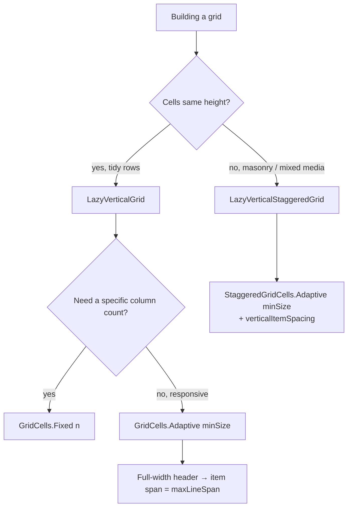
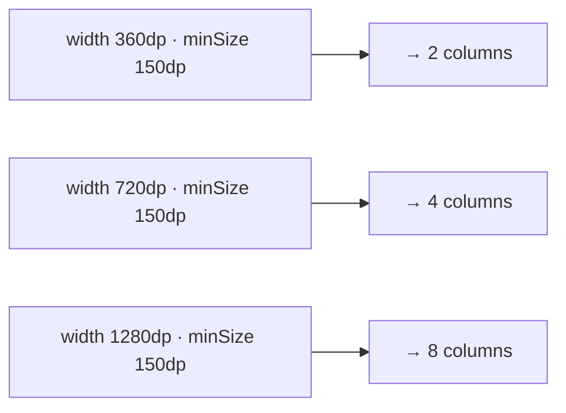

# Lesson 05 — Lazy Grids & Staggered Grids

> After this lesson you can build 2-D scrolling collections with `LazyVerticalGrid` and Pinterest-style `LazyVerticalStaggeredGrid`, choosing the right cell strategy and spanning items across columns.

**Module:** 02 · **Lesson:** 05 · **Level:** 🟢🟡🔴 · **Est. time:** 60–75 min

---

## 1. Concept

### 🟢 For beginners — *what is it and why do I care?*

A `LazyColumn` gives you **one** item per row. But photo galleries, product catalogs, and app drawers want a **grid** — multiple items per row, wrapping into a scrolling 2-D arrangement. That's **`LazyVerticalGrid`**.

It's lazy just like `LazyColumn` (only visible cells are composed and recycled), but it arranges items into **columns**. You tell it how many columns you want, and it flows items left-to-right, top-to-bottom.

There are two flavors:

- **`LazyVerticalGrid`** — a *uniform* grid: every cell in a row has the **same height** (rows are as tall as their tallest cell). Think a clean product grid.
- **`LazyVerticalStaggeredGrid`** — a *masonry* grid: cells keep their **own** height and items pack into the shortest column, like Pinterest. Think a photo wall with mixed aspect ratios.

(Horizontal versions exist too: `LazyHorizontalGrid` and `LazyHorizontalStaggeredGrid`.)

### 🟡 For intermediate devs — *the mechanism*

The defining parameter is **how columns are sized**, via the `columns` argument:

- **`GridCells.Fixed(n)`** — exactly `n` columns; each is `(width − spacing) / n`. Use when you want a precise column count (e.g. 2 on phone).
- **`GridCells.Adaptive(minSize = 120.dp)`** — *as many columns as fit* at the given minimum width, then each grows to share the leftover. This is the **responsive** choice: 2 columns on a phone, 4 on a tablet, automatically — no `WindowSizeClass` branching needed for the simple case.
- **`GridCells.FixedSize(100.dp)`** — fixed-width cells, with leftover space distributed as spacing.

The item DSL mirrors lazy lists, with grid-specific spanning:

- `items(list, key = …, contentType = …) { … }` — same as `LazyColumn`.
- **`item(span = { GridItemSpan(maxLineSpan) })`** — make an item span the **full width** (a section header inside a grid). `maxLineSpan` is the current column count, so this works regardless of `Fixed`/`Adaptive`.
- `horizontalArrangement` / `verticalArrangement` — spacing between columns and rows (e.g. `spacedBy(8.dp)`).

For the staggered grid, `columns` is `StaggeredGridCells.Fixed/Adaptive`, plus `verticalItemSpacing` for the gap between stacked items in a column.

### 🔴 For senior devs — *trade-offs, edges, internals*

- **`Adaptive` vs `WindowSizeClass`.** `GridCells.Adaptive(minSize)` solves *column count* purely from available width — elegant and local. But it only decides *columns*; it can't restructure *navigation* or switch to a list-detail layout. Use `Adaptive` for the grid itself; use Window Size Classes (Lesson 07) for *screen architecture*. They compose: an adaptive grid living inside the detail pane of an adaptive layout.
- **Keys and `contentType` matter even more here.** A grid often mixes spanned headers with regular cells — distinct `contentType`s keep reuse correct, and stable `key`s preserve state/scroll exactly as in Lesson 04. The same "never use the index as a key" rule applies.
- **Uniform vs staggered is a real performance/UX trade.** `LazyVerticalGrid` rows align to the tallest cell, which can leave whitespace but makes measurement simpler. `LazyVerticalStaggeredGrid` packs by shortest column — beautiful for mixed media, but item heights must be **deterministic from data** (e.g. known aspect ratios) or the layout reflows as images load, causing jumps. Reserve space with `Modifier.aspectRatio(...)` from the item's known ratio to avoid the "content jump on image load" jank.
- **Spanning is line-relative.** `GridItemSpan(maxLineSpan)` spans the whole width *today*; hardcoding `GridItemSpan(2)` breaks when an `Adaptive` grid shows 4 columns. Always span relative to `maxLineSpan`/`maxCurrentLineSpan`.
- **Nested scroll & infinite height.** Like any lazy container, a grid inside a same-axis scroller gets unbounded constraints and loses laziness (Lesson 01). Make the grid the scroll container, using full-width spanned `item {}`s for headers/content above it.
- **Staggered grids don't support sticky headers (yet)** and have subtler item-placement animation support than `LazyVerticalGrid`/`LazyColumn`. Verify against your BOM if you depend on those.
- **Min cell size is a contract, not a wish.** `Adaptive(120.dp)` guarantees each column is *at least* 120dp; on a 360dp phone that's 2 columns (360/120 = 3, but spacing eats into it → often 2). Pick `minSize` from your *content's* legibility floor, not an arbitrary number.

### Analogy

**A bookshelf vs. a stone wall.** `LazyVerticalGrid` is a **bookshelf**: every shelf (row) is the same height, books line up neatly, some shelves have a little headroom. `LazyVerticalStaggeredGrid` is a **dry-stone wall**: stones (items) of different sizes are fitted into whichever gap they fill best, packing tightly with no uniform row line. `GridCells.Adaptive` is telling the carpenter "make as many equal columns as fit, each at least this wide," instead of fixing the count yourself.

### Mental model

> **Grids are lazy lists in 2-D.** `Fixed(n)` = exact columns; `Adaptive(minSize)` = as many as fit (responsive). Uniform grid = equal-height rows; staggered = pack by shortest column.

### Real-world example

A **photos tab**: `LazyVerticalStaggeredGrid(StaggeredGridCells.Adaptive(160.dp))` shows images at their natural aspect ratios, packing tightly like Pinterest, with 2–5 columns depending on device width. A **store catalog** instead uses `LazyVerticalGrid(GridCells.Adaptive(150.dp))` for tidy, equal-height product cards, with a full-width spanned "On sale" header (`GridItemSpan(maxLineSpan)`).

---

## 2. Visual Learning

**ASCII — uniform grid vs staggered grid:**
```text
   LazyVerticalGrid (Fixed 2)        LazyVerticalStaggeredGrid (2 cols)
   equal-height rows                 packs into the shortest column
   ┌────────┬────────┐               ┌────────┬────────┐
   │  [A]   │  [B]   │               │  [A]   │  [B]   │
   │        │        │               │        │        │
   ├────────┼────────┤               │        ├────────┤
   │  [C]   │  [D]   │               ├────────┤  [D]   │
   │        │        │               │  [C]   │        │
   └────────┴────────┘               │        ├────────┤
   row height = tallest cell         └────────┤  [E]   │  ← E went under the shorter column
                                              └────────┘
```

**Mermaid — choosing the cell strategy:**


**Mermaid — how Adaptive picks column count:**


**Illustration prompt:**
```text
Illustration: a split-screen comparison. Left half labeled "Uniform grid (LazyVerticalGrid)": a tidy
2-column bookshelf with equal-height rounded cards, faint horizontal shelf lines, a little headroom
above shorter content. Right half labeled "Staggered (LazyVerticalStaggeredGrid)": a Pinterest-style
masonry wall of cards with different heights packed tightly into the shortest column, no shelf lines.
A small badge over both reads "GridCells.Adaptive → 2 cols on phone, 4 on tablet". Modern, vibrant,
clean labels, soft studio background. 16:9.
```

---

## 3. Code

### 🟢 Beginner — a responsive photo grid

```kotlin
@Composable
fun PhotoGrid(photos: List<Photo>) {
    LazyVerticalGrid(
        columns = GridCells.Adaptive(minSize = 120.dp),     // as many ≥120dp columns as fit
        contentPadding = PaddingValues(8.dp),
        horizontalArrangement = Arrangement.spacedBy(8.dp), // gap between columns
        verticalArrangement = Arrangement.spacedBy(8.dp),   // gap between rows
    ) {
        items(photos, key = { it.id }) { photo ->
            AsyncImage(
                model = photo.url,
                contentDescription = photo.caption,
                contentScale = ContentScale.Crop,
                modifier = Modifier
                    .aspectRatio(1f)                        // square cells regardless of column width
                    .clip(MaterialTheme.shapes.medium),
            )
        }
    }
}
```

**Explanation.** `GridCells.Adaptive(120.dp)` makes the grid **responsive**: it fits as many ≥120dp columns as the width allows (2 on a phone, more on a tablet) and grows them to fill — no manual breakpoints. `aspectRatio(1f)` keeps cells square so rows stay uniform. Stable `key`s keep scroll/state correct (Lesson 04).

**Common mistakes.**
```kotlin
// ❌ Hardcoding the column count regardless of device → 2 columns even on a wide tablet.
LazyVerticalGrid(columns = GridCells.Fixed(2)) { ... }   // fine on phone, wasteful on tablet
// ❌ No aspectRatio on image cells → rows jump as images load at unknown sizes.
```

**Best practices.**
- Prefer `GridCells.Adaptive(minSize)` for responsiveness; reach for `Fixed(n)` only when the count is a hard design requirement.
- Reserve cell size with `aspectRatio` so layout doesn't reflow as images load.
- Always set `key` (and `contentType` if cells vary).

---

### 🟡 Intermediate — spanned headers inside a grid

```kotlin
@Composable
fun CatalogGrid(sections: List<CatalogSection>) {
    LazyVerticalGrid(
        columns = GridCells.Adaptive(minSize = 150.dp),
        contentPadding = PaddingValues(12.dp),
        horizontalArrangement = Arrangement.spacedBy(12.dp),
        verticalArrangement = Arrangement.spacedBy(12.dp),
    ) {
        sections.forEach { section ->
            // Full-width header: span ALL columns, whatever the current count is.
            item(
                span = { GridItemSpan(maxLineSpan) },        // ✅ relative to current column count
                key = "header-${section.id}",
                contentType = "header",
            ) {
                Text(section.title, style = MaterialTheme.typography.titleMedium)
            }

            items(
                items = section.products,
                key = { it.id },
                contentType = { "product" },
            ) { product ->
                ProductCard(product)
            }
        }
    }
}
```

**Explanation.** Inside a single `LazyVerticalGrid`, a section header uses `span = { GridItemSpan(maxLineSpan) }` to stretch across **all** columns, while the products below flow normally. Because the span is `maxLineSpan` (the *current* column count), it stays full-width whether the adaptive grid shows 2 or 6 columns. Distinct `contentType`s ("header" vs "product") keep recycling correct.

**Common mistakes.**
```kotlin
// ❌ Hardcoded span breaks on adaptive grids: spans 2 of 5 columns on a tablet.
item(span = { GridItemSpan(2) }) { Header() }
// ❌ Faking a header with a separate LazyColumn above the grid → nested scroll / two scroll areas.
```

**Best practices.**
- Span full-width items with `GridItemSpan(maxLineSpan)`, never a hardcoded number.
- Keep headers *inside* the grid via spanned `item {}` — don't stack a separate scroller above it.
- Give headers their own `contentType`.

---

### 🔴 Production — a staggered masonry grid that doesn't jump on load

```kotlin
@Composable
fun MasonryFeed(
    items: ImmutableList<MediaItem>,           // immutable for skippability (Module 11/12)
    onOpen: (String) -> Unit,
    state: LazyStaggeredGridState = rememberLazyStaggeredGridState(),
    modifier: Modifier = Modifier,
) {
    LazyVerticalStaggeredGrid(
        columns = StaggeredGridCells.Adaptive(minSize = 160.dp),
        state = state,
        contentPadding = PaddingValues(8.dp),
        horizontalArrangement = Arrangement.spacedBy(8.dp),
        verticalItemSpacing = 8.dp,             // gap between stacked items in a column
        modifier = modifier.fillMaxSize(),
    ) {
        items(
            items = items,
            key = { it.id },
            contentType = { it.kind },          // photo vs video vs text card reuse correctly
        ) { media ->
            MediaCard(
                media = media,
                onClick = { onOpen(media.id) },
                // Reserve the cell's height from the KNOWN aspect ratio → no reflow when the image loads.
                modifier = Modifier.aspectRatio(media.aspectRatio),
            )
        }
    }
}
```

**Explanation.** The staggered grid packs items into the shortest column for a Pinterest look. The key robustness move: each card sets `Modifier.aspectRatio(media.aspectRatio)` from a ratio **known in the data**, so the layout reserves correct heights *before* images load — eliminating the masonry "everything jumps when a photo decodes" jank. `Adaptive(160.dp)` makes column count responsive; `verticalItemSpacing` handles the vertical gaps; immutable data + stable keys keep it skippable and state-correct.

**Common mistakes.**
```kotlin
// ❌ No known aspect ratio → items size to image intrinsic AFTER decode → constant reflow/jumping.
items(media, key = { it.id }) { MediaCard(it) }   // heights unknown until load
// ❌ Expecting stickyHeader in a staggered grid → not supported; use a spanned header in a uniform grid instead.
```
- Passing a **mutable**/unstable list → unnecessary recomposition of cells.
- Nesting the staggered grid inside a `verticalScroll` (infinite height → laziness lost).

**Best practices.**
- For staggered grids, make item heights **deterministic from data** (`aspectRatio`) to prevent reflow.
- Use `Adaptive` columns + `verticalItemSpacing`; type items as `ImmutableList`; set `key` + `contentType`.
- If you need sticky/pinned headers, use a uniform `LazyVerticalGrid` with a spanned header (staggered doesn't support sticky headers).

---

## 4. Interview Questions

**🟢 Beginner**

1. *What's the difference between `LazyColumn` and `LazyVerticalGrid`?*
   > `LazyColumn` shows one item per row; `LazyVerticalGrid` arranges items into multiple columns (a scrolling 2-D grid). Both are lazy — only visible cells are composed and recycled.
2. *What does `GridCells.Adaptive(minSize = 120.dp)` do?*
   > It creates **as many columns as fit** at ≥120dp each, then grows them to share leftover width — so the grid shows more columns on wider screens automatically, without a fixed count.

**🟡 Intermediate**

3. *`GridCells.Fixed` vs `Adaptive` — when each?*
   > `Fixed(n)` when the design demands an exact column count; `Adaptive(minSize)` for responsiveness (column count scales with width). Adaptive is usually the better default for grids that must work across phones and tablets.
4. *How do you make one item span the full width of a grid?*
   > Pass `span = { GridItemSpan(maxLineSpan) }` to that `item`. Using `maxLineSpan` (the current column count) keeps it full-width even when an adaptive grid changes its number of columns.

**🔴 Senior**

5. *When do you choose a staggered grid over a uniform grid, and what new problem does it introduce?*
   > Staggered (`LazyVerticalStaggeredGrid`) suits mixed-aspect media (photos, varied cards) because it packs by shortest column instead of forcing equal-height rows. The new problem is **reflow/jumping** when item heights aren't known until content (images) loads. Mitigate by deriving height from a known `aspectRatio` in the data so space is reserved up front.
6. *You used `GridItemSpan(2)` for a header and it looks wrong on tablets. Why, and the fix?*
   > A hardcoded span of 2 only fills 2 columns; on an `Adaptive` grid a tablet may show 5 columns, so the header occupies 2 of 5. Use `GridItemSpan(maxLineSpan)` (or `maxCurrentLineSpan`) so the span tracks the current column count and stays full-width.

---

## 5. AI Assistant

**Prompt example (responsive catalog with headers):**
```text
Build a LazyVerticalGrid for a product catalog with GridCells.Adaptive(minSize = 150.dp), 12dp
spacing, stable keys, and per-section full-width headers using item(span = { GridItemSpan(maxLineSpan) }).
Give headers and products distinct contentTypes. Then give me a LazyVerticalStaggeredGrid variant for
a photo feed that reserves cell height from a known aspectRatio to avoid reflow. Target: Compose 2026
BOM, Material 3, Kotlin 2.x.
```

**AI workflow.**
- ✅ Good for: grid scaffolding, adaptive column setup, spanned headers, the staggered/masonry variant.
- ⚠️ Watch: models hardcode `GridCells.Fixed(2)` (not responsive), use `GridItemSpan(2)` instead of `maxLineSpan`, forget `aspectRatio` on staggered cells (causing reflow), and omit `key`/`contentType`.

**Review workflow — map to *Common Mistakes*:**
- Responsive columns (`Adaptive`) where appropriate, not a hardcoded count?
- Full-width spans use `maxLineSpan`, not a literal?
- Staggered cells reserve height via known `aspectRatio` (no load-time jump)?
- Stable `key` + per-shape `contentType`; immutable list params?
- Grid is the scroll container (not nested in a same-axis scroller)?

**Validation workflow:**
1. **Run & resize** across phone → foldable → tablet: column count should change with `Adaptive`, headers stay full-width.
2. Load real images and watch for **reflow** — if cells jump, add `aspectRatio` from known ratios.
3. Layout Inspector → recomposition counts while scrolling; confirm only entering/leaving cells recompose.
4. Verify spanned headers occupy the full row at *every* column count.

> **AI drafts, you decide.** If a model's grid is `Fixed(2)` with `GridItemSpan(2)` headers, make it `Adaptive` + `maxLineSpan` so it survives a tablet.

---

## Recap / Key takeaways

- **Grids are lazy lists in 2-D**: `LazyVerticalGrid` (uniform, equal-height rows) and `LazyVerticalStaggeredGrid` (masonry, packs by shortest column).
- `GridCells.Fixed(n)` = exact columns; **`Adaptive(minSize)`** = responsive (column count scales with width); `FixedSize` = fixed-width cells.
- Span full-width items with **`GridItemSpan(maxLineSpan)`**, never a hardcoded number.
- Staggered grids need **deterministic item heights** (`aspectRatio` from data) to avoid load-time reflow.
- Reuse Lesson 04 discipline: stable `key`s, per-shape `contentType`, immutable list params, grid as the scroll container.

➡️ Next: **[Lesson 06 — Scaffold & app structure](06-scaffold-app-structure.md)** — top bars, FABs, snackbars, and handling insets.
