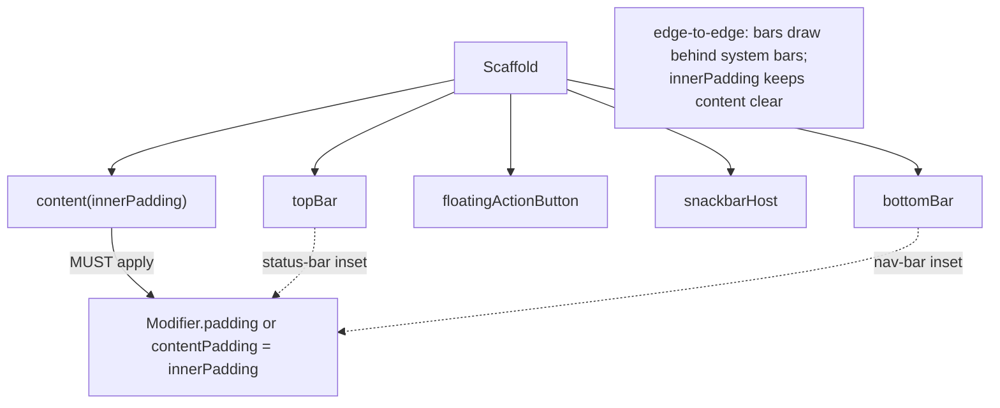
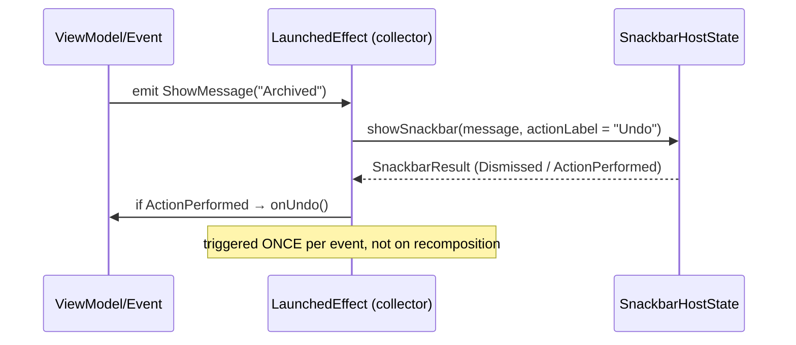

# Lesson 06 — Scaffold & App Structure

> After this lesson you can structure any screen with `Scaffold` — top bar, FAB, bottom bar, snackbars — and handle system insets and content padding correctly for an edge-to-edge app.

**Module:** 02 · **Lesson:** 06 · **Level:** 🟢🟡🔴 · **Est. time:** 70–85 min

---

## 1. Concept

### 🟢 For beginners — *what is it and why do I care?*

Almost every app screen has the same furniture: a **top app bar** (title, back button, actions), maybe a **bottom navigation bar**, a **floating action button** (FAB), and a place for **snackbars** (those little messages that slide up from the bottom). Wiring all that up by hand — and making sure your content doesn't slide *under* the top bar or *behind* the FAB — is fiddly.

**`Scaffold`** is the Material 3 composable that lays out this standard structure for you. You hand it slots — `topBar = { … }`, `bottomBar = { … }`, `floatingActionButton = { … }`, `snackbarHost = { … }` — and it positions them correctly and gives your **content** a `PaddingValues` telling it exactly how much space the bars take, so your content sits in the right place automatically.

The one rule you must not forget: **apply the padding `Scaffold` gives you to your content.** Skip it, and your list scrolls under the top bar.

### 🟡 For intermediate devs — *the mechanism*

`Scaffold`'s content lambda receives an **`innerPadding: PaddingValues`**:

```kotlin
Scaffold(topBar = { … }, floatingActionButton = { … }) { innerPadding ->
    LazyColumn(contentPadding = innerPadding) { … }   // ← consume it
}
```

That `innerPadding` accounts for the height of the top/bottom bars **and** the system bars (status bar, navigation bar) when your app draws **edge-to-edge** (the 2026 default — `enableEdgeToEdge()` in your Activity). You consume it either as `Modifier.padding(innerPadding)` (insets the whole content) or, for scrollables, as `contentPadding = innerPadding` (lets content scroll *under* the bars but starts/ends clear of them — usually what you want).

Key pieces:

- **`TopAppBar` variants** — `TopAppBar`, `CenterAlignedTopAppBar`, `MediumTopAppBar`, `LargeTopAppBar` (the last two are *collapsing* — they shrink as you scroll, driven by a `TopAppBarScrollBehavior` connected via `Modifier.nestedScroll`).
- **`SnackbarHost`** — paired with a `remember { SnackbarHostState() }`; you call `snackbarHostState.showSnackbar(...)` from a coroutine to display messages. `Scaffold` positions the host above the FAB/bottom bar.
- **`FloatingActionButton`** — placed via `floatingActionButtonPosition`; `Scaffold` keeps it clear of the snackbar and bottom bar.
- **`WindowInsets`** — `Scaffold` has a `contentWindowInsets` parameter (defaults to the right thing); individual bars know how to pad themselves for the status/navigation bars.

### 🔴 For senior devs — *trade-offs, edges, internals*

- **Edge-to-edge is the default, and insets are *your* responsibility.** Since the framework went edge-to-edge by default, your content draws behind the system bars. `Scaffold` + its `innerPadding` handles the common case, but custom surfaces (a full-bleed image header, a bottom input bar) need explicit inset handling: `Modifier.windowInsetsPadding(WindowInsets.systemBars)`, `.safeDrawingPadding()`, `.imePadding()` (for the keyboard), or `Modifier.consumeWindowInsets(...)` to avoid **double-padding** when you nest inset-aware components.
- **Double-padding is the classic bug.** If a parent already applied `innerPadding` *and* a child also consumes `WindowInsets.navigationBars`, you pad twice — a visible gap. Use `consumeWindowInsets(innerPadding)` at the boundary so descendants don't re-apply what's already been applied.
- **Collapsing bars need `nestedScroll` wiring.** `LargeTopAppBar`/`MediumTopAppBar` only collapse if you create a `scrollBehavior = TopAppBarDefaults.enterAlwaysScrollBehavior()` (or `exitUntilCollapsed…`), pass it to the bar, **and** attach `Modifier.nestedScroll(scrollBehavior.nestedScrollConnection)` to the `Scaffold`. Forget the `nestedScroll` and the bar never moves.
- **Snackbars are one-shot effects, not state.** Triggering `showSnackbar` belongs in a `LaunchedEffect`/event channel (Module 03/06), **not** in the composition path — otherwise it re-fires on recomposition. `showSnackbar` is a *suspend* function that returns a `SnackbarResult` (so you can react to the action button).
- **`Scaffold` vs adaptive scaffolds.** Plain `Scaffold` is single-pane. For navigation that adapts (bottom bar → rail → drawer) use `NavigationSuiteScaffold`, and for list-detail use `ListDetailPaneScaffold` (Lessons 07–08). Don't hand-roll responsive navigation on top of `Scaffold`.
- **The `imePadding` vs `Scaffold` interaction.** Keyboard insets aren't included in `Scaffold`'s default content insets; a text field at the bottom needs `Modifier.imePadding()` (often combined with `consumeWindowInsets`) so the keyboard pushes it up instead of covering it.

### Analogy

**A picture frame with a pre-cut mat.** The frame (`Scaffold`) has dedicated slots — a label plate at the top (top bar), a stand at the bottom (bottom bar), a magnet for a sticky note (FAB/snackbar). The **mat** is the `innerPadding`: a pre-measured border that ensures your photo (content) sits perfectly inside without overlapping the frame's hardware. If you ignore the mat and shove the photo to the edge, it slips under the frame — exactly what happens when you don't apply `innerPadding`.

### Mental model

> **`Scaffold` lays out the screen's furniture and hands you `innerPadding`. Always consume it.** Edge-to-edge means insets are yours to manage past the common case.

### Real-world example

A **mail app inbox**: `Scaffold` with a `CenterAlignedTopAppBar` ("Inbox" + search action), a `FloatingActionButton` ("Compose"), and a `SnackbarHost` that shows "Conversation archived — Undo" after a swipe. The content `LazyColumn` uses `contentPadding = innerPadding` so the newest email starts below the bar and the last one ends above the navigation bar, while messages scroll edge-to-edge behind a translucent status bar.

---

## 2. Visual Learning

**ASCII — the Scaffold slots and the padding it hands down:**
```text
   ┌──────────────────────────────────────┐
   │ topBar  (CenterAlignedTopAppBar)      │ ← insets for status bar handled here
   ├──────────────────────────────────────┤  ┐
   │                                      ▒│  │
   │   content(innerPadding)              ▒│  │ innerPadding tells content
   │   ▒ = scroll under bars (contentPad) ▒│  │ how tall the bars are
   │                              ┌──────┐ │  │
   │                              │ FAB  │ │  │
   ├──────────────────────────────┴──────┴─┤  ┘
   │ bottomBar (NavigationBar)             │ ← insets for nav bar handled here
   └──────────────────────────────────────┘
       snackbarHost floats above bottomBar/FAB
```

**Mermaid — Scaffold slots and inset flow:**


**Mermaid — snackbar as a one-shot effect:**


**Illustration prompt:**
```text
Illustration: an exploded-view diagram of a phone screen "frame", like furniture assembly
instructions. Labeled floating layers: a top bar plate ("topBar"), a bottom navigation rail
("bottomBar"), a round floating button ("FAB"), a small toast card ("snackbar"), and a large
central content sheet with a dashed inner border labeled "innerPadding (apply me!)". Thin arrows
from the top and bottom bars point at the dashed border labeled "system insets handled". Clean,
modern, isometric, vibrant, clearly labeled. 16:9.
```

---

## 3. Code

### 🟢 Beginner — a Scaffold that consumes its padding

```kotlin
@Composable
fun InboxScreen(emails: List<Email>) {
    Scaffold(
        topBar = {
            CenterAlignedTopAppBar(title = { Text("Inbox") })
        },
        floatingActionButton = {
            FloatingActionButton(onClick = { /* compose */ }) {
                Icon(Icons.Default.Edit, contentDescription = "Compose")
            }
        },
    ) { innerPadding ->
        LazyColumn(
            contentPadding = innerPadding,        // ✅ consume the padding Scaffold gives you
            modifier = Modifier.fillMaxSize(),
        ) {
            items(emails, key = { it.id }) { EmailRow(it) }
        }
    }
}
```

**Explanation.** `Scaffold` lays out the top bar and FAB and computes `innerPadding` (bar heights + system insets). Passing it as `contentPadding` lets the list scroll *under* the bars but keeps the first/last item clear of them — the standard, polished result.

**Common mistakes.**
```kotlin
// ❌ Ignoring innerPadding → content slides under the top bar / behind the nav bar.
Scaffold(topBar = { CenterAlignedTopAppBar(title = { Text("Inbox") }) }) { _ ->
    LazyColumn { items(emails) { EmailRow(it) } }   // first item hidden under the bar
}
```

**Best practices.**
- **Always** consume `innerPadding` — `contentPadding` for scrollables, `Modifier.padding` otherwise.
- Use the right top-bar variant (`CenterAlignedTopAppBar` for a centered title, `TopAppBar` for start-aligned).

---

### 🟡 Intermediate — snackbars as one-shot effects with an Undo action

```kotlin
@Composable
fun InboxScreen(
    emails: List<Email>,
    events: Flow<UiEvent>,                    // one-shot events from a ViewModel (Module 03/06)
    onArchive: (String) -> Unit,
    onUndoArchive: () -> Unit,
) {
    val snackbarHostState = remember { SnackbarHostState() }

    // Consume one-shot events exactly once — NOT in the composition path.
    LaunchedEffect(Unit) {
        events.collect { event ->
            if (event is UiEvent.ShowArchived) {
                val result = snackbarHostState.showSnackbar(
                    message = "Conversation archived",
                    actionLabel = "Undo",
                    withDismissAction = true,
                    duration = SnackbarDuration.Short,
                )
                if (result == SnackbarResult.ActionPerformed) onUndoArchive()
            }
        }
    }

    Scaffold(
        topBar = { CenterAlignedTopAppBar(title = { Text("Inbox") }) },
        snackbarHost = { SnackbarHost(snackbarHostState) },   // Scaffold positions it correctly
    ) { innerPadding ->
        LazyColumn(contentPadding = innerPadding, modifier = Modifier.fillMaxSize()) {
            items(emails, key = { it.id }) { email ->
                EmailRow(email, onArchive = { onArchive(email.id) })
            }
        }
    }
}
```

**Explanation.** The snackbar is triggered from a `LaunchedEffect` collecting one-shot events — so it fires **once per event**, not on every recomposition. `showSnackbar` is a suspend call returning a `SnackbarResult`; `ActionPerformed` wires the **Undo**. `Scaffold` places the `SnackbarHost` above the FAB/bottom bar automatically.

**Common mistakes.**
```kotlin
// ❌ Calling showSnackbar in the composition path → re-fires on recomposition, stacks duplicates.
@Composable
fun Bad(state: InboxUiState, host: SnackbarHostState) {
    if (state.archived) host  // ...there's no non-suspend way here anyway; this is a category error
    // The real anti-pattern: launching from a side-effect-free body, or keying LaunchedEffect on a
    // value that changes often so it relaunches repeatedly.
}
```
- Keying `LaunchedEffect` on a frequently-changing value (it relaunches/re-shows).
- Storing "show snackbar" as a boolean in `UiState` (re-fires after rotation) — keep it a one-shot event (Module 03).

**Best practices.**
- Trigger snackbars from `LaunchedEffect`/an event channel, never the composition path.
- Use the `SnackbarResult` to handle action buttons (Undo, Retry).
- Keep one-shot UI signals out of persistent `UiState`.

---

### 🔴 Production — collapsing large top bar, edge-to-edge insets, and keyboard handling

```kotlin
@OptIn(ExperimentalMaterial3Api::class)
@Composable
fun ArticleScreen(
    state: ArticleUiState,
    onSend: (String) -> Unit,
    modifier: Modifier = Modifier,
) {
    // Collapsing bar: behavior + nestedScroll wiring are BOTH required.
    val scrollBehavior = TopAppBarDefaults.exitUntilCollapsedScrollBehavior()
    val snackbarHostState = remember { SnackbarHostState() }

    Scaffold(
        modifier = modifier.nestedScroll(scrollBehavior.nestedScrollConnection), // ← drives collapse
        topBar = {
            LargeTopAppBar(
                title = { Text(state.title, maxLines = 1, overflow = TextOverflow.Ellipsis) },
                navigationIcon = { IconButton(onClick = {}) { Icon(Icons.AutoMirrored.Filled.ArrowBack, "Back") } },
                scrollBehavior = scrollBehavior,
            )
        },
        snackbarHost = { SnackbarHost(snackbarHostState) },
        bottomBar = {
            // A reply bar that rises with the keyboard and clears the navigation bar.
            ReplyBar(
                onSend = onSend,
                modifier = Modifier
                    .fillMaxWidth()
                    .imePadding()                                  // keyboard pushes it up
                    .windowInsetsPadding(WindowInsets.navigationBars), // clear the nav bar when no keyboard
            )
        },
    ) { innerPadding ->
        LazyColumn(
            // Consume the insets here so descendants don't double-pad them.
            modifier = Modifier
                .fillMaxSize()
                .consumeWindowInsets(innerPadding),
            contentPadding = innerPadding,
        ) {
            items(state.paragraphs, key = { it.id }) { ParagraphBlock(it) }
        }
    }
}
```

**Explanation.** Three production concerns handled together:
1. **Collapsing bar** — `exitUntilCollapsedScrollBehavior()` *plus* `Modifier.nestedScroll(...)` on the `Scaffold` (both are mandatory; one without the other does nothing).
2. **Edge-to-edge insets** — content consumes `innerPadding`, and `consumeWindowInsets(innerPadding)` prevents a nested inset-aware child from padding the same insets twice (the double-padding gap bug).
3. **Keyboard** — the reply bar uses `imePadding()` so the keyboard lifts it, and `windowInsetsPadding(navigationBars)` keeps it above the gesture bar when the keyboard is hidden.

**Common mistakes.**
```kotlin
// ❌ Collapsing bar that never collapses: scrollBehavior set on the bar, but no nestedScroll on Scaffold.
LargeTopAppBar(scrollBehavior = scrollBehavior, /* ... */)   // and Scaffold has NO .nestedScroll(...)
// ❌ Double padding: parent applied innerPadding AND child applies WindowInsets.navigationBars again.
```
- Using a deprecated `androidx.compose.material.Scaffold` (M2) instead of `androidx.compose.material3.Scaffold`.
- Forgetting `enableEdgeToEdge()` in the Activity, then hardcoding status-bar padding.

**Best practices.**
- Collapsing bars need **behavior + `nestedScroll`** — always both.
- Manage insets deliberately: consume `innerPadding`, use `consumeWindowInsets` at boundaries, `imePadding()` for keyboard-adjacent UI.
- Use **Material 3** `Scaffold`; enable edge-to-edge in the Activity and let insets flow.

---

## 4. Interview Questions

**🟢 Beginner**

1. *What is `Scaffold` and what does it give you?*
   > A Material 3 composable that lays out standard screen structure — top bar, bottom bar, FAB, snackbar host — and provides an `innerPadding` (`PaddingValues`) describing how much space those bars occupy.
2. *What's the one thing you must do with `Scaffold`'s content padding?*
   > Apply it to your content (via `contentPadding` for scrollables or `Modifier.padding` otherwise). If you don't, content slides under the top bar or behind the navigation bar.

**🟡 Intermediate**

3. *How do you show a snackbar with an Undo action, and where should you trigger it?*
   > Keep a `remember { SnackbarHostState() }`, pass it to `SnackbarHost` in the `snackbarHost` slot, and call `showSnackbar(message, actionLabel = "Undo")` from a `LaunchedEffect`/event collector (not the composition path). Check the returned `SnackbarResult.ActionPerformed` to run the undo.
4. *Why must snackbar triggers live outside the composition path?*
   > Composition can run many times; triggering `showSnackbar` there would re-fire on every recomposition. Snackbars are one-shot effects — drive them from `LaunchedEffect` or an event channel so each shows exactly once.

**🔴 Senior**

5. *What does it take to make a `LargeTopAppBar` actually collapse, and what's the common failure?*
   > Create a `scrollBehavior` (e.g. `exitUntilCollapsedScrollBehavior()`), pass it to the bar, **and** attach `Modifier.nestedScroll(scrollBehavior.nestedScrollConnection)` to the `Scaffold`/content. The common failure is setting the behavior on the bar but forgetting the `nestedScroll` modifier, so the bar never moves.
6. *In an edge-to-edge app, how do you avoid double-padding system insets?*
   > Apply the insets once (via `Scaffold`'s `innerPadding`) and call `Modifier.consumeWindowInsets(innerPadding)` at the boundary so descendant inset-aware composables don't re-apply the same insets. For keyboard-adjacent UI, add `imePadding()`; for custom surfaces use `windowInsetsPadding`/`safeDrawingPadding` deliberately.

---

## 5. AI Assistant

**Prompt example (full screen scaffold):**
```text
Build a Material 3 Scaffold screen: CenterAlignedTopAppBar with a back button, a FAB, and a
SnackbarHost. The content is a LazyColumn that consumes innerPadding via contentPadding. Show a
snackbar with an "Undo" action from a LaunchedEffect collecting one-shot UiEvents, handling
SnackbarResult.ActionPerformed. Assume edge-to-edge (enableEdgeToEdge). Target: Compose 2026 BOM,
Material 3, Kotlin 2.x.
```

**AI workflow.**
- ✅ Good for: scaffolding the screen frame, top-bar variants, snackbar wiring, FAB placement.
- ⚠️ Watch: models **drop `innerPadding`** (content under the bar), trigger snackbars in the composition body, forget the `nestedScroll` wiring for collapsing bars, and sometimes emit **M2** `Scaffold` or hardcode status-bar padding instead of using insets.

**Review workflow — map to *Common Mistakes*:**
- Is `innerPadding` actually consumed (and not double-applied)?
- Snackbars triggered from `LaunchedEffect`/events, not composition?
- Collapsing bar has **both** `scrollBehavior` and `Modifier.nestedScroll`?
- Material **3** `Scaffold`; edge-to-edge insets handled (no hardcoded status-bar height)?

**Validation workflow:**
1. **Run edge-to-edge** on a gesture-nav device: content should start below the bar and clear the navigation bar — no overlap, no double gap.
2. Open the keyboard with a bottom input — it should rise (`imePadding`), not get covered.
3. Trigger the snackbar repeatedly and rotate — it shows once per event and doesn't re-fire on rotation.
4. Scroll to confirm a `Large/MediumTopAppBar` collapses (proves the `nestedScroll` wiring).

> **AI drafts, you decide.** If a model's scaffold ignores `innerPadding` or stores "show snackbar" in state, fix both before merging — they're the two most common Scaffold bugs.

---

## Recap / Key takeaways

- **`Scaffold`** lays out top bar, bottom bar, FAB, and snackbar host, and hands you **`innerPadding`** — always consume it (`contentPadding` for lists).
- **Edge-to-edge is the default**; manage insets deliberately with `windowInsetsPadding`, `safeDrawingPadding`, `imePadding`, and `consumeWindowInsets` to avoid double-padding.
- **Snackbars are one-shot effects** — trigger from `LaunchedEffect`/an event channel and use `SnackbarResult` for actions; never from the composition path.
- **Collapsing top bars** need a `scrollBehavior` **and** `Modifier.nestedScroll(...)` — both, or nothing moves.
- Use **Material 3** `Scaffold`; for *adaptive* navigation/panes, graduate to `NavigationSuiteScaffold`/`ListDetailPaneScaffold` (Lessons 07–08).

➡️ Next: **[Lesson 07 — Window Size Classes & adaptive UI](07-window-size-classes.md)** — making layouts respond to compact / medium / expanded windows.
