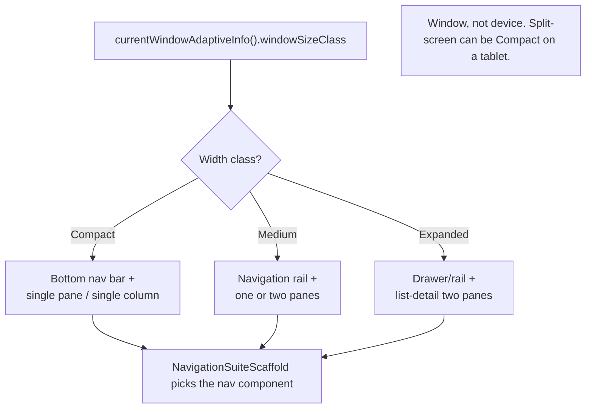
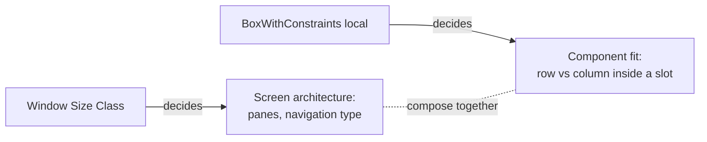

# Lesson 07 — Window Size Classes & Adaptive UI

> After this lesson you can read the current window size class, branch your screen structure on Compact / Medium / Expanded, and switch navigation between bottom bar, rail, and drawer with `NavigationSuiteScaffold`.

**Module:** 02 · **Lesson:** 07 · **Level:** 🟢🟡🔴 · **Est. time:** 70–90 min

---

## 1. Concept

### 🟢 For beginners — *what is it and why do I care?*

Your app runs on a tiny phone, a big foldable, a tablet, a Chromebook, a desktop window you can resize with a mouse. A layout that looks great on a 360dp phone looks *empty and silly* stretched across a 1200dp tablet (one column of content with oceans of whitespace). **Adaptive UI** means the screen *rearranges* itself for the space it has — two columns instead of one, a side navigation rail instead of a bottom bar.

The first tool is a way to **bucket** the available width (and height) into a few named sizes so you don't write a different layout for every device. Google calls these **Window Size Classes**:

- **Compact** — phone in portrait (width < 600dp). Show a single column, bottom navigation.
- **Medium** — small tablet, foldable, phone landscape (600–840dp). Maybe a navigation rail, perhaps two panes.
- **Expanded** — large tablet, desktop (≥ 840dp). Multiple columns, side navigation, list-detail.

You ask Compose "what size class am I?" and branch your layout on the answer — three buckets, not a hundred device checks.

### 🟡 For intermediate devs — *the mechanism*

In 2026 the canonical source is **`currentWindowAdaptiveInfo()`** from the Material 3 **adaptive** library. It returns a `WindowAdaptiveInfo` carrying the `windowSizeClass` and any `windowPosture` (folding features):

```kotlin
val adaptiveInfo = currentWindowAdaptiveInfo()
val sizeClass = adaptiveInfo.windowSizeClass
val isExpandedWidth = sizeClass.isWidthAtLeastBreakpoint(WIDTH_DP_EXPANDED_LOWER_BOUND)
```

> ⚠️ **API note.** The old `androidx.window` `WindowSizeClass` and `calculateWindowSizeClass(activity)` are superseded by the Material 3 adaptive `WindowSizeClass` (package `androidx.compose.material3.adaptive` / `androidx.compose.material3.windowsizeclass`), which also adds **LARGE** and **EXTRA-LARGE** width buckets for big desktop windows. Prefer `currentWindowAdaptiveInfo()` and the breakpoint helpers; verify exact names against your BOM.

Two width-class facts to internalize:

- Size classes are about the **window**, not the physical device. A resizable desktop window or a 50/50 split-screen on a tablet can be "Compact" even on big hardware. **Always derive from the window, never from screen size or device model.**
- Width and height classes are **independent**. A phone in landscape is Compact *height* but Medium *width* — you usually branch on **width** for top-level structure.

For navigation, **`NavigationSuiteScaffold`** (Material 3 adaptive navigation suite) automatically picks the right navigation component for the size class: a **bottom navigation bar** on Compact, a **navigation rail** on Medium, a **drawer/expanded rail** on Expanded — from one declaration of your destinations. You don't manually swap components.

### 🔴 For senior devs — *trade-offs, edges, internals*

- **Break on content, not class, when you can.** Size classes are coarse *strategy* buckets — great for "one pane vs two," "rail vs bottom bar." But a single self-fitting component is often better served by `BoxWithConstraints` (Lesson 01) reacting to its *local* slot, because a component placed in a 320dp pane of an Expanded window is "small" regardless of the window class. **Rule: window size class for screen architecture; local constraints for component fit.**
- **Don't fork into two whole layouts.** The tempting anti-pattern is `if (expanded) BigScreen() else SmallScreen()` — two divergent trees that drift and double your maintenance. Prefer **one** composable that places shared pieces differently (e.g. the same list and detail content, arranged as one column or two). The canonical scaffolds (`ListDetailPaneScaffold`, Lesson 08) exist precisely to keep it one tree.
- **State must survive the reconfiguration.** When a foldable unfolds or a window resizes, the size class changes and your layout re-runs — selection, scroll position, form input must persist (hoist to `ViewModel`/`rememberSaveable`, Module 03). A common bug: the selected item resets when switching from one-pane to two-pane because selection lived in the wrong place.
- **`NavigationSuiteType` can be overridden.** `NavigationSuiteScaffold` auto-selects, but you can force a type (e.g. always a rail) via its `layoutType` parameter when product design demands it — useful on TV/desktop where the auto-choice isn't ideal.
- **Test at the boundaries.** Bugs cluster at the breakpoints (599 vs 600dp, fold transitions, drag-resize on desktop). Use resizable emulators, the foldable emulator's fold toggle, and `@PreviewScreenSizes`/device specs to cover Compact/Medium/Expanded — *and* the live resize transition, not just static sizes.
- **Insets + adaptive interact.** Rails and drawers carry their own window insets; combined with edge-to-edge (Lesson 06) you must let the adaptive scaffold own inset handling rather than double-padding.

### Analogy

**A restaurant that reseats you by party size.** A solo diner gets a small bar stool (Compact: one column, bottom bar). A couple gets a two-top by the window (Medium: a rail appears, maybe a second pane). A party of eight gets the big round table in the back (Expanded: multi-column, side navigation). The *menu and food* (your content) are identical — only the **seating arrangement** changes to fit the party. You don't run a different restaurant per group; you rearrange the same one.

### Mental model

> **Bucket the *window* width into Compact / Medium / Expanded and rearrange one shared layout.** Size class = screen architecture; local constraints = component fit.

### Real-world example

**Gmail-style mail app:** on a phone (Compact) it's a single list with a bottom nav bar; rotate to landscape or open on a tablet (Medium/Expanded) and a navigation **rail** appears on the left while the inbox list and the open message show as **two panes** side by side. Same screens, same state, rearranged by window size class.

---

## 2. Visual Learning

**ASCII — the three width buckets and their structure:**
```text
   COMPACT (<600dp)        MEDIUM (600–840dp)         EXPANDED (≥840dp)
   ┌──────────────┐        ┌───┬──────────────┐       ┌────┬─────────┬─────────┐
   │              │        │   │              │       │    │         │         │
   │   content    │        │ R │   content    │       │ D  │  list   │ detail  │
   │  (1 column)  │        │ a │              │       │ r  │  pane   │  pane   │
   │              │        │ i │              │       │ a  │         │         │
   ├──────────────┤        │ l │              │       │ w  │         │         │
   │ ▢ ▢ ▢  (bot) │        └───┴──────────────┘       │ e  │         │         │
   └──────────────┘         rail + 1 pane             │ r  │         │         │
   bottom nav bar                                     └────┴─────────┴─────────┘
                                                       drawer/rail + 2 panes
```

**Mermaid — branch structure on the width class:**


**Mermaid — size class vs local constraints (who decides what):**


**Illustration prompt:**
```text
Illustration: a restaurant floor plan shown three times in a row, left to right, labeled
"Compact", "Medium", "Expanded". Left: a single bar stool with a small tray (one column) and a
tiny bottom menu strip. Middle: a two-person window table with a slim side podium labeled "rail".
Right: a large round table with a tall side host-stand labeled "drawer" and the table split into
two place settings labeled "list" and "detail". The same plated dish appears at every seat, with a
caption "same food, different seating". Modern, vibrant, isometric, clearly labeled. 16:9.
```

---

## 3. Code

### 🟢 Beginner — read the size class and branch

```kotlin
@Composable
fun HomeScreen(items: List<Item>, detail: Item?) {
    val sizeClass = currentWindowAdaptiveInfo().windowSizeClass
    val isExpanded = sizeClass.isWidthAtLeastBreakpoint(WIDTH_DP_EXPANDED_LOWER_BOUND)

    if (isExpanded) {
        // Two panes side by side on big windows.
        Row(Modifier.fillMaxSize()) {
            ItemList(items, Modifier.weight(1f))
            ItemDetail(detail, Modifier.weight(2f))
        }
    } else {
        // Single column on phones / narrow windows.
        ItemList(items, Modifier.fillMaxSize())
    }
}
```

**Explanation.** `currentWindowAdaptiveInfo().windowSizeClass` gives the *window's* size class; the `isWidthAtLeastBreakpoint(...)` helper turns it into a boolean. On Expanded we lay out two panes with `weight`; otherwise a single column. One screen, two arrangements.

**Common mistakes.**
```kotlin
// ❌ Branching on physical screen size / device, not the window → wrong on split-screen & desktop.
val widthDp = LocalConfiguration.current.screenWidthDp
if (widthDp > 840) TwoPane() else OnePane()   // ignores multi-window; brittle magic number
```

**Best practices.**
- Derive structure from `currentWindowAdaptiveInfo().windowSizeClass`, not `LocalConfiguration`/device model.
- Branch on **width** for top-level structure; use the named breakpoints, not raw magic numbers.

---

### 🟡 Intermediate — adaptive navigation with `NavigationSuiteScaffold`

```kotlin
enum class Dest(val label: String, val icon: ImageVector) {
    Home("Home", Icons.Default.Home),
    Search("Search", Icons.Default.Search),
    Profile("Profile", Icons.Default.Person),
}

@Composable
fun AppShell() {
    var current by rememberSaveable { mutableStateOf(Dest.Home) }   // survives reconfiguration

    NavigationSuiteScaffold(
        navigationSuiteItems = {
            Dest.entries.forEach { dest ->
                item(
                    selected = dest == current,
                    onClick = { current = dest },
                    icon = { Icon(dest.icon, contentDescription = dest.label) },
                    label = { Text(dest.label) },
                )
            }
        },
    ) {
        // Content for the selected destination — same code on phone, tablet, desktop.
        when (current) {
            Dest.Home -> HomeScreen()
            Dest.Search -> SearchScreen()
            Dest.Profile -> ProfileScreen()
        }
    }
}
```

**Explanation.** `NavigationSuiteScaffold` reads the window size class internally and renders a **bottom bar** (Compact), a **rail** (Medium), or a **drawer** (Expanded) from the *same* `navigationSuiteItems` declaration — you never swap components by hand. Selection is in `rememberSaveable`, so it survives the fold/resize that changes the navigation type.

**Common mistakes.**
```kotlin
// ❌ Manually picking the nav component per size class → reinventing NavigationSuiteScaffold, and
//    forgetting one breakpoint. Let the suite scaffold decide.
if (isCompact) BottomBarScaffold() else RailScaffold()
// ❌ Selection state in plain remember → resets when the device folds/unfolds (config change).
var current by remember { mutableStateOf(Dest.Home) }
```

**Best practices.**
- Use `NavigationSuiteScaffold` for adaptive navigation; declare destinations once.
- Keep navigation/selection state in `rememberSaveable`/`ViewModel` so it survives reconfiguration.
- Override the `layoutType` only when product design requires a specific component.

---

### 🔴 Production — one tree, three layouts, state hoisted, previews at all sizes

```kotlin
@Composable
fun MailRoute(
    vm: MailViewModel = viewModel(),
) {
    // Selection lives in the ViewModel → survives rotation, fold, resize, and pane-count changes.
    val state by vm.uiState.collectAsStateWithLifecycle()
    MailScreen(
        state = state,
        onSelect = vm::onSelect,
        onBack = vm::onBackToList,
    )
}

@Composable
fun MailScreen(
    state: MailUiState,
    onSelect: (String) -> Unit,
    onBack: () -> Unit,
    windowSizeClass: WindowSizeClass = currentWindowAdaptiveInfo().windowSizeClass,
) {
    val twoPane = windowSizeClass.isWidthAtLeastBreakpoint(WIDTH_DP_MEDIUM_LOWER_BOUND)

    // ONE shared content tree, arranged differently — not two divergent screens.
    if (twoPane) {
        Row(Modifier.fillMaxSize()) {
            InboxList(
                emails = state.emails,
                selectedId = state.selectedId,
                onSelect = onSelect,
                modifier = Modifier.weight(1f),
            )
            VerticalDivider()
            MessageDetail(
                email = state.selectedEmail,
                onBack = null,                      // no back affordance when both panes are visible
                modifier = Modifier.weight(2f),
            )
        }
    } else {
        // Compact: show one or the other based on selection (back returns to the list).
        if (state.selectedEmail != null) {
            MessageDetail(email = state.selectedEmail, onBack = onBack, modifier = Modifier.fillMaxSize())
        } else {
            InboxList(state.emails, state.selectedId, onSelect, Modifier.fillMaxSize())
        }
    }
}

@PreviewScreenSizes   // previews Compact, Medium, Expanded at once
@Composable
private fun MailScreenPreview() {
    AppTheme { MailScreen(state = sampleMailState(), onSelect = {}, onBack = {}) }
}
```

**Explanation.** The **same** `InboxList` and `MessageDetail` are shared between layouts; only their *arrangement* differs (two panes vs. one-at-a-time). Selection lives in the **ViewModel**, so unfolding from one pane to two keeps the chosen email — no reset. `@PreviewScreenSizes` renders all three classes so regressions show up in the IDE. (Lesson 08 replaces this hand-rolled branch with `ListDetailPaneScaffold`, which also handles back/predictive-back automatically.)

**Common mistakes.**
```kotlin
// ❌ Two entirely separate screens that drift apart and duplicate logic.
if (expanded) TabletMailScreen(...) else PhoneMailScreen(...)
// ❌ Selection in the composable (remember) → unfolding resets the open email.
```
- Hardcoding a `840` magic number instead of the named breakpoint helper.
- Forgetting to test the *transition* (live resize / fold), only static sizes.

**Best practices.**
- **One** content tree, rearranged — share the leaf composables across size classes.
- Hoist selection/scroll/input to `ViewModel`/`rememberSaveable` so reconfiguration preserves them.
- Preview with `@PreviewScreenSizes` (or device specs) and test live fold/resize transitions.
- Prefer the canonical scaffolds (`ListDetailPaneScaffold`, Lesson 08) over hand-rolled branches when the pattern fits.

---

## 4. Interview Questions

**🟢 Beginner**

1. *What are Window Size Classes?*
   > Coarse buckets of the available **window** size — Compact, Medium, Expanded (by width, and independently by height) — that let you choose a layout strategy without checking individual device sizes.
2. *How do you get the current size class in Compose (2026)?*
   > `currentWindowAdaptiveInfo().windowSizeClass` from the Material 3 adaptive library, then test it with breakpoint helpers like `isWidthAtLeastBreakpoint(WIDTH_DP_EXPANDED_LOWER_BOUND)`.

**🟡 Intermediate**

3. *Why branch on window size class instead of `LocalConfiguration.screenWidthDp` or the device model?*
   > Size classes reflect the **window**, which can differ from the device — split-screen multi-window or a resizable desktop window can be Compact on big hardware. Device/screen checks miss those and rely on brittle magic numbers.
4. *What does `NavigationSuiteScaffold` do for you?*
   > It renders the appropriate navigation component for the current size class automatically — bottom bar (Compact), rail (Medium), drawer (Expanded) — from a single destination declaration, so you don't swap components by hand.

**🔴 Senior**

5. *When do you use a window size class vs `BoxWithConstraints`?*
   > Window size class drives **screen architecture** (single vs dual pane, navigation type). `BoxWithConstraints` reacts to a component's **local** slot — better for a self-fitting widget, since a component in a small pane of a large window is "small" regardless of the window class. Use both at their right level.
6. *What's the main pitfall when a foldable unfolds and your layout switches from one pane to two?*
   > State (selection, scroll, form input) resetting because it lived in the composable. The reconfiguration re-runs composition; hoist that state to a `ViewModel`/`rememberSaveable` so it survives the transition, and prefer one shared tree (or `ListDetailPaneScaffold`) over two divergent screens.

---

## 5. AI Assistant

**Prompt example (adaptive list-detail by hand):**
```text
Make this single-pane screen adaptive: on Medium/Expanded windows show a two-pane list+detail
(weights 1:2); on Compact show the list, and the detail when an item is selected with a back action.
Use currentWindowAdaptiveInfo().windowSizeClass and the named width breakpoints (no magic numbers).
Keep selection in the ViewModel so it survives fold/resize. Share the same list and detail
composables across layouts. Add @PreviewScreenSizes. Target: Compose 2026 BOM, Material 3 adaptive,
Kotlin 2.x.
```

**AI workflow.**
- ✅ Good for: the size-class branch skeleton, `NavigationSuiteScaffold` wiring, preview annotations.
- ⚠️ Watch: models reach for **`LocalConfiguration.screenWidthDp`** or `calculateWindowSizeClass` (older), use **magic numbers** (840) instead of breakpoint helpers, **fork into two whole screens**, and leave selection in `remember` (resets on fold).

**Review workflow — map to *Common Mistakes*:**
- Uses `currentWindowAdaptiveInfo().windowSizeClass` + named breakpoints, not device/config width?
- **One** shared content tree, not two divergent screens?
- Selection/scroll/input **hoisted** so reconfiguration preserves it?
- `NavigationSuiteScaffold` for adaptive navigation rather than hand-swapped components?

**Validation workflow:**
1. Run on a **resizable emulator** and drag the window across the breakpoints — structure should switch cleanly, no crash.
2. On the **foldable emulator**, toggle fold/unfold *with an item selected* — selection must persist.
3. Try **split-screen** on a tablet — confirm it correctly treats the smaller window as Compact.
4. Check `@PreviewScreenSizes` renders all three classes without overflow.

> **AI drafts, you decide.** If a model branches on `screenWidthDp` or duplicates the screen per device, switch it to `currentWindowAdaptiveInfo()` + one shared tree before merging.

---

## Recap / Key takeaways

- **Window Size Classes** bucket the *window* into Compact / Medium / Expanded — branch screen **architecture** on width.
- Get them via **`currentWindowAdaptiveInfo().windowSizeClass`** (Material 3 adaptive) and breakpoint helpers; the old `androidx.window` `calculateWindowSizeClass` is superseded.
- Always derive from the **window**, never the device/screen — split-screen and resizable windows defy device size.
- **`NavigationSuiteScaffold`** auto-switches bottom bar / rail / drawer from one destination list.
- Use **one shared tree** rearranged per class (not two screens), and **hoist state** so fold/resize preserves it; size class = architecture, `BoxWithConstraints` = component fit.

➡️ Next: **[Lesson 08 — Foldables, tablets & desktop](08-foldables-tablets-desktop.md)** — list-detail panes, fold posture, and Compose Multiplatform desktop.
