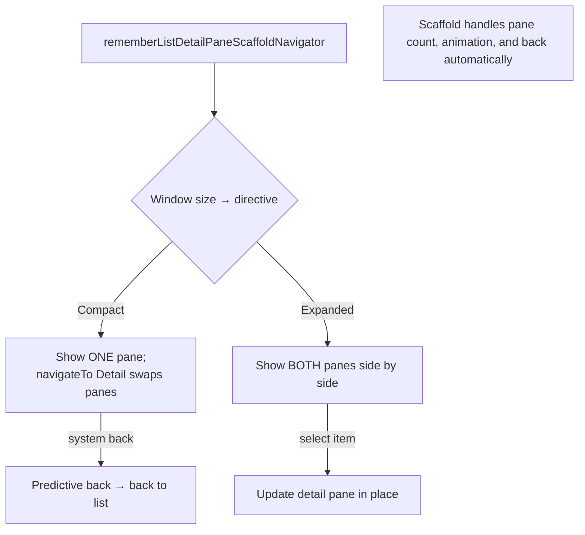
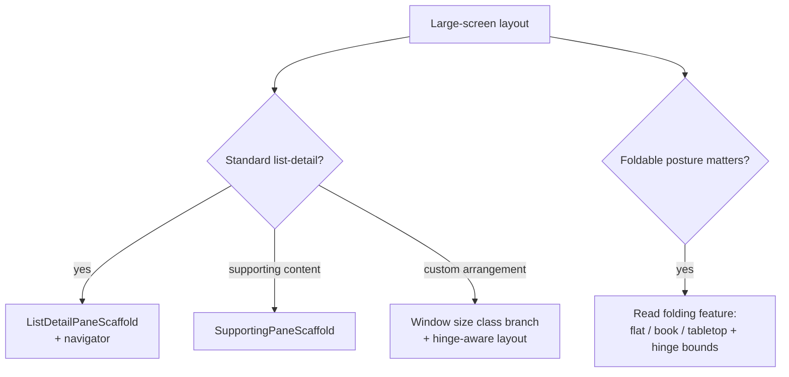

# Lesson 08 — Foldables, Tablets & Desktop

> After this lesson you can build canonical list-detail layouts with `ListDetailPaneScaffold`, react to foldable posture (hinge/tabletop), and understand how the same Compose code targets desktop via Compose Multiplatform.

**Module:** 02 · **Lesson:** 08 · **Level:** 🟢🟡🔴 · **Est. time:** 70–90 min

---

## 1. Concept

### 🟢 For beginners — *what is it and why do I care?*

Lesson 07 taught you to *bucket* the window (Compact/Medium/Expanded). This lesson is about the **shapes** those bigger windows want — and the devices that don't behave like a simple rectangle:

- **Tablets & desktop** love **list-detail**: a list on the left, the selected item's details on the right. (Email, settings, file browsers, messaging.) Building this by hand — and getting *back navigation* and *resize* right — is tedious, so Compose ships a ready-made layout for it.
- **Foldables** fold and flex. A book-style foldable has a **hinge** down the middle (you don't want content under it); laid flat on a table in "tabletop" posture, the top half is a screen and the bottom half a keyboard/controls. Reacting to that physical **posture** is what makes a foldable app feel native instead of "a stretched phone app."
- **Desktop** (via Compose Multiplatform) runs the *same* Compose UI in a resizable window with a mouse and keyboard — so adaptive thinking pays off across an entire new platform.

The headline: Compose gives you **canonical adaptive layouts** so you don't reinvent list-detail, and **posture info** so you can respect the fold.

### 🟡 For intermediate devs — *the mechanism*

**`ListDetailPaneScaffold`** (Material 3 adaptive, `adaptive-layout` + `adaptive-navigation`) is the canonical two-pane layout. You drive it with a **navigator**:

```kotlin
val navigator = rememberListDetailPaneScaffoldNavigator<ItemId>()

ListDetailPaneScaffold(
    directive = navigator.scaffoldDirective,
    value = navigator.scaffoldValue,
    listPane = { AnimatedPane { ListPane(onSelect = { id ->
        navigator.navigateTo(ListDetailPaneScaffoldRole.Detail, id)
    }) } },
    detailPane = { AnimatedPane { DetailPane(navigator.currentDestination?.contentKey) } },
)
```

It **automatically** decides whether to show one pane or two based on the window size, animates between them, and — crucially — integrates with **predictive back**: on a phone (single pane) the system back gesture returns from detail to list; on a tablet (two panes) back behaves appropriately. You no longer hand-code the "if compact, swap panes; handle back" logic from Lesson 07.

For **foldables**, `currentWindowAdaptiveInfo()` also exposes **posture**: whether there's a separating/occluding **hinge** and its bounds, and whether the device is **flat**, **half-opened (book)**, or **tabletop**. The adaptive scaffolds *already* account for a vertical hinge (treating it as the gap between panes). For custom layouts you read the folding feature to avoid placing content under the hinge.

**Desktop / Compose Multiplatform:** the same `@Composable` code compiles for desktop (JVM). Window size classes, `Row`/`Column`, lazy lists, and `ListDetailPaneScaffold` all work; you add desktop-specific affordances (mouse hover, keyboard shortcuts, resizable `Window`) on top. Adaptive layout is what makes "write once, run on phone + foldable + desktop" realistic.

### 🔴 For senior devs — *trade-offs, edges, internals*

- **`ListDetailPaneScaffold` vs hand-rolled (Lesson 07).** The hand-rolled branch is fine for learning, but the scaffold gives you *for free*: pane animation, **predictive-back** integration, correct one-vs-two-pane decisions (including honoring a hinge), a third **extra** pane, and resize handling. Reach for the scaffold for real list-detail; hand-roll only for non-standard arrangements. The cost is a dependency and a navigator concept to learn.
- **Posture is more than width.** Two devices can be "Medium width" while one is folded flat and another is a book with an occluding hinge. **Don't infer posture from size class** — read the folding feature. A media app might go full-screen video when *flat* but show controls on the bottom half when *tabletop*; size class can't tell those apart.
- **Hinge-aware custom layouts.** When you build your own two-pane layout (not the scaffold), query the hinge bounds and either align the pane split to the hinge or pad around an *occluding* fold. Ignoring an occluding hinge puts content *inside the crease* — unreadable.
- **State preservation across pane changes is the recurring trap (again).** Selection/scroll must live above the scaffold (`ViewModel`) so unfolding from one to two panes doesn't drop the open item. The navigator tracks *which pane* is active; your *data* selection is still your responsibility to hoist.
- **Desktop input is a different contract.** Mouse **hover** states, right-click context menus, keyboard navigation/focus traversal, and **drag-resize** of the window (continuous size-class changes) don't exist on touch phones. Adaptive code must not assume touch; test pointer + keyboard. `@PreviewScreenSizes` and resizable windows help, but real input testing is essential.
- **Avoid stretching, embrace reflow.** The senior failure mode on large screens is *stretching* phone UI (one column at 1200dp, giant line lengths hurting readability). Cap content width (`Modifier.widthIn(max = …)`), add panes/columns, and increase information density — large screens want *more content*, not *bigger content*.

### Analogy

**A laptop vs. a folding map.** `ListDetailPaneScaffold` is a **laptop**: open it and you get two coordinated surfaces (screen + keyboard) that work together; close it part-way and it still makes sense. A foldable's **posture** is like a **paper map**: flat on the table it's one big surface; tented up it's two faces at an angle; folded in half there's a **crease** you'd never write across. Respecting posture is respecting the crease and the angle — not pretending the map is always one flat rectangle.

### Mental model

> **Big screens want list-detail and reflow, not stretched phone UI.** Use `ListDetailPaneScaffold` for the pattern; read **posture** (the hinge) for foldables; the same Compose code reaches desktop.

### Real-world example

A **note-taking app**: phone shows a notes list, tap to open a note full-screen (back returns to the list). On a tablet/foldable, `ListDetailPaneScaffold` shows the list and the open note **side by side**; opening a note on a phone-sized window still works via predictive back. Folded flat in **tabletop** posture on a foldable, the note editor moves to the top half with a formatting toolbar on the bottom. The exact same screen, packaged for a desktop app, runs in a resizable window with keyboard shortcuts.

---

## 2. Visual Learning

**ASCII — list-detail collapses by window, and foldable postures:**
```text
   ListDetailPaneScaffold                       Foldable postures
   Compact (1 pane at a time):                  FLAT          BOOK (hinge)     TABLETOP
   ┌────────────┐  select   ┌────────────┐      ┌────────┐    ┌───┊───┐        ┌────────┐
   │  list      │ ───────▶  │  detail    │      │        │    │ L ┊ R │        │ screen │
   │            │ ◀───────   │  (back)    │      │  one   │    │   ┊   │        ├────────┤
   └────────────┘  back      └────────────┘      │ screen │    └───┊───┘        │controls│
                                                 └────────┘   ┊ = hinge        └────────┘
   Expanded (both panes):                        (avoid placing content on the hinge ┊)
   ┌──────────┬───────────────┐
   │  list    │   detail      │
   └──────────┴───────────────┘
```

**Mermaid — the list-detail navigator flow:**


**Mermaid — pick your tool on big screens:**


**Illustration prompt:**
```text
Illustration: a triptych. Left panel "Phone": a single notes list with one note opening full-screen,
a curved back-arrow between them. Middle panel "Tablet/Foldable": the same notes list and an open
note shown side by side as two panes, a thin seam between them aligned to a subtle device hinge.
Right panel "Tabletop foldable": the device bent at 90°, the top face showing the note editor and the
bottom face a formatting toolbar, a dashed line down the crease labeled "hinge — keep clear". A small
desktop-window icon in the corner labeled "same code on desktop". Modern, vibrant, isometric, clearly
labeled. 16:9.
```

---

## 3. Code

### 🟢 Beginner — a canonical list-detail with `ListDetailPaneScaffold`

```kotlin
@OptIn(ExperimentalMaterial3AdaptiveApi::class)
@Composable
fun MailListDetail(emails: List<Email>) {
    // The navigator tracks which pane is shown and carries the selected id as the content key.
    val navigator = rememberListDetailPaneScaffoldNavigator<String>()

    ListDetailPaneScaffold(
        directive = navigator.scaffoldDirective,
        value = navigator.scaffoldValue,
        listPane = {
            AnimatedPane {
                EmailList(
                    emails = emails,
                    onSelect = { id -> navigator.navigateTo(ListDetailPaneScaffoldRole.Detail, id) },
                )
            }
        },
        detailPane = {
            AnimatedPane {
                val id = navigator.currentDestination?.contentKey
                EmailDetail(email = emails.firstOrNull { it.id == id })
            }
        },
    )
}
```

**Explanation.** `ListDetailPaneScaffold` shows **one** pane on small windows and **two** on large ones automatically — no size-class branch. `navigateTo(Detail, id)` selects an item; the navigator carries the id as the detail pane's `contentKey`. On a phone, the system back gesture returns to the list (predictive-back integrated) without any extra code.

**Common mistakes.**
```kotlin
// ❌ Hand-rolling the whole thing (Lesson 07 style) for a standard list-detail and then having to
//    add pane animation + back handling yourself — the scaffold already does all of it.
// ❌ Forgetting the @OptIn(ExperimentalMaterial3AdaptiveApi::class) and being confused by errors.
```

**Best practices.**
- Use `ListDetailPaneScaffold` for standard list-detail — you get pane count, animation, and back for free.
- Wrap each pane in `AnimatedPane` so transitions are smooth.
- Drive selection through the navigator's `contentKey`.

---

### 🟡 Intermediate — react to foldable posture

```kotlin
@Composable
fun rememberFoldPosture(): FoldPosture {
    val info = currentWindowAdaptiveInfo()
    // posture exposes folding features: hinge presence/bounds, and flat vs half-open.
    val posture = info.windowPosture
    return when {
        posture.isTabletop -> FoldPosture.Tabletop
        posture.isBookPosture -> FoldPosture.Book
        else -> FoldPosture.Flat
    }
}

@Composable
fun VideoScreen(videoUrl: String) {
    when (rememberFoldPosture()) {
        FoldPosture.Tabletop -> Column(Modifier.fillMaxSize()) {
            VideoSurface(videoUrl, Modifier.weight(1f))   // video on the top half
            PlaybackControls(Modifier.fillMaxWidth())     // controls on the bottom half
        }
        else -> Box(Modifier.fillMaxSize()) {
            VideoSurface(videoUrl, Modifier.fillMaxSize())
            PlaybackControls(Modifier.align(Alignment.BottomCenter))  // overlay controls
        }
    }
}

enum class FoldPosture { Flat, Book, Tabletop }
```

**Explanation.** `currentWindowAdaptiveInfo().windowPosture` reports the fold state. In **tabletop** posture we split the UI to match the physical fold — video on top, controls on the bottom face — which feels native; otherwise controls overlay the video. (Exact posture property names are version-sensitive — verify against your BOM; the *concept* is to branch on posture, not size.)

**Common mistakes.**
```kotlin
// ❌ Inferring posture from the size class → can't tell flat from tabletop; both can be "Medium".
if (sizeClass == Medium) tabletopLayout()   // WRONG: medium ≠ tabletop
```
- Placing content where an **occluding hinge** sits (in a custom split) → text lands in the crease.

**Best practices.**
- Read **posture/folding features** for fold-aware UI — never infer it from window size class.
- For custom two-pane layouts, align the split to (or pad around) the **hinge bounds**.

---

### 🔴 Production — hoisted state, supporting pane, and desktop-aware affordances

```kotlin
@OptIn(ExperimentalMaterial3AdaptiveApi::class)
@Composable
fun CatalogRoute(vm: CatalogViewModel = viewModel()) {
    // Selection in the ViewModel → survives fold/unfold and pane-count changes (Module 03).
    val state by vm.uiState.collectAsStateWithLifecycle()
    val navigator = rememberListDetailPaneScaffoldNavigator<String>()

    // Keep the navigator's pane state and our data selection in sync.
    LaunchedEffect(state.selectedId) {
        if (state.selectedId != null && navigator.currentDestination?.contentKey != state.selectedId) {
            navigator.navigateTo(ListDetailPaneScaffoldRole.Detail, state.selectedId)
        }
    }

    ListDetailPaneScaffold(
        directive = navigator.scaffoldDirective,
        value = navigator.scaffoldValue,
        listPane = {
            AnimatedPane {
                ProductList(
                    products = state.products,                 // ImmutableList for skippability
                    selectedId = state.selectedId,
                    onSelect = vm::onSelect,                   // updates ViewModel, effect drives navigator
                    // Cap width so the list doesn't stretch absurdly on a desktop window.
                    modifier = Modifier.widthIn(max = 480.dp),
                )
            }
        },
        detailPane = {
            AnimatedPane {
                ProductDetail(
                    product = state.selectedProduct,
                    onBack = {
                        vm.onClearSelection()
                        navigator.navigateBack()               // predictive-back friendly
                    },
                )
            }
        },
    )
}
```

**Explanation.** Production list-detail hoists **selection to the `ViewModel`**, then syncs the scaffold navigator to it in a `LaunchedEffect` — so unfolding from one pane to two (or a desktop resize) **never loses the open product**. The list pane is `widthIn(max = 480.dp)` so a wide desktop window doesn't stretch a single column to unreadable line lengths. `navigateBack()` cooperates with predictive back. Data is an `ImmutableList` (Lesson 04) for skippability. The same screen runs on desktop via Compose Multiplatform; you'd layer hover/keyboard affordances on top.

**Common mistakes.**
```kotlin
// ❌ Selection only in the navigator/composable → resize or fold drops the open item.
// ❌ Stretching a single column to fill a 1400dp desktop window → giant line length, poor readability.
ProductList(products, Modifier.fillMaxWidth())   // cap it instead (widthIn max)
```
- Not syncing the navigator with hoisted selection (the two disagree after rotation).
- Assuming touch-only input on desktop (no hover/keyboard handling).

**Best practices.**
- Hoist selection/scroll to the `ViewModel`; sync the scaffold navigator to it so reconfiguration preserves state.
- **Cap content width** on large screens (`widthIn(max = …)`) — reflow and add panes/density instead of stretching.
- Cooperate with **predictive back** via the navigator; plan for mouse/keyboard on desktop.

---

## 4. Interview Questions

**🟢 Beginner**

1. *What layout do tablets and desktops typically want, and what Compose API gives it to you?*
   > A **list-detail** layout (list on one side, selected item's details on the other). `ListDetailPaneScaffold` (Material 3 adaptive) provides it, automatically showing one or two panes based on window size.
2. *What is foldable "posture"?*
   > The physical state of a foldable — flat, half-opened (book, with a hinge down the middle), or tabletop (bent ~90° on a surface) — which adaptive apps respond to so content respects the fold.

**🟡 Intermediate**

3. *What does `ListDetailPaneScaffold` handle that a hand-rolled size-class branch doesn't?*
   > Automatic one-vs-two-pane decisions (honoring a hinge), pane transition animation, predictive-back integration, optional extra/supporting panes, and resize handling — all of which you'd otherwise code yourself.
4. *Why can't you infer foldable posture from the window size class?*
   > Size class only describes window dimensions; two Medium-width devices can be flat vs. tabletop. Posture (flat/book/tabletop and hinge bounds) comes from the folding feature in `currentWindowAdaptiveInfo()`, not from size.

**🔴 Senior**

5. *What's the recurring state bug when moving between one and two panes, and how do you prevent it?*
   > The selected item (or scroll) resets because it lived in the composable/navigator alone. Hoist selection to a `ViewModel` and sync the scaffold navigator to it, so unfolding/resizing preserves the open item.
6. *What changes when the same Compose UI targets desktop, and what's the large-screen design failure to avoid?*
   > Desktop adds mouse **hover**, right-click menus, keyboard focus traversal, and continuous **drag-resize** (constant size-class changes) — your code must not assume touch. The design failure is **stretching** phone UI (single column at huge widths, unreadable line lengths); instead cap width, reflow into panes/columns, and raise information density.

---

## 5. AI Assistant

**Prompt example (list-detail + posture):**
```text
Build a list-detail screen with ListDetailPaneScaffold and rememberListDetailPaneScaffoldNavigator
(carry the selected id as contentKey, wrap panes in AnimatedPane, support predictive back). Hoist
selection into the ViewModel and sync the navigator to it so fold/resize preserves the open item.
Cap the list pane width with widthIn(max = 480.dp). Then add a tabletop-posture branch that moves
playback controls to the bottom face. Use currentWindowAdaptiveInfo() for size AND posture (don't
infer posture from size class). Target: Compose 2026 BOM, Material 3 adaptive, Kotlin 2.x.
```

**AI workflow.**
- ✅ Good for: `ListDetailPaneScaffold` + navigator scaffolding, `AnimatedPane` wiring, posture-branch skeletons, desktop window setup.
- ⚠️ Watch: models **hand-roll** list-detail instead of using the scaffold, **infer posture from size class**, leave selection only in the navigator (resets on reconfig), and **stretch** single columns on desktop. Posture property names drift across versions — verify.

**Review workflow — map to *Common Mistakes*:**
- Uses `ListDetailPaneScaffold` + navigator (with predictive back), not a hand-rolled branch?
- Posture read from the **folding feature**, not inferred from size class?
- Selection **hoisted** to the ViewModel and synced to the navigator?
- Large-screen content **width-capped/reflowed**, not stretched?

**Validation workflow:**
1. On a **foldable emulator**, open detail then fold/unfold — the open item persists and panes animate.
2. Toggle **tabletop** posture and confirm the layout splits to the fold (not just by width).
3. On **desktop / resizable window**, drag-resize across breakpoints — no crash, state preserved, no absurd line lengths.
4. Test **predictive back** on a phone-sized window: the gesture returns from detail to list smoothly.

> **AI drafts, you decide.** If a model rebuilds list-detail by hand or branches posture on size class, replace with `ListDetailPaneScaffold` + a real posture read before merging.

---

## Recap / Key takeaways

- Big screens want **list-detail and reflow**, not stretched phone UI — use **`ListDetailPaneScaffold`** + a navigator for pane count, animation, and **predictive back** for free.
- **Foldable posture** (flat / book / tabletop + hinge bounds) comes from `currentWindowAdaptiveInfo()` — **never infer it from the size class**; keep content off an occluding hinge.
- **Hoist selection/scroll** to the `ViewModel` and sync the navigator so fold/unfold/resize preserves state.
- On large screens, **cap content width** (`widthIn(max = …)`) and add panes/density instead of stretching one column.
- The **same Compose code** targets desktop via Compose Multiplatform — design for mouse/keyboard/resize, not touch alone.

➡️ Next: **[Module 03 — State Management](../module-03-state-management/README.md)** — decide *where state lives*, hoist it correctly, and design screens with a single source of truth (the discipline every adaptive layout above depends on).
