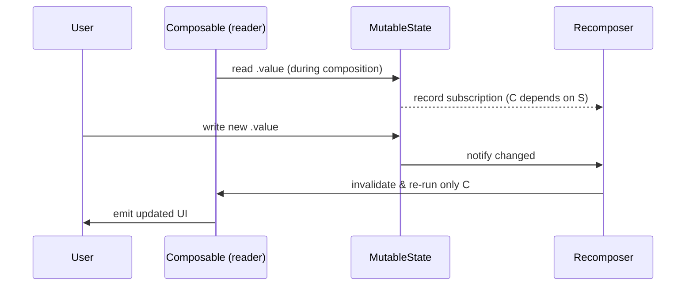

# Lesson 01 — What is State?

> After this lesson you can explain what "state" means in Compose, what recomposition is, and why *reading* state is really *subscribing* to it.

**Module:** 03 · **Lesson:** 01 · **Level:** 🟢🟡🔴 · **Est. time:** 60–75 min

---

## 1. Concept

### 🟢 For beginners — *what is it and why do I care?*

**State is any data that can change while your app is running, and that the screen should reflect.** The text in a search box, whether a switch is on, the number of items in a cart, a loading spinner that's visible or not — all state.

Here's the magic of Compose: **when state changes, the UI updates itself.** You don't find a widget and set its text. You change the data, and Compose redraws the parts of the screen that depend on that data. That automatic redraw has a name: **recomposition**.

Compare the two worlds:

- **The old way (Views/XML):** "User typed → grab the `TextView` by id → call `setText(...)`." *You* keep the screen in sync with the data, by hand. Forget one spot and you have a bug.
- **The Compose way:** "User typed → update the `text` state." Compose re-runs the code that reads `text` and the screen matches the data automatically.

### 🟡 For intermediate devs — *the mechanism*

Not every variable is "state" in the Compose sense. A normal Kotlin `var` can change, but Compose has no idea it changed, so nothing redraws. **Compose state is a special observable holder** — created with `mutableStateOf(...)`, which returns a `MutableState<T>` with a single `.value` property.

Two things make it special:

1. **Reading `.value` during composition subscribes the caller.** Compose records "this composable read this state." That subscription is the whole trick.
2. **Writing a new `.value` notifies subscribers.** Compose schedules the readers — and *only* the readers — to re-run.

```text
read state during composition  ⟶  "I depend on this"   (subscription recorded)
write a new value              ⟶  "everyone who depends, re-run"  (recomposition)
```

So recomposition isn't "redraw the whole screen." It's "re-run exactly the functions that read the data that changed." A plain `var` skips step 1 entirely, which is why mutating it does nothing visible.

### 🔴 For senior devs — *trade-offs, edges, internals*

Under the hood this is the **snapshot system** (full treatment in [Module 12](../module-12-internals/README.md)). State reads are tracked inside a snapshot; on write, the `Recomposer` invalidates the **restartable groups** (composable functions and certain lambdas) that read the changed state. Granularity is the group, not the screen — which is why you can have a 100-row screen recompose a single row.

Three properties you must design around:

- **Recomposition is idempotent and side-effect-free by contract.** It can run **out of order**, be **skipped**, or run **multiple times** for one logical change. Never mutate external variables, start coroutines, or log "once" directly in the composition path — that's what [side effects](../module-06-side-effects/README.md) (Module 06) are for.
- **Equality gates invalidation.** `mutableStateOf` defaults to `structuralEqualityPolicy()` — writing a value that's `==` to the current one does **not** invalidate readers. (You can pass `referentialEqualityPolicy()` or a custom policy when that matters.)
- **Reads can be deferred to later phases.** A state read in *composition* invalidates composition; a read in *layout* or *draw* (e.g. inside a lambda-based modifier) only invalidates that later phase — a key performance lever in [Module 11](../module-11-performance/README.md).

### Analogy

A **spreadsheet**. Input cells hold values (state). Formula cells (`=A1+B1`) read them (composables reading state). Change `A1` and the sheet recomputes **only the formulas that reference `A1`** — not the entire sheet. You never manually re-add anything; the dependency graph does it. Compose *is* a reactive spreadsheet for UI.

### Mental model

> **A state read is a subscription.** Whoever reads a piece of state during composition gets re-run when that state changes — and nobody else does.

### Real-world example

A **like button**. `isLiked: Boolean` is state. Tapping flips it. The heart icon and the like-count text read `isLiked`/`likeCount`, so they recompose; the post's image and author name don't read those, so they don't. That surgical update is recomposition doing its job.

---

## 2. Visual Learning

**ASCII — the recomposition trigger:**
```text
   ┌─────────────┐   user taps    ┌──────────────────┐
   │   UI on     │ ─────────────▶ │  event handler   │
   │   screen    │                │  state.value = ! │
   └─────────────┘                └──────────────────┘
          ▲                                 │ write
          │ emits new UI                    ▼
   ┌─────────────┐   re-run readers ┌──────────────────┐
   │ Recomposition│ ◀───────────────│ snapshot notices │
   │ (readers only)│   invalidate   │  value changed   │
   └─────────────┘                  └──────────────────┘
```

**Mermaid — read = subscribe, write = invalidate:**


**Illustration prompt (paste into an image generator):**
```text
Illustration: a giant glowing spreadsheet floating in a clean studio space.
A few "input" cells are bright and labeled STATE (e.g. isLiked, count, query).
Thin light-beams run from each input cell ONLY to the formula cells that reference it,
labeled COMPOSABLE. When an input cell is touched by a cursor, just the connected
formula cells light up and refresh — unconnected cells stay dim.
Caption: "A read is a subscription." Modern, vibrant, soft gradients, clear labels.
```

---

## 3. Code

> We use `remember { mutableStateOf(...) }` below. `remember` is dissected in [Lesson 02](02-remember-mutablestate.md) — for now, focus on the *concept*: change state → UI updates; change a plain `var` → nothing happens.

### 🟢 Beginner — state vs. a plain variable

```kotlin
@Composable
fun Counter() {
    // ✅ Compose-observable state. Reading count.value subscribes this composable.
    val count = remember { mutableStateOf(0) }

    Column(horizontalAlignment = Alignment.CenterHorizontally) {
        Text("Count: ${count.value}")          // reads state → recomposes when it changes
        Button(onClick = { count.value++ }) {   // writes state → triggers recomposition
            Text("Increment")
        }
    }
}
```

**Explanation.** `mutableStateOf(0)` creates an observable holder. `Text` reads `count.value`, so it subscribes. The button writes `count.value`, which invalidates the subscriber, and the `Text` re-runs with the new number.

**Common mistakes.**
```kotlin
// ❌ Plain var: changes, but Compose never hears about it → UI is frozen.
@Composable
fun BrokenCounter() {
    var count = 0
    Column {
        Text("Count: $count")
        Button(onClick = { count++ }) { Text("Increment") } // count changes; screen doesn't
    }
}
```
The button *does* increment `count` — but there's no subscription, so no recomposition, so the `Text` never updates. This is the single most common "my UI won't update" bug.

**Best practices.**
- If the UI should reflect a value, that value must be a snapshot `State`, not a plain `var`.
- Read state as late/locally as possible — the reader is what recomposes.

---

### 🟡 Intermediate — reads are surgical subscriptions

```kotlin
@Composable
fun TwoCounters() {
    val left = remember { mutableStateOf(0) }
    val right = remember { mutableStateOf(0) }

    Row {
        CounterChip(label = "Left", value = left.value) { left.value++ }
        Spacer(Modifier.width(16.dp))
        CounterChip(label = "Right", value = right.value) { right.value++ }
    }
}

@Composable
private fun CounterChip(label: String, value: Int, onTap: () -> Unit) {
    // Only the chip that reads the changed value recomposes — not the whole Row.
    AssistChip(onClick = onTap, label = { Text("$label: $value") })
}
```

**Explanation.** Tapping "Left" writes `left`. Only `CounterChip("Left", …)` read `left.value`, so only it recomposes. `CounterChip("Right", …)` never read `left`, so Compose skips it. Recomposition granularity is the reader, not the screen.

**Common mistakes.**
- **Reading state too high in the tree.** If `TwoCounters` itself read `left.value` directly (e.g. in a top-level `Text`), the *whole* `TwoCounters` would recompose on every tap — a wider blast radius than needed. Push reads down to the smallest composable that needs them.
- **Assuming a no-op write recomposes.** `left.value = left.value` (same value) won't invalidate anything, because of structural-equality policy. Don't rely on "set it again to force a refresh."

**Best practices.**
- Keep state reads close to where they're displayed to shrink recomposition scope.
- Treat "what reads this?" as the question that determines performance.

---

### 🔴 Production — state purity & a stable component

```kotlin
@Composable
fun FavoriteButton(
    isFavorite: Boolean,
    onToggle: () -> Unit,
    modifier: Modifier = Modifier,
) {
    // No side effects in the composition path; UI is a pure function of inputs.
    val description = if (isFavorite) "Remove from favorites" else "Add to favorites"

    IconToggleButton(
        checked = isFavorite,
        onCheckedChange = { onToggle() },
        modifier = modifier.semantics { contentDescription = description },
    ) {
        Icon(
            imageVector = if (isFavorite) Icons.Filled.Favorite else Icons.Outlined.FavoriteBorder,
            contentDescription = null, // described on the parent for a single a11y node
        )
    }
}
```

**Explanation.** This component **owns no state** — it takes `isFavorite` in and sends events out (a preview of [hoisting, Lesson 04](04-state-hoisting.md)). It's a pure `f(state)`: same input → same UI, no hidden mutation, fully testable and previewable. Accessibility is handled with a single semantic node.

**Common mistakes.**
```kotlin
// ❌ Side effect in composition: runs on every recomposition, unpredictably.
@Composable
fun Bad(isFavorite: Boolean) {
    analytics.log("favorite_shown", isFavorite) // fires 0..N times per change — wrong
    Text("…")
}
```
Logging, network calls, or mutating outer variables during composition violate the idempotency contract. Route them through `LaunchedEffect`/`SideEffect` ([Module 06](../module-06-side-effects/README.md)).

**Best practices.**
- Composables that render state should be **pure**: no side effects, no I/O, no mutation in the composition path.
- Prefer **stateless** components that receive state and emit events — they're reusable, testable, and skippable.
- Let one semantic node describe an interactive control for screen readers.

---

## 4. Interview Questions

**🟢 Beginner**

1. *What is "state" in Jetpack Compose?*
   > Observable data the UI depends on, held in a `State`/`MutableState`. When it changes, Compose recomposes the parts of the UI that read it.
2. *What is recomposition?*
   > Compose re-running the composable functions that read changed state, to produce updated UI — not a full-screen redraw.

**🟡 Intermediate**

3. *Why doesn't mutating a plain `var` update the UI, but `mutableStateOf` does?*
   > A plain `var` isn't observable — no subscription is recorded when you read it, so a write triggers nothing. `mutableStateOf` returns a snapshot `State`; reading `.value` during composition subscribes the caller, and writing notifies subscribers to recompose.
4. *What does "reading state during composition" actually do?*
   > It registers the current recomposition scope as a reader of that state. That subscription is what lets Compose invalidate exactly the right scopes on a write.

**🔴 Senior**

5. *Recomposition can run out of order, be skipped, or run multiple times. What constraints does that place on composable code?*
   > Composables must be **idempotent and side-effect-free** in the composition path: no mutation of external state, no launching work, no "run once" assumptions. Any of that belongs in effect APIs that are keyed and lifecycle-aware. It also means you can't rely on execution count or order for correctness.
6. *How does equality affect whether a state write causes recomposition?*
   > `mutableStateOf` uses `structuralEqualityPolicy()` by default, so writing a value `==` to the current one is a no-op (no invalidation). For identity-sensitive or custom cases you can supply `referentialEqualityPolicy()` or a `neverEqualPolicy()`/custom `SnapshotMutationPolicy`. This is also why unstable types with surprising `equals` can cause over- or under-recomposition.

---

## 5. AI Assistant

**Prompt example (debugging a frozen UI):**
```text
This Compose counter increments in the onClick but the Text never updates:
[paste code]
I'm targeting Compose (2026 BOM), Kotlin 2.x. Explain WHY it doesn't recompose
in terms of state subscriptions, and show the minimal fix. Don't add a ViewModel.
```

**AI workflow — where it helps on *this* topic.**
- ✅ Great for: explaining recomposition behavior, spotting "plain var instead of state," translating an XML/imperative snippet into state-driven Compose.
- ⚠️ Not yet: deciding *where* state should live or what the architecture is — that's Lessons 04–06; AI will happily over-engineer with a ViewModel you don't need.

**Review workflow — check AI output against this lesson's *Common Mistakes*:**
- Did it use `remember { mutableStateOf(...) }`, not a bare `var`?
- Is the composition path **pure** — no logging/network/mutation inside the composable body?
- Did it avoid reading state higher in the tree than necessary?

**Validation workflow — prove it actually works:**
1. **Compile & run**; tap and watch the value change.
2. Drop a `SideEffect { Log.d("recompose", "Counter ran") }` (temporarily) to *see* recomposition fire only on change.
3. In Android Studio, enable **Layout Inspector → recomposition counts**; confirm only the reader recomposes, not the whole screen.
4. Remove the temporary logging before committing.

> **AI drafts, you decide.** If the model's explanation contradicts "a read is a subscription," trust the model of the world, not the model.

---

## Recap / Key takeaways

- **State** = observable data the UI reflects; **recomposition** = re-running just the readers of changed state.
- A **read is a subscription**; a plain `var` records no subscription, so it can't drive the UI.
- The composition path must be **pure**: idempotent, no side effects (recomposition may run out of order / skip / repeat).
- Equality (`structuralEqualityPolicy` by default) decides whether a write invalidates.
- Reading state **low and locally** keeps recomposition surgical.

➡️ Next: **[Lesson 02 — `remember` & `mutableStateOf`](02-remember-mutablestate.md)** — how state actually survives recomposition, and the `by` delegate.
