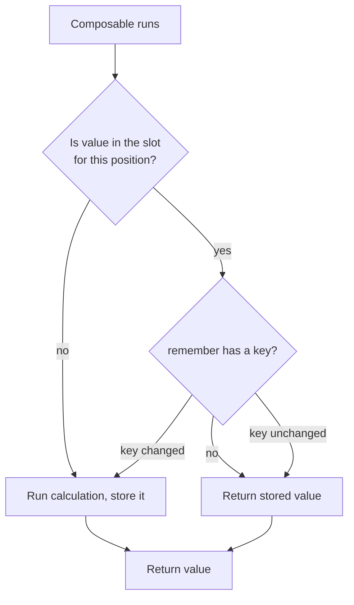

# Lesson 02 — `remember` & `mutableStateOf`

> After this lesson you can explain why state needs `remember` to survive recomposition, use the `by` delegate fluently, and key a `remember` correctly.

**Module:** 03 · **Lesson:** 02 · **Level:** 🟢🟡🔴 · **Est. time:** 60–75 min

---

## 1. Concept

### 🟢 For beginners

In Lesson 01 you saw `remember { mutableStateOf(0) }`. Those are **two different jobs** bolted together:

- `mutableStateOf(0)` makes the value **observable** (so the UI reacts to changes).
- `remember { ... }` makes the value **stick around** between recompositions.

Why does it need to stick around? Because a composable function **runs again** on every recomposition. If you wrote just `val count = mutableStateOf(0)`, you'd create a *brand-new* state holder set back to `0` every single time the function re-ran — your count would reset constantly. `remember` says: *"the first time you run me, compute this; every time after, hand me back the same thing."*

> `mutableStateOf` = "tell me when this changes." `remember` = "don't recompute this every time." You almost always need **both**.

### 🟡 For intermediate devs

`remember` stores a value in the **composition** at the call site's position and returns the stored value on subsequent recompositions. `mutableStateOf` returns a `MutableState<T>` whose `.value` is observable.

Two ergonomic upgrades you'll use everywhere:

```kotlin
import androidx.compose.runtime.getValue
import androidx.compose.runtime.setValue

var count by remember { mutableStateOf(0) }   // read/write `count` directly, no `.value`
```

The `by` keyword is Kotlin **property delegation**: `getValue`/`setValue` forward to the `MutableState`. Now `count` reads like a normal variable but is still observable.

**Keyed remember** recomputes when an input changes:

```kotlin
val formatted = remember(amount, currency) { formatMoney(amount, currency) }
```

If `amount` or `currency` changes, the lambda re-runs; otherwise the cached result is reused. Without keys, `remember` holds its **first** value forever, even if inputs change — a classic stale-value bug.

For collections, use the observable variants so mutations are tracked:

```kotlin
val items = remember { mutableStateListOf<Item>() }   // add/remove triggers recomposition
```

Important boundary: **`remember` does *not* survive configuration changes** (rotation) or process death. That's [Lesson 03](03-remembersaveable.md)'s `rememberSaveable`.

### 🔴 For senior devs

`remember` is **positional memoization** backed by the slot table (full detail in [Module 12](../module-12-internals/README.md)). The calculation lambda runs on first composition for that position; the result occupies a slot and is returned on later passes. A `remember(key)` stores the key alongside the value and re-invokes the lambda when the key isn't equal — so **key stability and equality matter** exactly as much as they do for recomposition.

Senior-grade nuances:

- **Primitive state types avoid autoboxing.** Prefer `mutableIntStateOf`, `mutableLongStateOf`, `mutableFloatStateOf`, `mutableDoubleStateOf` over `mutableStateOf<Int>()`. They expose `intValue`/etc. and skip boxing on every read/write — a real allocation win in hot paths (and the lint will nudge you).
- **Stale captures.** A lambda created during composition captures the values it closed over at that moment. If you `remember` a callback that reads a parameter, it can capture a stale value across recompositions — the fix is `rememberUpdatedState` ([Module 06](../module-06-side-effects/README.md)).
- **`remember` is not free persistence.** It lives and dies with its position in the composition. Navigate away and back (new composition) → gone. Survive config change → `rememberSaveable`. Survive process death with large/business state → a `ViewModel` + `SavedStateHandle` (Lesson 05).
- **Remember the holder, not a recomputation.** `remember { mutableStateOf(expensive()) }` runs `expensive()` once; `mutableStateOf(remember { expensive() })` is a code smell. And derived values should usually be `derivedStateOf`, not re-`remember`ed by hand (Lesson 06).

### Analogy

`remember` is a **sticky note pinned to one exact spot** on a whiteboard you redraw constantly. Each redraw, instead of writing "0" again, you read the sticky note that's already there. `remember(key)` is a sticky note with an expiry tag — when the tag changes, you write a fresh note.

### Mental model

> **`remember` answers "what did I compute here last time?"** Keys are how you say "…unless *this* changed."

### Real-world example

A card's expanded/collapsed flag, the selected tab index, a text field's contents, a "show password" toggle — small UI state that's local to one screen and only needs to live as long as the screen is composed.

---

## 2. Visual Learning

**ASCII — with vs. without `remember`:**
```text
WITHOUT remember                         WITH remember
recompose #1: count = mutableStateOf(0)  recompose #1: create + store → 0
recompose #2: count = mutableStateOf(0)  recompose #2: reuse stored    → 0,1,2…
recompose #3: count = mutableStateOf(0)  recompose #3: reuse stored    → keeps value
              ▲ resets every time                       ▲ value persists
```

**Mermaid — the keyed-remember decision:**


**Illustration prompt:**
```text
Illustration: a developer at a whiteboard that auto-erases and redraws every few seconds
(labeled RECOMPOSITION). In one corner, sticky notes are pinned to fixed spots labeled
REMEMBER — they stay put while everything around them redraws. One sticky note has a small
red expiry tag labeled "key" and is being swapped for a fresh note. Clean, modern, vibrant,
clear labels, soft lighting.
```

---

## 3. Code

### 🟢 Beginner — the `by` delegate

```kotlin
import androidx.compose.runtime.getValue
import androidx.compose.runtime.setValue

@Composable
fun Counter() {
    var count by remember { mutableStateOf(0) }   // no .value needed

    Button(onClick = { count++ }) {
        Text("Clicked $count times")
    }
}
```

**Explanation.** `remember` stores the `MutableState` once; `by` delegates `count`'s get/set to it. You read and write `count` like a normal variable, but it stays observable and persistent across recompositions.

**Common mistakes.**
```kotlin
val count = mutableStateOf(0)   // ❌ no remember → new state every recomposition → resets to 0
val count = remember { 0 }      // ❌ remembered, but a plain Int → not observable → UI won't update
```
The first forgets the value; the second forgets to be observable. You need `remember { mutableStateOf(0) }`.

**Best practices.**
- Default to the `by` delegate for readability.
- Use **`mutableIntStateOf`** (and the other primitive variants) for primitives to avoid boxing.

---

### 🟡 Intermediate — keys and observable collections

```kotlin
@Composable
fun ProductPrice(amount: Long, currency: String) {
    // Recompute ONLY when amount or currency changes.
    val label by remember(amount, currency) {
        derivedFormat(amount, currency).let { mutableStateOf(it) }
    }
    Text(label)
}

@Composable
fun EditableList() {
    val items = remember { mutableStateListOf("Apples", "Bread") } // observable list
    Column {
        items.forEachIndexed { i, item -> Text("${i + 1}. $item") }
        Button(onClick = { items.add("Item ${items.size + 1}") }) { Text("Add") }
    }
}
```

**Explanation.** `remember(amount, currency)` re-runs its lambda when either key changes, so `label` never goes stale. `mutableStateListOf` is an observable `SnapshotStateList` — `add`/`remove`/`set` each trigger recomposition of readers, unlike a plain `mutableListOf`.

**Common mistakes.**
- **Missing key:** `remember { format(amount) }` caches the *first* `amount` forever; the label won't update when `amount` changes. Add `remember(amount)`.
- **Mutating a plain collection:** `remember { mutableListOf() }` then `.add(...)` mutates in place with **no recomposition** — readers won't see the change. Use `mutableStateListOf`.
- **Over-keying:** keying on an unstable object that changes identity every recomposition makes `remember` pointless (recomputes constantly).

**Best practices.**
- Key `remember` on every input the computation depends on — no more, no less.
- Use `mutableStateListOf`/`mutableStateMapOf` for observable collections; prefer immutable lists in state you expose (Lesson 06).

---

### 🔴 Production — primitive state, scoped holders, and the modern text-field API

```kotlin
// A small screen-local UI-state holder, remembered as one unit.
@Stable
class LoginFieldsState {
    var password by mutableStateOf("")
    var passwordVisible by mutableStateOf(false)
}

@Composable
fun rememberLoginFieldsState(): LoginFieldsState = remember { LoginFieldsState() }

@Composable
fun LoginForm() {
    val fields = rememberLoginFieldsState()
    // 2026 idiom: the new text-field state API manages text + selection for you.
    val email = rememberTextFieldState()

    Column {
        BasicTextField(state = email, modifier = Modifier.fillMaxWidth())
        OutlinedTextField(
            value = fields.password,
            onValueChange = { fields.password = it },
            visualTransformation = if (fields.passwordVisible)
                VisualTransformation.None else PasswordVisualTransformation(),
            trailingIcon = {
                IconButton(onClick = { fields.passwordVisible = !fields.passwordVisible }) {
                    Icon(Icons.Default.Visibility, contentDescription = "Toggle password")
                }
            },
        )
    }
}
```

**Explanation.** Related UI state is grouped into a small `@Stable` holder and created with a `remember*` factory — a clean pattern that scales better than ten loose `remember`s. `rememberTextFieldState()` (the modern `BasicTextField` state API) manages text and cursor without you hoisting a `String` and an `onValueChange` for every field.

**Common mistakes.**
- Putting business logic in a UI-state holder. This holder is **UI-only**; anything that must survive process death or be tested in isolation belongs in a `ViewModel` (Lesson 05).
- Forgetting `@Stable` on a holder you pass around — it can defeat skipping (Module 11/12).

**Best practices.**
- Group cohesive UI state into a remembered holder; expose a `rememberXState()` factory.
- Reach for the new `TextFieldState` API for text input in 2026 code.
- Keep holders UI-scoped; graduate to a `ViewModel` when state outlives the composition or carries business rules.

---

## 4. Interview Questions

**🟢 Beginner**

1. *What does `remember` do?*
   > Caches a value in the composition at its call site so it isn't recomputed/reset on every recomposition.
2. *Why isn't `mutableStateOf` enough on its own?*
   > Without `remember`, a new `MutableState` is created each recomposition and the value resets. `mutableStateOf` provides observability; `remember` provides persistence across recompositions.

**🟡 Intermediate**

3. *`remember { }` vs `remember(key) { }`?*
   > The keyless form computes once and keeps that value for the lifetime of the composition at that position. The keyed form re-runs the calculation whenever a key changes (by equality) — used to recompute derived/expensive values when inputs change.
4. *Does `remember` survive a screen rotation?*
   > No. `remember` lives with the composition and is lost on configuration change/process death. Use `rememberSaveable` for that, or a `ViewModel` for larger/business state.
5. *What is the `by` delegate doing?*
   > Kotlin property delegation: `getValue`/`setValue` forward to the `MutableState`, letting you read/write the value without `.value`.

**🔴 Senior**

6. *Where does `remember` store its value, and why does that matter?*
   > In the **slot table** via positional memoization (Module 12). It's keyed by call-site position, so moving a call or changing structure can drop the remembered value; and `remember(key)` stores the key for equality comparison — unstable keys make it recompute constantly.
7. *Why prefer `mutableIntStateOf` over `mutableStateOf<Int>()`?*
   > It avoids autoboxing of the primitive on each read/write, reducing allocations in hot paths; it also exposes `intValue` and is the lint-recommended form.
8. *Describe a stale-capture bug with `remember`.*
   > A lambda remembered once captures the parameter values from its first composition; later recompositions with new params still see the old captured values. `rememberUpdatedState` keeps the latest value visible to a long-lived effect/callback without restarting it.

---

## 5. AI Assistant

**Prompt example:**
```text
Refactor this Compose state to: (1) use the `by` delegate, (2) use primitive state types
where applicable, (3) add a key to any remember whose result depends on a parameter.
Explain each key you add. Target: Compose 2026 BOM, Kotlin 2.x.
[paste code]
```

**AI workflow.**
- ✅ Good for: generating the `remember`/`mutableStateOf` boilerplate, converting `.value` access to delegates, suggesting `mutableStateListOf` for collections.
- ⚠️ Watch: models frequently **omit keys** (stale-value bugs) and reach for `ViewModel` when a local `remember` is correct.

**Review workflow — map to this lesson's *Common Mistakes*:**
- Is every observable value `remember { mutableStateOf(...) }` (not bare `mutableStateOf`, not bare `remember { value }`)?
- Does each derived `remember` have the **right keys**?
- Are collections `mutableStateListOf`/`mutableStateMapOf`, not plain mutable collections?
- Primitive state types used for primitives?

**Validation workflow:**
1. Compile and interact — the value should change and persist while you stay on screen.
2. **Rotate the device.** If the value resets, that's `remember` behaving correctly — and your cue that you need [Lesson 03](03-remembersaveable.md).
3. Change the keyed input and confirm the derived value updates (no stale value).
4. Run lint/Detekt to catch autoboxing and missing-key nudges.

---

## Recap / Key takeaways

- `mutableStateOf` = observability; `remember` = persistence across recomposition. Use both.
- The `by` delegate removes `.value` noise; primitive state types (`mutableIntStateOf`, …) avoid boxing.
- `remember(key)` recomputes on key change — missing keys cause stale values.
- Use `mutableStateListOf`/`mutableStateMapOf` for observable collections.
- `remember` does **not** survive rotation/process death → next lesson.

➡️ Next: **[Lesson 03 — `rememberSaveable`](03-remembersaveable.md)** — surviving configuration changes and process death.
