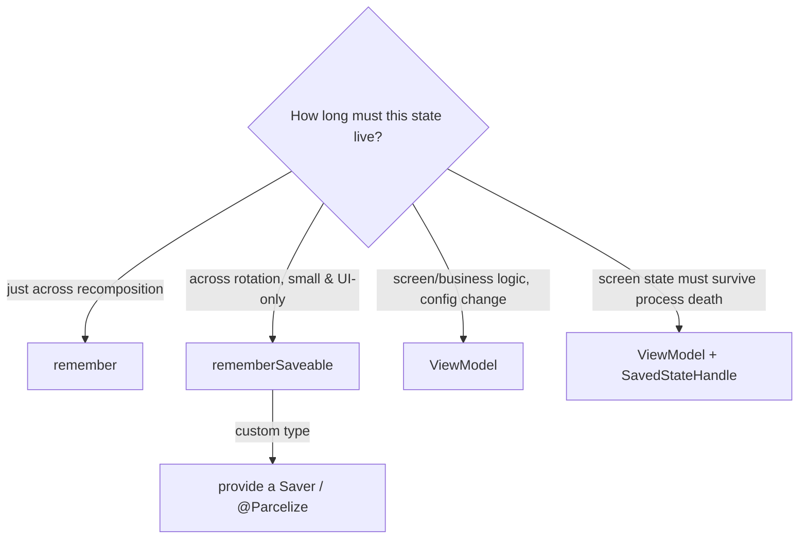

# Lesson 03 — `rememberSaveable`

> After this lesson you can keep UI state through rotation **and** process death, write a custom `Saver`, and choose between `rememberSaveable`, `ViewModel`, and `SavedStateHandle`.

**Module:** 03 · **Lesson:** 03 · **Level:** 🟢🟡🔴 · **Est. time:** 60–75 min

---

## 1. Concept

### 🟢 For beginners

You learned that `remember` forgets everything when the screen rotates. That's the bug behind "I typed my name, rotated the phone, and the field went blank."

`rememberSaveable` fixes it. It works just like `remember`, but it also **saves the value when the screen is destroyed and recreated** — like on rotation — and puts it back afterward. Change one word:

```kotlin
var name by rememberSaveable { mutableStateOf("") }   // survives rotation
```

It works automatically for simple values: numbers, booleans, `String`, and a few more. For your own classes you have to tell it *how* to save them (next tier).

### 🟡 For intermediate devs

`rememberSaveable` stores its value in the Android **saved instance state** (a `Bundle`), the same mechanism that survives configuration changes *and* **process death** (system kills your app in the background, user returns, Android rebuilds it). So `rememberSaveable` covers both, where `remember` covers neither.

It can save anything that fits in a `Bundle` out of the box:
- Primitives, `String`, `CharSequence`
- `Parcelable` (use `@Parcelize`) and `Serializable`
- Types you teach it via a **`Saver`**

For custom types, supply a `Saver` — usually via the helpers `listSaver` or `mapSaver` — or make the type `@Parcelize`. When wrapping a `MutableState` of a custom type, pass `stateSaver`:

```kotlin
var city by rememberSaveable(stateSaver = CitySaver) { mutableStateOf(City("Madrid", "Spain")) }
```

Many Compose state objects are already saveable: `rememberScrollState()`, `rememberLazyListState()`, `rememberPagerState()` restore scroll/position for you.

### 🔴 For senior devs

The saved `Bundle` is **small and serialized across a binder transaction** — exceed it and you risk `TransactionTooLargeException`. So the rule is hard: **`rememberSaveable` is for UI state, never business data.** Scroll position, selected tab, form input, wizard step — yes. A list of 500 products, a bitmap, a full domain model — no.

Know the three tools and their lifespans precisely:

| Tool | Survives recomposition | Survives config change | Survives process death | For |
|---|---|---|---|---|
| `remember` | ✅ | ❌ | ❌ | ephemeral UI state |
| `rememberSaveable` | ✅ | ✅ | ✅ | **small** UI state worth restoring |
| `ViewModel` | ✅ | ✅ | ❌* | screen/business state, logic |
| `ViewModel` + `SavedStateHandle` | ✅ | ✅ | ✅ | screen state that must survive death |

\*A plain `ViewModel` survives config change (it's retained) but is destroyed on process death unless its key state is in `SavedStateHandle`.

Saver design: a `Saver<Original, Saveable>` converts your type to/from a Bundle-friendly form. Keep the saveable form minimal (ids, not whole objects). Avoid the lazy anti-pattern of `android:configChanges` to "dodge" recreation — it doesn't help process death and breaks resource reloading. Restoration happens before the first composition completes, so values are present on the very first frame after recreation.

### Analogy

Rotation is the system **demolishing your room and rebuilding it**. `remember` leaves your notes on the desk — gone after the rebuild. `rememberSaveable` packs a **small overnight bag** (the `Bundle`) with the essentials, which the system hands back in the new room. The bag is small: pack a boarding pass (an id), not your wardrobe (the whole dataset).

### Mental model

> **Pick the holder by how long the state must live.** Recomposition → `remember`. Recreation/death of *UI* state → `rememberSaveable`. Screen/business state → `ViewModel` (+ `SavedStateHandle` if it must outlive death).

### Real-world example

A 4-step checkout wizard: the current step and the entered shipping fields are `rememberSaveable`, so rotating mid-checkout doesn't kick the user back to step 1 or wipe their address.

---

## 2. Visual Learning

**ASCII — lifespans:**
```text
event:        recomposition    rotation/config    process death
              ───────────────  ────────────────   ───────────────
remember            ✅                ❌                  ❌
rememberSaveable    ✅                ✅                  ✅   (small UI state)
ViewModel           ✅                ✅                  ❌
ViewModel+SSH       ✅                ✅                  ✅   (screen state)
```

**Mermaid — what saves what:**


**Illustration prompt:**
```text
Illustration: a phone rotating from portrait to landscape, drawn as a room being demolished
and rebuilt mid-spin. A small labeled "overnight bag" (BUNDLE) floats safely across the gap
carrying tiny icons: a text cursor, a checkbox, a scroll bar, a step number. A large filing
cabinet labeled "500 products / bitmap" is shown CROSSED OUT next to the bag — too big to pack.
Modern, vibrant, clear labels, soft gradient background.
```

---

## 3. Code

### 🟢 Beginner — one-word fix

```kotlin
@Composable
fun NameField() {
    var name by rememberSaveable { mutableStateOf("") }  // ← survives rotation
    OutlinedTextField(
        value = name,
        onValueChange = { name = it },
        label = { Text("Your name") },
    )
}
```

**Explanation.** Identical to `remember`, but the `String` is stored in saved instance state, so rotation/process death restores it.

**Common mistakes.**
```kotlin
var name by remember { mutableStateOf("") }   // ❌ blanks out on rotation
```
Using `remember` for input the user would hate to lose. If losing it on rotation is unacceptable, it's `rememberSaveable`.

**Best practices.**
- Default user-entered UI state (form fields, toggles, selected chips) to `rememberSaveable`.
- Keep it small — strings and primitives are ideal.

---

### 🟡 Intermediate — saving a custom type

```kotlin
data class City(val name: String, val country: String)

// Teach rememberSaveable how to serialize City into a Bundle-friendly map.
val CitySaver = mapSaver(
    save = { mapOf("name" to it.name, "country" to it.country) },
    restore = { City(it["name"] as String, it["country"] as String) },
)

@Composable
fun CityPicker() {
    var city by rememberSaveable(stateSaver = CitySaver) {
        mutableStateOf(City("Madrid", "Spain"))
    }
    // …UI that sets `city`…
    Text("Selected: ${city.name}, ${city.country}")
}
```

Or, simpler, make the type `Parcelable`:

```kotlin
@Parcelize
data class WizardData(val step: Int, val name: String) : Parcelable

@Composable
fun Wizard() {
    var data by rememberSaveable { mutableStateOf(WizardData(step = 0, name = "")) }
    // step + name now survive rotation with zero extra Saver code
}
```

**Explanation.** `mapSaver`/`listSaver` convert your class to/from a `Bundle`-safe shape. `@Parcelize` lets the type save itself. Use `stateSaver` when the saveable value is wrapped in a `MutableState`.

**Common mistakes.**
- **Custom class with no Saver and not `Parcelable`** → it can't be saved (compile/runtime failure or silent loss).
- **Saving heavy objects** (full domain entities, lists, bitmaps) → `TransactionTooLargeException` or jank. Save an **id**, re-fetch the rest.
- Forgetting `stateSaver` and passing the Saver to the `inputs` slot instead.

**Best practices.**
- Prefer `@Parcelize` for app-owned data classes; reach for `mapSaver`/`listSaver` for types you can't annotate.
- Save the **minimum** needed to reconstruct (ids/keys), not whole objects.

---

### 🔴 Production — the right division of labor

```kotlin
// Screen/business state that must survive process death → ViewModel + SavedStateHandle.
class CheckoutViewModel(private val handle: SavedStateHandle) : ViewModel() {
    var currentStep by handle.saveable { mutableStateOf(0) }   // saved across death
        private set

    fun next() { currentStep = (currentStep + 1).coerceAtMost(3) }
}

@Composable
fun CheckoutScreen(vm: CheckoutViewModel = viewModel()) {
    // Pure UI state stays local & saveable; screen state lives in the ViewModel.
    val listState = rememberLazyListState()          // already saveable: scroll restored
    var showHelp by rememberSaveable { mutableStateOf(false) }

    LazyColumn(state = listState) { /* steps … */ }
    // currentStep comes from vm; showHelp & scroll are UI-only
}
```

**Explanation.** Three lifespans, three homes: scroll position and a help toggle are **UI-only** → `rememberSaveable` (and the built-in saveable `LazyListState`); `currentStep` is **screen state that must survive process death** → `SavedStateHandle.saveable`. No business data is shoved into a `Bundle`.

**Common mistakes.**
- Putting `currentStep` in `rememberSaveable` when it drives business logic and is read by the ViewModel — split UI vs. screen state deliberately.
- Putting large cart contents in `SavedStateHandle` — store the cart id; rehydrate from the repository (Lesson 06).

**Best practices.**
- **UI-only ephemeral state** → `rememberSaveable`. **Screen state needing death-survival** → `SavedStateHandle`. **Big/business data** → repository, keyed by id.
- Use the built-in saveable state objects (`rememberLazyListState`, `rememberScrollState`, `rememberPagerState`) — don't reinvent scroll restoration.

---

## 4. Interview Questions

**🟢 Beginner**

1. *`remember` vs `rememberSaveable`?*
   > Both persist across recomposition; only `rememberSaveable` also restores after configuration change/process death by saving into instance state.
2. *Name three things that should be `rememberSaveable`.*
   > Text-field contents, a selected tab/filter, a wizard step, scroll position — small UI state a user would hate to lose on rotation.

**🟡 Intermediate**

3. *What types can `rememberSaveable` store, and how do you save a custom one?*
   > Anything `Bundle`-compatible: primitives, `String`, `Parcelable`/`Serializable`. For custom types, provide a `Saver` (`mapSaver`/`listSaver`) or make it `@Parcelize`; use `stateSaver` when wrapping a `MutableState`.
4. *Does a `ViewModel` make `rememberSaveable` unnecessary?*
   > No. A plain `ViewModel` survives config change but **not** process death, and it's the wrong place for purely-UI ephemeral state. They're complementary.

**🔴 Senior**

5. *When do you choose `rememberSaveable` vs `ViewModel` vs `SavedStateHandle`?*
   > UI-only ephemeral state → `rememberSaveable`. Screen/business state + logic → `ViewModel`. Screen state that must survive process death → `ViewModel` with `SavedStateHandle`. Large data → repository keyed by id, never a Bundle.
6. *What's the danger of over-using `rememberSaveable`?*
   > The saved `Bundle` crosses a binder transaction with a size cap; large payloads cause `TransactionTooLargeException` and jank. Save minimal keys/ids and rehydrate the rest.
7. *Why is `android:configChanges` not a substitute?*
   > It only dodges recreation on config change; it doesn't help process death and breaks correct resource reloading. State restoration is the robust fix.

---

## 5. AI Assistant

**Prompt example:**
```text
Here are the state variables in my screen: [list with types and purpose].
Classify each as remember / rememberSaveable / ViewModel / SavedStateHandle, with reasons.
For any custom type that should be saveable, write a Saver or mark it @Parcelize.
Target: Compose 2026, Kotlin 2.x.
```

**AI workflow.**
- ✅ Good for: generating `mapSaver`/`listSaver`/`@Parcelize` boilerplate; suggesting a state-placement table.
- ⚠️ Watch: models will cheerfully `rememberSaveable` a 500-item list or a domain entity — exactly the size mistake.

**Review workflow — map to *Common Mistakes*:**
- Is anything **large or business-y** being saved? Move it to a repository keyed by id.
- Do custom saved types have a `Saver` or `@Parcelize`, with `stateSaver` used correctly?
- Is UI-only vs. screen state split deliberately (not everything dumped in one place)?

**Validation workflow — actually prove restoration:**
1. **Rotate** the device — value should persist.
2. Simulate process death: Developer Options → **"Don't keep activities"**, background the app, return — value should restore. (Or `adb shell am kill <package>` while backgrounded.)
3. Confirm no `TransactionTooLargeException` in Logcat with realistic data sizes.

---

## Recap / Key takeaways

- `rememberSaveable` = `remember` that also survives **config change and process death** via the saved `Bundle`.
- Works for `Bundle`-friendly types; custom types need a `Saver` or `@Parcelize` (use `stateSaver` with `MutableState`).
- It's for **small UI state only** — large/business data goes to a repository keyed by id.
- Choose holder by lifespan: `remember` < `rememberSaveable` / `ViewModel` < `ViewModel`+`SavedStateHandle`.
- Built-in saveable states (`LazyListState`, `ScrollState`, `PagerState`) restore scroll for free.

➡️ Next: **[Lesson 04 — State hoisting](04-state-hoisting.md)** — making composables stateless, reusable, and testable.
