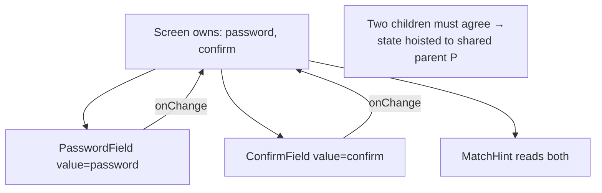

# Lesson 04 — State Hoisting

> After this lesson you can split any composable into a stateless, reusable view plus a state owner, and decide *where* state should be hoisted to.

**Module:** 03 · **Lesson:** 04 · **Level:** 🟢🟡🔴 · **Est. time:** 70–85 min

---

## 1. Concept

### 🟢 For beginners

**State hoisting just means moving state *up*, out of a small component, to whoever owns it.** The small component stops holding its own data. Instead it:

- receives the data to show (a `value`), and
- reports events back up (a callback like `onValueChange`).

A component that holds no state of its own is **stateless**. Stateless components are wonderful: you can reuse them anywhere, preview them in any state, and test them by just passing values.

```text
Stateful (owns state)              Stateless (owns nothing)
└─ holds count                     └─ shows the count it's given
   passes count down ──────────▶      reports taps back up
```

### 🟡 For intermediate devs

The hoisting pattern has a precise shape. A stateless composable takes:

```kotlin
@Composable
fun Stepper(value: Int, onValueChange: (Int) -> Unit) { … }
```

`value` flows **down** (state), `onValueChange` flows **up** (events). This is **Unidirectional Data Flow** in miniature ([Lesson 05](05-udf-mvi-mvvm.md) scales it to whole screens).

**Where do you hoist to?** The rule: **hoist state to the lowest common ancestor of every composable that reads or writes it.** If only one composable uses it, keep it local. If two siblings must agree (a password and a "confirm password" that compare), hoist to their shared parent.

Benefits you're buying:
- **Single source of truth** — one owner, no copies to desync.
- **Reusable & testable** — the stateless view works in any context and previews trivially.
- **Controllable & interceptable** — the owner can validate, transform, or veto changes.

You'll often provide **two** versions: a stateless `Stepper(value, onValueChange)` and a convenience stateful `Stepper()` that owns a default `remember`ed state for quick use.

### 🔴 For senior devs

Hoisting is a balance, and both extremes hurt:

- **Under-hoisting** traps state inside a component: you can't share it, test specific states, or control it from outside. Symptom: a "reusable" widget you can't actually reuse.
- **Over-hoisting** lifts everything to the top: **prop drilling** (threading values through many layers), a **god composable** that owns unrelated state, and a **wider recomposition blast radius** (the high-up owner recomposes for every little change). Symptom: one screen-level composable with 20 `remember`s.

The middle tier is the **plain state holder** — a regular `@Stable` class created with a `rememberXState()` factory. It groups related state + logic without the ceremony of a `ViewModel`, and it's the natural home for complex *UI* state (a scaffold-like component, a custom form). Graduate to a `ViewModel` when state must survive config change/process death or carries business logic (Lesson 05).

Hoisting and **recomposition**: passing `value` down means the child recomposes when `value` changes — exactly what you want. With **Strong Skipping** (the 2026 default), lambdas like `onValueChange = { … }` are auto-remembered, so the old "wrap every callback in `remember` to preserve skipping" chore is largely gone — but stable parameter types still matter (Module 12). Think of stateless composables as **controlled components**: they render what they're told and announce intent; the owner decides what actually happens.

### Analogy

A **TV and its remote**. The remote (stateless component) doesn't store the channel — it sends "channel up" events. The TV (state owner) holds the current channel and updates the screen. Hand the same remote to any TV and it works, because it owns nothing. A remote that secretly remembered its *own* channel would immediately disagree with the TV — the classic hoisting bug.

### Mental model

> **State flows down, events flow up.** A stateless composable is a pure `f(value)` that reports intent; the owner holds the truth and decides.

### Real-world example

A `SearchBar(query, onQueryChange, onClear)` reused on the home, catalog, and orders screens. Each screen owns its own `query` state; the bar is identical everywhere because it owns nothing.

---

## 2. Visual Learning

**ASCII — down/up flow:**
```text
        owns state
   ┌────────────────────┐
   │  StatefulParent    │  count = rememberSaveable { 0 }
   └─────────┬──────────┘
   value ↓   │   ↑ event (onIncrement)
   ┌─────────▼──────────┐
   │ StatelessStepper   │  renders `value`, calls `onIncrement`
   └────────────────────┘
```

**Mermaid — hoist to the lowest common ancestor:**


**Illustration prompt:**
```text
Illustration: a TV on a wall (labeled STATE OWNER, showing 'Channel 7') and a hand holding
a remote (labeled STATELESS). Glowing arrows: a downward beam from TV to remote labeled "value",
and an upward beam from remote to TV labeled "event: channel up". A second faded remote that
secretly shows its own different channel number is marked with a red X labeled "two sources of
truth". Clean, modern, vibrant, labeled.
```

---

## 3. Code

### 🟢 Beginner — split stateful from stateless

```kotlin
// Stateless: owns nothing — reusable, previewable, testable.
@Composable
fun CounterButton(count: Int, onIncrement: () -> Unit, modifier: Modifier = Modifier) {
    Button(onClick = onIncrement, modifier = modifier) {
        Text("Count: $count")
    }
}

// Stateful: owns the state, delegates the rendering.
@Composable
fun CounterScreen() {
    var count by rememberSaveable { mutableStateOf(0) }
    CounterButton(count = count, onIncrement = { count++ })
}

@Preview
@Composable
private fun CounterButtonPreview() {
    CounterButton(count = 42, onIncrement = {})  // any state, instantly previewable
}
```

**Explanation.** The state lives in `CounterScreen`; `CounterButton` is a pure function of its `count`. Because it owns nothing, you can preview it at `count = 42` and test it without rotating, tapping, or mocking.

**Common mistakes.**
```kotlin
// ❌ State trapped inside the "reusable" component — you can't control or test its states.
@Composable
fun CounterButton() {
    var count by remember { mutableStateOf(0) }
    Button(onClick = { count++ }) { Text("Count: $count") }
}
```
Now no parent can set, reset, or observe the count, and a preview can't show `count = 42`.

**Best practices.**
- Keep leaf UI composables **stateless**; own state at the parent that needs it.
- `value` down, event-callback up.

---

### 🟡 Intermediate — reuse, and the half-hoisting trap

```kotlin
// One stateless field, reused across screens.
@Composable
fun LabeledField(value: String, onValueChange: (String) -> Unit, label: String) {
    OutlinedTextField(value = value, onValueChange = onValueChange, label = { Text(label) })
}

@Composable
fun SignupScreen() {
    var email by rememberSaveable { mutableStateOf("") }
    var name by rememberSaveable { mutableStateOf("") }
    Column {
        LabeledField(name, { name = it }, "Name")
        LabeledField(email, { email = it }, "Email")
    }
}
```

**Common mistakes — half-hoisting (two sources of truth):**
```kotlin
// ❌ Takes `value` but ALSO keeps its own copy → they drift apart.
@Composable
fun LabeledField(value: String, onValueChange: (String) -> Unit) {
    var internal by remember { mutableStateOf(value) }       // second source of truth
    OutlinedTextField(internal, { internal = it; onValueChange(it) })
}
```
When the parent changes `value` externally (a "Clear" button sets `email = ""`), `internal` doesn't update — the field still shows the old text. A hoisted component must **render `value` directly**, never shadow it.

Also wrong: **over-hoisting** — lifting `name`/`email` to the app root and threading them through five layers when only `SignupScreen` uses them.

**Best practices.**
- A hoisted value has exactly one owner; the stateless view renders it directly.
- Hoist to the **lowest common ancestor** — no higher.

---

### 🔴 Production — a state holder (the bridge to ViewModel)

```kotlin
@Stable
class SignupFormState {
    var name by mutableStateOf("")
        private set
    var email by mutableStateOf("")
        private set

    val emailError: String?
        get() = if (email.isNotEmpty() && "@" !in email) "Invalid email" else null
    val isValid: Boolean
        get() = name.isNotBlank() && emailError == null && email.isNotBlank()

    fun onName(value: String) { name = value }
    fun onEmail(value: String) { email = value.trim() }
}

@Composable
fun rememberSignupFormState(): SignupFormState = remember { SignupFormState() }

@Composable
fun SignupForm(state: SignupFormState = rememberSignupFormState()) {
    Column {
        LabeledField(state.name, state::onName, "Name")
        LabeledField(state.email, state::onEmail, "Email")
        state.emailError?.let { Text(it, color = MaterialTheme.colorScheme.error) }
        Button(onClick = { /* submit */ }, enabled = state.isValid) { Text("Sign up") }
    }
}
```

**Explanation.** Related state + validation logic are grouped into one `@Stable` holder with a `private set` (callers change it only through methods — encapsulation). Validation is **derived** via computed properties, so there's nothing to keep in sync. The holder is hoistable (pass it in) yet self-contained. This is exactly the shape a `ViewModel` takes in Lesson 05 — minus the lifecycle.

**Common mistakes.**
- Exposing `var name` as public mutable from a holder → callers bypass your logic; keep `private set` + methods.
- Storing `isValid`/`emailError` as separate state → they drift; derive them.
- Leaving the holder off `@Stable` → it may be treated as unstable and defeat skipping (Module 11/12).

**Best practices.**
- Group cohesive UI state + logic into a `@Stable` holder with a `rememberXState()` factory.
- Expose read-only state + intent methods; derive anything computable.
- With Strong Skipping (2026), don't over-wrap callbacks in `remember` — method references (`state::onName`) read cleanly and are stable.

---

## 4. Interview Questions

**🟢 Beginner**

1. *What is state hoisting?*
   > Moving state out of a composable up to a caller, so the composable becomes stateless and receives `value` + an `onValueChange`-style callback.
2. *What's a stateless composable and why is it good?*
   > One that holds no state of its own. It's reusable, previewable in any state, and testable by passing values.

**🟡 Intermediate**

3. *Describe the `value` + `onValueChange` pattern and the data-flow direction.*
   > The composable receives `value` (state flows **down**) and emits changes via `onValueChange` (events flow **up**) — unidirectional data flow.
4. *Where should state be hoisted to?*
   > To the lowest common ancestor of all composables that read or write it — local if only one uses it, the shared parent if siblings must agree.
5. *What goes wrong if a hoisted component also keeps its own `remember`ed copy of the value?*
   > Two sources of truth: when the parent updates `value` externally, the internal copy doesn't, and the UI shows stale data.

**🔴 Senior**

6. *Contrast the costs of over-hoisting vs under-hoisting.*
   > Under-hoisting traps state (no sharing, testing, or external control). Over-hoisting causes prop drilling, god composables, and a wider recomposition scope because a high-up owner recomposes for unrelated changes. Hoist to the lowest common ancestor.
7. *When do you use a plain state holder vs a `ViewModel`?*
   > A state holder (a `@Stable` class via `rememberXState()`) for complex **UI** state with no lifecycle needs. A `ViewModel` when state must survive config change/process death or carries business logic and depends on repositories.
8. *How does Strong Skipping change hoisting ergonomics?*
   > Compose now auto-remembers lambdas, so you rarely need to manually `remember` callbacks to preserve skipping. Stable parameter types still matter; passing an unstable object down can still force recomposition.

---

## 5. AI Assistant

**Prompt example:**
```text
Refactor this stateful composable into (1) a stateless version taking value + onValueChange,
and (2) a thin stateful wrapper that owns the state. Hoist any state shared by siblings to
their lowest common ancestor. Flag any "half-hoisting" where a component keeps an internal
copy of a hoisted value. Target: Compose 2026, Kotlin 2.x.
[paste code]
```

**AI workflow.**
- ✅ Good for: the mechanical stateful→stateless split, generating previews, drafting a state-holder class.
- ⚠️ Watch: models frequently introduce **half-hoisting** (internal `remember` shadowing `value`) and sometimes **over-hoist** to the top.

**Review workflow — map to *Common Mistakes*:**
- Does the stateless composable render `value` **directly**, with no internal `remember` of it?
- Is state at the **lowest common ancestor**, not the app root?
- Holder exposes read-only state + intent methods; derived values derived, not stored?

**Validation workflow:**
1. **Preview** the stateless composable in 2–3 states (empty, valid, error) — if you can't, it isn't truly stateless.
2. Add an external control (a "Clear" button in the parent) and confirm the field updates — catches half-hoisting.
3. Unit-test the holder's logic (`isValid`, `emailError`) with plain assertions — no Compose needed.

---

## Recap / Key takeaways

- **Hoisting** = move state up; the component becomes **stateless** (`value` down, events up).
- Hoist to the **lowest common ancestor** — not lower (trapped), not higher (prop drilling).
- A hoisted component renders `value` directly; keeping an internal copy creates two sources of truth.
- **State holders** (`@Stable` + `rememberXState()`) group complex UI state; `ViewModel` is the next step up.
- Strong Skipping (2026) auto-remembers lambdas — focus on stable types, not manual callback memoization.

➡️ Next: **[Lesson 05 — UDF, MVI & MVVM](05-udf-mvi-mvvm.md)** — scaling these ideas to whole screens with a ViewModel.
