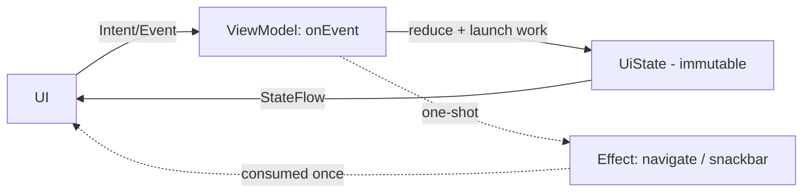
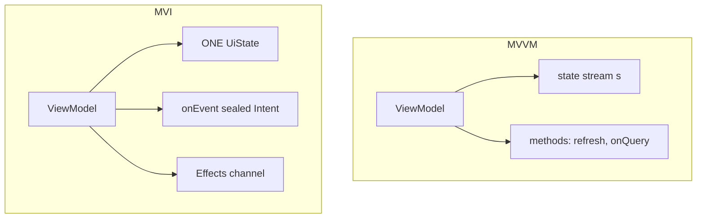

# Lesson 05 — UDF, MVI & MVVM

> After this lesson you can structure a whole screen with a `ViewModel`, a single immutable `UiState`, unidirectional events, and one-shot effects — and explain when MVI beats MVVM.

**Module:** 03 · **Lesson:** 05 · **Level:** 🟢🟡🔴 · **Est. time:** 90–110 min

---

## 1. Concept

### 🟢 For beginners

In Lesson 04 you hoisted state up to a parent composable. Now we hoist it one more level — into a **`ViewModel`**, an object that:

- **survives rotation** (Android keeps it across configuration changes),
- **holds the screen's state**, and
- **handles events** the UI sends it.

The data still flows in one direction: **state flows down** to the UI, **events flow up** to the ViewModel, which produces the next state. That one-way loop is **Unidirectional Data Flow (UDF)**. **MVVM** and **MVI** are two named ways to organize it.

### 🟡 For intermediate devs

The standard 2026 shape: the ViewModel exposes a `StateFlow<UiState>`; the UI collects it lifecycle-aware and renders; events are method calls.

```kotlin
val state by viewModel.uiState.collectAsStateWithLifecycle()
```

**MVVM (Model–View–ViewModel):** the ViewModel exposes observable state and methods (`refresh()`, `onQueryChange(q)`). Pragmatic and ubiquitous. Risk: state can sprawl across several streams.

**MVI (Model–View–Intent):** tightens MVVM into three rules:
1. **One** immutable `UiState` object for the screen (a consistent snapshot).
2. Events modeled as a **sealed `Intent`/`Event`** type, sent through a single `onEvent(event)` **reducer**.
3. **One-shot effects** (navigate, show a snackbar) sent through a separate channel — *not* stored in state.

Model the state to express reality: `isLoading`, `items`, `error` in one object so the UI always sees a coherent combination.

### 🔴 For senior devs

The decisions that separate juniors from seniors here:

- **One state object vs. many flows.** A single `UiState` gives every frame a **consistent snapshot** — you can't render "loading = true *and* a stale error" by accident. Multiple independent flows can momentarily show impossible combinations (UI *tearing*). Prefer one object, or `combine` into one.
- **One-shot events must not live in state.** If "navigate to payment" is a boolean in `UiState`, it re-fires on every recomposition and again after rotation (the state is restored). Emit one-shot effects through a `Channel`/`SharedFlow` consumed once. This is the single most common MVI bug.
- **`StateFlow` vs Compose `State` in the ViewModel.** Both work. `StateFlow` is platform-agnostic (testable with Turbine, usable outside Compose, easy to `combine`); Compose `mutableStateOf` in a ViewModel is fine too but couples the VM to the Compose runtime. Most teams standardize on `StateFlow` + `collectAsStateWithLifecycle`.
- **`collectAsStateWithLifecycle` vs `collectAsState`.** The lifecycle-aware version **stops collecting when the app is in the background**, preventing wasted work and stale updates. It's the correct default on Android.
- **Make illegal states unrepresentable.** A `sealed interface UiState { Loading; Success(data); Error(msg) }` is often better than a data class full of nullable flags, because the compiler forbids contradictory combinations.
- **Reducers should be pure-ish.** `onEvent` computes the next state from the current state and the event; side effects (network) are launched in `viewModelScope`, and their *results* feed back as state updates. Keep the state transition deterministic and testable.

### Analogy

**MVI is a vending machine.** You can't reach inside and rearrange the cans. You press a labeled button (an **Intent**). Internal logic moves through well-defined **states** — *Idle → Selecting → Dispensing → Done* — and the display (your **UiState**) shows exactly one at a time. The thunk of a can dropping is a **one-shot effect** — it happens once, it isn't part of the persistent display. **MVVM** is a helpful shopkeeper who exposes several live readouts you can watch and asks what you want.

### Mental model

> **One immutable state flows down; events flow up to the ViewModel, the only thing allowed to produce the next state.** One-shot things (navigation, toasts) go out a side door, consumed once.

### Real-world example

A social feed: `FeedViewModel` exposes `FeedUiState(isLoading, posts, error)`. Pull-to-refresh sends a `Refresh` event; tapping a post sends `OpenPost(id)`, which emits a `Navigate` **effect** consumed once by the UI.

---

## 2. Visual Learning

**ASCII — the UDF loop with a ViewModel:**
```text
   ┌──────────────────────── ViewModel ────────────────────────┐
   │  state: StateFlow<UiState>          onEvent(Event)         │
   │      │ (immutable, one object)          ▲                  │
   └──────┼─────────────────────────────────┼──────────────────┘
   state ▼ collectAsStateWithLifecycle      │ events (method/intent)
   ┌──────────────────────── Composable ─────┴──────────────────┐
   │  renders state          buttons call onEvent(...)          │
   └────────────────────────────────────────────────────────────┘
                         one-shot effects ──▶ (navigate / snackbar) consumed once
```

**Mermaid — MVI cycle:**


**MVVM vs MVI at a glance:**


**Illustration prompt:**
```text
Illustration: a stylized vending machine. The front display is a single glowing panel labeled
"UiState" cycling Idle → Loading → Success. A row of physical buttons is labeled "Intents"
(Add, Remove, Checkout). A coin-return slot at the bottom emits a one-time sparkle labeled
"one-shot effect: navigate". A thick arrow shows buttons → internal reducer → display, never
a hand reaching inside. Modern, vibrant, labeled, soft studio lighting.
```

---

## 3. Code

### 🟢 Beginner — a ViewModel + StateFlow

```kotlin
class CounterViewModel : ViewModel() {
    private val _count = MutableStateFlow(0)
    val count: StateFlow<Int> = _count.asStateFlow()   // read-only to the world

    fun increment() = _count.update { it + 1 }
}

@Composable
fun CounterRoute(vm: CounterViewModel = viewModel()) {
    val count by vm.count.collectAsStateWithLifecycle()
    CounterButton(count = count, onIncrement = vm::increment)  // stateless view from Lesson 04
}
```

**Explanation.** The ViewModel owns the state and survives rotation. The UI collects it lifecycle-aware and forwards events as method references. The composable stays stateless.

**Common mistakes.**
```kotlin
val count: MutableStateFlow<Int> = MutableStateFlow(0)   // ❌ exposes mutability to the UI
val count by vm.count.collectAsState()                   // ❌ keeps collecting in the background
```
**Best practices.** Expose `asStateFlow()` (read-only); always `collectAsStateWithLifecycle()` on Android.

---

### 🟡 Intermediate — one immutable `UiState` (MVVM)

```kotlin
data class FeedUiState(
    val isLoading: Boolean = true,
    val posts: List<Post> = emptyList(),
    val error: String? = null,
)

class FeedViewModel(private val repo: FeedRepository) : ViewModel() {
    private val _state = MutableStateFlow(FeedUiState())
    val state: StateFlow<FeedUiState> = _state.asStateFlow()

    init { refresh() }

    fun refresh() {
        viewModelScope.launch {
            _state.update { it.copy(isLoading = true, error = null) }
            runCatching { repo.loadFeed() }
                .onSuccess { posts -> _state.update { it.copy(isLoading = false, posts = posts) } }
                .onFailure { e -> _state.update { it.copy(isLoading = false, error = e.message) } }
        }
    }
}
```

**Explanation.** All screen state lives in one immutable object, updated with `copy`. Every emission is a coherent snapshot — the UI never sees `isLoading = true` paired with a stale error, because they change together.

**Common mistakes.**
```kotlin
// ❌ Three independent flows → the UI can render impossible combinations (tearing).
val isLoading = MutableStateFlow(true)
val posts = MutableStateFlow(emptyList<Post>())
val error = MutableStateFlow<String?>(null)
```
- Mutating the list in place (`posts.value.add(...)`) instead of emitting a new immutable list.
- Forgetting to reset `error` on a new load.

**Best practices.** One `UiState`; update via `copy`; if you must have multiple sources, `combine` them into one before exposing.

---

### 🔴 Production — full MVI with one-shot effects (the cart)

```kotlin
// State — derived values are computed, never stored.
data class CartUiState(
    val items: List<CartItem> = emptyList(),
    val isCheckingOut: Boolean = false,
) {
    val total: Long get() = items.sumOf { it.unitPrice * it.qty }  // single source of truth
    val isEmpty: Boolean get() = items.isEmpty()
}

// Intents in…
sealed interface CartEvent {
    data class Add(val product: Product) : CartEvent
    data class Remove(val id: String) : CartEvent
    data object Checkout : CartEvent
}
// …effects out (one-shot).
sealed interface CartEffect {
    data class ShowMessage(val text: String) : CartEffect
    data object NavigateToPayment : CartEffect
}

class CartViewModel(private val repo: CartRepository) : ViewModel() {
    private val _state = MutableStateFlow(CartUiState())
    val state: StateFlow<CartUiState> = _state.asStateFlow()

    private val _effects = Channel<CartEffect>(Channel.BUFFERED)
    val effects = _effects.receiveAsFlow()

    fun onEvent(event: CartEvent) {
        when (event) {
            is CartEvent.Add    -> _state.update { it.copy(items = it.items.upsert(event.product)) }
            is CartEvent.Remove -> _state.update { it.copy(items = it.items.filterNot { i -> i.id == event.id }) }
            CartEvent.Checkout  -> checkout()
        }
    }

    private fun checkout() {
        if (_state.value.isEmpty) {
            _effects.trySend(CartEffect.ShowMessage("Your cart is empty"))
            return
        }
        _state.update { it.copy(isCheckingOut = true) }
        _effects.trySend(CartEffect.NavigateToPayment)
    }
}
```

```kotlin
@Composable
fun CartRoute(
    vm: CartViewModel = viewModel(),
    onNavigateToPayment: () -> Unit,
) {
    val state by vm.state.collectAsStateWithLifecycle()
    val snackbar = remember { SnackbarHostState() }

    // Consume one-shot effects exactly once (LaunchedEffect — see Module 06).
    LaunchedEffect(Unit) {
        vm.effects.collect { effect ->
            when (effect) {
                is CartEffect.ShowMessage   -> snackbar.showSnackbar(effect.text)
                CartEffect.NavigateToPayment -> onNavigateToPayment()
            }
        }
    }

    CartScreen(state = state, onEvent = vm::onEvent, snackbarHostState = snackbar)
}
```

**Explanation.** One immutable `CartUiState`; `total` is **derived**, so it can never disagree with `items`. Every interaction is a typed `CartEvent` funneled through one `onEvent` reducer. Navigation and messages are **one-shot effects** on a `Channel`, consumed once in a `LaunchedEffect` — so they don't re-fire on recomposition or after rotation.

**Common mistakes.**
- **One-shot events in `UiState`** (e.g. `navigateToPayment: Boolean`) → fires again on every recomposition and after process death restores the flag. Use a `Channel`/`SharedFlow`.
- **Storing `total` as state** → drifts from `items`. Derive it.
- `collectAsState` instead of `collectAsStateWithLifecycle` → background collection.
- Exposing `MutableStateFlow`/`Channel` directly → the UI can corrupt your truth.

**Best practices.**
- One immutable state; derive computed values; typed events through one reducer.
- One-shot effects via `Channel`/`SharedFlow`, consumed in a lifecycle-aware collector.
- Keep `onEvent` deterministic; launch I/O in `viewModelScope` and feed results back as state.
- Persist only ids in `SavedStateHandle`; rehydrate data from the repository (Lesson 06).

---

## 4. Interview Questions

**🟢 Beginner**

1. *What is Unidirectional Data Flow?*
   > State flows down to the UI; events flow up to a holder (ViewModel) that produces the next state. Data moves one direction, making the screen predictable.
2. *What does a `ViewModel` give you over `rememberSaveable`?*
   > It survives configuration changes, holds screen state and logic, and integrates with `viewModelScope` and repositories — the right home for business/screen state.

**🟡 Intermediate**

3. *MVVM vs MVI — what's the difference?*
   > Both are UDF. MVVM exposes observable state + methods, pragmatically. MVI adds discipline: one immutable `UiState`, events as a sealed `Intent` through a single reducer, and one-shot effects on a separate channel.
4. *Why prefer a single `UiState` object over separate `isLoading`/`data`/`error` flows?*
   > A single object is always a consistent snapshot; independent flows can momentarily combine into impossible states (UI tearing).
5. *`collectAsState` vs `collectAsStateWithLifecycle`?*
   > The lifecycle-aware version pauses collection when the app is backgrounded, avoiding wasted work and stale emissions; it's the Android default.

**🔴 Senior**

6. *How do you handle one-shot events like navigation or a snackbar in MVI?*
   > Not in state — emit them through a `Channel` or `SharedFlow` and consume once in a lifecycle-aware collector. Putting them in `UiState` causes re-fires on recomposition and after process-death restoration.
7. *`StateFlow` vs `mutableStateOf` inside a ViewModel — trade-offs?*
   > `StateFlow` is platform-agnostic, easy to test (Turbine) and `combine`, and decoupled from Compose. `mutableStateOf` in a VM works and is ergonomic but couples the VM to the Compose runtime. Most teams standardize on `StateFlow`.
8. *How do you make illegal states unrepresentable?*
   > Model `UiState` as a `sealed interface` (Loading/Success/Error) instead of a bag of nullable flags, so contradictory combinations won't compile. Derive computed values rather than storing them.

---

## 5. AI Assistant

**Prompt example:**
```text
Refactor this ViewModel to MVI: (1) collapse the separate isLoading/data/error flows into one
immutable UiState exposed as StateFlow; (2) model user actions as a sealed CartEvent handled by
one onEvent reducer; (3) move navigation/snackbar to a one-shot effects Channel consumed in a
LaunchedEffect. Keep derived values (total) computed, not stored. Target: Compose 2026, Kotlin 2.x.
[paste code]
```

**AI workflow.**
- ✅ Good for: generating the `UiState`/`Event`/`Effect` scaffolding, the reducer skeleton, and the route wiring.
- ⚠️ Watch: models routinely **put one-shot events in state**, expose `MutableStateFlow`, store derived values, and use `collectAsState`.

**Review workflow — map to *Common Mistakes*:**
- One immutable `UiState`? Derived values derived?
- One-shot effects on a `Channel`/`SharedFlow`, not booleans in state?
- Read-only exposure (`asStateFlow()`), lifecycle-aware collection?
- Reducer deterministic; I/O in `viewModelScope` feeding results back as state?

**Validation workflow:**
1. **Rotate** mid-flow: state persists; the snackbar/navigation does **not** re-fire (proves effects aren't in state).
2. Unit-test the reducer: feed events, assert next `UiState` (no Compose needed).
3. Test the `StateFlow` with **Turbine**: `awaitItem()` through loading → success/error.
4. Toggle "Don't keep activities": screen state restores via `SavedStateHandle`; large data rehydrates from the repo.

---

## Recap / Key takeaways

- **UDF**: state down, events up; the **ViewModel** is the only producer of the next state.
- **MVVM** = observable state + methods; **MVI** = one immutable `UiState` + sealed events + a reducer + an effects channel.
- One state object = consistent snapshots; derive computed values; **never store one-shot events in state**.
- Expose read-only `StateFlow`; collect with `collectAsStateWithLifecycle`.
- Make illegal states unrepresentable with sealed types.

➡️ Next: **[Lesson 06 — Advanced state](06-advanced-state.md)** — single source of truth across screens, immutability/stability, and `derivedStateOf`.
