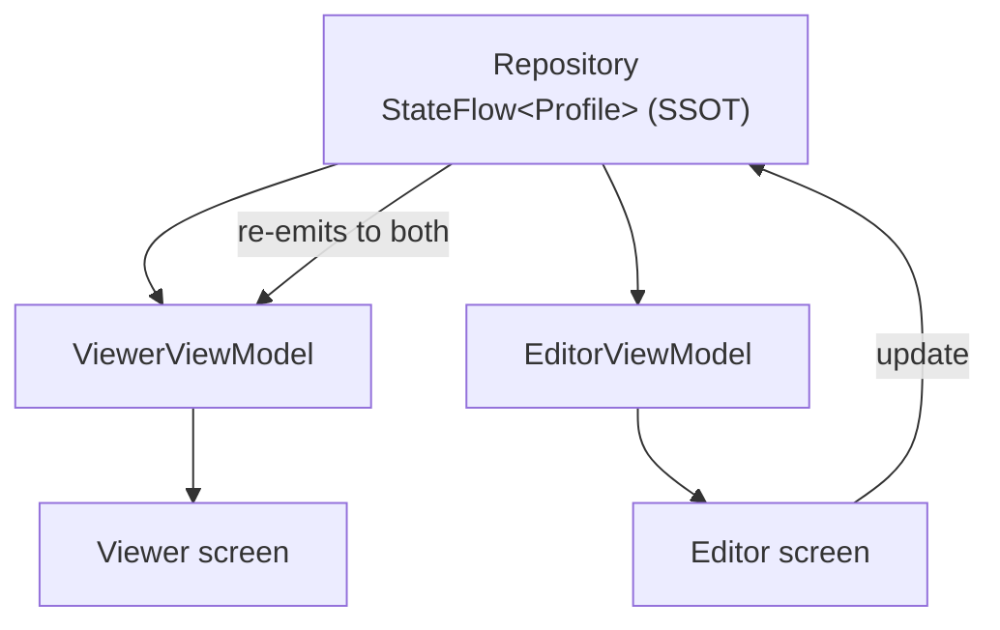
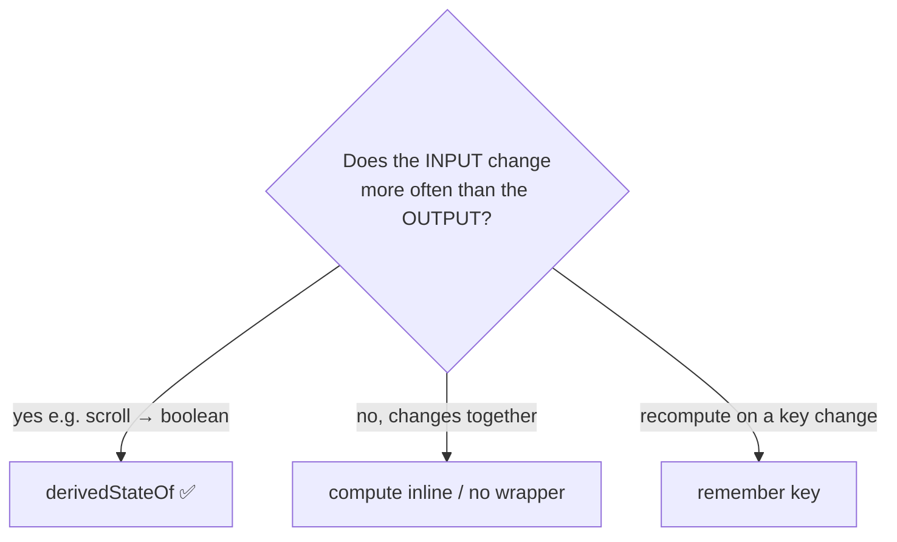

# Lesson 06 — Advanced State

> After this lesson you can guarantee a single source of truth across screens, keep state immutable and *stable*, and use `derivedStateOf`/`snapshotFlow` to avoid sync bugs and wasted recompositions.

**Module:** 03 · **Lesson:** 06 · **Level:** 🟡🔴 · **Est. time:** 90–110 min

---

## 1. Concept

### 🟢 For beginners

Three habits separate fragile state from solid state:

1. **Single source of truth (SSOT)** — every fact has exactly **one home**. Everything else *reads* from it; nothing keeps its own copy.
2. **Derive, don't duplicate** — if a value can be computed from another (a cart total from its items), **compute it**; don't store it separately. Two stored copies *will* drift apart.
3. **Replace, don't mutate** — to change state, emit a **new** value (`copy(...)`, a new list) rather than mutating the old one in place. Compose notices replacements; in-place mutations of a plain list slip by unseen.

### 🟡 For intermediate devs

- **SSOT across screens.** If a "view profile" screen and an "edit profile" screen each hold their own `Profile`, they'll disagree the moment one changes. Instead both observe the **same** source — typically a repository `Flow`. Edit updates the repository; the viewer re-emits automatically.

- **`derivedStateOf`** computes state from other state, and **only notifies readers when the *result* changes** — not every time an input changes. Use it when a **noisy input** feeds a **quiet output**:

  ```kotlin
  val showScrollToTop by remember {
      derivedStateOf { listState.firstVisibleItemIndex > 5 }
  }
  ```
  `firstVisibleItemIndex` changes on every scroll pixel; the boolean flips rarely. `derivedStateOf` means the button's readers recompose only when it actually flips.

- **Immutability & stability.** Compose can **skip** a composable whose parameters are *stable* and unchanged. A `List<T>` parameter is treated as **unstable** (it's an interface that *might* be a mutable implementation), so it can defeat skipping. Use **immutable collections** (`kotlinx.collections.immutable`: `ImmutableList`, `persistentListOf()`) or `@Immutable` types in your state.

- **`snapshotFlow`** turns Compose `State` into a **`Flow`**, so you can use operators like `debounce`/`distinctUntilChanged` on UI state (e.g., a search box).

### 🔴 For senior devs

- **SSOT is an architecture decision, not a screen decision.** The repository (backed by a DB in offline-first apps — [Module 13](../module-13-architecture/README.md)) is the truth; ViewModels expose *projections* of it. This kills a whole bug class: stale caches, two screens disagreeing, edits that don't propagate. Synchronization becomes "observe the one source," not "manually copy between places."

- **`derivedStateOf` internals & misuse.** It maintains its own snapshot dependency set, recomputes **lazily** when read after an input changed, and notifies dependents only when the new result is unequal to the old. It has overhead — wrapping a **cheap** computation that changes as often as its inputs is *worse* than just computing inline. Rule of thumb: **use `derivedStateOf` only when the input changes more often than the output.** It is *not* a replacement for `remember(key)` (which recomputes a value when a key changes) — different jobs.

- **Stability, precisely (preview of [Module 12](../module-12-internals/README.md)).** The compiler infers stability; `@Stable`/`@Immutable` are **promises** you make when it can't. With **Strong Skipping** (2026 default), composables with unstable parameters can still skip when the *instance* is referentially equal — but a fresh `List` each emission isn't, so it recomposes every row. In hot `LazyColumn`s, unstable item types are a top performance cause. Immutable collections + `@Immutable` data classes fix it at the source.

- **`snapshotFlow` specifics.** It runs inside a coroutine, reads state in its block, and emits when any read state changes (de-duplicating equal values). Combine with `distinctUntilChanged`, `debounce`, `collectLatest`; mind the collecting scope's lifecycle. It's the clean bridge from the Compose snapshot world back into the Flow world.

### Analogy

A **train station clock**. There's **one official clock** (SSOT); every platform display reads from it. Hand-setting a separate clock per platform guarantees drift and missed trains. The **"minutes to next train"** sign is **derived** — it computes from the official time and the schedule; it doesn't store its own time. And `derivedStateOf` is the **"platform busy" lamp**: the passenger count ticks constantly, but the lamp only switches when it crosses a threshold — it's wired to react to the *threshold*, not every footstep.

### Mental model

> **One home per fact; derive everything else; replace, don't mutate.** Reach for `derivedStateOf` when a noisy input feeds a quiet output.

### Real-world example

A document editor open in two panes. Both render from one repository `Flow<Document>`. Typing in pane A updates the repository; pane B re-emits — always consistent. A word-count badge is *derived*; a "document is long" warning uses `derivedStateOf` so it doesn't recompute every keystroke.

---

## 2. Visual Learning

**ASCII — derive vs duplicate:**
```text
   DUPLICATE (drifts)                 DERIVE (always consistent)
   items  ─────► total (stored)       items ─────► total = items.sum()
     │             ▲  (forgot to                       ▲
     └─ add item ──┘   update → BUG)    └─ add item ────┘  (auto-correct)
```

**Mermaid — single source of truth across screens:**


**Mermaid — when to use `derivedStateOf`:**


**Illustration prompt:**
```text
Illustration: a grand train-station hall with ONE large golden master clock at the center
labeled "Single Source of Truth". Thin light-lines run from it to many platform displays that
all show the same time. A small sign labeled "minutes to next train (derived)" computes from the
master clock. A separate amber lamp labeled "derivedStateOf" glows only when a crowd-meter
crosses a threshold line, ignoring the constantly flickering crowd numbers. Modern, vibrant, labeled.
```

---

## 3. Code

### 🟢 Beginner — derive, and replace instead of mutate

```kotlin
data class CartUiState(val items: List<CartItem> = emptyList()) {
    val total: Long get() = items.sumOf { it.unitPrice * it.qty }   // ✅ derived, can't drift
    val count: Int get() = items.sumOf { it.qty }
}

// Update by REPLACING the list, not mutating it.
fun CartUiState.addItem(item: CartItem) =
    copy(items = items + item)            // new immutable list → Compose sees the change
```

**Explanation.** `total`/`count` are computed from `items`, so they're always correct. Updates produce a **new** state via `copy` and a new list — Compose detects the replacement.

**Common mistakes.**
```kotlin
data class CartUiState(val items: List<CartItem>, var total: Long)  // ❌ stored derived value
fun add(s: CartUiState, i: CartItem) { s.items.add(i) }             // ❌ mutates in place; total stale
```
Stored `total` drifts the instant you forget to update it; in-place `add` mutates without notifying Compose.

**Best practices.** Derive computed values; update via `copy(...)` + new collections.

---

### 🟡 Intermediate — `derivedStateOf` for a noisy→quiet mapping

```kotlin
@Composable
fun PostList(posts: ImmutableList<Post>) {
    val listState = rememberLazyListState()

    // firstVisibleItemIndex changes constantly while scrolling;
    // showFab flips rarely → derivedStateOf prevents per-pixel recomposition of the FAB.
    val showFab by remember {
        derivedStateOf { listState.firstVisibleItemIndex > 5 }
    }

    Box {
        LazyColumn(state = listState) {
            items(posts, key = { it.id }) { PostRow(it) }
        }
        if (showFab) ScrollToTopFab(listState)
    }
}
```

**Explanation.** Without `derivedStateOf`, reading `firstVisibleItemIndex > 5` directly in composition would recompose this scope on every scroll frame. `derivedStateOf` recomputes the boolean as you scroll but only **notifies** when it flips, so the FAB toggles without churn.

**Common mistakes.**
```kotlin
// ❌ Overkill: input and output change together → derivedStateOf adds overhead for nothing.
val label by remember { derivedStateOf { "Items: ${posts.size}" } }
// just: val label = "Items: ${posts.size}"
```
- Forgetting the surrounding `remember` (a new `derivedStateOf` each recomposition loses its tracking).
- Using `derivedStateOf` where `remember(key)` is the right tool (recompute on a specific input change).

**Best practices.** `derivedStateOf` **only** when input is noisier than output; always inside `remember`.

---

### 🔴 Production — SSOT across screens, stable state, and `snapshotFlow`

```kotlin
// One source of truth for the profile, shared by every screen.
@Singleton
class ProfileRepository @Inject constructor() {
    private val _profile = MutableStateFlow(Profile())
    val profile: StateFlow<Profile> = _profile.asStateFlow()
    fun update(transform: (Profile) -> Profile) = _profile.update(transform)
}

// Stable, immutable UI state — items recompose only when they actually change.
@Immutable
data class FeedUiState(
    val query: String = "",
    val posts: ImmutableList<Post> = persistentListOf(),
)

class FeedViewModel @Inject constructor(
    private val repo: FeedRepository,
) : ViewModel() {
    private val _query = MutableStateFlow("")
    val state: StateFlow<FeedUiState> =
        _query
            .debounce(300)                       // operate on state as a Flow
            .distinctUntilChanged()
            .flatMapLatest { q -> repo.search(q) }   // repo (DB) is the SSOT
            .map { posts -> FeedUiState(_query.value, posts.toImmutableList()) }
            .stateIn(viewModelScope, SharingStarted.WhileSubscribed(5_000), FeedUiState())

    fun onQueryChange(q: String) { _query.value = q }
}
```

If your input lives in a composable instead of a ViewModel, `snapshotFlow` bridges it:

```kotlin
@Composable
fun SearchBox(onSearch: (String) -> Unit) {
    var query by rememberSaveable { mutableStateOf("") }
    LaunchedEffect(Unit) {                         // effect — see Module 06
        snapshotFlow { query }                     // Compose State → Flow
            .debounce(300)
            .distinctUntilChanged()
            .collectLatest(onSearch)
    }
    OutlinedTextField(query, { query = it }, label = { Text("Search") })
}
```

**Explanation.** The repository's `StateFlow` is the single source of truth; the ViewModel exposes a *projection* of it. `FeedUiState` is `@Immutable` and holds an `ImmutableList`, so `LazyColumn` rows skip recomposition unless their data changes. `snapshotFlow` lets UI-owned state flow through `debounce`/`distinctUntilChanged` like any Flow.

**Common mistakes.**
- Two screens each caching their own `Profile` → divergence; observe the repo instead.
- `List`/`MutableList` in `UiState` → unstable; every emission recomposes all rows. Use `ImmutableList` + `@Immutable`.
- Reaching into the repo's `MutableStateFlow` from the UI → SSOT broken.
- `snapshotFlow` collected without lifecycle awareness → leaks/background work.

**Best practices.**
- Repository (DB) = SSOT; ViewModels project, never duplicate.
- Make exposed state `@Immutable` with immutable collections to preserve skipping.
- Use `stateIn(..., WhileSubscribed(5_000), ...)` so the flow stops when no one's watching but survives config change.

---

## 4. Interview Questions

**🟢 Beginner**

1. *What is a single source of truth?*
   > Each piece of data has exactly one owner; everything else reads from it rather than keeping a copy, so nothing can drift out of sync.
2. *Why shouldn't you store a cart total as separate state?*
   > It can fall out of sync with the items. Derive it (`items.sumOf { … }`) so it's always correct.

**🟡 Intermediate**

3. *What does `derivedStateOf` do and when do you use it?*
   > It computes a value from other state and only notifies readers when the **result** changes. Use it when a noisy input (scroll offset) maps to a quiet output (a boolean), to avoid recomposing on every input change.
4. *Why is a `List` parameter "unstable," and how do you fix it?*
   > `List` is an interface that could be a mutable implementation, so Compose can't assume value-stability and may not skip. Use `ImmutableList`/`persistentListOf` (kotlinx.collections.immutable) or annotate types `@Immutable`.
5. *What is `snapshotFlow` for?*
   > Converting Compose `State` into a `Flow` so you can apply Flow operators (`debounce`, `distinctUntilChanged`) — e.g., debouncing a search field's text.

**🔴 Senior**

6. *`derivedStateOf` vs `remember(key)` vs computing inline — how do you choose?*
   > Inline for cheap derivations that change with their inputs. `remember(key)` to recompute/cache a value when a specific key changes. `derivedStateOf` when an input changes far more often than the derived result, to throttle notifications. Misusing `derivedStateOf` on cheap, co-varying values adds overhead.
7. *How does state stability affect `LazyColumn` performance?*
   > Unstable item types (e.g., a `List` field, or a class the compiler can't prove stable) cause rows to recompose even when their data didn't change, because Compose can't guarantee equality. Immutable/stable item models let rows skip, which is critical in long, scrolling lists.
8. *How do you keep two screens that edit the same entity consistent?*
   > Give the entity a single source of truth (a repository `Flow`/DB). Both screens observe it; edits write to it and propagate automatically. No screen holds an independent copy.

---

## 5. AI Assistant

**Prompt example:**
```text
Audit this Compose state for: (1) stored values that should be derived, (2) List/MutableList in
UiState that should be ImmutableList + @Immutable, (3) places where derivedStateOf is warranted
vs. where it's overkill, and (4) any duplicated entity that breaks single-source-of-truth.
Propose fixes. Target: Compose 2026, Kotlin 2.x, kotlinx.collections.immutable available.
[paste code]
```

**AI workflow.**
- ✅ Good for: spotting duplicated/derived state, converting collections to immutable, scaffolding a repository SSOT + `stateIn` pipeline.
- ⚠️ Watch: models **over-apply `derivedStateOf`**, forget `toImmutableList()`, and sometimes "fix" tearing by adding *more* flows instead of one state.

**Review workflow — map to *Common Mistakes*:**
- Any stored value that's actually derivable? Replace with a computed property.
- Is exposed state `@Immutable` with `ImmutableList`?
- Is each `derivedStateOf` justified (noisy input → quiet output) and wrapped in `remember`?
- One source of truth per entity; UI never touches the repo's mutable holder?

**Validation workflow:**
1. **Layout Inspector recomposition counts:** confirm the FAB/derived UI recomposes only when its value flips, and list rows don't recompose on unrelated changes.
2. **Compose compiler stability report** (Module 11/12): verify your `UiState`/item types are marked stable.
3. **SSOT test:** change the entity on screen A; assert screen B updates with no manual copy.
4. **Flow test (Turbine):** for `snapshotFlow`/`debounce` pipelines, assert debounced emissions.

---

## Recap / Key takeaways

- **SSOT**: one home per fact; the repository/DB is the truth; ViewModels project it.
- **Derive, don't duplicate; replace, don't mutate** — kills drift and missed updates.
- **`derivedStateOf`** throttles notifications when a noisy input feeds a quiet output (always inside `remember`).
- **Stability matters**: `List` is unstable → use `ImmutableList`/`@Immutable` to keep skipping (huge for `LazyColumn`).
- **`snapshotFlow`** bridges Compose `State` → `Flow` for `debounce`/`distinctUntilChanged`.

---

## 🎓 Module 03 complete

You can now answer the question that runs through every Compose codebase — **"where should this state live, and who owns it?"** — and back it with hoisting, UDF, SSOT, and stability.

**Apply it:** build the [module project](README.md#module-project) — the survives-rotation form (Lessons 01–04) and the UDF cart with a derived total and one immutable state (Lessons 05–06).

**Where this leads:**
- **[Module 04 — Modifiers](../module-04-modifiers/README.md)** and **[Module 06 — Side Effects](../module-06-side-effects/README.md)** build directly on this.
- The SSOT discipline is the backbone of **[Module 13 — Architecture](../module-13-architecture/README.md)**.
- Stability/skipping is the gateway to **[Module 11 — Performance](../module-11-performance/README.md)** and **[Module 12 — Internals](../module-12-internals/README.md)**.

➡️ Back to the **[Module 03 hub](README.md)** · Forward to **[Module 04 — Modifiers Mastery](../module-04-modifiers/README.md)**.
