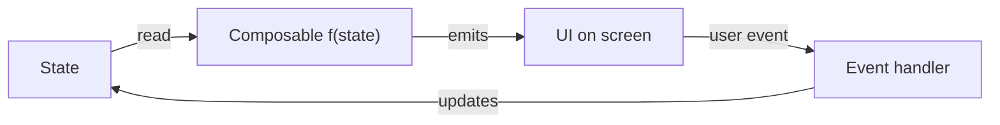
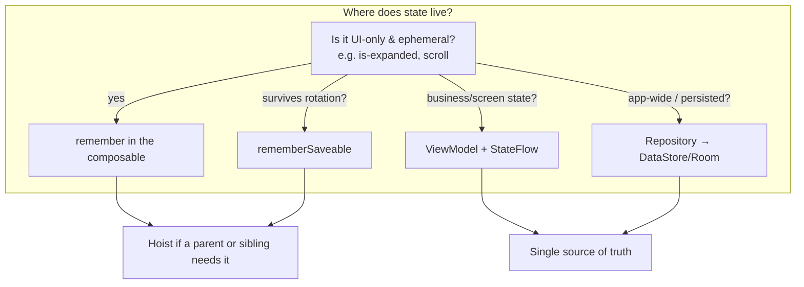

# Module 03 — State Management

> Decide *where state lives*, hoist it correctly, and design a screen with a single source of truth and unidirectional data flow.

**Status:** ✅ **Fully written** — this is the course's quality exemplar. Every other module reaches this depth.
**Prerequisites:** [Module 01 — Introduction](../module-01-introduction/README.md) (declarative mindset). Kotlin: data classes, lambdas, `by` delegates, basic coroutines/Flow.
**Level:** 🟢🟡🔴 · **Est.:** 8–10 hrs

---

## Why this module is the heart of the course

Compose has exactly one job: **turn state into UI**. Everything else — modifiers, layout, animation, performance — is in service of that. Get state wrong and you get the bugs every Compose beginner hits: text fields that won't type, values that reset on rotation, screens that recompose forever, two screens that disagree about the same data.

> **The one sentence:** `UI = f(state)`. When state changes, Compose re-runs `f` for the parts that read that state. Your job is to make state **correct, minimal, and owned in exactly one place.**

```text
        ┌───────────────── the loop you must master ─────────────────┐
        │                                                            │
   state ──read──▶ Composable f(state) ──emits──▶ UI                 │
        ▲                                          │                 │
        └──────────── event (user/system) ◀────────┘                 │
                         updates state                               │
        └────────────────────────────────────────────────────────────┘
```



If that loop is clean and one-directional, your app is predictable. This module makes it clean.

---

## Learning objectives

After this module you can:

1. Explain **what state is** in Compose and how a read creates a recomposition subscription.
2. Use `remember` and `mutableStateOf` correctly (and explain what each forgets).
3. Survive configuration changes and process death with `rememberSaveable`.
4. **Hoist state** to make composables stateless, reusable, and testable.
5. Apply **UDF**, and contrast **MVI** vs **MVVM** for organizing it.
6. Guarantee a **single source of truth**, use **immutable state**, and avoid sync bugs with `derivedStateOf`.

---

## Lessons (in order)

| # | Lesson | The thing you'll own |
|---|---|---|
| 01 | [What is state?](01-what-is-state.md) | State, recomposition, and why a *read* is a subscription. |
| 02 | [`remember` & `mutableStateOf`](02-remember-mutablestate.md) | Holding state across recompositions; the `by` delegate. |
| 03 | [`rememberSaveable`](03-remembersaveable.md) | Surviving rotation and process death; custom `Saver`s. |
| 04 | [State hoisting](04-state-hoisting.md) | Stateless composables; the `value` + `onValueChange` pattern. |
| 05 | [UDF, MVI & MVVM](05-udf-mvi-mvvm.md) | Organizing state with a ViewModel; immutable `UiState` + events. |
| 06 | [Advanced state](06-advanced-state.md) | Single source of truth, immutability/stability, `derivedStateOf`, `snapshotFlow`. |

Each lesson follows the course format: **Concept (🟢🟡🔴) → Visual Learning → Code (3 tiers) → Interview Questions → AI Assistant**.

---

## The mental model that ties the module together



You'll be able to answer **"where should this state live?"** instantly by the end — it's the most common design question in real Compose work and a frequent interview prompt.

---

## Module project

Build two screens that prove you've internalized state:

1. **Survives-rotation profile form** — name/email/bio fields that keep their values across rotation *and* process death, with validation. Exercises lessons 01–04.
2. **UDF shopping cart** — add/remove items, quantity, a derived total, all flowing through a ViewModel with one immutable `CartUiState`. Exercises lessons 05–06.

**Acceptance criteria:** no value resets on rotation; the cart total is *derived*, never stored twice; the screen ViewModel exposes exactly one `StateFlow<UiState>`; composables that don't own state are stateless.

---

## Common pitfalls this module kills

- `var x = mutableStateOf(...)` **without** `remember` → resets every recomposition.
- Reading `.value` you forgot to make observable → UI never updates.
- Storing derived data (e.g. a total) as separate state → it drifts out of sync.
- Two screens each holding their own copy of the same entity → they disagree.
- `MutableState` exposed from a ViewModel as mutable → callers mutate your truth.

---

## Recap → what's next

State is the input; **modifiers** ([Module 04](../module-04-modifiers/README.md)) and **side effects** ([Module 06](../module-06-side-effects/README.md)) are how you react to and decorate it. The single-source-of-truth discipline you learn here is the foundation for **architecture** ([Module 13](../module-13-architecture/README.md)) and the key to **performance** ([Module 11](../module-11-performance/README.md)).

➡️ Start with **[Lesson 01 — What is state?](01-what-is-state.md)**
