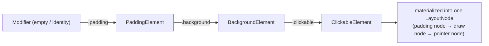

# Lesson 01 — Why Modifiers Exist & the Chain

> After this lesson you can explain what a `Modifier` *is*, why it's a chain of links instead of a bag of properties, and how the chain wraps an element from the outside in.

**Module:** 04 · **Lesson:** 01 · **Level:** 🟢🟡🔴 · **Est. time:** 60–75 min

---

## 1. Concept

### 🟢 For beginners — *what is it and why do I care?*

In the old View world, a widget had a hundred built-in properties: padding, background, click listener, margins, elevation, alpha. Every `Button`, every `TextView`, carried all of them whether you used them or not.

Compose throws that out. A composable like `Text` or `Box` does **one job** — show text, lay out children. Everything *else* — how big it is, how much space around it, what color sits behind it, whether tapping does anything — is added on from the outside through one parameter: **`Modifier`**.

```kotlin
Text(
    text = "Hello",
    modifier = Modifier
        .padding(16.dp)        // space around the text
        .background(Color.Yellow) // color behind it
        .clickable { /* ... */ } // make it tappable
)
```

Read that `Modifier...` chain top to bottom like a recipe. Each line adds one decoration. The composable stays simple; the modifier carries the decorations. **A modifier is how you decorate and configure a composable without that composable needing to know about every possible feature.**

### 🟡 For intermediate devs — *the mechanism*

`Modifier` is an **immutable, ordered, singly-linked list of elements**. Every call like `.padding(...)` or `.background(...)` doesn't mutate anything — it returns a **new** `Modifier` that wraps the previous one. The chain you build is a *description*; Compose reads it and applies the elements in order.

The base of every chain is the companion object `Modifier` (the empty modifier — an identity element). Each `.something(...)` is an extension function that calls `.then(...)` under the hood:

```kotlin
// These are equivalent:
Modifier.padding(16.dp).background(Color.Red)
Modifier.then(PaddingElement(16.dp)).then(BackgroundElement(Color.Red))
```

Three facts to internalize:

1. **Modifiers are ordered.** `padding().background()` is *not* the same as `background().padding()` (next lesson is dedicated to exactly this).
2. **Modifiers wrap outside-in.** The first modifier in the chain is the *outermost* layer; the composable's own content is the *innermost*. Padding listed first reserves space on the outside; a background listed after it paints inside that padded region.
3. **`Modifier.then` concatenates two chains.** This is how you pass a modifier into a child and let the child append its own.

The modern engine behind all of this is the **`Modifier.Node`** system (since Compose 1.3+, now the default). Each modifier element resolves to a lightweight `Modifier.Node` that lives in the layout tree and participates in measure, draw, pointer input, semantics, or focus. We dig into nodes in [Lesson 08](08-custom-modifier-factories.md); for now, the chain is your mental model.

### 🔴 For senior devs — *trade-offs, edges, internals*

A modifier chain is materialized into a **node chain** attached to a single `LayoutNode`. Understanding that mapping is what lets you reason about performance and correctness:

- **One layout node, many modifier nodes.** `Modifier.padding().background().clickable()` does **not** create three layout nodes — it creates one `LayoutNode` with a chain of `Modifier.Node`s (a `LayoutModifierNode` for padding, a `DrawModifierNode` for background, a `PointerInputModifierNode` for clickable). This is why modifiers are cheaper than wrapping in extra `Box`es: no extra layout/measure node, no extra subtree.
- **The node chain is *diffed*, not rebuilt.** When you recompose with a new `Modifier` instance, Compose structurally compares the new chain against the old one and updates nodes in place where the element types match — it doesn't tear down and re-attach every node. This is why providing **stable** modifier elements (and avoiding allocating brand-new lambdas every recomposition where avoidable) keeps modifier churn low.
- **`Modifier.Element` equality matters.** Each built-in element is a `data`-like class whose `equals`/`hashCode` gate whether the corresponding node is updated. A `padding(16.dp)` that's `==` to the previous one is a no-op on the node.
- **Order is layout semantics, not styling sugar.** Because each `LayoutModifierNode` measures the *inner* chain and reports a size outward, the order literally changes the constraints that flow down and the size that flows up. Order is part of the layout algorithm — not a cosmetic preference. (Proven in [Lesson 02](02-modifier-order-matters.md).)
- **`composed {}` is legacy; prefer `Modifier.Node`.** The old way to build stateful modifiers, `Modifier.composed { }`, allocates per call site and defeats some optimizations. Modern custom modifiers implement `Modifier.Node` + a `ModifierNodeElement` factory (Lesson 08). Treat `composed` as a `❌ legacy` smell in new code.

### Analogy

A modifier chain is **getting dressed**. Your body is the composable. You put on layers from the inside out: undershirt, shirt, jacket, coat. The *order* matters — a coat over a shirt looks (and works) completely differently than a shirt over a coat. Each layer wraps the one beneath it. And you only put on the layers you need today; you don't carry every garment you own at all times the way a View carried every property.

### Mental model

> **A modifier is an ordered stack of wrappers around a composable. First listed = outermost layer; the composable's content is at the center. You add only the layers you need.**

### Real-world example

A profile card: `Modifier.fillMaxWidth().padding(16.dp).clip(RoundedCornerShape(12.dp)).background(surface).clickable { openProfile() }`. Each link is one product decision — full width, inset from the edges, rounded corners, a surface color, tappable. The `Card` composable itself stays a dumb container; the modifier expresses the entire visual + interaction spec.

---

## 2. Visual Learning

**ASCII — the chain wraps outside-in:**
```text
Modifier.padding(16).background(Yellow).clickable { }   applied to  Text("Hi")

   ┌──────────────── padding (outermost) ────────────────┐
   │ ┌──────────────── background ─────────────────────┐ │
   │ │ ┌──────────────── clickable ──────────────────┐ │ │
   │ │ │              Text("Hi")  (content)           │ │ │
   │ │ └──────────────────────────────────────────────┘ │ │
   │ └──────────────────────────────────────────────────┘ │
   └──────────────────────────────────────────────────────┘
   first in chain = outermost wrapper · content sits at the center
```

**Mermaid — chain of elements becomes a node chain on one LayoutNode:**


**Illustration prompt (paste into an image generator):**
```text
Illustration: a single small character labeled "Composable" standing in the center of
concentric transparent shells, like Russian nesting dolls drawn as glowing rings.
From inside out the rings are labeled "clickable", "background", "padding".
A floating recipe card to the side lists "Modifier .padding .background .clickable"
top to bottom, with an arrow showing the FIRST line maps to the OUTERMOST ring.
Clean, modern, soft gradients, clearly labeled. Caption: "First in the chain = outermost layer."
```

---

## 3. Code

### 🟢 Beginner — a composable plus a modifier chain

```kotlin
@Composable
fun Greeting() {
    Text(
        text = "Hello, Compose",
        modifier = Modifier
            .padding(16.dp)            // space on the outside
            .background(Color(0xFFFFF59D)) // color painted inside the padded area
    )
}
```

**Explanation.** `Text` only knows how to draw a string. The `Modifier` adds 16dp of space around it and a yellow background. Because `padding` is first, the background paints *inside* the padding — the yellow does not extend to the very edge. The chain reads top-to-bottom as the layers from outside to inside.

**Common mistakes.**
```kotlin
// ❌ Trying to set decorations as if they were Text parameters.
Text("Hello", padding = 16.dp, background = Color.Yellow) // won't compile — no such params
```
There is no `padding` or `background` *parameter* on `Text`. Those are **modifiers**, added through the `modifier` argument. New-from-XML developers reach for properties that don't exist.

**Best practices.**
- Put decorations on the `modifier`, not by hunting for a parameter that doesn't exist.
- Always pass `Modifier` (capital M, the companion) as the chain's base.

---

### 🟡 Intermediate — accept a modifier and append to it

```kotlin
@Composable
fun Badge(
    count: Int,
    modifier: Modifier = Modifier,   // caller-supplied modifier, defaulted to empty
) {
    Text(
        text = count.toString(),
        color = Color.White,
        modifier = modifier            // caller's chain first…
            .background(Color.Red, CircleShape) // …then this component's own decorations
            .padding(horizontal = 6.dp, vertical = 2.dp)
    )
}

// Usage — the caller positions it; the component styles it.
Badge(count = 9, modifier = Modifier.align(Alignment.TopEnd))
```

**Explanation.** Every reusable composable should take a `modifier: Modifier = Modifier` as its **first optional parameter**. The caller's modifier is applied *first* (outermost) so the caller controls position/size, and the component appends its *own* styling after. `Modifier` defaults to the empty identity, so callers who don't care can omit it.

**Common mistakes.**
```kotlin
// ❌ Swallowing the caller's modifier — alignment/size from the call site is silently dropped.
@Composable
fun Badge(count: Int, modifier: Modifier = Modifier) {
    Text("$count", modifier = Modifier.background(Color.Red)) // ignores `modifier`!
}
```
If you ignore the passed-in `modifier`, the caller's `.align(...)`, `.size(...)`, `.padding(...)` vanish — a confusing, hard-to-spot bug. Always thread it through.

**Best practices.**
- Expose `modifier: Modifier = Modifier` as the first optional param, and apply it once to your **outermost** element.
- Apply the caller's modifier **before** your internal decorations so the caller stays in control of layout.

---

### 🔴 Production — a reusable component with correct modifier discipline

```kotlin
@Composable
fun StatTile(
    label: String,
    value: String,
    modifier: Modifier = Modifier,          // single, outermost, caller-controlled
    onClick: (() -> Unit)? = null,
) {
    // Build the click behavior only when needed, without breaking the single-modifier rule.
    val clickModifier = if (onClick != null) {
        Modifier.clickable(onClickLabel = label, onClick = onClick)
    } else {
        Modifier
    }

    Column(
        modifier = modifier                  // caller's chain (size/position) stays outermost
            .clip(RoundedCornerShape(16.dp)) // clip first so ripple + background respect corners
            .background(MaterialTheme.colorScheme.surfaceVariant)
            .then(clickModifier)             // conditional click, composed cleanly
            .padding(16.dp),                 // inner content padding
        verticalArrangement = Arrangement.spacedBy(4.dp),
    ) {
        Text(value, style = MaterialTheme.typography.headlineSmall)
        Text(label, style = MaterialTheme.typography.bodyMedium)
    }
}
```

**Explanation.** One `modifier` parameter, applied once to the outermost `Column`. The internal chain is deliberately ordered: `clip` → `background` → `clickable` → `padding`, so the rounded shape clips both the fill and the ripple, the click area covers the whole tile, and `padding` insets only the text. The conditional `clickModifier` keeps the component non-clickable when no handler is given **without** introducing a second modifier parameter or a `Box` wrapper.

**Common mistakes.**
```kotlin
// ❌ Padding before clickable: the ripple/touch target shrinks to exclude the padded edge.
Modifier.padding(16.dp).clickable { onClick() }   // dead zone around the edges

// ❌ Background before clip: the fill ignores the rounded corners — square corners leak out.
Modifier.background(color).clip(RoundedCornerShape(16.dp))
```
Order changes behavior, not just looks: `padding` before `clickable` shrinks the touch target; painting a `background` before `clip` produces square corners. (Lesson 02 makes this rigorous.)

**Best practices.**
- One `modifier` param, applied once, to the outermost element — never sprinkle multiple modifier params.
- Order intentionally: `clip` before `background`/`clickable` for rounded, ripple-correct surfaces; `padding` last for inner content spacing.
- Compose conditional behavior with `.then(...)` rather than adding extra parameters or wrapper composables.

---

## 4. Interview Questions

**🟢 Beginner**

1. *What is a `Modifier` in Compose?*
   > An ordered, immutable chain of decorations/configuration applied to a composable through its `modifier` parameter — handling size, padding, background, click behavior, and more, so the composable itself stays focused on its core job.
2. *Why does `Text` not have a `padding` parameter?*
   > Because cross-cutting concerns like padding are expressed as modifiers, not per-composable parameters. You add `Modifier.padding(...)` through the `modifier` argument, which keeps every composable's API small and consistent.

**🟡 Intermediate**

3. *What does `Modifier.then(...)` do, and why is it important for reusable components?*
   > It concatenates two modifier chains into one, preserving order. It's how a component appends its own decorations to a caller-supplied `modifier`, and how you compose conditional modifiers without extra parameters.
4. *Why should every reusable composable expose `modifier: Modifier = Modifier`?*
   > So callers can control layout (size, position, padding) from the outside. Defaulting to the empty `Modifier` keeps it optional; threading it to the outermost element keeps the component flexible and consistent with the rest of the ecosystem.

**🔴 Senior**

5. *How does a modifier chain map onto the layout tree, and why does that make modifiers cheaper than wrapping in extra composables?*
   > A chain materializes into a single `LayoutNode` carrying a chain of `Modifier.Node`s (layout, draw, pointer, semantics nodes). Wrapping in extra `Box`es instead would add real layout nodes and subtrees to measure and place. Modifiers add behavior without adding layout nodes, so they're lighter.
6. *What happens to the node chain across recomposition when you pass a new `Modifier` instance?*
   > Compose structurally diffs the new chain against the old one and updates nodes **in place** where element types match, rather than tearing down and rebuilding. Element `equals` gates whether a node is actually updated, so stable, equal elements are no-ops — which is why avoiding needless per-recomposition allocations keeps modifier work minimal.

---

## 5. AI Assistant

**Prompt example (scaffolding a reusable component):**
```text
Write a reusable Compose component `PriceTag(price: String, ...)` for Compose 2026 / Kotlin 2.x.
Requirements: expose `modifier: Modifier = Modifier` as the first optional parameter and apply it
ONCE to the outermost element; append the component's own background/padding AFTER the caller's
modifier; use Material 3 colorScheme. Do not invent parameters like `padding=` on child composables.
```

**AI workflow — where it helps on *this* topic.**
- ✅ Great for: scaffolding stateless components with the right `modifier` parameter shape, converting a properties-based View into a modifier chain, explaining what an unfamiliar chain does line by line.
- ⚠️ Watch: models frequently **drop the caller's `modifier`**, add **multiple** modifier parameters, or wrap content in needless `Box`es instead of using `.then(...)`.

**Review workflow — check AI output against this lesson's *Common Mistakes*:**
- Is there exactly **one** `modifier: Modifier = Modifier` parameter, applied to the outermost element?
- Is the caller's modifier applied **before** the component's own decorations?
- Did it avoid fictional parameters (`padding=`, `background=`) on composables that don't have them?
- Did it use `.then(...)` for conditional modifiers instead of extra params/wrappers?

**Validation workflow — prove it works:**
1. **Compile** — fictional parameters won't, which catches the most common slop instantly.
2. Add a `@Preview` and pass `Modifier.size(120.dp).border(1.dp, Color.Red)` from the call site; confirm the border (caller's modifier) actually takes effect — proving the component didn't swallow it.
3. Toggle a clickable variant and confirm the ripple covers the intended area.

> **AI drafts, you decide.** Route every generated component back through the one-modifier-parameter rule before you merge.

---

## Recap / Key takeaways

- A **`Modifier`** is an ordered, immutable chain that decorates and configures a composable from the outside — keeping each composable's own API small.
- The chain **wraps outside-in**: first listed = outermost layer; the content sits at the center.
- A chain materializes into **one `LayoutNode`** with a chain of `Modifier.Node`s — cheaper than extra wrapper composables.
- Every reusable composable should take **`modifier: Modifier = Modifier`** as its first optional param and apply it once to the outermost element.
- Compose **diffs** the node chain across recomposition; equal, stable elements are no-ops.

➡️ Next: **[Lesson 02 — Modifier order matters](02-modifier-order-matters.md)** — why `padding→background` differs from `background→padding`, and `size` vs `requiredSize`.
