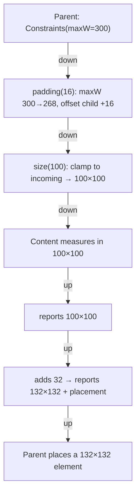
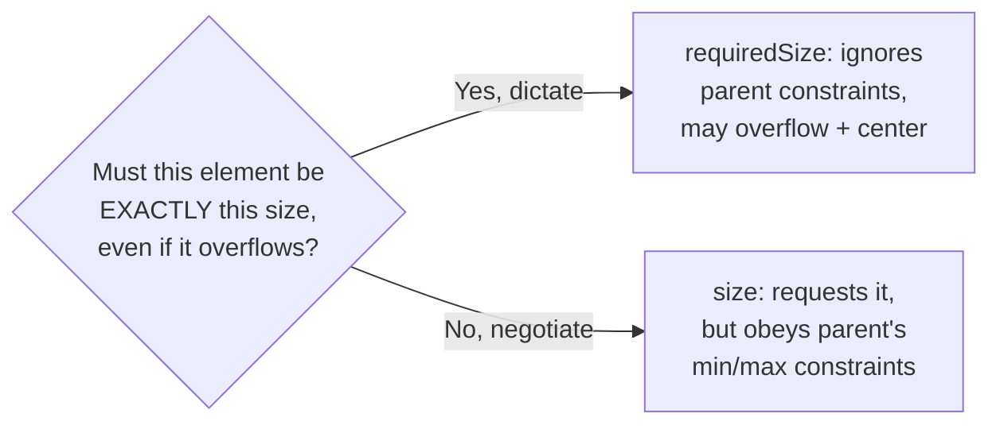

# Lesson 02 — Modifier Order Matters

> After this lesson you can predict the visual result of any modifier chain, explain *why* order changes layout (not just looks), and know exactly when to reach for `requiredSize` over `size`.

**Module:** 04 · **Lesson:** 02 · **Level:** 🟢🟡🔴 · **Est. time:** 75–90 min

---

## 1. Concept

### 🟢 For beginners — *what is it and why do I care?*

This is the lesson that fixes 80% of "my padding looks wrong" bugs. The rule is simple:

> **Modifiers apply in the order you write them, from outside to inside.**

So these two chains produce **different** results:

```kotlin
// A — padding first, then background
Modifier.padding(16.dp).background(Color.Yellow)

// B — background first, then padding
Modifier.background(Color.Yellow).padding(16.dp)
```

- **A:** 16dp of empty space on the outside, *then* the yellow paints inside that space → a yellow box with a transparent gap around it.
- **B:** yellow paints first (filling the whole area), *then* 16dp of padding pushes the content inward → a yellow box where the yellow reaches the edges and the content sits 16dp inside.

Same two modifiers, swapped order, completely different look. There's no "correct" order in the abstract — it depends on what you want. But you must **read the chain top-to-bottom as outside-to-inside** to predict the result.

### 🟡 For intermediate devs — *the mechanism*

Order matters because each layout modifier participates in Compose's **single-pass measurement**, and measurement flows in two directions:

1. **Constraints flow *down* the chain** (outside → inside). The outermost modifier receives the constraints from the parent, possibly modifies them, and passes them inward.
2. **Size flows *back up* the chain** (inside → outside). The content measures itself within the constraints it received and reports a size; each modifier can adjust that reported size on the way out.

`padding`, for example, **shrinks the constraints** going down (the inner content gets less room) and **adds the padding back** to the size going up. So whether `padding` runs before or after `size` changes which constraints `size` sees and what final dimensions result.

```text
parent constraints
      │ (down)
   ┌──▼─────────────┐
   │ padding(16)    │  shrinks max width by 32, offsets child by 16
   ├────────────────┤
   │ background     │  paints the area it's handed
   ├────────────────┤
   │ size(100)      │  forces 100×100 within what it received
   ├────────────────┤
   │ content        │
   └────────────────┘
      ▲ (up) size reported back outward, padding re-added
```

This is also why **`size` vs `requiredSize`** behave differently. `size(100.dp)` *requests* 100dp but still **obeys** incoming constraints — if the parent says "max 80dp," you get 80. `requiredSize(100.dp)` **ignores** the incoming constraints and forces 100dp (then centers within whatever the parent allotted, possibly overflowing). One negotiates; the other dictates.

### 🔴 For senior devs — *trade-offs, edges, internals*

The deep model: each `LayoutModifierNode` implements `MeasureScope.measure(measurable, constraints)`. It receives `constraints`, decides what constraints to pass to the inner `measurable` (its remaining chain), gets back a `Placeable`, and reports a final size + placement. Order is literally the nesting order of these `measure` calls.

Things seniors must reason about precisely:

- **`size` is min == max == value, clamped to incoming constraints.** `Modifier.size(100.dp)` sets `Constraints(minW=maxW=minH=maxH=100.dp)` for the child **but is itself constrained by the parent**, so the effective size is `value.coerceIn(incomingMin, incomingMax)`. Two `size` calls in a row → the **first** (outer) wins, because it constrains the second.
- **`requiredSize` overrides incoming constraints entirely**, then the node centers the child in the space the parent actually gave — which means content can draw **outside** the parent's bounds. Use it for things like an avatar that must stay 48dp even inside a row that would squeeze it; accept that it can overflow.
- **`fillMaxSize` / `weight` resolve against the constraints they receive *at that point* in the chain.** `padding(16).fillMaxWidth()` fills the *padded* width; `fillMaxWidth().padding(16)` fills the full width then insets, so the element is wider. Same two modifiers, different footprint.
- **Draw order follows chain order too.** `background` is a `DrawModifierNode` that draws *before* the content (it's a background), but **where** it draws is the region it occupies in the chain. `border` after `clip` traces the clipped shape; `border` before `clip` can get its outer edge clipped away.
- **`clip` changes both drawing and hit-testing region.** A `clickable` placed *outside* a `clip` (earlier in the chain) keeps a rectangular touch target even though the visual is rounded; placed *inside* the clip, the touchable region follows the clipped shape. This is a real a11y/UX decision, not a detail.
- **`wrapContentSize` re-opens constraints.** Inside a fixed-size modifier, `wrapContentSize` lets the child measure at its natural size and then aligns it — handy when an outer `size` would otherwise force-stretch the child.

> Rule of thumb: if a modifier's job is **layout** (padding, size, offset, fill), its position changes geometry. If its job is **draw** (background, border, alpha, clip), its position changes painting/clipping. Order interacts with *both*.

### Analogy

Think of **framing a picture**. `padding` is the mat board (the space between art and frame). `background` is the colored backing paper. `border` is the frame itself. Put the mat *outside* the colored paper and the paper shows only in the middle; put the colored paper *outside* the mat and it fills behind everything. The picture (content) is the same; the order of mat / paper / frame decides what you see — and how big the whole thing ends up on the wall (geometry).

### Mental model

> **Read a chain top-to-bottom as outside-to-inside. Constraints shrink on the way in; sizes grow back on the way out. The order is the layout algorithm, not decoration.**

### Real-world example

A chat bubble: `Modifier.padding(8.dp).background(bubbleColor, RoundedCornerShape(16.dp)).padding(12.dp)`. The outer `padding(8)` is the *margin* between bubbles; the `background` paints the bubble; the inner `padding(12)` is the text inset inside the bubble. Three layout/draw modifiers, deliberately ordered to express margin → fill → inset — a pattern you'll write hundreds of times.

---

## 2. Visual Learning

**ASCII — the two orders side by side:**
```text
A) Modifier.padding(16).background(Yellow)      B) Modifier.background(Yellow).padding(16)

   ┌────────────────────────────┐                 ┏━━━━━━━━━━━━━━━━━━━━━━━━━━━━┓
   │   (transparent 16 gap)     │                 ┃   yellow fills to edges    ┃
   │   ┏━━━━━━━━━━━━━━━━━━━━┓   │                 ┃   ┌────────────────────┐   ┃
   │   ┃   yellow + text    ┃   │                 ┃   │  (16 inset) text   │   ┃
   │   ┗━━━━━━━━━━━━━━━━━━━━┛   │                 ┃   └────────────────────┘   ┃
   └────────────────────────────┘                 ┗━━━━━━━━━━━━━━━━━━━━━━━━━━━━┛
   yellow sits INSIDE the gap                      yellow reaches the EDGES
```

**Mermaid — constraints down, size up:**


**`size` vs `requiredSize` decision flow:**


**Illustration prompt (paste into an image generator):**
```text
Illustration: two identical small text labels, each wrapped in nested frames, shown side by side.
LEFT panel labeled "padding → background": an outer transparent margin ring, then a solid yellow
rounded box hugging the text inside it. RIGHT panel labeled "background → padding": a solid yellow
rounded box reaching the outer edge, with the text floating inset in the middle.
Between them a bold double-headed arrow labeled "same modifiers, swapped order = different layout".
Clean, modern, high-contrast, clearly labeled, soft studio lighting.
```

---

## 3. Code

### 🟢 Beginner — see the difference

```kotlin
@Composable
fun OrderDemo() {
    Column(verticalArrangement = Arrangement.spacedBy(16.dp)) {
        // A: gap on the outside, yellow inside
        Text(
            "padding → background",
            Modifier
                .padding(16.dp)
                .background(Color(0xFFFFF59D))
        )
        // B: yellow to the edges, text inset
        Text(
            "background → padding",
            Modifier
                .background(Color(0xFFFFF59D))
                .padding(16.dp)
        )
    }
}
```

**Explanation.** Identical modifiers, opposite order. In A the `padding` reserves outer space first, so the `background` only fills the inner region. In B the `background` fills everything first, so the `padding` insets the text within the colored area. Run it and the two look obviously different.

**Common mistakes.**
```kotlin
// ❌ Expecting a uniform "padded yellow chip" but writing padding last by habit,
//    then being surprised the yellow touches the edges.
Modifier.background(Color.Yellow).padding(16.dp) // yellow to edges — maybe not what you wanted
```
There's no bug here — it's *doing what you wrote*. The mistake is not reading the chain as outside-in.

**Best practices.**
- Decide which you want — "gap then fill" vs "fill then inset" — and order accordingly.
- For a chip/pill, the common pattern is **`background` then `padding`** (fill reaches the shape's edges, text inset inside).

---

### 🟡 Intermediate — `size` vs `requiredSize`, and clip ordering

```kotlin
@Composable
fun SizeAndClipDemo() {
    // Parent caps width at 80dp to demonstrate constraint negotiation.
    Box(Modifier.width(80.dp)) {
        // size REQUESTS 120 but parent says max 80 → ends up 80 wide.
        Box(Modifier.size(120.dp).background(Color.Cyan))
    }

    Box(Modifier.width(80.dp)) {
        // requiredSize IGNORES the 80 cap → 120 wide, overflows the parent, centered.
        Box(Modifier.requiredSize(120.dp).background(Color.Magenta))
    }

    // Clip BEFORE background → rounded fill + rounded ripple.
    Box(
        Modifier
            .clip(RoundedCornerShape(16.dp))
            .background(Color(0xFF90CAF9))
            .clickable { /* rounded touch + ripple */ }
            .padding(16.dp)
    ) { Text("Rounded & clickable") }
}
```

**Explanation.** The first `Box` shows `size` *negotiating*: it wanted 120dp but the parent's 80dp cap wins. The second shows `requiredSize` *dictating*: it forces 120dp and overflows, centered in the 80dp slot. The third orders `clip` before `background`/`clickable` so the fill and the ripple both respect the rounded corners.

**Common mistakes.**
```kotlin
// ❌ Two size calls expecting the inner one to win.
Modifier.size(200.dp).size(100.dp) // outer wins → 200 constrains; result is 200, not 100

// ❌ requiredSize when you only meant a preferred size — element overflows its parent unexpectedly.
Modifier.requiredSize(400.dp) // blows past the screen/parent bounds
```
Stacked `size` modifiers: the **outer** constrains the inner, so the first one effectively wins. `requiredSize` overflowing is a frequent "why is my view bigger than its container" surprise.

**Best practices.**
- Use `size` for normal layout (respects parents). Reserve `requiredSize` for "must be exactly this, overflow if needed" cases — and expect overflow.
- Put `clip` before `background`/`border`/`clickable` when you want rounded fills, borders, and ripples.

---

### 🔴 Production — a correctly layered, accessible card

```kotlin
@Composable
fun PromoCard(
    title: String,
    body: String,
    onClick: () -> Unit,
    modifier: Modifier = Modifier,
) {
    Column(
        modifier = modifier
            .padding(8.dp)                                   // 1. outer margin between cards
            .clip(RoundedCornerShape(20.dp))                 // 2. establish the rounded shape FIRST
            .background(MaterialTheme.colorScheme.primaryContainer) // 3. fill respects the clip
            .clickable(onClickLabel = title, onClick = onClick)     // 4. ripple + hit area follow the clip
            .border(                                          // 5. border traces the clipped shape
                1.dp,
                MaterialTheme.colorScheme.outline,
                RoundedCornerShape(20.dp)
            )
            .padding(20.dp),                                 // 6. inner content inset
        verticalArrangement = Arrangement.spacedBy(8.dp),
    ) {
        Text(title, style = MaterialTheme.typography.titleMedium)
        Text(body, style = MaterialTheme.typography.bodyMedium)
    }
}
```

**Explanation.** Six links, each placed for a reason: outer `padding` is the *margin*; `clip` defines the shape so everything after it is rounded; `background` fills inside the clip; `clickable` gets a rounded ripple and a hit area matching the visual; `border` traces the same rounded shape; the final `padding` insets the text. Swap any two and you get a visible bug — square ripple, clipped-off border, or wrong touch target.

**Common mistakes.**
```kotlin
// ❌ Click area excludes the margin AND the corners look square because background precedes clip.
Modifier
    .clickable { onClick() }          // touch target is the full rectangle, ignores rounding
    .background(color)                // square fill
    .clip(RoundedCornerShape(20.dp))  // clip too late — only clips draw AFTER it
    .padding(20.dp)
```
Here the `clickable` is outermost (touch target is a rectangle including any outer space), the `background` paints square because the `clip` comes after it, and the rounded corners apply to almost nothing useful.

**Best practices.**
- Canonical surface order: **margin `padding` → `clip` → `background` → `clickable` → `border` → content `padding`**.
- Give `clickable` an `onClickLabel` so screen readers announce the action; keep the touch target on the visible, clipped shape.
- When a border must hug a rounded fill, pass the **same shape** to `clip`/`background`/`border`.

---

## 4. Interview Questions

**🟢 Beginner**

1. *Does `Modifier.padding(16.dp).background(Color.Red)` look the same as `Modifier.background(Color.Red).padding(16.dp)`?*
   > No. The first reserves outer space then fills inside it (red sits inside a gap); the second fills first then insets the content (red reaches the edges). Order is outside-to-inside.
2. *How do you read a modifier chain to predict the result?*
   > Top-to-bottom is outermost-to-innermost. The first modifier wraps everything after it; the composable's content is at the center.

**🟡 Intermediate**

3. *What's the difference between `size` and `requiredSize`?*
   > `size` requests a dimension but still obeys the incoming constraints from the parent (it negotiates). `requiredSize` ignores those constraints and forces the dimension, centering the element in whatever the parent gave — so it can overflow.
4. *Why does `padding(16).fillMaxWidth()` differ from `fillMaxWidth().padding(16)`?*
   > `fillMaxWidth` fills the width of the constraints it receives at that point. After `padding`, those constraints are already 32dp narrower, so it fills the padded width. Before `padding`, it fills the full width and then gets inset — a wider element.

**🔴 Senior**

5. *Mechanically, why does modifier order change layout and not just appearance?*
   > Each `LayoutModifierNode` implements `measure(measurable, constraints)`: it receives constraints, decides what to pass inward, measures the inner chain, and reports a size/placement outward. Order is the nesting order of these measure calls, so it determines which constraints flow down and how sizes accumulate back up — it's part of the measurement algorithm.
6. *How does `clip` interact with `clickable` for hit-testing, and why does it matter?*
   > `clip` changes both the draw region and the hit-test region for nodes *inside* it. A `clickable` placed before `clip` keeps a rectangular touch target even on a rounded visual; placed after `clip`, the touchable area follows the clipped shape. It's an accessibility/UX decision: users expect taps outside the visible rounded shape to do nothing.

---

## 5. AI Assistant

**Prompt example (predict-and-explain):**
```text
For Compose 2026, explain step by step what this chain renders and why, treating it as outside-to-inside,
and note how constraints flow down and size flows up:
Modifier.padding(8.dp).clip(RoundedCornerShape(16.dp)).background(Color.Blue).clickable{}.padding(12.dp)
Then tell me what breaks if I move .clickable before .clip.
```

**AI workflow — where it helps on *this* topic.**
- ✅ Great for: explaining an existing chain line by line, suggesting a canonical order for a "rounded, clickable, bordered surface," and catching obviously wrong orderings.
- ⚠️ Watch: models sometimes "fix" a layout by **adding extra `Box` wrappers** instead of reordering modifiers, or confidently assert an order is equivalent when it isn't.

**Review workflow — check AI output against this lesson's *Common Mistakes*:**
- Is `clip` before `background`/`border`/`clickable` when rounded corners are intended?
- Did it use `requiredSize` where it really meant `size` (risking overflow)?
- Did it reorder modifiers to fix layout, rather than wrapping in unnecessary composables?
- Are stacked `size` calls avoided (the outer one wins)?

**Validation workflow — prove it works:**
1. **Preview both orders** in a split `@Preview` and compare visually.
2. Add `.border(1.dp, Color.Red)` temporarily at different points to *see* the box each modifier occupies.
3. For touch targets, enable **Layout Inspector** and verify the clickable bounds match the visible shape; test with TalkBack that the rounded control announces correctly.
4. For `requiredSize`, shrink the parent and confirm whether overflow is acceptable.

> **AI drafts, you decide.** If the model claims two orders are "the same," verify in a preview before believing it.

---

## Recap / Key takeaways

- **Order is outside-to-inside.** First modifier = outermost; content is at the center.
- Order changes **layout**, not just looks: constraints shrink going down, sizes grow back going up.
- `size` **negotiates** with parent constraints; `requiredSize` **dictates** and can overflow.
- Stacked `size` calls: the **outer** one wins. `fill*` resolves against constraints at its position in the chain.
- Canonical surface order: **margin padding → clip → background → clickable → border → content padding**; keep touch targets on the visible clipped shape.

➡️ Next: **[Lesson 03 — Layout & visual modifiers](03-layout-visual-modifiers.md)** — padding, size, offset, shapes, clip, background, border, and window insets in depth.
