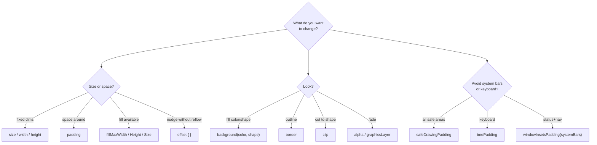

# Lesson 03 — Layout & Visual Modifiers

> After this lesson you can pick the right modifier for spacing, sizing, positioning, shaping, filling, and bordering — and know which ones change geometry versus which only change pixels.

**Module:** 04 · **Lesson:** 03 · **Level:** 🟢🟡🔴 · **Est. time:** 80–95 min

---

## 1. Concept

### 🟢 For beginners — *what is it and why do I care?*

This is your modifier toolbox. There are two broad families:

- **Layout modifiers** decide *where things are and how big they are*: `padding`, `size`, `width`, `height`, `fillMaxWidth`, `offset`, `wrapContentSize`.
- **Visual modifiers** decide *what they look like*: `background`, `border`, `clip`, `alpha`, `shadow`.

A handful you'll use constantly:

| Modifier | What it does |
|---|---|
| `padding(16.dp)` | space around the content |
| `size(48.dp)` | fixed width and height |
| `fillMaxWidth()` | take all available width |
| `offset(x, y)` | nudge position (without affecting layout) |
| `clip(shape)` | cut the content to a shape (e.g. a circle) |
| `background(color, shape)` | paint a color (optionally shaped) behind |
| `border(width, color, shape)` | draw an outline |

You combine these in a chain (Lesson 01) in a deliberate order (Lesson 02). This lesson teaches what each one *means* so you choose correctly.

### 🟡 For intermediate devs — *the mechanism*

Each modifier falls into one of Compose's node categories, and that category tells you what it can affect:

- **`LayoutModifierNode`** (padding, size, offset via `offset {}`, `fillMaxSize`, `aspectRatio`): participates in measure/place. Changes the element's size or its children's constraints.
- **`DrawModifierNode`** (background, border, drawBehind, drawWithContent): paints, but **does not change size**. A `background` never makes an element bigger.
- **`clip`** is special — it sets a `GraphicsLayer` shape that affects drawing **and** hit-testing, but not measured size.

Key distinctions intermediate devs must nail:

- **`size` vs `padding`**: `size` sets total dimensions; `padding` adds space *around* the inner content (and increases the element's measured size by the padding amount).
- **`offset` vs `padding` for positioning**: `padding` shifts content *and* reserves the space (changes layout); `offset` shifts the drawn position *without* changing the space it occupies (pure visual translation — siblings don't move).
- **`Modifier.offset(x, y)` vs `Modifier.offset { IntOffset(...) }`**: the lambda version defers the read to the **layout phase**, so animating offset via the lambda avoids recomposition — a performance lever you'll formalize in [Module 11](../module-11-performance/README.md).
- **`background(color)` requires a shape for rounding**: `background(color, RoundedCornerShape(8.dp))` rounds the fill itself; `background(color)` then `clip(...)` rounds by clipping. Both work; the shaped-background form is one node instead of two.

### 🔴 For senior devs — *trade-offs, edges, internals*

- **Window insets are layout, not magic margins.** System bars, the IME (keyboard), the display cutout, and the navigation bar expose their sizes via `WindowInsets`. You consume them with modifiers like `Modifier.windowInsetsPadding(WindowInsets.systemBars)`, `Modifier.safeDrawingPadding()`, `Modifier.imePadding()`, or `Modifier.navigationBarsPadding()`. In **edge-to-edge** apps (the default since `enableEdgeToEdge()`), content draws *under* the bars, so you **must** apply inset padding where appropriate or content hides behind the status/nav bar. `Scaffold` consumes most insets for you and hands the rest to content via its `PaddingValues`.
- **Insets are *consumed* as they're applied.** Once a modifier pads for an inset, nested children shouldn't pad for it again, or you double-count. Compose tracks consumed insets so `consumeWindowInsets` / `Scaffold` can prevent double padding — get this wrong and you get a phantom gap.
- **`clip` forces a `GraphicsLayer`** (an offscreen-ish compositing buffer for that subtree). It's cheap but not free; clipping large, frequently-animating subtrees has a cost. Prefer a **shaped `background`/`border`** over `clip` when you only need a rounded *fill* and the content doesn't actually overflow the shape.
- **`shadow` also allocates a `GraphicsLayer`** and clips. `Modifier.shadow(elevation, shape)` is the idiomatic elevation for non-Material surfaces; for Material components prefer the component's `tonalElevation`/`shadowElevation` so theming stays consistent.
- **`offset` can draw outside parent bounds** (it doesn't clip by default) and **doesn't affect siblings** — great for badges/overlaps, dangerous if you forget the content can spill and isn't hit-testable where it *appears* if the parent clips.
- **`aspectRatio`, `weight`, `matchParentSize`** resolve against the constraints at their chain position; `matchParentSize` (a `BoxScope` modifier) sizes to the *other* children's resolved size without affecting it — useful for backgrounds that must match a sibling's measured size.
- **`alpha` below 1f promotes to a layer too** (to composite correctly), so animating `alpha` on a big subtree is a layer operation; prefer animating via `graphicsLayer { this.alpha = ... }` when you're already in a layer.

### Analogy

Laying out a room. **Layout modifiers** are the *furniture placement and footprint*: how big the sofa is (`size`), how far it sits from the wall (`padding`), nudging it two inches left for looks without changing the floor plan (`offset`). **Visual modifiers** are the *finish*: the upholstery color (`background`), the trim (`border`), cutting a rug to a circle (`clip`). And **insets** are the building's fixed fixtures — radiators and vents (status bar, keyboard) you must leave clearance around so nothing gets blocked.

### Mental model

> **Layout modifiers change the footprint; visual modifiers change the finish; insets reserve room for the system's UI. `offset` moves the look without moving the footprint.**

### Real-world example

A story avatar with an online dot: a 56dp `clip(CircleShape)` image, a `border(2.dp, ring, CircleShape)`, and a small green `Box` positioned with `offset` so it overlaps the bottom-right edge — drawn outside the avatar's footprint without disturbing the row's layout. A screen using `Scaffold` for top-bar/IME insets and `safeDrawingPadding()` on a full-bleed background image is the same toolbox at app scale.

---

## 2. Visual Learning

**ASCII — modifier families and what they touch:**
```text
                 ┌──────────────── changes SIZE / POSITION ───────────────┐
   LAYOUT  ▶     │  padding   size/width/height   fillMax*   offset{ }     │
                 │  wrapContentSize   aspectRatio   weight                 │
                 └─────────────────────────────────────────────────────────┘
                 ┌──────────────── changes PIXELS only ───────────────────┐
   VISUAL  ▶     │  background   border   clip   alpha   shadow   drawBehind│
                 └─────────────────────────────────────────────────────────┘
                 ┌──────────────── reserves room for system UI ───────────┐
   INSETS  ▶     │  safeDrawingPadding  imePadding  navigationBarsPadding   │
                 │  windowInsetsPadding(WindowInsets.systemBars)            │
                 └─────────────────────────────────────────────────────────┘
```

**Mermaid — pick the right tool:**


**Illustration prompt (paste into an image generator):**
```text
Illustration: a tidy flat-lay "modifier toolbox" with three labeled drawers.
Drawer 1 "Layout" holds a ruler, measuring tape, and tiny floor-plan grid (padding, size, offset).
Drawer 2 "Visual" holds paint swatches, a picture frame, and scissors cutting a circle (background, border, clip).
Drawer 3 "Insets" holds a phone outline with status bar and keyboard zones marked as no-go stripes.
Each tool is clearly labeled. Modern, vibrant, soft gradients, clean studio lighting, top-down view.
```

---

## 3. Code

### 🟢 Beginner — the everyday modifiers

```kotlin
@Composable
fun ProfileChip() {
    Row(
        verticalAlignment = Alignment.CenterVertically,
        modifier = Modifier
            .fillMaxWidth()                          // take all available width
            .padding(16.dp)                          // outer spacing
            .clip(RoundedCornerShape(12.dp))         // rounded shape
            .background(Color(0xFFE3F2FD))           // fill inside the rounded shape
            .padding(12.dp)                          // inner content spacing
    ) {
        Box(
            Modifier
                .size(40.dp)                         // fixed 40×40 avatar
                .clip(CircleShape)                   // make it a circle
                .background(Color(0xFF42A5F5))
        )
        Spacer(Modifier.width(12.dp))
        Text("Ada Lovelace")
    }
}
```

**Explanation.** `fillMaxWidth` stretches the row; the outer `padding` is the margin; `clip` + `background` make a rounded card; the inner `padding` insets the content. The avatar uses `size` for fixed dimensions and `clip(CircleShape)` to round it. This is the daily-driver combination.

**Common mistakes.**
```kotlin
// ❌ Expecting background() alone to round corners — it won't; it's a rectangle.
Box(Modifier.background(Color.Blue).size(40.dp)) // square, and size after background is fine
                                                 // but no rounding happens

// ❌ Using padding to make something "bigger" — padding adds space, it doesn't set size.
Modifier.padding(40.dp) // 40dp of empty space, not a 40dp-tall element
```

**Best practices.**
- Use `size`/`width`/`height` for dimensions, `padding` for spacing — they're not interchangeable.
- To round a fill, pass a shape to `background`, or `clip` first.

---

### 🟡 Intermediate — offset vs padding, and edge-to-edge insets

```kotlin
@Composable
fun AvatarWithDot() {
    Box {
        // The avatar defines the footprint.
        Box(
            Modifier
                .size(56.dp)
                .clip(CircleShape)
                .background(Color(0xFF7E57C2))
        )
        // The dot is nudged OUTSIDE the avatar with offset — siblings/layout don't shift.
        Box(
            Modifier
                .align(Alignment.BottomEnd)
                .offset(x = 2.dp, y = 2.dp)          // visual nudge, no reflow
                .size(14.dp)
                .clip(CircleShape)
                .background(Color(0xFF66BB6A))
                .border(2.dp, MaterialTheme.colorScheme.surface, CircleShape)
        )
    }
}

@Composable
fun EdgeToEdgeScreen() {
    // App called enableEdgeToEdge(): content draws under the bars, so we pad for safe areas.
    Box(
        Modifier
            .fillMaxSize()
            .background(MaterialTheme.colorScheme.background)
            .safeDrawingPadding()                    // keep content clear of status/nav/cutout
    ) {
        Text("I won't hide behind the status bar.", Modifier.align(Alignment.TopStart))
    }
}
```

**Explanation.** `offset` moves the green dot to overlap the avatar's corner without changing layout — the parent `Box` still measures at 56dp. For edge-to-edge, `safeDrawingPadding()` insets content away from the status bar, nav bar, and cutout, so nothing is obscured.

**Common mistakes.**
```kotlin
// ❌ Using padding to position the dot → it reserves space and shifts other content.
Modifier.padding(start = 44.dp, top = 44.dp) // changes layout, not a clean overlap

// ❌ Forgetting insets in an edge-to-edge app → top content hides under the status bar.
Box(Modifier.fillMaxSize()) { Text("clipped under the status bar") }
```

**Best practices.**
- Use `offset` (ideally the `offset { }` lambda for animated nudges) for overlaps/badges; use `padding` when you actually want to reserve space.
- In edge-to-edge apps, apply the right inset modifier (`safeDrawingPadding`, `imePadding`, `navigationBarsPadding`) or let `Scaffold` handle it.

---

### 🔴 Production — a full-bleed header that respects insets, shadows, and shapes

```kotlin
@Composable
fun FeatureHeader(
    title: String,
    imageUrl: String,
    modifier: Modifier = Modifier,
) {
    Box(
        modifier = modifier
            .fillMaxWidth()
            .height(220.dp)
            .clip(RoundedCornerShape(bottomStart = 24.dp, bottomEnd = 24.dp)) // shape first
    ) {
        AsyncImage(
            model = imageUrl,
            contentDescription = null,                 // decorative; title carries meaning
            contentScale = ContentScale.Crop,
            modifier = Modifier.matchParentSize()       // fill the clipped Box exactly
        )
        // Scrim improves text contrast without a second layout node.
        Box(
            Modifier
                .matchParentSize()
                .background(
                    Brush.verticalGradient(
                        0f to Color.Transparent,
                        1f to Color.Black.copy(alpha = 0.55f)
                    )
                )
        )
        Text(
            text = title,
            style = MaterialTheme.typography.headlineSmall,
            color = Color.White,
            modifier = Modifier
                .align(Alignment.BottomStart)
                .safeDrawingPadding()                   // keep title off the cutout/status area
                .padding(16.dp)
        )
    }
}
```

**Explanation.** The header clips to a bottom-rounded shape, the image and scrim both `matchParentSize()` to fill that clipped region exactly (one Box's measured size drives both), the gradient scrim guarantees text contrast, and the title uses `safeDrawingPadding()` so it never collides with the status bar or display cutout in an edge-to-edge layout. `contentDescription = null` on the decorative image avoids redundant screen-reader noise since the title is the meaningful text.

**Common mistakes.**
```kotlin
// ❌ shadow AFTER clip on a rounded surface → the shadow is clipped to the shape and disappears.
Modifier.clip(RoundedCornerShape(24.dp)).shadow(8.dp) // shadow swallowed by the clip

// ❌ Double insets: Scaffold already padded for system bars, child pads again → phantom gap.
Scaffold { inner ->
    Box(Modifier.padding(inner).safeDrawingPadding()) { /* extra top gap */ }
}
```
Apply `shadow` *before* `clip` (shadow then clip), and don't re-consume insets a parent already handled.

**Best practices.**
- Put `shadow` before `clip`; pass the **same shape** to `shadow`/`clip`/`background` for consistent rounding.
- Use `matchParentSize()` (not `fillMaxSize()`) when a child must match a sibling's measured size in a `Box`.
- Apply insets **once** along a path; trust `Scaffold`'s `PaddingValues` and avoid re-padding for the same inset.

---

## 4. Interview Questions

**🟢 Beginner**

1. *What's the difference between `padding` and `size`?*
   > `size` sets the element's width and height; `padding` adds space around the inner content (and increases the element's measured size). They're not interchangeable — padding doesn't make something a fixed size.
2. *How do you make an image circular?*
   > `Modifier.clip(CircleShape)` (often with `size(...)` and `ContentScale.Crop`). `clip` cuts the content to the shape.

**🟡 Intermediate**

3. *When would you use `offset` instead of `padding` to move something?*
   > When you want to shift the drawn position *without* changing layout — `offset` doesn't reserve space and doesn't push siblings (ideal for badges/overlaps). `padding` reserves space and reflows neighbors.
4. *What are window insets and why do they matter in a modern app?*
   > Insets describe regions occupied by system UI (status bar, nav bar, IME, cutout). In edge-to-edge apps content draws under those bars, so you apply inset modifiers (`safeDrawingPadding`, `imePadding`, etc.) to keep content from hiding behind them.

**🔴 Senior**

5. *Why does `clip` (and `shadow`, `alpha < 1`) have a non-zero cost, and when would you avoid `clip`?*
   > Each promotes the subtree into a `GraphicsLayer` for correct compositing/clipping. For a rounded *fill* where content doesn't overflow, a shaped `background`/`border` avoids the layer. Reserve `clip` for when content genuinely must be cut to the shape, especially on large/animated subtrees.
6. *How does inset consumption prevent double padding, and what's the failure mode if you ignore it?*
   > Compose tracks which insets have been consumed along the modifier path; `Scaffold`/`consumeWindowInsets` mark them so descendants don't pad for the same inset again. Ignoring it means a child re-applies an inset its ancestor already applied, producing a visible phantom gap (e.g., double status-bar spacing).

---

## 5. AI Assistant

**Prompt example (insets + shaping):**
```text
Compose 2026, edge-to-edge (enableEdgeToEdge). Build a full-width 200dp header Box that:
clips to a bottom-rounded 24dp shape, crops an AsyncImage to fill, adds a bottom vertical-gradient
scrim, and places a white title at bottom-start that respects the display cutout/status bar.
Use safeDrawingPadding correctly and matchParentSize for the image. Don't double-apply insets.
```

**AI workflow — where it helps on *this* topic.**
- ✅ Great for: assembling a layout chain from a description, suggesting inset modifiers for edge-to-edge, picking `matchParentSize` vs `fillMaxSize`.
- ⚠️ Watch: models often **forget insets** entirely (content hidden behind bars), **double-apply** them under `Scaffold`, put `shadow` after `clip`, or use `padding` to position overlapping badges.

**Review workflow — check AI output against this lesson's *Common Mistakes*:**
- Are insets applied exactly once (no double padding under `Scaffold`)?
- Is `shadow` before `clip`; do `shadow`/`clip`/`background` share the same shape?
- Did it use `offset`/`matchParentSize` where appropriate rather than `padding`/`fillMaxSize`?
- Is decorative imagery `contentDescription = null` with meaning carried by text?

**Validation workflow — prove it works:**
1. **Preview on a device with a notch/cutout** and with the keyboard open; confirm nothing hides behind bars or the IME.
2. Toggle dark mode and confirm scrim/contrast still reads.
3. Use **Layout Inspector** to confirm there's no phantom inset gap and the touch/visual bounds match.
4. Profile if you clipped/shadowed a large animated subtree; consider a shaped background instead.

> **AI drafts, you decide.** Always test insets on a cutout device and with the keyboard up — that's where generated layouts break.

---

## Recap / Key takeaways

- **Layout modifiers** (padding, size, fill, offset) change footprint; **visual modifiers** (background, border, clip, alpha, shadow) change finish.
- `offset` moves the look **without** reflowing siblings; `padding` reserves space and reflows.
- Round fills with a **shaped `background`** (one node) or `clip` (a layer); put `shadow` **before** `clip`.
- In edge-to-edge apps, apply **inset modifiers** (`safeDrawingPadding`, `imePadding`, …) — once per path — or let `Scaffold` do it.
- `clip`/`shadow`/`alpha<1` allocate a `GraphicsLayer`; avoid `clip` for simple rounded fills on large/animated subtrees.

➡️ Next: **[Lesson 04 — `clickable` & interaction sources](04-clickable-interaction-sources.md)** — ripples, `MutableInteractionSource`, and pressed/hovered/focused state.
