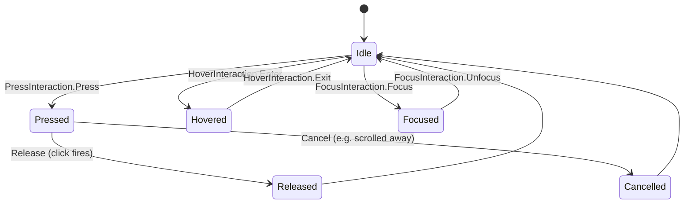

# Lesson 04 — `clickable` & Interaction Sources

> After this lesson you can make anything tappable, customize or remove the ripple, and react to pressed / hovered / focused / dragged states through a `MutableInteractionSource`.

**Module:** 04 · **Lesson:** 04 · **Level:** 🟢🟡🔴 · **Est. time:** 75–90 min

---

## 1. Concept

### 🟢 For beginners — *what is it and why do I care?*

Any composable can become tappable with one modifier:

```kotlin
Box(Modifier.clickable { /* handle tap */ }) { Text("Tap me") }
```

`clickable` does three things for you for free:

1. Registers a **click listener** (your lambda runs on tap).
2. Shows a **ripple** — that circular ink splash on Material surfaces — so the tap feels responsive.
3. Wires up **accessibility**: the element becomes focusable, announces as a button to screen readers, and responds to keyboard/D-pad "enter."

That third point is the big one. If you build your own tap handling with raw gestures (later lessons) you lose all of this. `clickable` is the right default for "this thing acts like a button."

### 🟡 For intermediate devs — *the mechanism*

`Modifier.clickable` has a richer overload:

```kotlin
Modifier.clickable(
    interactionSource = interactionSource,   // stream of interaction events
    indication = ripple(),                    // visual feedback (ripple, or null/custom)
    enabled = true,
    onClickLabel = "Open profile",            // a11y label for the action
    role = Role.Button,                       // a11y role
    onClick = { /* ... */ }
)
```

The key new concept is the **`MutableInteractionSource`** — a hot stream of `Interaction` events (`PressInteraction.Press/Release/Cancel`, `HoverInteraction.Enter/Exit`, `FocusInteraction.Focus/Unfocus`, `DragInteraction.*`). Two roles:

- **Producers** (`clickable`, `draggable`, `focusable`, text fields) emit interactions into it.
- **Consumers** read it to drive visuals. `indication` (the ripple) is one consumer; *you* can be another by calling `interactionSource.collectIsPressedAsState()`, `collectIsHoveredAsState()`, `collectIsFocusedAsState()`.

This is how you, say, scale a card down while it's pressed: share one `MutableInteractionSource` between `clickable` and your visual code, collect `isPressed`, and animate.

A few mechanics:
- `indication = null` removes the ripple entirely (for fully custom feedback).
- Pass the **same** `interactionSource` to the producer modifier and to your `collectIs…AsState()` calls — otherwise you're listening to a different stream and nothing fires.
- `LocalIndication` provides the default indication; `ripple()` is the Material 3 indication factory (the older `rememberRipple()` is `❌ deprecated`).

### 🔴 For senior devs — *trade-offs, edges, internals*

- **`ripple()` is an `IndicationNodeFactory`, not the legacy `Indication`.** Since Compose 1.7 / Material 1.3, indication is node-based: `Modifier.indication(source, ripple())` allocates a single draw node that reads the interaction stream, rather than the old `rememberUpdatedIndicationInstance` path. The deprecated `rememberRipple()` still compiles but should be replaced; it doesn't benefit from the node optimizations. Use `androidx.compose.material3.ripple()` for Material apps and `androidx.compose.foundation.ripple()` for foundation-only.
- **One `interactionSource` per interactive element, `remember`ed.** Allocate it with `remember { MutableInteractionSource() }`. Sharing one source across multiple elements merges their interactions (sometimes intentional — e.g., a row where pressing the trailing icon should ripple the whole row).
- **Hover and focus aren't just desktop.** Hover comes from mouse/stylus (Chromebooks, tablets, DeX, large-screen); focus comes from keyboard/D-pod/TV and from `focusable()`. A production component should look right pressed, hovered, **and** focused — three distinct states, all on the same source.
- **`collectIsPressedAsState()` is `derivedState` over the stream.** It reference-counts press/release/cancel; nested presses are handled. Don't hand-roll press tracking by collecting the flow yourself unless you need custom semantics — you'll mishandle `Cancel`.
- **`indication` decouples *what happened* from *how it looks*.** This is the seam that lets a design system swap ripple for a scale/tint everywhere by providing a custom `IndicationNodeFactory` via `LocalIndication`. Reusable components should accept an `indication`/`interactionSource` or read `LocalIndication`, not hardcode `ripple()`.
- **Always set `onClickLabel`/`role` on non-obvious clickables.** A clickable `Box` with no role announces poorly. `role = Role.Button`/`Role.Switch`/`Role.Checkbox` + `onClickLabel` is the difference between an accessible control and a mystery tap target.
- **`clickable` vs higher-level components.** A real `Button`/`Card` already wires interaction source + indication + semantics + min touch target (48dp). Reach for `clickable` when you need a custom surface; otherwise prefer the Material component so you inherit correct a11y and sizing.

### Analogy

`clickable` is a **doorbell button**: press it and it both *does something* (rings) and *gives feedback* (lights up). The **`MutableInteractionSource`** is the wire behind the button broadcasting its current state — pressed, hovered, focused. The **`indication`** (ripple) is whatever you wire that signal to: a chime, a glow, a buzz. You can rewire the feedback (custom indication) without changing the button, or tap the same wire to drive *other* effects (scale the door handle when pressed).

### Mental model

> **`clickable` = action + feedback + accessibility. The `MutableInteractionSource` is the live state of those interactions; `indication` turns that state into visuals. Share one source to both produce and consume.**

### Real-world example

A pricing card that lifts and tints while pressed: one `MutableInteractionSource` feeds `clickable` (the tap + default semantics) and `collectIsPressedAsState()` drives an animated elevation/scale. A media control that shows a focus ring on Android TV uses the same source's `collectIsFocusedAsState()`. A "ghost" button with no ripple passes `indication = null` and draws its own pressed background.

---

## 2. Visual Learning

**ASCII — one source, many consumers:**
```text
                    ┌───────────── MutableInteractionSource ─────────────┐
   producer ───────▶│  Press ▸ Release ▸ Cancel · Hover · Focus · Drag   │
   (clickable,      └───────┬───────────────┬───────────────┬───────────┘
    draggable,              │               │               │
    focusable)              ▼               ▼               ▼
                      indication       collectIsPressed  collectIsHovered
                      (ripple/custom)   AsState()         AsState()
                            │               │               │
                            ▼               ▼               ▼
                        ink splash      scale 0.97       tint highlight
```

**Mermaid — interaction lifecycle:**


**Illustration prompt (paste into an image generator):**
```text
Illustration: a single glowing doorbell button at the center. A labeled wire runs out of its back
to a junction box labeled "MutableInteractionSource". From the junction, three colored wires branch
to three small bulbs labeled "ripple", "scale (pressed)", and "tint (hovered)", each lighting up.
A subtle keyboard key and a mouse cursor near the button hint that focus and hover also feed the wire.
Clean, modern, vibrant, clearly labeled, soft studio lighting.
```

---

## 3. Code

### 🟢 Beginner — make anything clickable (accessibly)

```kotlin
@Composable
fun ClickableRow(onOpen: () -> Unit) {
    Row(
        verticalAlignment = Alignment.CenterVertically,
        modifier = Modifier
            .fillMaxWidth()
            .clickable(onClickLabel = "Open settings", onClick = onOpen) // a11y label included
            .padding(16.dp)                                              // ripple covers full row
    ) {
        Icon(Icons.Default.Settings, contentDescription = null)
        Spacer(Modifier.width(12.dp))
        Text("Settings")
    }
}
```

**Explanation.** The whole row becomes a button: tappable, with a ripple that (because `clickable` precedes `padding`) covers the full row, and announced to screen readers as "Open settings, button." One modifier gives you behavior + feedback + accessibility.

**Common mistakes.**
```kotlin
// ❌ padding before clickable → ripple/touch target excludes the padded edge (dead zone).
Modifier.padding(16.dp).clickable { onOpen() }

// ❌ No onClickLabel/role on a custom clickable → screen readers announce it poorly.
Modifier.clickable { onOpen() } // works, but inaccessible for a non-obvious target
```

**Best practices.**
- Put `clickable` before content `padding` so the ripple/touch target covers the visible element.
- Provide `onClickLabel` (and `role` when it isn't obviously a button) on custom clickables.

---

### 🟡 Intermediate — react to pressed state with a shared source

```kotlin
@Composable
fun PressableCard(
    onClick: () -> Unit,
    modifier: Modifier = Modifier,
) {
    val interactionSource = remember { MutableInteractionSource() }
    val isPressed by interactionSource.collectIsPressedAsState()
    // Animate a subtle scale while pressed.
    val scale by animateFloatAsState(if (isPressed) 0.97f else 1f, label = "pressScale")

    Card(
        modifier = modifier
            .graphicsLayer { scaleX = scale; scaleY = scale }     // layer read → no recompose to animate
            .clickable(
                interactionSource = interactionSource,            // SAME source the state reads
                indication = ripple(),                            // keep the Material ripple
                onClick = onClick
            )
    ) {
        Text("Press me", Modifier.padding(20.dp))
    }
}
```

**Explanation.** One `MutableInteractionSource` is shared between `clickable` (the producer) and `collectIsPressedAsState()` (the consumer). Pressing emits a `Press`, `isPressed` flips, and the card scales down. Because the scale is read inside `graphicsLayer { }`, the animation runs in the draw/layer phase without recomposing the card's content.

**Common mistakes.**
```kotlin
// ❌ Two different sources: the state never updates because clickable feeds a different stream.
val source = remember { MutableInteractionSource() }
val isPressed by remember { MutableInteractionSource() }.collectIsPressedAsState() // wrong source!
Modifier.clickable(interactionSource = source, indication = ripple()) { }

// ❌ Reading scale outside graphicsLayer → recomposes the whole card every animation frame.
Modifier.scale(scale) // fine visually, but worse than graphicsLayer for frequent changes
```

**Best practices.**
- Create the source once with `remember { MutableInteractionSource() }` and pass the **same** instance to producer and consumer.
- Drive frequent visual changes (scale/alpha/offset) through `graphicsLayer { }` to defer the read past composition.

---

### 🔴 Production — custom indication, focus + hover + press, no ripple

```kotlin
@Composable
fun SelectableTile(
    label: String,
    selected: Boolean,
    onClick: () -> Unit,
    modifier: Modifier = Modifier,
) {
    val interactionSource = remember { MutableInteractionSource() }
    val isPressed by interactionSource.collectIsPressedAsState()
    val isHovered by interactionSource.collectIsHoveredAsState()
    val isFocused by interactionSource.collectIsFocusedAsState()

    val targetColor = when {
        selected            -> MaterialTheme.colorScheme.primaryContainer
        isPressed           -> MaterialTheme.colorScheme.surfaceVariant
        isHovered || isFocused -> MaterialTheme.colorScheme.surface.copy(alpha = 0.9f)
        else                -> MaterialTheme.colorScheme.surface
    }
    val bg by animateColorAsState(targetColor, label = "tileBg")

    Box(
        modifier = modifier
            .clip(RoundedCornerShape(12.dp))
            .background(bg)
            // Focus ring for keyboard/D-pad/TV users.
            .then(if (isFocused) Modifier.border(2.dp, MaterialTheme.colorScheme.primary, RoundedCornerShape(12.dp)) else Modifier)
            .clickable(
                interactionSource = interactionSource,
                indication = null,                     // we render our own feedback above
                role = Role.Button,
                onClickLabel = label,
                onClick = onClick
            )
            .padding(16.dp)
    ) {
        Text(label)
    }
}
```

**Explanation.** A fully custom interactive surface: one source feeds press, hover, **and** focus, each driving an animated background, plus a focus ring so keyboard/TV users see where they are. `indication = null` turns off the ripple because the component paints its own feedback. `role` + `onClickLabel` keep it accessible despite being a `Box`. This is the shape of a real design-system component.

**Common mistakes.**
```kotlin
// ❌ rememberRipple() — deprecated indication API.
Modifier.clickable(interactionSource = src, indication = rememberRipple()) { } // ❌ use ripple()

// ❌ Handling only the pressed state → no hover/focus feedback on desktop/TV/keyboard.
val isPressed by src.collectIsPressedAsState() // looks dead on a Chromebook or Android TV

// ❌ indication = null but no custom feedback → the control feels broken (no response to touch).
Modifier.clickable(indication = null) { } // dead-feeling button
```

**Best practices.**
- Handle **press + hover + focus** for components that ship to large-screen/TV; render a visible focus indicator.
- Use `ripple()` (Material 3) — not the deprecated `rememberRipple()`. Only set `indication = null` if you provide your own feedback.
- Keep accessibility: `role`, `onClickLabel`, and a 48dp-minimum touch target.

---

## 4. Interview Questions

**🟢 Beginner**

1. *What three things does `Modifier.clickable { }` give you?*
   > A click listener, default visual feedback (a ripple on Material surfaces), and accessibility wiring — focusable, announced as a button, responsive to keyboard/D-pad enter.
2. *How do you remove the ripple from a clickable?*
   > Pass `indication = null` to the `clickable` overload (and supply your own feedback if you still want the control to feel responsive).

**🟡 Intermediate**

3. *What is a `MutableInteractionSource` and what do you do with it?*
   > A hot stream of interaction events (press, hover, focus, drag). You pass it to a producer like `clickable` and read it with `collectIsPressedAsState()` / `collectIsHoveredAsState()` / `collectIsFocusedAsState()` to drive custom visuals.
4. *Why must the same `interactionSource` be passed to both the modifier and the `collectIs…AsState()`?*
   > Because each source is an independent stream. If the producer emits into one source and you collect from another, your state never changes — the interactions you're listening for are happening elsewhere.

**🔴 Senior**

5. *How has indication changed in modern Compose, and why prefer `ripple()` over `rememberRipple()`?*
   > Indication is now node-based: `ripple()` returns an `IndicationNodeFactory` that allocates a single draw node reading the interaction stream, which is more efficient than the legacy `Indication`/`rememberRipple()` path. `rememberRipple()` is deprecated; `ripple()` (material3 or foundation variant) is the current API and integrates with `LocalIndication`.
6. *How would you let a design system swap all ripples for a custom feedback (e.g., scale + tint) app-wide?*
   > Provide a custom `IndicationNodeFactory` via `LocalIndication`, and have components read `LocalIndication.current` (or accept an `indication` param) instead of hardcoding `ripple()`. Because `indication` decouples "what happened" (interaction source) from "how it looks," changing the factory restyles every clickable without touching their logic.

---

## 5. AI Assistant

**Prompt example (custom pressed/hover/focus states):**
```text
Compose 2026 / Material 3. Build a SelectableTile(label, selected, onClick) that:
shares ONE remembered MutableInteractionSource between clickable and the visuals; animates its
background for pressed/hovered/focused/selected; shows a focus ring for keyboard/TV; sets
role=Role.Button and onClickLabel; uses indication=null because it draws its own feedback.
Use ripple() (NOT rememberRipple) if a ripple is needed. Keep a 48dp min touch target.
```

**AI workflow — where it helps on *this* topic.**
- ✅ Great for: wiring an interaction source to animated visuals, generating press/hover/focus handling, scaffolding a custom indication.
- ⚠️ Watch: models frequently emit **`rememberRipple()`** (deprecated), use **two different sources**, handle **only press** (no hover/focus), or drop accessibility (`role`/`onClickLabel`).

**Review workflow — check AI output against this lesson's *Common Mistakes*:**
- Is there **one** `remember { MutableInteractionSource() }`, passed to both producer and `collectIs…AsState()`?
- Is it `ripple()` (not `rememberRipple()`)? If `indication = null`, is there custom feedback?
- Are hover **and** focus handled, with a visible focus indicator for large-screen/TV?
- Are `role` and `onClickLabel` set, with a 48dp touch target?

**Validation workflow — prove it works:**
1. **Touch test**: press and confirm ripple/feedback covers the visible element (not a dead zone).
2. **Keyboard/D-pad test** (resizable emulator or TV): Tab/arrow to the control; confirm a focus ring and that Enter triggers `onClick`.
3. **Mouse test** (desktop/Chromebook/DeX): hover and confirm the hover state appears.
4. **TalkBack**: confirm the role and label are announced correctly.

> **AI drafts, you decide.** If generated code uses `rememberRipple()` or only handles press, fix it against this checklist before merging.

---

## Recap / Key takeaways

- `clickable` = **action + ripple + accessibility**; prefer it over raw gestures when something acts like a button.
- The **`MutableInteractionSource`** is the live stream of press/hover/focus/drag; share **one** remembered instance between producer and `collectIs…AsState()` consumers.
- **`indication`** turns interactions into visuals; use **`ripple()`** (not deprecated `rememberRipple()`), or `null` + your own feedback.
- Real components handle **press, hover, and focus**, with a visible focus indicator for keyboard/TV.
- Keep `role`, `onClickLabel`, and a 48dp touch target for accessibility.

➡️ Next: **[Lesson 05 — Focus management](05-focus-management.md)** — focus order, `FocusRequester`, and keyboard/IME flow.
