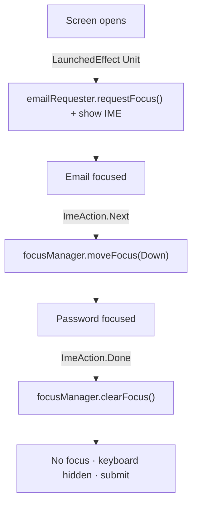

# Lesson 05 — Focus Management

> After this lesson you can control focus order, move focus programmatically with a `FocusRequester`, react to focus state, and build smooth keyboard/IME flows through a multi-field form.

**Module:** 04 · **Lesson:** 05 · **Level:** 🟢🟡🔴 · **Est. time:** 75–90 min

---

## 1. Concept

### 🟢 For beginners — *what is it and why do I care?*

**Focus** is "which element is currently selected to receive keyboard input or D-pad navigation." On a phone with a soft keyboard you mostly think about it in **forms**: the user types in the email field, taps **Next**, and the cursor jumps to the password field. That jump is focus moving.

It matters more than it seems:
- On **physical keyboards** (tablets, Chromebooks, DeX), users press **Tab** to move between fields — focus order must be sensible.
- On **Android TV / D-pad**, focus *is* the entire navigation model — there's no touch.
- For **accessibility**, focus order is how many users traverse your screen.

Compose gives you modifiers to make text fields focusable, control the order, and move focus from code (e.g., "press Next → go to the next field").

### 🟡 For intermediate devs — *the mechanism*

The toolbox:

- **`Modifier.focusable()`** — makes a non-text element participate in focus (text fields are focusable already).
- **`FocusRequester`** — a handle you attach with `Modifier.focusRequester(requester)`; call `requester.requestFocus()` to move focus there programmatically (e.g., autofocus a search field on open).
- **`LocalFocusManager`** — `val focusManager = LocalFocusManager.current` lets you `moveFocus(FocusDirection.Next)` or `clearFocus()` (which also dismisses the keyboard).
- **`Modifier.onFocusChanged { focusState -> }`** — react to gaining/losing focus (`focusState.isFocused`, `hasFocus`).
- **`Modifier.focusProperties { next = otherRequester; ... }`** — override the default geometric focus order (what Tab/D-pad does).

For text fields, **`KeyboardOptions`** + **`KeyboardActions`** wire the IME action button:

```kotlin
OutlinedTextField(
    value = email, onValueChange = { email = it },
    keyboardOptions = KeyboardOptions(imeAction = ImeAction.Next),
    keyboardActions = KeyboardActions(onNext = { focusManager.moveFocus(FocusDirection.Down) })
)
```

So "Next" on the keyboard moves focus down to the password field; "Done" can clear focus and submit.

### 🔴 For senior devs — *trade-offs, edges, internals*

- **Focus order is geometric by default, overridable explicitly.** Compose computes a 2D focus search from positions; usually correct, but complex layouts (a field that visually follows another but is a different subtree) can surprise you. `Modifier.focusProperties { next = …; previous = …; down = … }` and `Modifier.focusGroup()` let you impose order. Prefer fixing layout/order over hardcoding requesters when you can.
- **`FocusRequester.requestFocus()` must run after the node is attached.** Calling it during initial composition before layout throws or no-ops. Wrap autofocus in `LaunchedEffect(Unit) { requester.requestFocus() }` so it runs after the first frame. For IME-on-focus, also coordinate with the soft keyboard controller.
- **`FocusRequester.Default` / `Cancel` and `focusProperties`** can *cancel* focus moves or redirect them — useful for trapping focus in a dialog (a focus trap) so Tab cycles within the modal. `focusProperties { canFocus = false }` removes a node from traversal without removing it from the tree.
- **Clearing focus ≠ hiding the keyboard, but `clearFocus()` does both.** `LocalSoftwareKeyboardController.current?.hide()` hides the IME without moving focus; `focusManager.clearFocus()` drops focus *and* dismisses the IME. Pick based on whether you want the field to lose its selected state.
- **`onFocusChanged` fires for the whole subtree.** It reports `isFocused` (this exact node) vs `hasFocus` (this node or a descendant). Using the wrong one is a classic bug — e.g., a container that highlights when *any* child is focused should check `hasFocus`.
- **TV/large-screen demands a visible focus indicator and a sane initial focus.** On D-pad there's no cursor; the *focused* item must be obvious (see Lesson 04's focus ring). Set an initial focus target with `requestFocus()` so the remote has somewhere to start.
- **Keyboard handling (`onKeyEvent` / `onPreviewKeyEvent`)** lives alongside focus: only the focused subtree receives key events. `onPreviewKeyEvent` sees them first (good for shortcuts/escape-to-close); `onKeyEvent` after children. Consume (`return true`) to stop propagation.

### Analogy

Focus is the **"you are here" spotlight on a stage**. Only the actor in the spotlight can speak into the mic (receive input). The **`FocusRequester`** is the stage manager who can move the spotlight to a specific actor on cue. **Focus order** is the choreography for how the spotlight walks the stage when you say "next." On a TV remote, the spotlight is *all* you have — so it had better be visible and start somewhere sensible.

### Mental model

> **Focus is the single element receiving input. Order is geometric unless you override it; move it with a `FocusRequester` (after layout) and the `FocusManager`; react with `onFocusChanged` using `isFocused` vs `hasFocus` correctly.**

### Real-world example

A sign-in form: email field has `imeAction = Next` (jumps to password), password has `imeAction = Done` (clears focus + submits). On open, a `LaunchedEffect` requests focus on the email field and shows the keyboard. On a tablet keyboard, Tab walks email → password → submit. In a search bar, focus drives an autofocus-on-open and an "X" that `clearFocus()`es to dismiss the keyboard.

---

## 2. Visual Learning

**ASCII — focus moving through a form:**
```text
   [ Email ▮ ]  ← focus here, keyboard shows "Next"
        │ press Next  → focusManager.moveFocus(Down) / KeyboardActions.onNext
        ▼
   [ Password ▮ ]  ← focus moves here, keyboard shows "Done"
        │ press Done  → focusManager.clearFocus()  (also hides keyboard)
        ▼
   [  Sign in  ]  ← submit; nothing focused, keyboard gone
```

**Mermaid — programmatic focus flow:**


**Illustration prompt (paste into an image generator):**
```text
Illustration: a theater stage viewed head-on with three labeled podiums "Email", "Password", "Sign in".
A bright circular spotlight sits on the Email podium. A dotted arrow shows the spotlight sliding to
Password, then to Sign in, labeled "Next", "Done". A small figure in the wings labeled "FocusRequester"
holds a lever controlling the spotlight. A floating keyboard near the lit podium shows a highlighted
"Next" key. Clean, modern, theatrical lighting, clearly labeled.
```

---

## 3. Code

### 🟢 Beginner — Next/Done across two fields

```kotlin
@Composable
fun MiniLoginForm(onSubmit: () -> Unit) {
    var email by rememberSaveable { mutableStateOf("") }
    var password by rememberSaveable { mutableStateOf("") }
    val focusManager = LocalFocusManager.current

    Column(verticalArrangement = Arrangement.spacedBy(12.dp)) {
        OutlinedTextField(
            value = email,
            onValueChange = { email = it },
            label = { Text("Email") },
            singleLine = true,
            keyboardOptions = KeyboardOptions(imeAction = ImeAction.Next),
            keyboardActions = KeyboardActions(onNext = { focusManager.moveFocus(FocusDirection.Down) })
        )
        OutlinedTextField(
            value = password,
            onValueChange = { password = it },
            label = { Text("Password") },
            singleLine = true,
            visualTransformation = PasswordVisualTransformation(),
            keyboardOptions = KeyboardOptions(imeAction = ImeAction.Done),
            keyboardActions = KeyboardActions(onDone = {
                focusManager.clearFocus()    // drop focus + hide keyboard
                onSubmit()
            })
        )
    }
}
```

**Explanation.** Each field declares an IME action (`Next`, `Done`) and what it does: "Next" moves focus down to the password; "Done" clears focus (dismissing the keyboard) and submits. No `FocusRequester` needed — `moveFocus(Down)` uses the geometric order.

**Common mistakes.**
```kotlin
// ❌ ImeAction set but no KeyboardActions → the button shows but does nothing.
KeyboardOptions(imeAction = ImeAction.Next) // and no onNext handler

// ❌ Hiding the keyboard without clearing focus when you meant to "finish".
keyboardController?.hide() // field still looks focused
```

**Best practices.**
- Pair every `imeAction` with a matching `KeyboardActions` handler.
- Use `clearFocus()` to both drop focus and dismiss the keyboard when finishing a form.

---

### 🟡 Intermediate — autofocus on open + react to focus

```kotlin
@Composable
fun AutoFocusSearch(
    query: String,
    onQueryChange: (String) -> Unit,
) {
    val requester = remember { FocusRequester() }
    val keyboard = LocalSoftwareKeyboardController.current
    var isFocused by remember { mutableStateOf(false) }

    // Request focus AFTER the node is laid out — not during composition.
    LaunchedEffect(Unit) {
        requester.requestFocus()
        keyboard?.show()
    }

    OutlinedTextField(
        value = query,
        onValueChange = onQueryChange,
        label = { Text("Search") },
        singleLine = true,
        trailingIcon = {
            if (isFocused && query.isNotEmpty()) {
                IconButton(onClick = { onQueryChange("") }) {
                    Icon(Icons.Default.Clear, contentDescription = "Clear search")
                }
            }
        },
        modifier = Modifier
            .fillMaxWidth()
            .focusRequester(requester)                       // attach the handle
            .onFocusChanged { isFocused = it.isFocused }     // this exact node
    )
}
```

**Explanation.** `LaunchedEffect(Unit)` defers `requestFocus()` until after the first frame, then shows the keyboard — the correct way to autofocus. `onFocusChanged` tracks `isFocused` to show a clear button only while the field is active. `focusRequester(requester)` must be on the field whose focus you control.

**Common mistakes.**
```kotlin
// ❌ requestFocus() during composition → runs before attach, no-ops or throws.
val requester = remember { FocusRequester() }
requester.requestFocus()        // called inline in the composable body — wrong

// ❌ Using hasFocus when you mean this node, or isFocused when you mean the subtree.
.onFocusChanged { isFocused = it.hasFocus } // true if ANY descendant is focused
```

**Best practices.**
- Always autofocus inside `LaunchedEffect(Unit)` (or a `key`ed effect), never in the composition path.
- Choose `isFocused` (this node) vs `hasFocus` (node or descendant) deliberately.

---

### 🔴 Production — explicit focus order + a focus trap in a dialog

```kotlin
@Composable
fun OtpDialog(
    onDismiss: () -> Unit,
    onVerify: (String) -> Unit,
) {
    val (r1, r2) = remember { FocusRequester.createRefs() }
    var code by rememberSaveable { mutableStateOf("") }
    var pin by rememberSaveable { mutableStateOf("") }
    val focusManager = LocalFocusManager.current

    Dialog(onDismissRequest = onDismiss) {
        Surface(shape = RoundedCornerShape(16.dp)) {
            Column(
                Modifier
                    .padding(24.dp)
                    // Esc closes the dialog from a hardware keyboard; preview sees keys first.
                    .onPreviewKeyEvent { e ->
                        if (e.type == KeyEventType.KeyDown && e.key == Key.Escape) { onDismiss(); true } else false
                    }
                    .focusGroup(),                                  // group for traversal/trap
                verticalArrangement = Arrangement.spacedBy(12.dp),
            ) {
                OutlinedTextField(
                    value = code, onValueChange = { code = it },
                    label = { Text("Account code") }, singleLine = true,
                    keyboardOptions = KeyboardOptions(imeAction = ImeAction.Next),
                    keyboardActions = KeyboardActions(onNext = { r2.requestFocus() }),
                    modifier = Modifier
                        .focusRequester(r1)
                        .focusProperties { next = r2 }              // explicit: code → pin
                )
                OutlinedTextField(
                    value = pin, onValueChange = { pin = it },
                    label = { Text("PIN") }, singleLine = true,
                    keyboardOptions = KeyboardOptions(imeAction = ImeAction.Done),
                    keyboardActions = KeyboardActions(onDone = { focusManager.clearFocus(); onVerify("$code-$pin") }),
                    modifier = Modifier
                        .focusRequester(r2)
                        .focusProperties { previous = r1 }          // explicit: pin → code
                )
                Button(onClick = { onVerify("$code-$pin") }, modifier = Modifier.fillMaxWidth()) {
                    Text("Verify")
                }
            }
        }
    }
    // Initial focus once the dialog is composed.
    LaunchedEffect(Unit) { r1.requestFocus() }
}
```

**Explanation.** `FocusRequester.createRefs()` makes two linked handles; `focusProperties { next/previous }` pins the traversal order explicitly so Tab/D-pad always goes code → pin regardless of layout quirks. `onPreviewKeyEvent` adds an Escape-to-close shortcut (preview phase sees keys before children). `focusGroup()` scopes traversal. Initial focus is set in `LaunchedEffect(Unit)` after composition. This is the pattern for accessible, keyboard-navigable modals.

**Common mistakes.**
```kotlin
// ❌ No focusGroup/explicit order in a dialog → Tab can escape to elements behind the modal.
// (Focus "leaks" out of the dialog because traversal isn't scoped/trapped.)

// ❌ onKeyEvent instead of onPreviewKeyEvent for a global Escape → a child may consume it first.
Modifier.onKeyEvent { /* Escape handled too late or never */ }
```

**Best practices.**
- In dialogs, scope focus with `focusGroup()` and explicit `focusProperties` so traversal stays inside the modal.
- Use `onPreviewKeyEvent` for shortcuts that must win (Escape/Enter); consume by returning `true`.
- Set initial focus via `LaunchedEffect(Unit) { requester.requestFocus() }`.

---

## 4. Interview Questions

**🟢 Beginner**

1. *How do you make pressing "Next" on the keyboard jump to the next field?*
   > Set `keyboardOptions = KeyboardOptions(imeAction = ImeAction.Next)` and handle it in `keyboardActions = KeyboardActions(onNext = { focusManager.moveFocus(FocusDirection.Down) })`.
2. *What does `focusManager.clearFocus()` do?*
   > Removes focus from the currently focused element and dismisses the soft keyboard — the typical "I'm done with this form" action.

**🟡 Intermediate**

3. *Why must `requestFocus()` run inside a `LaunchedEffect` rather than the composable body?*
   > The `FocusRequester` must be attached to a laid-out node before it can take focus. Calling `requestFocus()` during composition runs before the node is attached, so it no-ops or throws. `LaunchedEffect(Unit)` defers it to after the first frame.
4. *What's the difference between `isFocused` and `hasFocus` in `onFocusChanged`?*
   > `isFocused` is true only when *this exact* node holds focus; `hasFocus` is true when this node *or any descendant* holds focus. A container highlighting on child focus should use `hasFocus`; a single field should use `isFocused`.

**🔴 Senior**

5. *How do you guarantee a sensible focus order when the default geometric traversal is wrong?*
   > Override it with `Modifier.focusProperties { next = …; previous = …; down = … }` (often using `FocusRequester.createRefs()`), and scope regions with `Modifier.focusGroup()`. Prefer fixing layout/source order first; use explicit overrides for genuinely non-linear flows.
6. *How would you trap focus inside a modal dialog and add an Escape-to-close shortcut?*
   > Scope traversal with `focusGroup()` plus explicit `focusProperties` so Tab/D-pad can't reach elements behind the modal, set initial focus with `requestFocus()`, and handle Escape in `onPreviewKeyEvent` (which sees key events before children), returning `true` to consume it.

---

## 5. AI Assistant

**Prompt example (keyboard-navigable form):**
```text
Compose 2026 / Material 3. Build a 3-field form (name, email, password) where:
each field's IME action moves focus to the next via FocusManager/KeyboardActions, the last submits
with Done + clearFocus(); the name field autofocuses on open inside LaunchedEffect(Unit); and the
whole thing works with a hardware Tab key. Use FocusRequester.createRefs and explicit focusProperties
only if geometric order is wrong. Show isFocused (not hasFocus) usage for a per-field clear button.
```

**AI workflow — where it helps on *this* topic.**
- ✅ Great for: wiring IME actions to focus moves, scaffolding autofocus, generating `FocusRequester` ref plumbing.
- ⚠️ Watch: models call **`requestFocus()` in the composition path**, confuse **`isFocused`/`hasFocus`**, forget `KeyboardActions` (so the IME button is dead), and skip focus trapping in dialogs.

**Review workflow — check AI output against this lesson's *Common Mistakes*:**
- Is `requestFocus()` inside a `LaunchedEffect`, not inline?
- Does every `imeAction` have a matching `KeyboardActions` handler?
- Is `isFocused` vs `hasFocus` used correctly for the intent?
- For dialogs: is focus scoped (`focusGroup`/`focusProperties`) and is there an Escape path?

**Validation workflow — prove it works:**
1. **Soft keyboard**: tap through fields with Next/Done; confirm focus jumps and Done dismisses + submits.
2. **Hardware keyboard** (resizable emulator/Chromebook): Tab/Shift-Tab in order; confirm no focus leaks out of dialogs; Escape closes.
3. **D-pad/TV**: arrow-navigate; confirm a visible focus indicator and a sane initial focus.
4. **TalkBack**: confirm traversal order matches the visual/logical order.

> **AI drafts, you decide.** If generated autofocus is inline (not in `LaunchedEffect`), it'll silently fail — fix it before trusting it.

---

## Recap / Key takeaways

- **Focus** = the one element receiving input; it drives keyboard, D-pad/TV, and accessibility traversal.
- Move focus with **`FocusManager.moveFocus`/`clearFocus`** and **`FocusRequester.requestFocus()`** — the latter only **after** layout (`LaunchedEffect`).
- Pair every **`imeAction`** with a **`KeyboardActions`** handler; `clearFocus()` also hides the keyboard.
- React with **`onFocusChanged`**, choosing **`isFocused`** (this node) vs **`hasFocus`** (subtree) on purpose.
- For dialogs/complex flows, impose order with **`focusProperties`** + **`focusGroup`**, and handle shortcuts in **`onPreviewKeyEvent`**.

➡️ Next: **[Lesson 06 — `draggable` & `pointerInput`](06-draggable-pointerinput.md)** — gesture detectors, `awaitPointerEventScope`, and consuming events.
