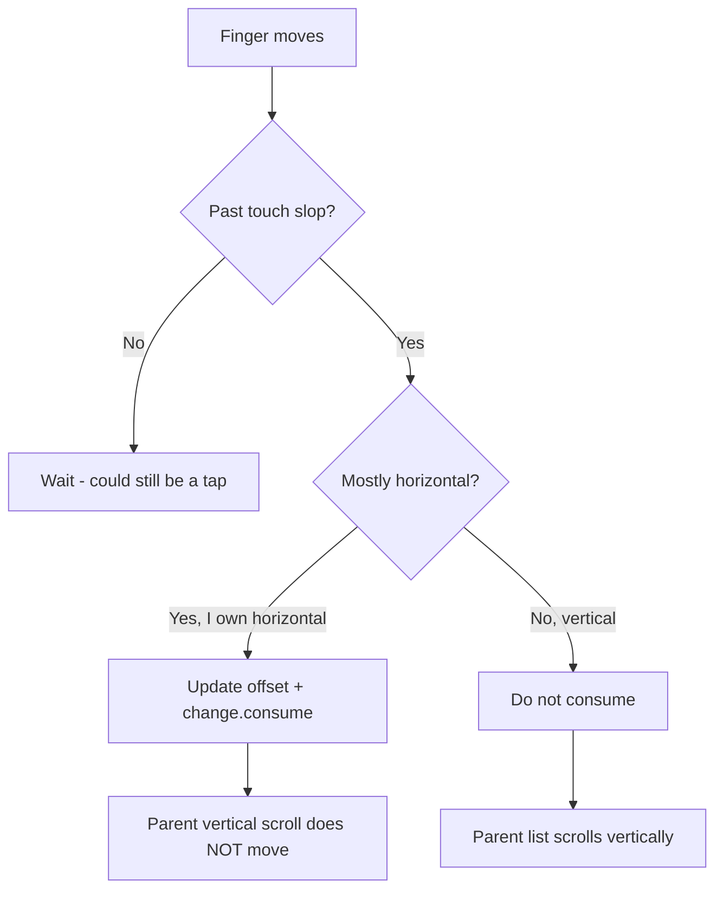

# Lesson 06 — `draggable` & `pointerInput`

> After this lesson you can build custom gestures from raw pointer events — drags, taps, long-presses, transforms — and know exactly when to consume an event and why.

**Module:** 04 · **Lesson:** 06 · **Level:** 🟢🟡🔴 · **Est. time:** 90–110 min

---

## 1. Concept

### 🟢 For beginners — *what is it and why do I care?*

`clickable` handles taps. But sometimes you need **drag**, **swipe**, **pinch**, **double-tap**, or **long-press** — gestures `clickable` doesn't cover. Compose gives you two levels:

1. **High-level gesture modifiers** — ready-made detectors:
   - `Modifier.draggable(...)` — drag along one axis (horizontal or vertical).
   - `Modifier.pointerInput(key) { detectTapGestures(onLongPress = ...) }` — taps, double-taps, long-press.
   - `Modifier.pointerInput(key) { detectDragGestures { ... } }` — free 2D drag.
   - `Modifier.pointerInput(key) { detectTransformGestures { ... } }` — pinch-zoom + rotate + pan.
2. **Low-level `pointerInput`** — the raw stream of finger/mouse events you build *anything* from.

For 90% of needs, the high-level detectors are enough. You drop to raw `pointerInput` when you need custom logic (like a swipe-to-dismiss that also tracks velocity and snaps).

A tiny draggable box:

```kotlin
var offsetX by remember { mutableFloatStateOf(0f) }
Box(
    Modifier
        .offset { IntOffset(offsetX.roundToInt(), 0) }
        .draggable(
            orientation = Orientation.Horizontal,
            state = rememberDraggableState { delta -> offsetX += delta }
        )
)
```

### 🟡 For intermediate devs — *the mechanism*

`Modifier.pointerInput(key1) { ... }` runs a **coroutine** (a `PointerInputScope`) that lives as long as the keys stay the same. Inside it you `await` pointer events. The detectors are just prewritten coroutines over this primitive.

Core APIs inside the scope:

- **`awaitPointerEventScope { ... }`** — enter the event loop.
- **`awaitFirstDown()`** — suspend until a finger touches down.
- **`awaitPointerEvent()`** — get the next batch of pointer changes (moves, ups, additional fingers).
- **`PointerInputChange`** — one pointer's data: `position`, `previousPosition`, `pressed`, and crucially **`change.consume()`** / `change.isConsumed`.

**Consuming is the heart of gesture coordination.** When you `consume()` a change, you tell other gesture handlers (and parents) "I've handled this; don't also act on it." A draggable that doesn't consume its drag will fight a parent scroll for the same finger movement. Conversely, *not* consuming lets a parent take over (e.g., let a vertical scroll win while you only handle horizontal).

The `key` in `pointerInput(key)` matters: when the key changes, the gesture coroutine is **cancelled and restarted**. Pass the state your gesture logic depends on as the key (or `Unit` if it never needs to restart) — a stale closure over old state is a classic bug.

### 🔴 For senior devs — *trade-offs, edges, internals*

- **Pointer events have two passes: `Initial` (top-down) and `Main` (bottom-up).** By default you handle the `Main` pass (children get first dibs). Reading/consuming in the `Initial` pass lets a *parent* intercept before children — how a carousel can claim a horizontal swipe before a child button sees it. `awaitPointerEvent(PointerEventPass.Initial)` is the lever; misuse causes children to feel "dead."
- **Consume granularly and intentionally.** `change.consume()` marks the change consumed for subsequent handlers; `change.isConsumed` lets cooperative detectors bail. Over-consuming kills nested scrolling; under-consuming causes double-handling (your drag *and* the parent scroll both move). The rule: consume the axis/gesture you actually own, as soon as you commit to it (often after passing a **touch slop** threshold).
- **Touch slop prevents jittery starts.** `viewConfiguration.touchSlop` is the distance a finger must travel before a "drag" is recognized, so a slightly-wobbly tap isn't a drag. `awaitTouchSlopOrCancellation` / the built-in `detectDragGestures` handle this; hand-rolled drags must respect slop or they'll feel twitchy and steal taps.
- **Velocity for fling/snap comes from a `VelocityTracker`.** For swipe-to-dismiss or fling-to-snap, record positions into a `VelocityTracker`, compute `calculateVelocity()` on release, and decide snap vs. settle (often via `Animatable.animateDecay`/`animateTo`). `draggable` exposes velocity through its `onDragStopped`.
- **`detectDragGestures` vs `draggable` vs `AnchoredDraggable`.** `draggable` is 1-axis with a `DraggableState`. `detectDragGestures` is free 2D in raw `pointerInput`. **`AnchoredDraggable`** (the modern replacement for the deprecated `swipeable`) snaps to defined anchors with thresholds + velocity — the right tool for swipe-to-dismiss, bottom sheets, and segmented swipes. Prefer `AnchoredDraggable` over re-implementing snapping.
- **Multitouch needs explicit pointer bookkeeping.** `awaitPointerEvent()` returns *all* pointers; for pinch/rotate use `detectTransformGestures` (handles centroid, zoom, rotation) rather than tracking two fingers by hand. If you must, track by `PointerId`.
- **Pointer input is part of the modifier node graph**, so its position in the chain (relative to `clip`, `offset`, `padding`) changes the hit-test region — exactly as in Lesson 02. A `pointerInput` after `clip` only receives events inside the clipped shape.
- **Cancellation safety.** The gesture coroutine can be cancelled mid-gesture (key change, removal). Use `try/finally` (or structured `Animatable` calls) so you don't leave state half-updated (e.g., an item stuck mid-swipe).

### Analogy

Raw `pointerInput` is **air-traffic control for fingers**. Each finger is a plane (pointer) sending position updates (events). You decide who lands where, and when you "claim" a plane (`consume()`), no other controller (parent/child) can also direct it — preventing two controllers from steering the same plane into chaos (a gesture conflict). High-level detectors are *autopilot routines* that handle common landings for you.

### Mental model

> **`pointerInput` is a coroutine that awaits pointer events. You move state from the deltas, respect touch slop before committing, and `consume()` the events you own so parents/children don't also act on them.**

### Real-world example

Swipe-to-dismiss (the module project): a card tracks horizontal drag via `AnchoredDraggable` (or raw `pointerInput` + `VelocityTracker`), consumes horizontal movement so the vertical list keeps scrolling, and on release either snaps back or flings off-screen by velocity. A photo viewer uses `detectTransformGestures` for pinch-zoom + pan. A reorderable list long-presses (`detectTapGestures(onLongPress)`) to enter drag mode, then `detectDragGestures` to move items.

---

## 2. Visual Learning

**ASCII — the pointer event loop:**
```text
   pointerInput(key) {
     awaitPointerEventScope {
        down = awaitFirstDown()         ── finger touches ──▶ ● 
        loop:
           event = awaitPointerEvent()  ── moves/ups ──▶ ●→●→●
           if (past touch slop) {
               offset += event.delta     (update state)
               event.changes.consume()   (I OWN this drag) ── blocks parent scroll
           }
        until all pointers up
     }
   }
   key changes ──▶ coroutine cancelled & restarted (beware stale state!)
```

**Mermaid — consume decision in a nested scroll conflict:**


**Illustration prompt (paste into an image generator):**
```text
Illustration: an air-traffic-control tower scene, stylized and clean. Several paper-airplane "fingers"
approach labeled with little position trails (pointer events). A controller in the tower holds a
"CONSUME" stamp; one airplane is stamped CONSUMED and glows, with a red barrier stopping a second
controller (labeled "Parent Scroll") from grabbing it. A dashed ring around the runway is labeled
"touch slop threshold". Modern, vibrant, clearly labeled, soft lighting.
```

---

## 3. Code

### 🟢 Beginner — a 1-axis draggable box

```kotlin
@Composable
fun DragMeBox() {
    var offsetX by remember { mutableFloatStateOf(0f) }

    Box(
        Modifier
            .offset { IntOffset(offsetX.roundToInt(), 0) }   // layout-phase read: no recompose
            .size(80.dp)
            .background(Color(0xFF42A5F5), RoundedCornerShape(12.dp))
            .draggable(
                orientation = Orientation.Horizontal,
                state = rememberDraggableState { delta -> offsetX += delta }
            )
    )
}
```

**Explanation.** `draggable` with `Orientation.Horizontal` reports a `delta` for each move; we add it to `offsetX`. Reading `offsetX` inside `offset { }` defers the read to the layout phase, so dragging doesn't recompose the box — it just re-lays-out. This is the smallest correct custom drag.

**Common mistakes.**
```kotlin
// ❌ Reading offset in the composition path → recomposes every frame of the drag.
Box(Modifier.offset(x = offsetX.dp)) // uses the value-based offset; prefer offset { } for animation

// ❌ Forgetting rememberDraggableState → recreating state each recomposition loses the drag.
state = DraggableState { offsetX += it } // not remembered
```

**Best practices.**
- Use `offset { IntOffset(...) }` (lambda) for dragged/animated positions to stay off the composition path.
- Always `rememberDraggableState { }` so the drag state survives recomposition.

---

### 🟡 Intermediate — raw `pointerInput` with touch slop + consume

```kotlin
@Composable
fun HorizontalDragRow(content: @Composable () -> Unit) {
    var offsetX by remember { mutableFloatStateOf(0f) }

    Box(
        Modifier
            .offset { IntOffset(offsetX.roundToInt(), 0) }
            .pointerInput(Unit) {                       // Unit key: logic doesn't depend on state
                detectHorizontalDragGestures(
                    onHorizontalDrag = { change, dragAmount ->
                        offsetX += dragAmount
                        change.consume()                // claim horizontal movement
                    }
                )
            }
    ) { content() }
}
```

**Explanation.** `detectHorizontalDragGestures` handles touch slop and reports per-move `dragAmount`; we update state and `change.consume()` so a parent vertical scroller won't also react to this finger. Using `Unit` as the key keeps one long-lived coroutine because the logic only reads remembered state via closures that stay valid.

**Common mistakes.**
```kotlin
// ❌ Not consuming → the drag AND a parent scroll both move (double handling / fighting).
detectHorizontalDragGestures { change, amount -> offsetX += amount } // no change.consume()

// ❌ Keying pointerInput on a frequently-changing value → coroutine restarts mid-gesture, dropping it.
Modifier.pointerInput(offsetX) { /* restarts every drag tick */ }
```

**Best practices.**
- `consume()` the gesture you own to prevent conflicts with parents/children.
- Key `pointerInput` on `Unit` (or stable keys) so the gesture coroutine isn't cancelled mid-gesture; read changing state through remembered holders, not the key.

---

### 🔴 Production — swipe-to-dismiss with anchors + velocity

```kotlin
enum class DismissAnchor { Resting, Dismissed }

@OptIn(ExperimentalFoundationApi::class)
@Composable
fun SwipeToDismissCard(
    onDismissed: () -> Unit,
    modifier: Modifier = Modifier,
    content: @Composable () -> Unit,
) {
    val density = LocalDensity.current
    var widthPx by remember { mutableFloatStateOf(0f) }

    val state = remember(widthPx) {
        AnchoredDraggableState(
            initialValue = DismissAnchor.Resting,
            anchors = DraggableAnchors {
                DismissAnchor.Resting at 0f
                DismissAnchor.Dismissed at widthPx        // fully off to the right
            },
            positionalThreshold = { distance -> distance * 0.5f },  // past 50% commits
            velocityThreshold = { with(density) { 125.dp.toPx() } }, // fast flick commits
            snapAnimationSpec = spring(),
            decayAnimationSpec = exponentialDecay(),
        )
    }

    // When the gesture settles on Dismissed, fire the callback once.
    LaunchedEffect(state) {
        snapshotFlow { state.currentValue }
            .collect { if (it == DismissAnchor.Dismissed) onDismissed() }
    }

    Box(
        modifier
            .onSizeChanged { widthPx = it.width.toFloat() }
            .offset { IntOffset(state.requireOffset().roundToInt(), 0) }   // driven by the state
            .anchoredDraggable(state, Orientation.Horizontal)              // consumes + flings for us
    ) {
        content()
    }
}
```

**Explanation.** `AnchoredDraggableState` defines two anchors (Resting, Dismissed) with a **positional threshold** (cross 50% to commit) and a **velocity threshold** (a fast flick commits even before 50%). `anchoredDraggable` handles touch slop, consumption, and the fling/settle animation. We observe `currentValue` via `snapshotFlow` and call `onDismissed()` once when it settles on Dismissed. This is the modern, deprecation-free swipe-to-dismiss — far less error-prone than hand-rolling `VelocityTracker` + snap math.

**Common mistakes.**
```kotlin
// ❌ Using the deprecated swipeable() / rememberSwipeableState.
Modifier.swipeable(state, anchors, ...) // ❌ replaced by AnchoredDraggable

// ❌ Calling onDismissed() from inside the drag lambda → fires repeatedly / before settle.
onHorizontalDrag = { _, _ -> if (offsetX > widthPx * 0.5f) onDismissed() } // re-fires every tick

// ❌ Hardcoding anchor distance instead of measuring width → wrong on different screen sizes.
DismissAnchor.Dismissed at 1000f
```

**Best practices.**
- Prefer **`AnchoredDraggable`** over re-implementing snapping/velocity; it's the supported replacement for `swipeable`.
- Measure the dismiss distance from the actual width (`onSizeChanged`); don't hardcode pixels.
- Fire side effects (callback, removal) **once on settle** (`snapshotFlow { currentValue }`), not during the drag.

---

## 4. Interview Questions

**🟢 Beginner**

1. *When would you use `pointerInput`/`draggable` instead of `clickable`?*
   > When you need gestures beyond a tap — drags, swipes, long-press, double-tap, pinch/rotate. `clickable` only handles clicks (plus focus/ripple/a11y).
2. *What does `Modifier.draggable` give you?*
   > One-axis drag handling: it reports a `delta` per move via a `DraggableState`, plus touch-slop handling, so you can move state along a horizontal or vertical orientation.

**🟡 Intermediate**

3. *What does `change.consume()` do, and why does it matter?*
   > It marks a pointer change as handled so other gesture detectors and parent/child handlers don't also act on it. Without it, your drag can fight a parent scroll (both move); consuming the axis you own prevents the conflict.
4. *Why does the `key` in `pointerInput(key) { }` matter?*
   > When the key changes, the gesture coroutine is cancelled and restarted. Keying on a value that changes during the gesture (like the live offset) restarts it mid-gesture and drops it. Use `Unit`/stable keys and read changing state through remembered holders.

**🔴 Senior**

5. *Explain the Initial vs Main pointer passes and when you'd use Initial.*
   > Each event propagates Initial (top-down, parent → child) then Main (bottom-up, child → parent). Handlers default to Main so children get first chance. You read/consume in the Initial pass when a parent must intercept before children — e.g., a pager claiming a horizontal swipe before a child button reacts. Overusing Initial makes children feel unresponsive.
6. *How would you implement swipe-to-dismiss with snapping and fling, and why not `swipeable`?*
   > Use `AnchoredDraggable`: define anchors (resting/dismissed), a positional threshold and a velocity threshold, and let `anchoredDraggable` handle slop, consumption, and the settle/decay animation; observe `currentValue` to fire the dismissal once on settle. `swipeable`/`rememberSwipeableState` are deprecated; `AnchoredDraggable` is the supported replacement and handles velocity/anchors correctly.

---

## 5. AI Assistant

**Prompt example (swipe-to-dismiss):**
```text
Compose 2026, foundation AnchoredDraggable (NOT deprecated swipeable). Build SwipeToDismissCard:
two anchors (Resting at 0, Dismissed at measured width), positionalThreshold 50%, a velocityThreshold,
spring snap + decay fling. Drive position with offset { state.requireOffset() }, use anchoredDraggable
for consumption/fling, and call onDismissed() exactly once when currentValue settles on Dismissed via
snapshotFlow. Measure width with onSizeChanged. Don't fire onDismissed from inside the drag.
```

**AI workflow — where it helps on *this* topic.**
- ✅ Great for: scaffolding gesture detectors, wiring `AnchoredDraggable`, generating `VelocityTracker` boilerplate, explaining consume semantics.
- ⚠️ Watch: models reach for **deprecated `swipeable`**, **forget `change.consume()`** (gesture conflicts), **key `pointerInput` on the live offset**, fire callbacks **inside** the drag, and ignore **touch slop**.

**Review workflow — check AI output against this lesson's *Common Mistakes*:**
- Is it `AnchoredDraggable`, not `swipeable`/`rememberSwipeableState`?
- Does it `consume()` the owned axis? Is `pointerInput` keyed on `Unit`/stable values (not the live offset)?
- Are side effects fired **once on settle** (e.g., `snapshotFlow`), not per drag tick?
- Is the position read in the **layout phase** (`offset { }`), and is touch slop respected?

**Validation workflow — prove it works:**
1. **Nested scroll test**: put the draggable inside a `LazyColumn`; confirm horizontal swipe dismisses while vertical still scrolls (consume working).
2. **Velocity test**: a fast short flick should commit even before 50%; a slow short drag should snap back.
3. **Rotation/size test**: rotate or resize; confirm the dismiss distance recomputes (no hardcoded pixels).
4. **Recomposition counts** (Layout Inspector): confirm dragging doesn't recompose content (offset read is layout-phase).

> **AI drafts, you decide.** If the model uses `swipeable` or forgets `consume()`, it will conflict with scrolling — replace it per this checklist.

---

## Recap / Key takeaways

- High-level detectors (`draggable`, `detectTapGestures`, `detectDragGestures`, `detectTransformGestures`) cover most gestures; drop to raw **`pointerInput`** for custom logic.
- `pointerInput` is a **coroutine** awaiting pointer events; key it on `Unit`/stable values so it isn't cancelled mid-gesture.
- **`change.consume()`** claims the events you own and prevents conflicts with parent/child handlers; respect **touch slop** before committing.
- Use the **Initial pass** only when a parent must intercept before children.
- Prefer **`AnchoredDraggable`** (not deprecated `swipeable`) for snap/fling gestures; fire side effects **once on settle**, and read positions in the **layout phase** (`offset { }`).

➡️ Next: **[Lesson 07 — Nested scroll](07-nested-scroll.md)** — `NestedScrollConnection` and collapsing toolbars.
