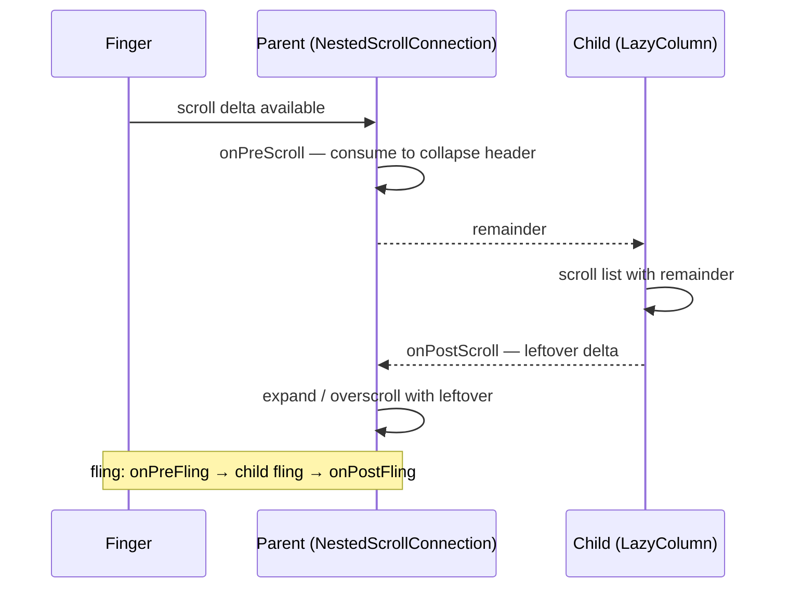

# Lesson 07 — Nested Scroll

> After this lesson you can coordinate scrolling between a parent and its scrollable children with `NestedScrollConnection`, and build a collapsing toolbar that consumes scroll deltas correctly.

**Module:** 04 · **Lesson:** 07 · **Level:** 🟢🟡🔴 · **Est. time:** 85–100 min

---

## 1. Concept

### 🟢 For beginners — *what is it and why do I care?*

You've seen this everywhere: you scroll a list, and the **toolbar at the top shrinks** (collapses) before the list itself starts scrolling. Or you pull down and a header expands. That coordination — a *parent* reacting to a *child's* scroll — is **nested scroll**.

The problem it solves: a `LazyColumn` (the list) handles its own scrolling. But the collapsing header is *outside* the list, in a parent. How does the parent "steal" some of the scroll to collapse the header *before* the list scrolls? They have to **share** the scroll gesture. Nested scroll is the protocol for that sharing.

You rarely write the low-level protocol by hand for common cases — Material 3's `TopAppBar` + `TopAppBarScrollBehavior` does collapsing toolbars for you. But understanding the protocol lets you build custom coordinated-scroll effects and debug the ones that fight each other.

### 🟡 For intermediate devs — *the mechanism*

Scrolling is distributed through a **`NestedScrollConnection`** attached with `Modifier.nestedScroll(connection)`. When a scrollable child receives a scroll, the deltas flow through a negotiation with its ancestors:

```text
onPreScroll  → parent gets first chance to consume (before the child scrolls)
   child scrolls with what's left
onPostScroll → parent gets the leftover the child didn't use
onPreFling   → parent can consume fling velocity before the child
onPostFling  → parent gets leftover fling velocity
```

A `NestedScrollConnection` overrides those callbacks and **returns how much it consumed** (as `Offset`/`Velocity`):

```kotlin
val connection = remember {
    object : NestedScrollConnection {
        override fun onPreScroll(available: Offset, source: NestedScrollSource): Offset {
            // consume some upward scroll to collapse the header first
            val delta = available.y
            val consumed = collapseHeaderBy(delta)     // your logic returns how much you used
            return Offset(0f, consumed)
        }
    }
}
```

- **`onPreScroll`** (parent first): use this to collapse the header *before* the list scrolls — the canonical collapsing-toolbar trick.
- **`onPostScroll`** (parent gets leftovers): use this for an overscroll/expand-on-reaching-top effect.
- **`available`** is what's left to distribute; **return** what you consumed so the child scrolls with the remainder.

### 🔴 For senior devs — *trade-offs, edges, internals*

- **Direction conventions: positive vs negative deltas.** Scroll deltas follow screen coordinates: dragging *up* (content moves up, you scroll down a list) produces a **negative** `y`. A collapsing header consumes negative pre-scroll to shrink, and positive post-scroll (when the list is at the top and there's leftover downward delta) to expand. Getting the sign wrong is the #1 nested-scroll bug.
- **`NestedScrollSource` distinguishes drag vs fling vs side-effect.** `source` tells you whether the delta came from a `Drag`, a `Fling`, or programmatic motion. A collapsing header often wants to collapse on drag but settle/snap on fling — branch on `source` to avoid janky half-collapsed states after a fling.
- **Consuming pre vs post changes who "wins" the gesture.** Pre-consumption gives the parent priority (header collapses before list moves); post-consumption is cooperative (list scrolls, parent uses what's left). For a toolbar that must fully collapse before the list scrolls, you **must** use `onPreScroll`. Mixing them wrong yields a header that collapses *and* the list scrolls simultaneously when you wanted sequential.
- **Material 3 already solved the common case.** `TopAppBarDefaults.enterAlwaysScrollBehavior()` / `exitUntilCollapsedScrollBehavior()` / `pinnedScrollBehavior()` provide a tested `nestedScrollConnection` + a hoistable `TopAppBarState`. Reach for these before hand-rolling; only build a custom `NestedScrollConnection` for non-standard motion (parallax, custom snap, multi-element headers).
- **Fling handoff is the subtle part.** `onPreFling`/`onPostFling` are **suspend** functions returning consumed `Velocity`; you typically `animateTo`/`animateDecay` the header and return what you used, so the remaining velocity flings the list. Forgetting to make these suspend-aware (or returning the wrong velocity) breaks the "fling the list, settle the header" feel.
- **Two scrollables in the same direction will fight without coordination.** Nesting a vertical scroller inside a vertical scroller is usually a design smell; if unavoidable, the inner one consumes first (Main pass) and the connection mediates leftovers. Compose's scrollables already participate in the protocol, so a custom connection is about *adding parent behavior*, not re-implementing child scrolling.
- **Hoist the collapse state.** Keep the header's collapsed fraction in a hoisted `state`/`TopAppBarState` so it survives recomposition and can be saved; computing it ad hoc inside the connection makes it un-restorable and hard to test.

### Analogy

Nested scroll is a **toll plaza on a highway**. The scroll gesture is a stream of cars (deltas) heading to the list. The collapsing header is the toll booth that takes *some* cars first (`onPreScroll`) before the rest continue to the list. Whatever the list doesn't use comes back through, and the booth can grab leftovers on the return trip (`onPostScroll`). Everyone must agree on who takes how many cars, or you get a traffic jam (two components fighting for the same scroll).

### Mental model

> **A child's scroll is offered to the parent first (`onPreScroll`), then the child scrolls the remainder, then the parent gets leftovers (`onPostScroll`). Return what you consume. Collapse-before-scroll lives in `onPreScroll`; signs follow screen coordinates.**

### Real-world example

A profile screen: a tall header image + a `LazyColumn` of posts. Scrolling up first collapses the header to a compact app bar (consumed in `onPreScroll`), *then* the list scrolls; scrolling back to the top re-expands the header (`onPostScroll`). The Material `TopAppBar` + `exitUntilCollapsedScrollBehavior()` is this exact pattern productized. A "pull to expand" search bar and a parallax cover photo are custom `NestedScrollConnection`s.

---

## 2. Visual Learning

**ASCII — the scroll negotiation:**
```text
   finger drags up (Δy negative)
            │
            ▼
   ┌──────────────── onPreScroll (PARENT first) ────────────────┐
   │  header consumes some Δ to collapse → returns consumed     │
   └───────────────────────────┬────────────────────────────────┘
                               │ remainder
                               ▼
                   ┌──── child (LazyColumn) scrolls ────┐
                   └───────────────┬────────────────────┘
                                   │ leftover
                                   ▼
   ┌──────────────── onPostScroll (PARENT leftovers) ───────────┐
   │  expand-on-top / overscroll effect → returns consumed      │
   └─────────────────────────────────────────────────────────────┘
```

**Mermaid — delta lifecycle:**


**Illustration prompt (paste into an image generator):**
```text
Illustration: a highway toll plaza seen from above. A stream of small cars labeled "scroll deltas"
approaches a booth labeled "Collapsing Header (onPreScroll)" that lifts its gate to let SOME cars
through after collecting a few. The remaining cars flow into a building labeled "LazyColumn".
A return lane shows leftover cars going back to a second booth labeled "onPostScroll (expand)".
Clean, modern, vibrant, clearly labeled, soft lighting, top-down perspective.
```

---

## 3. Code

### 🟢 Beginner — collapsing toolbar with Material 3 (no custom protocol)

```kotlin
@OptIn(ExperimentalMaterial3Api::class)
@Composable
fun CollapsingProfile(posts: List<String>) {
    // Material provides the NestedScrollConnection + state for you.
    val scrollBehavior = TopAppBarDefaults.exitUntilCollapsedScrollBehavior()

    Scaffold(
        modifier = Modifier.nestedScroll(scrollBehavior.nestedScrollConnection),
        topBar = {
            LargeTopAppBar(
                title = { Text("Profile") },
                scrollBehavior = scrollBehavior          // hooks collapse to scroll
            )
        }
    ) { inner ->
        LazyColumn(contentPadding = inner) {
            items(posts) { post -> Text(post, Modifier.padding(16.dp)) }
        }
    }
}
```

**Explanation.** `exitUntilCollapsedScrollBehavior()` builds the nested-scroll connection and the app-bar state; you attach it via `Modifier.nestedScroll(...)` and hand it to `LargeTopAppBar`. Scrolling the list now collapses the large title to a compact bar first — no manual delta math. This is what 90% of screens should use.

**Common mistakes.**
```kotlin
// ❌ Forgetting Modifier.nestedScroll → the app bar never reacts to the list's scroll.
Scaffold(topBar = { LargeTopAppBar(..., scrollBehavior = scrollBehavior) }) { ... }
//        ^ missing .nestedScroll(scrollBehavior.nestedScrollConnection)

// ❌ Not passing inner padding to the list → content hides under the app bar.
LazyColumn { items(posts) { ... } } // ignores Scaffold's inner PaddingValues
```

**Best practices.**
- Use the Material 3 `*ScrollBehavior` helpers for standard collapsing toolbars; attach with `Modifier.nestedScroll`.
- Always feed the `Scaffold`'s inner `PaddingValues` to the scrollable content.

---

### 🟡 Intermediate — a custom `NestedScrollConnection` (parallax header)

```kotlin
@Composable
fun ParallaxHeaderScreen(items: List<String>) {
    val headerHeight = 220.dp
    val headerHeightPx = with(LocalDensity.current) { headerHeight.roundToPx().toFloat() }
    var headerOffsetPx by remember { mutableFloatStateOf(0f) }   // 0..-headerHeightPx

    val connection = remember {
        object : NestedScrollConnection {
            override fun onPreScroll(available: Offset, source: NestedScrollSource): Offset {
                val delta = available.y
                // Collapse header first (clamp between fully open and fully collapsed).
                val newOffset = (headerOffsetPx + delta).coerceIn(-headerHeightPx, 0f)
                val consumed = newOffset - headerOffsetPx
                headerOffsetPx = newOffset
                return Offset(0f, consumed)              // tell the system what we used
            }
        }
    }

    Box(Modifier.nestedScroll(connection)) {
        LazyColumn(contentPadding = PaddingValues(top = headerHeight)) {
            items(items) { Text(it, Modifier.padding(16.dp)) }
        }
        // Header moves at half speed for parallax; offset read is layout-phase.
        Box(
            Modifier
                .height(headerHeight)
                .fillMaxWidth()
                .offset { IntOffset(0, (headerOffsetPx / 2).roundToInt()) }
                .background(Color(0xFF5C6BC0))
        ) { Text("Parallax header", Modifier.align(Alignment.Center), color = Color.White) }
    }
}
```

**Explanation.** The connection consumes vertical pre-scroll to move `headerOffsetPx` (clamped to the header's height) and returns exactly what it consumed, so the list scrolls with the remainder. The header is drawn at half the offset for a parallax feel, read in the layout phase via `offset { }`. This is the skeleton of any custom coordinated-scroll effect.

**Common mistakes.**
```kotlin
// ❌ Returning Offset.Zero (consuming nothing) but still moving the header → double movement.
override fun onPreScroll(available: Offset, source: NestedScrollSource): Offset {
    headerOffsetPx += available.y
    return Offset.Zero   // list ALSO scrolls the same delta → header + list both move
}

// ❌ Not clamping → header flies off-screen or inverts.
headerOffsetPx += available.y // unbounded
```

**Best practices.**
- **Return what you consume.** Consuming a delta but reporting `Zero` makes the child scroll it too (double movement).
- Clamp the collapse range; read header position in the layout phase (`offset { }`).

---

### 🔴 Production — collapse-on-drag, settle-on-fling, hoisted state

```kotlin
@Stable
class CollapsingHeaderState(val maxOffsetPx: Float) {
    var offset by mutableFloatStateOf(0f)               // 0 (open) .. -maxOffsetPx (collapsed)
        private set
    val collapsedFraction: Float get() = (-offset / maxOffsetPx).coerceIn(0f, 1f)

    fun consume(delta: Float): Float {
        val newOffset = (offset + delta).coerceIn(-maxOffsetPx, 0f)
        val consumed = newOffset - offset
        offset = newOffset
        return consumed
    }
    suspend fun settle() {                               // snap to nearest end after a fling
        val target = if (collapsedFraction > 0.5f) -maxOffsetPx else 0f
        animate(offset, target) { value, _ -> offset = value }
    }
}

@Composable
fun rememberCollapsingHeaderState(maxOffset: Dp): CollapsingHeaderState {
    val px = with(LocalDensity.current) { maxOffset.toPx() }
    return remember(px) { CollapsingHeaderState(px) }
}

@Composable
fun CollapsingScreen(items: List<String>) {
    val header = rememberCollapsingHeaderState(220.dp)
    val scope = rememberCoroutineScope()

    val connection = remember(header) {
        object : NestedScrollConnection {
            override fun onPreScroll(available: Offset, source: NestedScrollSource): Offset {
                // Collapse on drag; let fling pass through so the list flings naturally.
                if (source == NestedScrollSource.UserInput && available.y < 0f) {
                    return Offset(0f, header.consume(available.y))
                }
                return Offset.Zero
            }
            override fun onPostScroll(consumed: Offset, available: Offset, source: NestedScrollSource): Offset {
                // At the top with leftover downward delta → expand.
                if (available.y > 0f) return Offset(0f, header.consume(available.y))
                return Offset.Zero
            }
            override suspend fun onPostFling(consumed: Velocity, available: Velocity): Velocity {
                header.settle()                          // snap header after the fling settles
                return Velocity.Zero
            }
        }
    }

    Box(Modifier.nestedScroll(connection)) {
        LazyColumn(contentPadding = PaddingValues(top = 220.dp)) {
            items(items) { Text(it, Modifier.padding(16.dp)) }
        }
        Box(
            Modifier
                .height(220.dp)
                .fillMaxWidth()
                .offset { IntOffset(0, header.offset.roundToInt()) }
                .graphicsLayer { alpha = 1f - header.collapsedFraction }  // fade as it collapses
                .background(MaterialTheme.colorScheme.primary)
        ) { Text("Header", Modifier.align(Alignment.Center)) }
    }
}
```

**Explanation.** State is **hoisted** into a `@Stable` holder (`offset`, `collapsedFraction`, `consume`, `settle`) so it's testable and restorable. The connection branches on `NestedScrollSource`: collapse on **drag** (`UserInput`), expand on top via **post-scroll** leftovers, and **snap** in `onPostFling` so the header never rests half-collapsed after a fling. The header fades via `collapsedFraction` in a `graphicsLayer`. This is production-grade coordinated scrolling without Material's behaviors.

**Common mistakes.**
```kotlin
// ❌ Collapsing on fling too → header lurches when the list flings; feels broken.
override fun onPreScroll(...): Offset = Offset(0f, header.consume(available.y)) // no source check

// ❌ No settle → header stuck at 37% collapsed after a fling.
// (omitting onPostFling / settle())

// ❌ Computing collapse state inside the connection lambda (not hoisted) → un-restorable, untestable.
```

**Best practices.**
- Branch on `NestedScrollSource` (collapse on drag, settle on fling); always **settle** to an end state.
- Hoist collapse state into a `@Stable`/remembered holder so it's testable and survives recomposition.
- Drive header visuals (offset, alpha) in the layout/draw phase via `offset { }`/`graphicsLayer`.

---

## 4. Interview Questions

**🟢 Beginner**

1. *What is nested scroll used for?*
   > Coordinating scrolling between a parent and a scrollable child — e.g., collapsing a toolbar as a list scrolls, pull-to-expand headers, or parallax effects. They share one scroll gesture.
2. *What's the easiest way to build a collapsing toolbar in Compose?*
   > Use a Material 3 `TopAppBar` with a `TopAppBarScrollBehavior` (e.g., `exitUntilCollapsedScrollBehavior()`), attach it via `Modifier.nestedScroll(scrollBehavior.nestedScrollConnection)`, and pass the behavior to the app bar.

**🟡 Intermediate**

3. *Walk through the `NestedScrollConnection` callbacks.*
   > `onPreScroll` (parent consumes before the child scrolls), then the child scrolls the remainder, then `onPostScroll` (parent gets leftovers). For flings, `onPreFling`/`onPostFling` mirror this with velocity. Each returns how much it consumed.
4. *Why must you return the consumed `Offset` from `onPreScroll`?*
   > The returned amount is subtracted from what's passed to the child. If you move the header but return `Offset.Zero`, the child also scrolls that delta — both move (double scrolling). Returning the consumed amount makes the child scroll only the remainder.

**🔴 Senior**

5. *How do sign conventions work for a collapsing header, and why is this a common bug source?*
   > Deltas use screen coordinates: scrolling content up yields a negative `y`. The header collapses on negative pre-scroll and expands on positive post-scroll (leftover at the top). Flipping a sign makes the header expand when it should collapse, which is why direction bugs dominate nested-scroll work.
6. *Why branch on `NestedScrollSource`, and what does `onPostFling` do for you?*
   > Branching lets you collapse on `Drag`/`UserInput` but handle flings differently — typically letting the list fling and then **settling** the header to a fully open/closed state in `onPostFling` (a suspend function) so it never rests half-collapsed. Without it, a fling leaves the header in an awkward partial state.

---

## 5. AI Assistant

**Prompt example (custom collapsing header):**
```text
Compose 2026 / Material 3. I need a custom collapsing header (parallax + fade) over a LazyColumn,
NOT the default TopAppBar behavior. Implement a NestedScrollConnection that: collapses the header on
drag via onPreScroll (consume negative y, clamp to header height, RETURN consumed), expands on
onPostScroll leftovers at the top, and settles to fully open/closed in onPostFling. Hoist the collapse
state into a @Stable holder with collapsedFraction. Read header offset in the layout phase (offset { }).
```

**AI workflow — where it helps on *this* topic.**
- ✅ Great for: scaffolding a `NestedScrollConnection`, wiring Material `*ScrollBehavior`, generating the parallax/fade math.
- ⚠️ Watch: models **return `Offset.Zero` while moving the header** (double scroll), **flip delta signs**, **forget to settle after fling**, and compute collapse state un-hoisted inside the lambda.

**Review workflow — check AI output against this lesson's *Common Mistakes*:**
- Does `onPreScroll` **return** what it consumed (no double-scroll)?
- Are signs correct (collapse on negative pre-scroll, expand on positive post-scroll)?
- Is there a **settle** in `onPostFling`, and does it branch on `NestedScrollSource`?
- Is collapse state **hoisted** and read in the layout/draw phase?

**Validation workflow — prove it works:**
1. **Drag test**: scroll up — header collapses fully *before* the list scrolls past it; scroll to top — header re-expands.
2. **Fling test**: a fast fling shouldn't leave the header half-collapsed (settle works).
3. **Sign check**: confirm the header moves the correct direction; no inversion.
4. **Recomposition counts**: dragging shouldn't recompose the header content (offset/alpha read in layout/draw phase).

> **AI drafts, you decide.** If the generated `onPreScroll` returns `Offset.Zero` while moving the header, you'll see double-speed scrolling — fix the return value first.

---

## Recap / Key takeaways

- **Nested scroll** shares one gesture between a parent and a scrollable child via `Modifier.nestedScroll(connection)`.
- The order is **`onPreScroll` (parent) → child scrolls remainder → `onPostScroll` (parent leftovers)**; flings mirror with `onPreFling`/`onPostFling`.
- **Always return what you consume** — reporting `Zero` while moving the header causes double-scrolling.
- Collapse on **drag** (`onPreScroll`, negative `y`), expand on **top leftovers** (`onPostScroll`, positive `y`); **settle** on fling. Mind the **signs**.
- Prefer Material 3 `*ScrollBehavior` for standard toolbars; hoist custom collapse state into a `@Stable` holder.

➡️ Next: **[Lesson 08 — Custom Modifier factories](08-custom-modifier-factories.md)** — composing reusable modifiers with `Modifier.Node` (bridge to Module 05).
