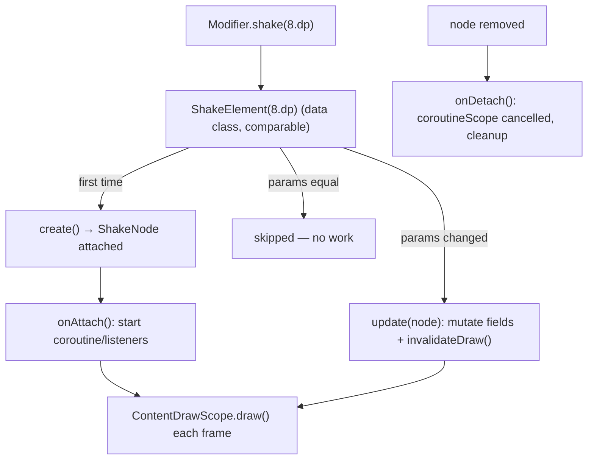

# Lesson 08 — Custom Modifier Factories

> After this lesson you can package reusable behavior into your own modifiers — from simple chain factories to high-performance `Modifier.Node` implementations — and know when each is appropriate.

**Module:** 04 · **Lesson:** 08 · **Level:** 🟢🟡🔴 · **Est. time:** 90–110 min

---

## 1. Concept

### 🟢 For beginners — *what is it and why do I care?*

You've been *using* modifiers all module. Now you'll *make* your own. The simplest custom modifier is just a function that returns a chain you'd otherwise repeat:

```kotlin
fun Modifier.card() = this
    .clip(RoundedCornerShape(16.dp))
    .background(Color.White)
    .padding(16.dp)

// Use it like any built-in modifier:
Box(Modifier.card()) { Text("Reusable!") }
```

That's it — an **extension function on `Modifier`** that bundles a common combination. Instead of copy-pasting the same five modifiers across twenty screens, you write `Modifier.card()`. When the design changes, you change one function.

This is the everyday win: **DRY modifiers.** The fancier `Modifier.Node` stuff (below) is for when your modifier needs *state* or has to draw/measure/handle input efficiently.

### 🟡 For intermediate devs — *the mechanism*

There are three tiers of "custom modifier," and choosing the right one matters:

1. **Chain factory** (`fun Modifier.x() = this.then(...)`): pure composition of existing modifiers. No state, no allocation concerns. The default — reach for it first.
2. **`Modifier.composed { }`** (`❌ legacy`): lets you call composables/`remember` inside a modifier factory. It works but allocates per call site and defeats skipping/comparison optimizations. **Avoid in new code** — it exists mostly for migration.
3. **`Modifier.Node` + `ModifierNodeElement`** (the modern way): a low-level, allocation-light node that can participate in draw, layout, pointer input, semantics, or focus, and hold mutable state across recompositions without `remember`. This is how the framework's own modifiers are built.

The `Modifier.Node` pattern has two parts:

```kotlin
// 1. The Node: the actual behavior + state, attached to the layout tree.
private class ShakeNode(var magnitude: Dp) : Modifier.Node(), DrawModifierNode {
    override fun ContentDrawScope.draw() { /* draw with an offset, etc. */ }
}

// 2. The Element: an immutable, comparable factory that creates/updates the node.
private data class ShakeElement(val magnitude: Dp) : ModifierNodeElement<ShakeNode>() {
    override fun create() = ShakeNode(magnitude)
    override fun update(node: ShakeNode) { node.magnitude = magnitude }
}

// 3. The public factory developers call.
fun Modifier.shake(magnitude: Dp): Modifier = this then ShakeElement(magnitude)
```

`create()` runs once when the node attaches; `update()` runs when the element changes (cheap — it mutates the existing node instead of reallocating). Because `ShakeElement` is a `data class`, Compose compares old vs new and only calls `update()` when parameters actually change.

### 🔴 For senior devs — *trade-offs, edges, internals*

- **`Modifier.Node` is the post-1.3 architecture for a reason.** The old `Modifier.composed { }`/`materialize` path allocated a new modifier instance per recomposition at each call site and couldn't be compared, so it always re-ran. `ModifierNodeElement` is comparable (its `equals`/`hashCode` from `data class`) and **diffed**: unchanged elements skip `update()` entirely. For hot modifiers (anything in a list item, anything animated), this is a real perf delta.
- **One node can implement multiple node interfaces.** A single `Modifier.Node` subclass can mix `DrawModifierNode`, `LayoutModifierNode`, `PointerInputModifierNode`, `SemanticsModifierNode`, `FocusEventModifierNode`, etc. — letting one cohesive modifier draw *and* measure *and* handle input without three separate elements. The framework's `clickable` does exactly this.
- **Nodes have a lifecycle: `onAttach` / `onDetach`.** Long-lived resources (coroutines via the node's `coroutineScope`, listeners) start in `onAttach` and must be cleaned in `onDetach`. The node's `coroutineScope` is cancelled automatically on detach — use it instead of `LaunchedEffect` for modifier-internal async (e.g., an animation that runs while attached).
- **`update()` must be exhaustive and not leak old state.** When a parameter changes, `update(node)` has to reconcile *every* field and re-trigger whatever phase is affected — call `invalidateDraw()`, `invalidateMeasurement()`, or `invalidatePlacement()` as appropriate. Forgetting to invalidate after mutating node state is a silent "my modifier doesn't update" bug.
- **`delegate(...)` composes node behavior.** A node can **delegate** to other nodes (e.g., delegate to a `SuspendingPointerInputModifierNode`) to reuse framework building blocks instead of reimplementing pointer handling. This is the node-world analog of chain composition.
- **Stateful modifiers no longer need `composed`.** The classic reason to use `composed` was "I need `remember`/`MutableInteractionSource` inside a modifier." With nodes, state lives **on the node** (plain fields, survives recomposition because the node persists) — no `remember`, no per-call allocation. Migrating `composed`-based modifiers to nodes is a common senior-level refactor.
- **Keep chain factories stateless and side-effect-free.** A `fun Modifier.x()` should be a pure description; don't call `remember`/launch effects inside one (that's what nodes or composable wrappers are for). Hidden state in a plain factory leads to surprising recomposition behavior.
- **Inspectable params aid tooling.** Built-in modifiers expose `InspectorInfo` so the Layout Inspector shows their parameters. For library-grade custom nodes, override `InspectorInfo` (via `inspectableProperties`) so your modifier is debuggable.

### Analogy

Three tiers of custom modifier are like three ways to make a reusable recipe. A **chain factory** is writing down a combo of store-bought ingredients ("my house dressing = oil + vinegar + mustard") — quick, no cooking. **`composed`** is a meal-kit that secretly re-buys all ingredients every time you open it — convenient once, wasteful at scale. A **`Modifier.Node`** is your own well-equipped kitchen station: it holds its own tools and state, preps efficiently, and cleans up after itself — more setup, but the right way to cook at volume.

### Mental model

> **Reuse a combo? Write `fun Modifier.x() = this.then(...)`. Need state, drawing, measuring, or input efficiently? Write a `Modifier.Node` + a comparable `ModifierNodeElement`. Avoid `composed` in new code.**

### Real-world example

A design system ships `Modifier.cardSurface()`, `Modifier.shimmer()` (an animated loading skeleton implemented as a `DrawModifierNode` with an `onAttach` coroutine), and `Modifier.dashedBorder(...)` (a `DrawModifierNode`). App teams use them like built-ins, get correct performance, and never see the node machinery. The `shimmer` is precisely the case where a node beats `composed`: it animates continuously inside list items.

---

## 2. Visual Learning

**ASCII — the three tiers and when to use them:**
```text
   Need to reuse a modifier combo?
        │
        ├─ No state, just composition ───────▶  fun Modifier.x() = this.then(...)   (chain factory)
        │
        ├─ Need state/draw/layout/input ─────▶  Modifier.Node + ModifierNodeElement (MODERN)
        │                                         create() once · update() on change
        │
        └─ Legacy code calling remember{} ───▶  Modifier.composed { }   ❌ avoid in new code
```

**Mermaid — Element ↔ Node lifecycle:**


**Illustration prompt (paste into an image generator):**
```text
Illustration: three labeled workstations in a clean modern workshop.
Station 1 "Chain factory": a person snapping together prefab LEGO-like modifier blocks into a combo.
Station 2 "Modifier.Node": a sturdy machine with a state dial and lifecycle lights labeled
"create / update / onAttach / onDetach", efficiently stamping output.
Station 3 "composed (legacy)": a dusty machine with a 'deprecated' tag, re-buying parts each cycle.
A signpost points from a question "Need state or drawing?" toward Station 2. Vibrant, labeled, clean.
```

---

## 3. Code

### 🟢 Beginner — a chain-factory modifier

```kotlin
// Reusable surface styling as a one-liner modifier.
fun Modifier.cardSurface(
    corner: Dp = 16.dp,
    color: Color = Color.White,
): Modifier = this
    .clip(RoundedCornerShape(corner))
    .background(color)
    .padding(16.dp)

@Composable
fun ReuseDemo() {
    Column(verticalArrangement = Arrangement.spacedBy(12.dp)) {
        Box(Modifier.cardSurface()) { Text("Card A") }
        Box(Modifier.cardSurface(corner = 24.dp, color = Color(0xFFE3F2FD))) { Text("Card B") }
    }
}
```

**Explanation.** `cardSurface()` is a plain extension on `Modifier` that returns a chain. It takes parameters with defaults, so call sites can customize. No state, no node machinery — just composition. This removes duplication and centralizes your surface style.

**Common mistakes.**
```kotlin
// ❌ Forgetting `this` → you return a brand-new chain that drops the caller's modifiers.
fun Modifier.cardSurface() = Modifier.clip(...).background(...) // ignores everything before it!

// ❌ Calling remember/launching effects inside a plain factory → hidden state, surprising behavior.
fun Modifier.blink() = composed { val a by animate...; this.alpha(a) } // legacy; prefer a node
```

**Best practices.**
- Always start the chain with **`this`** so the caller's existing modifiers are preserved.
- Keep chain factories **pure** (no `remember`/effects); if you need state, use a node.

---

### 🟡 Intermediate — a stateless `Modifier.Node` (dashed border)

```kotlin
// Public factory — what developers call.
fun Modifier.dashedBorder(
    width: Dp = 1.dp,
    color: Color = Color.Gray,
    cornerRadius: Dp = 8.dp,
): Modifier = this then DashedBorderElement(width, color, cornerRadius)

// Comparable element: created once, updated when params change.
private data class DashedBorderElement(
    val width: Dp,
    val color: Color,
    val cornerRadius: Dp,
) : ModifierNodeElement<DashedBorderNode>() {
    override fun create() = DashedBorderNode(width, color, cornerRadius)
    override fun update(node: DashedBorderNode) {
        node.width = width
        node.color = color
        node.cornerRadius = cornerRadius
        node.invalidateDraw()                 // re-draw after a param change
    }
}

// The node: draws on top of content.
private class DashedBorderNode(
    var width: Dp,
    var color: Color,
    var cornerRadius: Dp,
) : Modifier.Node(), DrawModifierNode {
    override fun ContentDrawScope.draw() {
        drawContent()                          // draw the children first
        val stroke = Stroke(
            width = width.toPx(),
            pathEffect = PathEffect.dashPathEffect(floatArrayOf(10f, 10f), 0f)
        )
        drawRoundRect(
            color = color,
            cornerRadius = CornerRadius(cornerRadius.toPx()),
            style = stroke
        )
    }
}
```

**Explanation.** `dashedBorder()` is backed by a `DrawModifierNode` that draws a dashed rounded rectangle over its content. `DashedBorderElement` is a `data class`, so Compose compares old vs new and only calls `update()` when params change — and `update()` mutates the existing node (no reallocation) and invalidates the draw. This is the idiomatic modern custom-draw modifier.

**Common mistakes.**
```kotlin
// ❌ Mutating node fields but forgetting to invalidate → the modifier looks "stuck" on old values.
override fun update(node: DashedBorderNode) { node.color = color } // no invalidateDraw()

// ❌ Making the Element a regular class (not data) → no equals/hashCode → update() runs every time.
private class DashedBorderElement(...) : ModifierNodeElement<DashedBorderNode>() // not comparable
```

**Best practices.**
- Make the `ModifierNodeElement` a **`data class`** so it's comparable and diffable.
- After mutating node state in `update()`, **invalidate** the affected phase (`invalidateDraw`/`invalidateMeasurement`/`invalidatePlacement`).

---

### 🔴 Production — a stateful, animated `Modifier.Node` (shimmer)

```kotlin
fun Modifier.shimmer(
    enabled: Boolean = true,
    baseColor: Color = Color.LightGray.copy(alpha = 0.3f),
    highlightColor: Color = Color.LightGray.copy(alpha = 0.9f),
): Modifier = this then ShimmerElement(enabled, baseColor, highlightColor)

private data class ShimmerElement(
    val enabled: Boolean,
    val baseColor: Color,
    val highlightColor: Color,
) : ModifierNodeElement<ShimmerNode>() {
    override fun create() = ShimmerNode(enabled, baseColor, highlightColor)
    override fun update(node: ShimmerNode) = node.update(enabled, baseColor, highlightColor)
    override fun InspectorInfo.inspectableProperties() {        // visible in Layout Inspector
        name = "shimmer"
        properties["enabled"] = enabled
    }
}

private class ShimmerNode(
    private var enabled: Boolean,
    private var baseColor: Color,
    private var highlightColor: Color,
) : Modifier.Node(), DrawModifierNode {

    private val progress = Animatable(0f)
    private var job: Job? = null

    override fun onAttach() {
        if (enabled) start()                                   // animation lives with the node
    }

    private fun start() {
        job?.cancel()
        job = coroutineScope.launch {                          // node's own scope (auto-cancelled on detach)
            progress.snapTo(0f)
            progress.animateTo(
                1f,
                animationSpec = infiniteRepeatable(tween(1200), RepeatMode.Restart)
            )
        }
    }

    fun update(enabled: Boolean, base: Color, highlight: Color) {
        this.baseColor = base
        this.highlightColor = highlight
        if (enabled != this.enabled) {
            this.enabled = enabled
            if (enabled) start() else job?.cancel()
        }
        invalidateDraw()
    }

    override fun ContentDrawScope.draw() {
        if (!enabled) { drawContent(); return }
        val w = size.width
        val x = (progress.value * 2f - 1f) * w                 // sweep from left to right
        drawContent()
        drawRect(
            brush = Brush.horizontalGradient(
                colors = listOf(baseColor, highlightColor, baseColor),
                startX = x,
                endX = x + w
            )
        )
    }

    override fun onDetach() { job?.cancel() }                  // clean up explicitly too
}
```

**Explanation.** `shimmer()` is a self-contained, animated loading skeleton. The animation state (`Animatable`, `Job`) lives **on the node** — no `remember`, no `LaunchedEffect` — and runs inside the node's `coroutineScope`, which Compose cancels on detach (we also cancel explicitly for clarity). `onAttach` starts it; `update` reconciles params and toggles the animation when `enabled` flips; `inspectableProperties` makes it show up in the Layout Inspector. This is exactly the case where a node beats `composed`: a continuously-animating modifier used inside list items, where per-call allocations and re-runs would hurt.

**Common mistakes.**
```kotlin
// ❌ Implementing shimmer with composed { } + LaunchedEffect → allocates per call site, re-runs,
//    and is harder to make list-item-friendly.
fun Modifier.shimmer() = composed { val p by ...; this.drawWithContent { ... } } // ❌ legacy

// ❌ Starting a coroutine but never cancelling on detach → leaked animation after the node is gone.
override fun onAttach() { GlobalScope.launch { ... } } // wrong scope, leaks

// ❌ Not handling enabled toggling in update() → can't turn the shimmer off without recreating.
```

**Best practices.**
- Keep modifier-internal state **on the node**; run async in the node's **`coroutineScope`**; clean up in **`onDetach`**.
- Reconcile **all** params in `update()` (including toggling animations) and invalidate the right phase.
- Provide **`inspectableProperties`** for library-grade modifiers so they're debuggable in tooling.

---

## 4. Interview Questions

**🟢 Beginner**

1. *How do you create a reusable modifier that bundles several modifiers?*
   > Write an extension function on `Modifier` that returns a chain, starting with `this`: `fun Modifier.card() = this.clip(...).background(...).padding(...)`. Call it like any built-in modifier.
2. *Why must a chain-factory modifier start with `this`?*
   > So it appends to the caller's existing modifier chain. Starting from a fresh `Modifier` would discard everything the caller already applied (size, position, etc.).

**🟡 Intermediate**

3. *What are the two parts of a `Modifier.Node` custom modifier, and what does each do?*
   > A `ModifierNodeElement` (an immutable, comparable `data class` that `create()`s and `update()`s the node) and the `Modifier.Node` itself (holds state/behavior and implements node interfaces like `DrawModifierNode`). The element is diffed; the node persists and does the work.
4. *Why is `Modifier.composed { }` discouraged in new code?*
   > It allocates a new modifier instance per recomposition at each call site and can't be compared, so it always re-runs and defeats skipping. `Modifier.Node` is comparable and diffed, holds state without `remember`, and is far more efficient for hot/animated modifiers.

**🔴 Senior**

5. *How does the `Modifier.Node` lifecycle let you run and clean up an animation without `remember`/`LaunchedEffect`?*
   > State (e.g., an `Animatable`) lives on the node, which persists across recompositions. You start work in `onAttach` using the node's `coroutineScope` (cancelled automatically on detach), reconcile parameters in `update()`, and clean up in `onDetach`. No composition-scoped remembering is needed because the node *is* the durable holder.
6. *What's the role of `update()`, and what's the failure mode if you mutate node state there without invalidating?*
   > `update()` reconciles the node with new element parameters in place (cheaper than recreating). If you mutate fields but forget to call the relevant `invalidateDraw()`/`invalidateMeasurement()`/`invalidatePlacement()`, the change is stored but the affected phase never re-runs — the modifier visibly "doesn't update" despite the new params.

---

## 5. AI Assistant

**Prompt example (node-based modifier):**
```text
Compose 2026. Implement Modifier.shimmer(enabled, baseColor, highlightColor) using the modern
Modifier.Node API (NOT Modifier.composed). Provide: a data-class ModifierNodeElement with create()/update()
and inspectableProperties; a DrawModifierNode that animates a horizontal gradient sweep via an Animatable
started in onAttach using the node's coroutineScope and cancelled in onDetach; and correct invalidateDraw()
in update(). Toggle the animation when `enabled` changes. Keep all state on the node (no remember).
```

**AI workflow — where it helps on *this* topic.**
- ✅ Great for: scaffolding the Element/Node pair, generating `draw()`/gradient math, migrating a `composed` modifier to a node.
- ⚠️ Watch: models default to **`composed { }`**, make the Element a **non-data class** (so `update` runs every time), **forget to invalidate** after mutating node state, use the **wrong coroutine scope** (e.g., `GlobalScope`), and skip `onDetach` cleanup.

**Review workflow — check AI output against this lesson's *Common Mistakes*:**
- Is it `Modifier.Node` + a **`data class`** `ModifierNodeElement` (comparable), not `composed`?
- Does `update()` reconcile all params and **invalidate** the right phase?
- Is async on the **node's `coroutineScope`**, started in `onAttach`, cancelled in `onDetach`?
- For chain factories: does it start with `this` and stay pure?

**Validation workflow — prove it works:**
1. **Preview** the modifier on multiple elements; change a parameter and confirm it updates live (proves `update()` + invalidate).
2. **List-item test**: use the modifier in a `LazyColumn`; with Layout Inspector, confirm scrolling/animation doesn't cause excessive recomposition or allocation.
3. **Lifecycle test**: remove the modified node (e.g., toggle visibility) and confirm the coroutine stops (no leaked animation) — check via logs or a profiler.
4. **Inspector**: confirm your `inspectableProperties` show up.

> **AI drafts, you decide.** If the model reaches for `composed { }` or a non-data Element, refactor to a comparable `Modifier.Node` before merging — that's the whole point of this lesson.

---

## Recap / Key takeaways

- The simplest custom modifier is a **chain factory**: `fun Modifier.x() = this.then(...)` — start with `this`, keep it pure.
- For state, drawing, measuring, or input, use **`Modifier.Node` + a comparable (`data class`) `ModifierNodeElement`** — the modern, allocation-light, diffable API.
- Avoid **`Modifier.composed { }`** in new code: it allocates per call site and can't be compared.
- Node lifecycle: **`create()` once**, **`update()` on param change (then invalidate)**, async in the node's **`coroutineScope`** (`onAttach`/`onDetach`).
- One node can implement several node interfaces and `delegate(...)` to reuse framework building blocks; expose `inspectableProperties` for tooling.

➡️ Next: **[Module 05 — Custom Layouts](../module-05-custom-layouts/README.md)** — now that you can build custom modifiers and measure with `LayoutModifierNode`, step up to writing your own `Layout` and measure/place logic from scratch.
