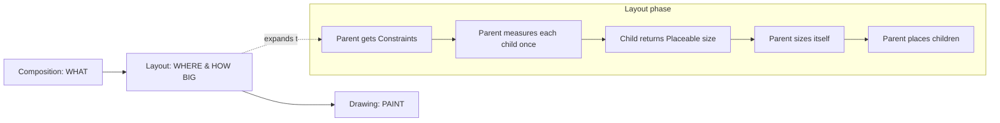
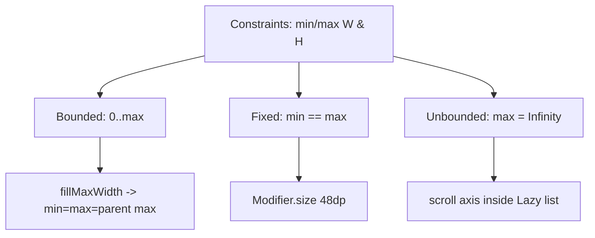

# Lesson 01 — The Layout Phase & Constraints

> After this lesson you can explain Compose's three phases, describe how constraints flow *down* and sizes flow *up*, and state precisely why Compose measures each child exactly once.

**Module:** 05 · **Lesson:** 01 · **Level:** 🟢🟡🔴 · **Est. time:** 70–90 min

---

## 1. Concept

### 🟢 For beginners — *what is it and why do I care?*

Every time Compose puts something on screen, it does three jobs in order:

1. **Composition** — *what* to show. Your `@Composable` functions run and build a tree of UI nodes ("a Column, with a Text and a Button inside").
2. **Layout** — *where* and *how big*. Compose walks that tree and decides the size and position of every node.
3. **Drawing** — *paint it*. Each node draws its pixels onto the screen.

This lesson is about the **middle** job: **layout**. Up to now you've used `Row`, `Column`, and `Box`, and they laid your children out for you. To build a *custom* layout, you take that job over yourself. Before you can, you need to understand the one rule the whole system runs on: **a parent tells each child how big it's *allowed* to be (those limits are called constraints), the child picks its own size within those limits, and the parent then places it.**

Limits go **down** the tree. Sizes come back **up**. Then placement happens. That's the entire model.

### 🟡 For intermediate devs — *the mechanism*

A **`Constraints`** object is four integers in pixels: `minWidth`, `maxWidth`, `minHeight`, `maxHeight`. It expresses a *range* of allowed sizes. A child must choose a width in `minWidth..maxWidth` and a height in `minHeight..maxHeight`.

Constraints come in flavors:

| Kind | Looks like | Meaning |
|---|---|---|
| **Bounded** | `min=0, max=1080` | "anywhere from 0 to 1080 px" |
| **Exact / fixed** | `min == max` | "you *must* be exactly this size" (e.g. `Modifier.size(48.dp)`) |
| **Unbounded** | `max = Constraints.Infinity` | "as big as you want" (e.g. content inside a scrolling list on its scroll axis) |

The layout algorithm is a single depth-first pass:

```text
parent.measure(incomingConstraints)
   └─ for each child: child.measure(childConstraints)   // parent decides childConstraints
        └─ child returns a Placeable (it now has a width & height)
   └─ parent computes its OWN size from the children's sizes
   └─ parent.layout(width, height) { place each child at an (x, y) }
```

Three APIs make this concrete, and you'll use them in every custom layout from Lesson 05 on:

- **`measurable.measure(constraints)`** → returns a **`Placeable`** (a measured child with a fixed `.width`/`.height`). You may call this **at most once per child**.
- **`layout(width, height) { … }`** → you declare your own size, then inside the lambda you call…
- **`placeable.place(x, y)`** (or `placeRelative(x, y)`, which mirrors for RTL) → position each measured child.

### 🔴 For senior devs — *trade-offs, edges, internals*

**Why exactly one measure pass?** Compose's layout is designed to be **O(n)** in the number of nodes. The contract — *each node is measured once per layout pass* — is what guarantees that. Classic Android `View` could trigger multiple measure passes (a `RelativeLayout` or a `LinearLayout` with `weight` could measure twice; nesting them multiplied the cost into the infamous "measure storms"). Compose forbids this by construction: calling `measure()` twice on the same `Measurable` in one pass **throws** `IllegalStateException: Measurable was already measured`.

What this buys you and what it costs:

- **Benefit:** predictable, linear layout cost. No exponential blow-up from nesting.
- **Cost:** any layout that genuinely needs a child's size *before* it can decide that child's constraints can't express it with plain `Layout`. That's the entire reason **`SubcomposeLayout`** exists (Lesson 06) — it defers *composition* of some children until measurement, at the price of extra work. Reach for it only when the single-pass model truly can't express the layout.
- **Escape hatch:** **intrinsic measurements** (Lesson 02) let a parent *query* a child's natural size ("how tall do you want to be if I give you this width?") without committing the real measure pass — but intrinsics are a separate query that can re-walk the subtree, so they aren't free either.

**Constraint coercion is a frequent bug.** A child can return any size it wants, but if it returns a size outside the incoming constraints, **the parent's constraints win when the grandparent places it** — the value isn't silently clamped for you inside your own `layout` block, so you can produce visually clipped or overflowing UI. Idiomatic custom layouts coerce explicitly: `constraints.constrainWidth(desired)` / `constrainHeight(desired)`.

**Constraints ≠ size.** This is the mental trap that produces 90% of layout confusion. `Modifier.fillMaxWidth()` doesn't *set* a width — it changes the *constraints* it passes down so that `minWidth = maxWidth = incoming maxWidth`. `Modifier.wrapContentSize()` *loosens* the minimums so a child can be smaller than its parent. You're never setting sizes directly; you're shaping the constraint range and letting the measure/place dance resolve the actual numbers. (Modifiers that do this — `size`, `padding`, `fillMax*`, `wrapContent*` — are themselves layout modifiers, covered in [Module 04](../module-04-modifiers/README.md); here we care about the phase they participate in.)

**Layout reads can be deferred from composition.** A state value read during the *layout* phase (e.g. inside a placement lambda, or in `Modifier.offset { … }`) invalidates **only layout**, not composition — a key performance lever explored in [Module 11](../module-11-performance/README.md). Knowing which phase reads your state is part of writing fast custom layouts.

### Analogy

**Shipping a package by courier.** The courier (parent) hands you a box with a label: "this package must fit between 10×10 and 40×40 cm" — those are your **constraints**. You (the child) pack your stuff and pick a size *within* that range; you report back the final dimensions — that's your **measured size flowing up**. The courier then decides *where on the truck shelf* your box goes — that's **placement**. The courier measures your finished box **once**; they don't keep re-opening it. And the size limit (the constraints) is not the same thing as how big your box actually turned out (the size).

### Mental model

> **Constraints flow down, sizes flow up, placement happens last — and every child is measured exactly once.**

### Real-world example

A **chat bubble** that hugs its text but never exceeds 75% of the screen width. The row passes the bubble a constraint of `maxWidth = 0.75 × screenWidth`. A short "ok" measures tiny; a long paragraph measures up to the cap and wraps. Same constraint, two different *sizes* chosen by the child — exactly the down/up flow in action.

---

## 2. Visual Learning

**ASCII — constraints down, sizes up, place last:**
```text
                       ┌──────────────────────────┐
   incoming            │          PARENT          │
   Constraints ───────▶│  (e.g. 0..1080 × 0..1920)│
   (a range)           └─────────────┬────────────┘
                             │ measure(childConstraints)   ── DOWN ──▶
                             ▼
                       ┌──────────────────────────┐
                       │           CHILD           │
                       │  picks a size in range    │
                       └─────────────┬────────────┘
                             ▲ returns Placeable(w,h)      ── UP ──▶
                             │
                       ┌─────┴────────────────────┐
                       │  PARENT computes own size │
                       │  layout(w,h){ place(x,y) }│   ── PLACE LAST ──▶
                       └──────────────────────────┘
```

**Mermaid — the three phases and where layout sits:**


**Mermaid — constraint kinds (mind map):**


**Illustration prompt (paste into an image generator):**
```text
Illustration: a clean vertical "assembly line" for UI layout, three glowing stations top-to-bottom
labeled COMPOSITION (what), LAYOUT (where & how big), DRAWING (paint). Zoom-in lens on the LAYOUT
station showing a parent box handing a smaller child box a paper ticket labeled "Constraints:
0..1080 x 0..1920". A downward arrow labeled "constraints" and an upward arrow labeled "measured
size" form a loop between parent and child. A final arrow labeled "place (x,y)" drops the child into
a grid slot. A bold stamp reads "MEASURE ONCE". Modern, vibrant, soft gradients, crisp labels.
```

---

## 3. Code

> We won't write a full custom `Layout` until Lesson 05 — here we *observe* the phase model with tiny, runnable snippets so the contract is concrete before we build on it.

### 🟢 Beginner — constraints are a range, not a size

```kotlin
@Composable
fun ConstraintsDemo() {
    // BoxWithConstraints surfaces the incoming Constraints so we can read them.
    // (Full treatment in Lesson 03 — here it's just a window into the layout phase.)
    BoxWithConstraints(Modifier.fillMaxWidth()) {
        // maxWidth/minWidth are the *allowed range* handed down by the parent.
        Text("Allowed width: $minWidth … $maxWidth")
        // The Text below will choose its OWN width within that range:
        // short text → small; long text → wraps at maxWidth.
    }
}
```

**Explanation.** `fillMaxWidth()` sets the incoming constraints so `maxWidth` equals the parent's max. `BoxWithConstraints` lets us *read* that range. The `Text` then picks a concrete width inside it — proof that the parent supplies a **range**, and the child supplies the **size**.

**Common mistakes.**
```kotlin
// ❌ Thinking fillMaxWidth() "sets width to screen width". It doesn't set a size —
// it sets the constraints (min=max=parent max). A child can still wrapContent narrower.
Text("hi", Modifier.fillMaxWidth())   // the Text node is forced wide, but that's a CONSTRAINT effect
```

**Best practices.**
- Say "constraints" when you mean limits and "size" when you mean the chosen value. Keeping the words separate keeps the model straight.
- Treat `fillMax*` / `wrapContent*` as *constraint shapers*, not size setters.

---

### 🟡 Intermediate — see the single-measure rule throw

```kotlin
@Composable
fun MeasureTwiceCrashes(content: @Composable () -> Unit) {
    Layout(content) { measurables, constraints ->
        val placeable = measurables.first().measure(constraints)
        // ❌ Measuring the SAME measurable a second time violates the contract.
        // Uncommenting the next line throws:
        //   IllegalStateException: Measurable was already measured
        // val again = measurables.first().measure(constraints)

        layout(placeable.width, placeable.height) {
            placeable.place(0, 0)
        }
    }
}
```

**Explanation.** `Layout` hands you `measurables` (children not yet measured) and the incoming `constraints`. You call `.measure(constraints)` **once** per child to get a `Placeable`, declare your size with `layout(...)`, and place inside. The commented line shows the guardrail: a second `measure()` on the same child throws by design — that's the single-pass guarantee enforced at runtime.

**Common mistakes.**
```kotlin
// ❌ Measuring inside the layout{} placement block — too late, and re-measures per placement.
layout(w, h) {
    val p = measurables.first().measure(constraints) // wrong phase: measure during measure, place during place
    p.place(0, 0)
}
```
Measure all children **before** calling `layout()`; the `layout` lambda is for **placement only**.

**Best practices.**
- One `measure()` per child, in the measure block. If you think you need two, you actually need **intrinsics** (Lesson 02) or **`SubcomposeLayout`** (Lesson 06).
- Compute your size from `Placeable.width`/`.height`, not by guessing.

---

### 🔴 Production — coerce to constraints, and respect fixed vs. bounded

```kotlin
/**
 * A minimal "fixed aspect-ratio box" that ALWAYS reports a size legal for the
 * incoming constraints — the production-grade habit that prevents clipping/overflow.
 */
@Composable
fun AspectRatioBox(
    ratioWidthToHeight: Float,
    modifier: Modifier = Modifier,
    content: @Composable () -> Unit,
) {
    Layout(content, modifier) { measurables, constraints ->
        // 1) Decide our width: honor a fixed width if the parent demanded one,
        //    otherwise take the max we're allowed.
        val width =
            if (constraints.hasFixedWidth) constraints.maxWidth
            else constraints.maxWidth

        // 2) Derive height from the ratio, then COERCE into the legal range —
        //    never trust a derived number to be in-bounds.
        val desiredHeight = (width / ratioWidthToHeight).toInt()
        val height = constraints.constrainHeight(desiredHeight)

        // 3) Measure the child with EXACT constraints so it fills our resolved box.
        val childConstraints = Constraints.fixed(width, height)
        val placeable = measurables.firstOrNull()?.measure(childConstraints)

        layout(width, height) {
            placeable?.place(0, 0)
        }
    }
}
```

**Explanation.** We read the *kind* of incoming constraints (`hasFixedWidth`), derive a height from the aspect ratio, then **coerce** it with `constrainHeight(...)` so the size we report is always legal. We hand the child **fixed** constraints (`Constraints.fixed`) so it exactly fills the box we computed. This is the production reflex: *derive freely, but constrain before you commit*.

**Common mistakes.**
```kotlin
// ❌ Returning a derived size without coercion → can exceed maxHeight and clip/overflow.
val height = (width / ratioWidthToHeight).toInt()   // could be > constraints.maxHeight
layout(width, height) { /* ... */ }                 // out-of-bounds size leaks upward
```
```kotlin
// ❌ Ignoring whether width was fixed → fighting a parent that already pinned the size.
val width = constraints.maxWidth // fine here, but if the parent set min==max you must honor it
```

**Best practices.**
- Always pass derived dimensions through `constraints.constrainWidth/constrainHeight` before returning them.
- Inspect `hasFixedWidth`/`hasFixedHeight` (or `hasBoundedWidth`) when your layout must adapt to how it's being sized.
- Use `Constraints.fixed(w, h)` to force a child to a size, and looser constraints when the child should choose.

---

## 4. Interview Questions

**🟢 Beginner**

1. *What are the three phases Compose runs to put UI on screen?*
   > Composition (decide *what* to show), Layout (decide *where* and *how big*), and Drawing (paint pixels). They run in that order each frame that needs them.
2. *In one sentence, how does the layout phase work?*
   > The parent passes each child constraints (a size range), the child measures itself within that range and reports a size, then the parent places each child at an (x, y).

**🟡 Intermediate**

3. *What is a `Constraints` object, and what are the kinds?*
   > Four ints — minWidth/maxWidth/minHeight/maxHeight — describing the allowed size range. Bounded (0..max), fixed (min == max, an exact size), or unbounded (max = `Constraints.Infinity`, "as big as you want").
4. *What's the difference between a constraint and a size?*
   > A constraint is the *range of allowed sizes* a parent permits; the size is the *specific value* the child chooses within it. `fillMaxWidth()` changes constraints (min=max=parent max), not a size directly.

**🔴 Senior**

5. *Why does Compose measure each child exactly once, and what enforces it?*
   > To keep layout O(n) and avoid the multi-pass "measure storms" that plagued nested `View` layouts. It's enforced at runtime: calling `measure()` twice on the same `Measurable` in one pass throws `IllegalStateException`. Layouts that truly need a child's size before constraining it must use `SubcomposeLayout` (with extra cost) or query **intrinsics**.
6. *A custom layout computes a height that exceeds `constraints.maxHeight`. What happens, and what's the fix?*
   > Reporting an out-of-bounds size can produce clipping/overflow when the grandparent places you — the framework won't silently fix your intent. Coerce before returning: `constraints.constrainHeight(desired)`. Production layouts constrain every derived dimension.

---

## 5. AI Assistant

**Prompt example (understanding a layout decision):**
```text
In Jetpack Compose (2026 BOM, Kotlin 2.x), explain in terms of CONSTRAINTS (not sizes)
why Modifier.fillMaxWidth() makes a Text span the screen, but the same Text without it
hugs its content. Reference minWidth/maxWidth. Then show how I'd read the incoming
constraints to confirm. Keep it to plain Compose — no custom Layout yet.
```

**AI workflow — where it helps on *this* topic.**
- ✅ Great for: explaining the three phases, decoding what a modifier does to constraints, and translating "why is my box the wrong size" into constraint terms.
- ⚠️ Not yet: writing a full custom `Layout` (Lesson 05) or choosing `SubcomposeLayout` — models often reach for `SubcomposeLayout` when a single-pass `Layout` would do, or forget to coerce sizes to constraints.

**Review workflow — check AI output against this lesson's *Common Mistakes*:**
- Does it ever describe a modifier as "setting a width/height" when it actually shapes **constraints**?
- If it generated a `Layout`, does it call `measure()` **once** per child, and **before** the `layout {}` block?
- Are derived sizes passed through `constrainWidth`/`constrainHeight`?

**Validation workflow — prove it actually works:**
1. **Compile & run**; wrap the suspect composable in `BoxWithConstraints` and print `minWidth..maxWidth` to confirm the range you think is being passed.
2. Add an Android Studio **Preview** with `widthDp`/`heightDp` set to extreme values; verify sizes stay in-bounds (no clipping, no overflow).
3. In **Layout Inspector**, select the node and read its reported size — does it match a value legal for the incoming constraints?
4. If you suspect a double-measure, run it: the runtime throws `IllegalStateException` immediately, which is the fastest possible "proof."

> **AI drafts, you decide.** If an explanation talks about sizes where it should talk about constraints, it's modeling the wrong thing — correct it before you build on it.

---

## Recap / Key takeaways

- Compose runs **Composition → Layout → Drawing**; this module lives in **Layout**.
- The layout contract: **constraints flow down, sizes flow up, placement happens last.**
- **`Constraints`** = `min/maxWidth`, `min/maxHeight` — a *range*, not a size. Kinds: bounded, fixed (`min==max`), unbounded (`Infinity`).
- The core APIs: `measurable.measure(constraints)` → `Placeable`, then `layout(w, h) { placeable.place(x, y) }`.
- **Measure each child exactly once** — a second `measure()` throws. This is what keeps layout O(n).
- Always **coerce derived sizes** with `constrainWidth`/`constrainHeight` so you never report an illegal size.

➡️ Next: **[Lesson 02 — Intrinsic Measurements](02-intrinsic-measurements.md)** — how a parent can ask a child "how big would you like to be?" without spending its one measure pass, and what that query costs.
