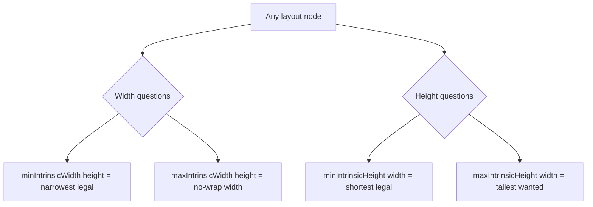
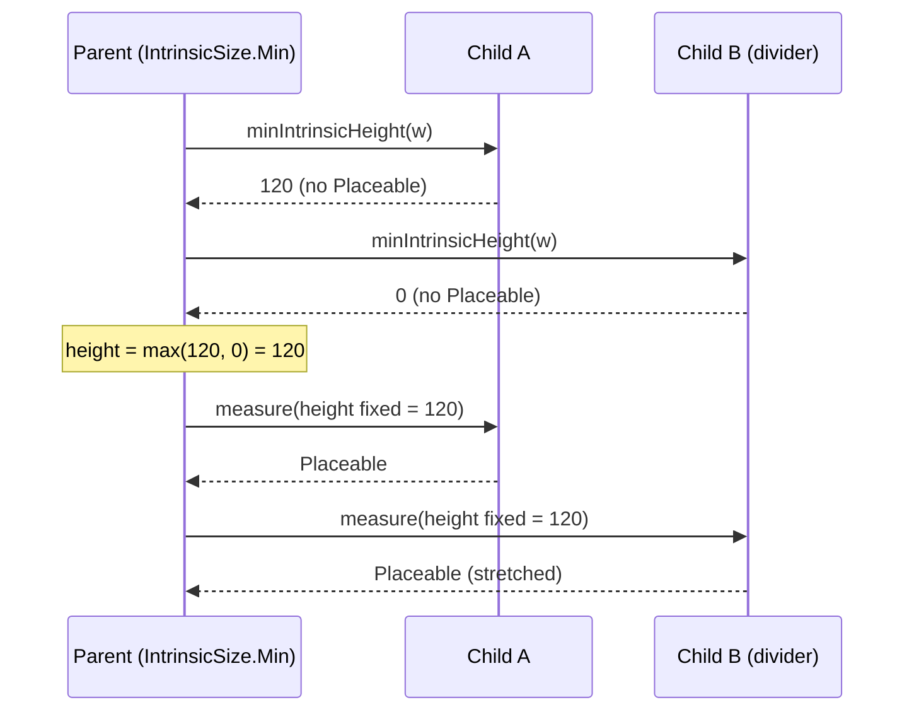

# Lesson 02 — Intrinsic Measurements

> After this lesson you can explain what an intrinsic measurement asks, use `IntrinsicSize.Min/Max` to size siblings to each other, and reason about the performance cost of querying intrinsics.

**Module:** 05 · **Lesson:** 02 · **Level:** 🟢🟡🔴 · **Est. time:** 70–90 min

---

## 1. Concept

### 🟢 For beginners — *what is it and why do I care?*

Last lesson's rule was: **a child is measured once.** But sometimes a parent has a chicken-and-egg problem. Picture two columns of text side by side, with a vertical divider between them. You want the divider to be exactly as tall as the *taller* column — but you don't know how tall either column is until you measure them, and to measure the divider you'd like to already know that height. How do you size the divider without breaking the one-measure rule?

**Intrinsic measurements** are the answer. An intrinsic measurement is a *question you can ask a child without officially measuring it*: "**If I gave you this width, how tall would you naturally want to be?**" (or the reverse). The child answers with a number. The parent uses those answers to make a sizing decision, and *then* does the one real measure pass.

The two you'll meet constantly are `IntrinsicSize.Min` and `IntrinsicSize.Max`, used as a modifier: `Modifier.height(IntrinsicSize.Min)` means "make me as tall as my tallest child's minimum natural height."

### 🟡 For intermediate devs — *the mechanism*

Every layout node can answer four intrinsic questions. They're methods on `IntrinsicMeasurable` / `Measurable`:

| Question | Method | Plain English |
|---|---|---|
| Min width | `minIntrinsicWidth(height)` | "Smallest width at which you can still draw correctly at this height?" (e.g. the longest unbreakable word) |
| Max width | `maxIntrinsicWidth(height)` | "Width you'd take if you never wrapped?" (e.g. text all on one line) |
| Min height | `minIntrinsicHeight(width)` | "Shortest you can be at this width without clipping content?" |
| Max height | `maxIntrinsicHeight(width)` | "Tallest you'd want to be at this width?" |

You consume these in two ways:

1. **Built-in, via modifiers.** `Modifier.width(IntrinsicSize.Min)`, `.width(IntrinsicSize.Max)`, `.height(IntrinsicSize.Min)`, `.height(IntrinsicSize.Max)`. A `Row` with `Modifier.height(IntrinsicSize.Min)` measures its children's `minIntrinsicHeight`, takes the max, and forces every child to that exact height — the classic "make the divider match the tallest column."

2. **In a custom `Layout`,** you can call `measurable.maxIntrinsicWidth(h)` yourself to pre-compute a size before the real `measure()` call. You can also *provide* intrinsics for your own layout by overriding the intrinsic functions on the `MeasurePolicy` (so *your* layout answers correctly when *its* parent asks).

### 🔴 For senior devs — *trade-offs, edges, internals*

**Intrinsics are a second tree walk, not a free lookup.** When you ask a node `maxIntrinsicHeight(width)`, Compose computes that answer by recursively asking *its* children their intrinsics. So an intrinsic query is a **separate pass over the subtree** that happens *before* the real measure pass. Use intrinsics on a deep subtree and you've effectively added a second traversal of it. This is why `IntrinsicSize.Min` on a large list or a deeply nested tree can show up in a trace.

**Not every node has cheap intrinsics — and some can't answer at all.** A `LazyColumn` cannot meaningfully report `maxIntrinsicHeight` (it would have to compose every item, defeating laziness), and several scrolling/`SubcomposeLayout`-based components **throw** if you ask for intrinsics. The default intrinsic behavior of a plain `Layout` (if you don't override it) computes by *re-running your measure policy with a probe constraint*, which is correct but can be surprisingly expensive.

**Intrinsics let you respect the single-measure rule while still being size-aware.** That's the whole design point. The real `measure()` still happens once. Intrinsics are an *advisory query* layered on top. Contrast with `SubcomposeLayout` (Lesson 06): intrinsics ask "what size *would* you be?" without composing anything new; `SubcomposeLayout` actually composes and measures extra children. **Prefer intrinsics when a size *query* suffices; reserve `SubcomposeLayout` for when you need the real measured result of one child to build another.**

**`min` vs `max` is about wrapping.** For width: `maxIntrinsicWidth` is the width with **no wrapping** (everything on one line); `minIntrinsicWidth` is the **narrowest** you can be before content breaks illegally (the longest word for text). For a row of text, `IntrinsicSize.Max` width tends to be large (no wrap) and `IntrinsicSize.Min` small (maximally wrapped). Picking the wrong one is a common cause of "my column is way too wide" or "my text is squished into one character per line."

**Custom layouts should provide intrinsics if they'll be nested under intrinsic-using parents.** If you write a `Layout` and someone wraps it in `Modifier.height(IntrinsicSize.Min)`, your layout's *default* intrinsic answer may be wrong (it falls back to a heuristic). Overriding `minIntrinsicHeight` etc. on your `MeasurePolicy` makes your component a good citizen. We'll show this in Lesson 05.

### Analogy

**Asking tailors for a quote before the fitting.** You want a row of jackets to all hang at the same length. Instead of sewing each one and re-sewing (a second real measure — forbidden), you *ask* each tailor: "roughly how long would this jacket be?" (intrinsic query). You take the longest quote, then do the **one** real fitting at that length. The quote isn't the finished jacket — it's an estimate that lets you plan a single, correct fitting.

### Mental model

> **An intrinsic measurement asks "what size would you *want* to be?" — it's a question, answered by a separate subtree walk, that lets the parent decide before spending its one real measure.**

### Real-world example

A **two-pane settings row**: a label on the left, a control on the right, and a thin vertical `Divider` between them that must match the **taller** side. Wrapping the `Row` in `Modifier.height(IntrinsicSize.Min)` makes the divider — which on its own has no height — stretch to the tallest sibling. This is the single most common production use of intrinsics.

---

## 2. Visual Learning

**ASCII — intrinsic query happens *before* the real measure:**
```text
   PARENT wants: "height = tallest child's min-intrinsic height"
        │
        │ (1) INTRINSIC QUERY  — a separate walk, no Placeable produced
        ├─▶ childA.minIntrinsicHeight(width) ──▶ 120
        ├─▶ childB.minIntrinsicHeight(width) ──▶  80
        │        max = 120
        ▼
   (2) REAL MEASURE  — the ONE allowed pass, now using height = 120
        ├─▶ childA.measure(fixedHeight=120) ──▶ Placeable
        ├─▶ childB.measure(fixedHeight=120) ──▶ Placeable
        └─▶ divider.measure(fixedHeight=120) ──▶ Placeable (now tall!)
```

**Mermaid — the two questions per axis:**


**Mermaid — query vs real pass (sequence):**


**Illustration prompt (paste into an image generator):**
```text
Illustration: a tailor's shop. A clerk (the PARENT) holds a clipboard and gets paper "quotes"
floating up from three hanging jackets (CHILD nodes), each quote labeled with a number like
"120cm". The clerk circles the largest quote. A second panel shows ONE real fitting happening at
that circled length, with all jackets now the same length and a tall ruler (the DIVIDER) matching
them. Labels: "intrinsic query (estimate)" over panel one, "single real measure" over panel two.
Modern, vibrant, clean labels, soft studio lighting.
```

---

## 3. Code

### 🟢 Beginner — make a divider match the taller column

```kotlin
@Composable
fun TwoColumnsWithDivider() {
    // height(IntrinsicSize.Min): the Row asks each child its min-intrinsic height,
    // takes the max, and gives EVERY child that exact height — so the divider stretches.
    Row(Modifier.height(IntrinsicSize.Min)) {
        Text(
            "Short",
            Modifier.weight(1f).padding(8.dp),
        )
        VerticalDivider()          // has no intrinsic height of its own…
        Text(
            "A much longer paragraph that wraps onto several lines and is clearly taller.",
            Modifier.weight(1f).padding(8.dp),
        )
    }
}
```

**Explanation.** Without the modifier, `VerticalDivider()` would collapse — it has no content to give it height. `Modifier.height(IntrinsicSize.Min)` makes the `Row` resolve a single height from its children's `minIntrinsicHeight` and apply it to all of them, so the divider matches the taller text column.

**Common mistakes.**
```kotlin
// ❌ Expecting the divider to fill height WITHOUT intrinsics — it collapses to ~0.
Row {                                  // no IntrinsicSize → Row is only as tall as content needs
    Text("Short")
    VerticalDivider()                  // invisible: nothing told the Row to equalize heights
    Text("Tall…")
}
```

**Best practices.**
- Reach for `Modifier.height(IntrinsicSize.Min)` when a zero-content child (divider, background) must match siblings.
- Keep the subtree small — intrinsics walk it again (see the 🔴 cost note).

---

### 🟡 Intermediate — `Min` vs `Max` width, and why it matters

```kotlin
@Composable
fun ButtonsSameWidth() {
    // width(IntrinsicSize.Max): the Column sizes itself to the WIDEST child's
    // no-wrap width, then makes every button that width — uniform buttons.
    Column(
        Modifier.width(IntrinsicSize.Max),
        verticalArrangement = Arrangement.spacedBy(8.dp),
    ) {
        Button(onClick = {}, modifier = Modifier.fillMaxWidth()) { Text("OK") }
        Button(onClick = {}, modifier = Modifier.fillMaxWidth()) { Text("Cancel") }
        Button(onClick = {}, modifier = Modifier.fillMaxWidth()) { Text("Save & continue") }
    }
}
```

**Explanation.** `IntrinsicSize.Max` on width resolves to the widest child's *no-wrap* width ("Save & continue"), and `fillMaxWidth()` then makes the others match. Swap to `IntrinsicSize.Min` and the column would shrink toward the *narrowest legal* width (longest single word), squishing the buttons — usually not what you want here.

**Common mistakes.**
```kotlin
// ❌ Using IntrinsicSize.Min when you wanted "as wide as the longest label" → text wraps/squishes.
Column(Modifier.width(IntrinsicSize.Min)) { /* buttons get the narrowest legal width */ }
```
- Confusing the axes: `width(IntrinsicSize.Max)` queries `maxIntrinsicWidth`; `height(IntrinsicSize.Min)` queries `minIntrinsicHeight`.

**Best practices.**
- "**Max** = don't wrap (widest/tallest natural)." "**Min** = wrap as much as legal (narrowest/shortest)." Decide which you mean *before* typing the modifier.
- Pair `IntrinsicSize.Max` width with `fillMaxWidth()` children to equalize.

---

### 🔴 Production — consume intrinsics inside a custom `Layout`, with cost awareness

```kotlin
/**
 * A row that lays children left-to-right but makes ALL of them as tall as the
 * tallest child — computed via intrinsics, then committed in a single measure pass.
 * Production notes: (1) we coerce to constraints, (2) we avoid double-measuring,
 * (3) intrinsics here walk the subtree once — fine for a handful of children,
 * not for a long scrolling list.
 */
@Composable
fun EqualHeightRow(
    modifier: Modifier = Modifier,
    content: @Composable () -> Unit,
) {
    Layout(content, modifier) { measurables, constraints ->
        // (1) INTRINSIC QUERY: tallest desired height at the available width.
        val targetHeight = measurables.maxOfOrNull { measurable ->
            measurable.minIntrinsicHeight(constraints.maxWidth)
        } ?: 0
        val height = constraints.constrainHeight(targetHeight)

        // (2) REAL MEASURE (once each), forcing the resolved height.
        val childConstraints = constraints.copy(minHeight = height, maxHeight = height)
        val placeables = measurables.map { it.measure(childConstraints) }

        // (3) Width = sum of children, coerced to the legal range.
        val width = constraints.constrainWidth(placeables.sumOf { it.width })

        layout(width, height) {
            var x = 0
            placeables.forEach { placeable ->
                placeable.place(x, 0)
                x += placeable.width
            }
        }
    }
}
```

**Explanation.** We first *ask* every child its `minIntrinsicHeight` at the available width (a query — no `Placeable` yet), pick the max, coerce it, then do the **one** real measure with that height fixed. The intrinsic query is a real subtree walk, so this pattern is right for a bounded set of children, not a giant list. Width and height are both coerced to constraints before we report them.

**Common mistakes.**
```kotlin
// ❌ "Measuring twice" to discover the tallest child — throws on the second measure.
val first = measurables.map { it.measure(constraints) }            // pass 1
val tallest = first.maxOf { it.height }
val second = measurables.map { it.measure(/* fixed height */) }    // 💥 already measured
```
```kotlin
// ❌ Asking intrinsics of a LazyColumn child → may throw / forces composition of all items.
lazyMeasurable.maxIntrinsicHeight(width)   // not supported for lazy content
```

**Best practices.**
- Use intrinsics to *plan* a single measure; never measure twice to discover a size.
- Keep intrinsic queries off lazy/scrolling subtrees — they can't (and shouldn't) answer.
- Coerce the height **and** width you derive; report only legal sizes.
- If your own `Layout` will be nested under `IntrinsicSize.*`, override the intrinsic functions on its `MeasurePolicy` so it answers correctly (shown in Lesson 05).

---

## 4. Interview Questions

**🟢 Beginner**

1. *What does an intrinsic measurement ask?*
   > "If I gave you this width (or height), what size would you naturally want to be?" — a query that lets a parent estimate a child's size without doing the real, one-time measure.
2. *What does `Modifier.height(IntrinsicSize.Min)` do on a `Row`?*
   > It makes the `Row` resolve a height from its children's `minIntrinsicHeight` (taking the max) and apply that height to all of them — the classic way to make a divider match the tallest column.

**🟡 Intermediate**

3. *`IntrinsicSize.Min` vs `IntrinsicSize.Max` — what's the difference?*
   > `Max` is the natural size with **no wrapping** (widest/tallest the content would take); `Min` is the **most-wrapped legal** size (narrowest/shortest before content breaks). For width: `Max` ≈ one line, `Min` ≈ the longest single word.
4. *Why can't you just measure a child twice to learn its size first?*
   > The single-measure rule: a second `measure()` on the same `Measurable` throws. Intrinsics exist precisely so you can learn a size estimate without spending the real measure pass.

**🔴 Senior**

5. *What's the performance cost of using intrinsics, and when does it bite?*
   > An intrinsic query is a **separate recursive walk** of the subtree (it asks children their intrinsics) that runs *before* the real measure. On deep or large subtrees that's effectively a second traversal, which can show in traces. It bites most on big trees and is unsupported on lazy/scrolling content.
6. *Why might asking a `LazyColumn` for `maxIntrinsicHeight` be a problem?*
   > It would have to compose and measure every item to answer, defeating laziness — so lazy/`SubcomposeLayout`-based components generally **don't support** intrinsics and may throw. Size such content with explicit constraints or weights instead.

---

## 5. AI Assistant

**Prompt example (sizing siblings to each other):**
```text
Jetpack Compose (2026 BOM, Kotlin 2.x): I have a Row with a label, a VerticalDivider, and a
value Text. The divider is invisible because it has no height. Fix it using intrinsic
measurements, explain WHICH intrinsic the Row queries and why, and warn me about the
performance cost if this Row were inside a large list.
```

**AI workflow — where it helps on *this* topic.**
- ✅ Great for: choosing between `IntrinsicSize.Min`/`Max`, explaining why a divider collapses, and converting "equal-width buttons" requests into the right modifier.
- ⚠️ Watch: models confuse `Min`/`Max`, slap `IntrinsicSize` on lazy content (which can throw), and rarely mention that intrinsics walk the subtree again.

**Review workflow — map to this lesson's *Common Mistakes*:**
- Did it pick `Max` (no-wrap) vs `Min` (most-wrapped) correctly for the stated goal?
- Is `IntrinsicSize.*` being applied to anything **lazy/scrolling** (unsupported)?
- In a custom `Layout`, did it try to "measure twice" to find a size instead of querying intrinsics?
- Are derived sizes coerced with `constrainWidth`/`constrainHeight`?

**Validation workflow — prove it actually works:**
1. **Compile & run**; confirm the divider/buttons size correctly with both short and long content.
2. Add a **Preview** with an extreme label ("Save & continue forever…") to confirm `Max` width tracks the longest child and nothing clips.
3. **Profile**: wrap the subtree in a trace section (or use the **System Trace** / Layout Inspector) and confirm the intrinsic pass cost is acceptable; move `IntrinsicSize` off any large list.
4. Try wrapping a `LazyColumn` in `IntrinsicSize.Max` to *see* the failure/throw — then design around it.

> **AI drafts, you decide.** If the model uses intrinsics on scrolling content or can't say which intrinsic the parent queries, it doesn't understand the cost — fix it before merging.

---

## Recap / Key takeaways

- An **intrinsic measurement** asks a child "what size would you want to be?" — a query that respects the single-measure rule.
- Four questions per node: `min/maxIntrinsicWidth(height)` and `min/maxIntrinsicHeight(width)`.
- `IntrinsicSize.Min/Max` (as `Modifier.height/width(...)`) equalizes siblings — the divider-matches-tallest-column trick.
- **Max = no wrap (widest/tallest natural); Min = most-wrapped legal (narrowest/shortest).**
- Intrinsics are a **second subtree walk** — not free; **unsupported on lazy/scrolling** content.
- In a custom `Layout`, use intrinsics to *plan* the single real measure — never measure twice.

➡️ Next: **[Lesson 03 — BoxWithConstraints](03-boxwithconstraints.md)** — reading the incoming constraints directly to branch your layout at composition time, and when that's the wrong tool.
