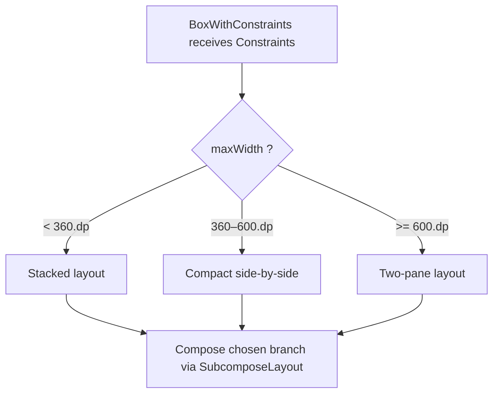
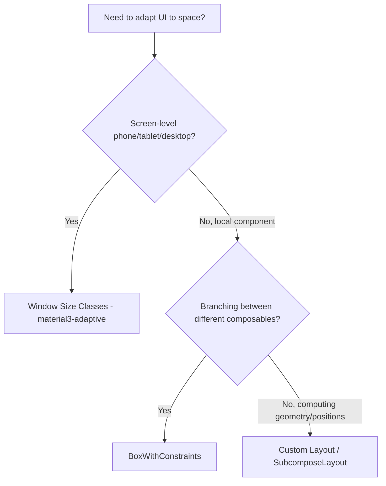

# Lesson 03 — BoxWithConstraints

> After this lesson you can read the incoming constraints inside a composable with `BoxWithConstraints`, branch your UI on available space, and explain why it isn't free — and when a custom `Layout` or window size classes are the better tool.

**Module:** 05 · **Lesson:** 03 · **Level:** 🟢🟡🔴 · **Est. time:** 60–80 min

---

## 1. Concept

### 🟢 For beginners — *what is it and why do I care?*

Sometimes you want to show *different UI depending on how much room you have*. Wide enough? Show a two-column layout. Narrow? Stack everything into one column. To make that decision, you need to know the available space **inside your own code**, where you can write `if`/`else` and call different composables.

`BoxWithConstraints` is exactly that: a `Box` that **hands you the constraints** it received. Inside its content block you get `maxWidth`, `maxHeight`, `minWidth`, `minHeight` — as `Dp` values you can compare — and you decide what to compose.

```kotlin
BoxWithConstraints {
    if (maxWidth < 600.dp) PhoneLayout() else TabletLayout()
}
```

That's the headline feature: **make composition-time decisions based on available size.**

### 🟡 For intermediate devs — *the mechanism*

`BoxWithConstraints` exposes a `BoxWithConstraintsScope` inside its lambda, which gives you:

| Member | Type | What it is |
|---|---|---|
| `constraints` | `Constraints` | the raw incoming constraints, in **pixels** |
| `minWidth`, `maxWidth` | `Dp` | the width range, converted to `Dp` for convenience |
| `minHeight`, `maxHeight` | `Dp` | the height range, in `Dp` |

The crucial detail: **`BoxWithConstraints` defers the composition of its content until the layout phase.** Normally composition happens first, then layout. But here, the content lambda runs *during* measurement (so the constraints are known). Mechanically, it's built on **`SubcomposeLayout`** (Lesson 06) — that's how it can know constraints before composing its children. That coupling is the source of every nuance below.

Because the content is a function of the constraints, **changing size re-runs the content lambda**. Resize the window, rotate, or animate a parent's size, and the `if`/`else` re-evaluates — which is what makes it feel "responsive."

### 🔴 For senior devs — *trade-offs, edges, internals*

**It's `SubcomposeLayout` under the hood, so it isn't free.** Subcomposition has overhead: the content is composed in a deferred sub-composition, and intrinsic measurements of a `BoxWithConstraints` are **not supported** (asking for them throws). If you wrap large or frequently-resizing content in `BoxWithConstraints`, you pay subcomposition cost on every size change. For a leaf that flips between two small layouts, that's nothing; for a big subtree resized every animation frame, it can matter.

**It's the wrong tool for screen-level responsive design.** For "phone vs tablet vs desktop," you want **Window Size Classes** (`material3-adaptive`, covered in [Module 02](../module-02-layouts/README.md)) — they're semantic breakpoints based on the *window*, stable across the screen, and designed for adaptive navigation/panes. `BoxWithConstraints` measures the *local* space a particular node was given, which is a different (and often misleading) number — a `Box` inside a padded card reports the card's inner width, not the screen's. Use `BoxWithConstraints` for *local, component-level* adaptation; use size classes for *screen architecture*.

**It can mask a layout that should be a custom `Layout`.** If you find yourself reading `maxWidth` only to compute child positions/sizes and then place things, you probably want a real `Layout` (Lesson 05) or `SubcomposeLayout` (Lesson 06) — those are the measure/place primitives, and they don't pay the "compose a whole branch, throw the other away" cost that an `if/else` of full subtrees can. `BoxWithConstraints` shines when the branches are *genuinely different composables*, not when you're computing geometry.

**State reads inside still follow phase rules.** The content lambda runs during layout, but reads of Compose *state* inside it still subscribe normally; a state change can invalidate and re-run the subcomposition. Combine that with frequent resizes and you can get more recompositions than you expect — measure with the Layout Inspector if a `BoxWithConstraints`-heavy screen feels janky.

**`constraints` is in pixels; `maxWidth` is in `Dp`.** Mixing them is a classic bug: compare `Dp` to `Dp` (`maxWidth < 600.dp`) or pixels to pixels (`constraints.maxWidth < 1080`), never across. The `Dp` accessors exist so you don't have to do density math by hand.

### Analogy

**A room you can reconfigure based on its size.** You walk into a venue and *measure the room first*, then decide the furniture layout: a big hall gets a stage and rows of chairs; a small room gets a single round table. `BoxWithConstraints` is measuring-the-room-before-furnishing-it. But note the catch: you're measuring *this room*, not *the whole building* — if you need building-level decisions (which floor, which wing), that's a blueprint question (window size classes), not a tape-measure-in-one-room question.

### Mental model

> **`BoxWithConstraints` = "tell me my available space, then I'll choose what to compose." Local and composition-time, built on subcomposition — so use it for component-level branching, not screen architecture.**

### Real-world example

A **reusable media card** used in both a narrow list and a wide grid. Inside, `BoxWithConstraints` checks `maxWidth`: under ~360.dp it stacks the thumbnail above the title; wider, it puts them side by side. The *same component* adapts to whatever width its container gives it — a perfect local use, since the card legitimately doesn't know in advance how wide it'll be placed.

---

## 2. Visual Learning

**ASCII — composition deferred until size is known:**
```text
   normal:   Composition ─▶ Layout ─▶ Draw
                 (decide UI)   (size it)

   BoxWithConstraints:
        Layout starts ─▶ constraints known ─▶ RUN content lambda here ─▶ size ─▶ Draw
                                              │  if (maxWidth < 600.dp)
                                              │      PhoneLayout()
                                              │  else
                                              │      TabletLayout()
                                              └─ (subcomposition)
```

**Mermaid — decision flow:**


**Mermaid — when to use what (decision tree):**


**Illustration prompt (paste into an image generator):**
```text
Illustration: a person with a tape measure standing inside an empty room, a glowing readout above
their head showing "maxWidth = 540dp". Two ghosted furniture plans hover beside them — a "stacked"
plan and a "side-by-side" plan — and a spotlight picks the one that fits. In the far background, a
faint architectural blueprint of the WHOLE building is labeled "Window Size Classes (different
tool)". Labels: "measure THIS room first", "choose the plan that fits". Modern, vibrant, soft
studio lighting, crisp text.
```

---

## 3. Code

### 🟢 Beginner — branch on available width

```kotlin
@Composable
fun AdaptiveGreeting() {
    BoxWithConstraints(Modifier.fillMaxWidth()) {
        // maxWidth is a Dp — compare against Dp thresholds.
        if (maxWidth < 400.dp) {
            Text("Hi!")                    // tight space → short copy
        } else {
            Text("Welcome back — great to see you again!")  // roomy → full copy
        }
    }
}
```

**Explanation.** `BoxWithConstraints` measures the width it's given and exposes it as `maxWidth` (a `Dp`). We compare to a `Dp` threshold and compose different content. Resize the container and the lambda re-runs, picking the other branch.

**Common mistakes.**
```kotlin
// ❌ Comparing a Dp accessor to a raw pixel number — type mismatch / nonsense thresholds.
if (maxWidth < 400) { /* 400 what? this won't even compile: Dp vs Int */ }

// ❌ Using BoxWithConstraints for phone-vs-tablet screen decisions (use Window Size Classes).
BoxWithConstraints { if (maxWidth > 600.dp) TabletScaffold() else PhoneScaffold() }
```

**Best practices.**
- Compare `Dp` to `Dp` (`maxWidth < 400.dp`).
- Use it for **local** component adaptation; use size classes for **screen** architecture.

---

### 🟡 Intermediate — a self-adapting reusable card

```kotlin
@Composable
fun MediaCard(
    title: String,
    thumbnail: @Composable () -> Unit,
    modifier: Modifier = Modifier,
) {
    Card(modifier) {
        BoxWithConstraints(Modifier.padding(12.dp)) {
            val stacked = maxWidth < 320.dp     // decision local to THIS card's width
            if (stacked) {
                Column(verticalArrangement = Arrangement.spacedBy(8.dp)) {
                    thumbnail()
                    Text(title, style = MaterialTheme.typography.titleMedium)
                }
            } else {
                Row(horizontalArrangement = Arrangement.spacedBy(12.dp)) {
                    thumbnail()
                    Text(title, style = MaterialTheme.typography.titleMedium)
                }
            }
        }
    }
}
```

**Explanation.** The same `MediaCard` adapts to its *container's* width: narrow → stacked, wide → side-by-side. Because the card legitimately can't know its width ahead of time (it's reused in lists and grids), reading the local constraint is the right call. Note `maxWidth` already accounts for the `12.dp` padding — it's the *inner* available width.

**Common mistakes.**
```kotlin
// ❌ Reading constraints to compute a pixel offset and then manually placing children —
// that's a custom Layout's job, not BoxWithConstraints. You'd be paying subcomposition for geometry.
BoxWithConstraints {
    val half = constraints.maxWidth / 2
    // …manual placement math here → use Layout/SubcomposeLayout instead
}
```

**Best practices.**
- Use it when the branches are **different composables**, not when you're doing placement math.
- Remember `maxWidth` reflects space *after* this node's own padding/size modifiers.

---

### 🔴 Production — measured fallback, with cost & correctness guards

```kotlin
/**
 * A responsive content slot that prefers Window Size Classes for the BIG decision
 * and uses BoxWithConstraints only for the LOCAL refinement — the production pattern.
 */
@Composable
fun ResponsiveDetail(
    windowSizeClass: WindowSizeClass,   // from currentWindowAdaptiveInfo() — Module 02
    content: @Composable (twoPane: Boolean) -> Unit,
) {
    val expanded =
        windowSizeClass.windowWidthSizeClass == WindowWidthSizeClass.EXPANDED

    if (expanded) {
        // Screen-level: two panes. No BoxWithConstraints needed for THIS decision.
        content(/* twoPane = */ true)
    } else {
        // Local refinement only: within the single pane, nudge layout by available width.
        BoxWithConstraints {
            // Cheap, leaf-level branch — subcomposition cost is negligible here.
            val roomy = maxWidth >= 360.dp
            Column(Modifier.fillMaxWidth()) {
                content(/* twoPane = */ false)
                if (roomy) {
                    SecondaryActions()   // extra affordances only when there's room
                }
            }
        }
    }
}
```

**Explanation.** The architectural decision (one pane vs two) uses **Window Size Classes** — stable, semantic, screen-aware. `BoxWithConstraints` is demoted to a *local* refinement on a small leaf, where its subcomposition cost is trivial. This is the senior division of labor: **size classes decide the skeleton; `BoxWithConstraints` polishes a component.**

**Common mistakes.**
```kotlin
// ❌ Driving the whole screen skeleton off BoxWithConstraints — pays subcomposition on a huge
// subtree every resize, and reads LOCAL space instead of the window.
BoxWithConstraints {
    if (maxWidth > 840.dp) FullTwoPaneApp() else FullSinglePaneApp()  // belongs to size classes
}

// ❌ Requesting intrinsics of a BoxWithConstraints — unsupported, throws.
Modifier.height(IntrinsicSize.Min)   // around a BoxWithConstraints-based node → crash
```

**Best practices.**
- **Size classes for skeleton, `BoxWithConstraints` for local polish.**
- Keep `BoxWithConstraints` around **small** subtrees, especially if the size animates.
- Never ask a `BoxWithConstraints`-based node for intrinsics.
- If you're only computing positions/sizes, switch to a custom `Layout`/`SubcomposeLayout`.

---

## 4. Interview Questions

**🟢 Beginner**

1. *What does `BoxWithConstraints` give you that a normal `Box` doesn't?*
   > Inside its content lambda it exposes the incoming constraints (`maxWidth`/`minWidth`/`maxHeight`/`minHeight` as `Dp`, plus raw `constraints`), so you can branch your UI on the available space at composition time.
2. *How would you show different layouts for narrow vs wide space with it?*
   > Compare a `Dp` accessor to a threshold: `BoxWithConstraints { if (maxWidth < 600.dp) Narrow() else Wide() }`.

**🟡 Intermediate**

3. *`constraints` vs `maxWidth` inside `BoxWithConstraints` — what's the difference?*
   > `constraints` is the raw `Constraints` in **pixels**; `maxWidth`/`maxHeight`/etc. are the same bounds converted to **`Dp`** for convenient comparison. Don't compare a `Dp` accessor to a pixel value.
4. *Why does the content of `BoxWithConstraints` re-run when its size changes?*
   > Its content is composed during the layout phase as a function of the constraints (via subcomposition). When the incoming constraints change, the content lambda re-evaluates, so the size-dependent branch updates.

**🔴 Senior**

5. *When should you NOT use `BoxWithConstraints`, and what instead?*
   > For screen-level phone/tablet/desktop decisions use **Window Size Classes** (semantic, window-based, stable). For computing child positions/sizes use a custom **`Layout`**/**`SubcomposeLayout`**. `BoxWithConstraints` reads *local* space and pays subcomposition cost — reserve it for local, component-level branching between genuinely different composables.
6. *What's the hidden cost of `BoxWithConstraints`?*
   > It's built on `SubcomposeLayout`: content is composed in a deferred sub-composition, intrinsics are unsupported (they throw), and you pay subcomposition overhead on every size change. On large or frequently-resizing subtrees that cost is real; on small leaves it's negligible.

---

## 5. AI Assistant

**Prompt example (responsive component):**
```text
Jetpack Compose (2026 BOM, Kotlin 2.x): make a reusable MediaCard that stacks thumbnail-over-title
when its available width is under 320.dp and goes side-by-side otherwise. Use BoxWithConstraints
for this LOCAL decision. Then tell me when I should switch the SCREEN-level layout to Window Size
Classes instead, and what BoxWithConstraints costs under the hood.
```

**AI workflow — where it helps on *this* topic.**
- ✅ Great for: generating local adaptive components, picking thresholds, converting "make this card responsive" into a `BoxWithConstraints` branch.
- ⚠️ Watch: models reach for `BoxWithConstraints` for *screen* responsiveness (should be size classes), compare `Dp` to pixels, and never warn about subcomposition cost or the intrinsics-throw.

**Review workflow — map to this lesson's *Common Mistakes*:**
- Is the decision **local** (a component) or **screen-level** (should be Window Size Classes)?
- Are comparisons `Dp`-to-`Dp` (or pixel-to-pixel), never mixed?
- Is it being used for **branching composables** (good) or **geometry/placement** (should be `Layout`)?
- Is anything asking a `BoxWithConstraints` node for **intrinsics** (will throw)?

**Validation workflow — prove it actually works:**
1. **Compile & run**; resize a resizable emulator / foldable and watch the branch flip at your threshold.
2. Add **Previews** at multiple `widthDp` values (e.g. 300, 360, 700) to see each branch without a device.
3. **Profile** with Layout Inspector → recomposition counts while resizing; if a large subtree re-subcomposes every frame, hoist the decision to Window Size Classes.
4. Deliberately wrap it in `Modifier.height(IntrinsicSize.Min)` once to *observe* the intrinsics-unsupported crash, then design around it.

> **AI drafts, you decide.** If the model uses `BoxWithConstraints` to choose a whole-screen skeleton, route that decision back to Window Size Classes before shipping.

---

## Recap / Key takeaways

- `BoxWithConstraints` exposes incoming constraints (`maxWidth`/etc. as `Dp`, `constraints` in px) so you can **branch UI on available space**.
- Its content is composed **during layout** via **`SubcomposeLayout`** — so it re-runs on size change and **doesn't support intrinsics**.
- **Local, component-level** adaptation = `BoxWithConstraints`. **Screen architecture** (phone/tablet/desktop) = **Window Size Classes**.
- **Computing positions/sizes** = a custom `Layout`/`SubcomposeLayout`, not an `if/else` of full subtrees.
- Mind the cost: cheap on small leaves, real on large/animated subtrees. Compare `Dp` to `Dp`.

➡️ Next: **[Lesson 04 — onSizeChanged & onGloballyPositioned](04-onsizechanged-and-ongloballypositioned.md)** — reacting to a node's *measured* size and *final* position safely, after layout has happened.
