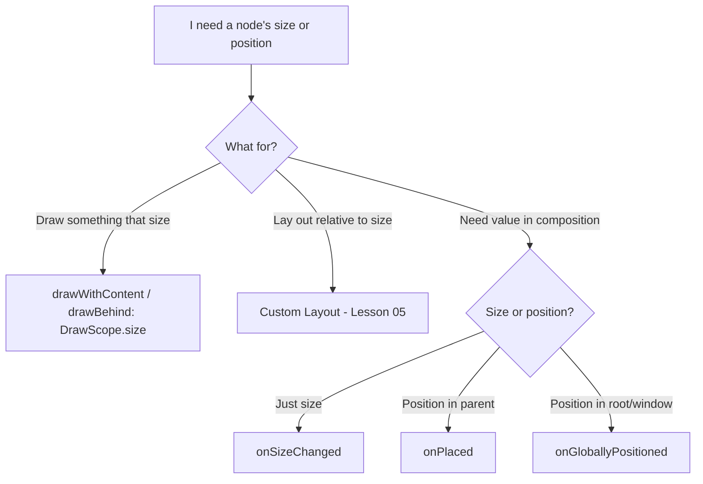
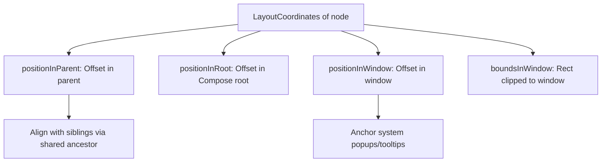

# Lesson 04 — onSizeChanged & onGloballyPositioned

> After this lesson you can react to a node's *measured size* and *final on-screen position* with `onSizeChanged` and `onGloballyPositioned`, while avoiding the feedback loops and over-firing that make these callbacks dangerous.

**Module:** 05 · **Lesson:** 04 · **Level:** 🟢🟡🔴 · **Est. time:** 65–85 min

---

## 1. Concept

### 🟢 For beginners — *what is it and why do I care?*

The layout phase decides each node's size and position. But sometimes your code wants to *know* those final numbers — for example: "how wide did this text actually end up?" so you can draw an underline exactly that width, or "where on screen is this button?" so you can anchor a popup to it.

Two modifiers report this back to you *after* layout runs:

- **`Modifier.onSizeChanged { size -> … }`** — gives you the node's **measured size** (an `IntSize`, in pixels) whenever it changes.
- **`Modifier.onGloballyPositioned { coordinates -> … }`** — gives you the node's **`LayoutCoordinates`**: its size *and* its position relative to the parent, the root, or the window.

The key idea: these are **read-back callbacks**. Layout already happened; you're being told the result so you can react (usually by updating some state that drives the *next* frame).

### 🟡 For intermediate devs — *the mechanism*

Both run **after** the layout pass, as part of completing layout for that node.

`onSizeChanged` is the lean one: it fires only when the measured `IntSize` actually changes (initial layout, and on later size changes). Use it when *all you need is the size*.

`onGloballyPositioned` is richer and fires more often. Its `LayoutCoordinates` gives you:

| Call | Returns | Use for |
|---|---|---|
| `coordinates.size` | `IntSize` | measured size (px) |
| `coordinates.positionInParent()` | `Offset` | position within the parent |
| `coordinates.positionInRoot()` | `Offset` | position within the Compose root |
| `coordinates.positionInWindow()` | `Offset` | position within the window |
| `coordinates.boundsInWindow()` | `Rect` | clipped bounds in window space |

The canonical loop is **measure → report → store in state → use next frame**:

```kotlin
var widthPx by remember { mutableStateOf(0) }
Text("Underline me", Modifier.onSizeChanged { widthPx = it.width })
// …elsewhere, draw something `widthPx` wide
```

That state write may trigger a recomposition (and another layout), so these callbacks sit at the boundary between the layout phase and your state — which is exactly where loops are born.

### 🔴 For senior devs — *trade-offs, edges, internals*

**`onGloballyPositioned` fires more than you think.** It's invoked after layout **and on relevant ancestor changes** — if a parent moves, scrolls, or relayouts, your node's global position changed, so the callback fires again. Inside a scrolling list it can fire on **every scroll frame**. Treat it as potentially hot: do *no* allocation or heavy work in it, and never assume it fires once.

**Writing state from these callbacks can create a layout loop.** If `onSizeChanged`/`onGloballyPositioned` writes state that *changes this node's own size or position*, you get: layout → callback → state write → recompose → layout → callback → … Compose may stabilize (if it converges) or you may pin the CPU. The rule: **the state you write must not feed back into the geometry that triggered the callback.** Prefer writing state that affects a *sibling* or a *draw*, not this node's measure.

**Prefer cheaper, in-phase tools when they exist.** A lot of "I need the size" cases are better solved *without* a read-back callback:

- Need to **draw** something sized to the node? Use `Modifier.drawWithContent`/`drawBehind` — `DrawScope.size` is already the node's size, in the draw phase, with **no state round-trip** and no recomposition.
- Need to **lay out** relative to measured size? Write a custom `Layout` (Lesson 05) — you have sizes directly, in-phase.
- Only when you need the value **in composition** (anchor a popup, report a coordinate up, drive an animation target) do you actually need `onSizeChanged`/`onGloballyPositioned`.

**`onGloballyPositioned` vs `onPlaced`.** `Modifier.onPlaced { coordinates -> … }` fires when the node is *placed by its direct parent* (earlier and narrower than global positioning). If you only care about position **within the parent**, `onPlaced` is cheaper and fires less than the global variant. Reach for `onGloballyPositioned` only when you genuinely need root/window coordinates.

**Coordinate spaces are not interchangeable.** `positionInParent` ≠ `positionInRoot` ≠ `positionInWindow`. Anchoring a system popup wants **window** coordinates; aligning two siblings wants a **shared ancestor** (`localPositionOf`/`localBoundsOf`). Mixing spaces produces "my tooltip is offset by the status bar height" bugs.

**These callbacks are async relative to your state.** The value you receive describes the layout that *just* happened; by the time your state write lands and recomposes, layout may run again. Don't treat the reported geometry as a synchronous source of truth for the *current* frame — it's the previous frame's result.

### Analogy

**A land surveyor who reports back after the building is built.** The architect (layout) finishes the structure; the surveyor (`onGloballyPositioned`) then walks out and reports exact dimensions and GPS coordinates. Useful! But if the architect *rebuilds the house every time the surveyor reports new numbers*, you'll never finish — that's the feedback loop. And the surveyor reports in a chosen coordinate system: property-relative, city-relative, or global GPS — read the wrong one and your fence lands on the neighbor's lawn.

### Mental model

> **These are read-back callbacks: layout already happened, here are the numbers. Store them in state to use *next* frame — and never let what you store change the size/position that fired the callback.**

### Real-world example

A **tooltip/coach-mark anchored to a button.** `onGloballyPositioned` on the button captures its `boundsInWindow()`; the tooltip popup positions itself just below those bounds. Because the tooltip is a *separate* overlay (not affecting the button's own layout), there's no loop. A second classic: an **animated text underline** that must match the text's measured width — capture `onSizeChanged { width }`, animate a line to that width.

---

## 2. Visual Learning

**ASCII — read-back loop (and where it goes wrong):**
```text
   LAYOUT runs ─▶ node sized & placed
        │
        ▼
   onSizeChanged(size) / onGloballyPositioned(coords)   ← reported AFTER layout
        │
        ▼  (write state)
   state = size/position
        │
        ▼  used to draw a sibling / anchor a popup   ✅ safe (no feedback)
        │
        └──▶  used to change THIS node's own size      ❌ loop: layout → callback → layout → …
```

**Mermaid — choosing the right tool:**


**Mermaid — coordinate spaces:**


**Illustration prompt (paste into an image generator):**
```text
Illustration: a land surveyor in a hard hat standing beside a just-finished house, holding a
readout that shows "size: 320x96 px" and "position: (140, 512) window". A dotted arrow carries
those numbers into a small floating panel labeled "state", which then anchors a speech-bubble
tooltip beneath the house. A red warning loop shows the numbers feeding BACK into the house and
forcing a rebuild, crossed out with "no feedback loops!". Modern, vibrant, clean labels, soft
lighting.
```

---

## 3. Code

### 🟢 Beginner — capture measured size with `onSizeChanged`

```kotlin
@Composable
fun MeasuredText() {
    var sizePx by remember { mutableStateOf(IntSize.Zero) }

    Column {
        Text(
            "How wide am I?",
            Modifier.onSizeChanged { measured -> sizePx = measured },  // fires after layout
        )
        Text("Measured: ${sizePx.width} × ${sizePx.height} px")
    }
}
```

**Explanation.** `onSizeChanged` reports the `Text`'s measured `IntSize` after layout; we stash it in state and display it. It fires on first layout and whenever the size changes (e.g. text or font scale changes) — not on every frame.

**Common mistakes.**
```kotlin
// ❌ Treating the callback as synchronous — using the value "right now" in the same composition.
val size = remember { IntSize.Zero }       // never updated; you can't read it inline
Text("hi", Modifier.onSizeChanged { /* the value arrives LATER, via state */ })
```

**Best practices.**
- Use `onSizeChanged` when you only need the **size**; it's leaner than `onGloballyPositioned`.
- Route the value through **state** and consume it on the next frame.

---

### 🟡 Intermediate — anchor a popup with `onGloballyPositioned`

```kotlin
@Composable
fun AnchoredTooltip() {
    var anchorBounds by remember { mutableStateOf<Rect?>(null) }
    var show by remember { mutableStateOf(false) }

    Box {
        Button(
            onClick = { show = !show },
            modifier = Modifier.onGloballyPositioned { coords ->
                // window-space bounds → correct space for popups/overlays
                anchorBounds = coords.boundsInWindow()
            },
        ) { Text("Show tip") }

        if (show && anchorBounds != null) {
            // A separate overlay; it does NOT affect the button's own layout → no loop.
            TooltipBubble(anchorBoundsInWindow = anchorBounds!!)
        }
    }
}
```

**Explanation.** We capture the button's `boundsInWindow()` (window space — what an overlay needs) into state, then render a tooltip that positions itself relative to those bounds. The tooltip is independent of the button's layout, so storing its geometry doesn't feed back into the button's size/position.

**Common mistakes.**
```kotlin
// ❌ Using positionInParent() to place a window-level popup → offset by ancestors' positions.
val wrong = coords.positionInParent()      // parent space, not window space → misaligned tooltip

// ❌ Doing real work in the callback — it can fire on every scroll/relayout frame.
Modifier.onGloballyPositioned { c -> repository.log(c.positionInWindow()) }  // hot path, allocations
```

**Best practices.**
- Match the **coordinate space** to the use: window for overlays, shared-ancestor for sibling alignment.
- Keep the callback **cheap** (it can be hot); just capture a value into state.

---

### 🔴 Production — prefer the draw phase; loop-proof when you can't

```kotlin
/**
 * An animated underline that matches the text's width.
 * Production decision: we DON'T need the width in composition — we only DRAW with it.
 * So we skip onSizeChanged entirely and use the draw phase, where size is already known.
 * Result: no state round-trip, no recomposition, no feedback-loop risk.
 */
@Composable
fun UnderlinedLabel(text: String, modifier: Modifier = Modifier) {
    val underline = MaterialTheme.colorScheme.primary
    Text(
        text,
        modifier = modifier.drawWithContent {
            drawContent()                       // draw the text first
            val y = size.height                 // DrawScope.size = this node's measured size
            drawLine(
                color = underline,
                start = Offset(0f, y),
                end = Offset(size.width, y),     // exactly the text width — no callback needed
                strokeWidth = 2.dp.toPx(),
            )
        },
    )
}
```

```kotlin
/**
 * When you genuinely need the value IN COMPOSITION (e.g. to size a sibling),
 * guard against loops: write state that affects a SIBLING, never this node's own size.
 */
@Composable
fun LabelWithMatchingBar() {
    var labelWidthPx by remember { mutableStateOf(0) }
    val density = LocalDensity.current

    Column {
        Text(
            "Title",
            Modifier.onSizeChanged { labelWidthPx = it.width },   // size feeds a SIBLING below
        )
        // Sibling bar matches the label width; changing the bar can't resize the label → safe.
        Box(
            Modifier
                .width(with(density) { labelWidthPx.toDp() })
                .height(3.dp)
                .background(MaterialTheme.colorScheme.primary),
        )
    }
}
```

**Explanation.** The first component never uses a read-back callback at all — drawing wants the size in the **draw phase**, where `DrawScope.size` already has it, so there's zero state round-trip. The second shows the loop-proof pattern for when you *do* need the value in composition: the captured width sizes a **sibling**, which cannot change the label's own measurement, so the loop can't form.

**Common mistakes.**
```kotlin
// ❌ Feedback loop: the callback writes state that resizes the SAME node.
var w by remember { mutableStateOf(0) }
Text("x", Modifier
    .onSizeChanged { w = it.width }
    .width(with(LocalDensity.current) { (w + 8).toDp() }))   // grows → fires → grows → …
```
```kotlin
// ❌ Using onGloballyPositioned to get a size you only need for drawing — pay a state
// round-trip + recomposition for nothing. Use drawWithContent/DrawScope.size instead.
```

**Best practices.**
- If you only need the size to **draw**, use the **draw phase** (`DrawScope.size`) — no callback, no recomposition.
- If you need it to **lay out**, write a custom `Layout` (Lesson 05).
- If you truly need it **in composition**, write state that affects **other** nodes, never the one that fired the callback.
- Keep callbacks allocation-free; prefer `onPlaced`/`onSizeChanged` over `onGloballyPositioned` when they suffice.

---

## 4. Interview Questions

**🟢 Beginner**

1. *What does `Modifier.onSizeChanged` give you, and when does it fire?*
   > It reports the node's measured `IntSize` (in pixels) after the layout pass, firing on initial layout and whenever the size changes — not every frame.
2. *What extra information does `onGloballyPositioned` provide over `onSizeChanged`?*
   > `LayoutCoordinates`: not just the size but the node's position — `positionInParent/Root/Window` and `boundsInWindow` — so you can anchor things to its on-screen location.

**🟡 Intermediate**

3. *You need to draw an underline exactly as wide as a `Text`. What's the best tool?*
   > The **draw phase**: `Modifier.drawWithContent { drawContent(); drawLine(end = Offset(size.width, …)) }`. `DrawScope.size` already holds the measured size, so you avoid a state round-trip and recomposition that `onSizeChanged` would cost.
4. *Why can `onGloballyPositioned` fire very frequently?*
   > Because a node's global position changes when any ancestor moves, scrolls, or relayouts — so inside a scrolling list it can fire every frame. Keep the callback cheap and allocation-free.

**🔴 Senior**

5. *How do these callbacks cause a layout feedback loop, and how do you prevent it?*
   > If the callback writes state that changes the same node's size/position, you get layout → callback → state write → recompose → layout → … Prevent it by ensuring the state you write affects a *sibling* or a *draw*, not the geometry that triggered the callback — or by avoiding the callback entirely (draw phase / custom layout).
6. *Which coordinate accessor anchors a system popup correctly, and why not the others?*
   > `boundsInWindow()` / `positionInWindow()` — popups live in window space. `positionInParent`/`positionInRoot` are relative to ancestors and will be offset (e.g. by insets/scroll), misplacing the popup. For sibling alignment, use a shared ancestor (`localPositionOf`).

---

## 5. AI Assistant

**Prompt example (anchor + no-loop):**
```text
Jetpack Compose (2026 BOM, Kotlin 2.x): I want a tooltip anchored just below a button. Use
onGloballyPositioned to capture the button's WINDOW-space bounds into state, then position the
tooltip overlay so it doesn't affect the button's own layout (no feedback loop). Also: if I instead
just wanted to draw an underline as wide as some text, show the draw-phase version that needs no
callback. Explain which coordinate space and why.
```

**AI workflow — where it helps on *this* topic.**
- ✅ Great for: wiring popup/tooltip anchoring, picking the coordinate accessor, and converting "draw something the size of X" into a draw-phase solution.
- ⚠️ Watch: models default to `onGloballyPositioned` for sizes (when `onSizeChanged` or the draw phase is right), use the wrong coordinate space, do heavy work in the callback, and write loop-forming state.

**Review workflow — map to this lesson's *Common Mistakes*:**
- Could this be done in the **draw phase** (`DrawScope.size`) or a **custom Layout** instead of a read-back callback?
- Does the state written by the callback feed back into the **same node's** size/position (loop risk)?
- Is the **coordinate space** correct for the use (window for popups, shared ancestor for siblings)?
- Is the callback **cheap** (no allocations / logging on a possibly-hot path)?

**Validation workflow — prove it actually works:**
1. **Compile & run**; verify the anchor/underline tracks correctly when text/size changes and on rotation.
2. **Scroll test**: put the node in a `LazyColumn` and confirm `onGloballyPositioned` work stays cheap (no jank) — or that you didn't need it.
3. **Loop check**: temporarily log the callback; if it fires unboundedly, the written state is feeding back — refactor to a sibling/draw.
4. **Recomposition counts** (Layout Inspector): confirm the draw-phase version causes *no* recomposition where the callback version would.

> **AI drafts, you decide.** If the model reaches for `onGloballyPositioned` to get a size it only draws with, send it back to the draw phase.

---

## Recap / Key takeaways

- `onSizeChanged` → measured **size** (`IntSize`); `onGloballyPositioned` → size **and** position (`LayoutCoordinates`), reported **after** layout.
- The loop is **measure → report → store in state → use next frame**. Never let the stored value change the geometry that fired the callback.
- **Prefer in-phase tools:** draw with `DrawScope.size`, lay out with a custom `Layout`; use read-back callbacks only when you need the value **in composition**.
- `onGloballyPositioned` can be **hot** (fires on ancestor scroll/relayout) — keep it allocation-free; consider `onPlaced` for parent-relative position.
- Match the **coordinate space** to the job: window for popups, shared ancestor for sibling alignment.

➡️ Next: **[Lesson 05 — Custom `Layout`](05-custom-layout.md)** — finally taking over measurement and placement yourself: `measure → layout → place`, building real layouts from scratch.
