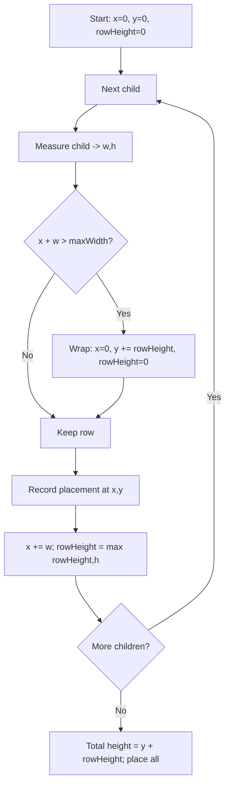
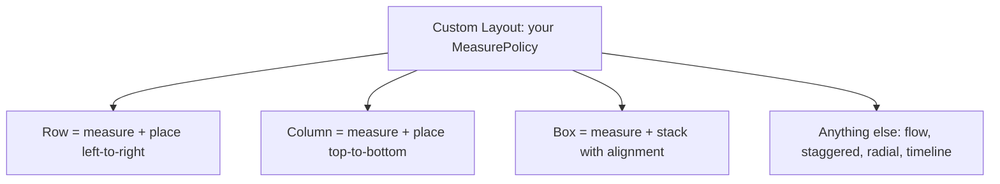

# Lesson 05 — Custom `Layout`

> After this lesson you can write a `Layout` composable from scratch — measuring children once, sizing yourself, and placing each child — and build real layouts (a flow row, a staggered grid) the built-ins can't express.

**Module:** 05 · **Lesson:** 05 · **Level:** 🟢🟡🔴 · **Est. time:** 100–120 min

---

## 1. Concept

### 🟢 For beginners — *what is it and why do I care?*

`Row`, `Column`, and `Box` are just *prewritten layouts*. Each one was built by someone who decided "measure the children, then place them left-to-right" (Row), "top-to-bottom" (Column), or "stacked" (Box). When none of the built-ins arranges children the way you need — a tag cloud that wraps, a circular menu, a Pinterest-style grid where columns have different heights — you write your **own** layout.

The tool is the **`Layout`** composable. You give it some `content` (the children) and a block that does two things:

1. **Measure** each child (decide how big each one is allowed to be, get back its chosen size).
2. **Place** each child at an `(x, y)` you compute.

That's it. Everything `Row` does, you can now do — and anything `Row` *can't* do, you can do too.

### 🟡 For intermediate devs — *the mechanism*

The signature you'll write hundreds of times:

```kotlin
Layout(
    content = content,
    modifier = modifier,
) { measurables: List<Measurable>, constraints: Constraints ->
    // 1) MEASURE each child once → Placeable (knows its width/height)
    val placeables = measurables.map { it.measure(/* child constraints */) }

    // 2) DECIDE your own size (coerced into `constraints`)
    val width = /* … */
    val height = /* … */

    // 3) PLACE children inside layout(width, height) { … }
    layout(width, height) {
        placeables.forEach { it.place(x, y) }   // or placeRelative(x, y) for RTL
    }
}
```

The trailing lambda is a **`MeasurePolicy`** — the brain of your layout. Inside it:

- `measurables` are your children, **not yet measured**.
- `constraints` are what *your* parent gave *you*.
- You pass each child its own `Constraints` (often a loosened or fixed version of yours).
- `measure(...)` returns a `Placeable`; call it **once** per child (Lesson 01).
- `layout(w, h) { }` declares your size and opens the **placement** scope.
- `place(x, y)` positions a child; `placeRelative(x, y)` mirrors x for right-to-left locales.

You decide the child constraints. Want children to size themselves freely? Pass `constraints.copy(minWidth = 0, minHeight = 0)`. Want them to fill a cell exactly? Pass `Constraints.fixed(cellW, cellH)`.

### 🔴 For senior devs — *trade-offs, edges, internals*

**`Layout` is the single-pass primitive.** It enforces everything from Lesson 01: one `measure()` per child, sizes coerced to constraints, placement last. If your algorithm fundamentally needs a child's *measured* result to build a *different* child, `Layout` can't express it — that's `SubcomposeLayout` (Lesson 06). If you only need a *size estimate*, use intrinsics (Lesson 02) inside your `Layout`. Reaching for `SubcomposeLayout` when a single `measure()` plus arithmetic would do is the most common over-engineering smell in custom layouts.

**Constraint propagation is a design decision, not a default.** When you measure a child, *you* choose its constraints. Three common policies:

- **Pass-through** (`it.measure(constraints)`): child may be as big as you are — good for "fill" children.
- **Loosened** (`constraints.copy(minWidth = 0, minHeight = 0)`): child measures at its *natural* size — good for wrapping/flow layouts where each child should be intrinsic.
- **Per-cell fixed** (`Constraints.fixed(w, h)`): child fills a computed cell — good for grids.

Choosing wrong is the difference between a tag that hugs its text and a tag that's stretched full-width.

**Provide intrinsics if you'll be nested under `IntrinsicSize.*`.** The `MeasurePolicy` interface lets you override `minIntrinsicWidth/Height` and `maxIntrinsicWidth/Height`. If you skip them, Compose falls back to a heuristic that re-runs your measure with a probe constraint — sometimes wrong, sometimes slow. A production custom layout that might sit inside `Modifier.height(IntrinsicSize.Min)` should answer intrinsics deliberately. (Use the `MeasurePolicy` object form rather than the trailing-lambda form when you need this.)

**Placement is cheaper than measurement — and can defer state reads.** The `layout {}` block can re-run *without* re-measuring (placement-only invalidation). Reading animated state (e.g. an offset) **inside** the placement lambda, or using `placeWithLayer { }`, confines the change to the placement/draw phase — a major performance lever for animated layouts ([Module 11](../module-11-performance/README.md)). Don't do expensive computation in `measure` that you could do once and reuse.

**`place` vs `placeRelative` vs `placeWithLayer`.** `place` is absolute (LTR pixels). `placeRelative` auto-mirrors x for RTL — use it unless you have a reason not to. `placeWithLayer { }` places into a graphics layer, ideal for animating translation/alpha/scale of a child without re-laying-out.

**Multiple measure passes are illegal, but multiple *children* measured in a loop are fine.** The constraint is one measure *per child*, not one `measure` call total. A flow layout that measures 50 chips calls `measure` 50 times — each on a *different* `Measurable` — which is perfectly legal and still O(n).

### Analogy

**A stage manager blocking a scene.** The actors (children) arrive. The stage manager first asks each "how much space do you need?" and notes their footprint (**measure** → `Placeable`). Then they decide the stage size and chalk an exact spot for each actor — "you, stand at (2m, 1m)" (**place**). They mark each actor's footprint **once**; they don't keep re-measuring. And they decide the *rules*: everyone gets their natural space (loosened), or everyone stands in identical taped squares (fixed cells).

### Mental model

> **`Layout` = you are the parent now: measure each child once, decide your size within your constraints, then place every child at an (x, y) you compute.**

### Real-world example

A **tag/chip cloud** (search filters, interests). Chips have different widths; they should flow left-to-right and wrap to the next line when they run out of room — something neither `Row` (overflows) nor `Column` (one per line) does. A custom `Layout` measures each chip at its natural width, tracks the running x, wraps when `x + chipWidth > maxWidth`, and places each chip. This is the canonical "first real custom layout."

---

## 2. Visual Learning

**ASCII — the three steps of a `Layout`:**
```text
   content (children) ─▶ MeasurePolicy { measurables, constraints }
        │
        │ (1) MEASURE each child once
        ├─ chip0.measure(loosened) ─▶ Placeable(80×32)
        ├─ chip1.measure(loosened) ─▶ Placeable(120×32)
        └─ chip2.measure(loosened) ─▶ Placeable(60×32)
        │
        │ (2) DECIDE own size  (sum/wrap logic, then constrain)
        ▼   width = constraints.maxWidth ; height = totalRows*rowHeight
   layout(width, height) {
        │ (3) PLACE each child at computed (x, y)
        ├─ place chip0 at (0,   0)
        ├─ place chip1 at (88,  0)
        └─ place chip2 at (0,  40)   ← wrapped to next row
   }
```

**Mermaid — flow-row wrapping algorithm:**


**Mermaid — Layout vs the built-ins:**


**Illustration prompt (paste into an image generator):**
```text
Illustration: a theatre stage from above with a stage manager holding a clipboard. Actors of
different widths line up at the wings (labeled "children / measurables"). Step 1 panel: the manager
notes each actor's footprint with a tape measure (labeled "measure -> Placeable"). Step 2 panel:
chalk marks on the stage floor with coordinates like "(88, 0)" and one actor wrapped to a second
row labeled "(0, 40)". A bold note reads "measure once, then place". Modern, vibrant, clean labels,
soft theatrical lighting.
```

---

## 3. Code

### 🟢 Beginner — reimplement a vertical stack (a tiny `Column`)

```kotlin
@Composable
fun SimpleColumn(
    modifier: Modifier = Modifier,
    content: @Composable () -> Unit,
) {
    Layout(content, modifier) { measurables, constraints ->
        // 1) Measure each child once. Loosen height so children take their natural height,
        //    but keep the incoming width range so they can fill width if they want.
        val placeables = measurables.map { it.measure(constraints) }

        // 2) Our size: width = widest child; height = sum of children (both coerced).
        val width = constraints.constrainWidth(placeables.maxOfOrNull { it.width } ?: 0)
        val height = constraints.constrainHeight(placeables.sumOf { it.height })

        // 3) Place top-to-bottom.
        layout(width, height) {
            var y = 0
            placeables.forEach { placeable ->
                placeable.placeRelative(0, y)   // placeRelative → RTL-aware
                y += placeable.height
            }
        }
    }
}
```

**Explanation.** This *is* a minimal `Column`. We measure each child once, set our width to the widest child and our height to the stacked total (both coerced to constraints), then place each child below the previous one. `placeRelative` mirrors x in RTL locales — free correctness.

**Common mistakes.**
```kotlin
// ❌ Forgetting to coerce → can exceed the parent's max and clip/overflow.
val height = placeables.sumOf { it.height }     // unbounded; should be constrainHeight(...)

// ❌ Using place() everywhere and wondering why RTL looks wrong — prefer placeRelative().
```

**Best practices.**
- Measure once, then compute size, then place — always in that order.
- Coerce your computed width/height with `constrainWidth`/`constrainHeight`.
- Default to `placeRelative` for RTL correctness.

---

### 🟡 Intermediate — a wrapping flow row (the tag cloud)

```kotlin
@Composable
fun FlowRowSimple(
    modifier: Modifier = Modifier,
    horizontalGap: Dp = 8.dp,
    verticalGap: Dp = 8.dp,
    content: @Composable () -> Unit,
) {
    Layout(content, modifier) { measurables, constraints ->
        val hGap = horizontalGap.roundToPx()
        val vGap = verticalGap.roundToPx()
        val maxWidth = constraints.maxWidth

        // Measure each child at its NATURAL size (loosen mins so chips hug their content).
        val placeables = measurables.map {
            it.measure(constraints.copy(minWidth = 0, minHeight = 0))
        }

        // Pass 1: assign each child an (x, y), wrapping when a row is full.
        val positions = ArrayList<IntOffset>(placeables.size)
        var x = 0
        var y = 0
        var rowHeight = 0
        var maxRowWidth = 0
        placeables.forEach { placeable ->
            if (x > 0 && x + placeable.width > maxWidth) {
                // wrap to next row
                x = 0
                y += rowHeight + vGap
                rowHeight = 0
            }
            positions += IntOffset(x, y)
            x += placeable.width + hGap
            rowHeight = maxOf(rowHeight, placeable.height)
            maxRowWidth = maxOf(maxRowWidth, x - hGap)
        }

        val width = constraints.constrainWidth(maxRowWidth)
        val height = constraints.constrainHeight(y + rowHeight)

        // Pass 2: place using the positions we computed (placement only — no re-measure).
        layout(width, height) {
            placeables.forEachIndexed { i, placeable ->
                placeable.placeRelative(positions[i])
            }
        }
    }
}
```

**Explanation.** Each child is measured **once** at its natural width. We then *compute* positions in a loop (tracking running x, wrapping when the next chip won't fit), and finally place everything. Measurement and placement are cleanly separated; the wrap logic is pure arithmetic over already-measured sizes. This is the real algorithm behind tag clouds — and the foundation of Compose's own `FlowRow`.

**Common mistakes.**
```kotlin
// ❌ Measuring with the FULL width as a minimum → every chip stretches to maxWidth, never wraps.
it.measure(constraints)                     // if minWidth>0, chips can't hug content

// ❌ Wrapping on the FIRST item (x == 0) → an item wider than the row gets pushed to its own
//    empty row unnecessarily. Guard with `x > 0 &&` before wrapping.

// ❌ Re-measuring inside layout{} to "recompute" a position → already-measured crash + wrong phase.
```

**Best practices.**
- Loosen child constraints (`minWidth = 0, minHeight = 0`) so children take intrinsic sizes.
- Separate **measure** (sizes) from **placement** (positions); compute positions between them.
- Guard the wrap with `x > 0` so a too-wide single child still places.
- Add gaps in pixels (`roundToPx()`), and coerce the final size.

---

### 🔴 Production — a staggered (Pinterest) grid with intrinsics

```kotlin
/**
 * A fixed-column staggered grid: each child is placed into the SHORTEST column so far,
 * giving the Pinterest "masonry" look. Production touches:
 *  - children measured once, at a fixed COLUMN WIDTH (so widths are uniform, heights vary)
 *  - own size coerced to constraints
 *  - intrinsics provided via the MeasurePolicy object form, so this grid behaves correctly
 *    if a parent wraps it in Modifier.height(IntrinsicSize.Min/Max)
 */
@Composable
fun StaggeredVerticalGrid(
    columns: Int,
    modifier: Modifier = Modifier,
    horizontalGap: Dp = 8.dp,
    verticalGap: Dp = 8.dp,
    content: @Composable () -> Unit,
) {
    require(columns >= 1) { "columns must be >= 1" }

    Layout(
        content = content,
        modifier = modifier,
        measurePolicy = object : MeasurePolicy {
            override fun MeasureScope.measure(
                measurables: List<Measurable>,
                constraints: Constraints,
            ): MeasureResult {
                val hGap = horizontalGap.roundToPx()
                val vGap = verticalGap.roundToPx()

                // Column width = (available width - gaps) / columns.
                val totalGap = hGap * (columns - 1)
                val columnWidth =
                    ((constraints.maxWidth - totalGap) / columns).coerceAtLeast(0)

                // Each child gets a FIXED width, but is free in height.
                val childConstraints = Constraints(
                    minWidth = columnWidth,
                    maxWidth = columnWidth,
                    minHeight = 0,
                    maxHeight = Constraints.Infinity,
                )

                val columnHeights = IntArray(columns)            // running height per column
                val positions = ArrayList<IntOffset>(measurables.size)

                measurables.forEach { measurable ->
                    val placeable = measurable.measure(childConstraints)   // measure once
                    // Choose the shortest column → masonry packing.
                    val target = columnHeights.indices.minBy { columnHeights[it] }
                    val x = target * (columnWidth + hGap)
                    val y = columnHeights[target]
                    positions += IntOffset(x, y)
                    columnHeights[target] = y + placeable.height + vGap
                    // stash placeable on the position index by parallel list:
                }

                // Re-measure is NOT allowed; capture placeables alongside positions instead:
                val placeables = measurables.map { it.measure(childConstraints) }
                    .also { /* NOTE: see Common Mistakes — don't actually do this twice */ }

                val width = constraints.maxWidth
                val height = constraints.constrainHeight(
                    (columnHeights.maxOrNull() ?: 0) - vGap.coerceAtLeast(0),
                )

                return layout(width, height) {
                    placeables.forEachIndexed { i, placeable ->
                        placeable.placeRelative(positions[i])
                    }
                }
            }

            // Provide intrinsics so IntrinsicSize.* parents get a sensible answer.
            override fun IntrinsicMeasureScope.maxIntrinsicHeight(
                measurables: List<IntrinsicMeasurable>,
                width: Int,
            ): Int {
                // Rough upper bound: tallest single column if all items stacked evenly.
                val columnWidth = (width / columns).coerceAtLeast(0)
                val heights = measurables.map { it.maxIntrinsicHeight(columnWidth) }
                // distribute round-robin as a cheap estimate
                val perColumn = IntArray(columns)
                heights.forEachIndexed { i, h -> perColumn[i % columns] += h }
                return perColumn.maxOrNull() ?: 0
            }
        },
    )
}
```

> ⚠️ The snippet above intentionally contains the **double-measure bug** so we can dissect it. The corrected loop measures each child **once** and keeps the `Placeable`:

```kotlin
// ✅ Correct single-pass body (drop-in replacement for the measure loop above):
val placeables = ArrayList<Placeable>(measurables.size)
val positions = ArrayList<IntOffset>(measurables.size)
val columnHeights = IntArray(columns)

measurables.forEach { measurable ->
    val placeable = measurable.measure(childConstraints)   // exactly once
    placeables += placeable
    val target = columnHeights.indices.minBy { columnHeights[it] }
    val x = target * (columnWidth + hGap)
    val y = columnHeights[target]
    positions += IntOffset(x, y)
    columnHeights[target] = y + placeable.height + vGap
}
```

**Explanation.** Each child is measured **once** at a fixed column width (uniform widths, variable heights), then dropped into the **shortest** column — the masonry algorithm. We coerce our height and provide `maxIntrinsicHeight` so the grid is a good citizen under `IntrinsicSize.*`. Using the `MeasurePolicy` *object* form (instead of the trailing lambda) is what lets us override intrinsics.

**Common mistakes.**
```kotlin
// ❌ Measuring each child twice (the bug shown above) → IllegalStateException: already measured.
val placeables = measurables.map { it.measure(childConstraints) }   // after already measuring in the loop
```
```kotlin
// ❌ Forgetting to subtract the trailing vGap from total height → a phantom gap at the bottom.
val height = columnHeights.max()      // includes one extra vGap per column
```
```kotlin
// ❌ Skipping intrinsics, then wrapping the grid in IntrinsicSize.Min → wrong/expensive fallback.
```

**Best practices.**
- Measure each child exactly once; keep the `Placeable` and the computed position together.
- For grids, fix the **width** (column width) and free the **height**; coerce the final height.
- Subtract trailing gaps from your reported size.
- Provide **intrinsics** (via the `MeasurePolicy` object form) when the layout may be nested under `IntrinsicSize.*`.
- For *huge* item counts, don't use a plain `Layout` (it composes/measures everything) — use `LazyVerticalStaggeredGrid` (Module 02); a custom `Layout` is for bounded, fully-composed content.

---

## 4. Interview Questions

**🟢 Beginner**

1. *What two jobs does the `Layout` composable let you do?*
   > Measure each child (decide allowed size, get back its chosen size as a `Placeable`) and place each child at an `(x, y)` you compute. It's how `Row`/`Column`/`Box` are implemented.
2. *What is a `Placeable`?*
   > The result of measuring a child — a child that now has a fixed `.width`/`.height`, ready to be positioned with `place(x, y)` inside the `layout {}` block.

**🟡 Intermediate**

3. *Walk through the body of a custom `Layout`.*
   > `Layout(content) { measurables, constraints -> … }`: measure each `measurable` once (with constraints you choose) to get `Placeable`s; compute your own width/height (coerced to `constraints`); call `layout(w, h) { }` and `place`/`placeRelative` each child at a computed position.
4. *How do you make children take their natural size vs. fill a cell?*
   > Natural size: measure with loosened mins — `constraints.copy(minWidth = 0, minHeight = 0)`. Fill a cell: measure with `Constraints.fixed(cellW, cellH)`. The parent chooses the child constraints.

**🔴 Senior**

5. *When is `Layout` insufficient, and what do you reach for?*
   > When you need a child's *measured* result to build a *different* child (e.g. compose item B only if A's height < X) — that's `SubcomposeLayout`. If you only need a size *estimate*, use intrinsics inside `Layout`. Don't reach for `SubcomposeLayout` when arithmetic over a single measure pass suffices.
6. *Why and how would you provide intrinsics for your custom layout?*
   > If it might be nested under `Modifier.height/width(IntrinsicSize.*)`, the default intrinsic fallback (re-running measure with a probe) can be wrong or costly. Override `min/maxIntrinsicWidth/Height` on the `MeasurePolicy` (object form) to answer deliberately, making your layout a correct, cheap citizen.
7. *How can a custom layout animate child positions cheaply?*
   > Read the animated offset **inside the placement lambda** (or use `placeWithLayer`), so changes invalidate only placement/draw, not measurement or composition — keeping the animation off the measure path.

---

## 5. AI Assistant

**Prompt example (build from a sketch):**
```text
Jetpack Compose (2026 BOM, Kotlin 2.x): write a custom Layout for a wrapping "flow row" of chips.
Requirements: measure each child ONCE at its natural width; wrap to a new row when the next chip
won't fit maxWidth; support horizontal/vertical gaps; coerce the final size to constraints; use
placeRelative for RTL. Then add a variant that provides maxIntrinsicHeight via the MeasurePolicy
object form. Point out any place a double-measure could sneak in.
```

**AI workflow — where it helps on *this* topic.**
- ✅ Great for: scaffolding the `Layout` skeleton, drafting the wrap/packing arithmetic, generating gap math and RTL placement.
- ⚠️ Watch: models frequently (1) **measure twice**, (2) skip `constrainWidth/Height`, (3) forget the `x > 0` wrap guard, (4) leave trailing gaps in the size, (5) reach for `SubcomposeLayout` when plain `Layout` works, and (6) omit intrinsics.

**Review workflow — map to this lesson's *Common Mistakes*:**
- Is each child measured **exactly once**? (Search for two `.measure(` calls on the same source.)
- Are width/height **coerced** to `constraints`?
- Does wrapping guard with `x > 0`? Are trailing gaps subtracted?
- Are child constraints chosen intentionally (loosened vs fixed)?
- If it might be nested under `IntrinsicSize.*`, are **intrinsics** provided?
- Is `SubcomposeLayout` used where a single `measure` + arithmetic would do? (Down-grade it.)

**Validation workflow — prove it actually works:**
1. **Compile & run** with mixed-width children; confirm wrapping/packing and gaps look right.
2. **Previews** at several widths (e.g. 240, 360, 600 dp); verify no clipping and correct wrap points.
3. **RTL test**: set `LocalLayoutDirection = LayoutDirection.Rtl` in a preview; confirm `placeRelative` mirrors correctly.
4. **Double-measure check**: run it — the runtime throws `IllegalStateException: already measured` instantly if you slipped.
5. **Intrinsics check**: wrap in `Modifier.height(IntrinsicSize.Min)`; confirm a sensible height (not a crash or absurd value).
6. **Profile** with large-but-bounded content; if it's a long scroller, switch to a Lazy staggered grid instead.

> **AI drafts, you decide.** Every generated `Layout` gets the same first question: *is any child measured more than once?* If yes, it's wrong before you read another line.

---

## Recap / Key takeaways

- `Layout(content) { measurables, constraints -> … }` makes **you** the parent: measure → size → place.
- **Measure each child once** → `Placeable`; **decide your size** (coerced to `constraints`); **place** with `place`/`placeRelative` inside `layout(w, h) { }`.
- **You choose child constraints**: loosened for natural size, `Constraints.fixed` to fill a cell.
- Separate **measurement** (sizes) from **placement** (positions); wrap/pack logic is arithmetic in between.
- Provide **intrinsics** (via the `MeasurePolicy` object form) when nested under `IntrinsicSize.*`.
- Animate positions in the **placement lambda** (or `placeWithLayer`) to keep changes off the measure path.
- For huge scrolling content use a **Lazy** layout; a custom `Layout` is for bounded, fully-composed children.

➡️ Next: **[Lesson 06 — SubcomposeLayout](06-subcomposelayout.md)** — when one child's *measured* size must drive what (and how) you compose another, and the cost you pay for that power.
