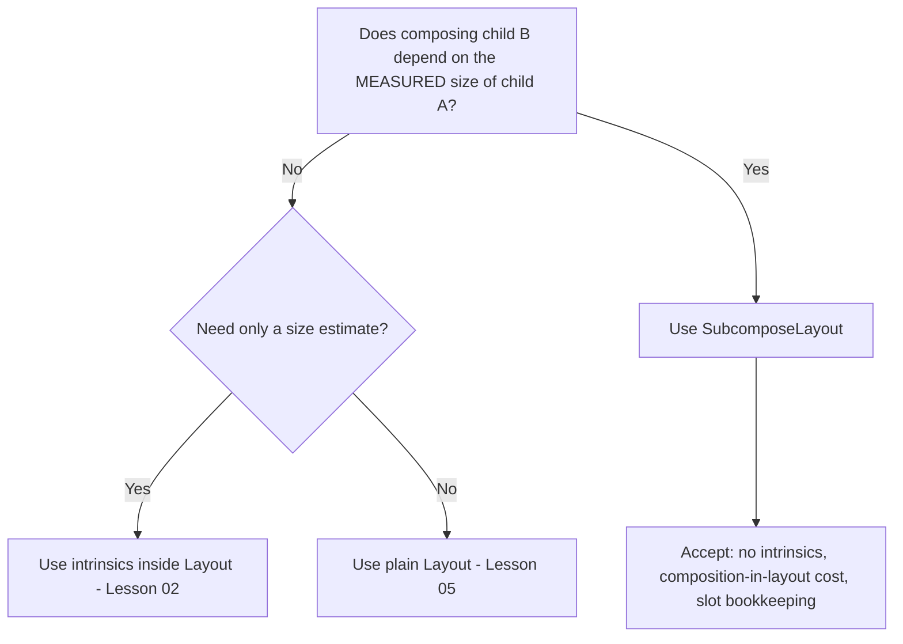
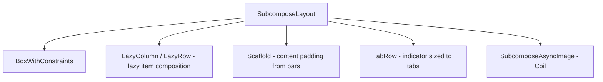

# Lesson 06 — SubcomposeLayout

> After this lesson you can use `SubcomposeLayout` to compose some children *after* measuring others, explain exactly what it costs, and recognize when a plain `Layout` is the right (cheaper) choice instead.

**Module:** 05 · **Lesson:** 06 · **Level:** 🟡🔴 · **Est. time:** 90–110 min

---

## 1. Concept

### 🟢 For beginners — *what is it and why do I care?*

A plain `Layout` (Lesson 05) has one hard limit: by the time you measure children, they've **already been composed**. You can't say "compose child B *differently* depending on how big child A turned out," because B already exists.

But some layouts genuinely need that. Examples:

- A **tab row** where every tab must be as wide as the **widest** tab — you need to measure all tabs *first*, then build an indicator sized to the result.
- A "**fit the biggest item that fits**" layout — measure candidates, then compose only the one that fits.
- `BoxWithConstraints` itself — it must know its size *before* composing content that depends on it.

`SubcomposeLayout` unlocks this. It lets you **compose children in stages during the measure pass**: measure one slot, look at the result, then compose (and measure) another slot based on what you learned.

### 🟡 For intermediate devs — *the mechanism*

`SubcomposeLayout` replaces the single `content` slot with a function you call: **`subcompose(slotId) { … }`**. Each call composes the given content *on demand* and returns its `Measurable`s, which you then measure.

```kotlin
SubcomposeLayout(modifier) { constraints ->
    // Stage 1: compose + measure the "main" slot.
    val mainPlaceables = subcompose(SlotId.Main) { MainContent() }
        .map { it.measure(constraints) }
    val maxWidth = mainPlaceables.maxOf { it.width }

    // Stage 2: NOW compose a dependent slot, using info from stage 1.
    val indicatorPlaceables = subcompose(SlotId.Indicator) { Indicator(width = maxWidth) }
        .map { it.measure(Constraints.fixed(maxWidth, indicatorHeight)) }

    layout(width, height) {
        mainPlaceables.forEach { it.place(/* … */) }
        indicatorPlaceables.forEach { it.place(/* … */) }
    }
}
```

Key points:

- **`subcompose(slotId) { content }`** composes that content lazily, *inside* the measure pass, and returns `List<Measurable>`.
- The **`slotId`** must be **stable** across recompositions (an enum, a constant, or a key) so Compose can reuse the sub-composition instead of recreating it.
- You can subcompose **multiple slots**, in **stages**, using earlier results to drive later ones.
- It powers `BoxWithConstraints`, `LazyColumn`/`LazyRow` (lazy item composition!), `Scaffold` (content padding depends on bars), and `SubcomposeAsyncImage` in Coil.

### 🔴 For senior devs — *trade-offs, edges, internals*

**`SubcomposeLayout` is the expensive escape hatch. Treat it as a last resort.** It defers composition into the layout pass, which has real costs:

- **No intrinsic measurements.** A `SubcomposeLayout` generally **cannot** answer intrinsic queries (it would have to subcompose to know), so wrapping it in `IntrinsicSize.*` throws or misbehaves. This ripples: anything built on it (including `BoxWithConstraints`) inherits the limitation.
- **Composition during layout breaks the usual phase separation.** Subcomposition happens in the measure pass, so a relayout can trigger *composition* work — more expensive than a normal relayout, and harder to reason about for performance.
- **Slot bookkeeping overhead.** Compose maintains sub-composition state per `slotId`. Unstable or accidentally-changing slot ids cause the subtree to be discarded and recomposed every pass — a silent performance cliff.
- **Easy to accidentally subcompose too much.** Subcomposing the same content in multiple branches, or subcomposing inside a frequently-relaying-out parent, multiplies cost.

**The decision rule:** *Do you need the **measured result** of one child to determine **what or how** you compose another? If not, you don't need `SubcomposeLayout`.* If you only need a **size estimate**, use **intrinsics** (Lesson 02). If you only need **arithmetic over already-composed children**, use a plain **`Layout`** (Lesson 05). `SubcomposeLayout` is *only* for "composition of B depends on the measurement of A."

**Laziness is the killer app.** The reason `LazyColumn` can show 10,000 items cheaply is `SubcomposeLayout`: it only `subcompose`s the items currently near the viewport, measuring/placing them and discarding off-screen ones. That's "compose on demand based on what's visible" — a measurement/scroll-driven composition decision, exactly what `SubcomposeLayout` is for. (You rarely write this yourself; you use `LazyColumn` — but knowing it's `SubcomposeLayout` underneath explains its rules, like requiring stable `key`s.)

**Stable slot ids and `subcompose` reuse.** When you call `subcompose(id) { … }` with the same `id` across measure passes, Compose **reuses** the existing sub-composition (only recomposing what changed). Change the `id` (e.g. compute it from data that varies) and you force a fresh composition every pass. Production `SubcomposeLayout`s use a small fixed set of slot ids (an enum) or carefully-keyed ids.

**It does not magically allow two measure passes of the same child.** Within a single `subcompose` result, each `Measurable` is still measured **once**. `SubcomposeLayout` gives you *staged composition*, not *re-measurement*. If you measure a slot's `Measurable` twice, it still throws.

### Analogy

**A bespoke tailor who must see the suit before cutting the lining.** A normal tailor (`Layout`) cuts all pieces from a pattern at once. A bespoke tailor (`SubcomposeLayout`) first sews and measures the jacket (subcompose slot A → measure), *then* cuts a lining to the finished jacket's exact dimensions (subcompose slot B using A's measurement). Powerful — but it's two staged operations and costs more time and thread. You only pay for bespoke when off-the-rack genuinely can't fit.

### Mental model

> **`SubcomposeLayout` lets you compose later children based on the *measured* size of earlier ones — staged composition inside the measure pass. It's powerful and expensive; reach for it only when a measurement must decide a composition.**

### Real-world example

A **custom tab row** where the selected-tab **indicator** must match the **widest tab's** width and animate between tab positions. You `subcompose` the tabs, measure them to find the max width and each tab's offset, then `subcompose` the indicator sized to that width and placed at the selected tab. A plain `Layout` can't do it, because the indicator's composition depends on the tabs' measurements. (Material's own `TabRow` uses `SubcomposeLayout` for exactly this.)

---

## 2. Visual Learning

**ASCII — staged composition inside one measure pass:**
```text
   SubcomposeLayout { constraints ->
        │
        │ STAGE 1
        ├─ subcompose(Main) { Tabs() } ─▶ [Measurable…] ─▶ measure ─▶ Placeables
        │                                   learn: maxTabWidth = 120, offsets = [...]
        │
        │ STAGE 2  (uses stage-1 result)
        ├─ subcompose(Indicator) { Indicator(width = 120) } ─▶ measure ─▶ Placeable
        │
        ▼
   layout(w, h) { place tabs; place indicator under selected tab }
   }
```

**Mermaid — Layout vs SubcomposeLayout decision:**


**Mermaid — what's built on SubcomposeLayout:**


**Illustration prompt (paste into an image generator):**
```text
Illustration: a bespoke tailor's workshop, two numbered stations. Station 1: a jacket on a
mannequin with a tape measure and a glowing readout "max width = 120". An arrow labeled "subcompose
+ measure" leads to Station 2, where a tailor cuts a lining piece sized to exactly "120", labeled
"subcompose dependent slot". A small cost meter on the wall reads "no intrinsics • composes during
layout". Caption: "see it, then cut to fit." Modern, vibrant, crisp labels, warm workshop light.
```

---

## 3. Code

### 🟢 Beginner — measure one slot, size another to match

```kotlin
private enum class Slot { Content, Underline }

@Composable
fun MatchWidthUnderline(
    modifier: Modifier = Modifier,
    content: @Composable () -> Unit,
) {
    SubcomposeLayout(modifier) { constraints ->
        // Stage 1: compose + measure the content.
        val contentPlaceables = subcompose(Slot.Content, content).map { it.measure(constraints) }
        val width = contentPlaceables.maxOfOrNull { it.width } ?: 0
        val contentHeight = contentPlaceables.maxOfOrNull { it.height } ?: 0

        // Stage 2: NOW compose an underline sized to the content's measured width.
        val underline = subcompose(Slot.Underline) {
            Box(Modifier.background(MaterialTheme.colorScheme.primary))
        }.map { it.measure(Constraints.fixed(width, 2.dp.roundToPx())) }

        val totalHeight = contentHeight + underline.firstOrNull()?.height.orZero()
        layout(width, constraints.constrainHeight(totalHeight)) {
            contentPlaceables.forEach { it.place(0, 0) }
            underline.forEach { it.place(0, contentHeight) }
        }
    }
}

private fun Int?.orZero() = this ?: 0
```

**Explanation.** Stage 1 composes/measures the content to learn its width. Stage 2 composes the underline *after*, sized to that width with `Constraints.fixed`. The underline's composition literally depends on the content's measurement — the defining use of `SubcomposeLayout`. Slot ids are a stable enum.

**Common mistakes.**
```kotlin
// ❌ Using a plain Layout for this and trying to "set" the underline width from content size —
// you can't, because the underline child is already composed before you measure the content.

// ❌ Unstable slot id → fresh sub-composition every pass.
subcompose(Any()) { /* … */ }      // new key each time → no reuse, churn
```

**Best practices.**
- Use stable `slotId`s (enums/constants).
- Subcompose in **stages**: measure stage 1, then compose stage 2 with what you learned.

---

### 🟡 Intermediate — a tab row whose tabs are all the widest tab's width

```kotlin
private enum class TabSlot { Tabs, Indicator }

@Composable
fun EqualTabRow(
    selectedIndex: Int,
    modifier: Modifier = Modifier,
    tabs: @Composable () -> Unit,
) {
    SubcomposeLayout(modifier) { constraints ->
        // Stage 1: compose + measure all tabs at their natural size.
        val tabPlaceables = subcompose(TabSlot.Tabs, tabs)
            .map { it.measure(constraints.copy(minWidth = 0)) }

        val tabWidth = tabPlaceables.maxOfOrNull { it.width } ?: 0   // widest tab
        val rowHeight = tabPlaceables.maxOfOrNull { it.height } ?: 0
        val indicatorHeight = 3.dp.roundToPx()

        // Each tab gets equal width = widest tab; compute the selected tab's x.
        val selectedX = (selectedIndex.coerceIn(0, (tabPlaceables.size - 1).coerceAtLeast(0))) * tabWidth

        // Stage 2: compose the indicator NOW, sized to the (computed) tab width.
        val indicator = subcompose(TabSlot.Indicator) {
            Box(Modifier.background(MaterialTheme.colorScheme.primary))
        }.map { it.measure(Constraints.fixed(tabWidth, indicatorHeight)) }

        val width = constraints.constrainWidth(tabWidth * tabPlaceables.size)
        val height = constraints.constrainHeight(rowHeight + indicatorHeight)

        layout(width, height) {
            // Re-measure each tab to EQUAL width so they fill their slot uniformly.
            tabPlaceables.forEachIndexed { i, _ -> /* placement uses fixed-width re-measure below */ }
            // (See note: tabs were measured natural; for equal fill, measure with fixed width.)
            tabPlaceables.forEachIndexed { i, placeable ->
                placeable.place(i * tabWidth + (tabWidth - placeable.width) / 2, 0)  // center in slot
            }
            indicator.forEach { it.place(selectedX, rowHeight) }
        }
    }
}
```

**Explanation.** Tabs are composed/measured first to find the **widest** one; the indicator is then composed sized to that width and placed under the selected tab. Tabs are centered within equal-width slots. The indicator's existence and size depend on the tabs' measurements — only `SubcomposeLayout` expresses this cleanly.

**Common mistakes.**
```kotlin
// ❌ Measuring the SAME tab Measurable twice (once natural, once fixed) → already-measured crash.
// If you want equal-width tabs that FILL the slot, measure them ONCE with Constraints.fixed(tabWidth, …)
// after you know tabWidth — i.e. compute tabWidth via intrinsics first, then measure once.

// ❌ Putting the indicator in the SAME slot as the tabs → can't size it from the tabs' result.
```

**Best practices.**
- Decide a child's final constraints **before** measuring it, so you measure once.
- If equal-width tabs must *fill* the slot (not center), compute `tabWidth` from `maxIntrinsicWidth` first, then `subcompose` + measure tabs once at `Constraints.fixed(tabWidth, …)`.
- Keep the indicator in its **own** slot so its composition can depend on the tabs' measurement.

---

### 🔴 Production — "biggest variant that fits," with cost guards & reuse

```kotlin
private enum class FitSlot { Probe, Chosen }

/**
 * Renders the LARGEST candidate that fits the available width. We subcompose a hidden
 * "probe" of all candidates to measure them, pick the widest that fits, then subcompose
 * ONLY the chosen one for real. Production guards:
 *  - stable slot ids (enum) → sub-composition reuse across passes
 *  - we DON'T provide intrinsics (SubcomposeLayout can't) and document that
 *  - we keep the probe cheap and avoid subcomposing on every relayout where possible
 */
@Composable
fun BestFitContent(
    candidates: List<@Composable () -> Unit>,   // widest-first
    modifier: Modifier = Modifier,
) {
    SubcomposeLayout(modifier) { constraints ->
        // Stage 1: probe-measure each candidate to learn its width.
        val probeWidths = candidates.mapIndexed { index, candidate ->
            subcompose("probe-$index") { candidate() }
                .map { it.measure(Constraints(maxWidth = Constraints.Infinity)) }
                .maxOfOrNull { it.width } ?: 0
        }

        // Pick the first (widest-first) candidate that fits maxWidth; fall back to the last.
        val chosenIndex = candidates.indices.firstOrNull { probeWidths[it] <= constraints.maxWidth }
            ?: candidates.lastIndex.coerceAtLeast(0)

        // Stage 2: compose ONLY the chosen candidate for real.
        val chosen = subcompose(FitSlot.Chosen) { candidates[chosenIndex]() }
            .map { it.measure(constraints) }

        val width = constraints.constrainWidth(chosen.maxOfOrNull { it.width } ?: 0)
        val height = constraints.constrainHeight(chosen.maxOfOrNull { it.height } ?: 0)

        layout(width, height) {
            chosen.forEach { it.place(0, 0) }
        }
    }
}
```

**Explanation.** We `subcompose` each candidate in a probe slot, measure to learn widths, choose the widest that fits, and then `subcompose` *only* the winner for real placement. This is a measurement-driven composition decision — impossible with a plain `Layout`. Slot ids are stable per index, and we document the intrinsics limitation.

**Common mistakes.**
```kotlin
// ❌ Using SubcomposeLayout when a plain Layout would do (no composition depends on a measurement).
//    e.g. "lay out N already-known children in a circle" → that's just Layout + trig. No subcompose.

// ❌ Wrapping this in Modifier.height(IntrinsicSize.Min) → SubcomposeLayout can't answer intrinsics → crash.

// ❌ Computing slot ids from volatile data → sub-composition discarded & recomposed every pass.
subcompose(System.nanoTime()) { … }    // never reused
```

**Best practices.**
- Gate the decision: only use `SubcomposeLayout` when **composition depends on measurement**.
- Use **stable** slot ids; reuse sub-compositions across passes.
- Keep probes minimal; don't subcompose more than you must.
- Document/accept the **no-intrinsics** limitation; don't nest under `IntrinsicSize.*`.
- For lazy/scrolling needs, use `LazyColumn`/`LazyVerticalStaggeredGrid` (which already wrap `SubcomposeLayout`) rather than hand-rolling.

---

## 4. Interview Questions

**🟢 Beginner**

1. *What can `SubcomposeLayout` do that a plain `Layout` can't?*
   > Compose some children *after* measuring others — so the composition of one child can depend on the measured size of another (e.g. an indicator sized to the widest tab).
2. *What does `subcompose(slotId) { … }` return?*
   > The `Measurable`s for that on-demand-composed content, which you then `measure(...)`. The `slotId` identifies the slot so its sub-composition can be reused across passes.

**🟡 Intermediate**

3. *Name three real components built on `SubcomposeLayout` and why.*
   > `BoxWithConstraints` (needs its size before composing content), `LazyColumn`/`LazyRow` (compose only visible items — lazy composition), and `TabRow`/`Scaffold` (indicator sized to tabs / content padding derived from bar sizes).
4. *Why must `slotId`s be stable?*
   > A stable id lets Compose **reuse** the sub-composition across measure passes, recomposing only what changed. An id computed from volatile data forces a fresh composition every pass — a performance cliff.

**🔴 Senior**

5. *What does `SubcomposeLayout` cost, and what's the decision rule for using it?*
   > It composes *during* the layout pass (so relayout can trigger composition), it **can't provide intrinsics** (nesting under `IntrinsicSize.*` breaks), and it carries slot bookkeeping overhead. Rule: use it **only** when composing child B depends on the **measured** size of child A. If you need a size *estimate*, use intrinsics; if you only need arithmetic over already-composed children, use plain `Layout`.
6. *How does `SubcomposeLayout` enable `LazyColumn`'s performance?*
   > It composes items **on demand** based on what's near the viewport, measuring/placing visible items and discarding off-screen ones — a scroll/measurement-driven composition decision. That's why lazy lists need stable `key`s and why item composition is deferred.
7. *Does `SubcomposeLayout` let you measure the same child twice?*
   > No. It gives **staged composition**, not re-measurement. Each `Measurable` from a `subcompose` result is still measured once; a second `measure()` throws. To "fill to a computed width," decide the width first (via intrinsics) and measure once with fixed constraints.

---

## 5. AI Assistant

**Prompt example (justify the tool first):**
```text
Jetpack Compose (2026 BOM, Kotlin 2.x): I want a tab row where the selected-tab indicator matches
the WIDEST tab's width and sits under the selected tab. First confirm whether this REQUIRES
SubcomposeLayout (vs plain Layout) and explain why. Then implement it: subcompose the tabs, find
max width and the selected tab's offset, subcompose the indicator sized to that width, place
everything. Use a stable enum slotId. Note the intrinsics limitation.
```

**AI workflow — where it helps on *this* topic.**
- ✅ Good for: scaffolding the staged `subcompose` calls, the tab/indicator wiring, and probe-and-choose logic.
- ⚠️ Watch: models reach for `SubcomposeLayout` when a plain `Layout` (or intrinsics) would do, use **unstable slot ids**, try to **measure a child twice**, and forget that **intrinsics aren't supported**.

**Review workflow — map to this lesson's *Common Mistakes*:**
- Does composing a child **actually depend on the measurement** of another? If not, downgrade to `Layout`/intrinsics.
- Are **slot ids stable** (enum/constant/keyed), not volatile?
- Is each `Measurable` measured **once** (no natural-then-fixed double measure)?
- Is it ever nested under `IntrinsicSize.*` (will break)?
- Is the probe/subcompose set **minimal** (not subcomposing more than needed)?

**Validation workflow — prove it actually works:**
1. **Compile & run**; verify the dependent slot (indicator/underline) tracks the measured size and updates on data/selection changes.
2. **Previews** at multiple widths; confirm the "best fit"/"equal width" logic chooses correctly.
3. **Intrinsics check**: wrap in `Modifier.height(IntrinsicSize.Min)` to *confirm* it's unsupported, then ensure you never do that in real usage.
4. **Recomposition/relayout profiling** (Layout Inspector): change a slot id to something volatile to *see* the churn, then revert to a stable id and confirm reuse.
5. **Down-grade test**: ask "could this be a plain `Layout`?" — if yes, rewrite it; cheaper and intrinsics-friendly.

> **AI drafts, you decide.** The first question for any generated `SubcomposeLayout` is *"does a composition truly depend on a measurement here?"* If not, it's the wrong tool — replace it with `Layout`.

---

## Recap / Key takeaways

- `SubcomposeLayout` composes children in **stages during measurement** via `subcompose(slotId) { … }`, so **composition can depend on measurement**.
- It's the **expensive escape hatch**: **no intrinsics**, composition happens during layout, and it needs **stable slot ids** for reuse.
- Decision rule: use it **only** when composing B depends on A's **measured** size. Size *estimate* → intrinsics; arithmetic over composed children → plain `Layout`.
- It powers `BoxWithConstraints`, `LazyColumn`/`LazyRow`, `Scaffold`, `TabRow`, and Coil's subcompose image.
- It does **not** allow re-measuring a child — it's staged *composition*, not re-measurement.
- For lazy/scrolling content, use the Lazy components (already built on it) rather than hand-rolling.

➡️ Next: **[Lesson 07 — Custom `Modifier.Node`](07-custom-modifier-node.md)** — dropping to the modern modifier internals to build allocation-free layout and draw nodes the right way.
