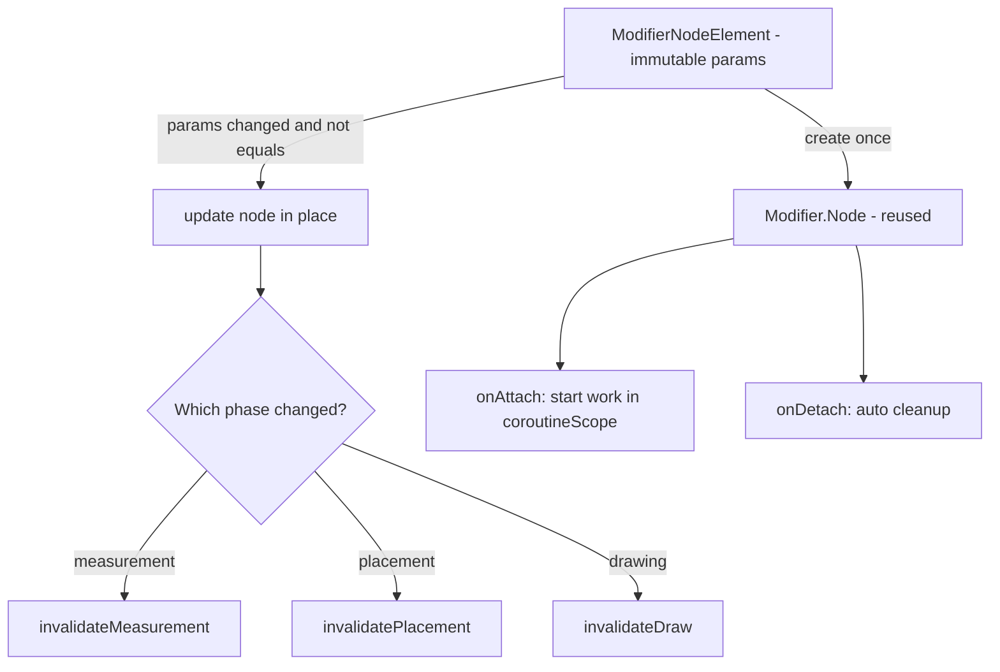
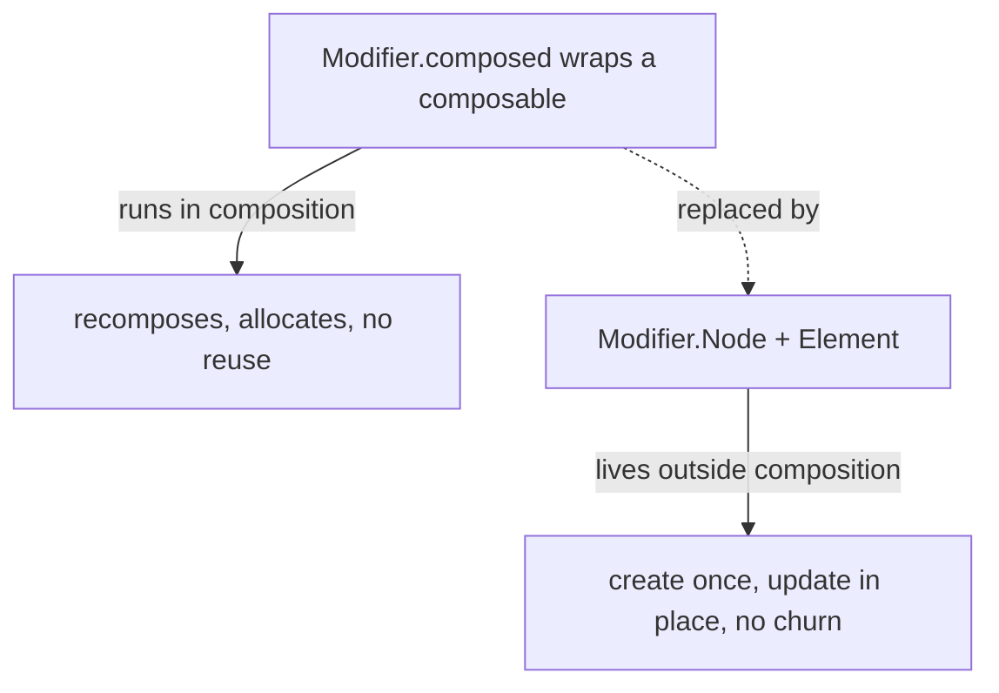

# Lesson 07 — Custom `Modifier.Node`

> After this lesson you can build a custom modifier the modern way — a `Modifier.Node` plus a `ModifierNodeElement` — implement layout and draw nodes, and explain why this replaced `Modifier.composed { }`.

**Module:** 05 · **Lesson:** 07 · **Level:** 🔴 · **Est. time:** 100–120 min

---

## 1. Concept

### 🟢 For beginners — *what is it and why do I care?*

You've been *using* modifiers (`padding`, `background`, `clickable`) and in [Module 04](../module-04-modifiers/README.md) you composed reusable ones by chaining existing modifiers. But how do `padding` and `background` *themselves* work? They're backed by small objects called **nodes** that plug into the layout and draw phases.

When you need a modifier that does something the built-ins don't — measure its child a custom way, draw a custom decoration, react to pointer events with state that survives recomposition — you write your **own** `Modifier.Node`. It's the lowest, fastest level of the modifier system: no recomposition just to apply the modifier, no per-frame allocations.

This is a senior-level lesson (🔴 throughout): you reach for it when a chained/composed modifier isn't efficient or capable enough.

### 🟡 For intermediate devs — *the mechanism*

A custom modifier the modern way is **two pieces**:

1. **A `Modifier.Node` subclass** — the long-lived object holding behavior and state. Depending on what it does, it implements one or more **node interfaces**:
   - `LayoutModifierNode` → override `measure(...)` to customize measurement/placement.
   - `DrawModifierNode` → override `ContentDrawScope.draw()` to draw.
   - `PointerInputModifierNode`, `SemanticsModifierNode`, `GlobalPositionAwareModifierNode`, etc.

2. **A `ModifierNodeElement<YourNode>`** — a lightweight, **immutable data holder** describing the modifier's *parameters*. Compose uses it to `create()` your node the first time and `update()` it (in place!) when parameters change. You expose it via an extension function so callers write `Modifier.yourThing(...)`.

```kotlin
fun Modifier.pad(all: Dp) = this then PadElement(all)          // public API

private data class PadElement(val all: Dp) : ModifierNodeElement<PadNode>() {
    override fun create() = PadNode(all)                       // first time
    override fun update(node: PadNode) { node.all = all }      // params changed → mutate in place
}

private class PadNode(var all: Dp) : Modifier.Node(), LayoutModifierNode {
    override fun MeasureScope.measure(measurable: Measurable, constraints: Constraints): MeasureResult {
        val px = all.roundToPx()
        val placeable = measurable.measure(constraints.offset(-2 * px, -2 * px))
        return layout(placeable.width + 2 * px, placeable.height + 2 * px) {
            placeable.place(px, px)
        }
    }
}
```

The split matters: the **Element** is recreated cheaply on every recomposition (it's just data), but the **Node** is *reused* and only **updated**, so its state survives and no new allocation happens per frame.

### 🔴 For senior devs — *trade-offs, edges, internals*

**Why `Modifier.Node` exists: `composed { }` was a performance trap.** The old `Modifier.composed { }` ran a *composable* to produce a modifier — meaning every such modifier participated in **composition**, couldn't be reused across recompositions, defeated `remember`-style skipping, and allocated. `Modifier.Node` moves modifier state **out of composition** entirely: nodes live in the UI node tree, are created once, updated in place, and never trigger recomposition just to exist. **Treat `Modifier.composed { }` as deprecated-in-spirit** ❌ — new modifiers should be `Modifier.Node`.

**`create()` vs `update()` is the whole performance story.** When parameters change, Compose calls `update(node)` on the **existing** node rather than creating a new one — your job is to mutate the node's fields and, if needed, **invalidate** the right phase:

- changed something affecting **measurement** → call `invalidateMeasurement()`
- changed something affecting **drawing** → call `invalidateDraw()`
- changed **placement** → `invalidatePlacement()`

Forgetting to invalidate after an `update()` is a classic bug: the field changes but the screen doesn't, because nothing told Compose to re-run that phase.

**`ModifierNodeElement` must implement `equals`/`hashCode` correctly.** Compose compares the new Element to the old one to decide *whether to call `update()` at all*. A `data class` gets this for free (✅ that's why we use one). If you hand-write an Element and botch `equals`, you either update too often (churn) or never (stale UI). This is the single most common correctness bug when writing nodes by hand.

**Nodes can do many things and coordinate.** A single node can implement several interfaces (e.g. `LayoutModifierNode` + `DrawModifierNode`). Nodes also have a **lifecycle** (`onAttach`/`onDetach`) and a `coroutineScope` for launching work tied to the node's attachment — the right place to register listeners or run animations, with automatic cleanup on detach (no leaks). They can read `CompositionLocal`s via `currentValueOf(...)` ([Module 07](../module-07-compositionlocal/README.md)) without being `@Composable`.

**`DrawModifierNode` draws around the content.** `ContentDrawScope.draw()` gives you `drawContent()` (paint the wrapped element) plus the full `DrawScope` API. Call `drawContent()` before your overlay (decorate on top) or after (draw a background behind). This is the node behind `Modifier.background`, `border`, `drawBehind`, etc., and it draws in the **draw phase** with **no recomposition**.

**`LayoutModifierNode` is a one-child layout.** Its `measure(measurable, constraints)` measures the single wrapped element and returns a `MeasureResult` via `layout(w, h) { place(...) }` — same single-measure rule as Lesson 01/05, but for *one* child. This is how `padding`, `size`, `offset` are implemented.

**Delegation keeps nodes composable (the software kind).** A node can **delegate** to other nodes with `delegate(SomeNode())` — e.g. reuse a built-in pointer-input or semantics node inside yours instead of reimplementing it. This is how you compose behavior at the node level without inheritance gymnastics.

**Performance: prefer reading state in the node, in the right phase.** Because nodes live outside composition, a `Modifier.Node` that reads animated state in `measure`/`draw` (e.g. via a lambda) confines invalidation to that phase — the basis of high-performance animated modifiers ([Module 11](../module-11-performance/README.md)). Don't hoist into composition what a node can do in layout/draw.

### Analogy

**A factory robot vs. hiring a temp every shift.** `Modifier.composed { }` was hiring a brand-new temp worker for every recomposition shift — onboarding cost, no memory of yesterday. `Modifier.Node` is a permanent robot bolted to the line (`create()` once); when the spec changes you **reprogram** it in place (`update()`), it remembers its state, and it works in the layout/draw phases without re-onboarding. Cheaper, faster, no churn.

### Mental model

> **A custom modifier = an immutable `ModifierNodeElement` (the params) + a reusable `Modifier.Node` (the behavior/state). Compose `create()`s the node once and `update()`s it in place — so state survives and nothing recomposes just to apply the modifier. Remember to invalidate the phase you changed.**

### Real-world example

A **shimmer/skeleton modifier** (`Modifier.shimmer()`): a `DrawModifierNode` draws an animated gradient sweep over the content during loading. The animation runs in the node's `coroutineScope`, the draw happens in the draw phase, and toggling parameters calls `update()` + `invalidateDraw()` — no recomposition per frame, no allocation per frame. A second classic: a **custom `aspectRatio`/`padding`-like layout modifier** that the design system applies thousands of times, where the allocation-free node path actually matters.

---

## 2. Visual Learning

**ASCII — Element (data) vs Node (behavior), create then update:**
```text
   Modifier.shimmer(active = true)
        │
        ▼  (recomposition produces a NEW immutable Element each time — cheap)
   ShimmerElement(active=true)  ──equals?──▶ same as before?
        │ first time                         │ params changed
        ▼ create()                           ▼ update(node)  (MUTATE in place)
   ShimmerNode  ◀────────── reused ──────────┘   node.active = true; invalidateDraw()
   (long-lived, holds animation state, lives OUTSIDE composition)
        │
        ├─ LayoutModifierNode.measure(...)   ← layout phase (if it lays out)
        └─ DrawModifierNode.draw(...)         ← draw phase (no recomposition)
```

**Mermaid — node lifecycle & phases:**


**Mermaid — old vs new modifier authoring:**


**Illustration prompt (paste into an image generator):**
```text
Illustration: a factory line. On the left, a sad "temp worker" being re-hired every shift with an
onboarding clipboard (labeled "Modifier.composed: new each recomposition"). On the right, a sleek
permanent robot arm bolted to the line, a technician reprogramming it via a small panel labeled
"update()" while it keeps its memory chip glowing (labeled "state survives"). Two conveyor lanes
under the robot are labeled "layout phase" and "draw phase". Caption: "create once, reprogram in
place." Modern, vibrant, crisp labels, industrial lighting.
```

---

## 3. Code

### 🔴 Beginner (for this 🔴 lesson) — a layout modifier: custom padding

```kotlin
// Public API — callers just write Modifier.squarePadding(8.dp)
fun Modifier.squarePadding(all: Dp): Modifier = this then SquarePadElement(all)

// Element = immutable params. data class → correct equals/hashCode for free.
private data class SquarePadElement(val all: Dp) : ModifierNodeElement<SquarePadNode>() {
    override fun create(): SquarePadNode = SquarePadNode(all)
    override fun update(node: SquarePadNode) {
        node.all = all
        // No explicit invalidate needed here: changing a layout input that the node reads
        // in measure() triggers remeasure because the node is a LayoutModifierNode whose
        // measurement depends on this field. (When in doubt, call invalidateMeasurement().)
    }
    // Optional but recommended: name/props for the Layout Inspector.
    override fun InspectorInfo.inspectableProperties() {
        name = "squarePadding"; properties["all"] = all
    }
}

// Node = behavior + state. Implements LayoutModifierNode → it's a one-child layout.
private class SquarePadNode(var all: Dp) : Modifier.Node(), LayoutModifierNode {
    override fun MeasureScope.measure(
        measurable: Measurable,
        constraints: Constraints,
    ): MeasureResult {
        val px = all.roundToPx()
        // Shrink the child's available space by the padding on all sides…
        val childConstraints = constraints.offset(horizontal = -2 * px, vertical = -2 * px)
        val placeable = measurable.measure(childConstraints)
        // …then report a size that re-adds the padding, and place the child inset.
        val width = constraints.constrainWidth(placeable.width + 2 * px)
        val height = constraints.constrainHeight(placeable.height + 2 * px)
        return layout(width, height) { placeable.place(px, px) }
    }
}
```

**Explanation.** `squarePadding` is implemented exactly like the real `padding`: a `LayoutModifierNode` whose `measure` shrinks the child's constraints, measures the one child, then reports a larger size and insets the child. The `data class` Element gives correct `equals`/`hashCode`, so Compose only `update()`s the node when `all` actually changes.

**Common mistakes.**
```kotlin
// ❌ Using Modifier.composed { } for this → runs in composition, allocates, no reuse.
fun Modifier.squarePadding(all: Dp) = composed { /* … */ }   // deprecated-in-spirit ❌

// ❌ Hand-rolling the Element without equals/hashCode → updates every recomposition (churn)
//    or never (stale). Use a data class.
```

**Best practices.**
- Element is an immutable **`data class`** (free, correct `equals`/`hashCode`).
- Use `LayoutModifierNode.measure` for layout modifiers; respect the single-measure rule and coerce sizes.
- Add `inspectableProperties()` so the modifier shows up sensibly in tooling.

---

### 🔴 Intermediate — a draw modifier with animated state and proper invalidation

```kotlin
fun Modifier.underlineSweep(
    color: Color,
    progress: Float,   // 0f..1f — how much of the underline is drawn
): Modifier = this then UnderlineSweepElement(color, progress)

private data class UnderlineSweepElement(
    val color: Color,
    val progress: Float,
) : ModifierNodeElement<UnderlineSweepNode>() {
    override fun create() = UnderlineSweepNode(color, progress)
    override fun update(node: UnderlineSweepNode) {
        node.color = color
        node.progress = progress
        node.invalidateDraw()          // ← we changed a DRAW input → re-run draw, nothing else
    }
    override fun InspectorInfo.inspectableProperties() {
        name = "underlineSweep"; properties["color"] = color; properties["progress"] = progress
    }
}

private class UnderlineSweepNode(
    var color: Color,
    var progress: Float,
) : Modifier.Node(), DrawModifierNode {
    override fun ContentDrawScope.draw() {
        drawContent()                  // draw the wrapped content first…
        val y = size.height - 1.dp.toPx()
        drawLine(                      // …then our underline overlay, in the DRAW phase
            color = color,
            start = Offset(0f, y),
            end = Offset(size.width * progress.coerceIn(0f, 1f), y),
            strokeWidth = 2.dp.toPx(),
        )
    }
}
```

**Explanation.** A `DrawModifierNode` draws an underline whose length tracks `progress`. The decisive detail is `update()`: when `progress`/`color` change, we mutate the node and call **`invalidateDraw()`** so only the **draw** phase re-runs — no recomposition, no relayout. `drawContent()` paints the wrapped element; our line decorates on top.

**Common mistakes.**
```kotlin
// ❌ Mutating node fields in update() but NOT invalidating → field changes, screen doesn't.
override fun update(node: UnderlineSweepNode) { node.progress = progress }   // missing invalidateDraw()

// ❌ Calling invalidateMeasurement() for a pure draw change → needless remeasure (slower).
```

**Best practices.**
- After `update()`, invalidate **exactly the phase you changed**: `invalidateDraw` / `invalidateMeasurement` / `invalidatePlacement`.
- In `draw()`, decide whether to call `drawContent()` **before** (overlay) or **after** (background) your drawing.
- Keep draw allocation-free (no new `Paint`/`Path` per frame; hoist them as node fields).

---

### 🔴 Production — a stateful, attach-aware node (animation + cleanup + delegation)

```kotlin
/**
 * A shimmer modifier: animates a moving highlight across the content while `active`.
 * Production touches:
 *  - animation runs in the node's coroutineScope, started in onAttach, auto-cancelled on detach (no leaks)
 *  - draw-only invalidation; no recomposition per frame
 *  - paints are hoisted; nothing allocates in draw()
 *  - correct equals via data class so update() only fires on real param changes
 */
fun Modifier.shimmer(
    active: Boolean,
    highlight: Color = Color.White.copy(alpha = 0.3f),
): Modifier = this then ShimmerElement(active, highlight)

private data class ShimmerElement(
    val active: Boolean,
    val highlight: Color,
) : ModifierNodeElement<ShimmerNode>() {
    override fun create() = ShimmerNode(active, highlight)
    override fun update(node: ShimmerNode) = node.update(active, highlight)
    override fun InspectorInfo.inspectableProperties() {
        name = "shimmer"; properties["active"] = active
    }
}

private class ShimmerNode(
    private var active: Boolean,
    private var highlight: Color,
) : Modifier.Node(), DrawModifierNode {

    // Animatable progress (0..1), read in draw(). Mutating it invalidates draw via the loop below.
    private val progress = Animatable(0f)
    private var job: Job? = null

    override fun onAttach() {
        if (active) start()
    }

    fun update(active: Boolean, highlight: Color) {
        this.highlight = highlight
        if (active != this.active) {
            this.active = active
            if (active) start() else stop()
        }
        invalidateDraw()
    }

    private fun start() {
        job?.cancel()
        job = coroutineScope.launch {                 // tied to node attachment
            progress.snapTo(0f)
            while (isActive) {
                progress.animateTo(1f, animationSpec = tween(1200))
                progress.snapTo(0f)
            }
        }
    }

    private fun stop() { job?.cancel(); job = null }

    override fun onDetach() { stop() }                 // explicit; scope is also auto-cancelled

    override fun ContentDrawScope.draw() {
        drawContent()
        if (!active) return
        val x = size.width * progress.value            // reading progress.value here ties draw to it
        val band = size.width * 0.25f
        drawRect(
            brush = Brush.horizontalGradient(
                0f to Color.Transparent,
                0.5f to highlight,
                1f to Color.Transparent,
                startX = x - band,
                endX = x + band,
            ),
            size = size,
        )
    }
}
```

**Explanation.** The node owns the animation (`Animatable`), launches it in **`coroutineScope`** from `onAttach`, and **cancels on detach** — no leaks, no `LaunchedEffect`, no recomposition. `update()` reacts to `active`/`highlight` changes and calls `invalidateDraw()`. The gradient is drawn in the **draw phase** reading `progress.value`, so each animation tick re-runs only `draw()`. Everything heavy is hoisted; `draw()` allocates nothing per frame beyond the brush (hoist that too in a real impl).

**Common mistakes.**
```kotlin
// ❌ Driving the animation from a LaunchedEffect in a composable wrapper → recomposition churn,
//    and you lose the node's automatic attach/detach lifecycle. Keep it in the node's coroutineScope.

// ❌ Not cancelling the job on detach → coroutine leak (animation keeps running off-screen).

// ❌ Reading `active`/params only in create(), not update() → toggling active does nothing.
```

**Best practices.**
- Launch node work in **`coroutineScope`** from `onAttach`; cancel in `onDetach` (and rely on auto-cancel as a backstop).
- React to parameter changes in **`update()`** and invalidate the right phase.
- Hoist `Paint`/`Brush`/`Path` to node fields; keep `draw()`/`measure()` allocation-free.
- **Delegate** to existing nodes (`delegate(...)`) for pointer/semantics behavior instead of reimplementing.
- Don't reach for `Modifier.composed { }` — it's the legacy, slow path. ❌

---

## 4. Interview Questions

**🟢 Beginner**

1. *What are the two pieces of a modern custom modifier?*
   > A `ModifierNodeElement` (immutable data describing the modifier's parameters) and a `Modifier.Node` (the long-lived object holding behavior/state). Compose `create()`s the node from the element once and `update()`s it in place when params change.
2. *Which node interface do you implement to draw a custom decoration?*
   > `DrawModifierNode`, overriding `ContentDrawScope.draw()` — call `drawContent()` to paint the wrapped element, plus your own `DrawScope` calls before/after it.

**🟡 Intermediate**

3. *Why did `Modifier.Node` replace `Modifier.composed { }`?*
   > `composed { }` runs a composable to build the modifier, so it participates in composition: it can't be reused across recompositions, defeats skipping, and allocates. `Modifier.Node` keeps modifier state **out of composition** — created once, updated in place, working in layout/draw with no recomposition just to exist.
4. *What's the role of `create()` vs `update()`?*
   > `create()` builds the node the first time. `update(node)` mutates the **existing** node when the Element's params change (decided by the Element's `equals`), so state survives and nothing is re-allocated. After `update()`, you invalidate the phase you changed.

**🔴 Senior**

5. *You change a node field in `update()` but the screen doesn't refresh. Why?*
   > You didn't invalidate the affected phase. Changing a draw input requires `invalidateDraw()`; a measurement input `invalidateMeasurement()`; placement `invalidatePlacement()`. Mutating the field isn't enough — Compose must be told to re-run that phase.
6. *Why must a `ModifierNodeElement` implement `equals`/`hashCode` correctly, and how do you ensure it?*
   > Compose compares the new Element to the old to decide whether to call `update()`. Wrong `equals` → either constant churn (updates every recomposition) or stale UI (never updates). Use a **`data class`** so it's generated correctly.
7. *How should a node run an animation or register a listener safely?*
   > In the node's **`coroutineScope`**, started from `onAttach`, and cancelled in `onDetach` (the scope is also auto-cancelled on detach). This ties the work to the node's attachment lifecycle — no `LaunchedEffect`, no recomposition, no leaks. Reuse existing behavior via `delegate(...)`.

---

## 5. AI Assistant

**Prompt example (modern node, not composed):**
```text
Jetpack Compose (2026 BOM, Kotlin 2.x): implement Modifier.shimmer(active: Boolean) using the
MODERN Modifier.Node API — a ModifierNodeElement (data class for equals) + a DrawModifierNode.
Run the animation in the node's coroutineScope started from onAttach and cancel it on onDetach.
React to `active` changes in update() and call invalidateDraw(). Do NOT use Modifier.composed{}.
Hoist any Paint/Brush so draw() doesn't allocate per frame. Add inspectableProperties().
```

**AI workflow — where it helps on *this* topic.**
- ✅ Good for: scaffolding the Element/Node pair, the `LayoutModifierNode.measure` skeleton, the `DrawModifierNode.draw` body, and onAttach/onDetach wiring.
- ⚠️ Watch: models still emit **`Modifier.composed { }`**, forget **`invalidateDraw/Measurement`** after `update()`, hand-roll Elements **without `equals`**, leak coroutines (no cancel on detach), and allocate in `draw()`.

**Review workflow — map to this lesson's *Common Mistakes*:**
- Is it the **modern** API (Element + Node), not `Modifier.composed { }`? ❌ if composed.
- Is the Element a **`data class`** (correct `equals`/`hashCode`)?
- Does `update()` **invalidate the right phase**?
- Is node work in **`coroutineScope`** with **`onDetach`** cleanup (no leaks)?
- Are `measure()`/`draw()` **allocation-free** (paints/paths hoisted)?
- Single-measure rule respected in `LayoutModifierNode.measure`?

**Validation workflow — prove it actually works:**
1. **Compile & run**; toggle parameters (e.g. `active`) and confirm the node reacts (proves `update()` + invalidation).
2. **Layout Inspector**: confirm the modifier appears with your `inspectableProperties`, and that toggling params **doesn't recompose** the composable (only draw/measure re-runs).
3. **Leak check**: navigate away / detach the node and confirm the animation coroutine stops (log in `onDetach`).
4. **Allocation check**: record an allocation trace while animating; `draw()` should allocate ~nothing per frame.
5. **A/B the old way**: temporarily implement with `Modifier.composed { }` and compare recomposition counts to *see* why `Modifier.Node` wins.

> **AI drafts, you decide.** If a generated modifier uses `Modifier.composed { }` or skips `invalidateDraw()` after mutating state, it's the old/broken pattern — rewrite it as an Element + Node.

---

## Recap / Key takeaways

- A modern custom modifier = an immutable **`ModifierNodeElement`** (params) + a reusable **`Modifier.Node`** (behavior/state).
- Compose **`create()`s once** and **`update()`s in place** — so node state survives and nothing recomposes just to apply the modifier. Use a **`data class`** Element for correct `equals`.
- Implement **`LayoutModifierNode.measure`** for layout modifiers (one child, single-measure rule) and **`DrawModifierNode.draw`** for drawing (draw phase, `drawContent()` + your `DrawScope` calls).
- After `update()`, **invalidate the phase you changed**: `invalidateMeasurement` / `invalidatePlacement` / `invalidateDraw`.
- Run node work in the node's **`coroutineScope`** (start in `onAttach`, cancel in `onDetach`); **delegate** to reuse behavior.
- **`Modifier.composed { }` is the legacy, slow path** ❌ — it runs in composition and allocates. Prefer `Modifier.Node`.

---

🎉 **Module 05 complete.** You can now measure and place children yourself, query intrinsics, read constraints and geometry safely, build real custom layouts (flow, staggered, tabbed), reach for `SubcomposeLayout` only when a measurement must drive a composition, and author allocation-free custom modifiers the modern way.

➡️ Next: **[Module 06 — Side Effects](../module-06-side-effects/README.md)** — now that you can build custom layouts and nodes, learn to run coroutines, subscriptions, and one-shot work from composables safely, keyed correctly, with no leaks.
