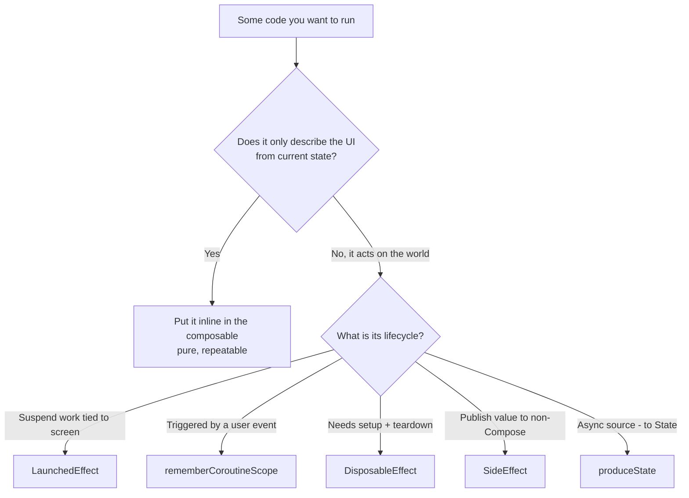

# Lesson 01 — Why Side Effects Exist

> After this lesson you can explain why composition must stay pure, what counts as a "side effect," and why Compose gives you a separate set of APIs to run them instead of letting you write them inline.

**Module:** 06 · **Lesson:** 01 · **Level:** 🟢🟡🔴 · **Est. time:** 60–75 min

---

## 1. Concept

### 🟢 For beginners — *what is it and why do I care?*

A **side effect** is anything your code does that reaches **outside** the function and is still there after the function returns: writing to a database, making a network call, showing a toast, starting a timer, logging an event, updating a variable that lives somewhere else.

In Jetpack Compose, your `@Composable` functions have one job: **describe what the UI should look like right now, given the current state.** That's it. They are *descriptions*, not *actions*. A `@Composable` is closer to a formula in a spreadsheet than to a button-click handler.

So where do the *actions* go — the network call that loads the feed, the analytics ping, the snackbar? They can't go directly in the composable body, because Compose may run that body **many times, in any order, or skip it entirely**. If you put "send analytics event" straight in the body, you'd send it 0, 1, or 17 times for a single screen view, and you'd never know which.

Compose solves this with a small family of **side-effect APIs** — `LaunchedEffect`, `DisposableEffect`, `SideEffect`, and friends — that say: *"run this action in a predictable, controlled way that's tied to the lifecycle of this composable, not to how often it happens to recompose."* This whole module is about those APIs.

> **The one rule:** describing the UI is free and repeatable; *doing* things is not. Doing things needs a side-effect API.

### 🟡 For intermediate devs — *the mechanism*

Composition is governed by a contract: **composable functions must be idempotent and free of side effects in the composition path.** Concretely, the Compose runtime reserves the right to:

- **Recompose frequently** — any state read can trigger a re-run, potentially on every frame during an animation.
- **Skip composition** — if inputs are unchanged and the function is skippable (Strong Skipping is on by default in 2026), the body doesn't run at all.
- **Run in any order** — sibling composables have no guaranteed execution order; don't depend on one running before another.
- **Run in parallel / on a different thread** — the runtime is allowed to compose off the main thread and to reuse or discard work.
- **Discard a composition** — work can be thrown away before it's ever applied to the screen.

Any code whose *correctness depends on running exactly once, in a specific order, on a specific thread* is therefore unsafe inline. That's the definition of "what must become a side effect."

The effect APIs give you back the guarantees composition took away:

| Need | API | Guarantee it restores |
|---|---|---|
| Run suspend work tied to composition | `LaunchedEffect` | Launches once on enter, cancels on leave, re-launches on key change |
| Launch work from a callback (not composition) | `rememberCoroutineScope` | A scope that lives as long as the composable |
| Register + clean up a listener | `DisposableEffect` | Setup on enter, teardown on leave/key-change |
| Publish a Compose value to non-Compose code | `SideEffect` | Runs after every *successful* composition |
| Turn an async source into `State` | `produceState` | A `State` backed by a coroutine |
| Observe Compose state as a Flow | `snapshotFlow` | A cold Flow of snapshot reads |

All of them are anchored to the composition lifecycle, so they start, restart, and clean up at the right times.

### 🔴 For senior devs — *trade-offs, edges, internals*

The deep reason composition must be pure is the **snapshot system** and the **positional memoization** model (full treatment in [Module 12 — Internals](../module-12-internals/README.md)). Composition records state *reads* to build a dependency graph; on a write, the `Recomposer` invalidates only the **restartable groups** that read the changed state. For that invalidation model to be correct, re-executing a group must produce the same description from the same inputs. A body that mutates external state breaks this: re-running it (which the runtime does freely) would re-apply the mutation, producing **non-deterministic, count-dependent behavior**.

Three subtleties that separate correct from "works on my machine":

- **"Effect" ≠ "I/O."** Even a pure-looking `var counter = 0; counter++` inside a composable is a side effect — it's observable mutation of state outside the snapshot. The danger isn't the network; it's *escaping the snapshot's control*. Reading the system clock, generating a random number, or `UUID.randomUUID()` in the composition path are all effects (they make the output non-idempotent).
- **Effects run in the apply phase, not the composition phase.** `LaunchedEffect`/`DisposableEffect` bodies don't execute during composition — they're recorded as "remembered" objects whose `onRemembered`/`onForgotten` callbacks fire when the composition is **applied** (committed) and disposed. This is why an effect never runs for a composition that gets discarded before commit. It also means the effect sees a *committed* tree, not a half-built one.
- **Order within effects is defined; order across composition isn't.** Multiple effects in the same composable run **top-to-bottom in source order** at apply time, and dispose in reverse order — that ordering *is* guaranteed, unlike sibling composition order. You can rely on it for setup/teardown sequencing.

The cost model also matters: an effect that re-launches on a key change **cancels and restarts** its coroutine. Choosing keys is therefore a *correctness and performance* decision (Lesson 02). Over-keying causes thrashing; under-keying causes stale captures (Lesson 05).

### Analogy

A **theater production**. The **script** (your composables) describes what the stage looks like in each scene — it can be read, re-read, and rehearsed any number of times without consequence. **Firing the prop gun, releasing the doves, triggering pyrotechnics** (side effects) must happen **exactly on cue, once** — you absolutely do not want them going off every time an actor merely *reads* their line. The **stage manager** (the effect APIs) calls those cues at precisely the right moment and makes sure the doves are recaptured (cleanup) when the scene ends.

### Mental model

> **Composition is a pure description that may run any number of times; a side effect is a real-world action that must run a controlled number of times. Never mix the two — hand the action to an effect API.**

### Real-world example

A **product detail screen**. Composing it — laying out the image, title, price, "Add to cart" button — happens repeatedly as you scroll, animate, and change state. But the **"viewed product" analytics event** must fire **once per visit**, the **inventory subscription** must open when you arrive and **close when you leave**, and tapping "Add to cart" must perform **one** network write. Each of those is a side effect with a different lifecycle, handled by a different API in this module.

---

## 2. Visual Learning

**ASCII — pure description vs. controlled action:**
```text
   COMPOSITION PATH (pure, may repeat)        EFFECT PATH (controlled, lifecycle-tied)
   ────────────────────────────────────        ─────────────────────────────────────────
   read state ─▶ build UI description           enter composition ─▶ start effect (once)
        ▲              │                                                   │
        │ recompose    ▼  (0..N times, any order)                         ▼ does real work
   write state ◀── describe again               leave composition ─▶ cancel / clean up
   (NO network, NO logging,                     (LaunchedEffect / DisposableEffect /
    NO mutation here)                            SideEffect / produceState …)
```

**Mermaid — deciding where code belongs:**


**Illustration prompt (paste into an image generator):**
```text
Illustration: a film set seen from above. On the left, a glowing translucent SCRIPT
labeled "Composition (pure description)" is being read over and over by a loop arrow —
calm, repeatable, no consequences. On the right, a STAGE MANAGER at a control desk
labeled "Effect APIs" presses single illuminated cue buttons that fire real events:
a dove flying (network call), a spotlight snapping on (analytics), a curtain closing
(cleanup). A thick dashed line separates the two worlds with the caption
"Describe freely · Act deliberately." Modern, vibrant, soft studio lighting, clear labels.
```

---

## 3. Code

> The next lessons teach each API in depth. Here we focus on the *boundary*: what belongs inline vs. what must move into an effect, and why.

### 🟢 Beginner — the classic "it ran 5 times" bug

```kotlin
@Composable
fun WelcomeScreen(userName: String) {
    // ✅ Pure description: reads state, builds UI. Safe to run any number of times.
    Text("Welcome back, $userName 👋")
}
```

**Explanation.** This composable only *describes* a `Text` from its input. Compose can run it 0..N times with no harm — there's no action escaping the function. This is what every composable body should look like.

**Common mistakes.**
```kotlin
// ❌ Side effect inline: fires on every recomposition — 0, 1, or many times.
@Composable
fun WelcomeScreen(userName: String) {
    analytics.log("welcome_shown", userName)   // runs unpredictably
    Text("Welcome back, $userName 👋")
}
```
You wanted "log once when the screen shows." Instead, this logs every time `WelcomeScreen` recomposes — which could be never (if skipped) or dozens of times (during animations elsewhere). The fix is `LaunchedEffect` (Lesson 02), which runs it exactly once on enter.

**Best practices.**
- A composable body should be readable as a *sentence about the UI*: "show this text." If it contains a verb like *log, fetch, save, open, start*, it probably needs an effect.
- When in doubt, ask: "If this runs 50 times this second, is that fine?" If not, it's a side effect.

---

### 🟡 Intermediate — recognizing hidden effects

```kotlin
@Composable
fun SessionBadge(sessionId: String) {
    // ✅ Derive display data purely from inputs — deterministic, no escape.
    val shortId = remember(sessionId) { sessionId.takeLast(6).uppercase() }
    AssistChip(onClick = {}, label = { Text("Session $shortId") })
}
```

**Explanation.** Slicing the id is a pure transformation, memoized with `remember(sessionId)` so it only recomputes when the input changes. Nothing leaves the function; the output depends solely on `sessionId`. This is safe to repeat.

**Common mistakes.**
```kotlin
// ❌ Non-deterministic reads in composition: the output isn't a function of inputs.
@Composable
fun SessionBadge(sessionId: String) {
    val openedAt = System.currentTimeMillis()      // different on every recomposition
    val token = UUID.randomUUID().toString()       // a new id each run — chaos
    Text("Opened at $openedAt ($token)")
}
```
Both `currentTimeMillis()` and `randomUUID()` make the composable's result depend on *when* it runs, not on its inputs. Every recomposition shows a different value, and there's no stable identity. Compute such values **once** in an effect or `remember`, or pass them in as state.

**Best practices.**
- Treat the clock, randomness, and any global mutable singleton as **inputs**, not things to read mid-composition. Capture them in `remember { … }` (once) or hoist them in.
- If a value must be "the time/id at the moment this screen opened," that's a `LaunchedEffect` writing to state — not an inline read.

---

### 🔴 Production — quarantining the effect from the description

```kotlin
@Composable
fun ProductDetailRoute(
    productId: String,
    vm: ProductViewModel = viewModel(),
) {
    val state by vm.uiState.collectAsStateWithLifecycle()

    // ✅ One-time, lifecycle-tied action — fires once per productId, not per recomposition.
    LaunchedEffect(productId) {
        vm.onProductViewed(productId)   // analytics + load, keyed to identity
    }

    // ✅ The rest is a pure description of `state`.
    ProductDetailScreen(state = state)
}
```

**Explanation.** The screen has exactly one side effect — recording the view and kicking off the load — and it lives in a `LaunchedEffect` keyed on `productId`. It runs once when the screen appears, and again only if you navigate to a *different* product (key change). Everything below is a pure render of `state`. The action and the description are cleanly separated, which is the entire point of this module.

**Common mistakes.**
```kotlin
// ❌ Effect logic smeared into the composition path + a "did I already run?" hack.
@Composable
fun ProductDetailRoute(productId: String, vm: ProductViewModel = viewModel()) {
    var loaded by remember { mutableStateOf(false) }
    if (!loaded) {                       // tries to fake "run once" by hand
        vm.onProductViewed(productId)    // still runs during composition — wrong thread/timing
        loaded = true                    // writing state during composition → extra recompose
    }
    ProductDetailScreen(state = vm.uiState.collectAsStateWithLifecycle().value)
}
```
The manual `loaded` flag is the anti-pattern `LaunchedEffect` exists to replace. It runs work *during* composition (no coroutine, wrong timing), mutates state mid-composition (triggering another recomposition), and doesn't re-run when `productId` changes. Let the effect API own the lifecycle.

**Best practices.**
- Keep composables a **pure function of state**; route every action through a keyed effect.
- Never invent a `hasRun`/`isInitialized` boolean to simulate "once" — that's a code smell that an effect API should own.
- Key effects on the **identity that should trigger a re-run** (here, `productId`), so navigation and reuse behave correctly.

---

## 4. Interview Questions

**🟢 Beginner**

1. *What is a "side effect" in Jetpack Compose?*
   > Any operation that escapes the composable and persists after it returns — network calls, logging, database writes, starting timers, mutating external variables. Composables should only *describe* UI; actions belong in effect APIs.
2. *Why can't you just call a network function directly inside a composable body?*
   > Because the body can run any number of times, in any order, or be skipped. A direct call would fire an unpredictable number of times. Effect APIs run the work a controlled number of times tied to the composition's lifecycle.

**🟡 Intermediate**

3. *Name three things the Compose runtime is allowed to do to a composable's execution, and what that implies for your code.*
   > It can recompose frequently, skip composition entirely (Strong Skipping), and run composables in any order or off the main thread. Implication: composable bodies must be idempotent and side-effect-free — correctness can't depend on run count, order, or thread.
4. *Why is reading `System.currentTimeMillis()` or `UUID.randomUUID()` directly in a composable a problem?*
   > It makes the output non-deterministic — a function of *when* it runs rather than its inputs. The value changes on every recomposition. Such values should be captured once (in `remember` or a `LaunchedEffect`) or passed in as state.

**🔴 Senior**

5. *When do `LaunchedEffect`/`DisposableEffect` bodies actually execute relative to composition?*
   > Not during the composition phase. They're recorded as remembered objects; their callbacks (`onRemembered`/`onForgotten`) fire when the composition is **applied/committed** and disposed. Consequently an effect never runs for a composition that's discarded before commit, and it observes a committed tree.
6. *A teammate uses a `var hasLoaded = false` flag inside a composable to "load data only once." What's wrong, and what's the correct approach?*
   > It runs work during composition (no coroutine, wrong timing/thread), mutates state mid-composition (causing an extra invalidation), and won't re-run when the relevant key changes. The correct approach is a `LaunchedEffect(key)` whose key is the identity that should retrigger the load — the runtime owns the once-and-restart semantics.
7. *Why must composition be pure for the snapshot/recomposition model to be correct?*
   > The runtime invalidates and re-executes restartable groups based on recorded state reads. For that to be sound, re-running a group from the same inputs must yield the same description. A body that mutates external state would re-apply its mutation on each re-run, producing count-dependent, non-deterministic results — breaking the model.

---

## 5. AI Assistant

**Prompt example (auditing a screen for inline effects):**
```text
Review this Compose screen for side effects in the composition path. For each line that
performs an action (network, logging, DB, mutation, reading clock/UUID), tell me which
effect API it should move to (LaunchedEffect / rememberCoroutineScope / DisposableEffect /
SideEffect / produceState) and why, keyed correctly. Target: Compose 2026 BOM, Kotlin 2.x,
Strong Skipping on. Don't add a ViewModel I didn't ask for.
[paste code]
```

**AI workflow — where it helps on *this* topic.**
- ✅ Great for: spotting inline side effects, explaining *why* a snippet is unsafe, suggesting the right API category, translating an imperative "do X on screen show" into the correct effect.
- ⚠️ Not yet: choosing the exact **keys** (a correctness call — see Lesson 02) or deciding whether something is truly one-shot vs. continuous. Models often "fix" an inline call by wrapping it in `LaunchedEffect(Unit)` even when a key is needed.

**Review workflow — check AI output against this lesson's *Common Mistakes*:**
- Is the composable body now a **pure description** — no `log/fetch/save/open` verbs left inline?
- Did it remove any `hasRun`/`isLoaded` flag hack in favor of a keyed effect?
- Did it stop reading the clock / random / globals mid-composition (captured once instead)?
- Did it avoid adding architecture (ViewModel, repository) you didn't request?

**Validation workflow — prove it actually works:**
1. **Compile & run.** Temporarily add `SideEffect { Log.d("recompose", "screen ran") }` and a counter in the effect to confirm the *action* fires the intended number of times while the *body* recomposes freely.
2. **Trigger recomposition** (rotate, type elsewhere, animate). The effect's count must **not** climb with recompositions.
3. **Change the key** (navigate to a different id). Confirm the effect re-runs exactly once.
4. **Layout Inspector → recomposition counts**: verify the body is cheap and repeatable; remove temporary logging before committing.

> **AI drafts, you decide.** If the model leaves an action in the composition path or papers over it with a manual flag, reject it — the whole module exists to keep actions out of the description.

---

## Recap / Key takeaways

- A **side effect** is any action that escapes the composable; **composition must stay pure** because it may run 0..N times, in any order, on any thread.
- The runtime can **recompose, skip, reorder, parallelize, and discard** — so correctness can't depend on run count, order, or thread.
- Reading the **clock, randomness, or mutable globals** mid-composition is a side effect too (non-deterministic output).
- Compose gives a **family of effect APIs** that restore the guarantees composition removed — each tied to the composition lifecycle.
- Never fake "run once" with a manual boolean flag; hand the action to a **keyed effect API**.

➡️ Next: **[Lesson 02 — `LaunchedEffect` & keys](02-launchedeffect-and-keys.md)** — running suspend work from composition, and exactly what re-launches when a key changes.
