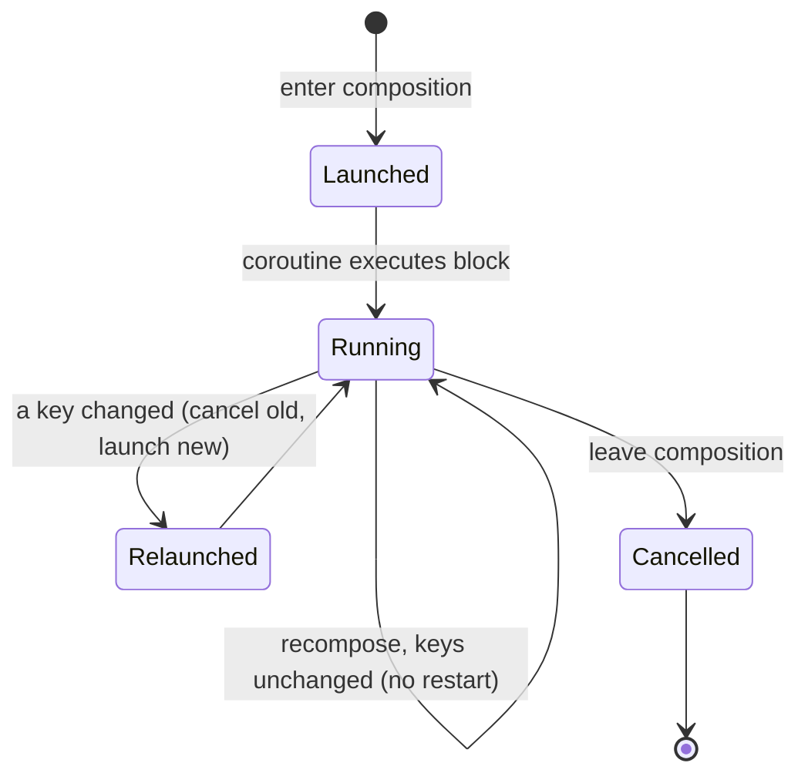
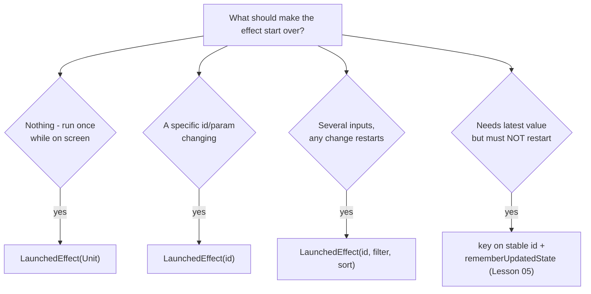

# Lesson 02 — `LaunchedEffect` & Keys

> After this lesson you can run suspend work from a composable safely, and predict exactly when `LaunchedEffect` keeps running, cancels, or re-launches based on its keys.

**Module:** 06 · **Lesson:** 02 · **Level:** 🟢🟡🔴 · **Est. time:** 75–90 min

---

## 1. Concept

### 🟢 For beginners — *what is it and why do I care?*

`LaunchedEffect` is how you run **suspend work** — a network call, a delay, collecting a Flow — from inside a composable, **safely**.

You learned in Lesson 01 that you can't just call work directly in the composable body. `LaunchedEffect` is the fix for the most common case: *"when this screen appears, start this coroutine; when the screen goes away, cancel it."*

It works like this:

- When the composable **enters** the screen, `LaunchedEffect` **launches a coroutine** running the block you give it.
- When the composable **leaves** the screen, that coroutine is **automatically cancelled**. No leaks, no manual cleanup.

```kotlin
LaunchedEffect(Unit) {
    delay(2000)
    showWelcomeToast()
}
```

The `Unit` in the parentheses is the **key**. Think of the key as "the reason to start over." With `Unit` (a constant), the effect launches **once** and never restarts as long as the composable stays on screen. That's the most common pattern.

### 🟡 For intermediate devs — *the mechanism*

`LaunchedEffect` does three things:

1. **Launches a coroutine** in a scope tied to the composition. The block is `suspend`, so you can call suspend functions and use `delay`, `withContext`, Flow `collect`, etc.
2. **Cancels** that coroutine when the composable leaves composition.
3. **Restarts** — cancels the old coroutine and launches a fresh one — **whenever any key changes** between recompositions.

The key(s) are the heart of it:

```kotlin
LaunchedEffect(userId) {          // restarts when userId changes
    val profile = repo.loadProfile(userId)
    state = profile
}
```

When `userId` changes from `"a"` to `"b"`, Compose **cancels** the in-flight load for `"a"` and **launches** a new one for `"b"`. This is exactly what you want: you never show user `"b"` with user `"a"`'s data, and the stale request is cancelled mid-flight.

Rules for keys:

- **Constant key (`Unit` / `true`)** → run once, never restart (until the composable leaves and re-enters).
- **State/parameter key** → restart whenever that value changes (by `equals`).
- **Multiple keys** → restart if *any* of them changes: `LaunchedEffect(userId, filter) { … }`.

The coroutine runs on the **main dispatcher by default** (the composition's context). Switch with `withContext(Dispatchers.IO)` for blocking work — though most well-written suspend libraries (Retrofit, Room) are already main-safe.

### 🔴 For senior devs — *trade-offs, edges, internals*

`LaunchedEffect` is `remember` + a coroutine launched in a `CoroutineScope` derived from the composition's `recomposeScope` context (it carries the composition's `Job` and the `AndroidUiDispatcher.Main` by default). The subtleties:

- **Restart = cancel-then-relaunch, not "continue."** On a key change the old coroutine is cancelled (a `CancellationException` propagates through your suspend points) *before* the new one starts. Any non-cancellation cleanup you need (e.g. releasing a resource the coroutine acquired) must be in a `finally` block, because cancellation unwinds through it. `DisposableEffect` (Lesson 04) is the better home when cleanup is the main concern.
- **Keys are compared with `equals`, so stability matters.** An **unstable** key (a lambda, a non-data class with default identity equality, a freshly-allocated list each recomposition) makes `LaunchedEffect` restart on *every* recomposition — silently re-running your network call in a loop. This is the #1 `LaunchedEffect` bug. Keys should be stable, value-like, and minimal.
- **Capturing changing values without restarting.** If your effect should *not* restart but still needs the latest value of a frequently-changing lambda/parameter, keying on it is wrong (it restarts) and *not* keying captures a stale value (closures capture the value at launch). The correct tool is `rememberUpdatedState` (Lesson 05) — key on the stable identity, read the changing value through the updated-state holder.
- **`LaunchedEffect` vs `rememberCoroutineScope`.** `LaunchedEffect` is for work driven by *composition/state* (start when this appears/changes). `rememberCoroutineScope` (Lesson 03) is for work driven by *events* (start when the user taps). Using `LaunchedEffect` to react to a button press is wrong — you'd have to flip a state flag to trigger it, which is awkward and re-entrant.
- **It does not survive configuration changes by itself.** On rotation the composition is recreated, so the effect re-launches. For work that must outlive the screen (a long upload), hoist it into a `ViewModel`/`viewModelScope` or WorkManager — `LaunchedEffect` is screen-scoped.
- **The block must be cancellation-cooperative.** A tight CPU loop without suspension points won't notice cancellation. Use `ensureActive()`/`yield()` in long synchronous stretches so a key change or screen exit can actually stop it.

### Analogy

A **kettle with an auto-shutoff tied to the room's motion sensor**. Walk into the kitchen (enter composition) and the kettle starts boiling (coroutine launches). Leave the kitchen (leave composition) and it shuts off automatically (cancellation) — no risk of boiling dry. And if you **swap in a different kettle** (the key changes), the old one is switched off and the new one starts fresh. You never babysit it; the sensor (the key + lifecycle) does.

### Mental model

> **`LaunchedEffect(key)` means: "run this coroutine while I'm on screen; if the key changes, cancel and start over." Choose the key as the exact thing that should make it start over — nothing more, nothing less.**

### Real-world example

A **profile screen** that loads `/users/{id}`. `LaunchedEffect(userId)` loads the profile; navigating from Alice to Bob changes `userId`, cancelling Alice's in-flight request and launching Bob's. A **splash screen** uses `LaunchedEffect(Unit) { delay(1500); onTimeout() }` — run once, auto-cancelled if the user backs out early.

---

## 2. Visual Learning

**ASCII — enter / key-change / leave:**
```text
   enter composition
        │
        ▼
   LaunchedEffect(userId)  ── launches ──▶  coroutine: load(userId="a")  ───┐
        │                                                                    │ in flight
   recompose, userId == "a" (unchanged) ── no restart, coroutine keeps going ┘
        │
   recompose, userId -> "b"  ── CANCEL load("a") ──▶ launch load("b")
        │
   leave composition  ── CANCEL coroutine ──▶ (gone, no leak)
```

**Mermaid — key-driven lifecycle:**


**Mermaid — choosing the key:**


**Illustration prompt (paste into an image generator):**
```text
Illustration: a relay-race track shaped like a loop. A runner labeled "coroutine" carries a
baton labeled with a KEY value ("userId = A"). When a hand swaps the baton to "userId = B",
the current runner immediately stops (a red CANCEL flag) and a fresh runner sprints from the
start line with the new baton. A glowing gate labeled "leave screen" at the edge stops any
runner who reaches it. Caption: "Key changes restart the race; leaving the screen ends it."
Modern, energetic, vibrant, clear labels, soft gradients.
```

---

## 3. Code

### 🟢 Beginner — run once on enter

```kotlin
@Composable
fun SplashScreen(onTimeout: () -> Unit) {
    // Runs once when SplashScreen appears; auto-cancelled if the user leaves early.
    LaunchedEffect(Unit) {
        delay(1500)
        onTimeout()
    }
    Box(Modifier.fillMaxSize(), contentAlignment = Alignment.Center) {
        Text("Loading…", style = MaterialTheme.typography.headlineMedium)
    }
}
```

**Explanation.** `LaunchedEffect(Unit)` launches the coroutine a single time on entry. `delay` is a suspend function — legal here because the block is a coroutine. If the user navigates away during the delay, the coroutine is cancelled and `onTimeout` never fires.

**Common mistakes.**
```kotlin
// ❌ No effect at all: delay() can't be called outside a coroutine → won't compile,
//    and even a blocking Thread.sleep here would freeze the UI thread.
@Composable
fun SplashScreen(onTimeout: () -> Unit) {
    Thread.sleep(1500)   // freezes composition / ANR
    onTimeout()
}
```
Blocking the composition thread freezes the UI and can ANR. Suspend work belongs in `LaunchedEffect`.

**Best practices.**
- Use `LaunchedEffect(Unit)` for genuine one-time, on-enter work (timers, one-shot navigation).
- Never block the thread (`Thread.sleep`, blocking I/O) in composition — suspend instead.

---

### 🟡 Intermediate — key on the identity that should restart

```kotlin
@Composable
fun ProfileScreen(userId: String, repo: ProfileRepository) {
    var ui by remember { mutableStateOf<ProfileUi>(ProfileUi.Loading) }

    LaunchedEffect(userId) {                         // restart only when userId changes
        ui = ProfileUi.Loading
        ui = runCatching { repo.loadProfile(userId) }
            .fold(
                onSuccess = { ProfileUi.Ready(it) },
                onFailure = { ProfileUi.Error(it.message ?: "Failed") },
            )
    }

    when (val s = ui) {
        ProfileUi.Loading  -> CircularProgressIndicator()
        is ProfileUi.Ready -> ProfileContent(s.profile)
        is ProfileUi.Error -> ErrorBanner(s.message)
    }
}

sealed interface ProfileUi {
    data object Loading : ProfileUi
    data class Ready(val profile: Profile) : ProfileUi
    data class Error(val message: String) : ProfileUi
}
```

**Explanation.** Keying on `userId` ties the load to identity: change the user and the in-flight request is cancelled and a fresh one starts, guaranteeing the UI never shows mismatched data. The result drives a sealed `ProfileUi`, so loading/ready/error are coherent.

**Common mistakes.**
```kotlin
// ❌ Constant key when the data depends on userId → loads the FIRST user forever.
LaunchedEffect(Unit) {
    ui = ProfileUi.Ready(repo.loadProfile(userId))   // never reloads when userId changes
}

// ❌ Unstable key (new lambda each recomposition) → restarts every recomposition.
LaunchedEffect(onResult = { /* ... */ }) { /* lambda is a fresh object each time */ }
```
A constant key under-reacts (stale data when the param changes); an unstable key over-reacts (network call in a loop). Both are key-selection bugs.

**Best practices.**
- Key on **exactly** the value(s) whose change should restart the work — usually ids/params, not lambdas.
- Reset transient UI (`Loading`) at the top of the effect so the user sees the new load begin.

---

### 🔴 Production — multiple keys, cancellation-safe, main-safety, latest-callback

```kotlin
@Composable
fun SearchResultsRoute(
    query: String,
    filter: Filter,
    onResultClicked: (Result) -> Unit,
    repo: SearchRepository,
) {
    var ui by remember { mutableStateOf<SearchUi>(SearchUi.Idle) }

    // The click handler may change identity often; capture the LATEST without restarting.
    val latestOnClick by rememberUpdatedState(onResultClicked)   // Lesson 05

    // Restart whenever the *meaningful* inputs change: query OR filter.
    LaunchedEffect(query, filter) {
        if (query.isBlank()) { ui = SearchUi.Idle; return@LaunchedEffect }
        ui = SearchUi.Loading
        try {
            // Heavy/parse work off the main thread; repo suspend fns are main-safe but we
            // make intent explicit for the CPU-bound mapping step.
            val results = withContext(Dispatchers.Default) {
                ensureActive()                       // cooperate with cancellation
                repo.search(query, filter).map(::toResult)
            }
            ui = if (results.isEmpty()) SearchUi.Empty else SearchUi.Results(results)
        } catch (e: CancellationException) {
            throw e                                  // never swallow cancellation
        } catch (e: Exception) {
            ui = SearchUi.Error(e.message ?: "Search failed")
        }
    }

    SearchResultsContent(
        ui = ui,
        onClick = { latestOnClick(it) },             // always the freshest callback
    )
}
```

**Explanation.** The effect restarts on `query` **or** `filter` — the two inputs that define a search — cancelling stale searches automatically. CPU-bound mapping runs on `Dispatchers.Default` with `ensureActive()` so a cancellation actually stops it. `CancellationException` is **re-thrown**, never caught as a generic error (swallowing it breaks structured concurrency). The frequently-changing click lambda is read through `rememberUpdatedState`, so a new lambda identity doesn't pointlessly restart the search.

**Common mistakes.**
```kotlin
// ❌ Swallowing cancellation: turns a normal restart into a bogus "error" state.
} catch (e: Exception) {           // catches CancellationException too!
    ui = SearchUi.Error(e.message ?: "…")
}

// ❌ Keying on the lambda to "get the latest", which restarts the search on every recompose.
LaunchedEffect(query, filter, onResultClicked) { … }
```
Catching `Exception` without re-throwing `CancellationException` makes every key change flash an error. Keying on a callback re-runs the network call whenever the parent recomposes.

**Best practices.**
- List **all** inputs that should restart the effect as keys; nothing that shouldn't.
- **Re-throw `CancellationException`** (or catch `Exception` *after* a `is CancellationException -> throw e` branch); never report it as a failure.
- Use `withContext` + `ensureActive()`/`yield()` to stay main-safe and cancellation-cooperative.
- Capture frequently-changing callbacks with `rememberUpdatedState` instead of keying on them.

---

## 4. Interview Questions

**🟢 Beginner**

1. *What does `LaunchedEffect` do, in one sentence?*
   > It launches a coroutine when the composable enters composition and cancels it when the composable leaves — so you can run suspend work safely.
2. *What does `LaunchedEffect(Unit) { … }` mean?*
   > Run the block once on entry and don't restart it (the key never changes) until the composable leaves and re-enters. It's the standard "do this once when the screen appears" pattern.

**🟡 Intermediate**

3. *What happens when a `LaunchedEffect` key changes between recompositions?*
   > The currently running coroutine is **cancelled**, and a new coroutine is launched with the new key value. This is how you cancel a stale request and start a fresh one when, say, an id changes.
4. *Why is keying a `LaunchedEffect` on a freshly-created lambda a bug?*
   > A new lambda is a different object each recomposition, so the key "changes" every time by `equals`, causing the effect to cancel and relaunch on every recomposition — re-running the work in a loop. Key on stable values instead.

**🔴 Senior**

5. *You need an effect that runs once but always calls the latest version of a frequently-changing callback. How do you achieve that without restarting the effect?*
   > Key the effect on a stable identity (e.g. `Unit` or an id), and wrap the callback in `rememberUpdatedState`. Inside the effect, read it through the updated-state holder so you always invoke the current lambda, while the effect itself never restarts.
6. *Why must you re-throw `CancellationException` inside a `LaunchedEffect`'s try/catch?*
   > Cancellation is the normal mechanism by which the runtime stops the coroutine on key change or screen exit. Swallowing it breaks structured concurrency and turns a routine restart into a spurious error state. Catch it and re-throw (or exclude it from your generic `catch`).
7. *Does `LaunchedEffect` survive a configuration change, and where should long-lived work go?*
   > No — on rotation the composition is recreated and the effect re-launches. Work that must outlive the screen (long uploads, downloads) belongs in `viewModelScope` (survives config changes) or WorkManager (survives process death). `LaunchedEffect` is screen-scoped.

---

## 5. AI Assistant

**Prompt example (getting keys right):**
```text
Write a Compose screen that loads a user profile by `userId` using a suspend repo.
Use LaunchedEffect with the CORRECT key so that: (a) it loads once on enter, (b) it cancels
the in-flight request and reloads when userId changes, (c) it does NOT restart when an
unrelated onClick lambda changes. Handle loading/error with a sealed UiState and re-throw
CancellationException. Target: Compose 2026 BOM, Kotlin 2.x. No ViewModel.
```

**AI workflow — where it helps on *this* topic.**
- ✅ Good for: scaffolding the `LaunchedEffect` + sealed `UiState`, wiring loading/error, writing the suspend call.
- ⚠️ Watch: models frequently use `LaunchedEffect(Unit)` when a param key is required (stale data), key on lambdas/lists (restart loops), and `catch (e: Exception)` over `CancellationException` (spurious errors).

**Review workflow — map to this lesson's *Common Mistakes*:**
- Is the **key** exactly the identity that should restart the work — not `Unit` when a param matters, not a lambda/new list?
- Is `CancellationException` **re-thrown** (not reported as an error)?
- Are frequently-changing callbacks captured via `rememberUpdatedState` instead of keyed?
- Is CPU-bound work on a background dispatcher and cancellation-cooperative (`ensureActive`/`yield`)?

**Validation workflow — prove it actually works:**
1. **Compile & run.** Load a profile; confirm it appears once.
2. **Change the key** (navigate id A → B). Confirm A's request is cancelled (add a temporary log in the repo) and B loads exactly once.
3. **Cause unrelated recompositions** (rotate, type elsewhere). Confirm the effect does **not** re-run (counter in the effect stays flat).
4. **Leave mid-load.** Confirm cancellation fires and no result is applied to a dead screen (no crash, no leaked job — verify with the coroutine debugger if needed).

> **AI drafts, you decide.** The model writes the coroutine; *you* own the key. A wrong key is the difference between "loads once" and "hammers the API every frame."

---

## Recap / Key takeaways

- `LaunchedEffect` runs a **coroutine tied to composition**: launches on enter, cancels on leave.
- The **key is the reason to restart**: a key change cancels the running coroutine and launches a new one. `Unit` = run once.
- **Unstable keys** (lambdas, fresh lists) cause restart-every-recomposition loops — the most common bug.
- **Re-throw `CancellationException`**; keep work main-safe and cancellation-cooperative.
- For "latest value without restart," use `rememberUpdatedState`; for event-driven work, use `rememberCoroutineScope`; for work outliving the screen, use `viewModelScope`/WorkManager.

➡️ Next: **[Lesson 03 — `rememberCoroutineScope`](03-remembercoroutinescope.md)** — launching coroutines from callbacks and user events, not from composition.
